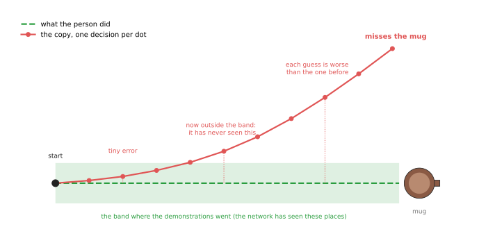
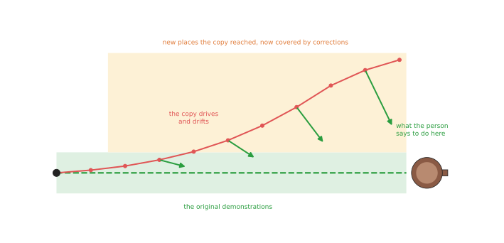
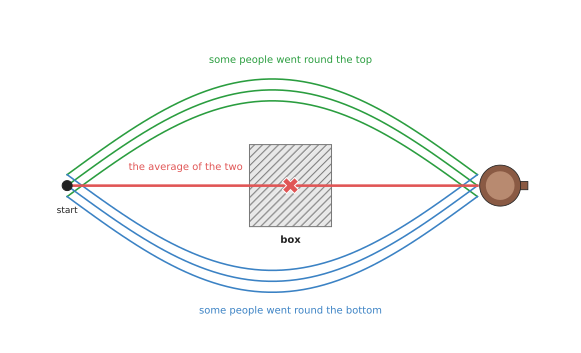

# Behaviour cloning

[The chapter overview](../01_overview.md) said that most learned policies on a robot
arm today are built from models that copy a person. This page explains behaviour
cloning, which is the simplest of those models, and the base for the two pages that
follow. A person does the task many times while the robot records everything, and a
neural network then learns to copy what the person did at each moment.

The page answers five questions, in the order you would meet them while building
such a policy. What goes into a behaviour cloning model, and what comes out? How
does the model learn, and how much recording does it need? What goes wrong when
you use it on a real arm? And why would you choose it over writing the motion by
hand?

It is for a reader who has read [the chapter overview](../01_overview.md), and who
knows what a policy, an observation and an action are. If you have not read
[how a model learns](../../01_what-models-are/02_how-a-model-learns.md), then read
that page first, because this one uses its idea of a model making a guess, being
told the right answer, and adjusting.

## Contents

1. [What behaviour cloning is](#1-what-behaviour-cloning-is)
2. [What goes in and what comes out](#2-what-goes-in-and-what-comes-out)
3. [How it works inside](#3-how-it-works-inside)
4. [How it is trained](#4-how-it-is-trained)
5. [Well-known models of this kind](#5-well-known-models-of-this-kind)
6. [A worked example: picking up a mug](#6-a-worked-example-picking-up-a-mug)
7. [What goes wrong](#7-what-goes-wrong)
   · [Small mistakes add up](#small-mistakes-add-up)
   · [Two good ways become one bad way](#two-good-ways-become-one-bad-way)
   · [Other problems](#other-problems)
8. [Telling the policy what to do: goals and many tasks](#8-telling-the-policy-what-to-do-goals-and-many-tasks)
   · [Three ways to give the goal](#three-ways-to-give-the-goal)
   · [Why the goal must be an input](#why-the-goal-must-be-an-input)
   · [One policy for many tasks](#one-policy-for-many-tasks)
   · [Hindsight relabelling](#hindsight-relabelling)
   · [Where it fails, and the tools](#where-it-fails-and-the-tools)
9. [Why behaviour cloning, and what it costs](#9-why-behaviour-cloning-and-what-it-costs)
10. [The written alternative](#10-the-written-alternative)
11. [Where to read next](#11-where-to-read-next)
12. [Using it in Python](#12-using-it-in-python)

---

## 1. What behaviour cloning is

The introduction called behaviour cloning the simplest way to teach an arm, so
this section says what the two words themselves mean. Behaviour cloning means
training a network to copy what a person did in each situation.

Here is an everyday example of the same thing. Imagine you are learning to make
tea by watching a friend, and you never ask them to explain the rules. Instead
you watch what they do at each moment: the kettle has boiled, so they pour, and
the cup is full, so they stop. Later you make tea yourself by doing what they
did in the same situation.

Behaviour cloning works the same way, but the situation is what the robot's
cameras see and where its joints are. The thing to copy is the move that the
person made next from that situation.

A few words are needed for this, and all three of them come back later on the
page.

- A **demonstration** is one recording of a person doing the task once, from start
  to finish, and people also call it an **episode**.
- **Teleoperation** means a person controls the robot from a distance, with some
  kind of controller, and it is the most common way to record demonstrations. The
  robot's own sensors then record exactly what the robot did.
- The **demonstrator** is the person who does the task during recording.

The word "cloning" means making a copy, so the name says that the model tries to
make a copy of the demonstrator's behaviour.

---

## 2. What goes in and what comes out

Section 1 said what behaviour cloning copies, and this section says which
numbers the model actually reads and writes. A behaviour cloning model is a
policy, so it turns an observation into an action.

For a robot arm, the observation usually has two parts. The first part is one or
more camera pictures, taken at this moment, and the second part is the arm's
current joint angles, read from the sensors in each joint.

The action is what the arm should do next, and it is usually written in one of
two ways.

- The joint angles the arm should move to next, which is six numbers for a
  six-joint arm.
- How far the gripper should move, forwards and back, left and right, up and down,
  and how much it should turn.

Either way, one more number says how open or closed the gripper should be.

A demonstration is recorded as a long list of moments, often 10 to 50 moments a
second. At each moment the recording holds the pictures, the joint angles, and
the move the person made next. The picture below shows four such moments, from a
recording of someone picking up a mug.


Each column of the drawing is one moment. The picture and the joint angles are
the question, and the green box is the answer that the network must learn to
give.

This is the key point of the whole page. The recording is cut into many small
question-and-answer pairs, and each pair says "in this situation, the person did
this". So the network never sees the task as a whole, and it only ever sees many
separate moments.

---

## 3. How it works inside

Section 2 described the numbers going in and out, and this section follows them
through the network itself. A behaviour cloning model is an ordinary neural
network with three parts, and the data flows through them in order.

1. **The picture part.** The camera picture goes into a network that is good at
   pictures, which is often a **convolutional neural network (CNN)**, a kind of
   network that looks at small patches of the picture at a time. A common choice is
   ResNet, which is a well-known CNN. This part turns the picture into a list of a
   few hundred numbers, and those numbers describe what is in the picture, such as
   where the mug is.
   [Inside a neural network](../../01_what-models-are/03_inside-a-neural-network.md)
   explains how this works.
2. **Joining.** The list of numbers from the picture is joined onto the joint
   angles, so that one single list now describes the whole situation.
3. **The deciding part.** A few more layers of the network turn that list into the
   action numbers, which are the next joint angles and the gripper opening.

Training works as it does for any other network. For each question-and-answer
pair the network makes a guess, and that guess is compared with the move the
person actually made. The difference between them is called the **loss**. For
example, if the network guessed 62 degrees and the person moved to 63 degrees,
then the loss for that joint is 1 degree. The training program then nudges every
number inside the network a tiny amount, so that the next guess is a little
closer. It does this over and over, for every pair, many times.

When training is finished, the network is run on the robot, where it takes the
live camera picture and joint angles and gives an action. The arm makes that
move, and then the network takes the next picture and gives the next action.

Some versions also give the network the last few pictures, and not just the
current one. This helps it tell whether the arm is moving up or down, which a
single picture cannot show.

---

## 4. How it is trained

Section 3 described the network, and this section describes the data it is
trained on. The data is a set of demonstrations of one task, and there are three
common ways to record them.

- **Leader and follower arms.** The person moves a small copy of the robot arm by
  hand, and the real arm copies each joint angle. This is how the ALOHA system
  records its data, and
  [the next page](02_action-chunking-transformers.md#5-aloha-and-lerobot) describes
  it.
- **A handheld controller or a virtual reality headset.** The person moves a
  controller in the air, and the robot's gripper follows it.
- **Moving the arm by hand.** Some arms let you push them around directly while they
  record, and this is called **kinesthetic teaching**. It is simple, but your hand
  is then in the camera picture, and the robot will not see a hand when it runs on
  its own.

How many demonstrations are needed for one task? For one narrow task, such as
picking up one mug from different places on a table, people usually record from a
few dozen to a few hundred. The more the task varies, the more demonstrations it
needs, and the page
[where the data comes from](../../01_what-models-are/05_where-the-data-comes-from.md)
explains how people collect data at a larger scale.

Training a small behaviour cloning policy on one graphics card usually takes
hours rather than days. So the recording usually takes longer than the training
does.

It helps a great deal if the demonstrations are consistent with each other. If
the demonstrator sometimes pauses, sometimes hesitates, and sometimes goes a
different way, then the network gets mixed answers for the same question. A
study called robomimic, which is listed below, found that data from one skilled
demonstrator trained better policies than data from a mix of more and less
skilled demonstrators.

---

## 5. Well-known models of this kind

Section 4 described how the data is recorded, and people have been recording
data like this for a long time, because behaviour cloning is an old idea. These
are some well-known examples, from oldest to newest.

- **ALVINN** (Autonomous Land Vehicle In a Neural Network) was built at Carnegie
  Mellon University at the end of the 1980s. It watched a person drive a van, and
  learned to choose the steering direction from a camera picture of the road, which
  makes it one of the first examples of behaviour cloning with a neural network.
- **DAgger** (Dataset Aggregation), from 2011, is not a network but a way of
  collecting data. The trained policy drives, and a person says what they would have
  done in the places the policy reaches, and section 7 shows why this helps.
- **robomimic**, from 2021, is a careful study of behaviour cloning on robot arms.
  It compared many versions on the same tasks and data, and it showed which details
  matter most, such as the quality of the demonstrations and whether the network
  sees past moments.
- **BC-Z**, from Google in 2021, trained one behaviour cloning policy on about a
  hundred tasks, and it was told which task to do with a sentence or a video of a
  person doing it.
- **RT-1** (Robotics Transformer 1), from Google in 2022, trained one policy on
  about 130,000 demonstrations of more than 700 tasks, collected with a fleet of
  robots. So it showed that behaviour cloning can cover many tasks if the data is
  large enough.
- **Implicit Behavioural Cloning** (2021) and **Behavior Transformers** (2022) are
  two ways to fix the averaging problem described in section 7. The first of them
  scores many possible actions and picks the best, while the second sorts the
  actions into groups and picks a group first.

The newer policies on the next two pages are also behaviour cloning, because
they copy demonstrations in the same way. They differ only in what they give
back, and those differences are what fix the problems described below.

---

## 6. A worked example: picking up a mug

The models in section 5 are large ones, so this section walks through a small
example instead, from recording to failure. Say you want an arm to pick up a mug
from a table and put it on a shelf, where the mug can be anywhere in a square
about 30 cm wide. There is one camera above the table and one camera on the
arm's wrist.

First you record demonstrations, using a leader arm to drive the robot. Each
time you put the mug in a new place in the square, and turn it a little. You
record 100 demonstrations, and each one takes about 10 seconds. So at 30 moments
a second, that is about 300 moments per demonstration, and 30,000
question-and-answer pairs in total.

Next you train, and the network sees each pair many times. It learns that when
the mug is on the left in the top camera picture, the arm moves left. It also
learns that when the mug fills the wrist camera picture, the gripper closes.

Then you run it, by putting the mug down and starting the policy. It takes a
picture, chooses a small move, and repeats. If the mug is in a place close to
where you put it during recording, then the arm will very likely pick it up.

Now you test the edges of what it knows. You put the mug outside the square, or
put a second mug next to it, or turn on a different light. Each of these makes
the pictures look unlike anything in the recordings. The policy still gives an
action, because a policy always does, but the action may be wrong. So the next
section explains why this happens, and what people do about it.

---

## 7. What goes wrong

The worked example ended with a policy that failed at the edges, and this
section explains the two main problems behind that. Both of them come from the
fact that the network learns single moments, and not the task as a whole.

### Small mistakes add up

Every guess the network makes is a little bit wrong, which is normal for any
trained model. But a small mistake moves the arm to a place that is slightly
different from anywhere the demonstrator went. In that new place the pictures
look slightly unfamiliar, so the next guess is a little worse. That puts the arm
somewhere even less familiar, and the guess after that is worse again.

This is called **compounding error**, because "compounding" means that each
error builds on the one before it.



The green band shows where the demonstrations went. Once the red copy leaves
that band, the network is guessing about places it has never seen, so the drift
gets faster.

There are three common fixes, and the third one leads to the next page.

The first fix is to record demonstrations that include small mistakes and their
corrections, so that the network has already seen what to do when the arm is
slightly off.

The second fix is DAgger, where you let the trained policy drive the arm itself.
When it drifts, a person says what they would do from that exact spot, and those
answers are added to the data. Then the policy is trained again, so the new data
covers exactly the places the policy actually reaches.



The green arrows are the person's corrections, and they cover the yellow area,
which the original demonstrations never reached.

The third fix is to make fewer decisions in the first place. If the network chooses
a whole burst of moves at once, then it makes far fewer guesses during the task, so
there are fewer chances for mistakes to add up. This is the idea behind
[action chunking transformers](02_action-chunking-transformers.md).

### Two good ways become one bad way

The first problem came from the arm drifting, and the second one comes from
people doing the same thing in different ways.

Say there is a box on the table between the arm and the mug. Sometimes the
demonstrator goes round the left of the box, and sometimes they go round the
right, and both ways are fine.

But the network is trained to make its guess as close as possible to the
recorded answer. So when the same situation has two different answers, the guess
that is closest to both on average is the one in the middle. In this case the
middle is straight through the box.



The green and blue paths are both good ways round the box, while the red path is
their average, and it hits the box.

People say that the data has more than one **mode**, which means more than one
typical answer. A plain behaviour cloning network can only give one answer, so it
blends the modes together. The fix is a model that can hold several answers and pick
one of them cleanly, and
[diffusion and flow policies](03_diffusion-and-flow-policies.md) are the most common
way to do that today.

### Other problems

The two problems above belong to behaviour cloning itself, but the problems
below are shared with the other policies in this chapter.

- **The camera must stay where it was.** If the camera moves a few centimetres, then
  the pictures look different, so the policy may fail. The answer is to keep the
  cameras fixed, or to record with the camera in several positions.
- **It cannot say "I don't know".** A policy always gives an action, even in a
  situation it has never seen, so something outside the policy has to watch for
  trouble and stop the arm.
- **It knows nothing about collisions.** The policy has no list of obstacles, and it
  only avoids the table because the demonstrations did. So a separate safety layer
  has to keep the arm out of places it must not go.
- **It learns one task.** A policy trained to pick up a mug knows nothing about
  opening a drawer. One policy can learn several tasks if it is told which one to
  do, as [the next section](#8-telling-the-policy-what-to-do-goals-and-many-tasks)
  shows. But tasks that chain many steps still need something above the policy to
  choose the next step.

---

## 8. Telling the policy what to do: goals and many tasks

So far the policy has been given only what it sees, and it then does the one
task it was trained on. This section shows how to tell a policy which task to
do, so that one policy can do several of them. It also shows a method that turns
aimless recordings into useful training data.

A **goal-conditioned policy** is a policy that is given the goal as part of its
observation, and "conditioned" here means "depends on". So the same picture of
the table can lead to different moves, depending on which goal is given.

Here is an everyday example of the difference. A taxi driver at a crossroads
does not always turn left, because where they turn depends on where the
passenger asked to go. The road is the same, but the destination changes the
answer. So a goal-conditioned policy matches the driver who is told the
destination, while a plain policy matches the driver who has only ever driven
one route.

### Three ways to give the goal

Now that the goal is part of the observation, the next question is how the goal
is written down. There are three common ways to tell a policy what the goal is,
and the picture below shows each one, for a scene with a mug and two bins.


Each of the three goals says the same thing, which is that the mug should end up
in the blue bin. The policy gets one of them, next to the live camera picture.

- **A goal picture.** This is a photo of how the scene should look at the end, and
  it goes through the same kind of seeing network as the camera picture. It needs no
  words, and it can show exactly where something should go. But someone has to make
  the photo, which usually means doing the task once first.
- **A task number.** Each task gets a number, and the policy is given that number.
  The number is usually written as a **one-hot list**, which is a list with one
  place per task, all zeros except a 1 in the place of the chosen task. So
  [0, 1, 0, 0] means "task 2 of 4". This is the simplest of the three ways, but the
  policy cannot do a task that has no number yet.
- **A sentence**, such as "Put the mug in the blue bin". A pretrained language model
  turns the sentence into a list of numbers first, and RT-1 used a model called the
  Universal Sentence Encoder for this. A sentence can put known words together in a
  new way, such as "the red bin" when training only said "red cup" and "blue bin".
  But whether the policy then does the right thing is not guaranteed. The
  [language models chapter](../../07_language-models/01_overview.md) takes this
  much further.

### Why the goal must be an input

The three ways above all feed the goal into the policy, so it is worth asking
why the goal has to go in at all. Why not train one policy per task, or train
one policy on all the tasks without telling it which one?

The second idea fails for the reason given in
[two good ways become one bad way](#two-good-ways-become-one-bad-way). If the same
picture sometimes leads to the red bin and sometimes to the blue bin, then a plain
policy learns the average of the two. The picture below shows this happening with a
real fit.


The faint lines are 40 recorded demonstrations, of which half go to the red bin at
(−25, 45) cm and half go to the blue bin at (25, 45) cm. The script for this page
fitted the simplest possible policy to them, with the method of
[least-squares fitting](../../../06_programming-techniques/04_fitting-and-estimation/02_most-used/01_least-squares-fitting.md).
The policy says how far to move, given where the mug is. On the left, the policy
was given only where the mug is, so it ends at (−1.1, 44.8) cm, between the bins and
in neither of them. On the right it was also given a one-hot goal, and when it is
asked for red it ends at (−25.1, 45.0) cm, while asked for blue it ends at
(25.0, 44.7) cm.

So the goal removes the mixed answers, because each situation then has only one
right move again. A real policy is a large network rather than a straight-line
fit, but the effect is the same.

### One policy for many tasks

Once the goal is an input, one policy can be trained on the recordings of many
tasks at once. This is called **multi-task training**.

It helps in two ways. The first is sharing, because picking up a mug, picking up
a cup and picking up a bowl all start with the same reach and the same grip. The
policy learns those shared parts from all the recordings together, so each task
needs fewer recordings of its own. The second is convenience, because there is
one policy to train, store and run, instead of dozens of them.

It also has a cost. Tasks that look alike can get mixed up, so a policy trained
on many tasks is sometimes a little worse at each one than a policy trained on
that task alone. The usual answer to that is more data, and a larger network.

BC-Z, from 2021, trained one policy on about a hundred tasks, and gave it the goal
as a sentence or as a video of a person doing the task. RT-1, from 2022, went
further, to more than 700 tasks, and both of them are listed in
[section 5](#5-well-known-models-of-this-kind).

### Hindsight relabelling

Multi-task training needs recordings of every task, and recording them all is
slow. So there is a method that turns recordings which failed, or which had no
task at all, into good training data. It is called **hindsight relabelling**,
because "hindsight" means looking back after something has happened.

The idea is simple. A recording that was meant to reach one place, but reached
another, is still a perfect demonstration of how to reach the place it did
reach. So you change its label: you take the place where the recording ended,
and you call that its goal.


On the left are eight attempts to reach the star. The script made them with some
randomness, so only one of the eight ends within 5 cm of the star, which means
that seven of them are useless as demonstrations of "reach the star". On the
right, each path's own end point is its goal. So all eight are now correct
demonstrations, each one of reaching its own goal.

This is how people use unscripted **play data**. A person moves the robot around
freely for a while, opening drawers, pushing blocks and picking things up, with
no task in mind. Afterwards the recording is cut into short pieces, and the last
picture of each piece becomes that piece's goal picture. So one hour of play
gives thousands of goal-conditioned examples, without anyone deciding the tasks
in advance. This was shown by the paper Learning from Play (Lynch and others,
2019), and the same idea in reinforcement learning is called Hindsight
Experience Replay, from 2017.

### Where it fails, and the tools

Goals and multi-task training bring faults of their own, and these are the
common ones, each with the sign you would see.

- **The policy ignores the goal.** It does the same thing whatever you ask for, and
  this happens when each scene in the training data was almost always recorded with
  one task. The policy can then guess the task from the picture alone, so it never
  learns to read the goal. The fix is to record different tasks in the same scene.
- **A goal picture says too much.** The photo also shows where every other object
  is, and the light at the time, so the policy may try to match all of it. People
  therefore use goal pictures that show only the part that matters, or they use a
  sentence instead.
- **A task number cannot grow.** A new task needs a new number, and the policy has
  never seen it. So only a sentence or a picture can describe a task the policy was
  not trained on.
- **Relabelled data is only as good as the play.** The paths in play data wander, so
  a policy trained on them reaches the goal, but not always by the shortest way.
  People therefore mix in some clean demonstrations.

Several tools support all of this directly. LeRobot stores a task sentence with each
recording, and its larger policies, such as SmolVLA and π0, take that sentence as
input. The
[vision-language-action models](../../07_language-models/02_most-used/01_vision-language-action-models.md)
page describes those policies. Book 3's
[foundation models document](../../../03_frameworks/08_frontier/02_foundation-models.md#4-physical-intelligence-and-the-pi-models)
describes π0.7, which is given a sentence, a goal picture and labels describing how
to do the task, all at once.

---

## 9. Why behaviour cloning, and what it costs

The sections above described how behaviour cloning works and where it fails, and
this section weighs it against the alternatives. It helps to look at behaviour
cloning through four questions: what it is, what it does for you, why you would
pick it over the obvious alternative, and what it costs.

Behaviour cloning is a neural network trained to copy the move a person made in
each recorded situation.

It lets you teach the arm a task by doing that task, instead of by writing it
down. So you do not need to measure the mug's position, write rules about where
to grasp, or plan a path, and you do not need a simulator or a scoring rule
either.

The obvious alternative is to program the motion by hand, where you would find
the mug with a seeing model, work out a grasp, and send the arm there with a
motion planner. That is the better choice when the objects are rigid, their
shape is known, and the task is always the same, because it is easier to check
and it does the same thing every time. Behaviour cloning is the better choice
when the task is easier to show than to describe. Folding a towel, wiping a
spill, and opening a stiff drawer are all examples of that, because there is no
simple rule for them, but a person can do them easily.

The other alternative is reinforcement learning, where the arm learns by trying.
That needs a scoring rule and millions of tries, usually in a simulator, and
behaviour cloning needs neither of those. So if you can do the task yourself,
copying is much cheaper.

The cost is in the data, and in what you cannot check. You have to record
demonstrations, and you have to record them carefully, because the policy only
works in situations like the ones you recorded. When it fails, it cannot tell
you why, so the usual answer is to record more data. It also cannot promise to
avoid collisions. And plain behaviour cloning has the two problems in section 7,
which is why most real systems use one of the improved versions on the next
pages.

---

## 10. The written alternative

Section 9 named programming the motion by hand as the obvious alternative, so this
section says which code you would actually write. The written way to do the same job
is to find the object, plan a route to it, and move the arm along that route, and
Book 5 covers the three parts of that. [Sampling-based
planning](../../../06_programming-techniques/06_planning-and-search/02_most-used/01_sampling-based-planning.md)
finds a route that hits nothing. [Trajectory
generation](../../../06_programming-techniques/07_control-and-motion/02_most-used/02_trajectory-generation.md)
turns the route into smooth targets for each joint, and [PID
control](../../../06_programming-techniques/07_control-and-motion/02_most-used/01_pid-control.md)
makes each joint follow them. Book 3's [programmed
methods](../../../03_frameworks/04_one-arm-training/02_programmed-methods.md) shows
how these parts are put together on one arm.

The written way is the better one when the objects are rigid, their shape is
known, and the task is the same every time. This is because it can be checked
before it runs, and it does the same thing on every run. Behaviour cloning is
the better one when the task is easier to show than to describe, such as folding
a towel or wiping a spill.

---

## 11. Where to read next

The next page, [action chunking transformers](02_action-chunking-transformers.md),
shows how choosing a burst of moves at once reduces the adding-up of small
mistakes. Then the page after it,
[diffusion and flow policies](03_diffusion-and-flow-policies.md), shows how to keep
two good ways of doing a task apart.

To compare copying with learning by trial, read
[reinforcement learning policies](../03_also-used/01_reinforcement-learning-policies.md). And to go
back to the list of all the kinds, read [the chapter overview](../01_overview.md).

For more on where demonstrations come from, read
[where the data comes from](../../01_what-models-are/05_where-the-data-comes-from.md),
and for the rigs people use to record them, read Book 3's
[data and demonstration page](../../../03_frameworks/08_frontier/03_data-and-demonstration.md).
For a more critical account of behaviour cloning, with published numbers, read
[section 1 of learned methods for one arm](../../../03_frameworks/04_one-arm-training/03_learned-methods.md#11-behaviour-cloning).
Its section on
[interactive imitation](../../../03_frameworks/04_one-arm-training/03_learned-methods.md#12-interactive-imitation-correcting-it-as-it-goes)
explains DAgger and its modern versions.

---

## 12. Using it in Python

Section 4 said that training a behaviour cloning policy is the plainest kind of
supervised learning: show the network an observation, compare its action with the
person's, adjust. This section writes that out in Python, because behaviour cloning
is short enough to see all of at once. After reading it you will know how little code
the method is, and therefore where the real work of a behaviour cloning project
goes.

The data comes from [LeRobot](https://github.com/huggingface/lerobot), whose
`LeRobotDataset` class reads a recorded dataset and behaves like an ordinary PyTorch
dataset, so a standard training loop works on it. Everything below except the two
import lines is code you would write yourself.

```python
import torch
from torch import nn
from lerobot.datasets import LeRobotDataset

dataset = LeRobotDataset("lerobot/svla_so101_pickplace")
loader = torch.utils.data.DataLoader(dataset, batch_size=64, shuffle=True)

state_dim = dataset.features["observation.state"]["shape"][0]
action_dim = dataset.features["action"]["shape"][0]
net = nn.Sequential(nn.Linear(state_dim, 256), nn.ReLU(), nn.Linear(256, action_dim))
optimizer = torch.optim.Adam(net.parameters(), lr=1e-4)

for batch in loader:
    loss = nn.functional.mse_loss(net(batch["observation.state"]), batch["action"])
    loss.backward()
    optimizer.step()
    optimizer.zero_grad()
```

Those four lines in the loop are the whole of behaviour cloning. That is worth
seeing, because it shows that the method is not where the difficulty lies.

It is also worth being honest about what this particular network cannot do. It reads
only `observation.state`, the arm's own joint positions, and it never looks at the
camera pictures, so it will learn to repeat the average path of the demonstrations
and it will not react to where the mug actually is. A policy that works needs the
pictures too, which means a convolutional or transformer encoder in front of those
linear layers, and it needs the rescaling of every input and output into the range
the network expects. LeRobot does not ship a plain behaviour cloning policy for this
reason: its packaged imitation policies are ACT, diffusion and VQ-BeT, which are the
next two pages, and each of them is a fuller behaviour cloning model rather than a
different method. If you want plain behaviour cloning already built, with the camera
encoder and the recurrent version included,
[robomimic](https://github.com/ARISE-Initiative/robomimic) is the library for it, and
it is driven by a configuration file, as in
`python robomimic/scripts/train.py --config robomimic/exps/templates/bc.json
--dataset <my-file>.hdf5`.

So what the library gives you is the data format, the loading, and the statistics of
the dataset. What you have to write is the network, the encoder for the pictures, the
rescaling and the evaluation. And what you have to collect is the demonstrations,
which cannot be downloaded for your task. `lerobot/svla_so101_pickplace` above is a
real dataset, but it is a real dataset of somebody else's arm, in somebody else's
room, with their cameras in their positions. A policy trained on it will not work on
your arm, and section 7 explained why: the pictures your cameras produce are unlike
anything in those recordings, so the policy is guessing outside what it knows from
the first frame onwards. Recording your own fifty or hundred demonstrations, with a
leader arm, over an evening, is the job. The five lines above are not.

The decision that costs the most later is what you vary while recording. The policy
works where you showed it and nowhere else, so the range of object positions, the
lighting and the camera placement in your recordings become the limits of the
finished policy. Widening them afterwards means recording again.
