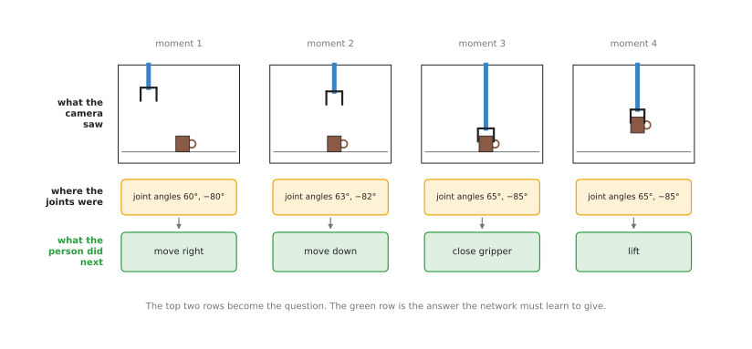
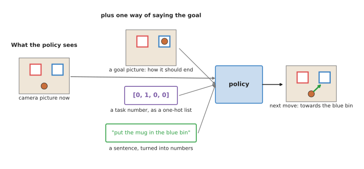
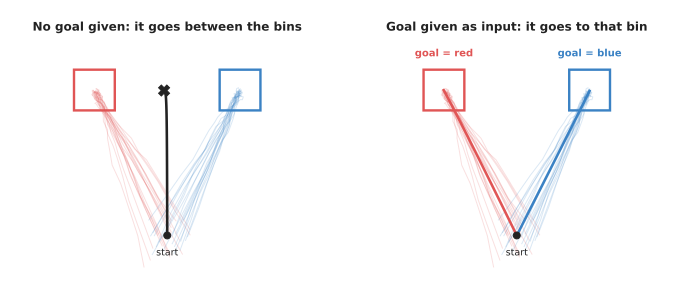
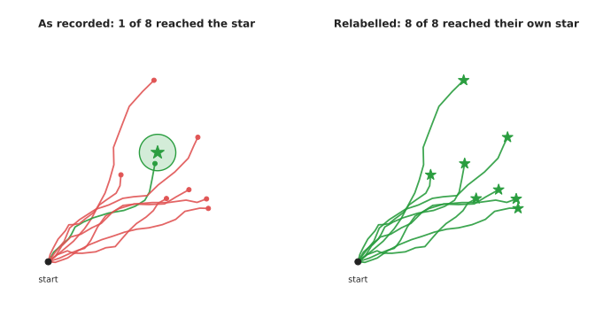

# Behaviour cloning

[The chapter overview](../01_overview.md) said that most learned policies on a robot
arm today are built from models that copy a person. This page explains behaviour
cloning, which is the simplest of those models, and the base for the two pages that
follow. A person does the task many times while the robot records everything, and a
neural network then learns to copy what the person did at each moment.

The page answers these questions, in the order you would meet them while building
such a policy. What goes into a behaviour cloning model, and what comes out? How
does the model learn, and how much recording does it need? How do you tell one
policy to do more than one task? And which real models do this, and which of them
should you start with?

It is for a reader who has read [the chapter overview](../01_overview.md), and who
knows what a policy, an observation and an action are. If you have not read
[how a model learns](../../01_what-models-are/02_how-a-model-learns.md), then read
that page first, because this one uses its idea of a model making a guess, being
told the right answer, and adjusting.

## Contents

1. [What behaviour cloning is](#1-what-behaviour-cloning-is)
2. [What goes in and what comes out](#2-what-goes-in-and-what-comes-out)
3. [How it works inside](#3-how-it-works-inside)
4. [How it is trained](#4-how-it-is-trained)
5. [Telling the policy what to do: goals and many tasks](#5-telling-the-policy-what-to-do-goals-and-many-tasks)
6. [Well-known models of this kind](#6-well-known-models-of-this-kind)
   · [6.1 ALVINN, the method with nothing added](#61-alvinn-the-method-with-nothing-added)
   · [6.2 robomimic, if you want plain behaviour cloning](#62-robomimic-if-you-want-plain-behaviour-cloning)
   · [6.3 ACT in LeRobot, the one to start with](#63-act-in-lerobot-the-one-to-start-with)
   · [6.4 DAgger, which is now a command](#64-dagger-which-is-now-a-command)
   · [6.5 SmolVLA, if fifty recordings are not enough](#65-smolvla-if-fifty-recordings-are-not-enough)
   · [6.6 How to choose](#66-how-to-choose)
7. [Where to read next](#7-where-to-read-next)

---

## 1. What behaviour cloning is

The introduction called behaviour cloning the simplest way to teach an arm, so
this section says what the two words themselves mean. Behaviour cloning means
training a network to copy what a person did in each situation.

Here is an everyday example of the same thing. Imagine you are learning to make
tea by watching a friend, and you never ask them to explain the rules. Instead
you watch what they do at each moment: the kettle has boiled, so they pour, and
the cup is full, so they stop. Later you make tea yourself by doing what they
did in the same situation.

Behaviour cloning works the same way, but the situation is what the robot's
cameras see and where its joints are. The thing to copy is the move that the
person made next from that situation.

A few words are needed for this, and all three of them come back later on the
page.

- A **demonstration** is one recording of a person doing the task once, from start
  to finish, and people also call it an **episode**.
- **Teleoperation** means a person controls the robot from a distance, with some
  kind of controller, and it is the most common way to record demonstrations. The
  robot's own sensors then record exactly what the robot did.
- The **demonstrator** is the person who does the task during recording.

The word "cloning" means making a copy, so the name says that the model tries to
make a copy of the demonstrator's behaviour.

---

## 2. What goes in and what comes out

Section 1 said what behaviour cloning copies, and this section says which
numbers the model actually reads and writes. A behaviour cloning model is a
policy, so it turns an observation into an action.

For a robot arm, the observation usually has two parts. The first part is one or
more camera pictures, taken at this moment, and the second part is the arm's
current joint angles, read from the sensors in each joint.

The action is what the arm should do next, and it is usually written in one of
two ways.

- The joint angles the arm should move to next, which is six numbers for a
  six-joint arm.
- How far the gripper should move, forwards and back, left and right, up and down,
  and how much it should turn.

Either way, one more number says how open or closed the gripper should be.

A demonstration is recorded as a long list of moments, often 10 to 50 moments a
second. At each moment the recording holds the pictures, the joint angles, and
the move the person made next. The picture below shows four such moments, from a
recording of someone picking up a mug.



Each column of the drawing is one moment. The picture and the joint angles are
the question, and the green box is the answer that the network must learn to
give.

This is the key point of the whole page. The recording is cut into many small
question-and-answer pairs, and each pair says "in this situation, the person did
this". So the network never sees the task as a whole, and it only ever sees many
separate moments.

---

## 3. How it works inside

Section 2 described the numbers going in and out, and this section follows them
through the network itself. A behaviour cloning model is an ordinary neural
network with three parts, and the data flows through them in order.

1. **The picture part.** The camera picture goes into a network that is good at
   pictures, which is often a **convolutional neural network (CNN)**, a kind of
   network that looks at small patches of the picture at a time. A common choice is
   ResNet, which is a well-known CNN. ResNet is a part inside the policies named in
   section 5 rather than a policy of its own, which is why it is not one of the rows
   there. This part turns the picture into a list of a few hundred numbers, and those
   numbers describe what is in the picture, such as where the mug is.
   [Inside a neural network](../../01_what-models-are/03_inside-a-neural-network.md)
   explains how this works.
2. **Joining.** The list of numbers from the picture is joined onto the joint
   angles, so that one single list now describes the whole situation.
3. **The deciding part.** A few more layers of the network turn that list into the
   action numbers, which are the next joint angles and the gripper opening.

Training works as it does for any other network. For each question-and-answer
pair the network makes a guess, and that guess is compared with the move the
person actually made. The difference between them is called the **loss**. For
example, if the network guessed 62 degrees and the person moved to 63 degrees,
then the loss for that joint is 1 degree. The training program then nudges every
number inside the network a tiny amount, so that the next guess is a little
closer. It does this over and over, for every pair, many times.

When training is finished, the network is run on the robot, where it takes the
live camera picture and joint angles and gives an action. The arm makes that
move, and then the network takes the next picture and gives the next action.

Some versions also give the network the last few pictures, and not just the
current one. This helps it tell whether the arm is moving up or down, which a
single picture cannot show. The recurrent policy called BC-RNN, in
[section 5.2](#62-robomimic-if-you-want-plain-behaviour-cloning), is this idea
written out: it remembers the last few moments instead of judging each one alone.

These three parts are the shape that every model in
[section 5](#6-well-known-models-of-this-kind) is built on, and each one there
changes a part or adds to it. ALVINN, in
[section 5.1](#61-alvinn-the-method-with-nothing-added), is the shape at its
simplest, because its three layers take the picture and give back the steering
direction with nothing added. The plain behaviour cloning in robomimic, in
[section 5.2](#62-robomimic-if-you-want-plain-behaviour-cloning), is the same shape
with the surrounding program written for you. ACT, in
[section 5.3](#63-act-in-lerobot-the-one-to-start-with), replaces the deciding part
with a transformer that gives back a run of future commands instead of one, and
[the next page](02_action-chunking-transformers.md) is about that change. SmolVLA,
in [section 5.5](#65-smolvla-if-fifty-recordings-are-not-enough), adds a further
input, which is a sentence saying which task to do, and it arrives with its numbers
already trained. DAgger, in
[section 5.4](#64-dagger-which-is-now-a-command), changes none of this, because it
alters where the training pairs come from rather than the network.

---

## 4. How it is trained

Section 3 described the network, and this section describes the data it is
trained on. The data is a set of demonstrations of one task, and there are three
common ways to record them.

- **Leader and follower arms.** The person moves a small copy of the robot arm by
  hand, and the real arm copies each joint angle. This is how the ALOHA system
  records its data, and
  [the next page](02_action-chunking-transformers.md#5-aloha-and-lerobot) describes
  it.
- **A handheld controller or a virtual reality headset.** The person moves a
  controller in the air, and the robot's gripper follows it.
- **Moving the arm by hand.** Some arms let you push them around directly while they
  record, and this is called **kinesthetic teaching**. It is simple, but your hand
  is then in the camera picture, and the robot will not see a hand when it runs on
  its own.

How many demonstrations are needed for one task? For one narrow task, such as
picking up one mug from different places on a table, people usually record from a
few dozen to a few hundred. The more the task varies, the more demonstrations it
needs, and the page
[where the data comes from](../../01_what-models-are/05_where-the-data-comes-from.md)
explains how people collect data at a larger scale.

Training a small behaviour cloning policy on one graphics card usually takes
hours rather than days. So the recording usually takes longer than the training
does.

It helps a great deal if the demonstrations are consistent with each other. If
the demonstrator sometimes pauses, sometimes hesitates, and sometimes goes a
different way, then the network gets mixed answers for the same question. A
study called robomimic, which is listed below, found that data from one skilled
demonstrator trained better policies than data from a mix of more and less
skilled demonstrators.

---

## 5. Telling the policy what to do: goals and many tasks

So far the policy has been given only what it sees, and it then does the one
task it was trained on. This section shows how to tell a policy which task to
do, so that one policy can do several of them. It also shows a method that turns
aimless recordings into useful training data.

A **goal-conditioned policy** is a policy that is given the goal as part of its
observation, and "conditioned" here means "depends on". So the same picture of
the table can lead to different moves, depending on which goal is given.

Here is an everyday example of the difference. A taxi driver at a crossroads
does not always turn left, because where they turn depends on where the
passenger asked to go. The road is the same, but the destination changes the
answer. So a goal-conditioned policy matches the driver who is told the
destination, while a plain policy matches the driver who has only ever driven
one route.

### Three ways to give the goal

Now that the goal is part of the observation, the next question is how the goal
is written down. There are three common ways to tell a policy what the goal is,
and the picture below shows each one, for a scene with a mug and two bins.



Each of the three goals says the same thing, which is that the mug should end up
in the blue bin. The policy gets one of them, next to the live camera picture.

- **A goal picture.** This is a photo of how the scene should look at the end, and
  it goes through the same kind of seeing network as the camera picture. It needs no
  words, and it can show exactly where something should go. But someone has to make
  the photo, which usually means doing the task once first.
- **A task number.** Each task gets a number, and the policy is given that number.
  The number is usually written as a **one-hot list**, which is a list with one
  place per task, all zeros except a 1 in the place of the chosen task. So
  [0, 1, 0, 0] means "task 2 of 4". This is the simplest of the three ways, but the
  policy cannot do a task that has no number yet.
- **A sentence**, such as "Put the mug in the blue bin". A pretrained language model
  turns the sentence into a list of numbers first, and RT-1 used a model called the
  Universal Sentence Encoder for this. A sentence can put known words together in a
  new way, such as "the red bin" when training only said "red cup" and "blue bin".
  But whether the policy then does the right thing is not guaranteed. The
  [language models chapter](../../07_language-models/01_overview.md) takes this
  much further.

### Why the goal must be an input

The three ways above all feed the goal into the policy, so it is worth asking
why the goal has to go in at all. Why not train one policy per task, or train
one policy on all the tasks without telling it which one?

The second idea fails for the reason given in
two good ways become one bad way. If the same
picture sometimes leads to the red bin and sometimes to the blue bin, then a plain
policy learns the average of the two. The picture below shows this happening with a
real fit.



The faint lines are 40 recorded demonstrations, of which half go to the red bin at
(−25, 45) cm and half go to the blue bin at (25, 45) cm. The script for this page
fitted the simplest possible policy to them, with the method of
[least-squares fitting](../../../06_programming-techniques/04_fitting-and-estimation/02_most-used/01_least-squares-fitting.md).
The policy says how far to move, given where the mug is. On the left, the policy
was given only where the mug is, so it ends at (−1.1, 44.8) cm, between the bins and
in neither of them. On the right it was also given a one-hot goal, and when it is
asked for red it ends at (−25.1, 45.0) cm, while asked for blue it ends at
(25.0, 44.7) cm.

So the goal removes the mixed answers, because each situation then has only one
right move again. A real policy is a large network rather than a straight-line
fit, but the effect is the same.

### One policy for many tasks

Once the goal is an input, one policy can be trained on the recordings of many
tasks at once. This is called **multi-task training**.

It helps in two ways. The first is sharing, because picking up a mug, picking up
a cup and picking up a bowl all start with the same reach and the same grip. The
policy learns those shared parts from all the recordings together, so each task
needs fewer recordings of its own. The second is convenience, because there is
one policy to train, store and run, instead of dozens of them.

It also has a cost. Tasks that look alike can get mixed up, so a policy trained
on many tasks is sometimes a little worse at each one than a policy trained on
that task alone. The usual answer to that is more data, and a larger network.

BC-Z, from 2021, trained one policy on about a hundred tasks, and gave it the goal
as a sentence or as a video of a person doing the task. RT-1, from 2022, went
further, to 700 tasks.

### Hindsight relabelling

Multi-task training needs recordings of every task, and recording them all is
slow. So there is a method that turns recordings which failed, or which had no
task at all, into good training data. It is called **hindsight relabelling**,
because "hindsight" means looking back after something has happened.

The idea is simple. A recording that was meant to reach one place, but reached
another, is still a perfect demonstration of how to reach the place it did
reach. So you change its label: you take the place where the recording ended,
and you call that its goal.



On the left are eight attempts to reach the star. The script made them with some
randomness, so only one of the eight ends within 5 cm of the star, which means
that seven of them are useless as demonstrations of "reach the star". On the
right, each path's own end point is its goal. So all eight are now correct
demonstrations, each one of reaching its own goal.

This is how people use unscripted **play data**. A person moves the robot around
freely for a while, opening drawers, pushing blocks and picking things up, with
no task in mind. Afterwards the recording is cut into short pieces, and the last
picture of each piece becomes that piece's goal picture. So one hour of play
gives thousands of goal-conditioned examples, without anyone deciding the tasks
in advance. This was shown by the paper Learning from Play (Lynch and others,
2019), and the same idea in reinforcement learning is called Hindsight
Experience Replay, from 2017.

### Where it fails, and the tools

Goals and multi-task training bring faults of their own, and these are the
common ones, each with the sign you would see.

- **The policy ignores the goal.** It does the same thing whatever you ask for, and
  this happens when each scene in the training data was almost always recorded with
  one task. The policy can then guess the task from the picture alone, so it never
  learns to read the goal. The fix is to record different tasks in the same scene.
- **A goal picture says too much.** The photo also shows where every other object
  is, and the light at the time, so the policy may try to match all of it. People
  therefore use goal pictures that show only the part that matters, or they use a
  sentence instead.
- **A task number cannot grow.** A new task needs a new number, and the policy has
  never seen it. So only a sentence or a picture can describe a task the policy was
  not trained on.
- **Relabelled data is only as good as the play.** The paths in play data wander, so
  a policy trained on them reaches the goal, but not always by the shortest way.
  People therefore mix in some clean demonstrations.

Several tools support all of this directly. LeRobot stores a task sentence with each
recording, and its larger policies, such as SmolVLA and π0, take that sentence as
input. The
[vision-language-action models](../../07_language-models/02_most-used/01_vision-language-action-models.md)
page describes those policies. Book 3's
[foundation models document](../../../03_frameworks/08_frontier/02_foundation-models.md#4-physical-intelligence-and-the-pi-models)
describes π0.7, which is given a sentence, a goal picture and labels describing how
to do the task, all at once.

---

## 6. Well-known models of this kind

Section 4 described how the data is recorded. This section names the behaviour
cloning models worth knowing about, says which one to reach for first, and gives for
each one the shortest command or program that does something real with it.

Read the table as a filter rather than as a ranking. The left column names the model
and says how much use it gets. The right column holds everything you need to filter
on: what it is best at, its size, its licence, whether it trains on an Apple Silicon
Mac with no separate graphics card, and when to pick it. Find the row that matches
the hardware and the recordings you have, then read that model's sub-section. A size
is the number of trainable values the project itself states, and it says `not stated`
where no project document gives a figure. The answers about the Mac come from
LeRobot's own
[compute hardware guide](https://huggingface.co/docs/lerobot/hardware_guide), which
groups policies by the video memory they need to train at a batch size of eight.

| Model | What decides it |
| --- | --- |
| **ALVINN** (1988), historical | It steers a vehicle from one camera, and that is all it is good at. Its network has three layers, and the number of trainable values in them is `not stated`. No code was released with it, so it carries no licence, and the question of training it on a Mac does not arise. Do not pick it for a project. Read it to see the method with nothing added. |
| **robomimic** BC and BC-RNN (2021), most used in 2026 for one job | It is best at plain behaviour cloning with published baselines to compare against. Its size is `not stated`, and its licence is MIT. It trains on a Mac, although slowly. Pick it when you want plain behaviour cloning already written, on a recorded dataset. |
| **ACT in LeRobot** (2023), most used in 2026 | It is best at one careful task on your own cheap arm. It has about 80 million trainable values, and it is Apache-2.0. It trains on a Mac in about 6 to 14 hours. Pick it when you have an arm, two cameras and an evening to record. |
| **DAgger in LeRobot** (2011, a command since 2026), worth betting on | It is best at repairing a policy that nearly works. It is a way of collecting data rather than a network, so a size does not apply to it, and it is Apache-2.0. It runs on a Mac. Pick it when your policy fails in the same place every time. |
| **SmolVLA** (2025), worth betting on | It is best at starting from trained weights, and at being told the task in a sentence. It has 450 million trainable values, and both its code and its weights are Apache-2.0. Running it on a Mac works, and training it there is marginal. Pick it when fifty recordings are not enough, or when one policy must do several tasks. |

### 6.1 ALVINN, the method with nothing added

**Historical.** ALVINN stands for Autonomous Land Vehicle In a Neural Network, and
Dean Pomerleau published it at Carnegie Mellon University in
[1988](https://proceedings.neurips.cc/paper/1988/hash/812b4ba287f5ee0bc9d43bbf5bbe87fb-Abstract.html).
Its own abstract describes a three-layer network that takes pictures from a camera
and a laser range finder and produces the direction the vehicle should steer. One
observation goes in, one action comes out, and the training signal is the recorded
answer.

You would not pick ALVINN, and there is nothing to pick, because no code was released
with it. What you would use instead is robomimic in section 5.2, which is the same
method with the parts a modern project needs already written. The reason to read
about ALVINN is that every policy further down this page is this network with pieces
added, so when section 5.3 tells you that ACT has about 80 million trainable values
and a transformer inside, you can still see the picture going in and the command
coming out. What it cost the field is in section 7: a network of this shape drifts
away from its recordings within a second or two.

There is no library for ALVINN, so the shortest honest code is ALVINN written again
in PyTorch over a modern recording. The data comes from
[LeRobot](https://github.com/huggingface/lerobot), whose `LeRobotDataset` class reads
a recording and behaves like an ordinary PyTorch dataset.

```python
import torch
from torch import nn
from lerobot.datasets import LeRobotDataset

# A real recording on the Hugging Face Hub: one SO-101 arm picking objects up.
dataset = LeRobotDataset("lerobot/svla_so101_pickplace")
loader = torch.utils.data.DataLoader(dataset, batch_size=64, shuffle=True)

# The recording states the shape of every field, so the network is sized from it.
state_dim = dataset.features["observation.state"]["shape"][0]
action_dim = dataset.features["action"]["shape"][0]
net = nn.Sequential(nn.Linear(state_dim, 256), nn.ReLU(), nn.Linear(256, action_dim))
optimizer = torch.optim.Adam(net.parameters(), lr=1e-4)

for batch in loader:
    # One behaviour cloning step: guess, compare with the person's action, adjust.
    loss = nn.functional.mse_loss(net(batch["observation.state"]), batch["action"])
    loss.backward()
    optimizer.step()
    optimizer.zero_grad()
```

Those four lines in the loop are the whole method, which shows that the difficulty of
such a project is not in the training step. The library gave you the file format, the
loading and the field shapes. What this network lacks is what the sub-sections below
supply: it reads only `observation.state`, the arm's own joint positions, and never
looks at the pictures, so it learns the average path of the recordings instead of
reacting to where the object is. To match even ALVINN you would add an encoder that
turns a picture into numbers, and the rescaling of every input and output into the
range a network expects.

### 6.2 robomimic, if you want plain behaviour cloning

**Most used in 2026**, for the one job of running plain behaviour cloning and
comparing against a published number.
[robomimic](https://github.com/ARISE-Initiative/robomimic) came out of the Stanford
Vision and Learning Lab in 2021 with a [study](https://arxiv.org/abs/2108.03298) of
six offline learning methods on five simulated and three real manipulation tasks,
using recordings of deliberately different quality. The library is still maintained,
and its behaviour cloning file holds eight variants, including the plain one, a
recurrent one called BC-RNN that lets the policy remember the last few moments, and a
transformer one.

You would pick robomimic over LeRobot for this one job because LeRobot ships no plain
behaviour cloning policy at all. Its list of policies, read from its source on 3
October 2026, is `act`, `diffusion`, `vqbet`, `tdmpc`, `smolvla`, `pi0`, `pi0_fast`,
`pi05`, `groot`, `eo1`, `evo1`, `xvla`, `wall_x`, `molmoact2`, `multi_task_dit`,
`flux3`, `lawam`, `lingbot_va`, `vla_jepa`, `fastwam` and `gaussian_actor`. Every one
of those is behaviour cloning with something added.

What it costs you is the shape of the project rather than the computing. It expects
its recordings as HDF5 files in its own layout, which is not the LeRobot format, so
your own recordings need converting, and it is driven by a configuration file rather
than by flags. The thing that most often goes wrong is the installation, because it
expects a particular pairing of robosuite and MuJoCo, which is why Book 3's
[glossary](../../../03_frameworks/04_one-arm-training/06_glossary.md) says to install
it from GitHub rather than from the Python package index. The licence is MIT, read
from the repository's own licence file on 3 October 2026.

The commands below are from robomimic's own
[getting started page](https://robomimic.github.io/docs/introduction/getting_started.html),
and they need no robot.

```bash
# Install from the repository rather than from the package index.
git clone https://github.com/ARISE-Initiative/robomimic
pip install -e robomimic

# One of the study's own datasets: lifting a block, recorded by one skilled person.
python robomimic/robomimic/scripts/download_datasets.py --tasks lift --dataset_types ph

# Train plain behaviour cloning. The template is the whole configuration.
python robomimic/robomimic/scripts/train.py \
  --config robomimic/robomimic/exps/templates/bc.json \
  --dataset datasets/lift/ph/low_dim_v141.hdf5
```

The library gives you the network, the picture encoder, the rescaling, the training
loop and a published success rate to compare against. You supply the configuration
file, and the setting in it to change first is `algo.rnn.enabled`, from false to
true, which switches the same file to BC-RNN, because whether the network sees past
moments is one of the details the study found to matter. What you cannot get from
robomimic is a policy for your own arm, because its recordings are of a simulated arm
in a simulated room.

### 6.3 ACT in LeRobot, the one to start with

**Most used in 2026.** ACT stands for Action Chunking with Transformers, published in
2023 with the [ALOHA paper](https://arxiv.org/abs/2304.13705). It is behaviour
cloning that predicts a short run of future commands at each decision instead of one
command, and [the next page](02_action-chunking-transformers.md) is about how it does
that. LeRobot's [own page for it](https://huggingface.co/docs/lerobot/act) calls it
"the first model we recommend when you're starting out", states that it has about 80
million trainable values, and says it often reaches a high success rate with 50
demonstrations.

You would pick ACT over plain behaviour cloning from robomimic because of the fault
described in section 7. A policy that chooses one command at a time drifts, and
predicting a run of commands at once cuts the number of decisions and therefore the
drift. Book 3's page on
[learned methods](../../../03_frameworks/04_one-arm-training/03_learned-methods.md#11-behaviour-cloning)
quotes the ACT paper's own comparison, which goes from 1 per cent success when
predicting one command at a time to 44 per cent when predicting a hundred, averaged
over simulated tasks. The paper's real-robot claim is 80 to 90 per cent on six fine
manipulation tasks from ten minutes of demonstrations.

What it costs you is a recording session and nothing else. It is in the base LeRobot
installation, so there is no extra dependency. LeRobot's hardware guide puts it in
the lightest group at about 2 to 6 GB of video memory, and gives one Apple Silicon
figure: five passes over a 45,000-frame recording at a batch size of four takes about
6 to 14 hours on an M1, M2 or M3 Max, against about 30 to 60 minutes on an RTX 4090.
The licence is Apache-2.0 for LeRobot's version and MIT for the original code. The
thing that most often goes wrong is expecting somebody else's trained ACT policy to
work for you. There is no transferable one, because the output layer has one number
per joint of the arm it was trained on, so a policy trained on a seven-joint arm
cannot even be loaded for a six-joint one.

Training is a command rather than a program, because LeRobot reads the number of
joints and the number of cameras from your recording and sizes the network to fit.

```bash
# Train. The network is sized from the dataset, so nothing here mentions joints.
lerobot-train \
  --policy.type=act \
  --dataset.repo_id=${HF_USER}/my_dataset \
  --output_dir=outputs/train/act_my_dataset \
  --job_name=act_my_dataset \
  --policy.device=cuda          # use mps on an Apple Silicon Mac

# Run the trained policy on the real arm for sixty seconds, recording nothing.
lerobot-rollout \
  --strategy.type=base \
  --policy.path=outputs/train/act_my_dataset/checkpoints/last/pretrained_model \
  --robot.type=so101_follower \
  --robot.port=/dev/ttyACM0 \
  --robot.cameras="{ front: {type: opencv, index_or_path: 0, width: 640, height: 480, fps: 30}}" \
  --duration=60
```

LeRobot gives you the network from the paper, the training loop, the rescaling, the
checkpoints and the control loop that runs the policy on the arm at a fixed rate. You
supply the recording, and that is the whole of the work. The decision inside it that
costs the most later is what you vary while recording, because the range of object
positions, the lighting and the camera placement in your recordings become the limits
of the finished policy.

### 6.4 DAgger, which is now a command

**Worth betting on**, because the step it describes stopped being a research project
and became one flag on a command. DAgger stands for Dataset Aggregation, and Ross,
Gordon and Bagnell published it in [2011](https://arxiv.org/abs/1011.0686). It is a
way of collecting data rather than a network. You let the trained policy drive, you
take over when it goes wrong, and you add your corrections to the training set.

You would do this rather than record more demonstrations because corrections cover
the places the policy itself reaches, which are not the places a skilled person would
have reached. Book 3's page on
[interactive imitation](../../../03_frameworks/04_one-arm-training/03_learned-methods.md#12-interactive-imitation-correcting-it-as-it-goes)
states that a few dozen corrections gathered this way are often worth several hundred
fresh demonstrations. The reason to bet on it now rather than in 2011 is that LeRobot
ships it: its [deployment page](https://huggingface.co/docs/lerobot/inference) lists
`dagger` as one of the strategies of the `lerobot-rollout` command, it alternates
between the policy driving and you driving, and it marks every frame you drove with
`intervention=True`.

What it costs you is your attendance. You have to be at the robot with the leader arm
in your hands, so the strategy requires a teleoperator to be configured, and the
collecting cannot be left running overnight the way training can. It is part of
LeRobot and therefore Apache-2.0. The thing that most often goes wrong is taking over
too early: correct the policy before it has made its mistake and the recording holds
your plan rather than its repair.

```bash
# Let the trained policy drive, take over with Tab, and record twenty corrections.
lerobot-rollout \
  --strategy.type=dagger \
  --strategy.num_episodes=20 \
  --policy.path=outputs/train/act_my_dataset/checkpoints/last/pretrained_model \
  --robot.type=so101_follower \
  --robot.port=/dev/ttyACM0 \
  --teleop.type=so101_leader \
  --teleop.port=/dev/ttyACM1 \
  --dataset.repo_id=${HF_USER}/my_corrections \
  --dataset.single_task="Put the cup in the box"
```

LeRobot gives you the switching between the two drivers, the tagging of the frames
you drove, and a new dataset in the same format as your original recordings. You
supply the judgement about when to take over, and then a second training run, because
the corrections are a dataset and not an update. By default only your correction
windows are kept, each as one episode, and `--strategy.record_autonomous=true` keeps
the policy's own frames as well.

### 6.5 SmolVLA, if fifty recordings are not enough

**Worth betting on**, because it is the cheapest way to stop training from nothing.
SmolVLA is a policy with about 450 million trainable values, released by Hugging Face
in June 2025. Book 3's
[page on foundation models](../../../03_frameworks/08_frontier/02_foundation-models.md#10-the-open-shelf-what-you-can-download-today)
records that it combines a vision-language backbone with a smaller action-producing
part, was trained on about 10 million frames from 487 datasets contributed by the
community, and reports about 78 per cent success on real SO-100 arm tasks. It is
behaviour cloning, and what makes it different from ACT is that the weights already
exist and that the policy also reads a sentence saying which task to do.

You would pick it over ACT in two cases. The first is that you start from trained
weights rather than from nothing, which is the difference between fifty recordings
being too few and being enough. The second is the sentence: one SmolVLA policy can be
told at run time which of several tasks to perform, where an ACT policy trained on
several tasks has no way to be told which one you want. Section 5 is about that input.

What it costs you is memory and an extra install. LeRobot's hardware guide puts it at
about 10 to 16 GB of video memory to train, a group above ACT, and the frontier
chapter calls training it on a Mac marginal for that reason. Its
[announcement](https://huggingface.co/blog/smolvla) states that it is small enough to
run on a central processing unit or on a MacBook, so running it on a Mac is
reasonable and training it there is not. Its
[LeRobot page](https://huggingface.co/docs/lerobot/smolvla) says fine-tuning for
20,000 steps takes roughly four hours on one A100 card. The licence is the most
permissive on this page: Apache-2.0 on the code, and the
[weights card](https://huggingface.co/lerobot/smolvla_base) declares Apache-2.0 as
well, checked on 3 October 2026. The thing that most often goes wrong is the
sentence, because the task text you pass when running must match the task text in
your recordings. That text is an input to the network and not a label for you.

```bash
# SmolVLA is not in the base install.
pip install 'lerobot[smolvla]'

# Fine-tune the pretrained 450M policy on your own recording.
lerobot-train \
  --policy.path=lerobot/smolvla_base \
  --dataset.repo_id=${HF_USER}/my_dataset \
  --batch_size=64 \
  --steps=20000 \
  --output_dir=outputs/train/my_smolvla \
  --job_name=my_smolvla \
  --policy.device=cuda

# Run it, and tell it the task in the same words the recording used.
lerobot-rollout \
  --strategy.type=base \
  --policy.path=outputs/train/my_smolvla/checkpoints/last/pretrained_model \
  --robot.type=so101_follower \
  --robot.port=/dev/ttyACM0 \
  --task="Put the cup in the box" \
  --duration=60
```

Hugging Face gives you a policy that has already seen 487 people's robots, so your
recordings only have to teach it your room. You still supply the recordings, and its
own documentation recommends about 50 episodes and reports that 25 was not enough. If
training runs out of memory, check `freeze_vision_encoder`: it defaults to true, it
holds the picture-reading part of the network fixed, and leaving it on is what keeps
the memory figure above within reach.

### 6.6 How to choose

The default is ACT in LeRobot. Record about 50 demonstrations on a cheap
leader-and-follower arm, train ACT, run it, and watch where it fails, because going
once around that loop teaches more than any further reading.

Four things change that choice. If you have no arm and want to compare plain
behaviour cloning against a published number, use robomimic and its downloadable
recordings, because LeRobot ships no plain behaviour cloning policy. If fifty
recordings turn out not to be enough, or if one policy has to be told which of
several tasks to do, fine-tune SmolVLA rather than recording hundreds more. If your
ACT policy almost works and fails in the same place every time, do not record more
demonstrations; run it with the DAgger strategy and correct it where it fails. And if
your only machine is an Apple Silicon Mac, ACT is the one policy here that will
finish, in about 6 to 14 hours rather than the hour a graphics card takes, with
`--policy.device=mps` as the flag, which LeRobot's
[accelerator page](https://huggingface.co/docs/lerobot/torch_accelerators) documents.
Training on the central processing unit alone is something its hardware guide tells
you not to do.

ALVINN is on this page to be read and not to be run.

The two pages that follow this one are behaviour cloning as well. ACT and the
diffusion policies copy demonstrations in exactly the way section 4 described, and
they differ only in what they give back, which is what fixes the faults described
below.

---

## 7. Where to read next

The next page, [action chunking transformers](02_action-chunking-transformers.md),
shows how choosing a burst of moves at once reduces the adding-up of small
mistakes. Then the page after it,
[diffusion and flow policies](03_diffusion-and-flow-policies.md), shows how to keep
two good ways of doing a task apart.

To compare copying with learning by trial, read
[reinforcement learning policies](../03_also-used/01_reinforcement-learning-policies.md). And to go
back to the list of all the kinds, read [the chapter overview](../01_overview.md).

For more on where demonstrations come from, read
[where the data comes from](../../01_what-models-are/05_where-the-data-comes-from.md),
and for the rigs people use to record them, read Book 3's
[data and demonstration page](../../../03_frameworks/08_frontier/03_data-and-demonstration.md).
For a more critical account of behaviour cloning, with published numbers, read
[section 1 of learned methods for one arm](../../../03_frameworks/04_one-arm-training/03_learned-methods.md#11-behaviour-cloning).
Its section on
[interactive imitation](../../../03_frameworks/04_one-arm-training/03_learned-methods.md#12-interactive-imitation-correcting-it-as-it-goes)
explains DAgger and its modern versions.
