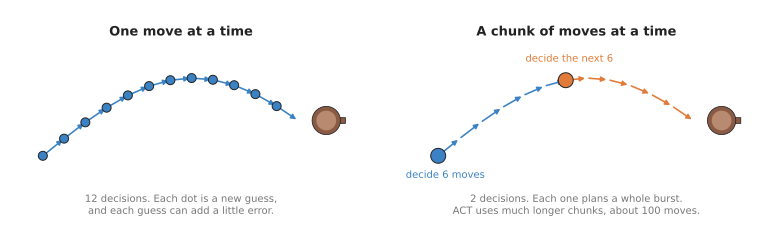
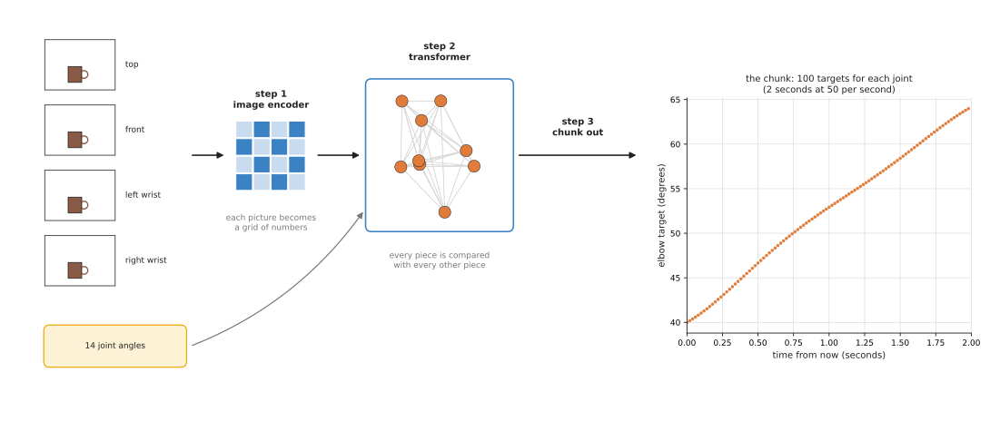
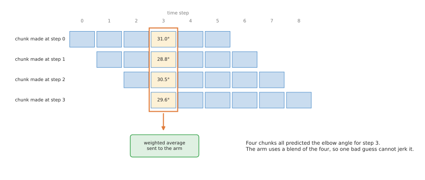
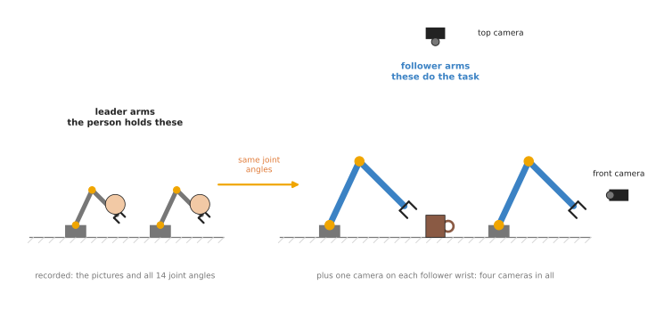

# Action chunking transformers

The previous page ended with a problem: a policy that chooses one move at a time
lets small mistakes add up until the arm drifts away from anything it was shown.
This page explains ACT, which is short for Action Chunking with Transformers,
and which was built to reduce that adding-up. ACT is a movement model that looks
at the robot's cameras and chooses the next burst of moves all at once, instead
of one move at a time. It was published in 2023 together with ALOHA, a cheap
two-armed robot for recording demonstrations, and today it is the first policy
most people train, usually through a software library called LeRobot.

The page answers five questions, in the order you would meet them. What does ACT
take in, and what does it give out? How does the model work inside, once the
data is in? How is it trained, and on how much recorded data? What are ALOHA and
LeRobot, and why do they come up every time? And when is ACT the right choice
for your own task?

It is for a reader who has read [behaviour cloning](01_behaviour-cloning.md),
because ACT is a kind of behaviour cloning, and it was built to fix the problem of
small mistakes adding up that is described there.

## Contents

1. [What ACT is](#1-what-act-is)
2. [What goes in and what comes out](#2-what-goes-in-and-what-comes-out)
3. [How it works inside](#3-how-it-works-inside)
4. [How it is trained](#4-how-it-is-trained)
5. [ALOHA and LeRobot](#5-aloha-and-lerobot)
6. [Well-known models of this kind](#6-well-known-models-of-this-kind)
   · [6.1 ACT in LeRobot, the one to start with](#61-act-in-lerobot-the-one-to-start-with)
   · [6.2 The original ACT code, and one number it left behind](#62-the-original-act-code-and-one-number-it-left-behind)
   · [6.3 The diffusion policy in LeRobot, when the routes disagree](#63-the-diffusion-policy-in-lerobot-when-the-routes-disagree)
   · [6.4 SmolVLA, a chunk from pretrained weights](#64-smolvla-a-chunk-from-pretrained-weights)
   · [6.5 π0.5 in LeRobot, and what a slow chunk needs](#65-π05-in-lerobot-and-what-a-slow-chunk-needs)
   · [6.6 How to choose](#66-how-to-choose)
7. [Where to read next](#7-where-to-read-next)

---

## 1. What ACT is

The introduction said that ACT chooses a burst of moves at once, and this
section says what that burst is called and why it helps. In other words, ACT is
a behaviour cloning policy that predicts a whole chunk of future moves at each
decision.

A **chunk** is a short list of moves, one after another, and in ACT a chunk is
usually 100 moves long. The arm makes 50 moves a second, so one chunk covers the
next two seconds.

For example, when you pour water from a jug into a glass, you do not decide what
to do every hundredth of a second. Instead you decide on the next second or so
of pouring: tip the jug, hold it, start to tip it back. Then you look at the
glass and decide again. So you make only a few decisions, and each one covers a
stretch of movement.

So ACT does the same thing, and the picture below compares a policy that decides
one move at a time with one that decides a chunk at a time.



Each dot is one decision. But with one move per decision there are twelve
chances for a small mistake, while with chunks there are only two.

This is why chunking helps with compounding error, which is the adding-up of small
mistakes from
behaviour cloning. Mistakes build on
each other at each new decision, so fewer decisions means fewer chances for them to
build up.

The other half of the name is **transformer**, which is a kind of neural
network. It takes a set of pieces, such as parts of a picture, and it lets each
piece take information from every other piece. The main step inside it is called
**attention**, because for each piece the network works out which other pieces
matter to it, and how much. Transformers were first used for text, and they are
now used for pictures and actions too.

---

## 2. What goes in and what comes out

Section 1 described chunks in general, and this section gives the exact numbers
that the original ACT reads and writes. In the original ACT the robot is ALOHA,
which has two arms, and each arm has six joints and a gripper. That makes 14
numbers in all, and together they describe where the robot is.

So the observation that ACT reads at each moment has two parts.

- Four camera pictures, each 480 pixels tall and 640 pixels wide, where one camera
  looks down from above, one looks from the front, and one sits on each wrist.
- The 14 current joint positions, which are six joint angles and one gripper
  opening for each arm.

The action is a chunk of 100 targets for each of the 14 joints, which is 1,400
numbers in all. Each target is a joint position the arm should reach at one
moment in the next two seconds.

But the targets are joint positions rather than motor commands. So ordinary control
code in each joint moves the motor towards each target, as described in
[the chapter overview](../01_overview.md#2-why-a-movement-model-is-called-a-policy).

---

## 3. How it works inside

### The three steps

Section 2 said what goes in and what comes out, so this part follows the data
between the two. When ACT runs on the robot, that data goes through three steps.

1. **An image encoder turns each picture into a grid of numbers.** An **encoder** is
   the part of a network that turns its input into numbers the rest of the network
   can use. ACT uses ResNet-18, which is a small and well-known convolutional neural
   network (CNN). For each picture it gives a small grid, and each cell of that grid
   holds a list of numbers that describe one patch of the picture.
2. **A transformer compares every piece with every other piece.** All the grid cells
   from all four cameras go into the transformer, together with the joint positions.
   Attention lets a piece from the wrist camera use a piece from the top camera, so
   this is how the network can match "the gripper is here" with "the cup is there".
3. **The transformer gives out the chunk.** The last part of the transformer has 100
   slots, one for each future moment, and each slot is turned into 14 joint targets.



The plot on the right shows the chunk for one joint, the elbow, which is 100
targets, one every fiftieth of a second. The numbers in that plot are made up to
show the shape, because a real chunk depends on the task.

These three steps are the policy that
[section 6.1](#61-act-in-lerobot-the-one-to-start-with) recommends, and the original
code in [section 6.2](#62-the-original-act-code-and-one-number-it-left-behind) holds
the same network. The counts belong to the ALOHA rig of section 5: four cameras, 14
joint targets for two arms, and a chunk of 100. A cheap single arm has fewer of each,
and the other models in [section 6](#6-well-known-models-of-this-kind) keep the three
steps and change the numbers. SmolVLA, in
[section 6.4](#64-smolvla-a-chunk-from-pretrained-weights), and π0.5, in
[section 6.5](#65-π05-in-lerobot-and-what-a-slow-chunk-needs), also add one input
that the steps above do not have, which is a sentence saying which task to do, and
they read it in the same transformer that reads the pictures.

### The style numbers

The three steps above give one chunk for one situation, but people do the same task
in slightly different ways. For example, one time the demonstrator moves quickly,
and another time slowly. As the
behaviour cloning page
shows, a network that has to give one answer blends these ways together.

But ACT has a partial fix for this problem. During training only, a second small
network looks at the real chunk the person made, and it sums up "how the person did
it this time" in a few numbers. On this page we can call those few numbers the
**style numbers**. The main network gets the style numbers as an extra input. So it
does not have to blend different styles, because the style numbers tell it which one
to produce.

At run time there is no person, so there is no real chunk to look at. ACT
therefore sets the style numbers to zero, which stands for the most typical
style, and the result is a smooth, typical movement.

This design has a name, which is a **conditional variational autoencoder
(CVAE)**. However, you do not need the details of it to use ACT. The idea is
only that some of the variation between demonstrations is put into separate
numbers, so that it does not blur the actions.

It is only a partial fix, because setting the style to "typical" at run time still
gives one answer. So if half the demonstrations go left of an obstacle and half go
right, ACT can still struggle. But the
[diffusion and flow policies](03_diffusion-and-flow-policies.md) on the next page
handle that case better, and the one to reach for is the diffusion policy in
[section 6.3](#63-the-diffusion-policy-in-lerobot-when-the-routes-disagree), which
sits in the same library and takes the same recordings.

### Blending overlapping chunks

A chunk covers two seconds, so if the arm plays the whole chunk without looking
again, it cannot react to anything that happens during those two seconds. There
are two common ways to run ACT, and they differ in how they handle that.

The first way is to play part or all of a chunk, and then ask the policy for a
new one. This is simple, but the arm can jump a little where one chunk ends and
the next begins.

The second way is to ask the policy for a new chunk at every step, and then
blend the chunks together. The ACT paper calls this **temporal ensembling**,
because "temporal" means to do with time, and "ensembling" means combining
several guesses into one.



At step 3, the chunks made at steps 0, 1, 2 and 3 all hold a target for step 3,
so the arm uses a weighted average of them. A weighted average is an average
where some values count for more than others. This makes the movement smooth,
because one odd guess is outweighed by the others.

---

## 4. How it is trained

Section 3 described the network, and this section describes how its numbers are
fixed. ACT is trained like any behaviour cloning policy, with one change: the
answer is a whole chunk, and not one move.

The data is a set of demonstrations, as it is for plain behaviour cloning. At
each moment of each demonstration, the training program takes the pictures and
joint positions as the question. Then it takes the next 100 recorded joint
positions as the answer. The loss is the size of the difference between the
predicted chunk and the recorded chunk, added up over all 1,400 numbers. The
training program then nudges the network to make that loss smaller.

So how much recorded data does this training actually need? In the ACT paper, each
task was learned from about 50
demonstrations, which is about ten minutes of recording. The tasks were fine
two-handed tasks, such as opening a small plastic cup with a lid and slotting a
battery into a holder. This is much less data than people expected fine tasks to
need, and that is the main reason ACT became popular. The Book 3 page on
[data and demonstration](../../../03_frameworks/08_frontier/03_data-and-demonstration.md#31-aloha-and-what-it-made-ordinary)
gives the reported success rates, and it warns what they do and do not show.

Training runs on one ordinary graphics card, so it does not need a cluster of
computers.

---

## 5. ALOHA and LeRobot

Sections 2 and 4 both mentioned ALOHA and LeRobot, so this section says what
they are. ACT is closely tied to these two names, and you will meet both
whenever you read about it.

**ALOHA** is the robot ACT was built for, and the name is short for A Low-cost
Open-source Hardware System for Bimanual Teleoperation, where "bimanual" means using
two hands. ALOHA has two follower arms, which do the task, and two smaller leader
arms, which a person holds and moves by hand. Each follower joint copies the
matching leader joint, and there are four cameras.



The person moves the grey leader arms. Then the blue follower arms move to the
same joint angles and do the task, while the cameras and joint sensors record
everything.

This way of recording has one large advantage over a joystick. The person's
hands do the task directly, joint for joint, so they can control all 14 joints
at once. This is very hard to do in any other way. The follower arms in the
original ALOHA are ViperX arms and the leader arms are WidowX arms, both sold by
Trossen Robotics. The designs were published openly, so other groups could build
the same robot.

**LeRobot** is a free software library from the company Hugging Face, first released
in 2024. It holds, in one place, a standard way to store robot recordings, the code
to train several kinds of policy, and drivers for cheap robot arms. ACT is one of
its policies, and LeRobot's own documentation calls ACT its recommended first
policy. The Book 3 page on
[LeRobot](../../../03_frameworks/08_frontier/03_data-and-demonstration.md#71-what-it-is-and-why-it-won)
explains why it became the standard place to start.

LeRobot also works with cheap leader-and-follower arms, such as the SO-101.
These use the same leader-and-follower idea as ALOHA, but with small hobby
motors and 3D-printed parts. A pair costs a few hundred dollars, so a person can
record ACT demonstrations at home.

---

## 6. Well-known models of this kind

Section 5 described the ALOHA rig and LeRobot. This section names the chunk-predicting
policies you can actually obtain, says which one to reach for first, and gives for
each one the shortest command or program that does something real with it.

The hardware in this line is not in the table, because the table is about models.
ALOHA itself is in section 5. Mobile ALOHA (2024) put the same arms on a wheeled base
and trained ACT on tasks that need the robot to move around a room, and ALOHA 2
(2024), from Google DeepMind, is a sturdier redesign whose designs and simulation
model were published.

Read the table as a filter rather than as a ranking. The left column names the model
and says how much use it gets. The right column holds what you filter on: what it is
best at, its size, its licence, whether it trains on an Apple Silicon Mac with no
separate graphics card, and when to pick it. Find the row that matches the hardware
you have, then read that model's sub-section. A size is the number of trainable
values that the project itself states, and it says `not stated` where no project
document gives a figure. The answers about the Mac come from LeRobot's
[compute hardware guide](https://huggingface.co/docs/lerobot/hardware_guide), which
groups policies by the video memory they need to train at a batch size of eight.

| Model | What decides it |
| --- | --- |
| **ACT in LeRobot** (2023), most used in 2026 | It is best at one careful task on your own arm, trained from nothing. It has about 80 million trainable values, and it is Apache-2.0. It trains on a Mac in about 6 to 14 hours. Pick it when you have an arm, two cameras and about 50 recordings. |
| **The original ACT code** (2023), historical | It is best at reading the implementation the paper was written from. It has about 80 million trainable values, and it is MIT. Whether it trains on a Mac is `not stated`. Never pick it for a project, and open it only to read. |
| **Diffusion policy in LeRobot** (2023), most used in 2026 | It is best at tasks where the demonstrations disagree about the route. Its size is `not stated`, and its licence is Apache-2.0 in LeRobot and MIT for the original. Training it on a Mac is marginal, because it needs about 8 to 14 GB. Pick it when your ACT policy wavers between two routes. |
| **SmolVLA** (2025), worth betting on | It is best at starting from trained weights, and at being told the task in a sentence. It has 450 million trainable values, and both its code and its weights are Apache-2.0. Running it on a Mac works, and training it there is marginal. Pick it when fifty recordings are not enough, or when one policy must do several tasks. |
| **π0.5 in LeRobot** (2025), worth betting on | It is best at working in a room it was not trained in. Its size is `not stated`, its code is Apache-2.0, and the weights LeRobot serves carry Gemma terms. It does not train on a Mac. Pick it when you can rent a large card and need that generalisation. |

### 6.1 ACT in LeRobot, the one to start with

**Most used in 2026.** This is the version of ACT that nearly everybody runs. LeRobot
implements the network from the paper
[Learning Fine-Grained Bimanual Manipulation with Low-Cost Hardware](https://arxiv.org/abs/2304.13705),
and its
[page for the policy](https://huggingface.co/docs/lerobot/act) calls it "the first
model we recommend when you're starting out", states that it has about 80 million
trainable values, and says it often reaches a high success rate with 50
demonstrations. It is in the base LeRobot installation, so there is no extra
dependency to install for it.

You would pick ACT over the diffusion policy in section 6.3, which is the obvious
alternative and the other chunk-predicting policy in the same library, because it is
the cheaper of the two by a clear margin. LeRobot's hardware guide puts ACT in its
lightest group at about 2 to 6 GB of video memory, and diffusion a group above at
about 8 to 14 GB. The same guide's own timings for five passes over a 45,000-frame
recording on one RTX 4090 are about 30 to 60 minutes for ACT and about 2 to 4 hours
for diffusion. Both choose a chunk, so you lose nothing about the subject of this
page by starting with the cheaper one.

What it costs you is a recording session and the pair of numbers below. There is no
pretrained ACT policy that transfers to you, because the output layer has one number
per joint of the arm it was trained on, so a policy trained on a seven-joint Franka
arm cannot even be loaded for a six-joint SO-101. On an Apple Silicon Mac the
hardware guide gives one figure: five passes over that same 45,000-frame recording at
a batch size of four takes about 6 to 14 hours on an M1, M2 or M3 Max, and the flag
for it is `--policy.device=mps`, which LeRobot's
[accelerator page](https://huggingface.co/docs/lerobot/torch_accelerators) documents.
The guide also says plainly not to train on the central processing unit alone.

Training is a command rather than a program, because LeRobot reads the number of
joints and the number of cameras from your recording and sizes the network to fit.

```bash
# chunk_size is how many future commands the network predicts in one pass, and
# n_action_steps is how many of them the arm carries out before asking again.
lerobot-train \
  --policy.type=act \
  --dataset.repo_id=${HF_USER}/my_dataset \
  --policy.chunk_size=100 \
  --policy.n_action_steps=50 \
  --output_dir=outputs/train/my_act \
  --job_name=my_act \
  --policy.device=cuda
```

The program below then runs what that produced, and it is the smallest piece of code
that shows the chunking this page is about.

```python
from lerobot.datasets import LeRobotDatasetMetadata
from lerobot.policies import make_pre_post_processors
from lerobot.policies.act import ACTPolicy

checkpoint = "outputs/train/my_act/checkpoints/last/pretrained_model"
policy = ACTPolicy.from_pretrained(checkpoint)
print(policy.config.chunk_size, policy.config.n_action_steps)

# The rescaling of inputs and outputs is built from the recording's own statistics.
meta = LeRobotDatasetMetadata("<my-user>/my_dataset")
preprocess, postprocess = make_pre_post_processors(policy.config,
                                                   dataset_stats=meta.stats)

policy.reset()      # empties the queue of unused commands from the last attempt
batch = preprocess(frame)   # frame is one observation, as tensors on the device

# The whole chunk at once, which is what the network really produces.
chunk = policy.predict_action_chunk(batch)

# Or one command at a time, taken from a queue that is refilled when it empties.
action = postprocess(policy.select_action(batch))
```

`chunk_size` is how many future commands the network produces in one pass, and its
default in LeRobot is 100. `n_action_steps` is how many of those the arm carries out
before the policy is asked again, it defaults to 100 as well, and it must not be
larger than `chunk_size`. `select_action` hides the difference between the two: it
keeps a queue, returns the next command from it, and runs the network again only when
the queue is empty, so calling it once per control step gives you the chunking without
writing the bookkeeping. `policy.reset()` empties that queue between attempts, and
`predict_action_chunk` is there when you want the whole chunk yourself. `frame` is
your robot's cameras and joint readings turned into tensors, which LeRobot's
`build_inference_frame` helper does from a raw observation and the recording's field
list.

What LeRobot gives you is the network from the paper, the training loop, the queue,
the rescaling, the checkpoints and the control loop on the arm. What you supply is the
recordings, and ACT is the model where that is least avoidable, because it was
designed for tasks that need care and those are the tasks where a demonstration has
to be good. You also supply the pair of numbers above, and section 3 explains the
trade between them. If you want the blending of overlapping chunks that section 3
described, `temporal_ensemble_coeff` turns it on, and LeRobot then requires
`n_action_steps` to be 1, because blending means running the network at every single
step.

### 6.2 The original ACT code, and one number it left behind

**Historical.** The [code the paper was written from](https://github.com/tonyzhaozh/act)
is still online under the MIT licence, and reading it is the only reason to open it.
Checked on 3 October 2026, its last change was in July 2024 and it has not been
archived, so it is dormant rather than withdrawn.

You would not pick it over LeRobot's version, and the reason is not the network,
which is the same network. It is everything round the network. LeRobot gives you one
recording format, drivers for cheap arms, a training script that sizes the network
from your recording, and a control loop that runs the result at a fixed rate. The
original code supplies none of that. Its own installation instructions pin Python
3.8.10, MuJoCo 2.3.7 and dm_control 1.0.14, and they install `rospkg`, because the
real-robot side of it runs through ROS and through a second repository for the
ALOHA rig described in section 5.

What it costs you, if you use it anyway, is all of the work LeRobot does for you,
on top of a set of pinned versions from 2023 that an environment built today has to
be made to accept.

There is one thing in it worth carrying away, and it is a number. LeRobot's ACT
configuration sets `n_decoder_layers` to 1, and its own comment explains why: the
original implementation has 7, but a bug in that code means only the first layer is
ever used, so LeRobot sets 1 to match what the original actually did. The comment
links to the issue in the original repository where this was found. The rest of LeRobot's defaults are the paper's: a ResNet-18 picture
encoder, a model width of 512, four encoder layers and a chunk of 100.

```bash
# The paper's settings written out, although these are LeRobot's defaults already.
# Note n_decoder_layers: 1, not the 7 the original code appears to use.
lerobot-train \
  --policy.type=act \
  --dataset.repo_id=${HF_USER}/my_dataset \
  --policy.vision_backbone=resnet18 \
  --policy.dim_model=512 \
  --policy.n_encoder_layers=4 \
  --policy.n_decoder_layers=1 \
  --policy.chunk_size=100
```

The general lesson is worth more than the setting. When a paper's number and a
maintained library's number disagree, the library has usually read the paper's code,
and the code is what produced the result.

### 6.3 The diffusion policy in LeRobot, when the routes disagree

**Most used in 2026**, alongside ACT, and it is the other policy a beginner is likely
to train. A diffusion policy also predicts a chunk, so everything on this page about
chunk length still applies to it. What it changes is how the chunk is produced: it
builds the chunk the way an image model builds a picture, by starting from noise and
improving it, which lets it represent "either this route or that one" instead of
averaging the two.
[The next page](03_diffusion-and-flow-policies.md) is about how that works.

You would pick it over ACT when your demonstrations disagree about the route. Section
8 describes the fault: if some recordings go left round an obstacle and others go
right, a policy trained to produce one answer close to every recording learns to go
through the obstacle. ACT only reduces that problem, because its style number,
described in section 3, gives it a limited way to represent several routes. A
diffusion policy addresses it directly.

What it costs you is roughly double in memory and in time, by the two figures
section 6.1 compared, which moves training on an Apple Silicon Mac from slow to
doubtful. It needs one extra install, because the policy depends on the diffusers
library. The licence is Apache-2.0 for LeRobot's implementation and MIT for the
original [Stanford code](https://github.com/real-stanford/diffusion_policy).

```bash
pip install 'lerobot[diffusion]'

lerobot-train \
  --policy.type=diffusion \
  --dataset.repo_id=${HF_USER}/my_dataset \
  --output_dir=outputs/train/my_diffusion \
  --job_name=my_diffusion \
  --policy.device=cuda
```

Everything else is the same as ACT, which is the point of a library with one training
script. Once the extra package is installed the command differs by one word, so
training both on the same recording and comparing them takes an afternoon rather
than a project.

### 6.4 SmolVLA, a chunk from pretrained weights

**Worth betting on**, because starting from trained weights is where the field has
gone, and this is the one example of it that a small machine can run. SmolVLA is a
policy with about 450 million trainable values, released by Hugging Face in June
2025. Book 3's
[page on foundation models](../../../03_frameworks/08_frontier/02_foundation-models.md#10-the-open-shelf-what-you-can-download-today)
records that it pairs a vision-language backbone with a smaller action-producing part
and reports about 78 per cent success on real SO-100 arm tasks. It predicts a chunk
exactly as ACT does, and its configuration in LeRobot sets that chunk to 50 commands
rather than ACT's 100.

You would pick it over ACT for two reasons, and both are things ACT cannot do. Its
weights already exist, so your recordings adjust a policy that has seen many people's
robots instead of creating one from nothing. And it reads a sentence saying which task
to do, so one policy can be told at run time which of several jobs you want, where an
ACT policy trained on several tasks has no input to tell it.

What it costs you is memory, an extra install and attention to that sentence.
LeRobot's hardware guide puts it at about 10 to 16 GB of video memory to train, a
group above ACT, so Book 3 calls training it on a Mac marginal, while its
[announcement](https://huggingface.co/blog/smolvla) states that it is small enough to
run on a central processing unit or on a MacBook. Its
[LeRobot page](https://huggingface.co/docs/lerobot/smolvla) says fine-tuning for
20,000 steps takes roughly four hours on one A100 card. The licence is the most
permissive in the table: Apache-2.0 on the code, and the
[weights card](https://huggingface.co/lerobot/smolvla_base) declares Apache-2.0 as
well, checked on 3 October 2026. The thing that most often goes wrong is the task
text, which must match the words used when recording, because it is an input to the
network rather than a label for you.

```bash
pip install 'lerobot[smolvla]'

# Fine-tune the pretrained policy on your own recording.
lerobot-train \
  --policy.path=lerobot/smolvla_base \
  --dataset.repo_id=${HF_USER}/my_dataset \
  --batch_size=64 \
  --steps=20000 \
  --output_dir=outputs/train/my_smolvla \
  --job_name=my_smolvla \
  --policy.device=cuda

# Run it, and give the task in the same words the recording used.
lerobot-rollout \
  --strategy.type=base \
  --policy.path=outputs/train/my_smolvla/checkpoints/last/pretrained_model \
  --robot.type=so101_follower \
  --robot.port=/dev/ttyACM0 \
  --task="Put the cup in the box" \
  --duration=60
```

What Hugging Face gives you is a policy that has already seen 487 people's robots, so
your recordings only have to teach it your room. What you supply is still the
recordings, the sentence, and a card to train on.

### 6.5 π0.5 in LeRobot, and what a slow chunk needs

**Worth betting on**, as the direction rather than as this weekend's work. π0.5,
which this page also spells π0.5, is a vision-language-action policy from Physical
Intelligence. LeRobot's [page for it](https://huggingface.co/docs/lerobot/pi05)
describes its aim as working in places it was never trained in, and says the LeRobot
version is adapted from the company's open
[openpi](https://github.com/Physical-Intelligence/openpi) repository. Like everything
else on this page it produces a chunk, and LeRobot's own quickstart for it carries 10
commands out of each chunk.

You would pick it over ACT only when the thing you need is generalisation, and you
would know that from a specific failure: an ACT policy that works on your table and
stops working when the table is moved or the light changes. ACT has no answer to that
other than more recordings of more rooms, and that is what a policy pretrained on many
rooms is for.

What it costs you is more than most readers of this page have. LeRobot's hardware
guide puts π0.5 in the group needing about 24 to 40 GB of video memory, and its own
quickstart command is described as sized for a single 80 GB card. That is well past
the Apple Silicon row of the same guide, and Book 3's frontier chapter lists the
large policies as out of reach on a Mac. Two further things go wrong often. The first
is the licence, and it is worth stating exactly: the openpi code is
Apache-2.0, while the weights LeRobot serves at
[lerobot/pi05_base](https://huggingface.co/lerobot/pi05_base) declare the Gemma terms
of use on their model card, read on 3 October 2026, because the policy is built on a
Gemma-based backbone. Apache-2.0 code with non-Apache weights is the normal shape of
this field, and the shape that surprises people building a product. The second is
access: the backbone's tokenizer is a gated model on the Hugging Face Hub, so you
must accept its licence and sign in before training will start.

```bash
pip install 'lerobot[pi]'
hf auth login          # the backbone's tokenizer is gated; accept its licence first

lerobot-train \
  --policy.type=pi05 \
  --policy.pretrained_path=lerobot/pi05_base \
  --dataset.repo_id=${HF_USER}/my_dataset \
  --policy.n_action_steps=10 \
  --policy.gradient_checkpointing=true \
  --policy.dtype=bfloat16 \
  --policy.device=cuda
```

One more thing here belongs to this page rather than to π0.5. A large policy takes
longer to produce a chunk than the arm takes to carry the chunk out, so there is a
pause or a jerk every time a chunk arrives late. LeRobot's answer is called real-time
chunking, described on its [own page](https://huggingface.co/docs/lerobot/rtc): the
next chunk is produced while the arm is still carrying out the current one, and the
beginning of the new chunk is pulled towards the part of the old one already played,
so the two join smoothly. It is turned on with `--inference.type=rtc`, it works for
π0, π0.5 and SmolVLA, and it is the reason chunking still works with a model that
takes a long time to produce each chunk.

### 6.6 How to choose

The default is ACT in LeRobot. Record about 50 demonstrations of one task on a cheap
leader-and-follower arm, train ACT with its default chunk of 100 and half of that
carried out, run it on the arm, and watch where it fails.

Three failures change the choice, and each points at a different row. If the arm
wavers between two routes, or stalls where your recordings disagreed, train the
diffusion policy instead, and read the next page before you do. If fifty recordings
are not enough, or if one policy has to be told which of several tasks to do,
fine-tune SmolVLA. If the policy works in your room and fails in the next one, you
need a policy pretrained on many rooms, and that means π0.5 and a rented card rather
than anything you can train this weekend.

Two limits sit under all of that. On an Apple Silicon Mac, ACT is the only row of the
table that finishes in a night, so start there whatever your task looks like. And the
original ACT code is never the answer: whatever you choose, run LeRobot's version.

The idea of predicting a chunk spread well beyond ACT itself. Every policy in the
table above produces one, and so do the large
[vision-language-action models](../../07_language-models/02_most-used/01_vision-language-action-models.md).
The question is no longer whether to chunk, but how long the chunk should be and how
to join one to the next.

---

## 7. Where to read next

The next page, [diffusion and flow policies](03_diffusion-and-flow-policies.md),
keeps the chunks and adds a way to choose cleanly between different ways of doing a
task. And to go back to the list of all five kinds, read
[the chapter overview](../01_overview.md).

To see how chunks of actions are used in very large policies that also take
sentences, read
[vision-language-action models](../../07_language-models/02_most-used/01_vision-language-action-models.md).
To see how a trained policy is run on a robot, read
[running a model on a robot](../../10_making-models-work-on-an-arm/02_most-used/02_running-a-model-on-a-robot.md).

For deeper reading in Book 3,
[learned motion](../../../03_frameworks/03_arm-movement/05_learned-motion.md#1-which-part-of-the-move-a-policy-stands-in-for)
explains why chunking fixed the jerky motion of earlier policies, and it lists ACT
and LeRobot with their licences.
[Data and demonstration](../../../03_frameworks/08_frontier/03_data-and-demonstration.md)
covers ALOHA, the SO-101 arm and LeRobot's data format in more detail.
