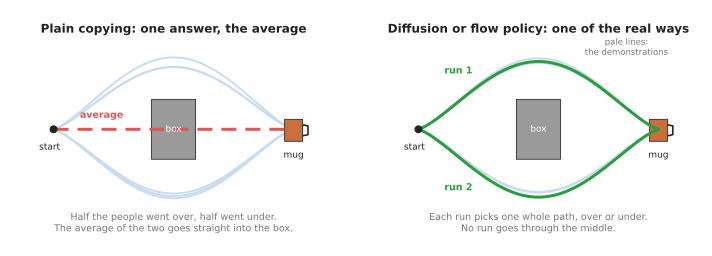
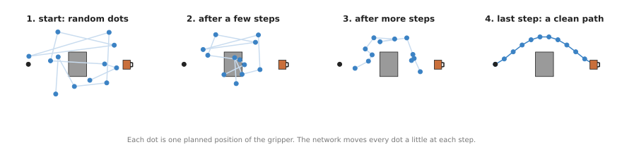
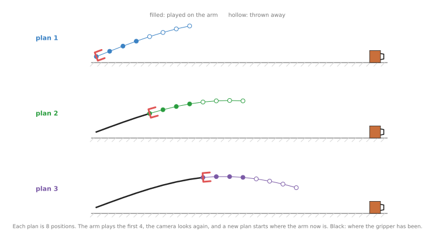
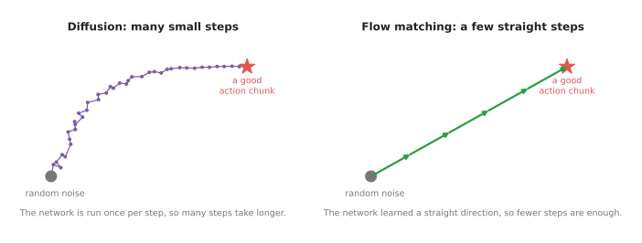

# Diffusion and flow policies

The previous page said that action chunking reduces the adding-up of small
mistakes, but it left one fault unfixed: when people show the same task in two
different ways, the model still blends the two. So this page answers one
question: when people show a robot arm the same task in different ways, how can
a model copy them without mixing the ways together? The answer is a kind of
movement model called a diffusion policy, together with its faster relative, the
flow policy.

The page is for a reader who has met the two pages before it:
[behaviour cloning](01_behaviour-cloning.md), which copies demonstrations, and
[action chunking transformers](02_action-chunking-transformers.md), which plan a
short run of movements at a time. You do not need any maths, because every new word
is explained where it first appears.

## Contents

1. [What it is](#1-what-it-is)
2. [What goes in and what comes out](#2-what-goes-in-and-what-comes-out)
3. [How it works inside](#3-how-it-works-inside)
4. [Diffusion and flow matching: the difference](#4-diffusion-and-flow-matching-the-difference)
5. [How it is trained](#5-how-it-is-trained)
6. [Well-known models of this kind](#6-well-known-models-of-this-kind)
7. [Where to read next](#7-where-to-read-next)

---

## 1. What it is

The introduction named the problem, so this section gives the idea that answers
it in one sentence. In short, a diffusion policy starts from a random guess at
the arm's next movements, and it cleans that guess up in several small steps,
until the guess looks like something a person really did.

A **policy** is the name for any model that decides what the arm does next,
which it does by looking at the world and giving back an action. An **action**
is a movement command, such as "move the gripper 1 cm to the left and close it a
little".

But to see why a new kind of policy was needed, think about an everyday example.
You ask six people to carry a mug from one side of a table to the other, and
there is a box in the middle. Three people go round the left of the box, and
three people go round the right, so all six did the job well.

Now suppose a simple model learns from these six people. This is a model that
gives one answer for each situation, and it tries to be as close as possible to
all six people at once. But the answer closest to "three go left and three go
right" is the middle. So the model learns to go straight through the middle,
into the box, which is something none of the six people ever did.



The left picture shows the problem, because the red dashed line is the average
of the pale demonstrations, and it runs into the box. But the right picture
shows what a diffusion policy does instead, which is that each time it runs it
picks one whole path that looks like a real demonstration.

A task with more than one good way to do it is called **multi-modal**, and a
**mode** is one of those good ways, so going left is one mode and going right is
another. Diffusion policies were built to handle multi-modal tasks, because they
learn the whole spread of ways that people did the task, and each time they run they
pick one of them.

A **flow policy** does the same job with a method called **flow matching**, and it
usually needs fewer clean-up steps, so it runs faster.
[Section 4](#4-diffusion-and-flow-matching-the-difference) explains where that
difference comes from.

---

## 2. What goes in and what comes out

Section 1 said that the policy starts from a random guess, so that random guess
is one of its inputs. So a diffusion policy for a robot arm takes in three
things altogether.

- **The latest camera pictures.** Often there is one camera looking at the table
  and one camera on the wrist of the arm. Some policies take the last two or three
  pictures, so that they can see which way things are moving.
- **The arm's own state.** This is the angle of each joint and how open the
  gripper is, and the arm's own sensors measure these numbers.
- **Some random numbers.** This is the starting guess that gets cleaned up, and it
  is called **noise**, because it is random and has no meaning yet.

Then it gives back a **chunk** of actions, which is a short list of the next
movements, one after another, such as the next sixteen positions for the gripper.
The [action chunking page](02_action-chunking-transformers.md) explains why a chunk
works better than one action at a time, and diffusion policies use chunks for the
same reasons.

The table below turns that list into one concrete example. Read each row as one
kind of input or output, with what it looks like for an arm picking up a mug.

| | What it is | An example for picking up a mug |
| --- | --- | --- |
| In | camera pictures | one picture from above the table, one from the wrist |
| In | arm state | six joint angles and the gripper width |
| In | noise | a list of random numbers, the same size as the output |
| Out | an action chunk | the next sixteen gripper positions, each with "open" or "closed" |

---

## 3. How it works inside

Section 2 listed the noise as an input, and this section follows what happens to it.
The cleaning-up happens in steps, and each step uses the same neural network. A
**neural network** is a large calculation with many adjustable numbers, which a
computer tunes by showing it examples. Chapter 1 explains this in
[inside a neural network](../../01_what-models-are/03_inside-a-neural-network.md).

Here is what happens each time the policy is asked for a new chunk.

1. The policy looks at the camera pictures and the arm state, and a part of the
   network turns them into a list of numbers that describes the scene.
2. The policy makes a random chunk, where every position in it is random, so the
   chunk starts as a messy scatter of points.
3. The network looks at three things, which are the scene description, the messy
   chunk, and how many clean-up steps are left. From those it works out which way
   each point should move to look more like a real movement.
4. The policy moves each point a little way in that direction.
5. Steps 3 and 4 repeat, and after the last step the chunk is a clean, smooth path.
6. The arm plays the first part of the chunk, and then the policy looks again and
   makes a new chunk.



The picture shows one chunk being cleaned up. At the start the dots are random.
Then at each step every dot moves a little, so by the last step they form a path
from the start, round the box, to the mug.

But why does this whole procedure avoid the average? The answer is in step 2,
because the random start is different each time. If the random dots happen to
lean a little towards the top, then the clean-up pulls them into the "go over"
path. But if they lean towards the bottom, the clean-up pulls them into the "go
under" path. The network has learned where real paths are, rather than a single
answer. So the random start decides which real path you get, and you never get
the impossible middle.

The last step in the list, playing only part of the chunk, matters on a real
robot. This is because the world can change while the arm moves, since a mug can
be nudged. So the policy plays a few movements, looks again, and plans again.
This is sometimes called **receding horizon**, because the plan always reaches a
fixed distance ahead of where the arm is now.



In the picture, each row is one plan of eight positions. The arm plays the four
filled positions, throws away the four hollow ones, and starts a new plan from
where it now is.

The six steps above are Diffusion Policy, which
[section 6.1](#61-diffusion-policy-the-one-you-train-yourself) recommends as the
model to train on your own recordings, and every other model in
[section 6](#6-well-known-models-of-this-kind) is a variation on them. What differs
most between those models is how many times steps 3 and 4 repeat: 100 times for
Diffusion Policy, 10 times for π0, π0.5 and SmolVLA, and 4 times for GR00T N1.7.
Section 4 explains why some of them need so few. Those pretrained models, which are
π0, π0.5, SmolVLA and GR00T N1.7, also read one input that the list above does not
have, which is a sentence saying which task to do, and it joins the scene
description made in step 1.

---

## 4. Diffusion and flow matching: the difference

Section 3 described the clean-up steps without saying how the network learned to
take them, and there are two ways to do that. Diffusion and flow matching both
turn noise into a good chunk, but they differ in how the network learns the way
from noise to the answer.

In **diffusion**, the network learns to remove a little noise at a time. This is
an idea that came from models that make pictures, because those models learn to
turn a screen of random coloured dots into a photo. So a diffusion policy does
the same thing with a list of arm positions instead of a picture. But the path
from noise to answer is wiggly, so it usually takes many small steps.

Instead, in **flow matching**, the network learns a direction to travel from the
noise to the answer. During training, the method connects each noise sample to a
real chunk by a straight line, and the network learns to point along those
lines. Because the lines are straight, the policy can take a few big steps
instead of many small ones.



The left picture shows the many small, wobbly steps of diffusion. The right
picture shows the few straight steps of flow matching, which end at the same
kind of answer in less time.

Speed matters here because the network runs once per step. So if a policy needs
many steps and each takes a few thousandths of a second, then the arm waits.
Fewer steps means the arm can get a new chunk more often. This is one main
reason most large robot models built in 2025 and 2026 use flow matching for
their actions.

The table below compares the two methods, and you read across each row.

| | Diffusion | Flow matching |
| --- | --- | --- |
| What the network learns | how to remove a little noise | which direction to travel |
| Shape of the way from noise to answer | wiggly | close to a straight line |
| Clean-up steps needed | many | few |
| Handles several good ways to do a task | yes | yes |
| Where you meet it | Diffusion Policy and Octo, in sections 6.1 and 6.5 | π0, π0.5, SmolVLA and GR00T N1.7, in sections 6.2 to 6.4, and most newer large robot models |

---

## 5. How it is trained

Sections 3 and 4 described a network that already knows where real paths are, and
this section says how it learned that. A diffusion policy learns from
**demonstrations**, where a demonstration is one recording of a person doing the
task by driving the robot. The recording keeps the camera pictures, the joint
angles, and the commands the person gave, all at the same moments. Chapter 1
explains where such recordings come from, in
[where the data comes from](../../01_what-models-are/05_where-the-data-comes-from.md).

So training a diffusion policy works in the six steps below.

1. Take a short piece of one demonstration, which is the pictures at one moment and
   the next sixteen actions the person really took.
2. Add a known amount of random noise to those sixteen actions, so that they become
   messy.
3. Ask the network which way the messy actions should move to get back to the real
   ones.
4. Compare its answer with the right answer, which you know, because you added the
   noise yourself.
5. Adjust the network's numbers a little, so that the next answer is closer.
6. Repeat with many pieces and many different amounts of noise.

Flow matching training is almost the same, and the difference is in step 3.
There the network is asked for the straight-line direction from the noise to the
real actions.

So how much recorded data does a diffusion policy need? For one task, such as "put
the mug on the plate",
people usually record somewhere between tens and a few hundred demonstrations. Large
general models that do many tasks are trained on far more, pooled from many robots,
and then adjusted to a new task with a smaller set, and the
[vision-language-action page](../../07_language-models/02_most-used/01_vision-language-action-models.md)
covers those.

In every case, training needs a computer with a graphics card. A **graphics
card**, or graphics processing unit (GPU), is a chip that does many small sums
at once, which is what training a network mostly is.

---

## 6. Well-known models of this kind

Section 5 described the training that all of these models share, and this section
names the ones you can download and run. For each model it says what it is, why you
would pick it rather than the obvious alternative, what it costs you, and which
library runs it.

Read the table as a shortlist, with one row per model. The left column names the
model and says how much use it gets. The right column holds the rest: what it is best
at, its size, how many steps it takes per chunk, the memory it needs to train, the
licence on its code and on its weights, and when to pick it. Steps per chunk is how
many times the network runs to produce one chunk of actions, which section 4 said is
what decides the speed, and every such figure is the default in
[LeRobot](https://github.com/huggingface/lerobot)'s own configuration file for that
policy. Do not read those step counts as a speed ratio on their own, because the
networks differ in size, and section 6.1 sets that out. The memory figures are the
video memory LeRobot's hardware guide gives for training at batch size 8. A cell says
`not stated` where the project publishes no number, because a guessed number is worse
than none.

| Model | What decides it |
| --- | --- |
| **Diffusion Policy**, most used in 2026 | It is best at one task, trained from your own recordings. Its size is not stated, and it runs the network 100 times for each chunk, which is the most of any row here. Training it needs about 8 to 14 GB. Its code is MIT, and you train the weights yourself. Pick it when you have one task, a few hundred demonstrations and one consumer graphics card. |
| **π0 and π0.5**, most used in 2026 among flow policies | They are best at being a pretrained policy that you aim at a new task with words. Their size is not stated, and they run the network 10 times for each chunk. Training them needs about 24 to 40 GB. Their code is Apache-2.0, and their weights are mixed, which section 6.2 sets out. Pick them when you have a large NVIDIA card and want pretraining and language instructions. |
| **SmolVLA**, most used in 2026 on cheap hardware | It is best at learning on cheap hardware. It has 450 million parameters, and it runs the network 10 times for each chunk. Training it needs about 10 to 16 GB. Both its code and its weights are Apache-2.0. Pick it when you work on a laptop or a Mac, or when you need one clean licence. |
| **GR00T N1.7**, worth betting on | It is best at being a pretrained policy with a vendor behind it. It has 3 billion parameters, and it runs the network 4 times for each chunk, which is the fewest of any row here. Training it needs about 24 to 40 GB. Its code is Apache-2.0, and its weights carry the NVIDIA Open Model License. Pick it when you have an NVIDIA card with 40 GB or more and want supported software. |
| **Octo**, historical | It is best at explaining where this design came from. Its size, its steps per chunk and the memory it needs to train are all not stated. Both its code and its weights are MIT. Never pick it for new work. |

### 6.1 Diffusion Policy, the one you train yourself

**Most used in 2026** for a single task, because it is the only model on this page
that one person can train from nothing on one consumer graphics card.

Size not stated, a big card to train it on, MIT for the code, and the weights are
yours because you are the one who makes them.

Diffusion Policy was published in 2023 by researchers at Columbia University, the
Toyota Research Institute and the Massachusetts Institute of Technology, in the paper
[Diffusion Policy: Visuomotor Policy Learning via Action
Diffusion](https://arxiv.org/abs/2303.04137). It is the model that made the method
popular for robot arms, and it works exactly as section 3 described: camera pictures
and arm state go in, and a chunk of actions comes out of the clean-up procedure.
There are no general pretrained weights to download, so you train it on your own
recordings.

The one idea it is built on is that the network never gives you a movement. It gives
you a correction. You hand it a messy chunk, and it tells you which way every number
in that chunk should move to look a little more like something a person really did,
and then you hand it the result and ask again. The action chunking transformer on the
page before this one does the opposite, because its pictures go in, its chunk comes
out of a single pass, and it never sees its own answer.

That changes which parts sit inside the model and how often each one runs. There are
two. A picture encoder reads the cameras and the joint angles and turns them into a
short description of the scene, and it runs once for each decision. A correction
network then runs over the chunk once for every clean-up step, and each time it is
given three things, which are that scene description, the chunk as it stands, and how
many steps are left. The paper is deliberate about keeping the pictures out of the
clean-up. They are something the correction network is told about, and they are never
made messy and cleaned up alongside the actions. That is why the cameras are read
once for a decision rather than once for every step. The correction network itself
comes in two shapes. One is a convolution that slides along the chunk from its first
position to its last, so each correction is worked out from its neighbours in time.
The other is a transformer that treats each messy position as a token. Its authors
report that the convolution is easier to get working but smooths over sharp
movements, while the transformer handles a sudden change of direction better and is
fussier about its settings. LeRobot uses the convolution by default.

What the idea buys is the thing section 1 promised, plus one more. Two good routes
stay two routes, because the start is random and the corrections only push towards
places where real movements were. And the whole chunk is corrected together, so the
positions inside it agree with each other instead of being produced one at a time.
What it costs is that one decision is many runs of the network instead of one, and
that the clean-up schedule becomes another thing to set. You can buy most of that time
back in one line, by setting `num_inference_steps` lower and the scheduler to DDIM,
which is the noise schedule built to be skipped through, and you pay for it with a
slightly rougher path. Do not read the step counts in the table as a speed ratio,
though, because a step here runs a small network, while a step of π0 runs its action
expert over all the tokens its large pretrained half produced. Only a measurement on
your own machine settles which is quicker.

On a real arm the difference shows up in the recordings rather than in the code. The
whole advantage of this policy over an action chunking transformer is that it keeps
two ways of doing a task apart instead of averaging them, and it can only do that if
both ways are in your data. If you always reach round the box on the left, you have
paid for a hundred network passes and learned one route, and the transformer would
have given you that same route in one pass. So recording for a diffusion policy means
deliberately showing the alternatives, which is the opposite of what people do when
they want tidy data.

The obvious alternative is π0 in the next sub-section, and the choice between them is
the main decision on this page. Pick Diffusion Policy when your robot does one job.
It is small, it needs no pretraining, nothing in it has to be fine-tuned, and you can
look at every setting it has. Pick a pi model instead when you need the policy to
follow an instruction in words, or when you have too few demonstrations to train from
nothing.

The library is LeRobot, and it needs the `diffusers` package as well, because it
borrows the noise schedules from there. Install both with
`pip install "lerobot[diffusion]"`. Building the policy takes a few lines more than
other policies, because you have to tell it the shape of your data first.

```python
from lerobot.configs import FeatureType
from lerobot.datasets import LeRobotDatasetMetadata
from lerobot.policies.diffusion import DiffusionConfig, DiffusionPolicy
from lerobot.utils.feature_utils import dataset_to_policy_features

meta = LeRobotDatasetMetadata("lerobot/pusht")
features = dataset_to_policy_features(meta.features)
outputs = {k: f for k, f in features.items() if f.type is FeatureType.ACTION}
inputs = {k: f for k, f in features.items() if k not in outputs}

config = DiffusionConfig(
    input_features=inputs, output_features=outputs,
    horizon=64,                  # actions produced in one pass
    n_action_steps=32,           # of those, how many the robot carries out
    num_train_timesteps=100,     # clean-up steps used while training
    num_inference_steps=10,      # clean-up steps used while running: the speed dial
    noise_scheduler_type="DDIM", # DDIM allows fewer steps than the default DDPM
)
policy = DiffusionPolicy(config)
```

LeRobot gives you the network, the schedules, the training loop and the queue of
actions, and `dataset_to_policy_features` saves you from writing out the shape of
every camera and every joint by hand. Training is then one command with
`--policy.type=diffusion`. What you have to supply is the demonstrations, recorded in
LeRobot's dataset format with the alternatives in them. `lerobot/pusht` above is a
simulated pushing task with one camera and a two-number action, so it loads in
minutes and is a fair way to check that your installation works, but it is not a
robot arm.

One variant is worth knowing by name. **3D Diffusion Policy, or DP3** (2024) is the
same method with a point cloud as its input instead of flat pictures, where a point
cloud is a list of 3D dots on the surfaces a depth camera sees. The
[point cloud models page](../../04_3d-models/02_most-used/01_point-cloud-models.md)
explains that input.

### 6.2 π0 and π0.5, the flow policies you can download

**Most used in 2026** among flow policies, because they are the only weights from a
frontier laboratory that anybody outside the company can download.

Size not stated, a big card to run and a workstation to fine-tune, Apache-2.0 for the
code, and a weights licence that depends on which copy you download.

[π0](https://arxiv.org/abs/2410.24164), said "pi zero", was announced by Physical
Intelligence on 31 October 2024 and opened on 4 February 2025.
[π0.5](https://arxiv.org/abs/2504.16054) followed on 22 April 2025 and added what its
authors call open-world generalisation, meaning it also works in rooms it has never
seen. The base checkpoints were trained on what the
[openpi repository](https://github.com/Physical-Intelligence/openpi) calls 10,000 or
more hours of robot data.

The one idea both are built on is that the hard part of a robot policy is
understanding the scene and the instruction, and that somebody has already paid for
that. So the part of a pi model that reads the pictures is not a small encoder trained
on your own recordings, as Diffusion Policy's is. It is a pretrained vision-language
model, PaliGemma in π0's case, which learned about pictures and words from the
internet rather than from robots. The
word "plate" in your instruction means something to it before it has ever seen a
robot.

The clean-up is then done by a second, much smaller network, which the papers call
the **action expert**, and the two are kept apart on purpose. The picture and word
tokens go through the large pretrained half, the arm's state and the messy actions go
through the action expert, and the only place the two meet is a shared attention step
in which the action tokens may look at the picture and word tokens but not the other
way round. The papers call this arrangement a mixture of two experts. One consequence
matters every time the arm asks for a chunk: because the picture and word tokens never
look back at the action tokens, their share of the work is done once for a decision,
and only the small half repeats for each clean-up step.

That arrangement is also why the clean-up here is flow matching rather than the noise
removal of Diffusion Policy. A clean-up step in a pi model is cheaper than running the
whole model, but it is still far more work than a step of Diffusion Policy, because the
action expert looks across every token the pretrained half produced. A hundred such
steps for one decision would not be practical. The straight path from noise to the
answer, which section 4 described and which needs only a handful of steps, is what
makes bolting a clean-up network onto a large pretrained model usable at all.

π0.5 keeps both halves and adds a step above them. Before it moves, it writes the
next subtask down in words, such as picking up the plate, and the action expert then
produces the movements for that subtask rather than for the whole instruction. Its
training ran in two stages too: in the first, the actions were turned into discrete
tokens, like words, so that the whole model could be trained as plain next-word
prediction, and the flow-matching half was added only in the second. The difference
shows on a long job. Told to clear a table, π0 has to carry the decision about what
comes next inside the same numbers that produce the movement, while π0.5 says "pick up
the plate" first and then has only that movement to make. Its authors credit the
breadth of π0.5 to training on many kinds of data together, which is web pictures and
text, other robots, and those written-down subtasks, rather than to the extra step
alone.

Pick one of these rather than Diffusion Policy when you want the pretraining. You can
tell a pi model what to do in words, and because it has already seen a great deal of
robot data, a new task needs fewer of your own demonstrations. The honest counterpart
to that is a 2026 study called [MINERVA](https://arxiv.org/abs/2609.03715), which
found that flow matching gave no measurable advantage on its benchmarks over plain
regression, meaning a policy that predicts the actions directly instead of cleaning
up noise, while running several times more slowly. So the pretraining is the reason
to choose a pi model, and the flow matching inside it is not by itself a reason.

Two of their costs have nothing to do with size, and both catch people. The openpi
repository says it has only been tested on Ubuntu 22.04 and needs an NVIDIA card, so
there is no usable path on a Mac. And the licence follows the exact file you download.
openpi's code is Apache-2.0, its own checkpoints are served from the project's storage
bucket with no separate terms named for them, the LeRobot copy at
[lerobot/pi0](https://huggingface.co/lerobot/pi0) declares Apache-2.0 on its model
card, and the LeRobot copy at
[lerobot/pi05_base](https://huggingface.co/lerobot/pi05_base) declares the Gemma
licence, because of the language model inside it. Read the card of the exact
checkpoint you download before you build anything you intend to sell.

The library is LeRobot again, which carries both as the `pi0` and `pi05` policy
types.

```python
import torch
from lerobot.policies.factory import make_pre_post_processors
from lerobot.policies.pi0.modeling_pi0 import PI0Policy

model_id = "lerobot/pi0"
device = torch.device("cuda")      # this policy has no usable path on a Mac
policy = PI0Policy.from_pretrained(model_id).to(device).eval()

# Flow-matching steps per chunk. Ten is LeRobot's default for this policy,
# against the 100 of Diffusion Policy above.
policy.config.num_inference_steps = 10

preprocess, postprocess = make_pre_post_processors(
    policy.config, model_id,
    preprocessor_overrides={"device_processor": {"device": str(device)}},
)

with torch.inference_mode():
    action = postprocess(policy.select_action(preprocess(observation)))
```

LeRobot gives you the checkpoint, the normalisation that the model was trained with,
and the queue that hands out the 50 actions of a chunk one at a time. What you have
to supply is `observation`, which is one frame holding your camera pictures, your
arm state and the task written as a string, with the camera names the checkpoint
expects. For your own robot you then fine-tune, because a base checkpoint has never
seen your arm, and the
[fine-tuning page](../../10_making-models-work-on-an-arm/02_most-used/01_fine-tuning.md)
explains how much data and memory that takes.

### 6.3 SmolVLA, the flow policy that runs on a laptop

**Most used in 2026** by people learning on cheap hardware, because its authors say
it runs on a MacBook and no other model here does.

Size m, a laptop to run it and a big card to train it, Apache-2.0 for the code and
for the weights.

[SmolVLA](https://huggingface.co/lerobot/smolvla_base) was released on 3 June 2025 by
Hugging Face. It joins a SmolVLM2 vision-language backbone to a flow-matching action
expert, and it was trained on about 10 million frames from 487 datasets contributed
by the LeRobot community. Its authors report about 78 per cent success on real tasks
with the SO-100 arm.

The one idea is not a new mechanism. SmolVLA has the same two halves as π0, a
pretrained vision-language model and a small flow-matching action expert, and its
authors set out to find how much of each half could be cut away before the policy
stopped working. So the interesting part of this model is the list of corners it
decided could be cut.

There are three, and all of them are about how much work one decision is. The first
is that only the first half of the language model's layers are used at all, and the
rest are never run, which its authors report as a good trade between speed and
accuracy. The second is that each camera frame becomes only a few dozen tokens
instead of a few hundred, by passing one whole picture rather than cutting it into
tiles and by folding neighbouring pixels together. Fewer tokens is the cut that
matters most for the action expert, because, as section 6.2 explained, the expert
looks across all of those tokens on every clean-up step. The third is that the action
expert alternates two kinds of layer, one that reads the vision-language half and one
that only looks at the chunk itself. Its authors report that alternating the two did
better than using either kind alone, both on success and on speed.

One more part of the release matters, and it is not a change to the model at all. It
comes with an asynchronous runner, which lets the arm keep playing
the actions it already holds while the next chunk is being computed, instead of
standing still until the policy answers. That runner is part of LeRobot, so other
policies can use it, but it is presented as part of this model's recipe, because a
small model on a laptop is exactly the case where the wait is long enough to see.

Where the difference shows on a real arm is in what the model has already seen. The
pi models were trained on a fleet of research robots that you do not own. SmolVLA's
training frames were contributed by the LeRobot community, so much of that data was
recorded on the same cheap arms a reader of this page is likely to have, which is why
its reported numbers are on an SO-100 rather than on a laboratory platform. If your
arm is an SO-100 and your computer is a MacBook, π0.5 will not run for you at all,
and the model that has already seen arms like yours starts closer to your task.

Pick it rather than π0.5 for two reasons. It runs where π0.5 does not, including on a
processor alone, and its code and its weights are both Apache-2.0, so there is no
licence question to resolve before you ship. Against that, it is much smaller than a
frontier model, so expect less of it, and its training data came from volunteers and
is of uneven quality. What most often goes wrong is expecting frontier behaviour from
a small model, and then blaming the recordings for it.

The library is LeRobot, installed with `pip install "lerobot[smolvla]"`. The code
below is the pattern from the model's own card.

```python
import torch
from lerobot.policies.factory import make_pre_post_processors
from lerobot.policies.smolvla.modeling_smolvla import SmolVLAPolicy

model_id = "lerobot/smolvla_base"
device = torch.device("mps" if torch.backends.mps.is_available() else "cpu")
policy = SmolVLAPolicy.from_pretrained(model_id).to(device).eval()

preprocess, postprocess = make_pre_post_processors(
    policy.config, model_id,
    preprocessor_overrides={"device_processor": {"device": str(device)}},
)

with torch.inference_mode():
    action = postprocess(policy.select_action(preprocess(observation)))
```

Only the class, the checkpoint name and the device differ from the pi code above,
which is the point of using one library for all of them. `mps` is PyTorch's name for
the graphics hardware in an Apple Silicon Mac. You still supply the same frame of
camera pictures, arm state and instruction, and your own demonstrations for
fine-tuning, because this is a base model rather than a finished one.

### 6.4 GR00T N1.7, the flow policy with a vendor behind it

**Worth betting on**, because it is the clearest released evidence for the direction
the field is taking, which is pretraining on ordinary human video, and because NVIDIA
publishes it as a supported release rather than as a research drop.

Size l, a big card to run it and a workstation to fine-tune it, Apache-2.0 for the
code and the NVIDIA Open Model License for the weights.

[GR00T N1.7](https://github.com/NVIDIA/Isaac-GR00T) was tagged on 18 April 2026 as a
general-availability release, which NVIDIA defines as carrying support and stability
guarantees.

The one idea it is built on is a change to what an action means. In Diffusion Policy
and in the pi models, an action is normally an absolute target, which is where the
gripper should be or what angle each joint should hold. In GR00T an action is a change
from where the gripper is now, so "three centimetres to the left" is the action rather
than a target coordinate. That sounds like a detail, and it is
the whole reason the model exists in this form, because three centimetres to the left
means the same thing on a human hand as on a gripper, while a target coordinate does
not. So ordinary video of people doing things with their hands becomes training data,
and the project says it pretrained on 20,000 hours of it alongside robot
demonstrations.

Inside, it is the same two halves one more time, with two differences from π0.5. The
vision-language half is Cosmos-Reason2-2B, a model built to reason about physical
scenes rather than to describe pictures. The action half is a flow-matching diffusion
transformer whose depth was halved, from 32 layers to 16, so the part that repeats on
every clean-up step is cheaper than it would otherwise be. The table gives the other
half of that saving, which is that GR00T asks for the fewest steps per chunk of
anything on this page. One more thing follows from a single
checkpoint driving several different bodies: it has to be told which body it is
driving, through what the code calls an embodiment tag, and an arm it has never met is
declared as a new one.

What the idea buys is pretraining data that nobody had to collect with a robot, which
is a different bet from π0.5. π0.5 got its breadth from the web pictures and text its
backbone had already read, plus a large fleet of real robots. GR00T is betting that
human video, of which there is far more than there will ever be robot data, can carry
the same weight. What it costs you is that the relative action space has to be
switched on and configured, and that not every part of the arm can use it. The
gripper stays absolute in the command below, because open and closed are not relative
to anything.

The difference shows up on an arm that is not mounted where the demonstrated one was.
An action that names a coordinate is only correct for one arrangement of arm, table
and base, so moving the arm or putting it on a mobile base invalidates it. An action
that says how far to move does not depend on that arrangement, which is why NVIDIA
aims this model at humanoids, where the arm's own base moves as the robot walks.

Pick it rather than π0.5 when you want software somebody supports and a licence
somebody has written down, since Physical Intelligence serves its checkpoints with no
separate terms named for them. Pick π0.5 instead if you cannot accept NVIDIA's terms,
or if your work is two-armed tabletop manipulation rather than the humanoid work
GR00T targets.

Two more costs have nothing to do with size. The supported platforms are CUDA 12.8
desktop cards, Jetson Thor and Orin, and DGX Spark, so nothing about it runs on a Mac.
And one sentence in the repository's README calls the model "fully commercially
licensable under Apache 2.0", which is wrong about the weights: those are under the
[NVIDIA Open Model License
Agreement](https://www.nvidia.com/en-us/agreements/enterprise-software/nvidia-open-model-license/),
which allows commercial use but adds an attribution notice when you redistribute, a
clause that ends the licence if you disable a safety guardrail without putting a
similar one in its place, and a requirement to stay within NVIDIA's separately
published terms. The licence section further down the README and the [model
card](https://huggingface.co/nvidia/GR00T-N1.7-3B) both say the narrower thing, and
that is what misleads people here most often.

LeRobot carries it as the `groot` policy type, installed with
`pip install "lerobot[groot]"`. Fine-tuning it on your own recordings is one command.

```bash
lerobot-train \
  --dataset.repo_id=$YOUR_DATASET \
  --policy.type=groot \
  --policy.device=cuda \
  --policy.base_model_path=nvidia/GR00T-N1.7-3B \
  --policy.embodiment_tag=new_embodiment \
  --policy.chunk_size=16 \
  --policy.n_action_steps=16 \
  --policy.use_relative_actions=true \
  --policy.relative_exclude_joints='["gripper"]'
```

LeRobot downloads the base model, converts your dataset into what GR00T expects and
runs the training. What you supply is `$YOUR_DATASET`, your own recordings in
LeRobot's format. `new_embodiment` tells it that your arm is not one of the bodies
the checkpoint already knows, and `use_relative_actions` turns on the relative action
space described above, while the gripper stays absolute.

### 6.5 Octo, kept for what it explains

**Historical.** Size not stated, and the machine it needs is not stated either. MIT
for the code and for the weights, which is the cleanest licence on this page.

[Octo](https://github.com/octo-models/octo) (2024) was an early open general policy
trained on many robots' recordings, and it produced its actions with a small diffusion
part at the end of a large transformer.

The one idea it is built on is that nothing should be built in. Everything that goes
into the model becomes a token, the middle is a plain transformer, and every piece
that belongs to one particular robot lives at the edges, so a new camera, a new
instruction or a new arm is attached without re-initialising the trained middle. That is the opposite of a pi
model, where the middle is one particular pretrained vision-language model and the
shape of what you may feed it is settled by that choice.

Two parts of the arrangement are worth knowing because they are what makes the edges
detachable. Pictures are cut into small patches and each patch becomes a token, an
instruction goes through its own pretrained text encoder and becomes more tokens, and
the transformer mixes whichever tokens are present, so a missing camera is simply
missing tokens rather than a changed network. Then there is the readout token, which
is an extra token allowed to look at everything before it while nothing is allowed to
look at it. The small diffusion part reads the transformer through that token, so
attaching a second head changes nothing about what the transformer computes.

The contrast with every model above it is where the understanding came from. Octo's
transformer learned from robot recordings and nothing else, apart from the text
encoder that reads the instruction, so whatever it knows about mugs and plates it
learned from robots. π0, SmolVLA and GR00T all start from a model
that read the internet first, and that single step is what the field did after Octo.
The shape, which is a big model that understands the scene with a small generative
head that produces the numbers, is still the shape every model above uses, and that is
why Octo is worth reading.

Do not start new work on it. Its repository has had no commits since the middle of
2024, and LeRobot does not carry it, so you would be maintaining it yourself. Use
SmolVLA for the same idea in supported code.

### 6.6 How to choose

Start with Diffusion Policy inside LeRobot, trained on your own recordings, because
one task on one consumer graphics card is the situation most readers of this page are
in, and it is the only option here that does not depend on somebody else's
checkpoint.

Four things change that answer.

If the robot has to be told what to do in words, or if you can only record a few
dozen demonstrations, you need a pretrained policy instead. Choose SmolVLA when your
computer is a laptop or a Mac, π0.5 when you have a large NVIDIA card and want the
only weights a frontier laboratory has released, and GR00T N1.7 when you want a
written licence and a vendor's support.

If the policy is too slow in your control loop, do not change model first. Set
`num_inference_steps` to 10 with the DDIM schedule, as section 6.1 showed, and
measure again.

If the task needs two arms working together, look at
[RDT-1B](https://arxiv.org/abs/2410.07864) from Tsinghua University, a diffusion
model built for that case, which is MIT on both its code and its weights. The
[learned motion document](../../../03_frameworks/03_arm-movement/05_learned-motion.md#2-policies-you-can-download)
lists it with every other downloadable policy and the licence of each.

If the motion must be identical on every run, none of these is the right answer.

---

## 7. Where to read next

This page finishes the three copying policies, so the reading below either goes
back over them or moves on to the methods that do not copy at all.

In this chapter:

- [Behaviour cloning](01_behaviour-cloning.md) explains copying demonstrations, and
  the drifting problem that chunks help with.
- [Action chunking transformers](02_action-chunking-transformers.md) explains chunks
  in detail.
- [Reinforcement learning policies](../03_also-used/01_reinforcement-learning-policies.md) is the
  next page, and it learns by trying and scoring, instead of by copying.
- [The movement models overview](../01_overview.md) compares every kind in this
  chapter.

In other chapters of this book:

- [Vision-language-action models](../../07_language-models/02_most-used/01_vision-language-action-models.md)
  are large models that use flow matching inside them.
- [Running a model on a robot](../../10_making-models-work-on-an-arm/02_most-used/02_running-a-model-on-a-robot.md)
  explains why speed matters on a real arm.

Deeper documents elsewhere in this repository:

- [Learned methods for one arm, behaviour cloning](../../../03_frameworks/04_one-arm-training/03_learned-methods.md#11-behaviour-cloning)
  covers diffusion and flow matching in more detail, with evidence.
- [Learned motion](../../../03_frameworks/03_arm-movement/05_learned-motion.md) explains
  which part of an arm's movement a policy should and should not replace.
