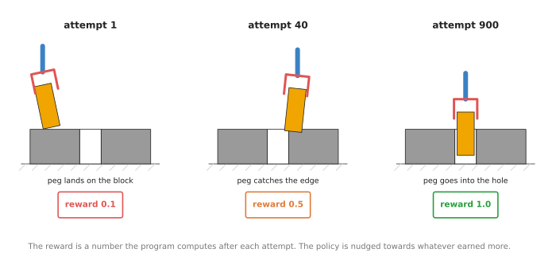
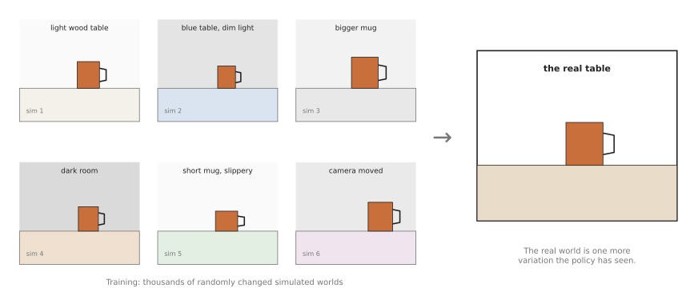

# Reinforcement learning policies

The four pages before this one all assumed that a person can do the task,
because a copying policy has nothing to learn from otherwise. So this page
answers one question: how can a robot arm learn a movement that nobody can show
it, by trying again and again and being told how well each try went? That way of
learning is called reinforcement learning, and the model it produces is a
reinforcement learning policy.

The page is for a reader who has read
[how a model learns](../../01_what-models-are/02_how-a-model-learns.md) and, ideally,
[behaviour cloning](../02_most-used/01_behaviour-cloning.md). Behaviour cloning
copies a person, whereas reinforcement learning does not need a person to do the
task at all, because it needs a way to score each attempt instead. Every new word is
explained where it first appears.

## Contents

1. [What it is](#1-what-it-is)
2. [What goes in and what comes out](#2-what-goes-in-and-what-comes-out)
3. [How it works inside](#3-how-it-works-inside)
4. [How it is trained](#4-how-it-is-trained)
5. [Well-known models and methods](#5-well-known-models-and-methods)
6. [Where to read next](#6-where-to-read-next)

---

## 1. What it is

The introduction said that the arm learns by trying, so here is that idea in one
sentence. The arm tries a movement, a program gives the attempt a score, and the
model is changed a little, so that high-scoring movements become more likely
next time.

The score is called the **reward**, and it is a number that a person writes a
rule for, such as "1 if the peg is in the hole, 0 if it is not". The model that
picks the movements is called the **policy**, as it is on every page in this
chapter. The process of trying, scoring and adjusting, over and over, is called
**reinforcement learning**, which is often shortened to RL. The word
"reinforcement" means that actions which led to a good score are made stronger.

For example, think of a child learning to throw a ball into a bin, where nobody
explains the angle of the arm or the force of the throw. The child throws, sees
whether the ball went in, and throws again a little differently. So after many
throws the child is good at it, and the child needed only one piece of
information each time, which was in or out.

Reinforcement learning works the same way, but with two differences. It needs
far more tries than a child does, often millions of them. And the rule for the
score has to be written down exactly, because the computer follows it exactly.



So the picture shows three attempts from early, middle and late in training. The
first
attempt misses and scores low, while the last one puts the peg in the hole and
scores
1.0. Those numbers are an example of a reward rule, and not a measurement.

---

## 2. What goes in and what comes out

Section 1 introduced the reward, so this section shows where it sits among the
other numbers. A reinforcement learning policy for an arm takes in a description
of the current moment, which is called the **observation**, and for an arm it
can include:

- the joint angles and how fast each joint is turning
- the position of the gripper
- readings from a force sensor at the wrist, which measure how hard the arm is
  pushing on something
- sometimes camera pictures, although many policies use simple numbers instead,
  because pictures make learning much slower

Then it gives back one **action**, which is a small movement command for the
next moment, such as "move the gripper 2 mm down and 1 mm left". The policy is
asked again many times a second, so the arm moves in many small steps.

The table below shows one concrete example of all of these. Read each row as one
input or output of the policy.

| | What it is | An example for pushing a peg into a hole |
| --- | --- | --- |
| In | joint angles and speeds | six angles and six speeds |
| In | gripper position | where the peg tip is, in millimetres |
| In | force at the wrist | how hard the peg presses on the block, and in which direction |
| Out | an action | a small push: 2 mm down and 1 mm left, repeated many times a second |
| Used only in training | the reward | 1.0 when the peg is fully in, less when it is close |

Notice that the reward is not an input to the finished policy. It is only used
while training, to decide how to change the policy.

---

## 3. How it works inside

Section 2 said what goes in and out, and this section says what sits between them.
Inside, the policy is usually a small neural network. A **neural network** is a
calculation with many adjustable numbers, and Chapter 1 explains it in
[inside a neural network](../../01_what-models-are/03_inside-a-neural-network.md).
For a task that uses simple numbers as input, the network can be small, with only a
few layers.

So what makes reinforcement learning different is not the network. It is the
loop around the network during training, and here is that loop.

1. The arm, which is usually a simulated one, starts in some position.
2. The policy looks at the observation and picks an action. While learning, it adds
   a little randomness, so that it sometimes tries something new, and this is called
   **exploration**.
3. The arm makes that movement, and the simulation works out what happened.
4. The program computes the reward for what happened.
5. This repeats until the attempt ends, either because the peg goes in or because
   time runs out, and one whole attempt is called an **episode**.
6. After many episodes, a learning method looks at which actions came before high
   rewards and which came before low ones. Then it changes the network's numbers, so
   that the good actions become more likely.
7. Back to step 1, with the slightly better policy.

Step 6 leaves one thing open, and that one thing is what separates the two
algorithms section 5 recommends most. Some methods learn from a batch of attempts
once and then throw the batch away, which is what PPO in sub-section 5.1 does.
Others keep every attempt and train on it again and again, which is what SAC in
sub-section 5.2 does. The rest of the loop is the same either way.

Many methods also train a second network, called a **critic** or a **value
function**, which learns to guess how much reward is still to come from the
current moment. This helps, because the real reward often arrives only at the
very end, so the critic lets the learner tell early on whether things are going
well. All three of the methods recommended in sub-sections 5.1 to 5.3 train one.

One difficulty in that loop is important enough to need a name. When the reward
only arrives at the end, the learner has to work out which of hundreds of small
actions deserved the credit. This is called the **credit assignment problem**,
and it is one reason reinforcement learning needs so many tries. Sub-section 5.4
describes a method that attacks it directly, by reading the change in the
critic's score from one moment to the next as the measure of whether the action
in between helped.

---

## 4. How it is trained

Section 3 described a loop that runs many times, and this section says where
those runs happen. Reinforcement learning makes its own data by trying things,
so it does not need recorded demonstrations. But it needs a very large number of
tries, often in the millions. A real arm cannot do millions of tries, because it
would take years, and it would wear out or break things. So almost all
reinforcement learning for arms happens in a **simulator**, which is a program
that works out how a virtual arm and virtual objects move and bump into each
other. A simulator can run thousands of virtual arms at once, much faster than
real time, on a graphics card.

But this creates a new problem, because the simulator is never exactly like the
real world. Friction, weight, springiness and camera pictures are all a little
wrong, so a policy that learned in the simulator can fail on the real arm, and
this gap is called the **sim-to-real gap**.

The most common fix for that gap is called **domain randomisation**. Instead of
building one very accurate simulated world, you train in thousands of slightly
different ones. Each one has a different table colour, different lighting, a
different friction, a slightly different mug size, or a camera in a slightly
different place. The policy has to work in all of them, so the real world is,
with luck, just one more variation it has already met.



The picture shows six of the randomised training worlds on the left, each with
one thing changed, and the real table on the right.

But there are two other ways to get the practice.

- **Offline reinforcement learning** learns from a fixed pile of recorded attempts,
  without practising at all.
- **Real-world reinforcement learning** practises on the real arm, but only for a
  short time. It usually starts from a policy that already works a little, which is
  often one trained by copying. A person watches and can take over when the arm goes
  wrong, and those corrections help the learning.

The second of these is where much of the useful work happens in 2026, and the
[learned methods document](../../../03_frameworks/04_one-arm-training/03_learned-methods.md#2-learning-from-trial-and-error)
describes the evidence.

---

## 5. Well-known models and methods

The pages before this one each end with a shelf of models you can download. This
page cannot, and saying so plainly is the most useful thing in it. Reinforcement
learning is the one method in this chapter where you train rather than download,
because a finished policy belongs to one reward rule, one simulated world and one
robot, so nobody publishes it for you to pick up. The names worth knowing are
therefore the learning methods and the libraries that implement them, and the rest of
this section helps you choose one of each.

Read the table as a shortlist of choices rather than of products. The left column
names the method and says how current it is. The right column holds everything you
need in order to compare them: what the thing is, what it is best at, how much
practice it needs, the licence of the code you would run, and when to pick it. These
are methods, so where a model's size would normally go you get the amount of practice
instead, which is the cost that decides most projects. Each licence is the licence of
the code you would actually run, read from that project's own licence file, because a
method itself has no licence.

| Name | What decides it |
| --- | --- |
| **PPO**, most used in 2026 | PPO is an algorithm from 2017, and it is best where a simulator runs many arms at once. It needs millions of steps of practice. The code you would run is Stable-Baselines3, which is MIT. Pick it when you can simulate the task and score it. |
| **SAC**, most used in 2026 | SAC is an algorithm from 2018, and it learns from as few attempts as possible. It needs far fewer steps than PPO, because it replays a store of past ones. The code you would run is Stable-Baselines3, which is MIT. Pick it when every attempt costs real time. |
| **HIL-SERL**, most used in 2026 | HIL-SERL is a system you can run, published in 2024, and it improves a half-working policy on the real arm. It needs one to two and a half hours of real practice. Its code is Apache-2.0, and it ships inside LeRobot. Pick it when you have the arm, and a person to watch it. |
| **Recap**, in π\*0.6, worth betting on | Recap is a method from 2025, and it polishes a large pretrained policy. The practice it needs is `not stated`. No code or weights were released, so you cannot pick it today, but it is worth following. |
| **Offline: IQL and CQL**, historical | IQL and CQL are algorithms that learn from recordings without practising, so they need no practice at all. Their licence was not checked. Pick them almost never now, and sub-section 5.5 says why. |
| **The landmark systems**, historical | These are published results from 2018 to 2023, and they show what the method has achieved. They took weeks of real collection, or none at all, and their licences are various. Pick them when you are reading rather than building. |

### 5.1 PPO, for practising in a simulator

**Most used in 2026** when the practice happens in a simulator, because it stays
stable while thousands of simulated arms practise at once.

Millions of steps of practice, an NVIDIA card to run a simulator fast enough to
produce them, and MIT for the Stable-Baselines3 code you would run.

PPO stands for Proximal Policy Optimization, and OpenAI published it in July 2017 in
[Proximal Policy Optimization Algorithms](https://arxiv.org/abs/1707.06347).

The one idea PPO is built on is that the policy may only be changed a little at a
time. The reason is the one section 3 mentioned: the attempts PPO learns from were
made by the policy as it stood a moment ago, so the further the policy moves away from
that, the less those attempts say about it. PPO's answer is to put a hard limit on how
far one update may move the policy. That limit is the "proximal" in its name, and it
is why a PPO run of many hours rarely falls apart.

What that changes inside is small but it decides everything else. PPO trains a critic,
which is the second network section 3 described, and uses it to work out the
**advantage** of each action, meaning how much better the attempt turned out than the
policy expected at that moment. The update then takes the chance that the new policy
would choose that action, divides it by the chance that the collecting policy would
have chosen it, and multiplies the result by the advantage. The limit is applied to
that division: once the ratio leaves a narrow band around one, the update stops
rewarding any further movement in that direction. So the batch is worth a few passes
of learning, and then the policy has moved as far as it is allowed and the batch is
thrown away.

What that buys is stability and scale. The limit does not care how many arms filled
the batch, so a thousand simulated arms can all pour into one update and the run
behaves the same, which is why most large-scale simulation results in this field are
PPO results. What it costs is everything the throwing away costs. Each step of practice
teaches the policy once, inside those few passes, and is then gone, so the only way to
learn a hard task is to produce an enormous number of steps.

On a robot arm that cost is the whole decision. In a simulator running a thousand
arms on a graphics card, a discarded step costs almost nothing, so the stability is
free. On a real arm, a step is a second of real movement with somebody standing by to
put the block back, so discarding it is the most wasteful thing you could do with it.
That is why nobody runs plain PPO on real hardware, and why the two sub-sections after
this one both keep their attempts instead.

So pick PPO rather than SAC in the next sub-section when attempts are cheap, because
what you want in a simulator is a run that does not collapse overnight.

The simulator, not the algorithm, is what you have to choose carefully.
[Isaac Lab](https://github.com/isaac-sim/IsaacLab) (BSD-3) and
[MuJoCo Playground](https://github.com/google-deepmind/mujoco_playground) (Apache-2.0)
are where large-scale practice happens, and both want an NVIDIA card, so on an Apple
Silicon Mac you are limited to plain MuJoCo on the processor and to small tasks. Note
also that Isaac Gym, the simulator behind a great many older papers, is officially no
longer supported, and Isaac Lab replaced it, so a tutorial built on Isaac Gym is out
of date. What most often goes wrong is not the algorithm but the reward.

The library for the algorithm itself is
[Stable-Baselines3](https://github.com/DLR-RM/stable-baselines3), which is MIT and
installs with `pip install "stable-baselines3[extra]"`. The code below trains on
sixteen copies of a simulated pushing task from
[panda-gym](https://github.com/qgallouedec/panda-gym) (MIT,
`pip install panda-gym`).

```python
import panda_gym                       # registers the Panda tasks with gymnasium
from stable_baselines3 import PPO
from stable_baselines3.common.env_util import make_vec_env

# Sixteen copies of the task in one process. PPO learns from all of them together,
# which is the whole reason it suits a simulator.
env = make_vec_env("PandaPush-v3", n_envs=16)

# MultiInputPolicy because this task's observation is a dictionary, holding the
# arm's state, the object's position and the goal separately.
model = PPO("MultiInputPolicy", env, n_steps=2048, batch_size=64, verbose=1)
model.learn(total_timesteps=2_000_000)
model.save("ppo_panda_push")
```

Stable-Baselines3 gives you the algorithm. `n_steps=2048` and `batch_size=64` are its
own defaults for PPO, and with sixteen copies of the task each update learns from
32,768 steps of experience. What panda-gym gives you is the simulated arm, built on
the PyBullet physics engine, the task and, most importantly, the reward. On your own
task you write that reward yourself. For a wider set of manipulation tasks,
[robosuite](https://github.com/ARISE-Initiative/robosuite) (MIT) provides them on
MuJoCo instead, and it runs on Apple Silicon because MuJoCo does.

### 5.2 SAC, for when every attempt is expensive

**Most used in 2026** when attempts are expensive, because it reuses old attempts
instead of throwing them away.

Far fewer steps of practice than PPO, a laptop if the observations are plain numbers,
and MIT for the Stable-Baselines3 code you would run. The store of past attempts needs
memory of its own, and that is the part that grows.

SAC stands for Soft Actor-Critic, and researchers at the University of California,
Berkeley published it in January 2018 in [Soft Actor-Critic: Off-Policy Maximum
Entropy Deep Reinforcement Learning with a Stochastic
Actor](https://arxiv.org/abs/1801.01290).

The one idea SAC is built on is that you can learn something that does not belong to
the current policy. What SAC's critic learns is the value of a situation together with
a movement: if you are here and you do this, how much reward follows. That statement
is about the world, not about the policy, so it stays true no matter which policy made
the attempt. PPO's limit exists because its update is a statement about the policy that
collected the batch. SAC has no such tie, so an attempt made an hour ago by a much
worse policy is still perfectly good data.

What that changes inside is that the attempts are kept. Every step the robot takes
goes into a store called a **replay buffer**, and each update draws a random handful
out of the store rather than using what just happened. The same movement is therefore
learned from many times, in different combinations, which is the saving in attempts
the table credits it with. The numbers in Stable-Baselines3 say the difference
plainly: SAC's buffer holds 1,000,000 past steps by default and it trains on a batch
of 256 of them after every single step the robot takes, where PPO waits for 2,048
fresh steps and then discards them.

Keeping the attempts brings its own problem, and most of SAC's parts exist to handle
it. A critic that is asked to score movements nobody has tried lately drifts towards
being over-confident about them, and the actor then goes and performs them. So SAC
trains two critics and believes the lower of their two scores, which means a score
has to be over-confident in both of them before it is acted on. It keeps a slowly updated copy
of them, so the target a critic is trained towards does not move as fast as the critic
does. And it pays the policy a little for keeping some randomness, with the size of
that payment tuned automatically, which stops the policy settling early on the first
thing that half worked. Where PPO's correctness came from one limit, SAC's comes from
this stack, and each piece of it quietly ruins a run when it is wrong.

On a real arm the difference is exactly the number of attempts you have to pay for.
Suppose you can afford two hundred attempts before the hardware or your patience runs
out. SAC will have learned from each of those attempts many times over by the end,
while PPO will have learned from each of them once and discarded it. That is the whole
reason a real arm gets SAC and a simulator gets PPO. The same property has a limit
worth knowing: a million camera pictures will not fit in a laptop's memory, which is
one reason these policies often take plain numbers as input rather than pictures, as
section 2 said.

Pick SAC rather than PPO when you count your attempts, which means on a real arm, or
in a simulator too slow to run many copies. What it costs you is the complexity above,
and getting a tested implementation is the real value of the library here.

The library is Stable-Baselines3 again, and the simulated arm below is panda-gym.

```python
import gymnasium as gym
import panda_gym
from stable_baselines3 import SAC

env = gym.make("PandaPickAndPlace-v3")
model = SAC("MultiInputPolicy", env, buffer_size=1_000_000, batch_size=256, verbose=1)
model.learn(total_timesteps=500_000)
model.save("sac_panda_pick_and_place")

observation, info = env.reset()
# deterministic=True switches off the exploring randomness, so the trained
# policy does its best instead of trying something new.
action, _ = model.predict(observation, deterministic=True)
observation, reward, terminated, truncated, info = env.step(action)
```

Look at `total_timesteps=500_000` before you believe this is cheap. If the arm
decides twenty times a second, half a million steps is about seven hours of
continuous motion, and on a real arm it is far more, because somebody has to put the
object back after every attempt. What you have to supply for your own robot is a
simulator of that arm, accurate enough to train against, plus the randomisation of
section 4 and usually a short spell of real practice at the end. That last step is
the subject of the next sub-section.

### 5.3 HIL-SERL, for learning on the real arm

**Most used in 2026** for work on a real arm, and the one entry on this page whose
published numbers are strong enough to plan around.

One to two and a half hours of real practice, a real arm with a person sitting beside
it, and Apache-2.0 for the code, which ships inside LeRobot.

HIL-SERL stands for Human-in-the-Loop Sample-Efficient Robot Learning, and it came
from the University of California, Berkeley in 2024
([project page](https://hil-serl.github.io/),
[repository](https://github.com/rail-berkeley/hil-serl)).

The one idea it is built on is that a person watching a robot is worth more as an
interrupter than as a demonstrator. A demonstration shows the policy a situation the
person chose. A take-over, where the person grabs the controller the moment the arm is
about to fail, shows the policy the one situation it actually gets wrong, together
with the way out of it. Those are the most valuable steps in the whole run, and they
are the ones no amount of demonstrating in advance will produce, because nobody knows
in advance where this policy will go wrong.

That idea only works because of SAC's property from the sub-section above. The
take-overs were not produced by the policy, so a method that needed its own attempts
could not learn from them at all. HIL-SERL therefore runs SAC underneath, and keeps
two stores rather than one: a store of prior data, holding the demonstrations and the
person's corrective movements, and a store of what the robot has done by itself. Every
update draws half its batch from each, which is a published recipe called RLPD, short
for reinforcement learning with prior data. The policy's own movements from either
side of a take-over go only into the robot's store, so the person's corrections are
never confused with the mistakes that provoked them.

Two more parts make it work on real hardware. The reward is not a rule somebody wrote
but a classifier trained on the demonstration images beforehand, which looks at the
scene and makes a yes-or-no judgement about success, and that is how a task like
"the connector is seated" gets a reward at all. And the system runs as two processes:
one drives the arm and takes the person's input, the other does the updates and sends
new weights over, so the arm keeps moving while the learning happens instead of
pausing for every gradient step. The gripper gets its own separate critic, because
open and closed is a choice between two things rather than a number to nudge, and
treating it as a number works badly.

Pick it rather than training in simulation with PPO because it removes the simulator,
which section 4 named as the hardest part to get right. The published result is the
reason to take it seriously. HIL-SERL reached 100 per cent success on every task it
was tried on, after between one and two and a half hours of training on the real
robot, on tasks including seating memory in a motherboard, inserting an SSD and a USB
connector, clipping a cable, fitting a timing belt and assembling IKEA panels, where
the strongest copying baseline on the same tasks averaged under 50 per cent. That was
peer-reviewed in *Science Robotics*, which is worth saying in a field where most
strong numbers are published by the company that produced them.

What it costs you is several hours of a person's time and a prepared robot. Somebody
has to sit with the arm throughout, holding the controller. You also need force and
speed limits underneath the policy, a way to put the task back to its starting state
between attempts, and a reward classifier you trust, and the
[learned methods document](../../../03_frameworks/04_one-arm-training/03_learned-methods.md#12-interactive-imitation-correcting-it-as-it-goes)
gives the evidence and the practical requirements. One other thing to know: its
predecessor SERL is formally deprecated in favour of it, so ignore any tutorial built
on SERL.

The original repository is Apache-2.0, read from its licence file, but the version to
use is the one inside [LeRobot](https://github.com/huggingface/lerobot), documented
as [its reinforcement learning
workflow](https://huggingface.co/docs/lerobot/hilserl). It runs as two processes.

```bash
# The learner holds the policy and does the SAC updates.
python -m lerobot.rl.learner --config_path train_config_hilserl_so100.json

# The actor, in a second terminal, drives the arm and sends its experience back.
python -m lerobot.rl.actor --config_path train_config_hilserl_so100.json
```

LeRobot gives you the actor-and-learner split, the SAC implementation underneath it
and the gamepad handling. What you supply is that JSON file and the robot. The file
names your arm, your cameras, the reward classifier and an `algorithm` block whose
`type` is `sac`. Before either command runs you record the demonstrations and train
the classifier, which LeRobot does with its own commands. To walk through the whole
workflow without any hardware, the [gym_hil](https://github.com/huggingface/gym-hil)
package gives you a simulated Franka arm with gamepad take-overs, in tasks such as
`PandaPickCubeGamepad-v0`.

### 5.4 Practice on top of a pretrained policy

**Worth betting on**, because the field has largely stopped training policies from
nothing, and this is what it does with reinforcement learning instead.

The practice it needs is not stated, there is no machine to put it on and no licence
to read, because nothing was released.

The idea is to train a large policy by copying demonstrations, and then let it practise
and be corrected rather than collecting more demonstrations. The clearest published
instance is π*0.6 from Physical Intelligence, published on 17 November 2025, and its
method is called Recap.

The one idea Recap is built on is that you can keep the simple training of a copying
policy and hand it the scoring as one more input. Recap first trains a value
function, which is the critic of section 3, to say how close a situation is to
success. It then uses that value function to work out, for every action already in its
pile of data, whether that action moved the situation forwards or backwards, and it
reduces the answer to a single yes-or-no flag. The policy is then trained to copy the
data as usual, but with the flag given to it alongside the pictures and the
instruction. At run time you set the flag to yes, and you get the version of the
behaviour that worked. Its name says so: Recap is short for reinforcement learning
with experience and corrections via advantage-conditioned policies, and an
**advantage** here is the same quantity PPO used, meaning how much better an action
turned out than expected.

That is a different shape from everything above it. PPO and SAC both push gradients
through a critic to change the policy, and the policy has one job, which is to produce
the best action it can. Recap's policy has two inputs instead, and the hard
reinforcement learning work has moved into the labelling of the data. Because of that,
three very different kinds of data can go into one pile: the original demonstrations,
a person's take-overs in the style of HIL-SERL, and the robot's own autonomous
attempts, good and bad. The flag is what tells the policy which parts of that pile to
imitate, so bad attempts are useful rather than harmful, which is not true of plain
copying.

The problem that shape solves is the one section 3 named. When a long job fails, the
mistake that caused it usually happened much earlier than the failure, and working
out which action to blame is the credit assignment problem. The value function is
Recap's answer to it, because the change in its score from one moment to the next
says whether the action in between helped, whatever happened later. On an arm that is
the difference between a job of one movement and a job of twenty. A policy that folds
a shirt can fail at the last fold because of the way it picked the shirt up, and
neither plain copying nor a single score at the end will ever tell it so.

Bet on this rather than on training from scratch because it fixes the thing that
copying cannot fix. Demonstrations show what success looks like and never show how to
recover from the particular mistakes that your policy makes. It is also where the
field's attention has gone, since training a reinforcement learning policy from
scratch is now the exception rather than the rule, and this repository's frontier
chapter calls demonstrate-then-polish the most important arrival of the year.

What it costs you today is that you cannot have it, because none of it is released,
neither the code nor the weights. The figures that exist come from the company
itself, and its per-task numbers appear only as bar charts rather than in the text,
so read them as a direction and not as a measurement. Its authors also name the limit
themselves, which is that the corrections are only as good as a person's judgement
about when to step in, and that works for obvious mistakes and not for subtle ones.
So there is no code to show here, and the nearest thing you can actually run is
HIL-SERL in 5.3, which is the open version of the human-take-over stage. The
[frontier chapter on foundation models](../../../03_frameworks/08_frontier/02_foundation-models.md)
records what was claimed, with its sources.

### 5.5 Offline reinforcement learning: IQL and CQL

**Historical**, kept because it explains a part of the methods above rather than
because you should start a project with it.

No practice at all, because it learns from recordings, a laptop if those recordings
are plain numbers, and a licence you have to check yourself, since there is no one
implementation to point at.

Offline reinforcement learning learns from a fixed pile of recorded attempts and
never practises at all, which section 4 listed as one of the three ways to get the
practice. IQL and CQL are the two algorithms people name.

Both are built on one idea, which is the far end of the question this page keeps
coming back to. SAC kept its attempts and still made new ones, while an offline method
keeps the attempts and makes none. That removes the one thing that was keeping the
critic truthful. Section 5.2 said that a critic drifts towards being over-confident
about movements nobody has tried lately, and SAC caught that drift because the actor
eventually tried the movement and the reward came back low. With no new attempts,
nothing ever contradicts the critic, so one invented movement with a high score can
ruin the whole policy.

The two algorithms attack that from opposite ends, and the difference is worth knowing
because it is the same choice every offline method faces. CQL, short for conservative
Q-learning, lets the critic score anything but adds a penalty that pushes down the
scores of movements the recordings do not contain, so the critic is deliberately
pessimistic about the unknown. IQL, short for implicit Q-learning, never asks the
question at all: it fits the value of a situation from the outcomes actually recorded
there, leaning towards the better ones, and then trains the policy to copy the
recorded actions in proportion to how good they looked. So CQL corrects the critic,
and IQL never asks it a question it cannot answer.

The reason it is historical is not that it stopped working. Its benchmark suite, D4RL,
was formally deprecated, with [Minari](https://github.com/Farama-Foundation/Minari)
as its replacement for datasets, and its algorithms were absorbed into the
post-training of copied policies, which is sub-section 5.4. Recap's value function is
trained exactly this way, from a fixed pile, which is why this sub-section is here at
all. So read this branch to understand how a critic can be trained without new
attempts, and take its datasets from Minari rather than from a tutorial built on D4RL.
Stable-Baselines3 does not implement either algorithm, which is itself a fair guide to
how much demand there is.

### 5.6 The landmark systems

**Historical**, and listed because people cite these as the proof that the method
works on real hardware, so it is worth knowing what each one actually showed.

Weeks of real collection or none at all, hardware that almost nobody reading this
has, and various licences. None of them ships a policy you can download.

[QT-Opt](https://arxiv.org/abs/1806.10293) (Google, 2018) learned to grasp objects
from a bin using several real robot arms at once, collecting attempts over weeks. It
showed that learning on real hardware was possible, and how costly it was.
[Dactyl](https://arxiv.org/abs/1808.00177) (OpenAI, 2018, with a
[Rubik's Cube follow-up](https://arxiv.org/abs/1910.07113) in 2019) learned to turn a
block in a robot hand's fingers, trained only in simulation with heavy domain
randomisation. [IndustReal](https://github.com/NVLabs/industrealkit) (NVIDIA, 2023)
fitted pegs and gears into holes after training only in simulation, transferring to a
real Franka arm with no real practice at all, and reaching between 83 and 99 per cent
across 600 trials on parts modelled on a standard assembly test board. Its successor
FORGE improved gear meshing to 98 per cent and nut threading to 69 per cent while
halving the contact forces.

The three sit at three different points on the one question this page keeps coming
back to, which is what you do with an attempt once it is made, and that is the most
useful thing about reading them together. QT-Opt is the far end of keeping them. It
has no network that outputs a movement at all. It learned only a scoring function,
which rates a candidate movement given the camera picture, and it chooses what to do
by proposing many random candidate movements, keeping the best-scored of them,
proposing more near those, and keeping the best again. Because nothing in that depends
on which policy made an attempt, every grasp any robot had ever tried stayed useful,
which is the only reason a pile collected over weeks was worth having.

Dactyl is the opposite choice. It is PPO, so it discards each batch, and it could
afford to because every one of its attempts was simulated. What it added was memory:
its policy carries an internal state from one moment to the next, so it can work out
from the first part of an attempt what this particular world's friction and weight
feel like and adjust inside the same attempt. Its authors report that a policy
without that memory, trained on the same randomised worlds, did markedly worse on the
real hand. So where domain randomisation alone asks for
one policy that is adequate everywhere, memory asks for a policy that works out where
it is.

IndustReal is PPO as well, and it is the most useful one to read if you work with an
arm, because its three contributions are all about making a simulated reward tell the
truth. Its reward is built from a precomputed field of distances to the part's target
pose, so the policy is told how far off it is in position and orientation together,
rather than from hand-weighted scores for each. Its curriculum lets the peg start
anywhere in the full range from the beginning but raises the minimum starting height
as the policy improves, which stopped the policy overfitting to easy, nearly finished
insertions. And its policy update checks how far the simulated parts passed through
each other and discounts the attempts where they passed through a lot, because a
policy will happily learn to push a peg through solid metal if the simulator lets it.

Read IndustReal's caveats rather than its headline, because they say what the method
cannot yet do. Its authors deliberately used no force sensor at all, working from
vision and joint positions, on the grounds that such sensors are costly, noisy and
fragile. The clearances were half a millimetre, which is much looser than a real
electrical connector. And none of it is deployed in a factory. None of these four
systems ships a policy you can download, which is the point section 5 opened with.

### 5.7 How to choose

Before choosing anything here, check that you need this method at all, because most
arm tasks do not. If a person can demonstrate the task, the earlier pages in this
chapter are far less work for the same result.

When you do need it, the default is not to train from nothing. Train a copying
policy first, then improve it on the real arm with HIL-SERL, which is sub-section
5.3. That is the one recipe here with published numbers strong enough to plan
around, and it needs no simulator.

Three things change that answer.

If nobody can demonstrate the task at all, you have nothing to improve, so you train
in simulation. Use PPO from 5.1 with a simulator that runs many arms at once, and
expect the simulator and the reward to take more of your time than the learning does.

If attempts are expensive, because the simulator is slow or the practice is on the
real arm, use SAC from 5.2 instead of PPO, because replaying old attempts is the
whole point of it.

If you are learning the subject rather than shipping a robot, install
Stable-Baselines3 with panda-gym and read the SAC implementation. It is MIT, it runs
on an Apple Silicon Mac, and watching a simulated arm fail for an afternoon will
teach you more about reward design than reading does.

Leave 5.4, 5.5 and 5.6 out of the decision. One is not released, and the other two
are there to be read.

---

## 6. Where to read next

This page covered the first of the also-used methods, and the reading below
either compares it with copying or moves on to the next one.

In this chapter:

- [Diffusion and flow policies](../02_most-used/03_diffusion-and-flow-policies.md) learn by copying
  instead of by scoring.
- [Learned motion planners](02_learned-motion-planners.md) is the next page, and it
  covers networks that speed up classical planning.
- [The movement models overview](../01_overview.md) compares every kind in this
  chapter.

In other chapters of this book:

- [Latent world models](../../08_world-models/03_also-used/03_latent-world-models.md) explains
  learners that practise inside their own imagined world, which needs far fewer real
  tries.
- [Learned simulators](../../08_world-models/03_also-used/02_learned-simulators.md) covers networks
  that stand in for parts of a simulator.
- [Force and slip models](../../09_touch-and-body-models/02_most-used/01_force-and-slip-models.md)
  explains the force signals these policies often react to.

Deeper documents elsewhere in this repository:

- [Learning from trial and error](../../../03_frameworks/04_one-arm-training/03_learned-methods.md#2-learning-from-trial-and-error)
  gives the evidence, the branches of the method and where it stands in 2026.
- [Sim-to-real: what actually closed the gap](../../../03_frameworks/08_frontier/04_simulation-and-evaluation.md#5-sim-to-real-what-actually-closed-the-gap)
  goes deeper into moving from simulation to a real arm.
