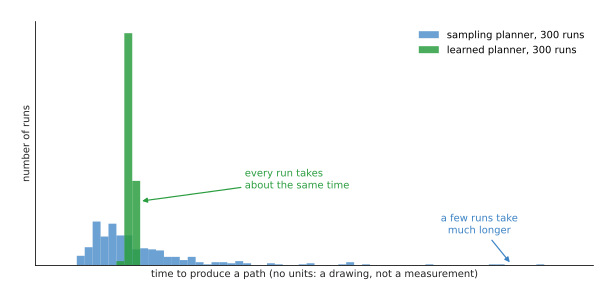
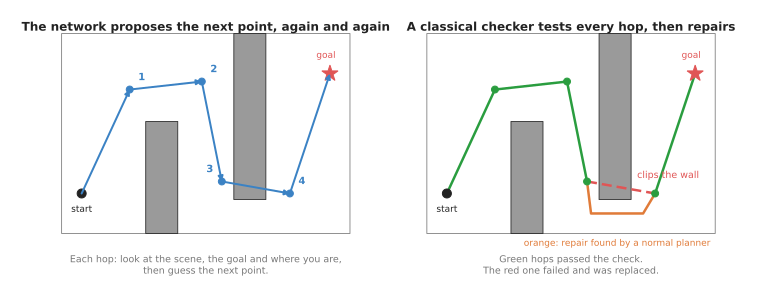
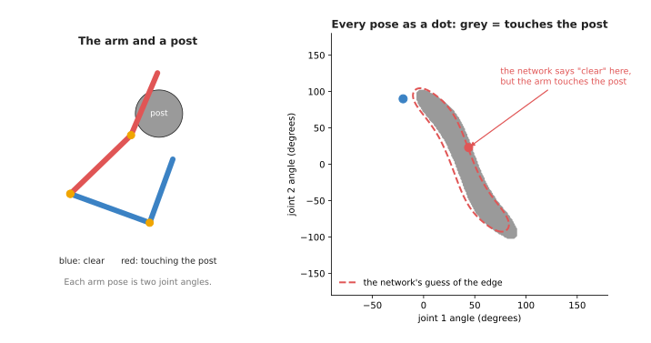
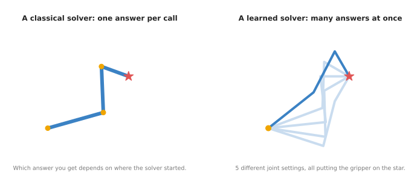

# Learned motion planners

The previous page covered learning by trying, which takes over the part of a
move where the arm touches something. So this page turns to the other part of
the move, which is the long travel through open space. It answers one question:
where can a neural network help an ordinary motion planner move an arm, and
where is it better to leave the planner alone? It covers three kinds of learned
helper, which are networks that plan a whole route, networks that check for
collisions, and networks that work out joint angles.

The page is for a reader who knows what a robot arm and its joints are, and who has
read the [movement models overview](../01_overview.md). You do not need to know how a
motion planner works inside, because section 1 explains just enough of it. Every new
word is explained where it first appears.

The honest summary comes first, because it is the most useful thing on the page.
For moving an arm through open space, an ordinary planner is usually the better
tool, since it is fast enough, it checks every move for collisions, and it is
free. So a learned planner earns its place in a smaller set of jobs, which this
page describes.

> Before this page, it helps to have read [sampling-based
> planning](../../../06_programming-techniques/06_planning-and-search/02_most-used/01_sampling-based-planning.md),
> which explains the ordinary planner and the collision checker that the networks on
> this page learn from. Section 1 gives just enough of it if you have not.

## Contents

1. [What it is](#1-what-it-is)
2. [What goes in and what comes out](#2-what-goes-in-and-what-comes-out)
3. [How a learned route planner works](#3-how-a-learned-route-planner-works)
4. [Learned collision checking](#4-learned-collision-checking)
5. [Learned inverse kinematics](#5-learned-inverse-kinematics)
6. [How they are trained](#6-how-they-are-trained)
7. [Well-known models of this kind](#7-well-known-models-of-this-kind)
8. [Where to read next](#8-where-to-read-next)

---

## 1. What it is

The introduction promised just enough about ordinary planners, so this section
gives it, and then states the idea in one sentence. In short, a learned motion
planner is a network that has studied a large number of answers from an ordinary
planner. So it can give a similar answer much faster, in about the same time
every run.

But first, what is an ordinary planner? A **motion planner** is a program that
finds a
route for the arm from where it is to where it needs to go, without hitting
anything.
A common kind, called a **sampling-based planner**, tries many random arm positions
and throws away the ones that hit something. Then it joins up the good ones until it
has a route from start to goal. But before it accepts any move, it asks a
**collision
checker**, which is a program that tests whether the arm's shape overlaps any
obstacle's shape.

This approach works well. But the time it takes varies, because it usually
answers quickly, while sometimes, in a tight space, it keeps trying random
positions for much longer.



The picture is a drawing of the idea, and not a measurement. The blue bars show
a sampling planner, where most runs are quick but a few take much longer. The
green bars show a learned planner, where every run takes about the same short
time.

For example, a new taxi driver in a city uses a map and works out each route,
while an experienced driver has driven thousands of routes and just knows which
way to go. So the experienced driver is quicker than the new one. But the
experienced driver can still make a wrong turn in a street that has changed, and
the map can tell them so. A learned planner matches the experienced driver,
while the ordinary planner and collision checker match the map, and they are
still needed to check the answer.

---

## 2. What goes in and what comes out

Section 1 described one learned helper, but there are three kinds, and they take
different inputs and give different outputs. The table below lists them, and you
read each row as one kind of helper.

| Kind | What goes in | What comes out | What it replaces |
| --- | --- | --- | --- |
| Learned route planner | a 3D picture of the scene, the arm's current joint angles, the goal | the next arm position, or a whole route | the search part of a sampling planner |
| Learned collision checker | a set of joint angles, and the scene | "hit" or "clear", or a distance to the nearest obstacle | the exact geometric test, while searching |
| Learned inverse kinematics | where the gripper should be, and which way it should point | one or many sets of joint angles that put it there | an iterative solver |

A **3D picture of the scene** here usually means a point cloud, which is a list
of 3D
dots on every surface a depth camera sees, and the
[point cloud models page](../../04_3d-models/02_most-used/01_point-cloud-models.md) explains these.

---

## 3. How a learned route planner works

The first row of the table was the learned route planner, and it comes in two
main designs. Both of them feed the scene and the goal into a network.

The first design proposes **the next point, over and over**, and here is how
that design goes.

1. A part of the network turns the point cloud into a short list of numbers that
   describes where the obstacles are.
2. The network looks at that description, the current arm position and the goal
   position, and then it suggests the next arm position, which is a short hop
   towards the goal.
3. The arm position moves to that suggestion, and step 2 repeats.
4. It stops when the suggestion reaches the goal.
5. A classical collision checker tests each hop, and if a hop hits something, then
   an ordinary planner finds a replacement for just that hop.



On the left, the network proposes four points in turn, from the start to the
goal. On the right, the checker passes the green hops, finds that one red hop
clips a wall, and an ordinary planner replaces it with the orange detour.

Step 5 is the important one in that list. The network has learned what good
routes usually look like, but it can be wrong, so the check makes sure a wrong
route never reaches the arm. And because only one short hop needed repairing,
the whole job is still fast.

Two of the models in section 7 work in this way, and they are Motion Policy
Networks in sub-section 7.2 and Neural MP in sub-section 7.3. The ordinary
planner and the collision checker that step 5 falls back on also have names, and
sub-section 7.1 recommends them: MoveIt 2 with OMPL.

The second design is a **learned sampler**, which keeps the ordinary planner
exactly as it is. The only change is where the planner picks its random
positions. Instead of spreading them evenly everywhere, a network suggests
positions in the places where routes usually pass, such as the gap between two
shelves. So the planner finds a route sooner, and it still checks everything
itself. No model in section 7 does this, because a learned sampler is code you
write against the ordinary planner rather than a file you download, which is
what sub-section 7.6 says when it comes to choosing.

---

## 4. Learned collision checking

The second row of the table was the learned collision checker, and it exists
because a collision check has to run many thousands of times while a planner
searches. Each exact check compares the shapes of every arm link with every
obstacle, which takes time. So a **learned collision checker** is a network that
has seen many arm positions labelled "hit" or "clear", and it gives a quick
guess for a new position.

Some versions give a **distance** instead of "hit" or "clear", which is how far
the arm is from the nearest obstacle. A distance is useful to planners that
improve a route step by step, because it tells them which way to push the route
to get further from obstacles.

To see where this goes wrong, think of a simple arm with two joints and a post
beside it. Each arm position is just two angles, so you can draw every possible
position as one dot on a flat chart. Then the positions where the arm touches
the post form a grey region on that chart.



The left picture shows two arm positions, one clear and one touching the post.
The right picture shows every position as a dot on a chart of the two joint
angles, where the grey region is where the arm touches the post. The red dashed
line is the network's guess of that region's edge. It is close, but not exact,
so the red dot sits in a place where the network says "clear" when the arm is
really touching.

The network is almost always right far from the edge, and its mistakes are near
the edge. But that is exactly where a planner spends its time when it squeezes
through a gap. So a learned checker is used only to guide the search, and the
exact checker still tests the final route. The one published model of this kind
is SceneCollisionNet, in sub-section 7.4, and it is kept there as the clearest
example rather than as a recommendation.

---

## 5. Learned inverse kinematics

The third row of the table was learned inverse kinematics, and this section says
what that sum is. **Inverse kinematics**, often shortened to IK, is the sum that
answers "which joint angles put the gripper here, pointing this way?". The
ordinary way to solve it is to start from a guess and improve it step by step,
which is quick for easy targets. But it can be slow or fail for awkward ones,
and the answer you get depends on the starting guess.

Many arms also have more than one correct answer for the same target. An arm
with seven joints, or a flat arm with three joints reaching a point, can reach
that target in many different ways, because it can hold its elbow high or low,
for example.



On the left, a classical solver gives one answer. On the right, a learned solver
gives five different arm poses at once, all putting the gripper on the red star.

A **learned IK solver** is a network trained on many pairs of joint angles and
the gripper positions they produce. The pairs are easy to make, because you pick
random joint angles and work out where the gripper ends up, using the arm's
known sizes. That sum, from angles to gripper position, is called **forward
kinematics**, and it is exact and fast, so the network only has to learn to go
the other way. Some learned solvers, such as IKFlow, which sub-section 7.5
recommends, give many different answers at once, drawn from all the ways the arm
can reach the target. A planner can
then choose the answer that avoids obstacles or stays far from joint limits.

But the learned answer is usually close rather than exact. So people pass it to
the ordinary solver as a starting guess, and the ordinary solver then finishes
the job in a step or two.

---

## 6. How they are trained

Sections 3 to 5 described three different networks, and all three are trained in
the same basic way. That way has one large advantage, because the training data
is made by a computer, and not collected by people.

1. **Make many scenes.** A program places random boxes, shelves and tables around a
   simulated arm.
2. **Ask the slow, correct method.** An ordinary planner finds a route in each
   scene, or an exact collision checker labels many arm positions, or forward
   kinematics works out gripper positions for many random joint angles.
3. **Save the questions and answers.** Each scene and goal is a question, and the
   planner's route is the answer to it.
4. **Train the network to give the same answers.** Show it a question, compare its
   answer with the saved one, and adjust it a little. Then repeat that many times.

Because a computer makes the data, people can make a great deal of it. Motion
Policy Networks, which sub-section 7.2 covers, learned from millions of planner
answers, so the cost here is computing time, and not human time.

But there is a catch in step 1, because the network only learns scenes like the
ones the program made. If the program made boxes on tables, then a real kitchen
with a hanging lamp may confuse it.

---

## 7. Well-known models of this kind

Section 6 described how these networks are trained, and this section names the
tools you can download and says which one to reach for. It starts with the
written planner rather than with a network, because the written planner is what
every learned helper here has to beat, and for most moves through open space it
still wins.

Read the table one row at a time. The left column names the tool and says how
current it is. The right column holds the rest: what the tool is best at, how
large the download is, its licence, and when to pick it. Where a size is given,
it is the size of the file you have to download, and not a count of the
network's parameters, because these projects publish a trained file and no
parameter count. That file
is called a **checkpoint**, and it holds the numbers that a training run
produced. Where a row says `not stated`, the project does not publish that
figure.

| Tool | What decides it |
| --- | --- |
| **MoveIt 2 with OMPL**, most used in 2026 | This one is written rather than learned, and it handles any move through open space. It checks every move it gives you against the real shapes. There are no weights to download, and the licence is BSD 3-Clause. Always try this first. |
| **cuRobo**, most used in 2026 | This one is written rather than learned, and it produces many plans a second, so the arm can react while obstacles move. There are no weights to download, and the licence is Apache-2.0. Pick it when you have an NVIDIA graphics card and the scene keeps changing. |
| **Motion Policy Networks**, historical | This one gives one route straight from a depth camera, on a Franka arm. Its checkpoint is 229 MB, and its licence is MIT. Pick it when you want to study how a learned route planner is built and trained. |
| **Neural MP**, worth betting on | This one does the same job as Motion Policy Networks, and its weights download in one line. Its checkpoint is 86 MB. Its licence is `not stated` in the code repository, and the weights are tagged MIT. Pick it when you have a Franka arm, an NVIDIA card and a point cloud of the scene. |
| **SceneCollisionNet**, historical | This one guesses quickly whether a moved object hits anything. Its download size is `not stated`, and its NVIDIA Source Code License allows non-commercial use only. Pick it for research on tidying a cluttered table. |
| **IKFlow**, most used in 2026 | This one gives many different joint-angle answers for one gripper pose, and it is the most used of the learned helpers here. The Franka model is 204 MB. Its licence is `not stated`, because the licence file holds only the text `#TODO`. Pick it when a seven-joint arm needs a choice of inverse kinematics answers. |

### 7.1 MoveIt 2 with OMPL, and cuRobo, which are written and not learned

These two are **most used in 2026**, because a developer who has to move an arm
across a table today installs one of them and not a network.

[MoveIt 2](https://github.com/moveit/moveit2) is the motion planning framework
for ROS 2, and it is the one this repository uses. It does not plan by itself. It
calls [OMPL](https://github.com/ompl/ompl), a library from Rice University that
holds the sampling-based planners section 1 described, and RRT-Connect is the
planner it uses when nothing else is configured. Both are BSD 3-Clause, read from
their own licence files.
[cuRobo](https://github.com/NVlabs/curobo) is a different written planner, from
NVIDIA. It tries thousands of candidate trajectories at the same time on a
graphics card, which makes it fast enough to plan again every control cycle
rather than once per move. Its licence is Apache-2.0, read from its licence
file.

Why pick these rather than any network on this page? Because they check every
move they give you against the real shapes of the arm and the obstacles, so a
route that comes back has been tested rather than guessed. Every learned planner
below is trained on routes that one of these produced, so at best it copies them,
and speed is the only thing it can beat them at. You add a network when these two
are too slow in a way that costs you money, and not before.

They cost you different things. OMPL's planning time is not bounded, so a planner
that usually answers in 50 milliseconds will sometimes take a second, and that is
the fault that sends people looking at learned planners in the first place. cuRobo
removes most of that unevenness, but it needs CUDA, which means an NVIDIA
graphics card, so it does not run on an Apple Silicon Mac at all. Neither is
small to install, because MoveIt brings the whole of ROS 2 and cuRobo brings
PyTorch and a CUDA toolchain.

The library for the written planner on a graphics card is cuRobo itself, and the
code below is shortened from the motion generation example in
[its documentation](https://curobo.org/get_started/2a_python_examples.html).

```python
import torch
from curobo.types.math import Pose
from curobo.types.robot import JointState
from curobo.wrap.reacher.motion_gen import MotionGen, MotionGenConfig, MotionGenPlanConfig

# the world here is one box, 5 m across and 0.2 m thick, standing for the table
world = {"cuboid": {"table": {"dims": [5.0, 5.0, 0.2], "pose": [0, 0, -0.1, 1, 0, 0, 0]}}}

# "ur5e.yml" is an arm description that ships inside cuRobo
config = MotionGenConfig.load_from_robot_config("ur5e.yml", world, interpolation_dt=0.01)
motion_gen = MotionGen(config)
motion_gen.warmup()  # compiles the GPU work once, so later plans are fast

goal = Pose.from_list([-0.4, 0.0, 0.4, 1.0, 0.0, 0.0, 0.0])  # x, y, z then w, x, y, z
start = JointState.from_position(
    torch.zeros(1, 6).cuda(),  # all six joints at zero
    joint_names=["shoulder_pan_joint", "shoulder_lift_joint", "elbow_joint",
                 "wrist_1_joint", "wrist_2_joint", "wrist_3_joint"],
)
result = motion_gen.plan_single(start, goal, MotionGenPlanConfig(max_attempts=1))
print(result.success)
trajectory = result.get_interpolated_plan()
```

What cuRobo supplies is the collision checking, the inverse kinematics and the
optimisation, all on the graphics card, and descriptions of several arms. What
you supply is the world: the box above stands for a table, and on a real cell you
replace it with the obstacles your depth camera reports, which is the part that
takes the time. You also have to check `result.success`, because the planner can
fail and the answer is then not a trajectory.

### 7.2 Motion Policy Networks, which showed that the idea works

This one is **historical**, kept because it is the clearest example of how a
learned route planner is built, and because the model after it is built the same
way.

[Motion Policy Networks](https://github.com/NVlabs/motion-policy-networks), often
written MPiNets, is NVIDIA's learned route planner from 2022, published at the
Conference on Robot Learning. It takes a point cloud and a goal pose for a Franka
arm, and it proposes the next arm position over and over, which is the first
design from section 3. Its predecessor was MPNet, from the University of
California, San Diego, in 2019, which had the same idea and has not been changed
since 2020.

Why pick it rather than Neural MP, which is newer and comes next? Only for
reading and reproducing. MPiNets publishes the whole pipeline that generated its
training data, which is the part of the work that a team building its own learned
planner actually needs, and its code is MIT. Its code was last changed in 2023,
so for running an arm the newer model is the better choice.

What it costs you is the installation. The recommended way to install it is a
Docker container of about 30 GB, built on top of NVIDIA Isaac Sim, and building
that container needs an NVIDIA developer account. There is nothing to `pip
install`, and the thing that most often goes wrong is the installation rather
than the model.

The library is the repository's own `mpinets` package. The lines below are
shortened from `rollout_until_success` in
[its inference script](https://github.com/NVlabs/motion-policy-networks/blob/main/mpinets/run_inference.py),
and they are the whole of what the network does.

```python
import torch
from mpinets.model import MotionPolicyNetwork
from mpinets.utils import normalize_franka_joints, unnormalize_franka_joints

model = MotionPolicyNetwork.load_from_checkpoint("mpinets_hybrid_expert.ckpt").cuda()
model.eval()

trajectory = []
q_norm = normalize_franka_joints(q)  # the seven joint angles, rescaled to -1 to 1
for _ in range(150):  # the script's own limit, after which it gives up
    # the network returns a step to add to the current position, not the position itself
    q_norm = torch.clamp(q_norm + model(point_cloud, q_norm), min=-1, max=1)
    trajectory.append(unnormalize_franka_joints(q_norm))
    # the script stops here once the gripper is within 1 cm and 15 degrees of the
    # target, and the point cloud's robot points are redrawn for the new position
```

The repository supplies the trained network, the point cloud handling and a
measurement script. What you supply is the checkpoint, a 229 MB download from
[Zenodo](https://zenodo.org/record/8319949), and the point cloud in the exact
form the network expects, which is 2048 points sampled on the arm's own surface
followed by the obstacle points and the target points. You also supply the
collision check on the result, because nothing in the loop above tests whether a
step hits anything.

### 7.3 Neural MP, the same idea with weights on Hugging Face

This one is **worth betting on**, because it is where the published work is
going: it ships its weights in the ordinary Hugging Face way rather than as a
file beside a paper, and its own authors have already published a follow-up aimed
at obstacles that move.

[Neural MP](https://github.com/mihdalal/neuralmotionplanner) comes from Carnegie
Mellon University and was published at the 2025 conference on intelligent robots
and systems. It is the same kind of network as MPiNets, taking a point cloud and
proposing joint positions, and it adds a short optimisation at the end to repair
the route it proposed. Its own follow-up is
[Deep Reactive Policy](https://deep-reactive-policy.com/), from 2025, which aims
at scenes where obstacles move while the arm is moving.

Why pick it rather than MPiNets? Because the weights come down in one line, with
`from_pretrained`, from [a Hugging Face
repository](https://huggingface.co/mihdalal/NeuralMP) where the checkpoint is a
single 86 MB file tagged MIT, and because its code was last changed in 2026 where
MPiNets was last changed in 2023. Why pick it rather than cuRobo, which also runs
on a graphics card? Because it answers in a fixed number of network calls, where
cuRobo's optimiser can need more attempts on a hard scene. If neither reason
applies, cuRobo is less work.

What it costs you is a Linux machine with an NVIDIA card, and its tested
configuration is Python 3.8 with CUDA 12.1. The code repository has no licence
file at all, which is not the same as being free to use, even though the weights
on Hugging Face carry an MIT tag. The thing that most often goes wrong is the
point cloud, because the model expects 2048 points on the arm and 4096 on the
obstacles, and badly calibrated cameras plan a route around obstacles that are
not where the model thinks they are.

The library is the repository's own `neural_mp` package, and the planner is one
method call.

```python
from neural_mp.real_utils.neural_motion_planner import NeuralMP

planner = NeuralMP(env=env, model_url="mihdalal/NeuralMP", train_mode=False, in_hand=False)

# points and colors are the combined point cloud from your calibrated cameras
trajectory, success, mean_time = planner.motion_plan(
    start_config=start_joint_angles,   # seven joint angles
    goal_config=goal_joint_angles,     # seven joint angles, not a gripper pose
    points=points,
    colors=colors,
)
```

What the library supplies is the trained network, the point cloud preparation and
the rollout, and `motion_plan_with_tto` runs the repair step as well, more slowly.
What you supply is `env`, a wrapper around your own Franka control code, and the
cameras behind `points`. The important detail is `goal_config`: Neural MP plans
from joint angles to joint angles, so a gripper pose has to be turned into joint
angles first, which is what section 7.5 is for.

### 7.4 SceneCollisionNet, which learns the collision check

This one is **historical**. It is the clearest published example of a learned
collision checker, and it has not been changed since 2021.

[SceneCollisionNet](https://github.com/NVlabs/SceneCollisionNet) came from NVIDIA
and the University of California, Berkeley, in 2021. It takes a point cloud of a
scene and a pose for an object, and it says quickly whether the object in that
pose would hit anything, which is the second row of section 2's table. It was
built to plan where to put objects down when tidying a cluttered table. The other
well-known approach is Fastron, from the University of California, San Diego,
which is C++ code that builds a quick collision guesser for one arm and updates
it as obstacles move.

Why pick it rather than the exact collision checker inside MoveIt? Only when you
have to test very many poses and that test is what is holding you up, as when you
score hundreds of candidate places to put an object down. For the ordinary
question of whether one arm position collides, the exact check is correct and
quicker to set up, and section 4 explained that a learned checker is wrong
exactly at the edge of an obstacle, where a planner spends its time.

What it costs you is the licence. The repository carries the NVIDIA Source Code
License for SceneCollisionNet as a PDF rather than as a standard licence file,
and section 3.3 of that licence limits the work and anything derived from it to
non-commercial use. So you can study it and you cannot ship it. The code is also
from 2021 and expects CUDA 10.2.

The library is the repository's own `scenecollisionnet` package, and the useful
thing to run is its own comparison of the learned checker against the exact one.
Both commands come from its README.

```bash
bash scripts/download_weights.sh                     # the trained networks

# the learned checker, then the exact checks it is compared against, which are
# FCL, the Flexible Collision Library, and a signed distance field
PYOPENGL_PLATFORM=egl python tools/benchmark_scenecollisionnet.py
PYOPENGL_PLATFORM=egl python tools/benchmark_baseline.py
```

What the repository supplies is the trained networks and that comparison, so you
can see the trade for yourself. What you supply is the mesh dataset, which its
README builds from ShapeNetSem meshes and the ACRONYM grasp set.

### 7.5 IKFlow, which gives many inverse kinematics answers at once

Of the learned helpers on this page, this is the one that is **most used in
2026**, because it is the only one that installs on an ordinary Linux machine and
ships trained weights for several named arms.

[IKFlow](https://github.com/jstmn/ikflow) is a learned inverse kinematics solver
from the paper [IKFlow: Generating Diverse Inverse Kinematics
Solutions](https://arxiv.org/abs/2111.08933), published in 2022. It is the
model section 5 described: you give it a gripper pose, and it returns many
different sets of joint angles that all reach that pose. The repository publishes
trained models for the Franka Panda, the Fetch arm and the Rizon 4.

Why pick it rather than the numerical solver that MoveIt already calls? Because
the numerical solver returns one answer, and which one depends on the guess it
started from. An arm with seven joints can reach almost any pose in many ways,
and you often want to choose among them, taking the answer furthest from the
joint limits or nearest to where the arm already is. IKFlow gives you a spread of
answers in one pass, and the written solver cannot do that at all. If one answer
is enough, use the written solver.

What it costs you is a careful installation and an unclear licence. The README
says the only supported operating system is Ubuntu, and it installs from a clone
of the repository with `uv sync` rather than from the package index, where the
latest `ikflow` release is version 0.0.8 from February 2023 and far behind the
repository. The licence file contains only the text `#TODO`, so no licence has
been granted, and that is a question to settle before you put it in a product.
The thing that most often goes wrong is forgetting that the answers are
approximate, and the next is the quaternion order, which is `w, x, y, z` here and
the other way round in several other libraries.

The library is `ikflow`, and the code below asks for five answers to one pose.

```python
import torch
from ikflow.model_loading import get_ik_solver

# the name must match an entry in ikflow/model_descriptions.yaml; this one
# downloads a 204 MB trained model for the Franka Panda
ik_solver, _ = get_ik_solver("panda__full__lp191_5.25m")

# x, y, z in metres, then a rotation as a quaternion in the order w, x, y, z
target_pose = torch.tensor([0.5, 0.5, 0.5, 1.0, 0.0, 0.0, 0.0])

# five different sets of joint angles, all reaching about the same pose
solutions = ik_solver.generate_ik_solutions(target_pose, n=5)

# the same five, finished off by an ordinary numerical solver
exact, _ = ik_solver.generate_exact_ik_solutions(target_pose.expand((5, 7)))
```

What the library supplies is the trained models, the sampling, and the polishing
step in the last line, which runs ordinary numerical steps on the network's
answers. The repository's own benchmark calls those polished answers exact to
within 1 mm and 0.572 degrees, and the answers from `generate_ik_solutions` are
not. Passing `return_detailed=True` also tells you which answers break a joint
limit or make the arm touch itself. What you supply is your arm, if it is not one
of the published ones, which means its description file and a training run of
your own. You also supply the rule for choosing among the answers, because the
model has no opinion about that: the answer nearest the current joint angles
avoids a large sudden movement, while the answer furthest from the limits leaves
more room for the move after it.

### 7.6 How to choose

Start with MoveIt 2 and OMPL, and add nothing learned. That is the right answer
for almost every arm that moves through open space, because the written planner
checks what it gives you and costs nothing to train.

Four things change that answer.

If the planning time is usually fine but sometimes far too long, and a cell is
waiting on it, then look at the speed first and the learning second. cuRobo on an
NVIDIA card removes most of that unevenness with no training at all, and it is
less work than any model on this page. Try it before you train anything.

If you need a route in a fixed number of steps on a Franka arm, and cuRobo's
optimiser still takes a varying number of attempts, then Neural MP is the learned
planner to try, because its weights download in one line. Keep the exact
collision check on its answer.

If a seven-joint arm needs several inverse kinematics answers to choose from,
then IKFlow is the one tool here that does something the written solver cannot
do at all. Settle its licence first.

If you are building your own learned helper rather than using one, read Motion
Policy Networks, because it publishes the pipeline that generated its training
data. A learned sampler of the kind section 3 described is code you write against
OMPL, and not a model you download.

One case needs no planner at all. If the part is always in the same place, teach the route once and play it back.

---

## 8. Where to read next

This page and the previous one both took over one part of an ordinary system. So
the reading below either compares them, or it moves on to the two methods that
supply data and scores instead.

In this chapter:

- [Reinforcement learning policies](01_reinforcement-learning-policies.md) covers
  learning by trying, which suits the contact at the end of a move.
- [Diffusion and flow policies](../02_most-used/03_diffusion-and-flow-policies.md) covers copying a
  person's movements.
- [The movement models overview](../01_overview.md) compares every kind in this
  chapter.

In other chapters of this book:

- [Point cloud models](../../04_3d-models/02_most-used/01_point-cloud-models.md) explains how a
  network reads the 3D dots these planners take in.
- [Learned arm models](../../09_touch-and-body-models/03_also-used/02_learned-arm-models.md) covers
  networks that learn the arm's own body.
- [Collision and failure detection](../../09_touch-and-body-models/02_most-used/02_collision-and-failure-detection.md)
  covers noticing a collision that has already happened, which is a different job.

Deeper documents elsewhere in this repository:

- [Learned pieces inside a planned system](../../../03_frameworks/03_arm-movement/05_learned-motion.md#3-learned-pieces-inside-a-planned-system)
  covers the same helpers for a reader who knows planners well.
- [Sampling-based planners](../../../03_frameworks/03_arm-movement/03_planning-a-path.md#2-sampling-based-planners)
  explains the ordinary planner these networks learn from.
- [What collision checking really checks](../../../03_frameworks/03_arm-movement/03_planning-a-path.md#7-the-planning-scene-and-what-collision-checking-really-checks)
  explains the exact check that stays in the system.
- [Redundancy, and the seventh joint](../../../03_frameworks/03_arm-movement/02_reaching-and-reachability.md#6-redundancy-and-the-seventh-joint)
  explains why one gripper target can have many joint answers.
