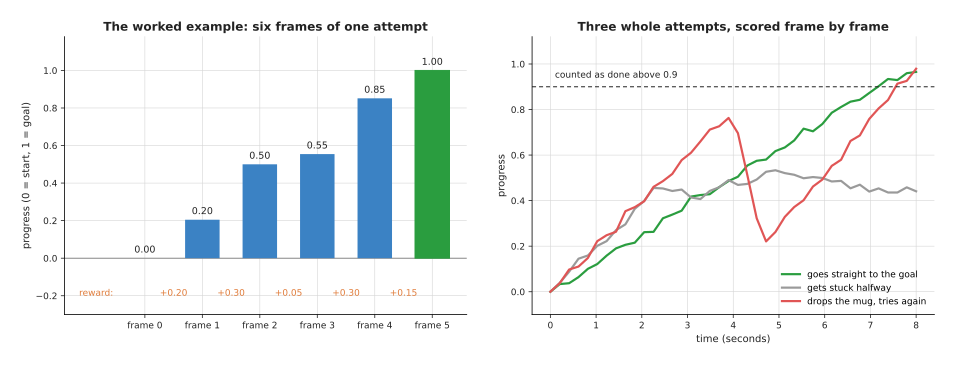
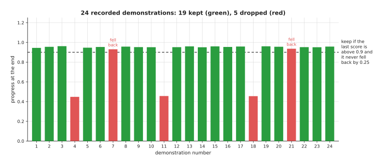
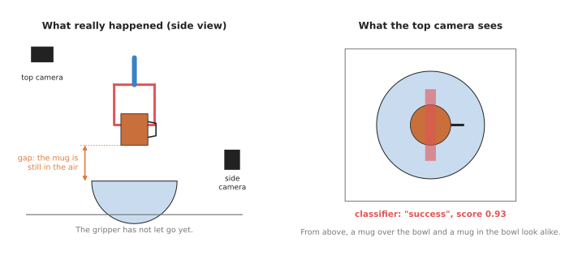

# Reward and progress models

The reinforcement learning page assumed that somebody can write a rule for the
score. The two pages before it assumed that somebody can tell a good recording
from a bad one. So this page answers the question both of those left open: how
can a robot tell, by itself, whether an attempt at a task went well? The models
that do this job look at the camera pictures of an attempt and give back a
judgement. Some say "success" or "failure", some say how far along the task is,
and some are large models that answer a question in words. This page calls all
of them **judge models**, whatever form their answer takes.

The page is for a reader who has read
[reinforcement learning policies](01_reinforcement-learning-policies.md). That page
needs a **reward**, which is a number that says how well an attempt went, and it
assumes someone can write a rule for that number. This page is about what to do when
nobody can write the rule, because the only way to tell is to look. Every new
word is
explained where it first appears.

## Contents

1. [What it is](#1-what-it-is)
2. [What goes in and what comes out](#2-what-goes-in-and-what-comes-out)
3. [The four kinds of judge](#3-the-four-kinds-of-judge)
4. [A worked example: scoring progress from pictures](#4-a-worked-example-scoring-progress-from-pictures)
5. [A second worked example: where to put the cut-off](#5-a-second-worked-example-where-to-put-the-cut-off)
6. [Where it is used on a robot arm](#6-where-it-is-used-on-a-robot-arm)
7. [Well-known models and libraries](#7-well-known-models-and-libraries)
8. [What goes wrong, and what people do about it](#8-what-goes-wrong-and-what-people-do-about-it)
9. [Why this kind, and what it costs](#9-why-this-kind-and-what-it-costs)
10. [The written alternative](#10-the-written-alternative)
11. [Where to read next](#11-where-to-read-next)
12. [Using it in Python](#12-using-it-in-python)

---

## 1. What it is

The introduction called these models judges, so here is the idea in one
sentence. A judge model is a network that looks at what the camera saw during an
attempt, and gives back a number that says how well the attempt is going.

For example, think of a cooking teacher and a student, where the student cooks
and the teacher does not cook at all. The teacher only tastes, and says "good",
"not yet" or "nearly there", and the student gets better from those words. So a
judge model matches the teacher, while the movement model, which this chapter
calls the **policy**, matches the student.

But why would you need a network for this at all? For some tasks a short rule is
enough, because in a simulator the program knows exactly where every object is.
There, "the peg is in the hole" is one line of code. On a real arm, nobody tells
the program where the peg is, and there is only a camera picture. Questions like
"is the towel folded neatly?" or "is the mug in the bowl?" have no simple rule
on a picture. So people train a network to answer the question instead.

---

## 2. What goes in and what comes out

Section 1 said that a judge looks at pictures, and this section says exactly
which ones. A judge model takes in pictures from the robot's cameras. It can
take one picture, such as the last one of an attempt, or it can take the whole
video of the attempt. Some judges also take a **goal**, which is a picture of
the finished task, or a sentence such as "put the mug in the bowl".

It gives back a number, and what that number means depends on the kind of judge.
The table below shows the three common kinds of answer. Read each row as one
kind of answer and an example of it.

| What comes out | What it means | An example |
| --- | --- | --- |
| a success score from 0 to 1 | how sure the judge is that the task is done | 0.93: "almost certainly done" |
| a progress score for each frame | how far along the task is, from 0 (start) to 1 (done) | 0.50 halfway through a fold |
| an answer in words | a yes or no, or a short explanation | "No, the mug is still in the gripper." |

Notice that the judge does not move the arm. It is used beside the policy, to
score it, to stop it, or to train it.

---

## 3. The four kinds of judge

Section 2 listed three kinds of answer, and those answers come from four kinds
of judge model that people use on arms. They differ in what they are trained on,
and in how much work they need before they can be used.

**A success classifier.** A **classifier** is a model that puts an input into one of
a few groups, and here the groups are "success" and "failure". You train it on
pictures of your own task, each marked by a person as success or failure. Then it
gives a score from 0 to 1 for any new picture. It is small and fast, but it only
knows your one task. HIL-SERL, the real-arm learning system in the
[reinforcement learning page](01_reinforcement-learning-policies.md#5-well-known-models-and-methods),
uses one of these as its reward.

**A progress estimator.** This gives a score for every frame of the video, and not
just for the last one. The score then rises as the task gets closer to done. The
best-known ones are trained on large amounts of video of people doing everyday
tasks.
They turn each picture into a short list of numbers, called an **embedding**, and an
embedding is made so that similar pictures get similar lists. The progress is then
read from how close the current embedding is to the embedding of the goal picture,
and section 4 works through this with real numbers.

**A vision-language model used as the judge.** A
[vision-language model](../../07_language-models/02_most-used/02_vision-language-models.md)
is a large model that takes pictures and a question in words, and answers in words.
So you ask it "Is the red mug in the bowl?" and it answers, and you can also ask it
to rate progress. It needs no training on your task, but it is slow, and it can be
wrong in ways that are hard to predict.

**A reward learned from demonstrations.** This is called **inverse reinforcement
learning**. Normal reinforcement learning starts from a reward and learns a
movement,
while inverse reinforcement learning goes the other way. It starts from
recorded movements by a person, and learns a reward that would explain why the
person
moved that way. The idea is that the reward carries over to new situations better
than the copied movement does. But it is rarely used on real arms today, and the
[learned methods document](../../../03_frameworks/04_one-arm-training/03_learned-methods.md#13-learning-the-goal-instead-of-the-motion)
explains why.

---

## 4. A worked example: scoring progress from pictures

The second kind of judge was the progress estimator, and this example shows how
one turns pictures into a score. The numbers are small and made up, so that you
can follow them by hand. The arithmetic was run in Python, so the results below
are copied from that run.

A real estimator turns each picture into an embedding of hundreds of numbers,
but here each picture becomes only three numbers. The task is to put a mug in a
bowl, the camera sees six frames, and the last one is the goal.

1. **Turn the goal picture into numbers.** The goal embedding is (0.9, 0.1, 0.8).
2. **Turn each frame into numbers.** Frame 0, at the start, is (0.1, 0.7, 0.2).
   Frame 1 is (0.3, 0.6, 0.3), and so on until frame 5, which equals the goal.
3. **Measure how far each frame is from the goal.** The distance is the ordinary
   straight-line distance between two points. For frame 0 the differences are -0.8,
   0.6 and -0.6, so you square them, add them and take the square root, which is the
   square root of 1.36, or 1.166. The six distances are 1.166, 0.927, 0.583, 0.520,
   0.173 and 0.
4. **Turn distance into progress.** Progress is 1 minus the current distance divided
   by the starting distance, so frame 0 gives 1 − 1.166 / 1.166 = 0, and frame 1
   gives 1 − 0.927 / 1.166 = 0.205. The six progress scores are 0, 0.205, 0.500,
   0.554, 0.851 and 1.000.
5. **Turn progress into a reward.** The reward for each step is the progress after
   the step minus the progress before it. The five rewards are 0.205, 0.295, 0.054,
   0.297 and 0.149, and they add up to exactly 1, which is the whole distance from
   start to goal.

Step 5 is how VIP, one of the best-known progress estimators, is used as a
reward for reinforcement learning. A step that moves towards the goal earns a
positive reward, while a step that moves away earns a negative one. So the small
reward from frame 2 to frame 3 means that step did very little.



The left picture shows the six scores from the example, with the step rewards in
orange underneath. The right picture shows why a score for every frame is
useful, and it shows three made-up attempts. The green one rises steadily and
crosses the line where the task counts as done, while the grey one gets stuck
halfway. The red one gets close, then falls sharply when the mug slips, and then
climbs again. So a judge that only looked at the last frame would call the red
attempt a success, and it would never notice that the attempt went wrong on the
way.

---

## 5. A second worked example: where to put the cut-off

Section 4 scored progress, and this example scores success, which brings a
choice with it. A success classifier gives a score rather than a yes or no. So
you have to choose a **cut-off**, which is the score above which you count the
attempt as a success. This choice matters more than it seems at first.

This example uses made-up scores for 100 attempts that really succeeded and 100
that really failed, and they were drawn at random in Python with a fixed seed.
The counts below come from that run, and there are two kinds of mistake:

- A **false success** is a failed attempt that the judge calls a success.
- A **missed success** is a real success that the judge calls a failure.

The table shows what three cut-offs give. Read each row as one choice of
cut-off, and the two numbers as the mistakes it makes out of 100 of each kind.

| Cut-off | False successes (of 100 failures) | Missed successes (of 100 successes) |
| --- | --- | --- |
| 0.5 | 10 | 7 |
| 0.7 | 2 | 21 |
| 0.9 | 0 | 69 |


The picture shows the same scores as two piles. Red is the failures, which
mostly score low, and green is the successes, which mostly score high. But the
piles overlap in the middle, so wherever you put the line, some attempts land on
the wrong side.

Which of the two mistakes is worse depends on the job. For reinforcement
learning a false success
is worse, because the policy is rewarded for failing, and it will learn to fail in
exactly that way. For deciding when a task is done a false success is also worse,
because the robot moves on and hides the mistake, whereas a missed success mostly
costs time. So people usually pick a cut-off towards the high end. But a very
high cut-off, such as
0.9 here, throws away most real successes, and then the policy is rarely rewarded at
all.

---

## 6. Where it is used on a robot arm

The two examples above scored single attempts, and this section shows the four
places where that scoring is used.

**Reinforcement learning on a real arm.** In a simulator the reward is a line of
code, but on a real arm there is no such line. So a success classifier or a progress
estimator provides the reward instead, and this is how HIL-SERL learns on real
hardware.
The person collects pictures of success and failure before practice starts, and a
classifier is trained on them. Then the policy practises, and the classifier scores
each attempt. π\*0.6, described in the
[foundation models document](../../../03_frameworks/08_frontier/02_foundation-models.md),
goes one step further. It trains a network that scores how good each moment is, and
it uses the change in that score to tell which actions helped.

**Deciding when a task is done.** A robot has to know when to stop and start the next
step, so a judge answers "Is the mug in the bowl yet?". The
[vision-language models page](../../07_language-models/02_most-used/02_vision-language-models.md)
calls this success detection and shows a worked example of it.

**Filtering bad demonstrations.** Recorded demonstrations are the training data for
[behaviour cloning](../02_most-used/01_behaviour-cloning.md), but some recordings are
poor, because the person fumbled, or gave up, or the task was not finished. So a
progress estimator can score every recording, and the poor ones can be dropped
before
training.



The picture shows 24 made-up demonstrations, scored by the progress method of
section 4. The script that draws it applies two rules, which are that the last
score must be above 0.9, and that the score must never fall back by more than
0.25 on the way. Three recordings stopped halfway and fail the first rule, while
two finished but dropped the mug on the way and fail the second rule, so that
leaves 19 of 24. The second rule matters, because those two recordings end well,
and a check of only the last frame would have kept them.

**Evaluating policies.** To compare two policies, you run each many times and count
successes, but a person watching every run is slow and expensive, so a judge can
count instead. AutoEval, described in the
[evaluation section of the frontier documents](../../../03_frameworks/08_frontier/04_simulation-and-evaluation.md#9-what-is-being-done-about-evaluation),
does this with automatic success detection on real arms, so that tests can run day
and night.

---

## 7. Well-known models and libraries

Section 6 described the four jobs, and the models below are the real tools that
do them, grouped by the kind of judge from section 3.

Success classifiers:

- **HIL-SERL** (University of California, Berkeley, 2024). This is a system for
  learning on a real arm, and its reward is a small image classifier trained on the
  person's own success and failure pictures. It ships inside
  [LeRobot](https://github.com/huggingface/lerobot), Hugging Face's robot learning
  library, and LeRobot's HIL-SERL guide covers training the classifier.
- **SuccessVQA** (Du and colleagues, 2023). It turns "did the task succeed?" into a
  question a vision-language model answers about a video, and then fine-tunes the
  model on marked examples. The
  [collision and failure detection page](../../09_touch-and-body-models/02_most-used/02_collision-and-failure-detection.md#5-well-known-methods-and-models)
  also lists it.

Progress estimators:

- **VIP**, Value-Implicit Pre-training (Ma and colleagues, University of Pennsylvania
  and Meta, 2022). It learns embeddings from videos of people doing everyday tasks,
  so that distance to the goal embedding works as a progress score, and section 4
  used its method.
- **LIV**, Language-Image Value learning (Ma and colleagues, 2023). It extends the
  VIP idea, so that the goal can be a sentence as well as a picture.
- **Robometer** (2026). This is a pretrained reward model that scores progress and
  success from a video and a written instruction, and it became downloadable in
  LeRobot 0.6.0. The
  [frontier document](../../../03_frameworks/08_frontier/04_simulation-and-evaluation.md#9-what-is-being-done-about-evaluation)
  notes that nobody has yet shown how often it agrees with a careful person on a task
  it was not trained for.

Vision-language models as judges:

- **VLM-RMs** (Rocamonde and colleagues, 2023). They showed that CLIP, a model that
  scores how well a picture matches a sentence, can serve as a reward with no extra
  training, for simple tasks in simulation.
- **RoboCLIP** (Sontakke and colleagues, 2023). It scores a whole attempt by how
  closely its video matches one demonstration video or one sentence.
- **Generative Value Learning, or GVL** (Google DeepMind, 2024). It asks a large
  vision-language model to guess the progress of every frame of a video. It shuffles
  the frames first, so that the model cannot just guess that later frames are further
  along.
- **Eureka** (NVIDIA, 2023) is a relative of these, because it does not judge
  pictures at all. Instead a large language model writes the reward as code for a
  simulator, and then improves the code from the training results.

Rewards learned from demonstrations:

- **Maximum entropy inverse reinforcement learning** (Ziebart and colleagues, 2008)
  is the classic method.
- **GAIL**, generative adversarial imitation learning (Ho and Ermon, 2016), trains a
  judge that tells the person's movements from the policy's, and uses it as the
  reward.
- The [imitation](https://github.com/HumanCompatibleAI/imitation) library holds
  open versions of these. The
  [learned methods document](../../../03_frameworks/04_one-arm-training/03_learned-methods.md#13-learning-the-goal-instead-of-the-motion)
  notes that it has had no new work since January 2025.

---

## 8. What goes wrong, and what people do about it

Section 7 listed the tools, and this section lists what they get wrong. Each
problem is followed by what people do about it.

**The policy learns to fool the judge.** This is **reward hacking**, which the
[reinforcement learning page](01_reinforcement-learning-policies.md#7-what-goes-wrong-and-what-people-do-about-it)
describes for written rules. But a learned judge makes it more likely rather than
less. A written rule is wrong in a way you can read, whereas a learned judge is
wrong
in ways you cannot see until the policy finds them. For example, a policy trained
against a success classifier may learn to hold the mug in front of the camera in a
place that looks like the bowl. The sign is a policy whose judged success keeps
rising
while a person watching sees it fail. So people fix this by adding the fooling
pictures to the classifier's training set as failures, and then training it again.
They also keep a person checking a sample of the runs.

**False success from one camera.** The judge sees only what the camera sees, so from
above, a mug held just over the bowl can look the same as a mug in the bowl.



The left picture shows what really happened, because the gripper has not let go,
and there is a gap under the mug. The right picture shows the only thing the top
camera can see. The classifier's answer, "success" with a score of 0.93, is an
example and not a measurement. So people fix this by judging from two cameras,
by asking the opposite question as well ("is the gripper still holding
something?"), and by checking with a sensor such as how far the gripper has
closed.

**The judge does not carry over to a new place.** A classifier trained in one room,
with one table and one light, can fail in another room. The sign is a success rate
that changes when nothing about the policy changed, so people collect a few judge
examples in every new place.

**Progress that is not smooth.** A progress estimator trained on videos of people may
score a robot's frames unevenly. For example, it may jump when the arm enters the
picture, or drop when the arm hides the object. The policy then learns from
those jumps, so
people smooth the scores over time, or fine-tune the estimator on a few robot
videos.

**A slow judge.** A large vision-language model takes from a fraction of a second to
a few seconds per answer. That is fine at the end of an attempt, but it is far too
slow to give a reward many times a second during learning.

---

## 9. Why this kind, and what it costs

Section 8 listed the faults, so this section asks when a judge is worth them. A
judge model is a model that tells you whether the task is done, or how far along
it is. So what it does for you is replace a check that a person would otherwise
make by eye, on every single attempt.

The obvious alternative is a written rule on a measurement. You can weigh the
bowl on a scale, or mark the mug with a tag that the camera finds exactly, or
check how far the gripper closed. These rules are fast, cheap and easy to check,
so when such a rule exists, use it. A judge model is worth it only when no
measurement answers the question, as with "Is the towel folded neatly?", "Is the
cable seated?", or any task where the only evidence is how the scene looks.

The second alternative is a person, and a person watching is the most reliable
judge of all. But a person cannot score thousands of practice attempts, or watch
a test that runs all night. So a judge model is worth it when the number of
attempts is too large for people.

What it costs you most of all is trust. You now have two models that can be
wrong, which are the policy and the judge. So when the judged success rate is
high, you do not know which one to believe until a person checks. It also costs
the work of collecting marked examples, at least for a success classifier. And a
policy trained against a judge learns whatever the judge rewards, which is not
always what you meant.

The table below sums up the usual choice for each case. Read each row as a
situation, and the right column as what people usually use.

| Situation | Usual choice |
| --- | --- |
| A sensor or a simple measurement answers "is it done?" | a written rule, not a model |
| One task, on one real arm, for reinforcement learning | a success classifier trained on your own pictures |
| Many long recordings to sort, or a reward at every step | a progress estimator |
| Many different tasks, answer needed only at the end | a vision-language model as the judge, backed by a second check |
| You want the reward to carry over to new situations | inverse reinforcement learning, knowing it is fragile |

---

## 10. The written alternative

The first row of the table above was a written rule, and this section says how to
build one. Book 5 covers the three parts of that job. [Sensor
streams](../../../06_programming-techniques/04_fitting-and-estimation/02_most-used/04_sensor-streams.md#thresholds-that-do-not-flicker-hysteresis-and-debouncing)
turns a reading, such as how far the gripper closed or the weight on a scale, into a
clean yes-or-no flag. [Thresholding and colour
masks](../../../06_programming-techniques/05_image-and-point-cloud-processing/02_most-used/01_thresholding-and-colour-masks.md)
checks a picture for a known colour in a known place. And [pose from
points](../../../06_programming-techniques/02_geometry-and-cameras/02_most-used/04_pose-from-points.md)
measures where an object with a printed marker is.

So the written rule is better whenever a measurement like these answers "is it
done?", because it is fast and easy to check. A judge model is better only when
the answer can only be seen, such as whether a towel is folded neatly.

---

## 11. Where to read next

This page supplied the score that the earlier methods needed, and the next page
supplies the data they needed, so the reading below follows that thread.

In this chapter:

- [Reinforcement learning policies](01_reinforcement-learning-policies.md) is the
  learner that most often uses a judge model as its reward.
- [Learning from human video](04_learning-from-human-video.md) is the next page, and
  the progress estimators on this page are trained on the same kind of video.
- [The movement models overview](../01_overview.md) compares every kind in this
  chapter.

In other chapters of this book:

- [Vision-language models](../../07_language-models/02_most-used/02_vision-language-models.md)
  explains the large models used as judges, with a worked example of success
  detection.
- [Collision and failure detection](../../09_touch-and-body-models/02_most-used/02_collision-and-failure-detection.md)
  covers judges that use force and joint signals instead of pictures.

Deeper documents elsewhere in this repository:

- [What is being done about evaluation](../../../03_frameworks/08_frontier/04_simulation-and-evaluation.md#9-what-is-being-done-about-evaluation)
  covers AutoEval, `lerobot-eval` and the Robometer reward model.
- [LeRobot's 2026 releases](../../../03_frameworks/08_frontier/06_what-is-coming.md#23-lerobot-which-now-releases-on-a-predictable-rhythm)
  explains why reward models arriving as downloads matters.
- [Interactive imitation](../../../03_frameworks/04_one-arm-training/03_learned-methods.md#12-interactive-imitation-correcting-it-as-it-goes)
  gives the evidence for HIL-SERL.

---

## 12. Using it in Python

Section 3 named four kinds of judge, and section 7 said that the first of them, a
success classifier, ships inside LeRobot as part of HIL-SERL. This section trains one,
because it is the kind of reward model you are most likely to need and the only one in
this chapter that you can sensibly train in an afternoon. After reading it you will
know what the library does and what the afternoon is actually spent on.

The reward model is a small network that looks at the camera pictures and says whether
the task has succeeded. LeRobot builds it on top of a pretrained picture encoder, which
you name in the configuration, so you are not training a vision model from nothing.

```python
import torch
from lerobot.datasets import LeRobotDataset
from lerobot.rewards import (RewardClassifierConfig, make_reward_model,
                             make_reward_pre_post_processors)

dataset = LeRobotDataset("lerobot/example_hil_serl_dataset")

config = RewardClassifierConfig(
    num_cameras=len(dataset.meta.camera_keys),
    model_name="microsoft/resnet-18",   # the pretrained encoder it starts from
    device="cpu",
)
reward_model = make_reward_model(config, dataset_stats=dataset.meta.stats)
preprocessor, _ = make_reward_pre_post_processors(config,
                                                 dataset_stats=dataset.meta.stats)
optimizer = config.get_optimizer_preset().build(reward_model.parameters())

for batch in torch.utils.data.DataLoader(dataset, batch_size=16, shuffle=True):
    loss, output = reward_model.forward(preprocessor(batch))
    optimizer.zero_grad()
    loss.backward()
    optimizer.step()
    print(loss.item(), output["accuracy"])
```

LeRobot gives you four useful things here. It gives you the network, which is a small
classifier on top of a picture encoder downloaded from the Hugging Face hub, so
`model_name="microsoft/resnet-18"` means the encoder has already learned what edges and
textures look like. It gives you the rescaling of the pictures through the
preprocessor. It gives you a set of optimiser settings that are known to work, through
`config.get_optimizer_preset()`, which saves you from guessing a learning rate. And it
reports the accuracy alongside the loss, which is the number you actually watch, because
a loss going down tells you less than the fraction of frames it gets right.

What you have to collect is the labelled successes and failures, and this is where the
afternoon goes. `lerobot/example_hil_serl_dataset` above is a real dataset that lets
you check the code runs, but the judge you need is a judge of your task, and nobody
else has recorded it. So you record attempts on your own arm, both the ones that worked
and the ones that did not, and you mark them. The failures are the part people forget.
A classifier trained only on successes learns nothing, because it has nothing to
contrast them with, and a classifier trained on failures that all fail in the same way
learns only that one way. So you have to make the arm fail in several different ways on
purpose, which is slower and less pleasant than recording successes.

What you have to decide is the cut-off, and section 5 was a whole worked example about
it. The classifier gives a number between 0 and 1, and you choose the point above which
you call the attempt a success. Putting it high means you rarely claim a success that
was not one, and you miss real ones. Putting it low means the opposite. Which mistake
costs you more depends on what the number is for, and section 6 lists the four uses.

The progress estimators and the vision-language judges from section 7 are a different
matter. VIP and LIV are research repositories rather than packages, and Robometer is
downloadable through LeRobot but, as section 7 says, nobody has yet shown how often it
agrees with a careful person on a task it was not trained for. So a small classifier
you trained on your own pictures is, today, the reward model you can actually trust
most, precisely because you know what is in its training data.
