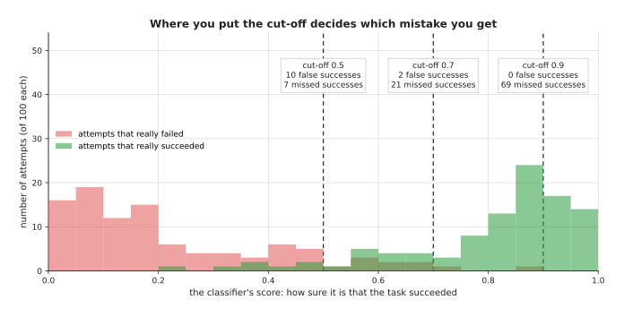

# Reward and progress models

The reinforcement learning page assumed that somebody can write a rule for the
score. The two pages before it assumed that somebody can tell a good recording
from a bad one. So this page answers the question both of those left open: how
can a robot tell, by itself, whether an attempt at a task went well? The models
that do this job look at the camera pictures of an attempt and give back a
judgement. Some say "success" or "failure", some say how far along the task is,
and some are large models that answer a question in words. This page calls all
of them **judge models**, whatever form their answer takes.

The page is for a reader who has read
[reinforcement learning policies](01_reinforcement-learning-policies.md). That page
needs a **reward**, which is a number that says how well an attempt went, and it
assumes someone can write a rule for that number. This page is about what to do when
nobody can write the rule, because the only way to tell is to look. Every new
word is
explained where it first appears.

## Contents

1. [What it is](#1-what-it-is)
2. [What goes in and what comes out](#2-what-goes-in-and-what-comes-out)
3. [The four kinds of judge](#3-the-four-kinds-of-judge)
4. [A second worked example: where to put the cut-off](#4-a-second-worked-example-where-to-put-the-cut-off)
5. [Well-known models and libraries](#5-well-known-models-and-libraries)
6. [Where to read next](#6-where-to-read-next)

---

## 1. What it is

The introduction called these models judges, so here is the idea in one
sentence. A judge model is a network that looks at what the camera saw during an
attempt, and gives back a number that says how well the attempt is going.

For example, think of a cooking teacher and a student, where the student cooks
and the teacher does not cook at all. The teacher only tastes, and says "good",
"not yet" or "nearly there", and the student gets better from those words. So a
judge model matches the teacher, while the movement model, which this chapter
calls the **policy**, matches the student.

But why would you need a network for this at all? For some tasks a short rule is
enough, because in a simulator the program knows exactly where every object is.
There, "the peg is in the hole" is one line of code. On a real arm, nobody tells
the program where the peg is, and there is only a camera picture. Questions like
"is the towel folded neatly?" or "is the mug in the bowl?" have no simple rule
on a picture. So people train a network to answer the question instead.

---

## 2. What goes in and what comes out

Section 1 said that a judge looks at pictures, and this section says exactly
which ones. A judge model takes in pictures from the robot's cameras. It can
take one picture, such as the last one of an attempt, or it can take the whole
video of the attempt. Some judges also take a **goal**, which is a picture of
the finished task, or a sentence such as "put the mug in the bowl".

It gives back a number, and what that number means depends on the kind of judge.
The table below shows the three common kinds of answer. Read each row as one
kind of answer and an example of it.

| What comes out | What it means | An example |
| --- | --- | --- |
| a success score from 0 to 1 | how sure the judge is that the task is done | 0.93: "almost certainly done" |
| a progress score for each frame | how far along the task is, from 0 (start) to 1 (done) | 0.50 halfway through a fold |
| an answer in words | a yes or no, or a short explanation | "No, the mug is still in the gripper." |

Notice that the judge does not move the arm. It is used beside the policy, to
score it, to stop it, or to train it.

---

## 3. The four kinds of judge

Section 2 listed three kinds of answer, and those answers come from four kinds
of judge model that people use on arms. They differ in what they are trained on,
and in how much work they need before they can be used.

**A success classifier.** A **classifier** is a model that puts an input into one of
a few groups, and here the groups are "success" and "failure". You train it on
pictures of your own task, each marked by a person as success or failure. Then it
gives a score from 0 to 1 for any new picture. It is small and fast, but it only
knows your one task. HIL-SERL, the real-arm learning system in the
[reinforcement learning page](01_reinforcement-learning-policies.md#5-well-known-models-and-methods),
uses one of these as its reward, and its classifier is the judge that sub-section
5.1 recommends.

**A progress estimator.** This gives a score for every frame of the video, and not
just for the last one. The score then rises as the task gets closer to done. The
best-known ones are trained on large amounts of video of people doing everyday
tasks.
They turn each picture into a short list of numbers, called an **embedding**, and an
embedding is made so that similar pictures get similar lists. The progress is then
read from how close the current embedding is to the embedding of the goal picture,
and section 4 works through this with real numbers. VIP, in sub-section 5.5, is
where that method comes from, and Robometer in sub-section 5.2 is the one you can
download and use today. SARM in sub-section 5.4 is the same idea with the task
split into named stages, so that the score says which stage the arm is in as well
as how far through it is.

**A vision-language model used as the judge.** A
[vision-language model](../../07_language-models/02_most-used/02_vision-language-models.md)
is a large model that takes pictures and a question in words, and answers in words.
So you ask it "Is the red mug in the bowl?" and it answers, and you can also ask it
to rate progress. It needs no training on your task, but it is slow, and it can be
wrong in ways that are hard to predict. TOPReward, in sub-section 5.3, is the
packaged version of this kind, and it reads the reward out of how likely the
model thought one word was rather than out of the sentence it wrote.

**A reward learned from demonstrations.** This is called **inverse reinforcement
learning**. Normal reinforcement learning starts from a reward and learns a
movement,
while inverse reinforcement learning goes the other way. It starts from
recorded movements by a person, and learns a reward that would explain why the
person
moved that way. The idea is that the reward carries over to new situations better
than the copied movement does. But it is rarely used on real arms today, and the
[learned methods document](../../../03_frameworks/04_one-arm-training/03_learned-methods.md#13-learning-the-goal-instead-of-the-motion)
explains why. GAIL, in sub-section 5.6, is the version of it you can run.

---

## 4. A second worked example: where to put the cut-off

Section 4 scored progress, and this example scores success, which brings a
choice with it. A success classifier gives a score rather than a yes or no. So
you have to choose a **cut-off**, which is the score above which you count the
attempt as a success. This choice matters more than it seems at first.

This example uses made-up scores for 100 attempts that really succeeded and 100
that really failed, and they were drawn at random in Python with a fixed seed.
The counts below come from that run, and there are two kinds of mistake:

- A **false success** is a failed attempt that the judge calls a success.
- A **missed success** is a real success that the judge calls a failure.

The table shows what three cut-offs give. Read each row as one choice of
cut-off, and the two numbers as the mistakes it makes out of 100 of each kind.

| Cut-off | False successes (of 100 failures) | Missed successes (of 100 successes) |
| --- | --- | --- |
| 0.5 | 10 | 7 |
| 0.7 | 2 | 21 |
| 0.9 | 0 | 69 |



The picture shows the same scores as two piles. Red is the failures, which
mostly score low, and green is the successes, which mostly score high. But the
piles overlap in the middle, so wherever you put the line, some attempts land on
the wrong side.

Which of the two mistakes is worse depends on the job. For reinforcement
learning a false success
is worse, because the policy is rewarded for failing, and it will learn to fail in
exactly that way. For deciding when a task is done a false success is also worse,
because the robot moves on and hides the mistake, whereas a missed success mostly
costs time. So people usually pick a cut-off towards the high end. But a very
high cut-off, such as
0.9 here, throws away most real successes, and then the policy is rarely rewarded at
all.

---

## 5. Well-known models and libraries

Section 6 described the four jobs a judge does, and this section names the judges
themselves. Most of the published work in this area is research code, so each
model below says plainly whether you can run it today, and the first one is the
one most people should start with.

Read the table one row at a time. The left column names the judge and says how
current it is. The right column says whether you can run it today and what that
would cost you: what the judge is best at, what you have to download or train,
its licence, and when to pick it. What you download or train is given in place of
a parameter count, because it matters more here. Where a row says `not stated`,
the project does not publish that figure, and every licence was read from the
project's own licence file or model card.

| Judge | What decides it |
| --- | --- |
| **The HIL-SERL reward classifier**, most used in 2026 | You can run it, but you train it yourself rather than download it, starting from a ResNet-10 encoder. It ships in LeRobot and is Apache-2.0 as part of it. It is best at one task, on your own arm, with a fast answer. Pick it when you are training with reinforcement learning on a real arm. |
| **Robometer**, worth betting on | You can run it today, because it is an 8.9 GB checkpoint on a 4-billion-parameter backbone, and it comes through LeRobot and is Apache-2.0 on its model card. It is best at progress and success on a task it has never seen. Pick it when you want a score without collecting or marking anything. |
| **TOPReward**, worth betting on | You can run it today, and there is no reward model to download at all, because it has no weights of its own and uses an 8-billion-parameter vision-language model instead. It ships in LeRobot and is Apache-2.0 as part of it. It is best at the same job as Robometer. Pick it when you already run a vision-language model and want a score from it. |
| **SARM**, worth betting on | You can run it, but you train it yourself, starting from CLIP ViT-B/32 features. It ships in LeRobot and is Apache-2.0 as part of it. It is best at long tasks made of several steps. Pick it when one attempt passes through stages you can name. |
| **VIP and LIV**, historical | These are research repositories rather than packages, so running them is work, and their size is `not stated`. VIP is Creative Commons Attribution-NonCommercial 4.0 and LIV, which came after it, is MIT. They are best at progress from videos of people, which is where the idea started. Pick them when you are reading the research rather than shipping. |
| **GAIL**, historical | You can run it, and you train it yourself, from the `imitation` library, which is MIT. It is best at a reward learned from recorded movements. Pick it when you are comparing inverse reinforcement learning for yourself. |

### 5.1 The HIL-SERL reward classifier, which you train on your own pictures

This is the judge **most used in 2026** for work on a real arm, because it is
small, it is fast enough to answer at every step, and you know exactly what is in
its training data.

Size xs, a small card, Apache-2.0 for the code as part of LeRobot, and the
weights are yours, because you train them.

HIL-SERL is the real-arm learning system from the University of California,
Berkeley, published in 2024, and its reward is a small image classifier rather
than a written rule. The classifier ships inside
[LeRobot](https://github.com/huggingface/lerobot), Hugging Face's robot learning
library. It is a classifier head on top of a pretrained picture encoder, and the
encoder the configuration names by default is a ResNet-10, which is a small
network already trained on ordinary photographs.

The one idea here is that the judge is a single yes-or-no question, learned from
your own examples and nothing else. It is shown one picture and it answers how
much that picture looks like a finished task. It does not know what the task is,
what came before the picture, or how a half-done attempt differs from a hopeless
one.

What that means inside is that almost all of the model was trained by somebody
else. The ResNet-10 already turns a picture into a list of numbers that tells one
kind of photograph from another, and your own training is mostly a matter of
drawing a line through that list, with your successes on one side and your
failures on the other. Nothing in the model represents time or order, so the
tenth frame of an attempt and the three hundredth are judged separately and could
easily come out the other way round. And the labelling is all yours: every
picture is marked success or failure by a person, by hand.

What the idea buys is speed and certainty about what the judge knows. A small
head on a small encoder answers fast enough to be asked at every control step,
which is what reinforcement learning on a real arm needs, and every picture it
learned from is a file you can open. What it costs is that a yes-or-no judge has
nothing to say about how close an unfinished attempt came. A learner therefore
gets nothing at all until it stumbles on a success, which is the problem the
progress models below exist to solve. The line it draws is also only as good as
the failures you showed it, so a new way of failing can land on the success side.

The difference shows up the moment the reward is needed inside a learning loop.
On a peg insertion that practises for an hour, this classifier answers at every
step and never holds the loop up, where Robometer in sub-section 5.2 takes a
sizeable fraction of a second for one answer and cannot be asked that often. The
difference runs the other way when you want to know how far an attempt got. Ask
this classifier about an attempt that lifted the towel and then dropped it, and
the only answer it has is "not done".

Why pick it rather than Robometer or a vision-language model, which need no
training at all? Because of speed first: a large model takes from a fraction of a
second to a few seconds for one answer, which is far too slow for a reward at
every control step, and this classifier keeps up. Because it judges your task, in
your room, under your light, rather than a general idea of success. And because
you can see every picture it learned from, so when it is wrong you know where to
look. The reason not to pick it is that it knows one task and nothing else.

What it costs you is the recordings. You collect pictures of your own attempts
and mark each one as a success or a failure, and the failures are the part people
forget. A classifier trained only on successes has nothing to contrast them with,
and one trained on failures that all fail the same way learns only that way, so
you have to make the arm fail in several different ways on purpose. The thing
that most often goes wrong afterwards is the cut-off, which section 5 was a whole
worked example about.

The library is LeRobot. Training runs from a configuration file, as
[its HIL-SERL guide](https://huggingface.co/docs/lerobot/hilserl) describes, and
the command is one line.

```bash
# the configuration names the dataset you recorded, the encoder to start from,
# your camera keys and the number of training steps
lerobot-train --config_path path/to/reward_classifier_train_config.json
```

Using the trained classifier is a few lines of Python.

```python
from lerobot.rewards import RewardClassifierConfig, make_reward_model

config = RewardClassifierConfig(
    pretrained_path="your-name/mug-in-bowl-reward",  # the classifier you trained
    num_cameras=2,
    device="cuda",
)
reward_model = make_reward_model(config)

# batch holds one or more camera images under keys that start with
# "observation.image"; the threshold is the cut-off from section 5
reward = reward_model.predict_reward(batch, threshold=0.7)
```

What LeRobot supplies is the encoder download, the rescaling of the pictures, a
set of optimiser settings that work, and the accuracy printed beside the loss
during training, which is the number you actually watch. What you supply is the
marked recordings, the camera keys, and the threshold. Note that
`compute_reward` uses a fixed cut-off of 0.5, so if you want a different one, as
section 5 argues you often should, call `predict_reward` with your own
`threshold`.

### 5.2 Robometer, a reward model you download rather than train

This one is **worth betting on**, because it is the first general-purpose reward
model that arrives as an ordinary download, and a general success detector is the
missing piece in every scheme that practises without a person watching.

Size l, a big card, Apache-2.0 for the code and the weights.

Robometer is a video-and-language reward model from the paper
[Robometer: Scaling General-Purpose Robotic Reward Models via Trajectory
Comparisons](https://arxiv.org/abs/2603.02115), and it became downloadable in
LeRobot version 0.6.0 on 6 July 2026. You give it frames from an attempt and the
written instruction for the task, and it predicts how far along each frame is and
how likely that frame is to be a success. It is a Qwen3-VL-4B-Instruct
vision-language model with three small heads added, which
[its LeRobot page](https://huggingface.co/docs/lerobot/robometer) describes.

The one idea is in the paper's title, and it is about the training signal rather
than the network. Asking people to mark an attempt as a success means asking them
where the line is, and they disagree. Asking which of two attempts got further is
a much easier question, and the same question works on any task, so answers to it
can be gathered across many datasets at once. Robometer's third head exists to
learn from exactly that.

Inside, the three heads sit on the same backbone and are trained together, with
their three errors added into one. A progress head predicts how far along each
frame is, a success head predicts whether each frame is a success, and a
preference head predicts which of two attempts completed the task better. The
frames are not handed in as a block: a special token is inserted after each
frame, and the numbers the model is holding at those token positions are what the
progress and success heads read, which is how one answer per frame comes out
rather than one answer per attempt. Progress is also not predicted as a number at
all. The head gives a score to each of ten evenly spaced values between 0 and 1,
and LeRobot turns those scores into one value by taking their weighted average.
Compare that with sub-section 5.1: the classifier takes one picture and gives one
number, while this takes a run of frames and a sentence and gives a pair of
numbers for every frame. The preference head is kept in the checkpoint so it
loads, and LeRobot never calls it.

What the design buys is that the labelling has already been done, by somebody
else, on tasks that are not yours, and that the written instruction is what lets
the result be pointed at a task nobody labelled. What the design costs is that
frames are expensive, because each one adds both a picture and a token to what the
backbone has to hold, and the default reads at most eight frames of an attempt.
Eight frames of a one-minute attempt can step straight over the moment things went
wrong.

The difference shows up when you have five hundred recorded attempts and no
labels. Give Robometer the instruction and it ranks all five hundred overnight,
where the classifier of sub-section 5.1 cannot start until you have marked
pictures from each of those tasks by hand. The difference runs the other way
inside a control loop, where eight frames and a large backbone are simply the
wrong tool, and in the worry below, because a judge that was never checked
against a careful person on your task is still a guess.

Why pick it rather than the classifier in section 5.1? Because you collect and
mark nothing. It scores a task it was not trained on, which is exactly what the
classifier cannot do, so it suits sorting a pile of recordings or scoring an
evaluation that runs overnight. Why not pick it? Because nobody has yet published
how often it agrees with a careful person on a task it was not trained for, which
the repository's
[frontier document](../../../03_frameworks/08_frontier/04_simulation-and-evaluation.md#9-what-is-being-done-about-evaluation)
states, and because a model judging a model is a mistake with a long history.

What it costs you beyond the line above is that the LeRobot integration is
inference-only, so you cannot train the model further there, and the published
checkpoint is a single file,
[lerobot/Robometer-4B](https://huggingface.co/lerobot/Robometer-4B), that has to
come down before anything runs.

The library is LeRobot again.

```python
from lerobot.rewards.robometer import RobometerConfig, RobometerRewardModel

cfg = RobometerConfig(
    pretrained_path="lerobot/Robometer-4B",
    device="cuda",
    reward_output="progress",   # or "success" for a 0 or 1 answer
)
reward_model = RobometerRewardModel.from_pretrained(cfg.pretrained_path, config=cfg)
```

What LeRobot supplies is the download, the frame and text preparation for the
Qwen backbone, and one `compute_reward` call that returns the last frame's
progress clamped between 0 and 1. What you supply is the frames, as whole numbers
in an array shaped time by height by width by colour, and the task instruction as
a sentence. The instruction is not a formality: it is the only thing telling the
model what success means, so "put the red mug in the bowl" and "tidy the table"
will be scored differently.

### 5.3 TOPReward, which asks a vision-language model how likely success is

This one is also **worth betting on**, for a different reason: it needs no reward
model at all, so it improves whenever the vision-language model you already use
improves.

No weights of its own, and the Qwen3-VL-8B-Instruct model it reads by default is
size l and wants a big card. Apache-2.0 for the LeRobot code, and the licence on
the weights is whichever model you point it at.

TOPReward comes from the paper
[TOPReward: Token Probabilities as Hidden Zero-Shot Rewards for
Robotics](https://arxiv.org/abs/2602.19313) and ships in LeRobot. It builds a
prompt that shows the video, states that the robot completed the task, and ends
with "The answer is: True". Then it reads how likely the model thought that last
word was. That likelihood is the reward. Nothing is fine-tuned, which is what
**zero-shot** means: the model is used as it comes.

The one idea is that the judge already exists and nobody has to build it. A large
model that has read a great deal about the world already has an opinion about
whether a mug is in a bowl. You do not need a head trained to report that
opinion; you need a way of asking that gives you a number instead of a sentence.

What that changes inside is that there is nothing new inside. A language model
works out a probability for every word that could come next, and then picks one;
the sentence it writes is the part people read, and the probabilities are thrown
away. TOPReward writes the claim itself, ending the prompt with "The answer is:
True", and then reads the probability of that last word rather than letting the
model choose it. So the measurement is taken from machinery that was already
running. Compare that with sub-section 5.2, where three heads were added and
trained on robot video so that the numbers come from parts built for this one
job. Here, nothing in the system was ever trained to referee a robot.

What the design buys is that there is nothing to download, nothing to keep up to
date, and nothing to retrain: swap in a better vision-language model next year
and the judge gets better by itself. What it costs is three things. The answer
comes out as a log-probability, which is a convenient way to rank attempts
against each other and an awkward thing to put a fixed cut-off on, unlike the
0-to-1 score of the two judges above. The wording of the prompt is now part of
your system, so a different sentence gives a different reward, and nothing warns
you that it has changed. And the opinion you are reading was formed by a model
trained to describe pictures, not to referee robots.

The difference shows up when a vision-language model is already loaded on the
machine, because you are using it to turn instructions into tasks. Then this
reward is one more call to a model that is already resident, where Robometer
would be a second multi-gigabyte model competing for the same card. The
difference runs the other way when the two disagree on your task. Robometer's
heads were trained on robot video for this exact question while this one borrows
a general opinion, and only a measurement against your own eyes tells you which
to believe.

The idea has a history, and these are the papers people cite for it. VLM-RMs,
from [Vision-Language Models are Zero-Shot Reward Models for Reinforcement
Learning](https://arxiv.org/abs/2310.12921), showed in 2023 that CLIP, a model
that scores how well a picture matches a sentence, works as a reward with no
training for simple tasks in simulation. RoboCLIP scored a whole attempt against
one demonstration video. SuccessVQA fine-tuned a vision-language model on marked
examples of the question. Generative Value Learning asked a large model to rate
every frame, shuffling the frames first so that it could not simply assume later
frames are further along. TOPReward is the same family, and it is the packaged
one.

Why pick it rather than Robometer? Because there is no checkpoint to download and
nothing to keep up to date, and because you can swap the backing model for a
better one later. Why pick Robometer instead? Because its heads were trained on
robot videos for this exact job, where TOPReward borrows a general model's
opinion. Which of the two is more accurate on your task is something you have to
measure, and neither paper settles it for you.

What it costs you beyond the line above is that its default backbone is larger
than Robometer's, so this is not the cheap option even though nothing is trained,
and the LeRobot port supports the Qwen backbone only.

```python
from lerobot.rewards.topreward import TOPRewardConfig, TOPRewardModel

cfg = TOPRewardConfig(
    vlm_name="Qwen/Qwen3-VL-8B-Instruct",   # any model you can run locally
    device="cuda",
)
reward_model = TOPRewardModel(cfg)
```

What LeRobot supplies is the prompt building, the masking that isolates the last
word, and the reading of its probability, which is the whole trick and is fiddly
to write yourself. What you supply is a machine that can hold the model, the
frames, and the instruction. There is also a script that labels a whole dataset
offline and writes the scores to a file, which is the sensible way to use a slow
judge.

### 5.4 SARM, which judges a long task one stage at a time

This one is **worth betting on** for long tasks, because a single progress number
for a task with four steps in it is a weak signal, and this is the packaged model
that fixes that.

Size not stated, a small card, Apache-2.0 as part of LeRobot, and you train the
weights yourself on a CLIP ViT-B/32 encoder.

SARM, which stands for stage-aware reward modelling, comes from the paper
[SARM: Stage-Aware Reward Modeling for Long Horizon Robot
Manipulation](https://arxiv.org/abs/2509.25358), and it ships in LeRobot. It
predicts which stage of the task the arm is in and how far through that stage it
is, and combines the two into one progress score between 0 and 1. You name the
stages in words, such as grabbing the near side of a towel and making the first
fold.

The one idea is not a new network. It is a better answer to the question "how far
along is this frame?", which somebody has to answer before a progress model can
be trained at all. The obvious answer is the frame number: frame 50 of 200 is a
quarter of the way through. That answer is wrong whenever two recordings of the
same task take different lengths, which they always do, because then the same
moment of the same task is labelled a quarter in one recording and a third in
another, and the model is trained on the disagreement.

What that changes inside is that one network makes two predictions instead of
one. It predicts which of your named stages the frame belongs to, and how far
through that stage the frame is, and the two are combined into a single score
between 0 and 1. The labels come from the stage names rather than from frame
numbers: a vision-language model reads each recording and marks where each named
stage starts and ends, and progress is then measured inside each stage, so the
first fold being half done means the same thing in a slow recording and a quick
one. Compare what the judges above ask you to supply. Sub-section 5.1 needed one
mark per picture, success or failure. Sub-section 5.2 needed comparisons between
whole attempts, collected by somebody else. This needs a list of stage names from
you, and then one model call per recording to find where they are.

What the design buys is a score that still means something in the middle of a
long task, and one that survives demonstrations of uneven quality, which is what
its paper claims and tests on folding a shirt. The same score can then be turned
back on your training data, reweighting the recordings so that frames where the
arm was really making progress count for more. What it costs is that pass of
annotation, a model call for every recording, and the judgement of whether the
task has stages at all.

The difference shows up on a four-step task that stopped after three. SARM says
which stage the arm reached and how far into it, so you know it made both folds
and then dropped the corner. Robometer gives one middling number, and a middling
number cannot tell you whether the attempt drifted from the start or nearly
finished. The difference runs the other way on a single continuous reach, which
has no stages to name, and there the annotation pass buys nothing at all.

Why pick it rather than Robometer, which also gives progress? Because Robometer
scores the whole task, so a long attempt that finished three of four steps and
then stopped looks much the same as one that drifted. SARM knows the steps are
there, and because it normalises each stage by how long that stage usually takes,
the same point in two recordings of different lengths gets the same score. Why
not pick it? Because it has no published general checkpoint to download: you
train it on your own dataset, which is the cost section 5.1 described all over
again.

What it costs you is annotation. You name the stages, and a vision-language model
then marks where each stage starts and ends in each recording, which is a model
call for every episode. There is a `single_stage` mode that needs no annotation
at all and treats progress as a straight line from the start to the end of the
episode, and that mode is the honest starting point, because it tells you whether
stages are worth the work.

```bash
# mark the stages in each episode, using a vision-language model
python src/lerobot/data_processing/sarm_annotations/subtask_annotation.py \
  --repo-id your-name/towel-folding \
  --dense-only \
  --dense-subtasks "Lift the arms,First fold,Second fold,Third fold" \
  --video-key observation.images.base

# then train the judge on those stages
lerobot-train --dataset.repo_id=your-name/towel-folding \
  --policy.type=sarm --policy.annotation_mode=dense_only \
  --policy.image_key=observation.images.base --steps=5000
```

What LeRobot supplies is the annotation script, the stage arithmetic, the
training, and a way to use the score to weight imitation learning, so that frames
where the arm was making real progress count for more. What you supply is the
list of stages and the judgement of whether your task really has any. A task that
is one continuous motion does not.

### 5.5 VIP and LIV, where the progress estimator came from

These are **historical**. They are where the method in section 4 comes from, and
they are research repositories rather than packages.

Size not stated by either project, a laptop, Creative Commons
Attribution-NonCommercial 4.0 for VIP and MIT for LIV.

VIP, short for Value-Implicit Pre-training, came from the University of
Pennsylvania and Meta in 2022 and was published at the 2023 International
Conference on Learning Representations. It learns from videos of people doing
everyday tasks to turn a picture into an embedding, and the distance to the goal
embedding then works as a progress score, which is the arithmetic section 4
worked through. LIV, short for Language-Image Value learning, came from the same
group in 2023 and lets the goal be a sentence instead of a picture.

The one idea is that you can get a progress score without training anything that
produces a score. Instead you train a way of turning pictures into numbers such
that the distance between two pictures already means something, and then progress
is a subtraction you do yourself.

What that changes inside is the training objective, which comes from
reinforcement learning rather than from marking examples. VIP takes a video of a
person, treats its first frame as a start and its last as a goal, and trains the
embedding to obey the arithmetic a value function obeys, which is the rule that
the distance still to go shrinks by one step for every step taken. A second part
of the objective pulls frames that are next to each other in time together and
pushes distant frames apart, which is what keeps the embedding changing smoothly
as the video runs. Nothing in that needs an action, a success label or a stage
name: only the videos, and the paper's were Ego4D, a large collection of
first-person video of people. Compare sub-sections 5.1, 5.2 and 5.4, each of
which ends in a head that produces the score. There is no such head here at all,
and the last line of the example below gives you the embedding, not a reward.

What the design buys is a judge that asks you to label nothing whatsoever, and an
embedding you can use for other things, such as finding the frame in a dataset
that looks most like the one in front of you. What it costs is that the reward
now rests entirely on the goal picture you choose, and a distance is a blunt
instrument: a picture taken under a different light can sit far from the goal
even when the task is done. LIV's addition is to let the goal be a sentence
instead, which removes the need for a photograph of the finished task.

The difference shows up when you have one photograph of the finished task,
nothing marked, and no wish to load a model of several gigabytes. VIP turns that
one photograph into a score for every frame of every attempt, where the
classifier of sub-section 5.1 would need a few hundred marked pictures first and
would then return nothing but "not done" until the very end. The difference runs the other
way as soon as the task has to be told apart from a near miss, because a mug
beside the bowl and a mug in the bowl are two pictures that sit close together,
and a distance will not separate them.

What it costs you is the fitting together, because there is no reward model in
these repositories, only the encoder. You write the distance and the progress
arithmetic yourself, which is five lines, and you decide what the goal picture
is.

```python
import torch
from vip import load_vip

vip = load_vip()   # the model pretrained on Ego4D, a large set of videos of people
vip.eval()

# images are 224 by 224 and the model expects values from 0 to 255
with torch.no_grad():
    embedding = vip(preprocessed_image * 255.0)   # shape [1, 1024]
```

What the library supplies is that encoder, and its README also points at a
ready-made version inside TorchRL. What you supply is the preprocessing, which
the repository's `encoder_example.py` shows as a resize to 256, a centre crop to
224 and a scaling back to the range 0 to 255, and then the whole of the reward:
the goal embedding, the distance, and the step-to-step difference.

### 5.6 GAIL and the `imitation` library, for a reward learned from movements

This one is **historical** too, and it is the fourth kind of judge from section 3,
kept because the idea keeps coming back.

Size xs, because the judge you train is small, a laptop, and MIT for the
`imitation` library.

Generative adversarial imitation learning, written GAIL, is from 2016. It trains
a judge whose job is to tell the person's recorded movements apart from the
policy's, and the policy is rewarded for being hard to tell apart. Maximum
entropy inverse reinforcement learning, from 2008, is the older classic in the
same family, and open versions of both are in
[the `imitation` library](https://github.com/HumanCompatibleAI/imitation), which
is MIT.

The one idea is that nobody ever says what success is. The reward is "look more
like the person", and it is measured by a second network that is trying to catch
the robot out.

That gives the judge a shape nothing else on this page has, in two ways. First,
what it reads is not a picture of a finished task but a movement: the arm's state
and the command given at that moment, which is the same pairing a demonstration
already holds. So the labelling it asks of you is none at all about success, and
instead a set of recordings with their actions in them, which is a different kind
of data from the marked pictures of sub-section 5.1 or the stage names of
sub-section 5.4. Second, the judge does not stay still. It is retrained as the
policy improves, because a judge that has been beaten has to find a new
difference to point at. Every other judge on this page is a fixed function once
it has been trained, and this one is a moving one by design.

What the idea buys is a reward where nothing can be written down and no finish
line exists, and a dense one, since every step either looks like the person or
does not. What it costs is that two models are now learning against each other,
so a bad result does not tell you which of the two was at fault, and that there
is no number you can read off and trust, because the judge's score says only how
this policy compares with the policy of a few thousand training steps ago.

The difference shows up when the goal is the manner of the movement rather than
its end state. Pouring without splashing, or wiping with even pressure, look the
same in a photograph of the finished table, so the classifier of sub-section 5.1
has nothing to learn from, while a judge watching the movements can tell a smooth
pour from a jerky one. The difference runs the other way whenever you can
photograph success, which is most tasks, and then the classifier is a small
fraction of the work.

Why pick this rather than a classifier or a progress model? Only when the thing
you cannot write down is the goal itself rather than the finish line, and you
believe a learned reward carries over to new situations better than copied
movements do. Why not? Because the library's last change was in January 2025, as
the repository's
[learned methods document](../../../03_frameworks/04_one-arm-training/03_learned-methods.md#13-learning-the-goal-instead-of-the-motion)
notes, and because two models now train against each other, so when the result is
bad it is hard to say which one was at fault.

What it costs you is a simulator, because the library is built around Gymnasium
environments rather than real arms. It is the right place to try inverse
reinforcement learning and the wrong place to run a reward in production, and its
own documentation is a better guide than anything shortened here, because the
training loop has several parts.

### 5.7 How to choose

Train the HIL-SERL classifier on your own pictures. That is the default for one
task on one real arm, and it is the only judge here whose training data you can
look at.

Four things change that answer.

If you have nothing marked and want a score tonight, download Robometer, and read
its answers against your own eyes on a handful of attempts before you trust it on
hundreds. If you already run a large vision-language model, TOPReward gets the
same kind of answer out of it without a second model.

If the task has named steps and you care where an attempt stopped, use SARM, and
start in its `single_stage` mode so that you find out whether the stages were
worth annotating.

If the reward is needed many times a second during learning, none of the large
models will do, and you are back to the small classifier. If a sensor or a measurement can answer "is it done?", use that instead of
everything on this page. One more case sits beside all of these. If you work in a simulator, where the
program knows where every object is, then Eureka, from NVIDIA in 2023, has a
large language model write the reward as code and improve it from the training
results. It judges no pictures, and the reward it writes is a rule you can read,
so it belongs with the written alternatives rather than with the judges.

---

## 6. Where to read next

This page supplied the score that the earlier methods needed, and the next page
supplies the data they needed, so the reading below follows that thread.

In this chapter:

- [Reinforcement learning policies](01_reinforcement-learning-policies.md) is the
  learner that most often uses a judge model as its reward.
- [Learning from human video](04_learning-from-human-video.md) is the next page, and
  the progress estimators on this page are trained on the same kind of video.
- [The movement models overview](../01_overview.md) compares every kind in this
  chapter.

In other chapters of this book:

- [Vision-language models](../../07_language-models/02_most-used/02_vision-language-models.md)
  explains the large models used as judges, with a worked example of success
  detection.
- [Collision and failure detection](../../09_touch-and-body-models/02_most-used/02_collision-and-failure-detection.md)
  covers judges that use force and joint signals instead of pictures.

Deeper documents elsewhere in this repository:

- [What is being done about evaluation](../../../03_frameworks/08_frontier/04_simulation-and-evaluation.md#9-what-is-being-done-about-evaluation)
  covers AutoEval, `lerobot-eval` and the Robometer reward model.
- [LeRobot's 2026 releases](../../../03_frameworks/08_frontier/06_what-is-coming.md#23-lerobot-which-now-releases-on-a-predictable-rhythm)
  explains why reward models arriving as downloads matters.
- [Interactive imitation](../../../03_frameworks/04_one-arm-training/03_learned-methods.md#12-interactive-imitation-correcting-it-as-it-goes)
  gives the evidence for HIL-SERL.
