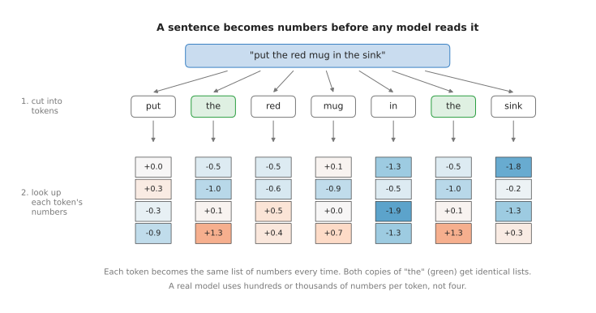
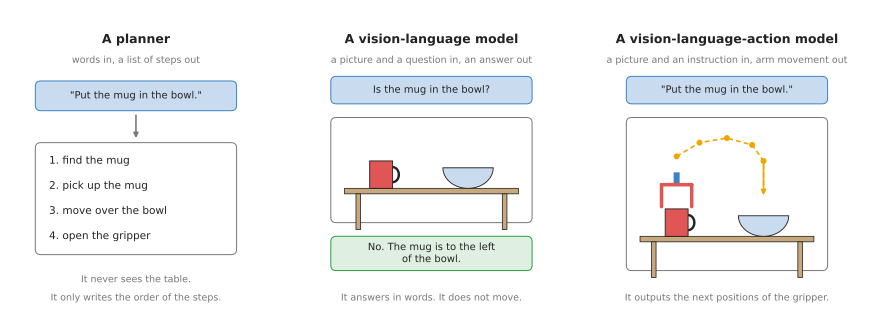

# Language models

This chapter is about models that work with words, and it answers three questions.
What does a model that reads words do for a robot arm? How do words get into a model
at all? And which of the three kinds of language model in this chapter should you read
about first?

This is a page for a reader who has read the first chapter of this book, [what models
are](../01_what-models-are/01_what-a-model-is.md). So you should already know that a
model is a program that turns numbers in into numbers out, and that it learns this
from examples. However, you do not need to know anything about language models yet,
because every new word is explained where it first appears.

## Contents

1. [What language models are for](#1-what-language-models-are-for)
2. [The question they answer for a robot arm](#2-the-question-they-answer-for-a-robot-arm)
3. [How words become numbers](#3-how-words-become-numbers)
4. [The three kinds in this chapter](#4-the-three-kinds-in-this-chapter)
5. [How they compare](#5-how-they-compare)
6. [How this chapter connects to the others](#6-how-this-chapter-connects-to-the-others)
7. [How this chapter writes size, machine and licence](#7-how-this-chapter-writes-size-machine-and-licence)
8. [Where to read next](#8-where-to-read-next)
9. [Using it in Python](#9-using-it-in-python)

---

## 1. What language models are for

This is the fifth of the seven families that the [map of
models](../01_what-models-are/06_the-map-of-models.md) sorts this book into:

> Language models — understand words, and connect words to pictures and actions.

A **language model** is a model that reads text and writes text. It was trained on a
very large amount of written text, most of it from the public internet, and during
that training it did one job over and over again. It saw the start of a sentence and
guessed the next word, and after enough practice it guesses well. To guess well it had
to pick up a great deal about the world. So it knows that a spill is cleaned with a
sponge, and that cups go in a cupboard.

The very big language models are called **large language models**, or **LLMs**, where
"large" means that the model has a very large number of adjustable numbers inside it,
usually billions. For example, you may know some of them by name, such as ChatGPT,
Claude or Gemini.

But a robot arm does not need a model to write essays. It needs three other things
that words can give it instead.

- A person can tell the robot what to do in ordinary words, instead of writing a
  program.
- The robot can use what the language model knows about everyday objects, such as
  which object is a sponge and what a sponge is for.
- The robot can check its own work by asking a question about a camera picture,
  such as "Is the mug in the bowl?"

---

## 2. The question they answer for a robot arm

Every family of models in this book answers one question for the robot. For this
family the question is:

> What did the person ask for, and what does that mean here, in front of this
> camera?

The first half of that question is about words, while the second half is about
pictures and movement. A plain language model can only answer the first half, because
it never sees the table. So the models later in this chapter add a camera picture, and
then movement, in order to answer the second half too.

---

## 3. How words become numbers

A model only works with numbers, so before a model can read a sentence, the sentence
has to be turned into numbers. This is done in two steps, one after the other.



The picture shows the sentence "put the red mug in the sink" going through both steps.
But the numbers in it are made up, and a real model uses far more of them.

In the first step, the sentence is cut into small pieces called **tokens**. A token is
often a whole word, as in the picture. But a long or rare word is cut into two or
three tokens. For example, "screwdriver" might become "screw" and "driver". The model
has a fixed list of all the tokens it knows, and a typical list has tens of thousands
of entries.

In the second step, each token is looked up in a table, and the table gives a list of
numbers for every token. This is why both copies of "the" in the picture have the same
numbers: the same token always gets the same list. The model learned the numbers in
this table during training. So tokens with similar meanings end up with similar lists,
and "mug" and "cup" get lists that are close to each other.

So after these two steps, the sentence is a row of number lists. The model reads the
whole row and works out what each token means in this sentence, and the kind of
network that does this is called a **transformer**. A transformer lets every token
look at every other token in the row, which is how the model knows that "red" belongs
to "mug" and not to "sink". The chapter on [what is inside a neural
network](../01_what-models-are/03_inside-a-neural-network.md) describes networks in
general.

This is an idea that matters for the whole chapter. A picture can also be cut into
pieces and turned into lists of numbers, and so can a movement of the arm. So once
everything is a row of number lists, one transformer can read words, pictures and
movements together, which is what the next three pages build on.

---

## 4. The three kinds in this chapter

Because words, pictures and movements all become the same kind of numbers, they can be
put together in stages. This chapter has three pages after this one, and each page
adds one more thing to what the model can take in or put out.



The picture shows the three kinds side by side, with the same mug, bowl and
instruction. So the planner writes steps, the vision-language model answers a question
about the picture, and the vision-language-action model moves the gripper.

1. [Language models as planners](03_also-used/01_language-models-as-planners.md). A
   language model reads an instruction and writes a list of steps, chosen from skills
   the robot already has, but it never sees a picture itself.
2. [Vision-language models](02_most-used/02_vision-language-models.md). A
   **vision-language model**, or **VLM**, takes a picture and a question in words, and
   answers in words. A robot uses it to find things, to describe a scene, and to check
   whether a step worked.
3. [Vision-language-action models](02_most-used/01_vision-language-action-models.md).
   A **vision-language-action model**, or **VLA**, takes a picture and an instruction,
   and outputs the movement of the arm directly, so it is one model that does the
   seeing, the understanding and the moving.

---

### Most used, and also used

So the pages of this chapter come in two groups. The first group, most used, holds
[vision-language-action models](02_most-used/01_vision-language-action-models.md) and
[vision-language models](02_most-used/02_vision-language-models.md), because in 2026
these are where most of the work on language and robots happens. The second group,
also used, holds [language models as
planners](03_also-used/01_language-models-as-planners.md). Planning with a plain
language model came first, and it is still used to split a long instruction into
steps, but it is now often done by a vision-language model instead.

## 5. How they compare

So the table below compares the three kinds, and each row shows how the three differ
on one point. The columns go in the same order as the pages.

| | Planner | Vision-language model | Vision-language-action model |
| --- | --- | --- | --- |
| What goes in | words | a picture and words | a picture, words and the arm's joint readings |
| What comes out | a list of steps, or a short program | words, or a point on the picture | the next movements of the arm |
| Does it see the table? | no | yes | yes |
| Does it move the arm? | no, other code does | no, other code does | yes |
| How often it runs | once per task, or once per step | once per step, or once per check | many times a second |
| What it is trained on | text | pictures with text | pictures with text, then robot recordings |
| Typical use on an arm | break a long task into steps | find an object, check a step | do the whole task |

The rows show a pattern, because going from left to right each kind does more of the
job by itself. But it also needs more special training data, and more of that data has
to come from real robots. Because recordings from real robots are slow and expensive
to collect, the kind on the right is the hardest to build.

---

## 6. How this chapter connects to the others

Language models rarely work alone on a robot arm, because they sit next to models from
the other chapters.

- A planner chooses the steps. Each step is then done by other models, such as a
  [grasp model](../05_grasp-models/01_overview.md) that decides where to hold an
  object, and a [movement model](../06_movement-models/01_overview.md) that moves the
  arm.
- A vision-language model often does the same job as the [open-vocabulary
  models](../03_seeing-models/02_most-used/03_open-vocabulary-models.md) in the seeing
  chapter, because both find objects from a name in words. But the vision-language
  model can also answer questions and explain what it sees.
- A vision-language-action model is a movement model. It works in the same way as the
  models in the [movement models](../06_movement-models/01_overview.md) chapter, and
  adds an understanding of words and pictures from the internet. It uses the same
  ideas of [action
  chunks](../06_movement-models/02_most-used/02_action-chunking-transformers.md) and
  [flow
  policies](../06_movement-models/02_most-used/03_diffusion-and-flow-policies.md).
- Some of the newest robot models also predict what the camera will see next. Those
  are [world models](../08_world-models/01_overview.md), the next chapter.

---

## 7. How this chapter writes size, machine and licence

Every model section in this chapter says three things about what a model costs you,
and it says them in the same short words rather than explaining them again each time.
This section is where those words are defined. The same three scales are used in
every chapter of this book, so you only have to learn them once.

**Size** is the number of parameters, which is the count of numbers the network
learned during training. It is a rough guide to how capable a model is and to how
much memory it needs, and nothing more: a well-trained small model beats a badly
trained large one.

| Size | Parameters |
| --- | --- |
| xs | under 10 million |
| s | 10 to 100 million |
| m | 100 million to 1 billion |
| l | 1 to 10 billion |
| xl | more than 10 billion |

**Machine** is what you need to run the model once, not to train it. Training needs
more, usually several times more, and each model section says so where it matters.

| Machine | What it needs |
| --- | --- |
| laptop | an ordinary processor, with no graphics card |
| small card | a graphics card with less than 8 GB |
| big card | a graphics card with 8 to 24 GB |
| workstation | a graphics card with 24 to 80 GB |
| cluster | more than one card of 80 GB |

**Licence** is given as the name alone, such as Apache-2.0 or MIT. Two things about
that name matter more than the name itself. The code licence and the weights licence
are often different, so a model with permissive code can still forbid you from
selling what you build, and each model section says when the two differ. And a name
is not legal advice: read the project's own licence file before you ship anything,
because this book records what those files said on the day they were read.

---

## 8. Where to read next

Start with [language models as
planners](03_also-used/01_language-models-as-planners.md), because it introduces the
idea of a language model choosing steps, and the other two pages build on it.

For the current state of the art, read [foundation models and generalist
policies](../../03_frameworks/08_frontier/02_foundation-models.md) in the frameworks
book. It lists every important vision-language-action model as of September 2026, what
each one can do, and whether you can download it, and it is written for a reader who
has finished this chapter.
---

## 9. Using it in Python

[Section 3](#3-how-words-become-numbers) described the two steps that turn a sentence
into numbers, and the drawing there used made-up numbers. This section runs those same
two steps for real. After it you can take any sentence of your own, see exactly which
tokens a model cuts it into, and see how long the list of numbers for one token is.

The library is `transformers`, from Hugging Face, and it is the usual way to run an
open model in Python. You install it with `pip install transformers torch`. The model
below is BERT, which is old and small. It is chosen because it downloads quickly, and
because its tokenizer works in the same way as a large model's.

```python
import torch
from transformers import AutoModel, AutoTokenizer

name = "google-bert/bert-base-uncased"
tokenizer = AutoTokenizer.from_pretrained(name)
model = AutoModel.from_pretrained(name)

sentence = "put the red mug in the sink"

print(tokenizer.tokenize(sentence))      # step 1: the sentence cut into tokens
ids = tokenizer(sentence)["input_ids"]   # each token's number, plus two markers BERT
print(ids)                               # adds at the two ends of every sentence

table = model.get_input_embeddings()     # step 2: the lookup table from the drawing
print(table(torch.tensor(ids)).shape)    # one list of numbers for every token
```

Try it again with a sentence that contains a long or rare word, such as "unscrew the
bolt with the screwdriver", and compare the list of tokens with the list of words. That
is the clearest way to see what section 3 meant by a word being cut into pieces.

Nearly everything in those lines was made by someone else. The pretrained model brings
the list of tokens it knows, the rule for cutting a sentence into them, and the lookup
table whose numbers were set during its training, so you never write any of those
yourself. What you write is the sentence that goes in, and the code that uses what
comes out, which on a robot means building the text you send and reading the answer you
get back.

What you decide is which model to use, because that one choice fixes everything else.
A small model runs on the computer in front of you but understands less, while a large
model understands more and needs either a graphics card or a paid online service. Each
of the three pages after this one shows that decision being made in a different way.
