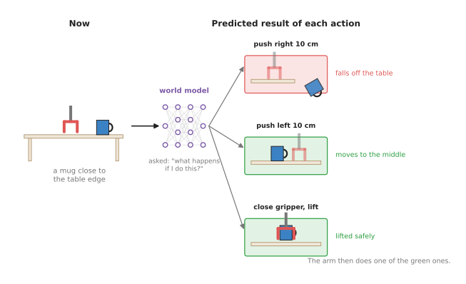
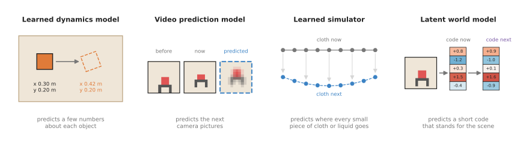

# World models

This chapter is about models that predict what will happen next if the arm does
something. This page is its overview, so it says what this family of models is
for and names its four main kinds. It also shows how these models connect to the
other models in this book.

It is written for a reader who has already read the first chapter of this book,
[What models are](../01_what-models-are/01_what-a-model-is.md). Because that
chapter explains what a model is, you should already know that a model is a
function learned from examples and that its inputs and outputs are lists of
numbers. Beyond that you do not need to know anything else about machine
learning.

## Contents

1. [What a world model is for](#1-what-a-world-model-is-for)
2. [The question it answers for a robot arm](#2-the-question-it-answers-for-a-robot-arm)
3. [The four kinds](#3-the-four-kinds)
4. [Three ways a robot uses a world model](#4-three-ways-a-robot-uses-a-world-model)
5. [How this chapter connects to the others](#5-how-this-chapter-connects-to-the-others)
6. [Why learn a world model, and what it costs](#6-why-learn-a-world-model-and-what-it-costs)
7. [Where to read next](#7-where-to-read-next)
8. [Using it in Python](#8-using-it-in-python)

---

## 1. What a world model is for

Most models in this book look at the world as it is now, and they say nothing
about what comes later. For example, a seeing model looks at a photo and says
"there is a mug here", and a grasp model looks at the same mug and says "hold it
by the handle". Neither of them tells you what happens after the arm moves.

A **world model** is different, because it predicts what will happen next if the
arm does something. You give it two things, and the first of them is what the
world looks like now. The second is an **action**, which is one thing the arm
could do, such as "move the gripper 10 cm to the left". In return the world
model gives back what the world will look like after that action.

People make the same kind of prediction all the time, without any robot being
involved. For example, before you push a glass across a table, you already
expect it to slide and not to tip over. Before you lift a full bag, you also
expect it to be heavy. You learned these expectations from years of watching
things move. In the same way, a world model learns them from many recordings of
things moving.

The word "world" here means only the small part of the world that the robot
cares about. For a robot arm, that part is usually a table, the objects standing
on it and the arm itself.

---

## 2. The question it answers for a robot arm

The last section said what a world model predicts, and this section says why
that prediction is worth having. Every chapter of this book answers one question
for the arm. For this chapter the question is:
**"If I do this, what will happen?"**

That question matters because a robot arm can break things. For example, it can
push a mug off a table, drop a plate or crush a box. Trying each action for
real, just to see what happens, is slow and sometimes costly. So a world model
lets the arm try the action inside its prediction first.

The picture below shows the idea, using a mug that stands close to the edge of a
table. The arm could do three different things there, and the world model
predicts the result of each one before the arm moves at all.



The model predicts that one push sends the mug off the table, so the arm does
not choose it.

This is how a world model helps with a decision. However, the model itself does
not decide anything, because it only answers "what if?" questions. Some other
part of the robot asks those questions and then picks the action with the best
predicted result.

---

## 3. The four kinds

The last section said what a world model is used for, and this section says how
the four main kinds differ. The kinds differ mainly in *what* they predict: some
predict a few numbers, some predict whole camera pictures, and some predict
thousands of small pieces of cloth or water. This chapter has one page for each
of the four main kinds.

The pages are in two groups, because some kinds are far more common on a real
robot than others. The **most used** group has one page, learned dynamics
models. They are the kind most often run on a real arm today, because they are
small, fast and easy to check. That same page also shows the most common way to
combine a physics formula with a network. The method is to keep the formula and
learn only the part it gets wrong. The **also used** group holds the other three
kinds, which are used often in research and in new robot models but less often
on a working arm. That is because they are slower, need more data, or suit only
some materials.

1. [Learned dynamics models](02_most-used/01_learned-dynamics-models.md) predict the next
   state of the arm and the objects, written as a short list of numbers, from
   the current state and an action. Most used.
2. [Video prediction models](03_also-used/01_video-prediction-models.md) predict the next
   camera pictures, pixel by pixel. Also used.
3. [Learned simulators](03_also-used/02_learned-simulators.md) predict how cloth, liquids,
   sand and other soft or loose materials move, by following many small pieces
   of the material at once. Also used.
4. [Latent world models](03_also-used/03_latent-world-models.md) squeeze each camera picture
   into a short code and predict how that code changes. The best-known family is
   called Dreamer. Also used.

The picture below shows what each kind predicts for the same kind of scene, so
you can compare the four of them side by side.



From left to right, the predictions get less like pictures and more like numbers.
The learned simulator is the exception, because it predicts the positions of
many small pieces.

The table below compares the four kinds, with one kind on each row. Read across
a row to see which group that kind is in, what it takes in, what it gives back,
and what it is best at.

| Kind | Group | What goes in | What comes out | Best at | Main weakness |
| --- | --- | --- | --- | --- | --- |
| [Learned dynamics model](02_most-used/01_learned-dynamics-models.md) | most used | a few numbers about the arm and objects, and an action | the same numbers one step later | fast planning for pushing, reaching and holding | someone must first measure those numbers |
| [Video prediction model](03_also-used/01_video-prediction-models.md) | also used | recent camera pictures, and planned actions | future camera pictures | learning from ordinary video, showing a person what it expects | slow, and the pictures get blurry or wrong further ahead |
| [Learned simulator](03_also-used/02_learned-simulators.md) | also used | the positions of many small pieces of material | where each piece will be next | cloth, rope, dough, water and sand | needs the material to be turned into pieces first |
| [Latent world model](03_also-used/03_latent-world-models.md) | also used | a short code made from a camera picture, and an action | the next code, and a score for how well the task is going | practising many times inside the model | hard to check, because you cannot look at the code |

---

## 4. Three ways a robot uses a world model

The last section described what each kind of world model predicts, but a
prediction on its own does not move the arm. A robot turns that prediction into
movement in one of three ways.

The first way is **planning**, in which the robot imagines many possible actions,
asks the world model what each one would do, and picks the best. It then carries out
only the first part of that plan, looks at the world again, and plans again from
there. The
[learned dynamics models](02_most-used/01_learned-dynamics-models.md#3-how-it-works-inside)
page shows this step by step.

The second way is **practising inside the model**, and it brings in another
model called a **policy**. A policy decides what the arm does from moment to
moment, and the [movement models chapter](../06_movement-models/01_overview.md)
is about policies. Normally a policy improves by trying things on the real arm.
With a world model, however, it can try things inside the model's predictions
instead, and those tries are fast and break nothing. The
[latent world models](03_also-used/03_latent-world-models.md) page explains how
this is done.

The third way is as a **training signal**, where the world model sits inside a policy
while that policy is being trained. Once the training is finished, the world model is
thrown away. Learning to predict the next picture forces the policy to learn what
actions do to objects, and a policy that has learned that decides better. Several
robot models released in 2026 use a world model in this way. The frontier document
[Simulation and evaluation](../../03_frameworks/08_frontier/04_simulation-and-evaluation.md#4-learned-world-models)
describes them, and it points out that none of them plans with its prediction.

---

## 5. How this chapter connects to the others

A world model rarely works alone, because each of those three uses puts it next
to other models. The table below lists the other chapters of this book and says
how each one connects to world models. So read each row as "this other kind of
model does this for, or with, a world model".

| Other chapter | How it connects |
| --- | --- |
| [Seeing models](../03_seeing-models/01_overview.md) | They turn pictures into the object positions that a learned dynamics model needs as input. |
| [3D models](../04_3d-models/01_overview.md) | They turn camera images into 3D points, which a learned simulator can use as its small pieces. |
| [Grasp models](../05_grasp-models/01_overview.md) | A world model can check a proposed grasp by predicting whether the object stays in the gripper. |
| [Movement models](../06_movement-models/01_overview.md) | A policy can practise inside a world model, or use one as a training signal. |
| [Language models](../07_language-models/01_overview.md) | A sentence such as "put the cube in the bowl" can steer a video prediction model to draw the task being done. |
| [Touch and body models](../09_touch-and-body-models/01_overview.md) | A model of the arm's own body is a world model for one special object: the arm. |

That last row is worth explaining, because the connection there is closer than it
looks. The
[learned arm models](../09_touch-and-body-models/03_also-used/02_learned-arm-models.md)
page is about predicting how the arm itself moves when its motors push. This is the
same idea as a learned dynamics model, pointed at the arm instead of at the objects.

---

## 6. Why learn a world model, and what it costs

Everything so far has assumed that learning a world model is worth the trouble.
So this section compares it with the obvious alternative, which is a **physics
simulator**. A simulator is a program that people wrote by hand from the laws of
physics. You describe the table, the mug and the arm to it, and then it
calculates how they move. Book 3 uses hand-written simulators such as MuJoCo
throughout.

A simulator is exact about the things it models well, such as a rigid arm
swinging through the air. However, a simulator is weak in three places that
matter for a robot arm. First, someone has to describe every object to it by
hand, with its shape, weight and friction. Second, it is often wrong about
contact, meaning what happens when two things touch, slide or squash. Third, it
is poor at soft things such as cloth, dough and liquids.

Because everything a learned world model knows comes from recordings, it answers
those three weaknesses in a different way. It does not need a hand-written
description of each object, and it learns contact from what really happened
instead of from a formula. It can also learn soft materials from examples of
them moving.

However, the costs are real, and they are the same for all four kinds.

- **It needs data.** Recordings of the arm acting and the world responding. Some
  kinds can use ordinary video, which is plentiful. Others need recordings from
  the robot itself, which are slow to collect.
- **It is only right about what it has seen.** Show it a heavier mug than any in
  its training data, and its prediction may be wrong without any warning.
- **Errors add up.** Each prediction starts from the last one. A small mistake
  in step one becomes a larger mistake by step ten.
- **It can be slow.** A model that draws whole pictures can take far longer
  than the arm has to decide.

Because each approach is strong where the other is weak, many robot teams in practice
use both of them. They train in a hand-written simulator, and they use a learned
model for the parts the simulator gets wrong. The learned dynamics page shows the
simplest form of this, a
[residual model](02_most-used/01_learned-dynamics-models.md#7-learning-only-the-part-physics-gets-wrong-residual-models)
, with a worked example of a pushed block.

---

## 7. Where to read next

Because it is the simplest kind, start with
[learned dynamics models](02_most-used/01_learned-dynamics-models.md). The
planning idea that page explains is used by the other three kinds as well.

For the other chapters, the
[map of models](../01_what-models-are/06_the-map-of-models.md) lists all seven. The
two closest to this one are [movement models](../06_movement-models/01_overview.md) ,
which decide what the arm does, and
[reinforcement learning policies](../06_movement-models/03_also-used/01_reinforcement-learning-policies.md)
, which learn from trying.

For a deeper and more critical view, three documents in Book 3 cover the same
ground:

- [Learned methods for one arm](../../03_frameworks/04_one-arm-training/03_learned-methods.md#2-learning-from-trial-and-error)
  describes model-based learning, such as Dreamer and TD-MPC, next to the other
  ways an arm can learn from trying.
- [Simulation and evaluation](../../03_frameworks/08_frontier/04_simulation-and-evaluation.md#4-learned-world-models)
  describes the world models that were released in 2026 and what they cannot yet
  do.
- [What is changing](../../03_frameworks/04_one-arm-training/05_what-is-changing.md#world-models)
  explains why people expect world models to matter: they can learn from video
  that has no robot actions attached to it.
---

## 8. Using it in Python

This page has described four kinds of model that predict what happens next. Before you
go on to the pages about them, you should know how you actually get hold of one, because
the answer is different from every other chapter in this book, and expecting otherwise
will cost you a week.

There is no world model library. You cannot install a package and load a pretrained
world model for your table, in the way that the previous chapter loads a
vision-language model in three lines. Almost every model named in this chapter is
research code, written for one paper and trained inside one particular simulator, and
it is published as a repository you clone rather than a package you install. What people
reuse from that work is the idea, and they train their own model on their own
recordings. The three exceptions are noted on their own pages, and none of them is a
world model of your table either.

So the honest starting point is the smallest of the four kinds, a learned dynamics
model, written from nothing in PyTorch. PyTorch is the library that nearly all of this
research is built on, and you install it with `pip install torch`. The lines below train
a network to predict how a cube moves when the gripper pushes it.

```python
import torch

model = torch.nn.Sequential(          # 3 state numbers and 1 action number go in,
    torch.nn.Linear(4, 64), torch.nn.Tanh(),        # the change in the state comes out
    torch.nn.Linear(64, 64), torch.nn.Tanh(),
    torch.nn.Linear(64, 3),
)
optimiser = torch.optim.Adam(model.parameters(), lr=1e-3)

# states, actions and next_states hold the recorded pushes, one row per push
for _ in range(1000):
    predicted_change = model(torch.cat([states, actions], dim=1))
    loss = torch.nn.functional.mse_loss(predicted_change, next_states - states)
    optimiser.zero_grad()
    loss.backward()
    optimiser.step()
```

That is a complete world model, and it is thirteen lines of code. It is small because
the state is small, and the rest of this chapter is about what happens when the state is
a picture, a towel or a whole scene.

PyTorch gives you the network, the training and the arithmetic, and nothing else. There
is no pretrained part here at all, so everything the model knows comes from the rows in
`states`, `actions` and `next_states`.

What you write is how those rows are filled, which means measuring the cube from the
camera before and after every push, and the planning loop that asks the trained model
what to do. The [learned dynamics models page](02_most-used/01_learned-dynamics-models.md#51-an-ensemble-of-small-networks-the-pets-way)
shows that loop.

What you decide is which numbers go in the state, and that decision limits everything
the model can ever predict. A state of three numbers cannot describe a folded towel, and
choosing a state you cannot measure from your camera is the most common way this goes
wrong.
