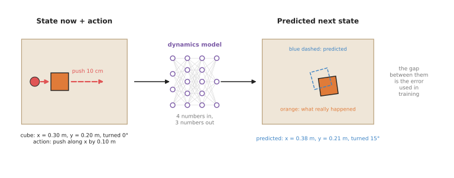
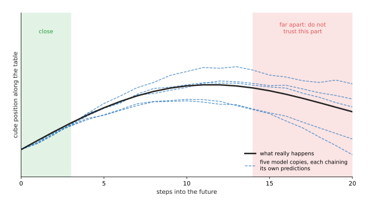
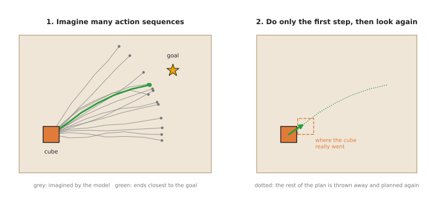
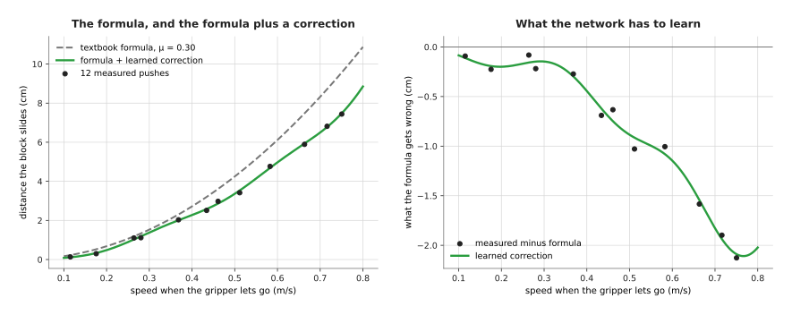
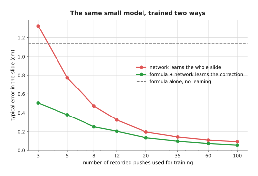
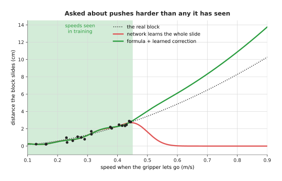

# Learned dynamics models

This page explains the simplest kind of world model, which is a learned dynamics
model. It answers four questions: what such a model predicts, how a robot arm
uses the prediction to choose what to do, how the model is trained, and when it
is the right tool.

It is written for a reader who has already read the
[world models overview](../01_overview.md) and the first chapter of this book,
[What models are](../../01_what-models-are/01_what-a-model-is.md). Because those
pages explain what a model is, you should already know that a model takes a list
of numbers in and gives a list of numbers back, and that it learns from
examples. Beyond that starting point, no other machine learning is needed
here.

> Before this page, it helps to have read
> [sampling-based optimisation and model predictive control](../../../06_programming-techniques/06_planning-and-search/03_also-used/02_sampling-based-optimisation-and-mpc.md),
> which explains the cross-entropy method and model predictive control that
> section 3 uses to plan, and
> [system identification](../../../06_programming-techniques/04_fitting-and-estimation/03_also-used/01_system-identification.md),
> which measures the numbers a physics model needs. Section 7 compares a learned
> model with that.

## Contents

1. [What it is](#1-what-it-is)
2. [What goes in and what comes out](#2-what-goes-in-and-what-comes-out)
3. [How it works inside](#3-how-it-works-inside)
   · [One step](#one-step)
   · [Many steps in a row](#many-steps-in-a-row)
   · [Planning with it](#planning-with-it)
4. [How it is trained](#4-how-it-is-trained)
5. [Well-known models of this kind](#5-well-known-models-of-this-kind)
6. [A worked example: pushing a cube to a mark](#6-a-worked-example-pushing-a-cube-to-a-mark)
7. [Learning only the part physics gets wrong: residual models](#7-learning-only-the-part-physics-gets-wrong-residual-models)
   · [How it works](#how-it-works)
   · [A worked example: how far a pushed block slides](#a-worked-example-how-far-a-pushed-block-slides)
   · [Why it needs less data](#why-it-needs-less-data)
   · [Why it fails more gracefully](#why-it-fails-more-gracefully)
   · [Where it is used on a robot arm](#where-it-is-used-on-a-robot-arm)
   · [Where it does not help](#where-it-does-not-help)
8. [What goes wrong, and what people do about it](#8-what-goes-wrong-and-what-people-do-about-it)
9. [Why this kind, and what it costs](#9-why-this-kind-and-what-it-costs)
10. [The written alternative](#10-the-written-alternative)
11. [Where to read next](#11-where-to-read-next)
12. [Using it in Python](#12-using-it-in-python)

---

## 1. What it is

A learned dynamics model predicts the next state of the arm and the objects from
the current state and an action.

Two words in that sentence need explaining, and the first of them is **state**,
which is a short list of numbers that describes the scene right now. For
example, for a cube on a table the state could be three numbers: where the cube
is from left to right, where it is from front to back, and how far it is turned.
The second word is **dynamics**, which means "how things move over time". So a
dynamics model is a model of how the state changes over time.

Here is an everyday example of the same idea, using a shopping trolley in a car
park. You know where the trolley is now, and you know how hard you push it. So
from those two things you can guess where it will be one second later, and if
you push it often enough, your guesses get good. Then you learn, without any
formula, that a full trolley moves less than an empty one and that it drifts to
one side. A learned dynamics model makes the same kind of guess, and it gets
good at it in the same way, by seeing many pushes and where they ended up.

The word "learned" separates this model from the dynamics written in a physics
textbook. A textbook formula for a sliding cube needs its weight and the
friction between the cube and the table. A learned model needs neither of those
numbers, because it only needs examples of the cube being pushed.

---

## 2. What goes in and what comes out

Now that those two words are explained, here are the numbers themselves. A
learned dynamics model takes two lists of numbers in and gives one list back.

- **The state now.** For example, the cube is at x = 0.30 m and y = 0.20 m, and
  it is turned 0°.
- **The action.** For example, the gripper pushes 0.10 m along x.
- **The output: the predicted state after the action.** For example, the cube
  will be at x = 0.38 m and y = 0.21 m, turned 15°.

The picture below shows this exchange of numbers. In this example four numbers
go in, three for the cube and one for the push, and three numbers come out.



The dashed outline is the prediction, the solid cube is what really happened,
and training tries to make the gap between them smaller.

Notice that the cube moved less than the push itself. The gripper travelled a full 10
cm, but the cube moved only about 8 cm and turned, because it slid and caught on one
corner. A textbook formula would need the friction between the cube and the table to
predict that. Instead, the learned model picks that friction up from the examples.

However, on a real arm the state usually has many more numbers than three. It
holds the
angle and speed of each joint, the position of each object, and sometimes how
fast each object is moving. So a six-joint arm and one object can easily make a
state of 20 numbers. The action is usually a small change in the gripper's
position, or a target angle for each joint.

---

## 3. How it works inside

### One step

The model itself is a small neural network of the kind described in
[inside a neural network](../../01_what-models-are/03_inside-a-neural-network.md).
The state numbers and the action numbers are placed side by side in one list,
and that list goes in at one end of the network. Then the predicted state comes
out at the other end.

Many dynamics models predict the **change** in the state, not the new state
itself. They output "the cube moves 8 cm along x and turns 15°", and the program
adds that to the old state. This is easier for the network to learn, because the
change is small and it looks similar wherever the cube is on the table.

### Many steps in a row

One step is usually a short time, such as a tenth of a second. So to see further
ahead, you have to use the model again and again. You feed its prediction back
in as the next "state now", add the next action, and get the step after that.
This is called **rolling the model forward**, and the list of predicted states is
called a **rollout**.

Every step starts from the last prediction, not from the truth. So if step one is
slightly wrong, step two starts from a wrong place and adds its own error, and
the errors add up over the rollout. This is called **compounding error**, and it
is the main weakness of every world model in this chapter.

Because the errors add up, you need a way to see how far a rollout can be
trusted, and the usual way is to train several copies of the model. Each copy
starts from different random numbers, so each one learns slightly differently.
This group of copies is called an **ensemble**, and it is read in a simple way.
Where the copies agree, the prediction is probably right, and where they
disagree, the model has not seen enough examples of that situation.



In this drawing of the idea, not a measured result, the copies start together
and spread apart further into the future.

### Planning with it

Rolling the model forward is only useful if something then chooses the actions. That
is what planning does, because planning means choosing actions by asking the model
"what if?". A planner makes up many sequences of actions, rolls each one forward
through the model, scores where each one ends up, and keeps the best. A method called
the **cross-entropy method**, or **CEM**, repeats this a few times and narrows the
search towards the best sequences. The arm then does only the **first** action,
measures the real state again and plans again from there, and this loop is called
**model predictive control**, or **MPC**. Because the plan is thrown away after one
step, a wrong prediction five steps ahead does little harm. Book 5's
[sampling-based optimisation and MPC](../../../06_programming-techniques/06_planning-and-search/03_also-used/02_sampling-based-optimisation-and-mpc.md)
page teaches these methods step by step, with real numbers.

However, two things change when the model is learned. First, the planner searches for
whatever the model says works best, so it is drawn to the places where the model is
wrong in a hopeful direction. Second, the model is only trustworthy near its training
records. This is why the ensemble matters: the planner uses the copies' average as
the prediction, and it prefers sequences on which the copies agree. The Book 5 page
has a
[worked example of a learned ensemble inside MPC](../../../06_programming-techniques/06_planning-and-search/03_also-used/02_sampling-based-optimisation-and-mpc.md#a-learned-model-inside-mpc)
that shows how much this helps.



The planner tries many sequences inside the model, but the arm moves only one
small step before it plans again.

---

## 4. How it is trained

Planning only works once the model has been trained, so this section says where
that training comes from. A dynamics model learns from records of the arm
acting, and each record has three parts: the state before, the action, and the
state after. The state is measured by the arm's joint sensors and, for objects,
by a camera and a [seeing model](../../03_seeing-models/01_overview.md) or by
markers stuck on the objects.

The records come from three places, and the list below describes each one.

- **Random play.** The arm makes random pushes and small moves, and the system
  records what happens. This is simple, and it covers many situations.
- **Demonstrations.** A person guides the arm through the task, as described in
  [where the data comes from](../../01_what-models-are/05_where-the-data-comes-from.md).
- **The robot's own attempts.** Once the model is roughly right, the robot plans
  with it and tries the task. Each attempt gives new records, especially in the
  places where the model was wrong. The model is retrained, and the cycle repeats.

Once the records exist, training works as described in
[how a model learns](../../01_what-models-are/02_how-a-model-learns.md). The
network predicts the state after, the program measures the gap to the recorded
state after, and it adjusts the network to make that gap smaller.

How much data is needed depends on the task itself. A dynamics model for one
simple
task, such as pushing one cube, is small, so it can often learn from tens of
thousands of steps. For example, if the arm records 10 steps a second, then
10,000 steps is under 17 minutes of recording. A model that must cover many
objects and many tasks needs far more than that.

---

## 5. Well-known models of this kind

The ideas above are easier to follow next to real examples of them, so the
models below are real and published ones. Each of them added an idea that is
still used.

- **PILCO** (Deisenroth and Rasmussen, 2011) is not a neural network. It uses a
  different kind of model that states how sure it is of each prediction. It
  showed that a model of the dynamics lets a system learn a control task from
  very few real attempts. Later neural network models took this idea over.
- **Learning to Poke by Poking** (Agrawal and others, 2016) let a Baxter robot
  poke objects on a table by itself for many hours. It learned both a model that
  predicts what a poke will do and a model that picks the poke to reach a target.
- **PETS** (Chua and others, 2018) uses an ensemble of networks, each of which
  also says how unsure it is. It plans with the cross-entropy method and
  model predictive control. It made ensembles the standard way to handle
  compounding error.
- **MBPO** (Janner and others, 2019) uses the model differently. It does not
  plan with it. It uses short rollouts from the model as extra practice for a
  [reinforcement learning policy](../../06_movement-models/03_also-used/01_reinforcement-learning-policies.md),
  and it keeps them short so that errors do not add up too far.
- **PDDM** (Nagabandi and others, 2019) learned a dynamics model for a
  robot hand with many fingers, and used it to turn two balls around each other
  in the palm of a real hand.
- **TD-MPC** and **TD-MPC2** (Hansen and others) predict a compact code of the
  state rather than the raw numbers, and plan with model predictive control. They
  sit between this page and [latent world models](../03_also-used/03_latent-world-models.md).

---

## 6. A worked example: pushing a cube to a mark

Here is how a learned dynamics model helps an arm push a wooden cube to a mark
on a table. Pushing is a good example, because the cube slides, turns and
catches on the table in ways that are hard to write as a formula. The same idea
works for pushing a mug out of the way before grasping it.

1. **Measure.** A camera above the table sees the cube. A seeing model finds
   its position and how far it is turned. Those three numbers are the state.
2. **Collect.** For half an hour, the arm makes random pushes. Each push gives a
   record: state before, push, state after.
3. **Train.** An ensemble of five small networks learns from those records.
4. **Plan.** The goal is a mark 30 cm away. The planner makes up 500 sequences of
   five pushes. It rolls each through the ensemble and keeps the one whose final
   position is closest to the mark, where the five copies also agree.
5. **Act.** The arm makes the first push of that sequence only.
6. **Repeat.** The camera measures the cube again, and the planner plans again
   from the real position. After a handful of pushes, the cube is on the mark.
7. **Improve.** Every real push is also a new training record. Overnight, the
   model is retrained on everything, and it gets better where it was worst.

The arm never needs to know the cube's weight or the friction of the table. For
example, if someone swaps the wooden cube for a heavier metal one, the first few
pushes fall short. However, planning again after each push corrects for this,
and retraining on the new records fixes it for good.

---

## 7. Learning only the part physics gets wrong: residual models

So far the network on this page has learned everything about how the cube moves,
starting from nothing. However, there is a cheaper way when a physics formula
already gets the answer roughly right. You keep the formula, and the network
learns only the difference between the formula and what really happens. That
difference is called the **residual**, which means "what is left over", and a
model built this way is called a **residual model**. Some people call the method
**residual physics**.

Here is an everyday example of the same split. A satnav, which is the device in
a car that works out how long a journey will take, says the drive to work takes
20 minutes. However, you have driven it many times, and you know it always takes
about 5 minutes longer on a Monday morning. You do not throw away the satnav and
learn the whole road map yourself. Instead, you keep the satnav's answer and add
your own small correction. In that example the satnav is the formula, and your
5 minutes is the residual.

### How it works

So the prediction is made in two parts, which are then added together.

1. **The physics part.** A formula, or a physics simulator, predicts the next
   state from the current state and the action. It uses values from a table or a
   datasheet, such as the friction between wood and a table top.
2. **The learned part.** A small network is given the same state and action, and
   predicts how wrong the physics part will be.
3. **The prediction** is the physics answer plus the correction.

Training is the same as in [section 4](#4-how-it-is-trained), with one change.
For each record, the program first works out the physics answer. Then the
network's target is the recorded answer minus the physics answer, not the
recorded answer itself.

### A worked example: how far a pushed block slides

Here is a small example that the script for this page computes for real. The
gripper pushes a wooden block along the table and then lets go, and the question
is how far the block slides after that.

The physics formula for a sliding block says it stops after a distance of
v² / (2 μ g). Here v is the speed when the gripper lets go, g is 9.81 m/s², the
pull of gravity, and μ is the **friction coefficient**, which is a number that
says how strongly the two surfaces resist sliding on each other. A table of
materials gives μ = 0.30 for wood on wood.

The "real" block in the script is made to be a little different from those table
numbers, as real blocks are. Its friction is higher than the table says, and it also
rises with speed. The recorded distances have up to about 2 mm of measuring error as
well. The learned part is a small model made of 8 smooth bumps, fitted by
[least squares](../../../06_programming-techniques/04_fitting-and-estimation/02_most-used/01_least-squares-fitting.md)
. It stands in for a small network, because it behaves the same way for this purpose.



On the left, the dashed line is the formula, and it predicts too far at every
speed. For example, at 0.5 m/s it says 4.25 cm, but the block slides 3.44 cm. On
the right are the 12 measured pushes minus the formula, and this is all the
network has to learn: a smooth curve from about 0 to about −2 cm. After fitting
it to those 12 pushes, the formula
plus the correction predicts 3.36 cm at 0.5 m/s. At 0.7 m/s the formula says
8.32 cm, the block slides 6.47 cm, and the formula plus the correction says
6.50 cm.

### Why it needs less data

The correction is easier to learn than the whole slide, and the next picture
shows how much easier. It trains the same small model in two ways: in one the
model learns the whole slide from nothing, and in the other it learns only the
correction to the formula. Each point is the typical error over 200 repeats with
different random pushes.



With 3 pushes, the model that learns the whole slide is wrong by 1.33 cm, which
is worse than the formula alone at 1.14 cm. The residual model is wrong by only
0.50 cm. With 12 pushes the two are at 0.32 cm and 0.20 cm, and with 100 pushes
both are good, at 0.09 cm and 0.06 cm.

The reason is simple, because the formula already knows the shape of the answer:
faster pushes slide much further, and a push at zero speed slides nowhere. The
model that learns everything has to discover that shape from the data. Instead,
the residual model only has to learn a small, smooth correction, and a small,
smooth correction takes few examples to learn.

### Why it fails more gracefully

The last picture asks both models about pushes that are harder than any they
were trained on, because that is where a model usually breaks. Both were trained
on 20 pushes at speeds between 0.1 and 0.45 m/s.



Inside the shaded band, both models are close to the real block. Outside it,
however, the model that learned everything falls to almost zero. At 0.6 m/s it
predicts 0.03 cm, when the block really slides 4.85 cm. That is not a small
error, because it is a nonsense answer. The residual model instead falls back to
the formula, and it predicts 6.11 cm. This is too far, but it is the right kind
of answer, and it is exactly as wrong as the formula alone.

Be careful with that result, because it depends on the kind of model used. The
bump model used here gives a correction of zero far from its data, so the
residual model falls back to the formula by itself. However, a real network does
not always do that. Some networks carry on in a straight line outside their
data, so the correction can grow large. This is why people keep the correction
small on purpose. They add a penalty on its size during training, cap it at a
fixed limit, or use an ensemble and trust only the formula where the copies
disagree.

### Where it is used on a robot arm

- **Throwing.** TossingBot (Zeng and others, 2019) threw objects into boxes. A
  flight formula worked out the release speed, and a network learned a correction
  for each object's grip and air drag. Its authors reported that this learned
  faster and threw more accurately than a network that learned the throw alone.
- **Pushing and bouncing.** Ajay and others (2018) added a small network to a
  physics simulator to predict how pushed and bouncing objects really move. They
  reported that it predicted better than either the simulator or a network alone.
- **The arm's own motors.** A textbook model of the arm plus a learned correction
  for friction and wear is the most common case of all. The page on
  [learned arm models](../../09_touch-and-body-models/03_also-used/02_learned-arm-models.md#31-physics-plus-a-learned-correction)
  explains it.
- **Simulators.** NeuralSim (Heiden and others, 2021) added small networks inside a
  physics simulator, to learn the contact and friction effects that the simulator's
  formulas leave out.

The same idea is also used for policies, and not only for models. A **residual
policy** keeps an ordinary hand-written controller and learns only a correction
to its commands.

### Where it does not help

- **The formula has the wrong shape.** If the physics part misses the main effect,
  for example it ignores that the block tips over, the correction is as large as
  the answer. Then there is little gain over learning everything.
- **There is no formula.** For cloth, liquids and soft food there is no short
  formula to start from. The
  [learned simulators](../03_also-used/02_learned-simulators.md) page covers those.
- **The formula's numbers are just wrong.** If the only error is one wrong value,
  such as the friction coefficient, it is simpler to measure that value properly.
  Book 5's page on
  [system identification](../../../06_programming-techniques/04_fitting-and-estimation/03_also-used/01_system-identification.md)
  explains how. A residual model is worth it when the error has a shape that no
  single number fixes.

There is no special library for residual models, because you build one out of
parts you already have. The physics part is your own formula, or a simulator
such as MuJoCo or PyBullet, and the learned part is an ordinary small network,
usually written in PyTorch. The code that adds the two together is only a few
lines.

---

## 8. What goes wrong, and what people do about it

The sections above described how a learned dynamics model works when it works.
This section lists the five things that go wrong in practice, and what people do
about each one.

**Errors add up over many steps.** This was shown in
[many steps in a row](#many-steps-in-a-row). Because of that, people plan only a
few steps ahead and plan again after every action. They also use ensembles to
see where the prediction stops being trustworthy.

**The planner finds the model's mistakes.** The planner looks for the action
with the best predicted result, so it is drawn to any action the model is
hopeful about. For example, if the model wrongly predicts that a strange push
sends the cube straight to the goal, the planner will choose that push. People
reduce this by preferring actions where the ensemble copies agree, and by
retraining on the records from those failed attempts.

**Someone must measure the state.** The model works on numbers such as the
cube's position, so something must produce those numbers from the camera, and
that part can be wrong too. For many objects, or for soft objects, there is no
short list of numbers at all. The other three kinds of world model deal with
this in their own ways.
[Video prediction models](../03_also-used/01_video-prediction-models.md) work straight on
pictures, and [learned simulators](../03_also-used/02_learned-simulators.md) follow many small
pieces.

**Sudden changes are hard.** A network gives smooth outputs, but contact is not
smooth. For example, a small change in a push can decide whether the gripper
touches the cube at all. So models predict these sudden changes badly. People
add more records near contact, or they use a physics formula for the smooth part
and let the network learn only the correction. This is called a **residual
model**, and
[section 7](#7-learning-only-the-part-physics-gets-wrong-residual-models) explains
it.

**New objects break it.** A model trained on one cube does not know anything
about a ball. So people train on many objects, or they give the model a few
numbers that describe the object, such as its size.

---

## 9. Why this kind, and what it costs

The last section listed what goes wrong, so this section weighs those problems
against what the model gives you. A learned dynamics model is the right choice
when the state can be written as a short list of numbers, and when a textbook
formula for the motion is missing or wrong. Pushing, sliding and holding objects
on a table are typical cases.

There are two obvious alternatives, and it is worth naming both.

The first is a **hand-written physics simulator**, such as MuJoCo. A simulator
needs every object's weight, shape and friction, and it is often wrong about
sliding and catching, which is exactly what matters for pushing. Instead, a
learned model learns the real behaviour from the real cube. So choose the
simulator when you can describe the objects well and do not have a real arm to
collect data on. When
the simulator is roughly right, you can also keep it and learn only what it gets
wrong, as
[section 7](#7-learning-only-the-part-physics-gets-wrong-residual-models) shows.

The second is a policy that learns without any model, which Book 3 calls
**model-free** learning. It connects the state straight to an action, so it is
simpler, but it needs far more attempts, because every attempt teaches it only
one thing. A dynamics model instead learns how the world works from each
attempt, and the planner can reuse that for any goal. So the same model that
pushes the cube to one mark can push it to a different mark tomorrow, with no
new training.

What it costs you:

- You need a way to measure the state, usually a camera and a seeing model.
- You need recordings from the real arm, which take time.
- Planning takes computing time at every step. Hundreds of rollouts must finish
  before the arm moves again.
- It only knows the objects and situations it was trained on.

---

## 10. The written alternative

The sections above assumed that the model is learned, but the planner does not
require that. The written alternative keeps the planner and replaces the learned
model with a written one, because the planning loop in section 3 is written code
either way. Book 5's
[sampling-based optimisation and model predictive control](../../../06_programming-techniques/06_planning-and-search/03_also-used/02_sampling-based-optimisation-and-mpc.md)
explains random shooting, the cross-entropy method and model predictive control in
full. The model can then be a physics formula for pushing, such as Book 3's
[quasi-static planar pushing](../../../03_frameworks/02_gripping/09_pushing-and-sliding.md#3-quasi-static-planar-pushing)
, with its numbers measured by
[system identification](../../../06_programming-techniques/04_fitting-and-estimation/03_also-used/01_system-identification.md)
.

The written model wins when the objects are simple and a formula with a few measured
numbers predicts them well, because it needs no recordings and can be checked. The
learned model wins when sliding and catching do not follow the formula, and you can
record the real arm pushing the real objects.

---

## 11. Where to read next

- The [next page](../03_also-used/01_video-prediction-models.md) covers video prediction models,
  which predict whole camera pictures instead of a few numbers.
- [Latent world models](../03_also-used/03_latent-world-models.md) combine the planning idea from
  this page with pictures, by squeezing each picture into a short code.
- [Learned arm models](../../09_touch-and-body-models/03_also-used/02_learned-arm-models.md)
  apply the same idea to the arm's own motors and joints.
- [Reinforcement learning policies](../../06_movement-models/03_also-used/01_reinforcement-learning-policies.md)
  explain the policies that MBPO trains with extra practice from a model.
- For more depth, Book 3's
  [learned methods for one arm](../../../03_frameworks/04_one-arm-training/03_learned-methods.md#2-learning-from-trial-and-error)
  places model-based learning next to the other ways an arm learns from trying.
---

## 12. Using it in Python

[Planning with it](#planning-with-it) described a planner that makes up many sequences
of pushes, rolls each one through the model, and keeps the best. This section writes
that loop in Python. After it you will be able to take a trained dynamics model and get
one push out of it, which is the only thing the arm ever needs.

The library is PyTorch, and nothing else is needed, because a dynamics model is a plain
network. The
[world models overview](../01_overview.md#8-using-it-in-python) shows the few lines
that train it, so the model here is assumed to be trained already and saved to a file.

```python
import torch

model = torch.nn.Sequential(
    torch.nn.Linear(4, 64), torch.nn.Tanh(),
    torch.nn.Linear(64, 64), torch.nn.Tanh(),
    torch.nn.Linear(64, 3),
)
model.load_state_dict(torch.load("pusher.pt"))
model.eval()

state = torch.tensor([[0.30, 0.20, 0.0]])   # the cube: x, y in metres, and its angle
goal = torch.tensor([[0.60, 0.20, 0.0]])

plans = torch.rand(500, 5, 1) * 0.2 - 0.1   # 500 plans of 5 pushes, each -10 to +10 cm
rolled = state.repeat(500, 1)               # all 500 plans start from the real cube
with torch.no_grad():
    for step in range(5):
        rolled = rolled + model(torch.cat([rolled, plans[:, step]], dim=1))

best = (rolled - goal).norm(dim=1).argmin()  # the plan ending nearest the goal
first_push = plans[best, 0]                  # the arm does only this, then plans again
```

Two things in those lines are worth pausing on. The loop over `step` is the rollout from
[many steps in a row](#many-steps-in-a-row), and every pass feeds the model its own
previous answer, which is exactly why the errors add up. Then all 500 plans go through
the model together, in one call, because a network works on many rows at once, and that
is what makes it fast enough to plan between pushes.

Nothing here is pretrained. This is the one kind of model in this chapter that you are
expected to train yourself, on your own arm, from your own recordings, and that is a
feature rather than a gap: the model is small enough that half an hour of pushing is
enough for one task.

What you write is the measurement and the score. Something must turn the camera picture
into the three numbers in `state`, and that is a [seeing
model](../../03_seeing-models/01_overview.md) and some geometry, not part of this code.
The score above is simply the distance to the goal, and a real task usually needs more,
such as a penalty for pushing the cube off the table.

What you decide is the shape of the search. Five steps, 500 plans and one push per plan
are all choices, and they trade accuracy against the time the arm waits. You also decide
whether to use an ensemble, which means running the lines above with several trained
copies and preferring the plans they agree on, for the reason
[section 8](#8-what-goes-wrong-and-what-people-do-about-it) gives.
