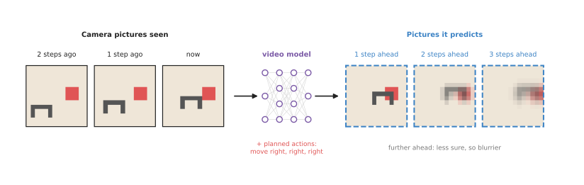
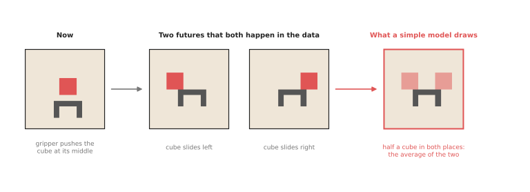
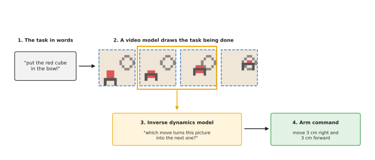

# Video prediction models

This page explains world models that predict future camera pictures, and it answers
four questions about them: what it means for a model to "predict a picture", how a
robot arm can use a predicted picture to decide what to do, why predicted pictures
often come out blurry, and when this kind of model is worth its large cost.

It is written for a reader who has already read the
[world models overview](../01_overview.md) and the page on
[learned dynamics models](../02_most-used/01_learned-dynamics-models.md), so you
should know what a model, a state, an action and a rollout are. It also assumes
you know that a camera picture is a grid of numbers, one per colour per pixel,
which [what a model is](../../01_what-models-are/01_what-a-model-is.md)
explains.

## Contents

1. [What it is](#1-what-it-is)
2. [What goes in and what comes out](#2-what-goes-in-and-what-comes-out)
3. [How it works inside](#3-how-it-works-inside)
   · [Drawing the next picture](#drawing-the-next-picture)
   · [Why the future comes out blurry](#why-the-future-comes-out-blurry)
   · [Four ways a robot uses the pictures](#four-ways-a-robot-uses-the-pictures)
4. [How it is trained](#4-how-it-is-trained)
5. [Well-known models of this kind](#5-well-known-models-of-this-kind)
   · [5.1 Cosmos 3](#51-cosmos-3)
   · [5.2 Cosmos Predict 2.5](#52-cosmos-predict-25)
   · [5.3 LingBot-VA](#53-lingbot-va)
   · [5.4 FastWAM](#54-fastwam)
   · [5.5 Genie](#55-genie)
   · [5.6 Action-conditioned pixel prediction, and Visual Foresight](#56-action-conditioned-pixel-prediction-and-visual-foresight)
   · [5.7 UniPi](#57-unipi)
   · [How to choose](#58-how-to-choose)
6. [A worked example: sliding a cube to a clicked spot](#6-a-worked-example-sliding-a-cube-to-a-clicked-spot)
7. [What goes wrong, and what people do about it](#7-what-goes-wrong-and-what-people-do-about-it)
8. [Why this kind, and what it costs](#8-why-this-kind-and-what-it-costs)
9. [The written alternative](#9-the-written-alternative)
10. [Where to read next](#10-where-to-read-next)

---

## 1. What it is

A video prediction model predicts the next camera pictures from the recent
pictures and, usually, the actions the arm is about to take.

A learned dynamics model needs a short list of numbers, such as the position of
a cube, and somebody must measure those numbers first. A video prediction model
skips that step, because it works directly on the pictures from the camera. In
other words, its "state" is simply what the camera sees.

Here is an everyday example of the same skill, using a video of falling
dominoes. Watch the first half of a video of someone knocking over a row of
dominoes, and then pause the video there. You can picture
the next few seconds, because the dominoes keep falling, one after another, from
left to right. You did not measure any positions, and you only pictured what you
would see. So a video prediction model does the same thing, one frame at a time.

A **frame** is one picture in a video, and a camera on a robot arm usually records
between 10 and 30 frames every second.

---

## 2. What goes in and what comes out

Now that the idea is clear, here is what actually passes in and out of such a
model. A video prediction model for a robot arm takes two things in and gives
one back.

- **The recent frames.** For example, the last three pictures from a camera
  above the table.
- **The planned actions.** For example, "move the gripper right, then right
  again, then right again". Some models also accept a sentence instead, such as
  "put the red cube in the bowl".
- **The output: the predicted future frames.** For example, three pictures that
  show the gripper moving right and pushing the cube along.

The picture below shows this with tiny pictures of 14 × 14 pixels, so that you
can see each pixel. However, real models use pictures with a few hundred pixels
on each side.



The predicted pictures get blurrier the further ahead they are, because the
model is less sure what will happen.

A model that takes the actions as an input is called **action-conditioned**,
because it predicts a different future for each different action. That is what
makes it a world model and not only a video generator. A video generator that
ignores the action can show you *a* future. Instead, an action-conditioned model
can show you the future *that your action would cause*.

---

## 3. How it works inside

### Drawing the next picture

The last section said what goes in and what comes out, so this section says what
happens in between. A video prediction model has three parts, and they run in
the order below.

1. **An encoder** turns each recent frame into a smaller grid of numbers that
   describes what is in it. Seeing models use the same kind of part; the
   [image classification](../../03_seeing-models/03_also-used/01_image-classification.md) page
   shows how a picture becomes numbers.
2. **A predictor** combines those numbers with the action numbers. It works out
   how things in the scene will move.
3. **A decoder** turns the result back into a full picture, pixel by pixel.

To see further ahead, the model feeds its own predicted frame back in, like the
rollout on the
[learned dynamics models](../02_most-used/01_learned-dynamics-models.md#many-steps-in-a-row)
page, and the same problem appears here: errors add up from frame to frame.

Some older models do not draw the new frame from nothing. Instead, they predict
how each pixel moves, as in "this group of red pixels shifts two pixels to the
right", and then they move the pixels of the last frame. So this works well for
pushing, where most of the scene stays the same and only a few things move.

Most newer models are **diffusion models**, which build the picture in a different
way. A diffusion model starts from a picture of pure random noise, like the snow on
an old television. It then removes the noise a little at a time, over many passes,
until a clear picture is left. At each pass, it uses the recent frames and the action
to decide what the clean picture should look like. The
[diffusion and flow policies](../../06_movement-models/02_most-used/03_diffusion-and-flow-policies.md)
page explains the same method used to produce arm movements. So diffusion models draw
sharp pictures, but the many passes make them slow.

### Why the future comes out blurry

The future is often uncertain, even when the action is known. For example,
suppose the gripper pushes a cube exactly at its middle. Sometimes the cube
slides to the left, and sometimes it slides to the right, and both of those
happen in the training videos.

A simple model is trained to make its picture as close as possible to the real
one, on average. The safest picture, on average, is a mix of both futures: half
a cube on the left and half a cube on the right. So that is what a simple model
draws instead of one clear future.



The right-hand picture is the average of the two real futures, and it matches
neither of them.

People fix this by letting the model pick one future at a time, and they do that
by giving the model an extra input of random numbers. Different random numbers
then make it draw different, sharp futures: one with the cube on the left, and
one with it on the right. Diffusion models do this naturally, because they start
from random noise. So running the model several times shows several possible
futures, which is more honest than one blurry picture.

### Four ways a robot uses the pictures

A predicted picture does not move the arm by itself, so something has to use it,
and robots use video prediction in the four ways listed below.

1. **To plan.** The robot imagines many action sequences, predicts the pictures
   for each one, and picks the sequence whose final picture looks most like the
   goal. This is the planning method from the
   [previous page](../02_most-used/01_learned-dynamics-models.md#planning-with-it), with pictures
   in place of numbers.
2. **To draw the task, then copy it.** The model draws a short video of the task
   being done, from a sentence such as "put the red cube in the bowl". A second,
   smaller model then works out the arm moves that turn each picture into the
   next. That second model is called an **inverse dynamics model**. It answers
   the opposite question to a world model: not "what happens if I do this?" but
   "what did I do to make this happen?". The picture below shows these steps.
3. **To make training data.** The model draws many videos of a task being done
   in new rooms or with new objects. The actions are read off with an inverse
   dynamics model, and the results are used to train a policy.
4. **As a training signal.** A policy learns to predict future frames while it
   learns to act, and the predicting part is thrown away afterwards. The
   [overview](../01_overview.md#4-three-ways-a-robot-uses-a-world-model) says more.



The inverse dynamics model turns each pair of frames, such as the one in the
orange box, into one arm command.

---

## 4. How it is trained

The last section described how the model draws a frame, and this section says
where it learns to do that. A video prediction model learns from videos: it sees
the first few frames of a clip, predicts the next ones, and is corrected by the
real next frames. This needs no labels written by people, because the video
itself is the answer, and that is the main attraction of this kind of model.

The videos come from two sources, and most modern models use both.

- **Robot videos with actions.** The robot records its camera and, at the same
  time, the actions it took, so these teach the model what each action does.
  However, they are slow to collect, because a real arm must do every one.
- **Ordinary videos without actions.** Videos of people cooking, cleaning or
  building things show how objects move, fall, pour and fold, and there are vastly
  more of these than robot videos. They teach the model how the world looks and
  moves, even though they carry no robot actions.

A common recipe is to train first on a large amount of ordinary video, and then to
train a little more on robot video with actions, so that the model learns to follow
the arm's commands. Book 3's
[what is changing](../../../03_frameworks/04_one-arm-training/05_what-is-changing.md#world-models)
explains why this matters: robot demonstrations are scarce, and video is not.

Large video models are trained on far more video than any single robot lab could
record, on many graphics cards, for weeks. However, small models for one task,
such as pushing objects on one table, can learn from a few hours of the robot's
own video.

---

## 5. Well-known models of this kind

This is the kind of world model that changed most in 2026, because the large
video generation models arrived and some of them now take robot actions as an
input. So this section separates the models you can download and run from the
ones you can only read about, and then helps you pick one.

Read the table one row at a time. Each row names the model, says what it is best
at, gives its size and its licence, and says when to pick it. The size is the
number of trainable numbers, where the makers state one, and `not stated` means
it is not published. The licence column matters more here than anywhere else on
this page, because these are large downloads with conditions attached.

| Model | Best at | Size | Licence | Pick it when |
| --- | --- | --- | --- | --- |
| [5.1 Cosmos 3](#51-cosmos-3) | predicting the video that a given sequence of actions would cause | Edge 4 billion, Nano 16 billion, Super 64 billion | OpenMDW 1.1 | you have Linux, an NVIDIA card, and actions in one of its robot shapes |
| [5.2 Cosmos Predict 2.5](#52-cosmos-predict-25) | making new robot-scene video from one picture and a sentence | 2 billion, from the model's own name | Apache 2.0 for the code, NVIDIA Open Model License for the weights | you want synthetic video to train on, and no action control |
| [5.3 LingBot-VA](#53-lingbot-va) | predicting video and actions together while the robot runs | about 5 billion trainable, plus about 20 GB of frozen parts | Apache 2.0 for LeRobot; the frozen parts come from another repository | you want to see what the policy expected to happen |
| [5.4 FastWAM](#54-fastwam) | a policy trained with video prediction that does not predict at run time | initialised from Wan2.2-TI2V-5B | Apache 2.0 for LeRobot and for Wan2.2-TI2V-5B | you want the training benefit without the slowness |
| [5.5 Genie](#55-genie) | interactive worlds a person can walk around in | not stated | no weights released | never, on a robot; read it for the direction |
| [5.6 Action-conditioned pixel prediction, and Visual Foresight](#56-action-conditioned-pixel-prediction-and-visual-foresight) | pushing objects on a table, planned with predicted pictures | not stated | research code from papers | you want to understand how all of the above work |
| [5.7 UniPi](#57-unipi) | drawing the task as a video, then reading the actions off it | not stated | research code from a paper | you want to understand the pattern Cosmos 3 now provides ready-made |

### 5.1 Cosmos 3

This is **most used in 2026** for this kind of work, because it is the only
openly downloadable video world model that takes your actual actions as numbers.
NVIDIA published the Cosmos 3 family on Hugging Face on 31 May 2026, with
[Cosmos3-Nano](https://huggingface.co/nvidia/Cosmos3-Nano) of 16 billion numbers
and Cosmos3-Super of 64 billion, and added the smaller
[Cosmos3-Edge](https://huggingface.co/nvidia/Cosmos3-Edge) of 4 billion numbers
on 20 July 2026. Its model card says that text, pictures, video and action
trajectories go in, and text, pictures, video and actions come out. The licence is
[OpenMDW 1.1](https://openmdw.ai/license/1-1/), and the card states that the
model is ready for commercial and non-commercial use.

The obvious alternative is Cosmos Predict 2.5 in 5.2, which is from the same
company and easier to install. Pick Cosmos 3 when you want the thing
[section 2](#2-what-goes-in-and-what-comes-out) calls action-conditioned. Its
action modes are named exactly after the ideas on this page: `forward_dynamics`
rolls out future video from one frame and a sequence of actions you supply,
`inverse_dynamics` reads the actions that connect frames you already have, and
`policy` produces future video and actions together. Nothing else you can
download does the first of those for a robot arm.

It costs you hardware, speed and a matching robot. The card lists Linux, NVIDIA
Ampere, Hopper or Blackwell cards, and tested support for BF16 precision only.
Its performance table gives one forward-dynamics call as 3.69 seconds on an H100
SXM 80 GB card and 24.59 seconds on a DGX Spark, while an arm's control loop
needs an answer in a few milliseconds. The third cost is the one people trip
over: the action numbers must be in the layout of one of its listed robots,
which include a single Franka Panda arm with a Robotiq gripper at 10 numbers, a
WidowX 250 at 10 and a dual Franka at 20. If your robot is not on that list,
your numbers mean nothing to the model.

The library is `diffusers` from Hugging Face, through
[`Cosmos3OmniPipeline`](https://huggingface.co/docs/diffusers/main/en/api/pipelines/cosmos3),
which at the time of writing needs `diffusers` installed from its git repository
rather than from a release. The code below is the model card's own
forward-dynamics example, shortened to one chunk.

```python
import torch
from diffusers import Cosmos3OmniPipeline, CosmosActionCondition
from diffusers.utils import export_to_video, load_image

pipe = Cosmos3OmniPipeline.from_pretrained(
    "nvidia/Cosmos3-Edge", torch_dtype=torch.bfloat16, enable_safety_checker=True)
pipe.to("cuda")

result = pipe(
    prompt="the gripper pushes the cube to the right",
    action=CosmosActionCondition(
        mode="forward_dynamics",   # future video from one frame plus these actions
        chunk_size=16,             # 16 action steps, so 17 frames with the first one
        domain_name="umi",         # which robot the 10 numbers in each row describe
        resolution_tier=256,
        raw_actions=torch.tensor(my_plan, dtype=torch.float32),   # 16 rows of 10
        image=load_image("table.png"),   # the one real picture it starts from
    ),
    fps=20,
    num_inference_steps=30,
    guidance_scale=1.0,
    generator=torch.Generator(device="cuda").manual_seed(0),
    use_system_prompt=False,
)
export_to_video(result.video, "predicted.mp4", fps=20, macro_block_size=1)
```

The pipeline gives you the prediction. You supply `my_plan`, which is the 16
actions you are asking about, in the exact layout of the robot you named, and
the loop that goes further than 16 steps by passing the last generated frame in
as the next call's `image`. You also supply everything that decides anything,
because this code shows one future for one plan, and comparing two plans means
running it twice at seconds each time.

### 5.2 Cosmos Predict 2.5

This is **most used in 2026** for making video rather than for choosing actions,
because it is the easiest Cosmos model to get running. Book 3's
[simulation and evaluation](../../../03_frameworks/08_frontier/04_simulation-and-evaluation.md#43-cosmos)
document covers it with its sources. `cosmos-predict2.5` predicts future video,
and its sibling `cosmos-transfer2.5` takes a crude simulated render with depth
and segmentation maps and produces a photorealistic video of the same scene.
That sibling is the one most teams use, because it makes simulated training
pictures look like real ones.

The obvious alternative is Cosmos 3 in 5.1. Pick Predict 2.5 when the action
does not need to be a number, for example when you are generating video to train
a policy on, because it is smaller, it is in the released `diffusers`, and its
documented example is a dozen lines.

The cost to understand before you start is that the action goes in as a
sentence, so the model shows you *a* future that matches your words rather than
the future *your action would cause*. The frontier document also records the
licence split, which is easy to get wrong: the Cosmos source code is Apache 2.0
while the models are under the NVIDIA Open Model License, so check the model
licence before shipping. The weights are gated as well, so you must sign in to
Hugging Face and accept the terms before downloading, and it needs substantial
NVIDIA hardware, which puts it out of reach on a Mac.

The library is `diffusers`. The code below is the example from its own
[Cosmos documentation page](https://github.com/huggingface/diffusers/blob/main/docs/source/en/api/pipelines/cosmos.md),
with the prompt changed to a robot scene and the long negative prompt left out.

```python
import torch
from diffusers import Cosmos2_5_PredictBasePipeline
from diffusers.utils import export_to_video, load_image

pipe = Cosmos2_5_PredictBasePipeline.from_pretrained(
    "nvidia/Cosmos-Predict2.5-2B",
    revision="diffusers/base/post-trained",
    dtype=torch.bfloat16,
)
pipe.to("cuda")   # not optional: this model needs a large NVIDIA card

frames = pipe(
    image=load_image("table.jpg"),   # the one real picture the prediction starts from
    video=None,
    prompt="A robot arm pushes the red cube to the right across the table.",
    num_frames=93,
    generator=torch.Generator().manual_seed(1),
).frames[0]

export_to_video(frames, "prediction.mp4", fps=16)
```

The pretrained model gives you everything about how objects fall, slide, bend and
cast shadows, learned from more video than you could record. You supply the
sentence, the starting picture, and anything that reads the predicted frames.
That last part is a model of its own, because turning predicted pictures into arm
commands needs the inverse dynamics model from
[section 3](#four-ways-a-robot-uses-the-pictures).

### 5.3 LingBot-VA

This is **worth betting on**, because predicting video and actions in one
sequence is the direction this kind of model is going, and it is not yet the
default. LingBot-VA arrived in LeRobot version 0.6.0 on 6 July 2026, which Book 3's
frontier chapter dates and sources. Its
[documentation page](https://huggingface.co/docs/lerobot/lingbot_va) describes two
streams inside one transformer of about 5 billion trainable numbers, built on the
Wan2.2 video stack. One stream predicts future video, the other predicts actions,
and they share the same blocks. As each chunk of actions is carried out, the real
frames that arrive are fed back in, which the page calls closed-loop world
modelling.

The obvious alternative is FastWAM in 5.4, which throws the video away before the
robot runs. Pick LingBot-VA when you want to see what the policy expected. Its
`--policy.save_predicted_video=true` option writes the video it imagined next to
the video of what really happened, and comparing those two is the most useful
debugging tool on this page.

What it costs you is memory and speed. The documentation says that only the 5
billion trainable numbers are stored in the LeRobot checkpoint, and that the
frozen parts, about 20 GB of them, are pulled from another repository when the
model loads, so those parts carry that repository's licence rather than
LeRobot's Apache 2.0. It says the text encoder runs on the processor by default
so that the rest fits on a single card of 24 to 32 GB, that evaluation runs one
environment at a time, and that fine-tuning the whole model does not fit such a
card. It also predicts end-effector poses in a fixed 30-channel layout rather
than joint angles, so your arm's actions must be mapped into those channels.

The library is LeRobot, and the checkpoints are published in its own format.

```bash
pip install -e ".[lingbot_va]"     # from a LeRobot source checkout

# Run the published checkpoint for LIBERO, a benchmark of simulated table tasks,
# and save the video the policy imagined as well as the video of what happened.
lerobot-eval \
  --policy.path=lerobot/lingbot_va_libero_long \
  --policy.device=cuda \
  --policy.save_predicted_video=true \
  --env.type=libero --env.task=libero_10 \
  --eval.n_episodes=50 --eval.batch_size=1
```

LeRobot gives you the policy, the checkpoint and the evaluation loop. You supply
the robot or the simulated task, and the mapping from your arm's action numbers
into the 30 channels. If you want to fine-tune it on your own recordings, you
also supply a dataset in LeRobot format with camera clips, which the
documentation page describes in detail.

### 5.4 FastWAM

This is **worth betting on**, because it is the shape of world model that
actually shipped, and Book 3's
[simulation and evaluation](../../../03_frameworks/08_frontier/04_simulation-and-evaluation.md#44-world-models-that-actually-shipped-inside-policies)
document explains why that matters. FastWAM also arrived in LeRobot 0.6.0. Its
[documentation page](https://huggingface.co/docs/lerobot/fastwam) says that it
"keeps video modeling during training, but uses direct action prediction at
inference time instead of iteratively generating future observations", and that
its visual parts are initialised from the Wan2.2-TI2V-5B video model, which is
licensed under Apache 2.0.

The obvious alternative is LingBot-VA in 5.3. Pick FastWAM when the robot has to
be quick, because predicting video at run time is what makes this kind of model
too slow to control an arm. Here the prediction is used only while training, as a
way of forcing the network to learn what actions do to the scene. The honest
warning comes from the same frontier document: no published head-to-head result
shows that these policies beat a policy trained without that extra training
signal, so the benefit is believable rather than established.

What it costs you is an NVIDIA card, the Wan2.2-TI2V-5B download, and a dataset
in LeRobot format. The documentation's example expects one camera image of 3 by
224 by 448, or two cameras whose widths add up to 448, and its training command
runs for 300,000 steps, which is a large amount of computing. You also lose what
5.3 gives you, because a policy that does not predict at run time cannot show
you what it expected.

The library is LeRobot again.

```bash
pip install -e ".[fastwam]"        # from a LeRobot source checkout

# Train the policy on your own recordings. The video world model is used here,
# during training, and not when the robot runs.
lerobot-train \
  --dataset.repo_id=your-org/your-dataset \
  --policy.type=fastwam \
  --policy.action_dim=7 --policy.proprio_dim=8 \
  --policy.action_horizon=32 --policy.n_action_steps=10 \
  --policy.image_size='[224,448]' \
  --steps=300000 --batch_size=8 \
  --policy.device=cuda \
  --output_dir=./outputs/fastwam_training --job_name=fastwam_training
```

LeRobot gives you the policy, the world model and the training loop. You supply
the recordings, which need a camera, the arm's own position numbers, the actions
and a sentence for each episode, and you supply the numbers in that command that
describe your arm, such as the 7 action numbers and the 8 position numbers.

### 5.5 Genie

This is **worth betting on** as a direction rather than as a tool, and the
honest summary is that you cannot use it. Genie is Google DeepMind's line of
models that produce interactive worlds which respond to a person's input in real
time. Book 3's frontier chapter quotes
[the Genie model page](https://deepmind.google/models/genie/), which offers
access through "Project Genie", described there as "an experimental research
prototype that lets you create and explore infinitely diverse worlds".

There is no alternative to compare it with, because there is nothing to install.
The frontier chapter records what is missing for a robot: no weights, no
interface a robot could act through, no contact model you can read, no forces,
no way to attach a gripper, and no published evaluation on any manipulation
benchmark. So its cost is that you cannot plan any work around it, and the
frontier chapter names that as the pattern of this field in 2026, where the
newest results are announced rather than released.

Genie is in this list for one reason. It shows that real-time, controllable,
visually coherent world generation is possible, which was not obvious two years
ago, and every row above it in the table exists because that turned out to be
true.

### 5.6 Action-conditioned pixel prediction, and Visual Foresight

This is **historical**, and it is the work that everything above is built on.
Chelsea Finn, Ian Goodfellow and Sergey Levine published
[Unsupervised Learning for Physical Interaction through Video Prediction](https://arxiv.org/abs/1605.07157)
in 2016. It trained on a large set of videos of robot arms pushing objects, and
instead of drawing new pixels it predicted how the existing pixels move, which is
why it worked so well for pushing. Frederik Ebert, Chelsea Finn and others then
built [Visual Foresight](https://arxiv.org/abs/1812.00568) on it in 2018, and
that is the system
[section 6](#6-a-worked-example-sliding-a-cube-to-a-clicked-spot) of this page
describes.

Read these rather than skip them, because they are the only line of work on this
page that planned real pushes by comparing predicted pictures. Everything newer
either generates video from a sentence, as 5.2 does, or uses prediction as a
training signal, as 5.4 does.

What they cost you is that there is nothing to install. They are research
programs attached to individual papers, written for versions of TensorFlow that
are now many years old. Reproducing them means rewriting them, and 5.1 is the
first model you can download that will answer the question they asked.

### 5.7 UniPi

This is **historical** in the same way, and it is the origin of the second
pattern in [section 3](#four-ways-a-robot-uses-the-pictures). Yilun Du and others
published it in 2023 as
[Learning Universal Policies via Text-Guided Video Generation](https://arxiv.org/abs/2302.00111).
It draws a video of the task from a sentence, and then recovers the arm moves
from that video with an inverse dynamics model. SuSIE, by Kevin Black and others
in [the same year](https://arxiv.org/abs/2310.10639), cut the video down to a
single next picture, which a policy then drives the arm towards.

The reason to know UniPi is that Cosmos 3 now provides both halves of it as modes
of one model, so the pattern is no longer something you assemble from two
research programs. What it costs you is again that there is nothing to install:
the value is the idea, not the code.

### 5.8 How to choose

If you want video prediction for a robot arm today, and you have Linux and an
NVIDIA card, start with Cosmos3-Edge in `forward_dynamics` mode, as 5.1
describes, because it is the only downloadable model that answers a question
about your own actions.

Four things change that choice.

If you want pictures rather than answers about actions, for example to train a
seeing model or a policy on, use Cosmos Predict 2.5, or `cosmos-transfer2.5` if
what you have is simulated renders that look wrong.

If what you actually want is a policy that moves the arm, use FastWAM, as in 5.4,
or LingBot-VA, as in 5.3, when you would rather be able to see what the policy
expected to happen.

If you have no NVIDIA card, nothing on this page runs. Measure the state and use
a [learned dynamics model](../02_most-used/01_learned-dynamics-models.md)
instead, or read
[latent world models](03_latent-world-models.md), which predict a short code
rather than pixels and are small enough to be practical.

If you need to plan, which means comparing many imagined futures before every
move, nothing here is fast enough. The timings in 5.1 are seconds for one call,
and [section 7](#7-what-goes-wrong-and-what-people-do-about-it) lists what people
do instead.

---

## 6. A worked example: sliding a cube to a clicked spot

Here is how Visual Foresight style planning moves a cube to a spot on the table,
step by step. Notice that no part of it measures the cube's position in
centimetres.

1. **Set the goal.** A person looks at the camera picture on a screen. They
   click on the cube, and then click the spot where the cube should end up.
2. **Imagine.** The planner makes up a few hundred short sequences of pushes.
   For each one, the video model predicts the next few pictures.
3. **Score.** In each predicted video, the model also tracks where the clicked
   pixel goes. The score is how close that pixel ends to the target spot.
4. **Act.** The arm does the first push of the best sequence.
5. **Repeat.** The camera takes a new picture, and the planner starts again from
   step 2.

The same arm can push a mug, a toy or a sponge without any change, as long as
objects like them appeared in the training videos, and that is the benefit of
working on pictures. However, the cost is time, because each planning round
needs hundreds of predicted videos, so the arm pauses between pushes.

---

## 7. What goes wrong, and what people do about it

The sections above described this kind of model at its best. This section lists
the five things that go wrong in practice, and what people do about each one.

**Pictures get blurry or wrong further ahead.** Errors add up from frame to
frame, and uncertain futures blur. So people predict only a short time ahead,
replan often, and use models that draw one sharp future at a time.

**Objects change or disappear.** A model may let a cube melt into the table, turn
a red cube orange, or make the gripper pass through an object. This happens
because it learned what videos usually look like, not the rules that objects
must obey. So people check the prediction with other models, keep predictions
short, and train on more robot video of close contact.

**It looks right but the physics is wrong.** A predicted video can look
convincing while the cube moves too far or too little, and for a robot the
distance matters more than the look. The frontier document
[simulation and evaluation](../../../03_frameworks/08_frontier/04_simulation-and-evaluation.md#44-world-models-that-actually-shipped-inside-policies)
notes that no published evidence yet shows these models are accurate enough
about contact to plan with.

**It is slow.** A large diffusion model can take seconds or more to draw a short
clip on a powerful computer, which is far too slow for an arm that must react
many times a second. So people use smaller models, predict fewer pixels, or use
the model only during training and not on the robot.

**The camera moves.** If the camera is on the arm's wrist, the whole picture
changes with every move. This is harder to predict than a fixed camera above the
table, so many systems use a fixed camera for that reason.

---

## 8. Why this kind, and what it costs

The last section listed what goes wrong, so this section says when this kind of
model is still worth choosing. The obvious alternative is a
[learned dynamics model](../02_most-used/01_learned-dynamics-models.md)
that works on a few measured numbers, and it is small and fast. However, it
needs a way to measure those numbers, and it cannot describe things that have no
short list of numbers, such as a crumpled towel or a pile of beans.

A video prediction model needs no measurement at all, so it works for any object
the camera can see. It can also learn from ordinary video, which is available in
enormous amounts. That is why the largest companies in the field are building
very large video world models.

What it costs you:

- **Computing power.** Large video models need powerful graphics cards to train
  and to run. Book 3 notes that Cosmos needs substantial NVIDIA hardware.
- **Speed.** Drawing pictures is slow, so planning with them is slow.
- **Trust.** A picture that looks right can be wrong in the details that matter
  to the arm, such as a few centimetres of sliding.
- **Detail you do not need.** The model spends its effort drawing every pixel,
  including the colour of the table and the shadows, which the robot rarely needs.
  [Latent world models](03_latent-world-models.md) avoid this by
  predicting a short code instead of a picture.

---

## 9. The written alternative

This page has assumed all along that the model draws pictures, but a robot can avoid
pictures altogether. So the written alternative measures the object instead of
drawing it. The camera finds the cube with
[thresholding and colour masks](../../../06_programming-techniques/05_image-and-point-cloud-processing/02_most-used/01_thresholding-and-colour-masks.md)
, and a written model of pushing predicts how it will move. Book 3's
[quasi-static planar pushing](../../../03_frameworks/02_gripping/09_pushing-and-sliding.md#3-quasi-static-planar-pushing)
is that model. The planning loop in section 6 is written code either way.
[Sampling-based optimisation and model predictive control](../../../06_programming-techniques/06_planning-and-search/03_also-used/02_sampling-based-optimisation-and-mpc.md)
tries many sequences of moves, does the first move of the best one, and plans again.

The written way wins for rigid objects that the camera can measure, because it is
fast and its predictions can be checked. The video model wins when the objects have
no short description, or when one model must handle many kinds of object.

---

## 10. Where to read next

- The [next page](02_learned-simulators.md) covers learned simulators, which
  follow cloth, liquids and other soft materials piece by piece.
- [Latent world models](03_latent-world-models.md) keep the idea of learning
  from pictures but predict a short code, which is much faster.
- [Vision-language-action models](../../07_language-models/02_most-used/01_vision-language-action-models.md)
  are the large robot policies that some video world models are trained
  together with.
- [Tracking and motion](../../03_seeing-models/03_also-used/03_tracking-and-motion.md) explains
  optical flow, which is the "how does each pixel move" idea used by early video
  prediction models.
- For the current state of the field, read Book 3's
  [simulation and evaluation](../../../03_frameworks/08_frontier/04_simulation-and-evaluation.md#4-learned-world-models).
