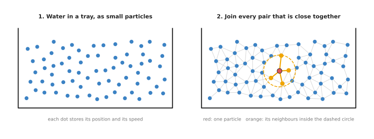
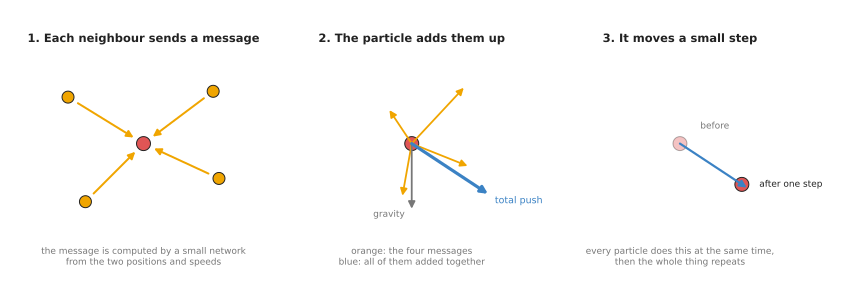
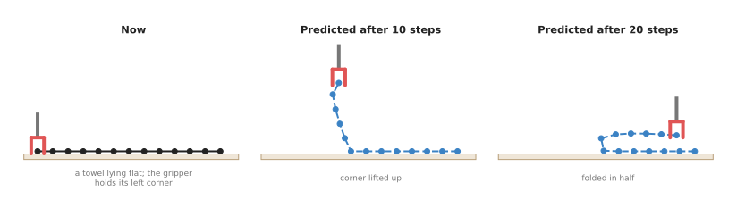

# Learned simulators

This page explains world models that predict how cloth, rope, dough, liquids
and sand move. Because these materials change shape as they move, a few numbers
cannot describe them. The page answers four questions: how a model can follow a
material that has no fixed shape, what happens inside such a model at each step,
where its training data comes from, and when it is better than a hand-written
physics simulator.

It is written for a reader who has already read the
[world models overview](../01_overview.md) and the page on
[learned dynamics models](../02_most-used/01_learned-dynamics-models.md), so you
should know what a state, an action and a rollout are. It also helps, but is not
needed, to have read
[point cloud models](../../04_3d-models/02_most-used/01_point-cloud-models.md),
because a learned simulator often starts from a point cloud.

## Contents

1. [What it is](#1-what-it-is)
2. [What goes in and what comes out](#2-what-goes-in-and-what-comes-out)
3. [How it works inside](#3-how-it-works-inside)
   · [Turning the material into a graph](#turning-the-material-into-a-graph)
   · [One step: passing messages](#one-step-passing-messages)
   · [Many steps](#many-steps)
4. [How it is trained](#4-how-it-is-trained)
5. [Well-known models of this kind](#5-well-known-models-of-this-kind)
   · [Interaction Networks](#51-interaction-networks)
   · [DPI-Net](#52-dpi-net)
   · [Graph Network-based Simulators (GNS)](#53-graph-network-based-simulators-gns)
   · [MeshGraphNets](#54-meshgraphnets)
   · [VCD](#55-vcd)
   · [RoboCraft and RoboCook](#56-robocraft-and-robocook)
   · [How to choose](#57-how-to-choose)
6. [A worked example: folding a towel in half](#6-a-worked-example-folding-a-towel-in-half)
7. [What goes wrong, and what people do about it](#7-what-goes-wrong-and-what-people-do-about-it)
8. [Why this kind, and what it costs](#8-why-this-kind-and-what-it-costs)
9. [The written alternative](#9-the-written-alternative)
10. [Where to read next](#10-where-to-read-next)

---

## 1. What it is

A learned simulator splits a material into many small pieces, and predicts
where each piece will move next from where its neighbours are.

A **simulator** is a program that calculates how things move, step by step, and
the simulators in Book 3, such as MuJoCo, are written by hand from the laws of
physics. A **learned** simulator does the same job, but a neural network works
out each step. That network learned how to do its job from examples of the
material moving.

Here is an everyday example of the same idea, using a crowd of people leaving a
stadium. Each person only looks at the few people right around them, so they
step forward when there is space and slow down when someone is close in front.
Nobody follows a plan for the whole crowd, and yet the crowd as a whole still
flows through the exits in a sensible way. A learned simulator works in the same
way, because each small piece of the material looks only at its close
neighbours, and the whole material then moves sensibly.

The small pieces are called **particles**, and what one particle stands for
depends on the material. For example, for water or sand each particle stands for
a small drop or a small pile of grains. Instead, for cloth each particle is a
point on the cloth, and neighbouring points are joined by threads in a grid,
called a **mesh**.

---

## 2. What goes in and what comes out

Now that the particles have a name, here is what actually passes in and out. A
learned simulator for a robot arm takes two things in and gives one back.

- **The particles now.** The position of each particle, and how fast it has
  been moving over the last few steps. A towel might be 200 particles, while a
  tray of water might be thousands.
- **What the arm is doing.** The gripper is usually added as a few extra
  particles whose movement is known, because the robot controls it.
- **The output: where every particle will be one small step later.** A step is
  usually a small fraction of a second.

On a real arm, the particles come from a **depth camera**, which measures how far
away each pixel is. That gives a **point cloud**, which is a set of 3D dots on the
surface of the material. The [3D models chapter](../../04_3d-models/01_overview.md)
explains point clouds in full, so this page takes them as given. The simulator then
uses a selection of those dots as its particles.

---

## 3. How it works inside

### Turning the material into a graph

The last section said what the particles are, so this section says what the
model does with them. The first step joins nearby particles together, and two
particles are joined if they are closer than a chosen distance, called the
**connection radius**. For cloth, the threads of the mesh are also kept as
joins.

The result is called a **graph**, which in this sense is not a chart. It is a set of
points, called **nodes**, and the lines that join them, called
**edges**. So a neural network that works on a graph is called a **graph neural
network**, or **GNN**.



The red particle is joined only to the orange ones inside the dashed circle, so
only those influence it.

Because particles move and their neighbours change, the graph is built again at
every step.

### One step: passing messages

Each step has three parts, and they happen to every particle at the same
time.

1. **Each neighbour sends a message.** A small network looks at a pair of joined
   particles: their positions and their speeds. It gives back a short list of
   numbers, called a **message**. You can think of the message as "how much this
   neighbour pushes or pulls on me". Nobody tells the network what the message
   should be, because it learns whatever numbers help the prediction.
2. **The particle adds up its messages.** It sums all the messages it received,
   and adds gravity.
3. **It moves a small step.** A second small network turns the sum into a change
   of speed, and the program adds that to the particle's speed and moves the
   particle.



So every particle does this at once, and then the whole process repeats for the
next step.

Parts 1 and 2 are usually repeated several times within one step before part 3.
Each repeat lets information travel one more join across the graph, so after ten
repeats a particle is influenced by particles up to ten joins away. This is how
a pull on one corner of a towel reaches the far corner.

The same small networks are used for every particle and every pair, and this is
the key idea of the whole design. The model learns one rule for "how neighbours
affect each other", and it does not learn a separate rule for every particle. So
a model trained on a small towel can often run on a bigger towel, which simply
has more particles.

### Many steps

To predict a whole fold or a whole pour, the simulator runs many steps in a row,
feeding each result back in. This is the rollout from the
[learned dynamics models](../02_most-used/01_learned-dynamics-models.md#many-steps-in-a-row)
page. So learned simulators often run hundreds of steps, because each step is short.
Errors add up here too, and section 7 says what people do about it.

---

## 4. How it is trained

The sections above described the model, and this section says where its examples
come from. A learned simulator needs examples of the material moving, with the
position of every particle at every step, and there are two places to get them.

The first place is a **hand-written simulator** that is very accurate but slow.
Engineers already have careful simulators for cloth, fluids and sand, and these
can take a long time to compute each step, but they give the exact position of
every particle. So the learned simulator watches thousands of runs and learns to copy
them: it predicts one step, is compared with the careful simulator's next step,
and is corrected.

The second place to get examples is the **real world** itself. The robot pokes,
pinches or lifts the material while a depth camera records it, and this teaches the
model the real material rather than a simulated one. However, it is harder, because a
camera cannot say which dot in one frame is the same bit of material as which dot in
the next frame. So the training compares the predicted shape with the real shape as a
whole: for each predicted dot, how far is the nearest real dot?

Because the data is cheap, training on simulated runs is common. Then a small
amount of real data is often added, so that the model matches the real
material.

---

## 5. Well-known models of this kind

The models below are all real, published models, and this section is here so that
you can pick one. It has to be plain about one thing first. Of all the model
families in this book, this is the one where the distance between a published
demonstration and a program you can run is widest. Most of what follows is
research code, two entries need a graphics-card library compiled from source
before anything starts, and only one is installed with `pip`.

Read the table one row at a time, and read the Size column carefully. Almost
nothing in this family publishes a parameter count or a memory requirement, so
you cannot work out what hardware you need by reading a paper. A cell says `not
stated` where the number is not published, rather than giving a guess.

| Model | How current | What it is best at | Size | Licence | Pick it when |
| --- | --- | --- | --- | --- | --- |
| [Interaction Networks](#51-interaction-networks) | historical | explaining how all the others work | not stated | no code was released | you want to understand the idea, not run it |
| [DPI-Net](#52-dpi-net) | historical | rigid, soft and liquid objects together | not stated | no licence file in either repository | you are reading a paper that compares itself with it |
| [GNS](#53-graph-network-based-simulators-gns) | most used in 2026 | water, sand and dough-like material | not stated; its datasets run from 2,000 to 14,000 particles | Apache-2.0 for the code; not stated for the datasets | your material has no fixed set of joins |
| [MeshGraphNets](#54-meshgraphnets) | most used in 2026 | cloth and anything else with a mesh | 15 message-passing blocks of 128 numbers in NVIDIA's defaults | Apache-2.0 for both implementations | you have a mesh and want maintained code |
| [VCD](#55-vcd) | historical | smoothing a crumpled cloth from one camera | not stated | MIT | the joins must be guessed from what the camera sees |
| [RoboCraft and RoboCook](#56-robocraft-and-robocook) | worth betting on | real dough and plasticine on a real arm | not stated | MIT | your material is real and nobody has measured it |

### 5.1 Interaction Networks

This model is **historical**, and it is here because every other model on this
page is a variation on it. Peter Battaglia and others at DeepMind published
[Interaction Networks for Learning about Objects, Relations and
Physics](https://arxiv.org/abs/1612.00222) in 2016. It predicts how a few objects
move by sending one message along each connection between a pair of them and then
adding up the messages each object received, which is the step that
[section 3](#one-step-passing-messages) described.

You would not choose it over GNS in [5.3](#53-graph-network-based-simulators-gns)
for real work, because GNS is the same idea with the extra parts that keep it
stable over hundreds of steps. The reason to read this paper first is that it has
only two small networks and nothing else, so every later model then reads as a
small change to something you already understand.

What it costs you is that no code was released with the paper, and DeepMind's
research repository lists its later graph simulators but not this one. You write
it yourself, which is reasonable, because the whole model is about fifteen lines.

The library that makes those fifteen lines possible is PyTorch Geometric, which
adds graphs to PyTorch, and you install it with
`pip install torch torch_geometric`:

```python
import torch
from torch_geometric.nn import MessagePassing, radius_graph


class ClothStep(MessagePassing):
    def __init__(self):
        super().__init__(aggr="add")            # each particle adds its messages up
        self.message_net = torch.nn.Sequential(
            torch.nn.Linear(12, 64), torch.nn.ReLU(), torch.nn.Linear(64, 32))
        self.update_net = torch.nn.Sequential(
            torch.nn.Linear(38, 64), torch.nn.ReLU(), torch.nn.Linear(64, 3))

    def message(self, x_i, x_j):                # x_i receives, x_j sends
        return self.message_net(torch.cat([x_i, x_j - x_i], dim=1))

    def forward(self, particles, edge_index):
        summed = self.propagate(edge_index, x=particles)
        return self.update_net(torch.cat([particles, summed], dim=1))


# 200 points spread over 20 cm of towel, each with 3 positions and 3 speeds
particles = torch.rand(200, 6) * 0.2
edge_index = radius_graph(particles[:, :3], r=0.03)   # joined if closer than 3 cm
change_in_speed = ClothStep()(particles, edge_index)
```

The library gave you two things.
[`radius_graph`](https://pytorch-geometric.readthedocs.io/en/latest/generated/torch_geometric.nn.pool.radius_graph.html)
rebuilds the graph from the current positions, and `aggr="add"` collects each
particle's messages. Notice that `message` is given the difference between the two
positions rather than the two positions themselves, so that the same rule works
anywhere on the table.

Everything else is yours to write. The two small networks start from random
numbers and know nothing until they are trained, as
[section 4](#4-how-it-is-trained) describes, and you still have to turn a point
cloud into `particles`, add gravity and the gripper, repeat the message step
several times before anything moves, and run many steps in a row for a whole
fold.

### 5.2 DPI-Net

This model is **historical**, and it is here because it is the step from
predicting a few objects to predicting a cloud of particles that a robot arm
pushes. Yunzhu Li and others published [Learning Particle Dynamics for
Manipulating Rigid Bodies, Deformable Objects, and
Fluids](https://arxiv.org/abs/1810.01566) at the International Conference on
Learning Representations in 2019. It handles rigid blocks, soft objects and water
in one framework and uses the learned model to plan how to manipulate them.

You would not choose it over GNS for new work, because GNS came later from the
same research line and is the design other papers now compare themselves with.
Its own authors replaced it as well, with
[VGPL-Dynamics-Prior](https://github.com/YunzhuLi/VGPL-Dynamics-Prior), which
they describe as adding noise to the particle positions during training for more
stable long rollouts. That is the fix
[section 7](#7-what-goes-wrong-and-what-people-do-about-it) describes, and here
you can see the setting that switches it on.

What it costs you is mostly the installation. The original repository needs
PyFleX, a particle simulator that has to be compiled against CUDA, so you need an
NVIDIA card. The successor can draw its predictions with VisPy instead, which is
an ordinary Python package. Neither repository has a licence file, so you cannot
tell what you are allowed to do with the code. The training data is two downloads
from Dropbox, of 1.14 GB and 2.9 GB.

The library is plain PyTorch, and the successor repository is the one to run,
because it ships a trained model and a small amount of validation data:

```sh
git clone https://github.com/YunzhuLi/VGPL-Dynamics-Prior.git
cd VGPL-Dynamics-Prior
# Rolls the shipped model forward on the demo data for a falling pile of rigid blocks
bash scripts/dynamics/eval_RigidFall_dy.sh
```

What you get is a working particle predictor and two scenes, which are falling
rigid blocks and a rope with a mass on the end. What you supply is your material,
your camera, and a way of turning a point cloud into the format its loader
expects. The settings are passed on the command line inside those shell scripts:
`--n_his 4` is how many earlier frames the model sees, `--augment 0.05` is the
size of the training noise described above, and `--vispy 1` turns on the drawing.

### 5.3 Graph Network-based Simulators (GNS)

This model is **most used in 2026** in the sense that matters when you read
papers, because it is the design new particle simulators compare themselves with.
Alvaro Sanchez-Gonzalez, Jonathan Godwin, Tobias Pfaff, Rex Ying, Jure Leskovec
and Peter Battaglia published [Learning to Simulate Complex Physics with Graph
Networks](https://arxiv.org/abs/2002.09405) at the International Conference on
Machine Learning in 2020. It learned water, sand and a sticky goo-like material
from a careful hand-written simulator, with one design and one set of settings for
all three.

You would choose it over MeshGraphNets in [5.4](#54-meshgraphnets) when your
material has no fixed set of joins. GNS takes a bag of particles and rebuilds the
graph from distances at every step, which is what water, sand and dough need,
because a grain of sand's neighbours change constantly. MeshGraphNets expects a
mesh whose joins stay the same. Cloth has one and a pile of sand does not.

What it costs you is a dead software stack. The reference code pins
`tensorflow>=1.15,<2`, which is TensorFlow 1, and lists the retired `sklearn`
package name, so you build a Python environment nothing else you own will share.
The datasets are TFRecord files. The repository's licence file is Apache-2.0, but
no licence is stated for the datasets, which are served from a Google Cloud
Storage bucket. The deeper cost is that the published model learned from a
hand-written simulator, so it knows a simulated material rather than a real one.

The library is not a library. It is a folder called
[learning_to_simulate](https://github.com/google-deepmind/deepmind-research/tree/master/learning_to_simulate)
inside DeepMind's research repository, which you clone and read:

```sh
git clone https://github.com/google-deepmind/deepmind-research.git
cd deepmind-research
pip install -r learning_to_simulate/requirements.txt   # pins TensorFlow 1.15
# WaterRamps is water poured over fixed ramps
bash ./learning_to_simulate/download_dataset.sh WaterRamps /tmp/datasets
python -m learning_to_simulate.train \
    --data_path=/tmp/datasets/WaterRamps --model_path=/tmp/models/WaterRamps
```

The download gives you more than particle positions. Each dataset carries a
`metadata.json` file stating the sequence length, the number of dimensions, the
box the material sits in, the default connection radius and the statistics used
to normalise the numbers. Those are the settings
[section 7](#7-what-goes-wrong-and-what-people-do-about-it) says decide whether
the model is useful, so that file is the fastest way to see sensible values.

What you supply, in practice, is a different implementation. Because TensorFlow 1
is no longer reasonable to install, people either rewrite the GNS design in
PyTorch using the step from [5.1](#51-interaction-networks), or take NVIDIA's
version described next, which trains on these same datasets. Use the DeepMind
folder as the specification and the datasets as training data.

### 5.4 MeshGraphNets

This model is **most used in 2026** and it is the one to start from, because it is
the only model on this page with a maintained implementation inside a library you
install with `pip`. Tobias Pfaff, Meire Fortunato, Alvaro Sanchez-Gonzalez and
Peter Battaglia published [Learning Mesh-Based Simulation with Graph
Networks](https://arxiv.org/abs/2010.03409) at the International Conference on
Learning Representations in 2021. It keeps the mesh's own edges as joins, so a
pull on one corner of a flag travels along the threads of the cloth rather than
through whatever happens to be nearby in space.

You would choose it over GNS whenever your material has a mesh, and cloth is the
case that matters for a robot arm. There is also a reason that has nothing to do
with physics. NVIDIA maintains a PyTorch implementation inside
[PhysicsNeMo](https://github.com/NVIDIA/physicsnemo) under Apache-2.0, with
current dependencies, while every other entry here is a research repository you
keep alive yourself.

What it costs you starts with the mesh, which has to exist, and a depth camera
does not give you one. DeepMind's own release is in GNS's state: it asks for
`tensorflow-gpu>=1.15,<2` and Python 3.6, and ships a complete pipeline for only
two scenes, `cylinder_flow` and `flag_simple`. NVIDIA's version is current but
assumes an NVIDIA card in several places. Its particle example sets the test
device to `cuda`, and its graph dependencies install as an extra, with
`pip install "nvidia-physicsnemo[cu13,gnns]"`.

The model is one class. This builds the network for one step of a towel and runs
it once:

```python
import torch
from torch_geometric.data import Data
from torch_geometric.nn import radius_graph
from physicsnemo.models.meshgraphnet import MeshGraphNet

# 200 points over 20 cm of towel, each with 3 positions and 3 speeds
particles = torch.rand(200, 6) * 0.2
edge_index = radius_graph(particles[:, :3], r=0.03)    # joined if closer than 3 cm
graph = Data(edge_index=edge_index, num_nodes=particles.shape[0])

# One feature per join: the offset from the sending particle to the receiving one
sender, receiver = edge_index
edge_features = particles[sender, :3] - particles[receiver, :3]

# The defaults are 15 message-passing blocks of 128 numbers, summed at each particle
model = MeshGraphNet(input_dim_nodes=6, input_dim_edges=3, output_dim=3)
change_in_speed = model(particles, edge_features, graph)   # one row per particle
```

Compare this with the code in [5.1](#51-interaction-networks) to see what the
library did. The fifteen repeats of the message step, the small networks that
encode the particles and the joins first, and the network that turns the result
back into three numbers are all inside `MeshGraphNet`, and the three sizes you
passed are the only shapes you had to get right.

What you still supply is the mesh and the training, because this network is
untrained and the numbers above are meaningless. NVIDIA ships a worked example for
this family at
[examples/cfd/lagrangian_mgn](https://github.com/NVIDIA/physicsnemo/tree/main/examples/cfd/lagrangian_mgn),
which trains it on the GNS datasets, and its configuration file holds real values:
five frames of movement history per particle, six kinds of particle, and twenty
training passes over the data.

### 5.5 VCD

This model is **historical**, and it is here because its one idea is reused by
every cloth system that came after it: model only the part of the cloth the camera
can see. Xingyu Lin, Yufei Wang, Zixuan Huang and David Held published [Learning
Visible Connectivity Dynamics for Cloth
Smoothing](https://arxiv.org/abs/2105.10389) at the Conference on Robot Learning
in 2021. It trains two networks. The first guesses which visible points are
joined, and the second predicts how the joined points move. Then it plans
pick-and-place moves that smooth a crumpled cloth.

You would choose this idea over MeshGraphNets when nobody can hand you the mesh.
MeshGraphNets needs the joins, including the ones under a fold, and a depth camera
cannot see under a fold. VCD builds its graph from the visible points and learns
the joins from training examples, which is the situation a real arm with one
overhead camera is always in.

What it costs you is the installation, and this is the step at which people stop.
VCD is a cut-down copy of a larger research framework and needs SoftGym, which
needs PyFleX compiled from source against CUDA. The licence is MIT, read from its
licence file, and the authors publish trained weights, so you can see it work
without training it.

The library is plain PyTorch, and the published planner runs from the command
line. The two paths are the two networks:

```sh
# vsbl is short for "visible": both networks work on visible points only
python VCD/main_plan.py --edge_model_path ./data/vcd_edge/vsbl_edge_120.pth \
                        --partial_dyn_path ./data/vcd_dyn/vsbl_dyn_120.pth
```

What you get is the whole published pipeline: the join-guessing network, the
movement network, the planner and the cloth scenes. What you supply is a real
camera and a real cloth, because all of the above runs inside the simulator the
paper used, and the authors did not publish the part that replaces the simulator's
point cloud with a camera's.

### 5.6 RoboCraft and RoboCook

These models are **worth betting on**, because they are the only entries here that
learned a real material from a real arm rather than from a hand-written simulator,
and that is where the argument for this family leads.
[Section 8](#8-why-this-kind-and-what-it-costs) says a learned simulator is worth
the trouble because nobody has measured a real towel's stiffness, weight and
friction. A model trained on a careful simulator has not avoided that problem,
because it inherited whatever numbers the simulator was given. A model trained on
recordings of real dough has.

Haochen Shi and others published [RoboCraft](https://arxiv.org/abs/2205.02909) in
2022 and [RoboCook](https://arxiv.org/abs/2306.14447) in 2023. Both learn a
particle model of elastic and plastic material from depth-camera recordings of a
real arm squeezing it. The RoboCraft paper states the figure that makes the case:
ten minutes of real interaction data was enough to learn a model that could shape
the material into target shapes it had not seen before. RoboCook uses several
tools in sequence and also learns to choose the tool, and its published
demonstration makes dumplings.

You would choose this over GNS when your material is real and unmeasured. GNS
learned from a simulator, so it knows a simulated material well. RoboCook learned
from a real gripper pressing real dough, and it is the only published recipe that
matches the situation of somebody with a real arm, a real soft material and no
measurements of it.

What it costs you is a different computer. The repository states its prerequisites
as Ubuntu 18.04 or 20.04, so a Mac will not do. The recorded data is on Google
Drive and downloaded by hand, and it is split per tool: there are seven dynamics
datasets, one per tool, and fifteen tools for the part that chooses between them.
That tells you the real cost, which is that you train one model per tool rather
than one model for the task. The licence is MIT, read from its licence file.

The library is plain PyTorch, driven by shell scripts:

```sh
git clone https://github.com/hshi74/robocook.git
cd robocook
git submodule update --init --recursive
conda env create -f robocook.yml && conda activate robocook
# Trains the particle model on the recorded real dough for one tool
bash scripts/dynamics/run_train.sh
```

What you get is the recorded real material, which is the expensive part you
cannot reproduce quickly, together with the model, the tool classifier and the
planner. What you supply is your own tool, your own camera and the calibration
between them. Read the top of `scripts/dynamics/run_train.sh` first, because every
setting is there and each one names the section of the paper it comes from. The
one to look at is `neighbor_radius=0.01`, which its own comment describes as the
radius used to connect edges in the graph, so for real dough the published value
is one centimetre.

### 5.7 How to choose

Start with MeshGraphNets through NVIDIA's PhysicsNeMo, because it is the only
model here that installs as a package and the only one somebody else is
maintaining.

Four things change that choice. If your material has no mesh, because it is water,
sand or dough, follow the GNS design instead: download the GNS datasets for their
metadata and their recorded positions, but build the model with PhysicsNeMo's
particle example rather than with DeepMind's TensorFlow 1 code. If your cloth is
crumpled and you have one overhead camera, take VCD's idea of guessing the joins
between visible points, which you will probably rewrite rather than install. If
your material is real, nobody has measured it, and you have a Linux machine with
an NVIDIA card, start from RoboCook, because it is the only entry whose training
data came from a real arm. If you only need to understand the family, read the
Interaction Networks paper and the fifteen lines in
[5.1](#51-interaction-networks), and stop there.

One more case changes the answer completely, and it is the most common one. If
your objects are rigid, or if the few numbers describing your material can be
measured, do not use any of these models.
[Section 9](#9-the-written-alternative) sets out that alternative, and it became
stronger during 2026 rather than weaker. MuJoCo 3.14.0, released on 22 September
2026, added an experimental contact mode called `ipc` that guarantees
penetration-free contact on deformable meshes, which is the failure that made
hand-written cloth simulation untrustworthy. Book 3's
[MuJoCo section](../../../03_frameworks/08_frontier/04_simulation-and-evaluation.md#21-mujoco)
also records the limits of that mode, and they are severe: those contacts are
frictionless, which rules out most grasping, and exact replay of a run is not
supported. So a written simulator is now the better choice for more cloth problems
than it was a year ago, and it is still the wrong choice for a towel you have to
grip.

---

## 6. A worked example: folding a towel in half

Here is how a learned simulator helps an arm fold a small towel, step by
step.

1. **See the towel.** A depth camera above the table gives a point cloud of the
   towel. The program picks about 200 of those dots as particles and joins
   neighbours into a mesh.
2. **Choose candidate moves.** A fold is a pick and a place: grab a point on the
   towel, lift it, and put it down somewhere else. The planner makes up many
   candidates, such as "grab the left corner and put it on the right corner".
3. **Simulate each one.** For each candidate, the learned simulator runs the
   gripper particles along the move and predicts the towel's shape at the end.
4. **Score each one.** The goal is a towel folded neatly in half, so the score
   compares each predicted shape with that goal shape.
5. **Do the best move.** The arm grabs the chosen corner and moves it.
6. **Look again.** The camera takes a new point cloud, and if the fold is not
   neat, the planner runs again from the real shape.



These are the simulator's predictions at three moments during one planned fold,
before the arm has moved at all.

In principle a hand-written simulator could do step 3 too. However, it would
need the towel's
stiffness, weight and friction, which nobody has measured. Instead, the learned
simulator learned how this kind of towel behaves from watching it.

---

## 7. What goes wrong, and what people do about it

The sections above described the model when it works. This section lists the
five things that go wrong in practice, and what people do about each one.

**Errors add up over hundreds of steps.** Water can slowly lose volume, and
cloth can slowly stretch. So people add small random changes to the particle
positions during training, and the model then learns to correct small errors
instead of making them bigger.

**The camera cannot see every part.** When a towel is folded, the bottom layer is
hidden under the top, and a point cloud shows only the top. So people keep track
of particles from earlier frames, or they model only what the camera can see, as
VCD does. The [shape completion](../../04_3d-models/03_also-used/01_shape-completion.md) page
covers guessing the hidden part of an object.

**Many particles make it slow.** A tray of water with thousands of particles and
hundreds of steps is a lot of work for every candidate move. So people use
fewer, larger particles and plan only a few candidate moves.

**Rigid objects need care.** A metal cup made of particles may slowly bend,
because nothing in the network forces it to stay rigid. So some models treat
rigid objects separately, and they move all of an object's particles together.

**New materials break it.** A model trained on cotton towels may not know how a
silk scarf moves. So people train on a range of materials, or they give each
particle a few numbers describing the material.

---

## 8. Why this kind, and what it costs

The last section listed what goes wrong, so this section weighs those problems
against the alternatives. The obvious alternative is a **hand-written simulator** for
cloth or fluids, and such simulators do exist and are very accurate, as long as they
are given the right material numbers. However, for a real towel or real dough nobody
knows those numbers, and the simulator also cannot easily start from a real point
cloud. A learned simulator instead starts from the point cloud and learns the real
material's behaviour, and it is often faster. Because it is a neural network, a
program can also work out how a small change in the move would change the result.
This lets a planner improve a move step by step, instead of only trying moves at
random.

The second alternative is a [video prediction model](01_video-prediction-models.md),
which also needs no material numbers of any kind. However, it predicts pictures, and a
picture of a towel does not say where each part of the towel is in 3D. A robot
needs 3D positions to grab a corner, and the particles of a learned simulator
give it those positions directly.

What it costs you:

- **A good 3D view.** You need a depth camera and a way to turn its point cloud
  into particles.
- **Training data for your material.** Usually a careful simulator and some real
  recordings.
- **Computing time.** Many particles and many steps for each candidate move.
- **Limited reach.** It knows the materials it was trained on, and it struggles
  with parts it cannot see.

---

## 9. The written alternative

This page has argued for learning the simulator, so the last question is when a
written one is enough. So the written alternative is a hand-written physics
simulator, given the right material numbers. Book 3's
[the simulators](../../../03_frameworks/08_frontier/04_simulation-and-evaluation.md#2-the-simulators)
describes the ones people run. Book 5's
[system identification](../../../06_programming-techniques/04_fitting-and-estimation/03_also-used/01_system-identification.md)
explains how to measure the numbers inside a physical model from the real thing. It
works when there are a few numbers, such as a joint's friction or a finger's
stiffness. That page itself notes that cloth, soft objects and tangled cables have no
small set of numbers that fits.

So the written simulator wins for rigid objects and for materials whose numbers are
known, while the learned simulator wins for a real towel or real dough. In both
cases, the planning in section 6 is written code, of the kind
[sampling-based optimisation and model predictive control](../../../06_programming-techniques/06_planning-and-search/03_also-used/02_sampling-based-optimisation-and-mpc.md)
explains.

---

## 10. Where to read next

- The [next page](03_latent-world-models.md) covers latent world models, which
  predict a short code instead of particles or pictures.
- [Point cloud models](../../04_3d-models/02_most-used/01_point-cloud-models.md) explain the 3D
  dots that a learned simulator starts from.
- [Scene reconstruction](../../04_3d-models/02_most-used/02_scene-reconstruction.md) covers
  building a whole 3D scene from pictures.
- [Touch sensing models](../../09_touch-and-body-models/03_also-used/01_touch-sensing-models.md)
  cover the sense that tells a gripper how soft a material is when it holds it.
- For the hand-written simulators that learned simulators are compared with,
  read Book 3's
  [simulation and evaluation](../../../03_frameworks/08_frontier/04_simulation-and-evaluation.md#2-the-simulators).
