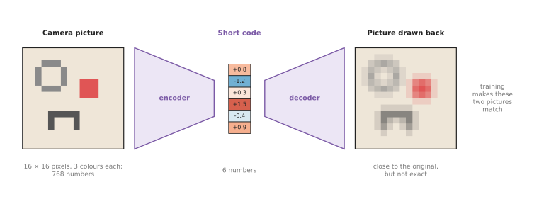
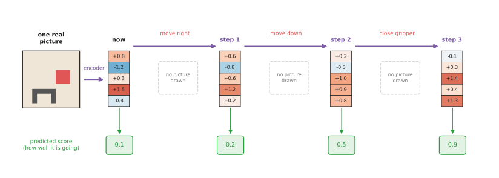
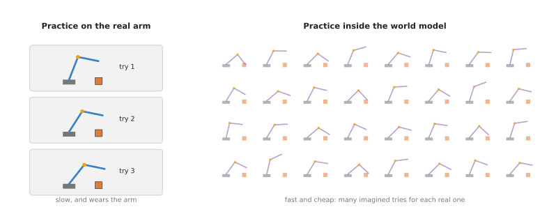

# Latent world models

This page explains world models that predict the future as a short code instead
of as a picture, and the best-known family of them is called Dreamer. The page
answers four questions: what the "short code" is and where it comes from, how a
robot can practise a task inside the model's predictions, how such a model is
trained, and why anyone would choose it over the other kinds of world model.

It is written for a reader who has already read the
[world models overview](../01_overview.md), the page on
[learned dynamics models](../02_most-used/01_learned-dynamics-models.md) and the
page on [video prediction models](01_video-prediction-models.md), so you should
know what a state, an action, a rollout and a policy are, because this page
joins ideas from both of those last two pages.

## Contents

1. [What it is](#1-what-it-is)
2. [What goes in and what comes out](#2-what-goes-in-and-what-comes-out)
3. [How it works inside](#3-how-it-works-inside)
4. [How it is trained](#4-how-it-is-trained)
5. [Well-known models of this kind](#5-well-known-models-of-this-kind)
   · [5.1 World Models](#51-world-models)
   · [5.2 PlaNet](#52-planet)
   · [5.3 DreamerV3](#53-dreamerv3)
   · [5.4 DayDreamer](#54-daydreamer)
   · [5.5 TD-MPC2](#55-td-mpc2)
   · [5.6 V-JEPA 2 and V-JEPA 2-AC](#56-v-jepa-2-and-v-jepa-2-ac)
   · [5.7 How to choose](#57-how-to-choose)
6. [Where to read next](#6-where-to-read-next)

---

## 1. What it is

A latent world model turns each camera picture into a short list of numbers,
called a **code**, and predicts how that code will change when the arm acts.

The word **latent** means "hidden", and the code is hidden in the sense that no
person chose what its numbers mean. Nobody decided that "number 3 is the cube's
position". Instead, the model found during training a set of numbers that keeps
what matters about the picture and drops the rest.

Here is an everyday example of the same habit. Imagine you are planning how to carry
a sofa up a narrow staircase. While you plan it, you do not picture every thread of
the sofa's fabric or the colour of the walls. Instead, you think about a few things
only: how long the sofa is, how wide the stairs are, and where the corner is. Then
you try out a few ways in your head before you lift anything. A latent world model
plans in the same kind of reduced description, because it keeps the things that
matter for the task and drops the rest.

This kind of model joins the two earlier pages together in one design. Like a
[learned dynamics model](../02_most-used/01_learned-dynamics-models.md) , it predicts
a short list of numbers, which is fast. Like a
[video prediction model](01_video-prediction-models.md) , it learns straight from
camera pictures, so nobody has to measure positions by hand.

---

## 2. What goes in and what comes out

Now that the code has a name, here is what actually passes in and out. A latent
world model for a robot arm has one input at the start, and after that it works
only with codes.

- **At the start: a camera picture.** For example, the picture from a camera
  above the table, showing the gripper, a cube and a bowl.
- **At each step: an action.** For example, "move the gripper 2 cm to the right".
- **At each step, it gives back the next code**, and also a **predicted score**:
  a number that says how well the task is going. The score is called the
  **reward**. For example, it could be 1 when the cube is in the bowl and 0
  otherwise.

The model can also turn a code back into a picture, so that a person can check
what it is thinking. However, it does not need to do that in order to plan or
practise.

A typical code has a few hundred to a few thousand numbers, which sounds like a
lot. However, a camera picture of 64 × 64 pixels, with 3 colours for each pixel,
is already 12,288 numbers, and real camera pictures are much larger than
that.

---

## 3. How it works inside

The last section said what passes in and out, so this section says what is
inside. A latent world model has four parts, and each one has a single job. The
first turns a picture into a code, the second predicts the next code, and the
third predicts the score. Then the fourth turns a code back into a picture, and it
is used mainly during training. The 2018 World Models paper in
[section 5.1](#51-world-models) is the clearest description of this arrangement,
and the shortlist keeps it for that reason rather than to run it. The entries you
would run rearrange these parts, and several of them leave one of the four out,
which this section points out as each part appears.

### Squeezing a picture into a code

The **encoder** is a network that takes a camera picture and gives back a short
code. The **decoder** is a network that does the opposite, because it takes a
code and draws a picture from it.

During training, the encoder and the decoder are joined together. The picture goes
into the encoder, the code goes into the decoder, and the picture that comes out is
compared with the one that went in. The training then makes the two pictures as close
as it can. The only way to do that is for the code to keep the important things about
the picture: where the gripper is, where the cube is, and whether the gripper is
open.



Here a picture of 768 numbers is squeezed into 6, and the picture drawn back is
close to the original but slightly blurred.

Once again, the drawing uses a tiny picture and a tiny code so that you can see
each part. Real codes are larger, as the last section said, but the idea behind
them is the same.

Two entries in the shortlist change this part. TD-MPC2, in
[section 5.5](#55-td-mpc2), has no decoder at all, so its code is trained only to
be good at predicting the score and the value of a state and never at drawing the
picture back. V-JEPA 2-AC, in [section 5.6](#56-v-jepa-2-and-v-jepa-2-ac), does
not learn the encoder from your robot's pictures at all, because it is trained on
a large amount of internet video before your robot has moved. DreamerV3, in
[section 5.3](#53-dreamerv3), is the entry that keeps the decoder, which is what
lets you draw what it imagined and look at it.

### Predicting the next code

The **dynamics part** is a network that takes the code now and an action, and gives
back the next code. This is exactly the learned dynamics model from the
[previous pages](../02_most-used/01_learned-dynamics-models.md#one-step) , working on
codes instead of measured positions.

Most latent world models also keep a **memory**, which is a second list of
numbers carried from step to step. That memory lets the model remember things
the current picture does not show, such as a cube the gripper is now hiding.

The **score part** is a small network that looks at a code and predicts the
reward. It lets the model say not only "what will the scene be?" but also "is
that good for the task?".

Once these parts are in place, the model can run forward on its own. It starts from
the code of one real picture, and then it predicts the next code for each
action, again and again, without drawing a single picture.



Only the first picture is real, and every later code and score is a prediction;
the numbers are made up to show the idea.

Predicting codes is much faster than drawing pictures, because a code has far
fewer numbers than a picture. So a small network can predict many steps in the
time a large video model takes to draw one frame, and that speed is what makes
the next idea possible.

### Practising inside the model

Because the model is fast, its predictions are sometimes called **imagination**,
or a **dream**. Those names only mean "a rollout that the model made up, not one
that happened". The key idea of the Dreamer family is that a policy can practise
inside this imagination, and it works in the three steps below. DreamerV3, in
[section 5.3](#53-dreamerv3), is the entry that does it, and DayDreamer, in
[section 5.4](#54-daydreamer), is the same idea split into two programs so that
it can run on an arm that cannot be hurried.

1. **Start from real moments.** Take codes from real pictures that the robot saw
   earlier.
2. **Imagine.** From each one, let the policy choose actions, and let the world
   model predict the codes and scores that follow, for a short stretch of steps.
3. **Improve the policy.** Change the policy so that it chooses actions that led
   to higher predicted scores.

Then a second small network helps with step 3, and it is called the **critic**. It
looks at a code and guesses the total score still to come from there. This lets
the policy learn from imagined stretches that are too short to reach the end of
the task.

Many of these imagined stretches can run in the time the real arm makes one
move. So the real arm is used only to collect new pictures now and then, and to
check that the policy works.

Practising is not the only use of a fast code. Instead of training a policy, a
program can search over sequences of actions inside the code before every move,
which is the planning on the
[learned dynamics models](../02_most-used/01_learned-dynamics-models.md#planning-with-it)
page with codes in place of measured positions. PlaNet, in
[section 5.2](#52-planet), does that and has no policy at all, and TD-MPC2, in
[section 5.5](#55-td-mpc2), searches in the same way before each move, which is
the model predictive control its name refers to.



Each real attempt feeds the world model, and the policy then practises many
times inside it.

---

## 4. How it is trained

The sections above described the parts, and this section says how they are
trained together. A latent world model learns from the robot's own recordings,
and each recording is a sequence of camera pictures, the action taken after each
one, and the reward at each step. Training then repeats a cycle of three
stages.

1. **Collect.** The robot tries the task on the real arm with its current
   policy, and records everything. At first the policy is random.
2. **Train the world model.** The encoder, decoder, dynamics part and score part
   all learn from the recordings. They learn to squeeze pictures, to draw them
   back, to predict the next code, and to predict the reward.
3. **Train the policy.** The policy and the critic practise inside the world
   model, as described above.

Then the cycle starts again, because the better policy collects more useful
recordings, which make the world model better, which in turn makes the practice
better.

The reward itself must come from somewhere, and that is easy in some places and hard
in others. In a simulator, a program can compute it exactly. On a real arm, however,
it might come from a sensor, from a person pressing a button, or from another model
that looks at the camera and says whether the task succeeded. The
[vision-language models](../../07_language-models/02_most-used/02_vision-language-models.md)
page describes models that can check success from a picture.

How much real data is needed depends on the task, but it is usually far less
than for a policy that learns without a model. That saving is the whole reason
for this kind of model.

---

## 5. Well-known models of this kind

The models below are all real, published models rather than examples invented
for this page, and this section is here so that you can pick one. The Dreamer
line is the reference point for the whole family, so three of the six entries
come from the group that built it and a fourth is a direct answer to it.

Read the table one row at a time. The left column names the model and says how
current it is. The right column holds the rest: what the model is best at, how
big it is, its licence, and when to pick it. The sizes are worth reading twice,
because the published numbers run from hundreds of parameters to hundreds of
millions, and the small numbers are not mistakes. The licences matter as much,
because two of these repositories have no licence file at all, which means you
have no stated permission to use the code. Where a number is not published, the
row says `not stated` rather than giving a guess.

| Model | What decides it |
| --- | --- |
| [**5.1 World Models**](#51-world-models), historical | It is best at showing the whole idea in three small parts. Its published parameter counts are 4,348,547 for the encoder and decoder, 422,368 for the predictor and 867 for the policy. The code repository has no licence file. Pick it when you want the shortest explanation of the design. |
| [**5.2 PlaNet**](#52-planet), historical | It is best at planning inside a learned code, with no policy anywhere. Its size is not stated, and the licence is Apache-2.0. Pick it when you want planning rather than a trained policy. |
| [**5.3 DreamerV3**](#53-dreamerv3), most used in 2026 | It is best at being one agent that works on many tasks without retuning. Its configuration blocks run from `size1m` to `size400m`. Its licence file holds the MIT licence text. Pick it when you want the complete reference agent. |
| [**5.4 DayDreamer**](#54-daydreamer), historical | It is best at learning on a real robot with no simulator. Its size is not stated, and it has no licence file. Pick it when you are wiring Dreamer to a real arm. |
| [**5.5 TD-MPC2**](#55-td-mpc2), most used in 2026 | It is best at continuous control, and it is the only entry with published checkpoints. Each single-task checkpoint holds 5 million parameters, and the 80-task agent holds up to 317 million. The licence is MIT. Pick it when you control an arm and want weights to start from. |
| [**5.6 V-JEPA 2 and V-JEPA 2-AC**](#56-v-jepa-2-and-v-jepa-2-ac), worth betting on | They are best at codes learned from internet video rather than from your own arm. The published ViT-L encoder holds about 326 million parameters. The licence is MIT. Pick them when you cannot record enough data of your own. |

### 5.1 World Models

This model is **historical**, and it is here because it is the clearest
description of the design that every later entry rearranges. David Ha and Jürgen
Schmidhuber published [World Models](https://arxiv.org/abs/1803.10122) in 2018,
at the Neural Information Processing Systems conference, under the title
"Recurrent World Models Facilitate Policy Evolution". It has exactly three parts:
a network that squeezes a game picture into a code, a network that predicts the
next code, and a policy that reads the code and acts. The policy was trained
entirely inside the model's own predictions, for a car racing game.

You would not run this instead of DreamerV3. The reason to read it anyway is the
parameter table on its
[project page](https://worldmodels.github.io/). The picture squeezer has
4,348,547 parameters, the predictor has 422,368, and the policy has 867. That
last number is the point of the whole paper. Because the code already contains
what matters about the picture, the part that chooses actions can be a few
hundred numbers, small enough to train with an evolutionary algorithm rather than
with gradients. No later entry on this page makes the case for a learned code as
plainly as that table does.

What it costs you is that the published code no longer runs. Its own notes pin
`gym 0.9.x`, say the experiments do not work on `gym 0.10.x`, and ask for
`numpy==1.13.3`. The repository has no licence file, so you have no stated
permission to reuse it. The original repository links to a later reimplementation
in TensorFlow 2.2 by Zac Wellmer at
[zacwellmer/WorldModels](https://github.com/zacwellmer/WorldModels), which runs in
a Docker container.

The library is TensorFlow 1, and the useful code sample is the installation,
because it tells you what you are taking on:

```sh
git clone https://github.com/hardmaru/WorldModelsExperiments.git
# The versions the repository asks for. Nothing newer works.
pip install gym==0.9.4 numpy==1.13.3
```

What you get is a record of an experiment rather than a tool. What you supply, if
you want the design, is an hour with the project page, which is an interactive
article holding the diagrams and that parameter table.

### 5.2 PlaNet

This model is **historical**, and it is here because it is the version of the
design with no policy in it, which makes one thing easy to see. Danijar Hafner,
Timothy Lillicrap, Ian Fischer, Ruben Villegas, David Ha, Honglak Lee and James
Davidson published [Learning Latent Dynamics for Planning from
Pixels](https://arxiv.org/abs/1811.04551) at the International Conference on
Machine Learning in 2019. PlaNet encodes the pictures it has seen into a code,
then searches over sequences of actions inside the code, executes the first
action of the best sequence it found, and plans again after the next picture.

You would choose PlaNet's approach over DreamerV3's when you do not want a
trained policy at all. Searching for actions at every step costs computing time
on the robot, but there is no policy to train and nothing that has to be
retrained when the task changes: you change the score and search again. The
search method is the cross-entropy method from the
[learned dynamics models](../02_most-used/01_learned-dynamics-models.md#planning-with-it)
page, so if you have read that page, PlaNet is that planner with a learned code
in place of measured positions.

What it costs you is speed at the moment of acting, and an old stack. Its
setup file pins `tensorflow-gpu==1.13.1` and `tensorflow_probability==0.6.0`, and
its README says the code was tested under Ubuntu 18, so treat it as a reference
rather than as a dependency. Its licence file is Apache-2.0. The deeper cost is this: a search that is free to propose any action sequence will find the model's mistakes
faster than a trained policy does.

The library is the repository, and one command trains an agent on one task:

```sh
# cheetah_run is a running task from the DeepMind Control Suite, learned from pictures
python3 -m planet.scripts.train --logdir /path/to/logdir --params '{tasks: [cheetah_run]}'
```

What you get is the planner, the model and a list of tasks in
`scripts/tasks.py` with their settings in `scripts/configs.py`. What you supply is
an environment of your own. Its README carries one warning worth repeating: it
prints `nan` as the score on iterations where it computed no summaries, which
looks like a broken training run and is not one.

### 5.3 DreamerV3

This model is **most used in 2026**, because it is the one complete agent in this
family that somebody else keeps running, and because the same settings work on
tasks that have nothing in common. Danijar Hafner, Jurgis Pasukonis, Jimmy Ba and
Timothy Lillicrap published it as [Mastering Diverse Domains through World
Models](https://arxiv.org/abs/2301.04104), and the
[repository](https://github.com/danijar/dreamerv3) cites the journal version as
having appeared in Nature in 2025. It is the model this page has been describing:
an encoder, a predictor, a score part, a policy and a critic, with the policy
practising inside the predictions.

You would choose it over TD-MPC2 in [5.5](#55-td-mpc2) when your robot sees
through a camera and you have no measured positions. DreamerV3 learns the code
from pictures and keeps a decoder, so you can draw what it imagines and look at
it.

What it costs you is that it is a research repository rather than a package, and
JAX. JAX is a numerical library that compiles Python for graphics cards, and you
install it before the requirements file. The repository says the code is tested on
Linux and macOS and needs Python 3.11 or newer, and `--jax.platform cpu` forces it
onto the central processor, so it will start on a Mac even though training it
there is not sensible. Its licence file holds the MIT licence text. What most
often goes wrong is the first item in its own tips: reusing an old log directory
with a changed configuration, which fails with a message about `PyTreeDef` that
says nothing about the cause.

The library is the repository, and these four commands train it on a computer
game:

```sh
git clone https://github.com/danijar/dreamerv3.git
cd dreamerv3
pip install -U -r requirements.txt            # after installing JAX, as its README says
# crafter is a small survival game; size12m is one of the model sizes it ships
python dreamerv3/main.py --logdir ~/logdir/dreamer/{timestamp} --configs crafter size12m
```

What you get is the whole agent and a list of model sizes you select by name,
from `size1m` to `size400m`, so you change how big the model is with one word
rather than by editing a network. All the options are in
`dreamerv3/configs.yaml`, including a `debug` block that shrinks everything so
that a run starts in seconds and learns nothing, which is the right way to check
your wiring.

What you supply is the robot. Every configuration it ships points at a game or a
simulated control task, so connecting it to an arm means writing an environment
class and a configuration block. That is the work the next sub-section
describes.

### 5.4 DayDreamer

This model is **historical**, and it is here because it is the proof that this
whole approach works on a real robot, with no simulator anywhere: that claim is
what you are relying on when you read the rest of this page. Philipp Wu,
Alejandro Escontrela, Danijar Hafner, Ken Goldberg and Pieter Abbeel published
[DayDreamer: World Models for Physical Robot
Learning](https://arxiv.org/abs/2206.14176) at the Conference on Robot Learning
in 2022. The published code ships commands for three machines: a four-legged A1
robot, an xArm and a UR5 arm.

You would read it rather than DreamerV3's own repository for one specific reason.
DreamerV3 assumes it can step an environment as fast as it likes, and a real arm
cannot be stepped faster than it moves. DayDreamer splits the agent into two
programs that run at the same time, an actor that moves the robot and stores what
happened, and a learner that trains from the stored data. That split is the piece
of engineering a real arm needs, and this repository is where it is written down.

What it costs you is that it is built on the previous generation. Its code is
TensorFlow 2 on top of DreamerV2, which the authors say to consult for anything
their README does not cover. It has no licence file, so you have no stated
permission to use it. Its commands assign the learner and the actor to different
graphics cards, although the arm commands put the actor on the central
processor.

The library is the repository, and an arm is run as two programs in two
terminals:

```sh
# Terminal 1, the learner: trains the world model and the policy from stored data
python embodied/agents/dreamerv2plus/train.py --configs xarm --run learning \
    --task xarm_dummy --tf.platform gpu --logdir ~/logdir/run1

# Terminal 2, the actor: moves the real arm and records what happened
python embodied/agents/dreamerv2plus/train.py --configs xarm --run acting \
    --task xarm_real --env.kbreset True --tf.platform cpu --tf.jit False --logdir ~/logdir/run1
```

Notice `--task xarm_dummy` on the learner and `--task xarm_real` on the actor.
The learner never touches the robot, so it is given a stand-in environment that
only tells it the shapes of the pictures and the actions. Notice also
`--env.kbreset True`, which lets a person at the keyboard say that the scene has
been reset, because a real cube does not put itself back on the table.

What you supply is the environment for your own arm and a reward you trust, and
the repository holds three worked examples of exactly that.

### 5.5 TD-MPC2

This model is **most used in 2026** for control from measured positions, because
it is the only entry here that publishes trained agents, so you can run one
before you have trained anything. Nicklas Hansen, Hao Su and Xiaolong Wang
published [TD-MPC2: Scalable, Robust World Models for Continuous
Control](https://arxiv.org/abs/2310.16828). It has no decoder at all. Its learned
code is trained only to be good at predicting the score and the value of a
state, never at drawing the picture back.

You would choose it over DreamerV3 when nothing in your task needs a picture
drawn. Dropping the decoder removes the failure where the model spends its effort on the colour of the table and misses a screw. The
practical reason is stronger than that one. Its authors publish more than three
hundred [trained checkpoints](https://www.tdmpc2.com/models) across four task
collections, including arm tasks from Meta-World and ManiSkill2, and the
repository states that one set of settings covers all 104 of its continuous
control tasks.

What it costs you is memory, and the decoder you no longer have. Its README is
specific: a graphics card and at least 12 GB of system memory for single-task
training, at least 8 GB of graphics memory recommended, 24 GB of graphics memory
to train the largest model, and 128 GB of system memory to train on the published
80-task dataset. The checkpoints come in sizes of 1, 5, 19, 48 and 317 million
parameters, where every single-task checkpoint is the 5 million one. Its licence
is MIT. What most often goes wrong is the installation of the task collections
rather than of TD-MPC2 itself, and the README says so about Meta-World, which
needs MuJoCo 2.1.0 and an old version of `gym`.

The library is the repository, and a downloaded checkpoint is evaluated in one
command:

```sh
# pick-cube is a ManiSkill2 arm task; single-task checkpoints are always model_size=5
python evaluate.py task=pick-cube checkpoint=/path/to/downloaded.pt save_video=true

# Training your own on the same task, from nothing
python train.py task=pick-cube
```

What you get is the model, the planner, the task wrappers and the weights. What
you supply is your own task, and the `envs` directory holds the examples to copy.
What you decide is whether your robot's state is measured or seen. The README
offers an `obs=rgb` argument for pictures on its DeepMind Control Suite tasks, but
pictures are the setting where DreamerV3 is the better-tested choice.

### 5.6 V-JEPA 2 and V-JEPA 2-AC

These models are **worth betting on** because of the constraint this page keeps
running into. V-JEPA 2
attacks that by learning its codes from a large amount of internet video before
your robot has moved at all, and that is the direction the field is going, because
video is the one kind of data that is plentiful. Meta published it in 2025 at
[facebookresearch/vjepa2](https://github.com/facebookresearch/vjepa2) under the
MIT licence, read from its licence file.

There are two models and the difference matters. V-JEPA 2 is a video encoder with
a predictor and no action in it, so it is not yet a world model for an arm.
V-JEPA 2-AC is the action-conditioned version, post-trained from the larger
V-JEPA 2 encoder on robot recordings, and its predictor takes the code, the action
and the arm's own pose.

You would choose it over DreamerV3 when you cannot record enough data yourself.
DreamerV3 starts from nothing and learns your task from your robot's own tries,
which is why it needs hours of them. V-JEPA 2-AC arrives already knowing how
objects move, and Meta's own description is that it solves manipulation tasks
without collecting data in your environment and without calibration.

What it costs you is size and the missing pieces. The published V-JEPA 2 encoder
on Hugging Face, [facebook/vjepa2-vitl-fpc64-256](https://huggingface.co/facebook/vjepa2-vitl-fpc64-256),
holds about 326 million parameters according to the file metadata Hugging Face
reports for it, and the action-conditioned checkpoint was trained from the larger
ViT-g encoder. The repository publishes the encoders and the predictor, and no
reward model, critic or policy for control, so the practising described in
[section 3](#practising-inside-the-model) is not available here at all. What this
model supports is planning, in the PlaNet sense of searching over action
sequences at every step.

The library is PyTorch Hub for the weights, and the repository for everything
else. Two lines fetch the action-conditioned world model:

```python
import torch

# Downloads a ViT-g encoder and the action-conditioned predictor trained on robot video
encoder, predictor = torch.hub.load("facebookresearch/vjepa2", "vjepa2_ac_vit_giant")

# codes: what the encoder returned for the frames the arm has already seen
# actions: seven numbers per step, of which the first three are the change in gripper position
# states: the arm's own pose at each step
next_codes = predictor(codes, actions, states)
```

Beyond the weights you also get a worked planner. The notebook
`notebooks/energy_landscape_example.ipynb` wraps the same encoder and predictor in
a small `WorldModel` class whose `infer_next_action` method searches for the best
action with the cross-entropy method, given a code for now and a code for the
goal. It is configured with `device="cpu"` and deliberately few search steps, so
it runs without a graphics card, which makes it the entry on this page most
likely to do something useful on a Mac.

What you supply is the reward or the goal picture, the loop that keeps calling
the planner, and the connection to your arm. One more thing is worth knowing
first. Book 3's
[world models that actually shipped](../../../03_frameworks/08_frontier/04_simulation-and-evaluation.md#44-world-models-that-actually-shipped-inside-policies)
records that when V-JEPA 2 reached a usable robot library, in LeRobot v0.6.0 in
July 2026, it was not used for planning. In the policy called VLA-JEPA the world
model trains the network and is then discarded, and nothing searches over
imagined futures while the robot acts. So the planning described here is
published and runnable, and it is not yet what the shipped systems do.

### 5.7 How to choose

Start with DreamerV3. It is the complete agent, the settings work without tuning,
and everything this page describes is in one repository.

Three things change that choice.

If your robot's state is measured numbers rather than camera pictures, use
TD-MPC2 instead, and start from one of its published checkpoints. Having weights
to evaluate on the first day is worth more than any architectural argument on
this page.

If you cannot record hours of robot data, use V-JEPA 2-AC, and accept that you
are writing the planner rather than training a policy. Its notebook runs on a
central processor, so this is also the entry to pick if you only want to see a
latent world model work before committing to one.

If you are putting any of them on a real arm, read DayDreamer first, whichever
model you chose. The split between an actor that moves the robot and a learner
that trains from stored data is not optional on hardware, and DayDreamer is where
it is written down.

Finally, a case that sends you off this page. If a few measured numbers describe
your task, and you can measure them, a learned code is not worth its cost.
---

## 6. Where to read next

- Go back to the [world models overview](../01_overview.md) for how the four kinds
  compare.
- [Reinforcement learning policies](../../06_movement-models/03_also-used/01_reinforcement-learning-policies.md)
  explain the trial-and-error learning that a latent world model speeds up.
- [Vision-language-action models](../../07_language-models/02_most-used/01_vision-language-action-models.md)
  explain the large robot policies that, in 2026, started to use world models
  as a training signal.
- [Learned arm models](../../09_touch-and-body-models/03_also-used/02_learned-arm-models.md)
  apply the world model idea to the arm's own body.
- For more depth, read Book 3's
  [learned methods for one arm](../../../03_frameworks/04_one-arm-training/03_learned-methods.md#2-learning-from-trial-and-error),
  which places Dreamer and TD-MPC next to the other ways an arm learns from
  trying, and
  [simulation and evaluation](../../../03_frameworks/08_frontier/04_simulation-and-evaluation.md#44-world-models-that-actually-shipped-inside-policies),
  which describes the latent world model VLA-JEPA and what it cannot yet do.
