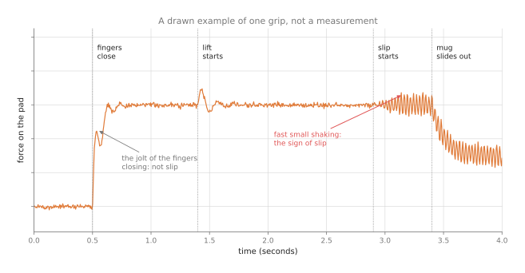
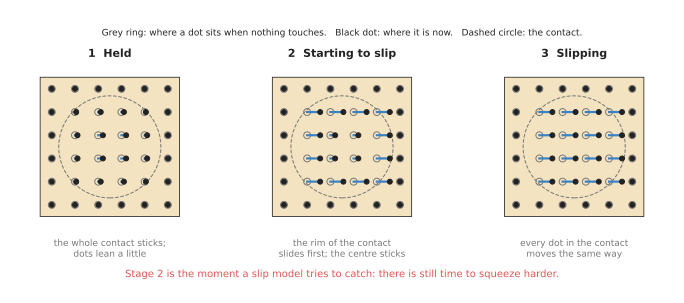
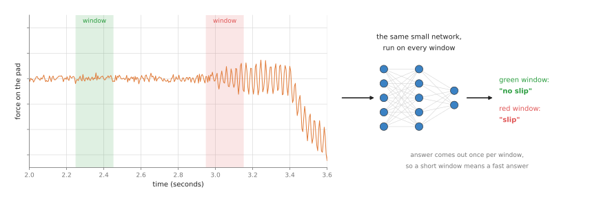

# Force and slip models

This page answers one question: how can a robot tell that an object in its fingers
is starting to slide out, early enough to do something about it? To answer that, it
explains the force signals a model reads, how a slip model works and is trained,
the models people have published, and why this job is harder than it looks.

It is written for a reader who has already read
[touch sensing models](../03_also-used/01_touch-sensing-models.md), because this page
uses the moving dots from its section 4.3. You should also know from
[how a model learns](../../01_what-models-are/02_how-a-model-learns.md) what it means
to train a model on examples.

> Before this page, it helps to have read [sensor
> streams](../../../06_programming-techniques/04_fitting-and-estimation/02_most-used/04_sensor-streams.md),
> which explains windows of readings, smoothing, rates of change and thresholds that
> do not flicker. A slip model reads the same kind of window.

## Contents

1. [What it is](#1-what-it-is)
2. [What goes in and what comes out](#2-what-goes-in-and-what-comes-out)
3. [What slip looks like in the signal](#3-what-slip-looks-like-in-the-signal)
4. [How it works inside](#4-how-it-works-inside)
5. [How it is trained](#5-how-it-is-trained)
6. [Well-known models](#6-well-known-models)
7. [A worked example: carrying a wet mug](#7-a-worked-example-carrying-a-wet-mug)
8. [What goes wrong](#8-what-goes-wrong)
9. [Why this rather than the obvious alternative, and what it costs](#9-why-this-rather-than-the-obvious-alternative-and-what-it-costs)
10. [The written alternative](#10-the-written-alternative)
11. [Where to read next](#11-where-to-read-next)

---

## 1. What it is

A slip model reads the force signals from a gripper over a short stretch of time
and says whether the held object is starting to slide.

Here is an everyday example of the same skill in a person. You carry a full glass of
water, and your hand is a little wet. You feel a tiny slide on your fingertips before
the glass moves far, so without thinking you squeeze a bit harder, and the glass
stays put. In other words, you did not wait to see it fall.

So a slip model tries to give a robot that same early warning. The word **slip** means
that the object moves relative to the fingers, and the useful moment to catch it is
the very start, which is called **incipient slip**. "Incipient" means just
beginning, and at that moment squeezing a little harder still works. However, a
second later the object is already on the floor.

This page also covers the wider family of **force models**, which do a related job.
These read force signals and say something else about the contact, such as how the
object is sitting in the fingers, or whether a part has clicked into place. However,
slip is the most common job, so the page uses it as the main example.

## 2. What goes in and what comes out

Now that slip has a name, here is what the model actually reads. The input is a
short window of recent sensor readings, where a **window** means the last few
tenths of a second of readings, taken together. Those readings can come from
several different sensors:

- A tactile sensor on the finger pad, as a short run of tactile pictures, or the
  positions of the printed dots in each picture.
- A force sensor on the finger pad, giving the push straight in and the push
  sideways at each moment.
- A force-torque sensor at the wrist, giving six numbers at each moment: a push
  along three directions and a twist about three directions.
- A small vibration sensor, called an accelerometer, near the finger.

Then the output is usually one of two things. The first is a yes-or-no answer,
"slipping" or "not slipping", and the second is a number between 0 and 1 that says
how likely a slip is. In the second case the program then compares that number with
a limit it chooses.

Some force models give other outputs, such as "the grasp will hold" or "the part is
seated", but they all work in the same way.

## 3. What slip looks like in the signal

The last section said what goes in and out, and this section shows what the signal
itself looks like. A slip leaves marks in the signal, and a slip model learns to
recognise them, so it is worth seeing those marks first.



The picture is a drawn example, not a real measurement, and it shows the force on
one finger pad during one grip. The force jumps when the fingers close, and it
wobbles briefly. Then it wobbles again when the lift starts, and after that it
holds steady. When the slip starts, a fast, small shaking appears, and then the
force drops as the mug slides out.

However, two things make slip hard to spot by eye, and by a simple rule. The first is
that the jolts from closing and lifting look a lot like the shaking from slip,
because both are quick changes. So a rule that says "a quick change means slip" fires
on every lift. The second is that the drop in force comes late, because by the time
the force has clearly dropped, the object is already sliding out.

But a tactile sensor shows slip in a second way, and this one comes earlier.



The picture shows the dots on a gel pad at three moments. While the object is held,
the dots in the contact lean a little, all together. When slip starts, the dots at
the rim of the contact slide first, while the dots in the centre still stick, and
the rim goes first because that is where the pressure is lowest. Once the object
slips fully, every dot in the contact moves the same way.

Stage 2 is the moment a slip model tries to catch, because the centre still holds
and there is still time to squeeze harder.

## 4. How it works inside

### 4.1 One window at a time

The last section showed what slip looks like, so this section says how a model
picks it out. A slip model does not read the whole grip at once. Instead, it reads
one short window at a time, and it moves the window forward as new readings
arrive.



The picture shows two windows on the same signal. The green one covers a steady
stretch, so the network says "no slip", while the red one covers the fast shaking,
so the network says "slip", and the same network runs on every window.

The steps are these:

1. The program keeps the last few tenths of a second of readings in memory.
2. It passes that window to the model.
3. The model gives back "slip" or "no slip", or a number for how likely a slip is.
4. The program acts on the answer, and the window moves on.

The window length is a choice with a cost attached to it. A short window gives an
answer sooner, but it holds less evidence, so the model makes more mistakes.
Instead, a long window is more reliable, but its answer comes later.

### 4.2 What kind of network

The window is the same idea for every sensor, but different signals suit different
networks.

For tactile pictures, the model often uses a **convolutional neural network (CNN)**
to read each picture, as in the
[touch sensing page](../03_also-used/01_touch-sensing-models.md#42-with-learning-a-network-reads-the-picture)
. A second part then looks at how the pictures change over the window. Then a common
choice for that second part is a **long short-term memory (LSTM)** network. An LSTM
is a network that reads a sequence one step at a time and keeps a short memory of
what it has read so far.

For a force signal, which is only a few numbers at each moment, a simpler network
is often enough, because it can read the window as one list of numbers. Some models
first turn the window into a set of frequencies, which shows the fast shaking of
slip more clearly. A network of this kind, trained on your own recorded windows,
is what [section 6.2](#62-a-small-network-of-your-own-on-the-raw-window) recommends.

Two other shapes are common enough that the shortlist later on this page recommends
both of them. The first is not a network at all. You reduce each window to a few
summary numbers yourself, such as its average and how much it wobbled, and you give
those numbers to an ensemble of decision trees, which is what
[section 6.1](#61-hand-made-features-and-a-tree-ensemble) recommends as the first
thing to try. The second starts from a model somebody else has already trained on a
very large number of unlabelled tactile pictures, and trains only a small part on top
of it to answer the slip question. That is what
[section 6.4](#64-sparsh-with-a-force-and-slip-head) recommends, with Sparsh as the
model you start from.

### 4.3 Joining touch with a camera

Some models also look at a camera picture of the object in the gripper. The camera
can see the object move a lot, while the tactile sensor can feel it move a little,
so together they catch more slips than either one alone. The clearest published
example of this is Making Sense of Vision and Touch, which learns one set of numbers
from a camera picture, the six wrist force-torque numbers and the joint readings at
once, and [section 6.5](#65-making-sense-of-vision-and-touch) describes it.

## 5. How it is trained

The last section described the network, and this section says where its examples
come from. A slip model learns from windows of readings that each have the right
answer, "slip" or "no slip", and getting those answers is the hard part.

So the usual way is to cause slips on purpose, many times over, and record them. A
robot grips an object gently and lifts it, or pulls it sideways, or tilts it, so
that some of those grips hold and some slip. For each window, someone then needs to
know whether a slip was happening, and people find that out in three ways:

- They watch the object with a camera and a tracking marker. If the object moves
  relative to the fingers, that window is marked "slip".
- They use the tactile dots. If the dots in the centre of the contact move, the
  object has slipped.
- They mark it by hand from a video. This is slow and it is done for small sets
  only.

Published slip data sets are small, and they are much smaller than the data sets
for camera models, because every example costs a real grip on a real robot. That is
one reason slip models often fail on objects unlike the ones they were trained
on.

## 6. Well-known models

Touch has fewer models you can download than any other area in this book, and the
sensor on your robot decides which of the few you can use at all. So this section is
organised by hardware. A force-torque sensor at the wrist, an optical gel sensor such
as GelSight Mini or DIGIT, an array of pillars, and a magnetic skin each lead to a
different answer, and for most of them the answer is that you train a small model of
your own.

Read the table one row at a time. The left column names the method and says whether a
developer starting today would reach for it. The right column holds everything else:
the sensor the method needs, what it is best at, how big the model is, its licence, and
the one case that should make you choose it. A cell says `not stated` where nobody has
published the figure. Where the licence is yours, the model comes out of your own
training run, so no licence restricts it.

| Model | What decides it |
| --- | --- |
| [**6.1 Features and a tree ensemble**](#61-hand-made-features-and-a-tree-ensemble), most used in 2026 | It works with any of the sensors above. It is best when you have a few hundred recorded grips. The size is yours to choose, and the licence is yours. Pick it for your first attempt, on any sensor. |
| [**6.2 A small network on the raw window**](#62-a-small-network-of-your-own-on-the-raw-window), most used in 2026 | It works with any of them, and with tactile pictures too. It is best when you have thousands of recorded grips. The size is yours to choose, and the licence is yours. Pick it when the tree ensemble has stopped improving. |
| [**6.3 GelSight's marker tracker**](#63-gelsights-own-marker-tracker-as-the-shear-signal), most used in 2026 | It needs a gel with printed dots. It is best at measuring the sideways pull, with no training, and it is not a learned model at all. The licence is GPL-3.0. Pick it when you own such a sensor and want the signal today. |
| [**6.4 Sparsh with a force-and-slip head**](#64-sparsh-with-a-force-and-slip-head), worth betting on | It needs a DIGIT, a GelSight'17 or a GelSight Mini. It is best at slip and three-axis force from few labels. There is a small backbone and a base one, and their parameter counts are `not stated`. The licence is CC BY-NC 4.0, with no commercial use. Pick it when you own one of those three, and sell nothing. |
| [**6.5 Making Sense of Vision and Touch**](#65-making-sense-of-vision-and-touch), historical | It needs a wrist force-torque sensor, a camera and the joint readings. It is best at a contact job with no slip labels at all. Its size is `not stated`, and its licence is MIT. Pick it when you want the idea and will retrain it. |

### 6.1 Hand-made features and a tree ensemble

This is the method **most used in 2026**, and it is not a published model at all. You
turn each window into a short list of summary numbers, and you give that list to an
ensemble of decision trees built one after another, each correcting the mistakes of
the ones before it. The summary numbers are ones you can say out loud: the average of
each axis, how much each axis wobbled, the largest change between two neighbouring
readings, and how much of the signal sits in the fast part. Veiga and colleagues
(2015) did this with random forests on a BioTac, a fingertip-shaped sensor filled with
fluid, and the shape of the answer has not changed since.

You would pick this rather than the obvious alternative, the neural network on the raw
window in section 6.2, because of how much data you have. A day of robot time buys a
few hundred deliberate slips, and with a few hundred examples a tree ensemble is
usually more accurate, because it has far fewer numbers to fit. It also trains in
seconds on a laptop with no graphics card, and it reports which feature it leaned on,
so a failure teaches you something about your sensor.

What it costs you is the features. You have to invent them, and a signal you did not
think to compute is one the model cannot see. The model itself runs on the ordinary
processor in well under a millisecond. The thing that most often goes wrong is not the
model but the test: if you split the windows at random, two windows one reading apart
land on opposite sides of the split, and the high score that follows means nothing.

The library is scikit-learn, whose own `COPYING` file is the BSD 3-Clause licence. The
class is
[HistGradientBoostingClassifier](https://scikit-learn.org/stable/modules/generated/sklearn.ensemble.HistGradientBoostingClassifier.html).

```python
import numpy as np
from sklearn.ensemble import HistGradientBoostingClassifier
from sklearn.model_selection import GroupKFold, cross_val_score

# Your own recording, already cut into windows: 20 readings of six wrist numbers
# each, one answer per window, and the number of the grip each window was cut from.
windows = np.load('slip_windows.npy')         # shape (number of windows, 20, 6)
answers = np.load('slip_answers.npy')         # shape (number of windows,), 0 or 1
grips = np.load('slip_grip_numbers.npy')      # shape (number of windows,)

def features(window):                         # one window: 20 readings by 6 axes
    step = np.diff(window, axis=0)            # how much each axis changed each reading
    return np.concatenate([window.mean(0), window.std(0),
                           np.abs(step).max(0), (step ** 2).sum(0)])

x = np.array([features(w) for w in windows])
model = HistGradientBoostingClassifier(max_iter=200)
# GroupKFold splits by grip, not by window, which is the correct split described above.
scores = cross_val_score(model, x, answers, groups=grips, cv=GroupKFold(5))
print('score on each held-back fifth of the grips:', scores)
model.fit(x, answers)                         # then train on everything and save it
```

scikit-learn builds the trees and scores the model five times over, so `max_iter` is
the only choice you make. What you supply is the three files, which means causing slips
on purpose and writing down what happened, as section 5 describes. The grip number is
the part people forget to record, and without it the split above is impossible.

### 6.2 A small network of your own on the raw window

This is also **most used in 2026**, by people who have collected thousands of grips,
and it is the only choice when the window holds pictures instead of numbers. The
network reads the window itself, with no features in between. For six wrist numbers,
two layers with a few dozen numbers in the middle is enough; for tactile pictures, the
arrangement is the one in section 4.2, which Li and colleagues introduced in
[February 2018](https://arxiv.org/abs/1802.10153) and released no code for.

You would pick this rather than the tree ensemble in section 6.1 for two reasons, and
only the second is certain. Once the training set runs into the thousands, the network
tends to find patterns you would not have thought to compute. And a gel picture has no
short list of hand-made numbers that captures it, so when the window holds pictures
there is nothing to compare against.

What it costs you is data, a graphics card if the window holds pictures, and any
explanation of why it answered as it did. The failure that matters most is the one in
section 8: the answer arrives after the mug has gone. A bigger network is slower and a
longer window delays the answer directly, so both have to be timed on the computer that
will sit next to the arm.

The library is PyTorch. This is the half that runs while the arm carries the mug.

```python
import collections

import numpy as np
import torch
from torch import nn

# The network you trained, rebuilt so the saved numbers fit into it.
net = nn.Sequential(nn.Linear(6 * 20, 32), nn.ReLU(), nn.Linear(32, 1))
net.load_state_dict(torch.load('slip_model.pt'))
net.eval()                               # switch off the parts that only train

window = collections.deque(maxlen=20)    # keeps only the last 20 readings
slipping = False

while carrying:
    window.append(read_wrist_force())    # your own driver, giving six numbers
    if len(window) < window.maxlen:
        continue
    # Transposed, because training laid each window out one sensor at a time, and
    # the same numbers in a different order are a different input to the network.
    x = torch.tensor(np.array(window).T.reshape(1, -1), dtype=torch.float32)
    with torch.inference_mode():         # nothing is learned here, so keep no gradients
        chance = torch.sigmoid(net(x)).item()
    # Two limits rather than one: the flag turns on above 0.8 and only turns off
    # again below 0.4, so it does not flicker while the number sits near a limit.
    slipping = chance > 0.4 if slipping else chance > 0.8
    if slipping:
        slow_down_and_squeeze_a_little_harder()
```

`net.eval()` and `torch.inference_mode()` between them switch off everything that
belongs to training, and the second also makes each answer faster. `torch.sigmoid` turns
the raw output into the number between 0 and 1 that section 2 described, and
`collections.deque` with a `maxlen` throws the oldest reading away by itself.

What you write yourself is `read_wrist_force`, which talks to your sensor, and
`slow_down_and_squeeze_a_little_harder`, which is the response that Book 3's
[holding on](../../../03_frameworks/02_gripping/05_holding-on.md#52-the-five-responses-in-order-of-cost)
page puts in order of cost. You also have to produce `slip_model.pt`, since there is no
slip model to download. What you decide is the two limits and the window length.

### 6.3 GelSight's own marker tracker, as the shear signal

This is **most used in 2026** by anyone who owns a gel sensor with printed dots, and
it contains no learning at all. GelSight's own software development kit,
[gsrobotics](https://github.com/gelsightinc/gsrobotics), finds the printed dots in the
first picture, fits them to a grid, and then follows each dot from one picture to the
next with the Lucas-Kanade method from OpenCV, which is a standard way of following a
small patch of picture as it moves. Section 4.3 of
[the touch sensing page](../03_also-used/01_touch-sensing-models.md#43-seeing-the-sideways-push)
describes what the dots do, and this is the code that measures it.

You would pick this rather than training a slip model on gel pictures, which is
section 6.4, because the dot movement is the slip signal itself. It is a measurement
rather than a prediction, so it cannot be confidently wrong about an object it has
never seen, and it needs no training set. The best arrangement is usually not either
alone: measure the dot movement here, then feed those numbers into section 6.1 as
features.

What it costs you starts with the licence. The repository is GPL-3.0, read from its own
licence file and recorded in the frameworks book's
[licence table](../../../03_frameworks/02_gripping/02_grippers-and-hardware.md#9-drivers-ros-2-packages-and-licences),
so linking it into a product obliges you to publish the source of the result. It needs
the dots, so a plain gel has nothing to track. It is limited by the camera, because
GelSight publishes 25 frames per second for the Mini, which makes one frame 40
milliseconds and that the soonest any movement can be seen. And the gel is a
consumable, rated by its maker for 1,000 coin presses.

```python
import cv2
import numpy as np
from utilities.gelsightmini import GelSightMini
from utilities.marker_tracker import MarkerTracker

camera = GelSightMini(target_width=320, target_height=240)  # the size in default_config.json
camera.select_device(0)
camera.start()

first = camera.update(dt=0.0)
tracker = MarkerTracker(np.float32(first) / 255.0)   # finds the dots, fits them to a grid
# The tracker reports each dot as (row, column); OpenCV wants (column, row).
start = tracker.initial_marker_center[:, ::-1].astype(np.float32).reshape(-1, 1, 2)
current, previous_grey = start.copy(), cv2.cvtColor(first, cv2.COLOR_RGB2GRAY)

while carrying:
    frame = camera.update(dt=1 / 25)
    grey = cv2.cvtColor(frame, cv2.COLOR_RGB2GRAY)
    moved, found, _ = cv2.calcOpticalFlowPyrLK(previous_grey, grey, current, None,
                                               winSize=(15, 15), maxLevel=2)
    shift = (moved - start)[found[:, 0] == 1]        # each dot's move since the first picture
    print('average dot movement in pixels:', np.linalg.norm(shift, axis=1).mean())
    current, previous_grey = moved, grey
```

gsrobotics gives you the two hard parts: `GelSightMini` opens the sensor as a camera
and hands back plain pictures, and `MarkerTracker` finds the dots and sorts them into
their grid. OpenCV does the following, and `found` tells you which dots it lost.

What you supply is the meaning, because nothing in the library says which average
movement means "slipping" for your gel, your objects and your squeeze. Finding that
limit is another set of deliberate slips, and section 3 is the reason to watch the dots
at the rim of the contact separately from the ones in the middle.

### 6.4 Sparsh, with a force-and-slip head

This one is **worth betting on** rather than most used, because one model that works
across sensors is the direction the field is going, and this one is held back by its
licence and by a measured failure rather than by its idea. Sparsh is a family of
self-supervised touch models from Meta's Fundamental AI Research group with Carnegie
Mellon University and the University of Washington, published in
[October 2024](https://arxiv.org/abs/2410.24090). It was trained on more than 460,000
unlabelled tactile pictures by hiding parts of a picture and asking the model to fill
them in. The repository also carries TacBench, six tasks of which two are exactly this
page's job, estimating three-axis force and detecting slip, and the labelled recordings
for both are released.

You would pick this rather than training your own network from scratch, which is
section 6.2, to save labels. Every slip label costs a real grip on a real robot, and
the paper reports that its self-supervised start beat training end to end for one task
and one sensor by 95.1 per cent on average across TacBench.

What it costs you is unusually specific, and all of it is checkable. The licence in the
repository's own `LICENSE.md` is Creative Commons Attribution-NonCommercial 4.0, which
forbids commercial use and covers the weights as well as the code. The repository is a
public archive, read only since February 2025. It works with three sensors, so any
other sends you back to section 6.1. Its own pretraining used eight A100 80GB graphics
cards, so only the head on top is realistically yours to train. And the failure has a
number: a study in [September 2026](https://arxiv.org/abs/2609.08673) reports a frozen
classifier on Sparsh scoring 6.86 per cent on a sensor it was not trained on, rising to
87.09 per cent once a tenth of the new sensor's recordings are labelled.

The repository is driven by configuration files rather than by Python you write.

```bash
# Train a head on your own labelled recordings, with the Sparsh backbone frozen.
python train_task.py --config-name=experiment/downstream_task/${EXPERIMENT} \
    paths=${YOUR_PATHS} wandb=${YOUR_WANDB}

# Or run the released normal-and-shear head live on one DIGIT, to see the signal.
python demo_forcefield.py +experiment=downstream_task/forcefield/digit_dino \
    paths=${YOUR_PATHS} paths.output_dir=${YOUR_PATH}/checkpoints/ \
    test.demo.digit_serial=D20001
```

The repository gives you the backbone, the training loop and the readers for its own
recordings. What you supply is a `paths` file saying where your data and checkpoints
live, the downloaded weights, and, past the demo, your own labelled grips in the layout
its readers expect. The serial number in the last line is printed on the back of the
DIGIT.

### 6.5 Making Sense of Vision and Touch

This is **historical**, and it is kept because it is the clearest small example of the
trick section 6.4 scales up. Lee and colleagues at Stanford's Interactive Perception
and Robot Learning lab published it in
[October 2018](https://arxiv.org/abs/1810.10191). It learns one set of numbers from
three inputs at once: a camera picture, the six wrist force-torque numbers, and the
arm's joint readings. It is trained with no labels, on made-up questions such as
whether the gripper will touch something in the next step. A controller then learned to
fit a peg into a hole from those numbers.

You would read this rather than section 6.4 for two reasons. Its
[code](https://github.com/stanford-iprl-lab/multimodal_representation) is MIT, read
from the repository's own licence file, so unlike Sparsh you may use it commercially.
And it works from a wrist force-torque sensor, which most arms already have, rather
than from a gel sensor you would have to buy.

What it costs you is everything except the idea. There are no weights for your robot,
the released recordings are one robot doing one task, and training needs a graphics
card. The part that most often goes wrong is the made-up question, because "will the
gripper touch something next" teaches nothing unless your recordings contain attempts
that miss.

```bash
cd multimodal/dataset && ./download_data.sh      # their own recordings, not yours
python mini_main.py --config configs/training_default.yaml
```

Those recordings are worth looking at even if you train nothing, because they show the
shape this page describes: each step carries a window of 50 readings of the six wrist
numbers, a camera picture, the joint readings, and whether there was contact. To use
this on your own robot you have to produce a recording in that same shape, which is the
work in section 5.

### 6.6 How to choose

Start with section 6.1, hand-made features and a tree ensemble, on whatever sensor you
already own. It costs a day of robot time, and it answers the question that comes
before every other one: is the slip visible in my signal at all?

Five things change that choice.

- **You own a gel sensor with printed dots.** Measure the dot movement with section
  6.3, then put those numbers into section 6.1 as features rather than choosing one.
- **Your window holds pictures, or you have thousands of grips.** Then section 6.2.
- **You own a DIGIT, a GelSight'17 or a GelSight Mini, and sell nothing.** Then section
  6.4, which reaches a usable answer from far fewer labelled grips.
- **You sell something, and your sensor is camera-based.** Then use T3 instead of
  Sparsh, because it is MIT rather than non-commercial and was trained across thirteen
  sensors.
  [The touch sensing page](../03_also-used/01_touch-sensing-models.md#65-transferable-tactile-transformers-t3)
  describes it.
- **You own a magnetic skin**, such as AnySkin or eFlesh, both MIT. Five magnetometers
  give fifteen numbers, which is force and shear rather than shape, and those fifteen
  numbers go straight into section 6.1 with no change.

One thing should not change it. If you would rather buy the answer than train it, there
is exactly one sensor that works out slip onset in its own controller, Contactile's
PapillArray, described in the frameworks book's
[tactile sensing at the contact](../../../03_frameworks/02_gripping/02_grippers-and-hardware.md#82-tactile-sensing-at-the-contact).
Its maker publishes neither a price nor a slip-detection delay, and a search of GitHub
for its name in October 2026 returns two small research repositories, the larger with
three stars. So even the bought answer leaves you writing the software side yourself.

## 7. A worked example: carrying a wet mug

Here is one grip on a wet mug from start to finish. A two-finger gripper with a gel
sensor on each pad carries a mug that has just come out of a sink, and the outside
is wet, so the friction is low.

1. The fingers close, and the tactile model says the contact is centred. The program
   then reads the weight from the wrist sensor and chooses a gentle squeeze.
2. The arm lifts, and the slip model sees a jolt in the force. Because it has seen
   many lift jolts in training, it says "no slip".
3. The arm starts to move the mug sideways, and that movement adds a sideways push.
   So the dots at the rim of the contact start to slide, and the slip model gives a
   high number for slip.
4. The program responds. It first slows the arm down, because the slip started when
   the arm sped up. It also squeezes a little harder, after checking that the new
   force is still below the most the mug can take.
5. The dots stop sliding, so the slip model's number drops, and the arm carries on
   more slowly.

Without the model, the first sign of trouble would be the mug hitting the floor. The
order of the responses in step 4 comes from Book 3's
[holding on](../../../03_frameworks/02_gripping/05_holding-on.md#52-the-five-responses-in-order-of-cost)
, which lists the responses from cheapest to most expensive.

## 8. What goes wrong

The sections above described this kind of model at its best. This list gives the
five things that go wrong in practice, and what people do about each one.

- **Jolts that look like slip.** Closing, lifting and stopping all shake the
  signal, so a model that has not seen enough of them calls them slip. People
  therefore add many jolt examples to the training set, all marked "no slip".
- **Objects unlike the training set.** A slip on soft foam looks different from a
  slip on glass, so a model trained on hard objects may miss slips on soft ones.
  People therefore train on as wide a range of surfaces as they can.
- **Watching the wrong sensor.** A slip model reading the gripper's finger position
  cannot see an object sliding down between the pads, because the gap between the
  fingers does not change. It also cannot see an object turning between the pads.
  [Holding
  on](../../../03_frameworks/02_gripping/05_holding-on.md#41-the-finger-gap-check-and-what-it-cannot-see)
  explains why. No amount of training fixes a sensor that cannot observe the event,
  so people use shear, vibration or a wrist torque reading instead.
- **Too slow to help.** If the model needs a long window, or runs on a slow
  computer, the answer may come after the object has gone. So people measure the
  time from slip to answer on the real robot, and not only the accuracy.
- **Missing readings.** If the sensor stops sending readings, a careless program
  treats the silence as "no slip". A missing reading must be treated as unknown,
  and the program should stop or refuse, as [never fall back
  silently](../../../03_frameworks/02_gripping/05_holding-on.md#9-never-fall-back-silently)
  explains.

## 9. Why this rather than the obvious alternative, and what it costs

The last section listed what goes wrong, so this section weighs those problems
against the alternatives. The obvious alternative is **a fixed rule on the force
signal**, for example "if the sideways force is more than half the straight-in
force, call it slip". This rule comes from the simple physics of friction, so it
needs no data, it is easy to check, and it is right for many rigid objects.
However, it needs the friction number of the pad and the object together, which you
rarely know and which changes when the surface is wet or dusty. It also cannot tell
a jolt from a slip.

A second alternative is **a second look with a camera** after the grip. After the
lift, a wrist camera takes a picture and checks that the object has not moved, and
this needs no extra hardware and catches every kind of movement. However, it only
works after the movement has happened, so it cannot catch a slip in time to stop it.

So a learned slip model is worth it when the rule fails because friction is unknown
or changing, and when the answer is needed before the object moves far. Wet, oily,
dusty or unfamiliar objects are the main cases.

What it costs you:

- A sensor that can see slip, which means a tactile sensor, a fast force sensor on
  the pad, or a vibration sensor, because the gripper's own finger position is not
  enough.
- A training set of deliberate slips, which takes many hours of robot time.
- Your own software, since there is almost none to download.
- Testing for speed on the real robot, not only for accuracy.
- No guarantee. The model can miss a slip it has never seen. A program should
  still confirm, with the wrist sensor, that the object has the expected weight
  before a long carry.

## 10. The written alternative

This page has argued for learning the model, so the last question is when a written
rule is enough. The written alternative is the fixed rule in section 9, built with
the tools in Book 6's
[sensor streams](../../../06_programming-techniques/04_fitting-and-estimation/02_most-used/04_sensor-streams.md)
. That page shows how to smooth a force reading, find how fast it is changing, and
turn it into a flag that does not flicker on and off. Book 3's
[slip, and the checks that cannot fire](../../../03_frameworks/02_gripping/05_holding-on.md#4-slip-and-the-checks-that-cannot-fire)
explains which sensors can see slip at all.

The written rule wins for rigid objects with a known, steady friction, because it
needs no data and is easy to check. The slip model wins when the friction is unknown
or changing, as with wet, oily or dusty objects.

## 11. Where to read next

In this chapter:

- [Touch sensing models](../03_also-used/01_touch-sensing-models.md) explain the tactile pictures
  and dots this page reads.
- [Collision and failure detection](02_collision-and-failure-detection.md) covers
  what to do when a pick has already failed.

In this book:

- [Reinforcement learning policies](../../06_movement-models/03_also-used/01_reinforcement-learning-policies.md)
  are often trained with force readings as an input, for jobs such as fitting a peg
  into a hole.
- [Tracking and motion](../../03_seeing-models/03_also-used/03_tracking-and-motion.md) explains how
  a camera model follows an object from one picture to the next, which is the
  camera side of a second look.

In the other books:

- [Slip, and the checks that cannot
  fire](../../../03_frameworks/02_gripping/05_holding-on.md#4-slip-and-the-checks-that-cannot-fire)
  in the frameworks book covers what sees slip and what does not.
- [Conditioning a force or contact
  reading](../../../02_perception/02_object-perception/02_sensors.md#26-conditioning-a-force-or-contact-reading)
  in the perception book explains how to clean up a noisy force signal before
  anything reads it.
