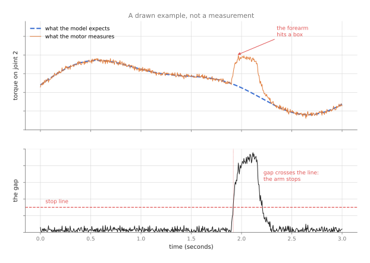
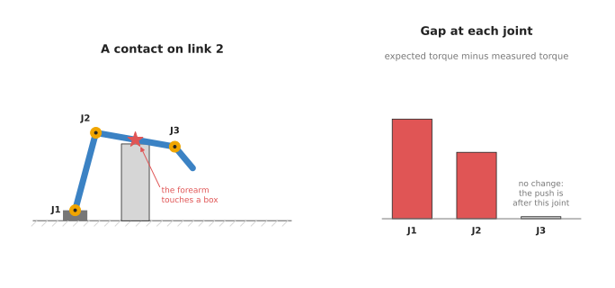
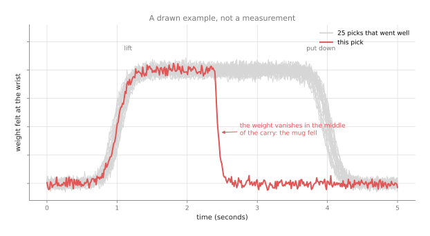

# Collision and failure detection

This page answers two related questions about noticing trouble. The first is how a
robot arm notices that it has bumped into something it should not have touched. The
second is how it notices that a task has gone wrong, such as a mug dropped halfway
through a carry. To answer both, the page explains the simple method most arms
already use, where a learned model improves on it, and where a learned model must not
be trusted on its own.

It is written for a reader who has already read the
[overview of this chapter](../01_overview.md), and it also helps to have read
[how a model learns](../../01_what-models-are/02_how-a-model-learns.md). You do not
need to know any physics beyond this: a motor that has to push harder uses more
electric current.

> Before this page, it helps to have read [arm
> dynamics](../../../06_programming-techniques/07_control-and-motion/02_most-used/03_arm-dynamics.md),
> which works out the torque each joint should need, and [sensor
> streams](../../../06_programming-techniques/04_fitting-and-estimation/02_most-used/04_sensor-streams.md),
> which turns a noisy reading into a clean alarm. This page uses the first as the
> expected torque and the second to raise the alarm.

## Contents

1. [What it is](#1-what-it-is)
2. [What goes in and what comes out](#2-what-goes-in-and-what-comes-out)
3. [How it works inside](#3-how-it-works-inside)
4. [How it is trained](#4-how-it-is-trained)
5. [Well-known methods and models](#5-well-known-methods-and-models)
6. [Where this is going](#6-where-this-is-going)
7. [Where to read next](#7-where-to-read-next)

---

## 1. What it is

A collision detector compares what the arm's sensors measure with what they should
measure, and raises an alarm when the two differ too much. A failure detector does
the same for a whole task.

Here is an everyday example of the same comparison. You walk through a dark room
you know well. So you expect the floor to be flat and the path to be clear. If your
shin meets a chair, you feel a push you did not expect, and you stop at once. So you
did not need to see the chair at all. Instead, you noticed that what you felt was
different from what you expected.

So a robot arm can do the same thing. It knows what torque each joint should need to
follow its planned path, where a **torque** is a turning force, the force that
turns a joint. So if something pushes on the arm, the joints need a different
torque from the one expected, and that difference is the signal.

This page covers two jobs that use this same idea:

- **Collision detection** notices unexpected contact on the arm's body, within a
  few thousandths of a second, so the arm can stop or yield.
- **Failure detection** notices that a task has gone wrong: the object was not
  picked, it was dropped, or it was placed in the wrong spot. This can take longer,
  from a fraction of a second to a few seconds.

## 2. What goes in and what comes out

The last section said what the signal is, so this section lists the readings that
carry it. For collision detection, the inputs are the arm's own joint readings over
the last moment:

- The angle of each joint, from its **encoder**, which is the sensor that measures a
  joint's angle.
- The speed of each joint.
- The electric current in each motor, or the torque from a torque sensor in each
  joint, on arms that have one.
- The commands the controller sent.

The output is "collision" or "no collision", often with a number that says how sure
the model is, and some methods also say which part of the arm was hit.

For failure detection, the inputs are wider than that. They can include the wrist
force, the gripper's finger position, tactile readings, and pictures from a camera.
The output is "the task is going normally" or "something is wrong", and sometimes
also the kind of failure.

## 3. How it works inside

### 3.1 The gap between expected and measured

The last section listed the readings, and this section says what is done with them.
The core idea is the same for the simple method and for most learned ones. Two
numbers are compared, and the difference between them is called the **residual**,
where "residual" means what is left over.

1. Some model predicts the torque each joint should need right now, given its
   angle, its speed and how fast it is speeding up.
2. The sensors measure the torque each joint actually uses.
3. The program subtracts one from the other.
4. If the difference stays near zero, all is well. If it jumps above a limit, the
   program reports a collision and the arm stops.



The picture is a drawn example, not a real measurement. The top half shows the
expected torque on one joint as a dashed line, and the measured torque as a solid
line, and they match closely until the forearm hits a box. The bottom half shows
the gap between them, and when that gap crosses the stop line, the arm stops.

This subtraction, with the textbook physics in step 1, is the method
[section 5.1](#51-the-momentum-observer-with-a-textbook-physics-model) recommends for
noticing contact, and it contains no learning at all. That is worth saying plainly,
because it is the method almost every arm already runs.

So the quality of the whole method depends on step 1. If the prediction is poor, the
gap is never near zero, even with no collision. Then the stop line has to be set
high, and gentle collisions are missed. This is where learning helps most, because
a learned model can predict the expected torque better than the textbook physics
can. It manages that by learning the friction and other effects the textbook leaves
out, and the [learned arm models](../03_also-used/02_learned-arm-models.md) page
explains how.
[Section 5.2](#52-a-learned-torque-model-behind-the-same-limit) recommends exactly
that. It keeps the whole of section 5.1 and replaces only its prediction.

### 3.2 Where the arm was hit

Besides saying that something was hit, the residuals at all the joints also say
roughly where the contact was.



The picture shows a three-joint arm whose forearm touches a box. Because a push on
the forearm turns the joints between the base and the forearm, those joints show a
gap. However, it cannot turn the joint beyond the forearm, so that joint shows no
gap. This means the last joint with a gap tells you which part of the arm was
hit.

### 3.3 Learned collision detectors

A learned collision detector either skips the explicit subtraction or adds to it.
It is a network that reads a short window of joint readings and outputs "collision"
or "no collision", where a window means the last few hundredths of a second of
readings taken together.

Then the network learns patterns that a single limit cannot. For example, a fast
movement makes a large gap for a moment, and so does a hard stop, while a gentle
bump makes a small gap with a particular shape over time. So a network trained on
many examples of both can tell them apart better than one fixed stop line can.

The best-known detector of this kind is CollisionNet, and
[section 5.3](#53-collisionnet-a-classifier-that-reads-the-window) describes it. That
section also says why most arms keep the subtraction of section 3.1 anyway, which is
that this network has to be trained on real collisions somebody caused on purpose.

### 3.4 Learned failure detectors

However, a failure detector usually watches a whole task rather than one moment,
and there are two common ways to build one, with a third for an arm that a learned
model drives.

The first way learns what a normal run looks like, from many runs that went well.
Then it flags any run that looks different. This is called **anomaly
detection**, where "anomaly" means something unusual. It needs no examples of
failures at all, which is its great advantage, because failures are rare.



The picture is a drawn example, not a real measurement. It shows the weight felt at
the wrist during 25 picks that went well, as grey lines. Those lines form a narrow
band, because the weight rises at the lift and falls at the put-down. One pick, in
red, leaves the band halfway through the carry, because the weight vanished when
the mug fell. So an anomaly detector learns the band and flags any run that leaves
it.

A common network for this is an **autoencoder**, which is a network trained to
squeeze its input down to a few numbers and then rebuild the input from them. It
learns to rebuild normal runs well, so when it is shown an odd run, it rebuilds
that run badly. This means a bad rebuild is a sign that the run is unusual.

[Section 5.4](#54-an-anomaly-detector-trained-on-good-runs-only) recommends this way
for the second job on this page. The published work it names is an autoencoder of the
kind just described. However, the version most people start with is simpler, and it is
a few hundred small decision trees on a handful of summary numbers describing each run.

The second way instead trains a model on labelled examples of success and failure. A
**vision-language model** is a model that reads a picture and answers a question
about it in words, so it can look at a picture after a task and answer "did the mug
end up on the shelf?" The
[vision-language models](../../07_language-models/02_most-used/02_vision-language-models.md)
page covers this.
[Section 5.5](#55-a-vision-language-model-as-the-judge-of-a-finished-attempt) recommends
a model of this kind as the judge of a finished attempt.

The third way watches neither the sensors nor the finished picture. It watches the
model that drives the arm, and it reports trouble when that model's own output stops
making sense, which can happen before the forces or the positions look unusual. This way
exists only for an arm driven by a learned model, and
[section 5.6](#56-sentinel-for-an-arm-driven-by-a-learned-policy) recommends Sentinel
for it.

## 4. How it is trained

The last section described the detectors, and this section says where their
examples come from. For a learned collision detector, you need windows of joint
readings marked "collision" or "no collision".

The "no collision" examples are easy to get in bulk. You run the arm through many normal
movements at many speeds, with and without loads in the gripper, and record
everything.

The "collision" examples are harder, because you have to hit things on purpose.
People push the arm by hand at different places, or let it move into soft padded
objects at low speeds, and each contact is marked from the time it happened.
Because this is slow and needs care, collision sets are much smaller than
normal-motion sets.

For an anomaly detector, you need only normal runs. You record the task many times
while it succeeds, and you train the model to rebuild those runs. Then you set the
alarm limit using a separate batch of normal runs, so that normal variation does
not trigger it.

For a success detector that uses a camera, you need pictures of finished tasks
marked "success" or "failure". People often collect these for free, because a robot
cell that is already running records its own results.

## 5. Well-known methods and models

This section names the methods people actually use, and it keeps this page's two jobs
apart, because the honest answer is different for each. For noticing that the arm has hit
something, the method used almost everywhere is not a learned model at all. It is a limit
on the difference between the torque the physics expects and the torque the motors
measured, which is the subtraction in section 3.1, and learning helps there only by making
the expected torque more accurate. For noticing that a whole task has failed, learned
models have arrived properly, and the last three entries below are all of that kind.

Read the table one row at a time. The left column names the method and says whether a
developer starting today would reach for it. The right column holds everything else, and
it opens with which of this page's two jobs the method does, because that decides whether
the row concerns you at all. After that it gives what the method is best at, how big it
is, its licence, and the one case that should make you choose it. A cell says `not stated`
where nobody has published the figure. Where the licence is yours, the model comes out of
your own training run, so no licence restricts it.

| Model | What decides it |
| --- | --- |
| [**5.1 The momentum observer**](#51-the-momentum-observer-with-a-textbook-physics-model), most used in 2026 | This method notices that the arm hit something. It is best at an answer in milliseconds, with no training data at all, and it is not a learned model. Pinocchio, which does the physics, is BSD-2. Pick it always, and first. |
| [**5.2 A learned torque model behind the same limit**](#52-a-learned-torque-model-behind-the-same-limit), most used in 2026 | This method notices that the arm hit something. It is best at lowering the limit until gentle contacts reach it. The size is yours to choose, and it is one small model per joint. The licence is yours, and scikit-learn is BSD 3-Clause. Pick it when section 5.1 misses a push you can feel by hand. |
| [**5.3 CollisionNet**](#53-collisionnet-a-classifier-that-reads-the-window), historical | This method notices that the arm hit something. It is best at explaining why the field kept the subtraction. Its size is `not stated`, and the version written out below has 8,449 numbers. No licence is published. Pick it when your arm reports current and has no description file. |
| [**5.4 An anomaly detector on good runs only**](#54-an-anomaly-detector-trained-on-good-runs-only), most used in 2026 | This method notices that the task failed. It is best at flagging a failure you have no example of. The size is yours to choose, and the version below is 200 small trees. The licence is yours, and scikit-learn is BSD 3-Clause. Pick it when you have many good runs and almost no failures. |
| [**5.5 A vision-language model as the judge**](#55-a-vision-language-model-as-the-judge-of-a-finished-attempt), worth betting on | This method notices that the task failed. It is best at answering "did this attempt succeed?" for a task it has never seen. The checkpoint is 8.9 GB, on a 4-billion-parameter backbone, and the licence is Apache-2.0. Pick it when one cell does many different tasks. |
| [**5.6 Sentinel**](#56-sentinel-for-an-arm-driven-by-a-learned-policy), worth betting on | This method notices that the task failed. It is best at catching a learned policy going wrong before the task does. There are no weights, because it watches your own policy, and the licence is MIT. Pick it when a generative policy drives the arm. |

### 5.1 The momentum observer, with a textbook physics model

This is the method **most used in 2026**, and the most useful thing this section can tell
you is that it contains no learning at all. Size not stated, because nothing here is
trained, a laptop, and BSD-2 for Pinocchio, which does the physics. Alessandro De Luca and
Raffaella Mattone introduced it, and Sami Haddadin, De Luca and Alin Albu-Schäffer
collected the whole family of such methods in a 2017 survey in IEEE Transactions on
Robotics called "Robot Collisions: A Survey on Detection, Isolation, and Identification".

The one idea is to rearrange the subtraction of section 3.1 so that it only asks for
quantities the arm actually measures. Written out directly, that subtraction wants the
acceleration of every joint, meaning how fast each joint's speed is changing. No sensor on
the arm reports it. An encoder reports an angle, so the acceleration has to be worked out
by differentiating twice, and differentiating a noisy signal twice produces something
noisier than the gentle contact you were looking for.

Inside, the observer avoids that by working with the arm's **momentum** instead, which here
means the mass matrix of the arm multiplied by its joint speeds. Both of those come
straight from the encoders, with no differentiating. A law of mechanics says the rate of
change of that momentum equals the sum of all the torques acting on the arm. So rather
than differentiating the speeds, the program adds up over time the torque the motors
commanded and the torque the arm's own gravity and motion explain, and it compares that
running total with the momentum it can compute from this moment's readings. Where the two
drift apart, something outside the arm has been pushing. Adding up over time smooths noise,
where differentiating magnifies it, and that swap is the whole method.

The difference between the running total and the momentum is multiplied by a gain and fed
back into the total, which is the `gain` in the code below. That feedback makes the
residual behave like a smoothed copy of the real outside push: it starts at zero, climbs
towards the true value, and gets there in a time set by one over the gain. So what the
gain buys is a sooner answer, and what it costs is more of the sensors' noise carried into
the residual.

On an arm the practical difference from everything else on this page is that this needs no
examples at all, which is why it is already running on the arms you can buy.
[franka_ros2](https://github.com/frankarobotics/franka_ros2) publishes a field called
`tau_ext_hat_filtered`, described in its own `FrankaRobotState.msg` as the filtered
external torque, so on a Franka arm the residual arrives on a topic and you write none of
this. Sections 5.2 and 5.3 both want a recording before they detect anything, and this one
is working on the day the arm is unpacked.

So you would pick this always and first. What it costs you is the physics model and the
limit. You need the arm's own description file with honest masses, and every error in that
file lands in the residual, so the limit has to sit above the worst of those errors.
Friction in the gearboxes is usually the largest such error, and it is the reason section
5.2 exists. What most often goes wrong is the measured half rather than the predicted half:
an arm without torque sensors in its joints reports motor current, and current times a
constant is only roughly the torque, which puts a floor under how small a contact you can
see.

The library is [Pinocchio](https://github.com/stack-of-tasks/pinocchio), which reads the
arm's description file and computes its dynamics. It is BSD-2, recorded in the frameworks
book's [licence table](../../../03_frameworks/03_arm-movement/06_licences-and-platforms.md#22-kinematics-and-trajectories).

```python
import numpy as np
import pinocchio as pin

model = pin.buildModelFromUrdf('arm.urdf')   # the arm's own description file
data = model.createData()

dt = 0.001                        # the control period, in seconds
gain = 50.0                       # how fast the residual catches up, in 1/seconds
limit = np.full(model.nv, 2.0)    # the gap allowed at each joint, in newton metres
running_sum = np.zeros(model.nv)
residual = np.zeros(model.nv)

while True:
    q, v, tau = read_joints()     # angles, speeds, and the torque each motor used
    momentum = pin.crba(model, data, q) @ v              # the mass matrix times speeds
    coriolis = pin.computeCoriolisMatrix(model, data, q, v)
    gravity = pin.computeGeneralizedGravity(model, data, q)
    explained = gravity - coriolis.T @ v   # the torque the arm's own motion explains
    running_sum += (tau - explained + residual) * dt
    residual = gain * (momentum - running_sum)
    hit = np.abs(residual) > limit
    if hit.any():
        stop_the_arm()
        # Section 3.2: the last joint with a gap is the one nearest the contact.
        print('contact at or just past joint', int(np.flatnonzero(hit)[-1]))
```

Pinocchio supplies the three hard quantities. `crba` is the composite rigid body
algorithm, which builds the mass matrix; `computeCoriolisMatrix` gives the matrix of the
forces that come from the arm's own motion; and `computeGeneralizedGravity` gives the
torque needed to hold the arm still against gravity. None of them needs an acceleration.

What you supply is `read_joints`, which talks to your arm, and the two numbers you choose.
The gain decides how quickly the residual rises to the real outside push, and the limit
decides what counts as a collision. Section 5.2 shows how to measure the limit instead of
guessing it.

The loop above was run on Pinocchio's own sample six-joint arm, inside a program that
simulated the arm as well, with the gain and period shown and a 3 newton metre push
appearing at one joint. Twenty milliseconds later the residual at that joint read 1.87
newton metres, after one hundred milliseconds it read 2.98, and the other five joints
stayed below 0.01 throughout. That is what the gain buys and costs: a higher one reaches
the true push sooner and carries more of the sensors' noise with it.

### 5.2 A learned torque model behind the same limit

This is also **most used in 2026** wherever a learned model touches this job at all, and it
is the smallest change that helps. Size xs, one small model per joint, a laptop, and the
licence is yours, because the models come out of your own training run; scikit-learn is BSD
3-Clause. The
[learned arm models](../03_also-used/02_learned-arm-models.md#52-a-residual-torque-network-on-top-of-the-makers-model)
page covers the correction itself, and this section is the detector built on top of it.

The one idea is that the learning is not the detector. The detector is still the
subtraction and the limit of section 5.1, unchanged. What learns is only the expected half
of that subtraction, the number section 5.1 was computing from textbook physics alone.

Inside, that puts three parts in a line. Pinocchio's `rnea` gives the torque the textbook
physics says the movement needs. A small tree ensemble, one for each joint, then predicts
what the textbook got wrong at that moment, and it reads the joint angles, the joint speeds
and the direction each joint is turning in. The two numbers are added, and that sum is the
expected torque that gets subtracted from the measured one. Nothing else moves. The
limit is still in newton metres, the alarm is still a limit crossed, and the reading of
which link was hit in section 3.2 still works, because the residual is still one number
per joint. The direction of travel is one of the inputs for a reason worth stating:
friction in a gearbox depends on which way the joint is turning and not only on how fast,
so the leftover torque jumps as a joint reverses through zero speed. That jump is the step
in the picture on the
[learned arm models](../03_also-used/02_learned-arm-models.md#31-physics-plus-a-learned-correction)
page, and a model given only the speed would have to represent a cliff, which it does
badly, while a model given the direction as well has two smooth curves to fit instead of
one broken one. Compare section 5.3, which deletes the physics and the subtraction together
and puts one network in their place, so that its output is the word "collision" rather
than a torque.

What that buys is a smaller residual when nothing has been hit, and therefore a lower
limit. The limit of section 5.1 has to sit above the largest error the textbook model makes
anywhere in the recording, and friction is usually that error; the limit here has to sit
above only what the correction failed to explain. So a contact you can barely feel by hand
crosses it. What it costs is the recording and the discipline to keep it clean. You need
ordinary motion at the speeds and with the payloads you will really use, because a model
trained on an empty gripper calls a full one a collision, and you have to retrain when the
gripper, the payload or the arm's wear changes.

On an arm the difference shows up as the push you can feel with your hand that the arm
ignores. That is the one failure of section 5.1 that no amount of tuning fixes, because the
limit cannot go below the physics model's own error, and this is the only entry on this
page that makes such a contact catchable while keeping the answer in newton metres.

So you would pick this rather than the end-to-end classifier of section 5.3 for three
reasons. Its training set is the easy one to collect, because it contains ordinary work and
no collisions at all. The answer stays in newton metres, so the limit is a quantity you can
argue about and compare with the force a person can tolerate. And you keep the isolation of
section 3.2. The thing that most often goes wrong is that a collision gets into the
recording: if somebody leaned on the arm while it was being recorded, the correction learns
to explain that push away, and the detector then ignores exactly the event it exists to
catch.

The library is scikit-learn, whose own `COPYING` file is the BSD 3-Clause licence. The code
below does not train the detector, because there is nothing to train: it measures the limit.

```python
import numpy as np
import pinocchio as pin
from sklearn.ensemble import HistGradientBoostingRegressor

# A recording of ordinary work with nothing touching the arm. The accelerations are
# worked out from the speeds, which is noisy, and the learned part absorbs that too.
q, v, a, measured = (np.load(f'normal_{name}.npy') for name in ('q', 'v', 'a', 'tau'))

model = pin.buildModelFromUrdf('arm.urdf')
data = model.createData()
physics = np.array([pin.rnea(model, data, *row) for row in zip(q, v, a)])

# Friction is most of what the physics misses, and friction depends on which way the
# joint is turning, so the direction of travel goes in as an input of its own.
left_over = measured - physics
inputs = np.hstack([q, v, np.sign(v)])
split = int(0.8 * len(q))                  # the first four fifths train the correction
learned = [HistGradientBoostingRegressor().fit(inputs[:split], left_over[:split, j])
           for j in range(model.nv)]

# Nothing touched the arm in the held-back fifth either, so every gap left there is an
# error of the model. The limit has to sit above almost all of them.
held_back = np.column_stack([one.predict(inputs[split:]) for one in learned])
gap = np.abs(left_over[split:] - held_back)
print('limit per joint, in newton metres:', np.quantile(gap, 0.999, axis=0).round(2))
```

scikit-learn fits one small tree ensemble for each joint, which needs no graphics card and
no choice of features beyond the three inputs above. Pinocchio's `rnea` is the recursive
Newton-Euler algorithm, the standard way of computing the torque a movement needs.

What you supply is the recording, and the recording is the whole job. What you decide is
the 0.999 above, which says that one reading in a thousand of ordinary work may cross the
limit. That is still too many stops, so the limit is not used alone: the alarm should
require the gap to stay above it for several readings in a row, which the programming
techniques book's [sensor
streams](../../../06_programming-techniques/04_fitting-and-estimation/02_most-used/04_sensor-streams.md#thresholds-that-do-not-flicker-hysteresis-and-debouncing)
page builds.

### 5.3 CollisionNet, a classifier that reads the window

This one is **historical**, and it is here because it explains why the methods above keep
the subtraction. Size xs, the version written out below holding 8,449 numbers, a laptop,
and no licence is published, because no implementation is. Young Jin Heo, Dayeon Kim,
Woongyong Lee, Hyoungkyun Kim, Jonghoon Park and Wan Kyun Chung at the Pohang University of
Science and Technology published it in IEEE Robotics and Automation Letters in April 2019,
under the title "Collision Detection for Industrial Collaborative Robots: A Deep Learning
Approach".

The one idea is that nothing has to be told what the arm weighs. The decision is learned
straight from the raw joint signals, so there is no description file, no mass matrix and no
expected torque anywhere in it.

Inside, that removes both halves of section 3.1. There is no physics model and there is no
subtraction. The three signals for each joint at each moment, its angle, its speed and its
motor current, are laid out as a grid of time against signal, and one-dimensional
convolutions slide along the time direction. Sliding is the point: a pattern gets recognised
wherever inside the window it happens, rather than only when it lands at one position. A
last layer turns what the convolutions found into a single number, and a cut-off turns that
number into a word. Compare section 5.2, where the learned part sits behind a subtraction
and its output is a torque in newton metres; here the learned part is the entire detector,
and its output is a word with nothing behind it.

What that buys is independence from the arm's own description. What it costs is three
things that section 5.2 keeps. The answer has no magnitude, so you cannot say how hard the
contact was. Section 3.2's reading of which link was hit is gone, because there is no
per-joint residual left to look at. And the training set is the expensive one: it needs
real collisions, caused on purpose, at the speeds and poses where you want them caught,
which is the slow and careful work section 4 describes, and it has to be collected again
when the payload or the gripper changes. Section 5.2's recording is ordinary work with
nothing touching the arm, which the cell produces anyway.

On an arm there is one situation where that trade is the right way round. An old arm that
reports motor current and has no trustworthy description file gives you no expected torque
to subtract, so sections 5.1 and 5.2 have nothing to build on, and a classifier reading the
raw window is all that is left. That situation is rarer than it was, which is why this
entry is historical rather than most used.

So you would read this rather than use it. There is no public implementation to install,
so the code below is the shape the paper describes, written again.

```python
import torch
from torch import nn

JOINTS, WINDOW = 6, 20     # six joints, and the last twenty readings

# Three signals for each joint at each moment: the angle, the speed and the motor
# current. A one-dimensional convolution slides along time, so a pattern is recognised
# wherever inside the window it happens rather than only at one position.
net = nn.Sequential(
    nn.Conv1d(JOINTS * 3, 32, kernel_size=5), nn.ReLU(),
    nn.Conv1d(32, 32, kernel_size=5), nn.ReLU(),
    nn.Flatten(), nn.Linear(32 * (WINDOW - 8), 1))

# The answer is one of two things, so this is the loss to train it with. It expects the
# raw output, and torch.sigmoid turns that output into a number between 0 and 1.
loss = nn.BCEWithLogitsLoss()

windows = torch.load('collision_windows.pt')   # shape (examples, JOINTS * 3, WINDOW)
answers = torch.load('collision_answers.pt')   # shape (examples, 1), 1.0 or 0.0
print('numbers in the network:', sum(p.numel() for p in net.parameters()))
print('loss before any training:', float(loss(net(windows), answers).detach()))
```

PyTorch supplies the convolution, the loss and the training loop you would write around it.
The network above holds 8,449 numbers, counted by running the last two lines, and a network
that small trains on a laptop. What you supply is the two files, and that means causing
collisions on purpose and writing down when each one started. What you decide is
the window length, which sets how late the answer can arrive, and the cut-off on the
output, which trades false alarms against missed contacts.

### 5.4 An anomaly detector trained on good runs only

This is the shape **most used in 2026** for the second job on this page, because it is the
only one that needs no examples of failure. Size xs, the version below being 200 small
trees, a laptop, and the licence is yours, because the model comes out of your own training
run; scikit-learn is BSD 3-Clause. It is the first way described in section 3.4. You
describe each finished run with a handful of numbers, you fit a model to the runs that went
well, and you report any later run that does not look like them.

The published landmark is the multimodal anomaly detector of Daehyung Park, Yuuna Hoshi and
Charles Kemp, from [November 2017](https://arxiv.org/abs/1711.00614). A robot fed a person
with a spoon, and their model watched seventeen raw signals at once through a variational
autoencoder built from long short-term memory networks. An autoencoder is the kind of
network section 3.4 described, and a long short-term memory network is one that reads a
signal one step at a time and keeps a short memory of what it has read. It was tested on
1,555 feeding attempts and twelve kinds of anomaly, and the paper reports 0.8710 on a
measure called the area under the curve, which is the chance that the detector gives a
failed attempt a worse score than a good one. A score of one would be perfect, and one
half would be no better than guessing.

The one idea is that the model is never shown a failure. It learns only what a normal run
looks like, and it reports anything that does not look like one, so it has no notion of
"failed" inside it at all.

Inside, the cheap version is a crowd of trees built almost at random, and the trick is in
how a tree is built rather than in what it predicts. The program picks one of your summary
numbers at random, picks a split point at random inside that number's range, and splits the
runs in two. It repeats that on each half until every run sits alone. A run that ends up
alone after only a few splits is unusual, because very few random cuts were needed to cut
it away from the crowd, while an ordinary run sits in the thick of the others and takes
many. The score for a run is how many cuts it needed on average over all the trees, and the
alarm limit is a cut-off on that score. The published sequence version above is the same
idea with a harder inside: instead of your six summary numbers it reads seventeen raw
signals through a network that must squeeze each run down and rebuild it, and a run it
rebuilds badly is the odd one. Either way, compare the two detectors above it on this
page: sections 5.1 and 5.2 compare one moment with an expectation of that moment, which is
why they answer in milliseconds, while this compares one finished run with a crowd of
finished runs, which is why it answers after the run. Compare section 5.5 as well, which is
told in words what the task was and answers a question about it; this one is told nothing
and knows only what its training rows looked like.

What the idea buys is the failure nobody anticipated. A classifier trained on labelled
successes and failures only recognises the two or three kinds of failure your cell has
actually produced, because that is all a year of running gives you. This one flags
anything unfamiliar. What it costs is false alarms, because it flags anything unusual
including a new and perfectly good way of succeeding, so a cell that changes its task rate
or its lighting will produce alarms that mean nothing. It also needs a second batch of good
runs the model never saw, because the alarm limit measured on the training runs is always
too generous.

On an arm the whole thing turns on the summary numbers, in exactly the way section 6.1 of
[the force and slip page](01_force-and-slip-models.md#61-hand-made-features-and-a-tree-ensemble)
turns on its features. Take the dropped mug of section 3.4. If no number you chose reacts to
a mug that is no longer there, the dropped mug is invisible, and no quantity of good runs
will ever make it visible. That is a failure of your feature list rather than of the
training, and it is the reason the published version above reads seventeen raw signals
rather than a handful of summaries.

The library is scikit-learn again, and the class is
[IsolationForest](https://scikit-learn.org/stable/modules/generated/sklearn.ensemble.IsolationForest.html),
which finds unusual rows by how easily a random split separates them from the rest, as
described above. The paper's own version has no code linked from it, so most people start
with this one, which trains in seconds.

```python
import numpy as np
from sklearn.ensemble import IsolationForest

# One row per recorded run that went well, and six numbers describing each run.
good = np.load('good_runs.npy')            # shape (number of runs, 6)

# contamination is the share of the training rows the detector may treat as odd. Keep
# it small, because every row here is a run you believe went well.
detector = IsolationForest(n_estimators=200, contamination=0.01,
                           random_state=0).fit(good[:400])

# The limit comes from good runs the detector never saw. A run that scores worse than
# the worst one per cent of those is reported.
limit = np.quantile(detector.score_samples(good[400:]), 0.01)

def looks_normal(run):                     # run: the same six numbers, one finished run
    return detector.score_samples(run.reshape(1, -1))[0] >= limit
```

scikit-learn does the fitting and the scoring, where a higher score means more ordinary.
What you supply is the six numbers, and they decide what the detector is able to notice.
For the dropped mug of section 3.4, at least one of them has to depend on the weight at the
wrist during the carry, because no amount of training lets a model see a quantity that is
not in its input. What you decide is the one per cent above, and what the program does when
`looks_normal` returns false. Stopping the cell and reporting the run is the right default,
because a detector whose alarm is ignored is worse than no detector.

### 5.5 A vision-language model as the judge of a finished attempt

This one is **worth betting on**, because a robot that practises without a person watching
needs something that can judge its own attempts, and the frontier chapter's
[section on LeRobot's releases](../../../03_frameworks/08_frontier/06_what-is-coming.md#23-lerobot-which-now-releases-on-a-predictable-rhythm)
calls such a model the missing piece in every method of that kind. Size l, a backbone of 4
billion parameters in a checkpoint of about 8.9 GB, a big card, and Apache-2.0 for LeRobot,
the library that runs it; each judge's own licence is given on the
[reward and progress models](../../06_movement-models/03_also-used/03_reward-and-progress-models.md#5-well-known-models-and-libraries)
page. It is the second way described in section 3.4. You give a model the frames of a
finished attempt and the sentence that describes the task, and it answers whether the task
succeeded.

The idea was named by Yuqing Du and colleagues in [March 2023](https://arxiv.org/abs/2303.07280),
in a paper that treated success detection as a question asked about a video, called
SuccessVQA, and answered it with Flamingo, a vision-language model of the time. What has
changed since is that such judges now arrive as ordinary downloads. This book covers them
in one place, the
[reward and progress models](../../06_movement-models/03_also-used/03_reward-and-progress-models.md#5-well-known-models-and-libraries)
page, which names each one, states its licence and shows how to set it up. Read that page
for the judges themselves. This section is only about using one as a failure detector.

The one idea is that judging an attempt is answering a question about a video, and a model
that already connects pictures to words can answer it without ever having been trained on
your task.

Inside, the attempt is turned into two things the model can read. A handful of frames go
through an image part that turns each frame into a list of numbers, and the sentence you
wrote goes through the model's word part the same way. Both lists are then handed to the
same language backbone, which produces the verdict. The thing to notice is that none of
those parts was trained on your shelf, your mug or your cell: what tells the model what
success means here is the sentence, and nothing else. Compare section 5.4, whose detector
has one fixed input, your six summary numbers, and no way of being told what the task is.
Changing the task there means a new set of numbers and a new fit. Changing the task here
means a different sentence.

What that buys is one model for twenty tasks. A small image classifier trained on your own
pictures of the finished shelf is faster and more accurate on the one task it knows, and
the reward page's
[section 5.1](../../06_movement-models/03_also-used/03_reward-and-progress-models.md#51-the-hil-serl-reward-classifier-which-you-train-on-your-own-pictures)
recommends it for exactly that reason, but twenty tasks need twenty classifiers and twenty
sets of marked pictures. What it costs is seconds rather than milliseconds, and an
agreement with a careful person that nobody has measured on a task the judge was not
trained for. It also costs the frames it does not look at. Robometer's
[LeRobot page](https://huggingface.co/docs/lerobot/robometer) says it reads at most eight
frames of an attempt by default, so what it is really judging is eight snapshots.

On an arm, picture a mug dropped halfway through a one-minute carry, after which the
gripper closes on nothing and places nothing. Eight frames spread over that minute can
easily miss the fall, and the judge still gets the verdict right, because the last frame
shows an empty shelf. What it cannot give you is the moment. Section 5.4, watching the
weight at the wrist, reports the instant the weight vanished, which is while the cell could
still have stopped and recovered. So a judge belongs after a finished step rather than
inside a control loop, and it belongs alongside section 5.4 rather than instead of it.

The library is LeRobot, which is Apache-2.0, and the call below is the one its own
Robometer page documents.

```python
from lerobot.rewards.robometer import RobometerConfig, RobometerRewardModel
from lerobot.rewards.robometer.modeling_robometer import ROBOMETER_FEATURE_PREFIX
from lerobot.rewards.robometer.processor_robometer import RobometerEncoderProcessorStep

# "success" asks for 1.0 or 0.0 rather than a number saying how far along the attempt is.
cfg = RobometerConfig(pretrained_path='lerobot/Robometer-4B', device='cuda',
                      reward_output='success')
judge = RobometerRewardModel.from_pretrained(cfg.pretrained_path, config=cfg)
encoder = RobometerEncoderProcessorStep(
    base_model_id=cfg.base_model_id, use_multi_image=cfg.use_multi_image,
    use_per_frame_progress_token=cfg.use_per_frame_progress_token,
    max_frames=cfg.max_frames)

frames = record_the_attempt()   # whole numbers, shaped time by height by width by colour
encoded = encoder.encode_samples([(frames, 'put the red mug on the shelf')])
batch = {f'{ROBOMETER_FEATURE_PREFIX}{key}': value for key, value in encoded.items()}
if judge.compute_reward(batch)[0] < 1.0:
    stop_the_cell('the judge did not see the mug on the shelf')
```

LeRobot supplies the download, the preparation of the frames and the sentence for the
backbone, and the one call that returns a number. What you supply is the frames and the
sentence, and the sentence is not a formality: it is the only thing that tells the model
what success means here. What you decide is when to ask, because asking after every
put-down costs seconds of cell time, and what to do with an answer you cannot check. When a judge
says a task failed and you want to know why, REFLECT, by Zeyi Liu and colleagues in
[June 2023](https://arxiv.org/abs/2306.15724), is the paper to read: it turns the robot's
own readings into a written summary and asks a large language model to explain the failure
and suggest a fix.

### 5.6 Sentinel, for an arm driven by a learned policy

This one is also **worth betting on**, and it is the entry that did not exist as a category
a few years ago, because it watches the policy rather than the arm. Size not stated,
because it carries no weights of its own, a big card or a key for a hosted model for its
vision-language half, and MIT for the code. Christopher Agia, Rohan Sinha, Jingyun Yang,
Zi-ang Cao, Rika Antonova, Marco Pavone and Jeannette Bohg, at Stanford University with
NVIDIA Research, published it in [October 2024](https://arxiv.org/abs/2410.04640) and
presented it at the Conference on Robot Learning that year.

The one idea is that a learned policy which has gone wrong shows it in its own output
before the arm shows it in the forces or the positions.

Inside, there are two detectors with nothing in common, joined. The first needs no extra
model at all, because it questions your policy. A **generative policy** is one that samples
its actions from a learned distribution, so it gives a different answer each time you ask
it, and it answers with a chunk of future actions rather than one action, which the
[diffusion and flow policies](../../06_movement-models/02_most-used/03_diffusion-and-flow-policies.md#2-what-goes-in-and-what-comes-out)
page describes. Sentinel asks for that chunk several times at the same moment and measures
how much the answers scatter, and then how much this moment's chunk disagrees with the
overlapping part of the previous moment's chunk. A policy that is sure of itself gives
nearly the same chunk every time and carries on from where it said it would; a policy
outside what it was trained on gives scattered chunks and changes its mind every step. The
proper version measures that scatter as a statistical distance between the two sets of
samples rather than between their averages. The second detector shows the video to a
vision-language model, which is section 5.5's judge asked during the task instead of after
it.

What joining them buys is the pair of opposite failures. The first catches a policy
behaving erratically, and the second catches the opposite case, where the policy keeps
acting smoothly and makes no progress at all. The paper reports that the two together
detect 18 per cent more failures than either one alone. What it costs is applicability.
The first detector needs a policy you can sample several times at the same moment, so a
policy that returns one fixed action gives it nothing to compare, and this whole entry
therefore exists only for an arm a learned model drives.

On an arm, picture a policy that has drifted and now hovers just above the mug, closing on
nothing, over and over. The forces, the joint positions and the weight at the wrist all
look like an ordinary reach, so section 5.4 sees nothing wrong and nothing fails loudly
enough to stop the cell. Sentinel's first detector sees the scattered chunks and its second
sees a video with no progress in it. That is the case section 5.4 cannot reach, because the
policy's output is not one of its inputs.

So you would pick this rather than the anomaly detector of section 5.4 when a learned
policy drives the arm, and in practice alongside it rather than instead of it. The costs
that remain are those of research code. It is managed with Poetry and tested on Ubuntu
20.04 with Python 3.10.13, it does not train policies, its released evaluation datasets
need about 319 GB of disk space, and its vision-language half reads a hosted model's key
from the environment.

The repository is [agiachris/sentinel](https://github.com/agiachris/sentinel). Its own
detectors run over recorded attempts, so the few lines below are the first detector's idea
in the smallest live form, to show what it measures.

```python
import numpy as np

previous = None
while running:
    # A generative policy returns a chunk of future actions rather than one action.
    # Ask it several times at the same moment: the answers differ, and that is the point.
    chunks = np.array([policy(observation) for _ in range(8)])   # (8, steps, joints)
    if previous is not None:
        # The part of the previous chunk that covers the same future steps as this one.
        overlap = min(previous.shape[1], chunks.shape[1]) - 1
        disagreement = np.abs(previous[:, 1:overlap + 1].mean(0)
                              - chunks[:, :overlap].mean(0)).mean()
        if disagreement > limit:    # the limit comes from the calibration attempts
            stop_and_ask_for_help()
    previous = chunks
```

What the repository supplies, and what you should not write yourself, is the proper version
of that comparison, as described above, and the calibration behind the limit. It fixes that
limit from a set of recorded attempts made in the conditions the policy was trained for,
which its dataset naming calls the calibration set. What you supply is a
policy you can sample repeatedly, those calibration attempts, and the response, because an
arm that detects its own confusion and carries on has gained nothing.

### 5.7 How to choose

Use section 5.1 for collisions and section 5.4 for failed tasks, and treat everything else
here as an answer to a problem you have measured. The momentum observer is already on most
arms, it needs no data, and a day spent recording how big its residual gets in ordinary
work tells you whether you need anything more. The anomaly detector needs only the good
runs you are already producing.

Four things change that.

- **Section 5.1 misses a contact you can feel with your hand.** Then section 5.2, which
  learns what the physics model got wrong so that the limit can come down. This is the
  only entry here that makes gentle collisions catchable.
- **The arm gives you no expected torque at all**, because it reports motor current and
  its description file is not trustworthy. Then the classifier shape of section 5.3, and
  expect to cause real collisions to train it.
- **One cell does many different tasks, or you need the failure described in words.** Then
  section 5.5, with the judges themselves taken from the
  [reward and progress models](../../06_movement-models/03_also-used/03_reward-and-progress-models.md#5-well-known-models-and-libraries)
  page. Ask after a step rather than during one, because the answer takes seconds.
- **A generative policy drives the arm.** Then section 5.6 as well as section 5.4, because
  the policy's own output shows the failure before the sensors do.

One thing should not change your choice. None of these six replaces the arm's certified
safety function, and a learned detector that has to be
right to keep a person safe is a learned detector in the wrong place.

## 6. Where this is going

This section is about what changes next, and it is written on 4 October 2026. It uses
the four kinds of claim that the frameworks book sets out in [four kinds of
claim](../../../03_frameworks/08_frontier/06_what-is-coming.md#1-four-kinds-of-claim-and-why-the-difference-decides-everything).
A demonstration worked once under conditions its publisher chose. A product
announcement can be bought or downloaded, so you can check it, which makes it the most
valuable kind. A research result is a measured number with a stated protocol. A
projection is about a date that has not arrived, and it is the weakest. Where a sentence
below is my own judgement rather than a report of somebody's claim, it says so.

### 6.1 How it got here

The collision half of this page has barely moved, and the failure half has moved a great
deal. The momentum observer of section 5.1 is settled mathematics that has been inside
collaborative arm controllers for most of two decades, and everything learned has been
added around it rather than in place of it: a residual torque model behind the same limit
in section 5.2, a classifier where no usable torque model exists in section 5.3, an
anomaly detector trained on good runs in section 5.4. The change since 2024 is on the
failure side, where the question stopped being "was the arm hit?" and became "is this
learned policy actually doing the task?". Section 5.6 is that new question arriving as a
category.

### 6.2 Where it is used in industry today

Collision detection is probably the most widely deployed subject in this entire book,
and none of the deployed version is learned. Every collaborative arm ships it as a
function of the robot's own controller. [Universal Robots' e-Series
arms](https://www.universal-robots.com/products/ur5e/) and
[Franka Robotics' arms](https://www.franka.de/) both expose it, and Franka's
[franka_ros2](https://github.com/frankarobotics/franka_ros2) surfaces the contact and
collision flags to a Robot Operating System program. Those are product announcements of
the most checkable kind, because the behaviour is documented in a manual.

The important property of that deployed version is what it is rather than how it works.
It is a **certified safety function**, meaning it runs on hardware built for safety,
its failure rates and tests are documented against a standard, it keeps working when the
ordinary software crashes, and its stopping times have been measured on the real arm.
Book 6's [safety
monitoring](../../../06_programming-techniques/07_control-and-motion/02_most-used/04_safety-monitoring.md#7-this-is-not-a-certified-safety-function)
page sets out those four properties. The relevant standards are ISO 10218, in two parts,
republished in February 2025, and ISO/TS 15066 for collaborative robots. I have not
linked them because the standards body's own pages refuse the request this repository
uses to verify a link, and an unverifiable link does not go in.

Learned failure detection in production is much harder to name, and the honest answer is
that nobody publishes it. The frameworks book went looking for a fleet size, a mean time
between interventions, or an uptime percentage at a named customer site and
[found none](../../../03_frameworks/08_frontier/06_what-is-coming.md#71-humanoid-robots-will-be-working-in-factories-in-numbers-in-2027).
Interventions per hour is exactly the number a failure detector exists to reduce, so its
absence from every vendor's published material tells you how early this is.

What has shipped around the problem is tooling rather than detection.
[Robometer](https://huggingface.co/docs/lerobot/robometer), the four-billion-parameter
reward model that arrived in LeRobot version 0.6.0, scores an attempt's progress and
success from frames and a written instruction. That is a product announcement you can
install today, and section 5.5 is where it is used and where its limits are set out.

Separately, certification capacity for learned systems is being built, and NVIDIA's
[21 September 2026 post on physical AI
safety](https://blogs.nvidia.com/blog/physical-ai-halos-safety/) is useful for the
institutions it names rather than its own claims: TÜV SÜD certifying software processes,
TÜV Rheinland inspecting hardware for functional-safety certification readiness, the
ANSI National Accreditation Board accrediting an inspection laboratory to ISO/IEC 17020,
and ISO/IEC TS 22440 as an emerging standard for risks specific to artificial
intelligence.

### 6.3 What is being worked on right now

The front with the most momentum is watching the policy rather than the arm. Sentinel in
section 5.6 is the published example, and its measured result is that its two detectors
together find 18 per cent more failures than either alone. That is a research result with
MIT-licensed code you can read. The reason this front is active is the gap section 5.4
cannot cross: a policy that hovers above a mug closing on nothing produces perfectly
ordinary torques, positions and wrist loads, so a detector that reads only the arm sees
nothing wrong.

The second front is explaining a failure rather than only flagging it. REFLECT, from
[June 2023](https://arxiv.org/abs/2306.15724), turns the robot's own readings into a
written summary and asks a large language model to explain what went wrong and suggest a
fix, and section 5.5's vision-language judge is the same idea applied to a finished
attempt. Both are research results. Neither is a safety function, because both answer in
seconds.

The third front is measurement, and it is growing faster than the methods. The share of
abstracts submitted to the robotics category of arXiv that mention a benchmark went from
15.27 per cent in 2025 to 20.04 per cent in 2026 to late September, by the counts in the
frameworks book's [measured research
directions](../../../03_frameworks/08_frontier/06_what-is-coming.md#5-research-directions-with-momentum-measured-rather-than-asserted).
A concrete instance in that period is [LIBERO-VPro](https://arxiv.org/abs/2609.24350), on
the closed-loop visual robustness of robot foundation models. A field that starts
building measuring instruments has stopped trusting its own headline numbers, which is
healthy, and for this page it matters because a failure detector's worth is a false-alarm
rate rather than a video.

The fourth front is lowering the limit on the collision side, which is section 5.2's
subject, and its tooling is open and maintained:
[Pinocchio](https://github.com/stack-of-tasks/pinocchio) computes the expected torque,
and the [learned arm models page](../03_also-used/02_learned-arm-models.md) covers what
goes on top of it.

### 6.4 What is still unsolved

The certification problem is the one that matters, and it has not moved. A learned
detector cannot supply any of the four properties listed in section 6.2. It does not run
on two channels that check each other, its failure rate cannot be stated for a pose it
has never seen, it dies with the computer it runs on, and its stopping distance cannot be
measured for every input because the inputs are not enumerable. No published method
produces those four things for a network, and the shortage is not a research fashion that
will pass.

The second unsolved thing is the gentle contact. Section 5.1's limit has to sit above
almost every residual seen in ordinary work, and a slow push with a soft object produces
less than that. Section 5.2 is the honest answer and it is partial, because the residual
model is only as good as the recording it was fitted to and the arm's friction changes as
it warms up. Related and just as stubborn is the interface: an arm that accepts only
position commands and reports only motor current gives a learned detector much less to
work with, and that is a firmware decision by the arm's maker rather than a problem
anyone outside can solve.

The third is the number nobody publishes. Interventions per hour, at a named site, over a
stated number of hours, is what would let you compare two detectors or justify buying
one. No humanoid maker publishes it, no arm maker publishes it, and none of the six
entries in section 5 reports it either, because research code is evaluated on recorded
attempts rather than on a production shift.

### 6.5 The next two to three years

Everything in this part is my expectation with a reason attached, not an announcement by
anybody.

**Safety-rated collision detection stays a certified function supplied by the arm's
maker, and no learned model replaces it.** This is the firmest statement in this section,
and it is a judgement about a constraint rather than a guess about research. The reason
is the four properties, every one of which is a property of an implementation and its
paperwork rather than of an algorithm. The regulatory direction pushes the same way. The
European Commission's own
[machinery page](https://single-market-economy.ec.europa.eu/sectors/mechanical-engineering/machinery_en)
states that Regulation (EU) 2023/1230 "applies on a mandatory basis as of 20 January
2027", and the frameworks book establishes that the European Union Artificial
Intelligence Act's rules for artificial intelligence embedded in regulated products now
have [an extended transition until 2 August
2028](../../../03_frameworks/08_frontier/06_what-is-coming.md#63-two-regulatory-dates-that-have-already-moved-once).
So in 2027 the machinery rules apply and the artificial intelligence product rules do
not, which means the thing anyone selling an arm into Europe has to satisfy next year is
a machinery conformity assessment, and a learned detector does not help pass one.

**Learned detection grows instead as the layer above, where it protects the process
rather than the person.** The reason is that this layer needs no certificate, so there is
nothing to stop it, and the demand is real: a learned policy driving the arm fails in
ways the certified function was never designed to notice, as section 6.3 explains. My
expectation is that the shape of section 5.6 becomes ordinary, with a monitor reading the
policy's own output alongside one reading the arm. The thing that would confirm it is a
monitor of that kind shipping inside a policy framework rather than as a research
repository.

**The split between the two layers becomes a fact about the computer, not only about the
software.** NVIDIA
[announced three new Jetson Thor computers on 15 July 2026](https://blogs.nvidia.com/blog/jetson-thor-robotics-edge-ai-agent/),
one of which, the IGX T3000, has integrated functional safety for machines that work
near people, with physical hardware stated for the first quarter of 2027. That is
announced with a date by an organisation whose recent record of shipping what it
announces is checkable. My expectation, which is not part of the announcement, is that
having a safety island and a model accelerator in one part makes the layering on this
page the normal way a cell is built, because the two jobs stop needing two computers.

**Vision-language judges become standard in the evaluation loop and stay out of the
safety loop.** The reason is latency and cost. A judge that answers in seconds can score
an attempt after it finishes, or every few steps, and it cannot stop an arm that is
already pushing on something. That is a property of asking a large model a question, not
a limitation anyone is about to engineer away. The tooling is arriving in the right
place: robometer scores attempts, which is evaluation, not enforcement.

**The number to watch is interventions per hour at a named customer site.** My
expectation is that the first credible publication of it comes from a customer or a
certification body rather than from a robot maker, because a maker has no incentive to be
the first, and that the certification capacity described in section 6.2 is what eventually
forces it. If that number appears, this whole page becomes comparable, and every claim in
section 5 can be checked against it. Until it does, treat any statement about how reliably
a learned detector works as a demonstration.

## 7. Where to read next

In this chapter:

- [Learned arm models](../03_also-used/02_learned-arm-models.md) explain how a model learns to
  predict the torque each joint needs, which is the "expected" half of this page.
- [Force and slip models](01_force-and-slip-models.md) cover a failure that starts
  in the fingers rather than on the arm.

In this book:

- [Vision-language models](../../07_language-models/02_most-used/02_vision-language-models.md) can
  look at a picture and say whether a task succeeded.
- [Learned motion planners](../../06_movement-models/03_also-used/02_learned-motion-planners.md)
  include learned collision checks, which predict a collision with an obstacle
  before the arm moves. This page is about noticing one after it happens.

In the other books:

- [Holding on](../../../03_frameworks/02_gripping/05_holding-on.md#8-letting-go)
  explains how to confirm that a release really happened, which is failure
  detection without a model.
- [Controlling the move](../../../03_frameworks/03_arm-movement/04_controlling-the-move.md)
  explains what the controller does between a planned path and the motors.
