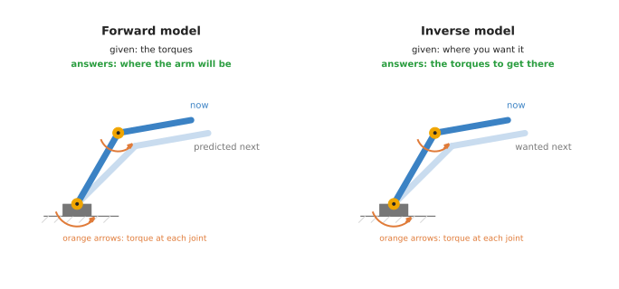
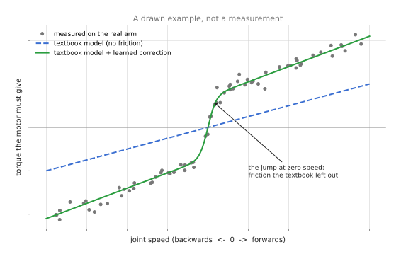
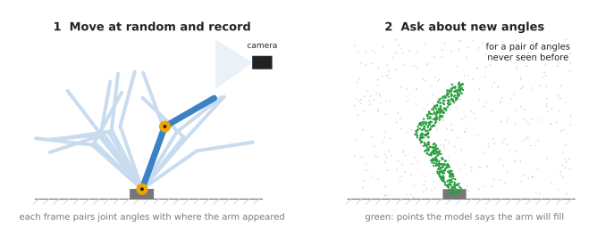

# Learned arm models

This page answers one question: how can a robot arm learn how its own body behaves,
where the numbers in its manual are not quite right? To answer that, it explains what
such a model predicts, how it is trained from the arm's own movements, the well-known
kinds, and when it is worth using instead of plain physics.

It is written for a reader who has already read the
[overview of this chapter](../01_overview.md) and the first chapter of this book. You
should know from Book 1 that an arm is a chain of joints and links, and that each
joint has a motor and an encoder, which is the sensor that measures the joint's
angle.

> Before this page, it helps to have read [arm
> dynamics](../../../06_programming-techniques/07_control-and-motion/02_most-used/03_arm-dynamics.md),
> which explains the textbook model of the torque each joint needs, and [system
> identification](../../../06_programming-techniques/04_fitting-and-estimation/03_also-used/01_system-identification.md),
> which measures the numbers inside it. This page learns the part that those two
> leave out.

## Contents

1. [What it is](#1-what-it-is)
2. [What goes in and what comes out](#2-what-goes-in-and-what-comes-out)
3. [How it works inside](#3-how-it-works-inside)
4. [How it is trained](#4-how-it-is-trained)
5. [Well-known models](#5-well-known-models)
6. [Where this is going](#6-where-this-is-going)
7. [Where to read next](#7-where-to-read-next)

---

## 1. What it is

A learned arm model is a model of the arm's own body, learned from recordings of the
arm moving.

Here is an everyday example of the same learning. When you start using a new bicycle,
you do not know exactly how hard to push the pedals to go at a given speed. However,
after a few rides you do. By then you have learned how this bicycle behaves: how
heavy it is, how stiff its chain is, and how much its brakes grab, and nobody gave
you any of those numbers.

A robot arm has a description of itself, too. The maker gives the length of each
link, the mass of each part, and where each part's weight is centred, and from those
numbers physics can work out how much torque each joint needs to move in a given
way. A **torque** is a turning force, the force a motor uses to turn its joint. This
is the arm's **dynamics**: how forces turn into movement.

However, the maker's description is close rather than exact. It leaves out the
friction in the gearboxes, and it also leaves out the cables that hang along the arm
and pull on it. It also does not know about the gripper you bolted on, or the wear after
years of use. So a learned arm model fills in what the description leaves out.

This page also covers two related jobs of the same kind. **Calibration** means
finding the small errors in the arm's geometry, so that the arm goes exactly where
it is told. A **self-model** is a model an arm builds of its own shape, often by
watching itself with a camera.

## 2. What goes in and what comes out

Now that the job is clear, here is what passes in and out. There are two main
directions for such a model, and they answer opposite questions.



The picture shows the same arm twice. The dark arm is where it is now, while the pale
arm is where it will be, or where you want it, a moment later. The orange arrows are
the torques at the joints.

A **forward model** answers: "if I apply these torques now, where will the arm be a
moment from now?" Its input is the joint angles, the joint speeds and the torques.
Its output is the joint angles and speeds a moment later.

An **inverse model** answers: "to move the way I want, what torque does each joint
need?" Its input is the joint angles, the joint speeds, and the change in speed you
want, and its output is one torque for each joint.

Because the controller uses it to work out the torque to send to each motor, the
inverse model is the one used most on real arms. The
[collision page](../02_most-used/02_collision-and-failure-detection.md#31-the-gap-between-expected-and-measured)
uses the same prediction as its "expected torque".

A self-model has different inputs and outputs from both of those. Its input is the
joint angles, and its output is the arm's shape in space, meaning which points around
the robot the arm fills.

## 3. How it works inside

### 3.1 Physics plus a learned correction

The last section said what the model predicts, and this section says how it does it.
Most learned arm models used in practice do not throw away physics. Instead, they
keep the textbook model and learn only the part it gets wrong. This is called
**residual learning**, because the network learns the residual, which is what is left
over after the physics has done its part.



The picture is a drawn example, not a real measurement, and it shows the torque one
joint needs at different speeds. The dashed line is the textbook model, which leaves
out friction, while the dots are what the real arm needs. At zero speed the dots
jump, because the joint must first overcome the friction that holds it still. The
solid line is the textbook model with a learned correction added, and it follows the
dots.

The steps are these:

1. The textbook model works out a torque from the joint angles, speeds and the
   change in speed you want.
2. A small network looks at the same inputs and works out a correction.
3. The program adds the two together and sends that torque to the motor.

This has two advantages over learning everything from nothing. The network has a
small job, so it needs less data. Where the network has seen nothing, the textbook
model also still gives a sensible answer.

Both halves of this arrangement are in the shortlist below. Step 1, the textbook model
with its numbers fitted to your own arm, is
[section 5.1](#51-the-makers-model-with-its-numbers-fitted-to-your-arm), and step 2, the
network that learns the correction, is
[section 5.2](#52-a-residual-torque-network-on-top-of-the-makers-model).

The correction can also report how sure it is. Some methods fit many small models
instead of one network, and each of them returns a prediction together with how far it
trusts that prediction. Where the recording held nothing like the present movement, the
correction says so, and the controller can shrink it rather than believe it.
[Section 5.6](#56-local-learners-with-an-error-bar) covers that family.

### 3.2 A network that learns the whole thing

Instead, a second kind learns the whole model from data, but it is built so that its
answers obey the rules of physics. For example, the energy of a moving arm cannot
appear from nowhere, so a network built this way cannot give an answer that breaks
that rule. This means it needs less data than a plain network, and its answers are
more sensible outside the training data. The best-known network of this kind is Deep
Lagrangian Networks, and [section 5.5](#55-deep-lagrangian-networks) recommends it.

A plain network with no physics inside it can also learn the whole model. However, it
needs the most data of all, and it can give strange answers for movements it has
never seen.

### 3.3 A self-model from a camera

A self-model learns the arm's shape instead of its torques, and one way of building
one works as follows.



The picture shows the two stages. On the left, the arm moves to many random poses
while a camera records it, and each picture is paired with the joint angles at that
moment. On the right, the trained model is given a pair of angles it has never seen.
For each point in space around the robot, it then says whether the arm would fill
that point. The green dots are the points it says the arm fills.

Once an arm has a self-model, it can plan without being told its own shape. So if a
part is bent or replaced, the arm can record itself again and learn the new shape.
[Section 5.7](#57-a-visual-self-model) recommends the published work that does this.

### 3.4 Calibration

Calibration is usually done without a neural network at all. The arm moves to many
poses, and a precise measuring device, such as a laser tracker, records where the
tool really is. A program then finds the small errors in the link lengths and joint
angles that best explain the difference.

However, some errors are not simple length or angle errors. The links bend a little
under their own weight, and the gears have a little play. So a small network can
learn these left-over errors, in the same way as the residual in section 3.1. It
takes the joint angles as input, and it outputs the correction to the tool's
position.

### 3.5 The same idea, aimed at a simulator

Everything above learns a model of the real arm for the real robot to use. The same
recordings can instead be used to make a simulator behave like the real arm, and two of
the methods in the shortlist below do that.

The first replaces the simulator's motor. A simulated motor is usually an ideal one
that produces exactly the torque it is asked for, while a real motor lags, saturates
and loses something to friction in its gearbox. So a small network is trained on the
real motor's behaviour and put into the simulator in place of the ideal one. That is
the actuator network of [section 5.3](#53-an-actuator-network), and it matters when a
policy trained in simulation has to run on your arm.

The second trains no network at all. It fits the numbers already inside the simulator,
which are the masses, the frictions, the motor gains and the delays. The work is a
search for the numbers that make the simulated robot move the way the recording says
the real one moved.
[Section 5.4](#54-mujocos-system-identification-toolbox) covers the toolbox that does
this.

## 4. How it is trained

The last section described the model, and this section says where its recordings come
from. A learned arm model trains on the arm's own movements. This is its great
advantage, because that data is cheap and safe to collect.

1. The arm moves through many different movements. People often use smooth
   movements that sweep each joint through its range at different speeds, so the
   model sees a wide variety.
2. At each moment, the program records the joint angles, the joint speeds, and the
   torque or current in each motor. The speed change is worked out from the
   speeds.
3. For an inverse model, each moment becomes one example. The input is the angles,
   the speeds and the speed change. The right answer is the torque that was
   actually used.
4. The network is trained to give the right answer for each example.

Because the arm reports many readings a second, an hour of movement gives a very
large number of examples. This means the limit is not the number of examples but how
varied they are, because a model trained only on slow movements does badly on fast
ones.

For a self-model, the data is the joint angles paired with camera pictures, as in
section 3.3. For calibration, it is the joint angles paired with measurements from
the precise measuring device.

## 5. Well-known models

The earlier sections explained what this kind of model does, and this section is for
choosing one. There is no learned arm model to download, because such a model
describes one arm and is worth nothing on another. What people publish instead are the
methods, and the libraries that fit them to your own recordings. So this section
compares the seven methods a developer meets most often, and section 5.8 says which to
start with and when a learned model beats the maker's own model.

Read the table one row at a time. The left column names the method and says whether a
developer starting today would reach for it. The right column holds everything else:
what the method is best at, what it costs to run, its licence, and the one case that
should make you choose it. What it costs to run matters, because a torque model is asked
hundreds of times a second. Each licence is the licence of the library named in that
sub-section, read from the library's own repository, and `not stated` means a fact could
not be sourced.

| Model | What decides it |
| --- | --- |
| [**5.1 The maker's model with its numbers fitted to your arm**](#51-the-makers-model-with-its-numbers-fitted-to-your-arm), most used in 2026 | It is best at getting the torque roughly right in every pose, with numbers you can read and check. It is one linear fit, and the physics call itself runs inside a control loop. The library is Pinocchio, under BSD-2-Clause. Pick it always, as the first step. |
| [**5.2 A residual torque network on top of 5.1**](#52-a-residual-torque-network-on-top-of-the-makers-model), most used in 2026 | It is best at friction, cable pull and wear that the equations have no term for. Two small layers are usual, which is fast enough for a control loop. The libraries are Pinocchio, under BSD-2-Clause, and PyTorch, under the three-clause BSD licence. Pick it when error is left over after 5.1. |
| [**5.3 An actuator network**](#53-an-actuator-network), most used in 2026 | It is best at making a simulated motor behave like the real motor. Its network size is `not stated`, and it runs inside the simulator. The library is Isaac Lab, under BSD-3-Clause. Pick it when you train a policy in simulation to run on your arm. |
| [**5.4 MuJoCo's system identification toolbox**](#54-mujocos-system-identification-toolbox), worth betting on | It is best at fitting the masses, frictions, gains and delays of a whole simulated robot. It costs one simulation run per parameter per optimiser step. MuJoCo is under Apache-2.0. Pick it when your simulator does not move like your arm. |
| [**5.5 Deep Lagrangian Networks**](#55-deep-lagrangian-networks), worth betting on | It is one network that cannot break the rules of physics for moving bodies, and that is what it is best at. It is larger and slower than a residual network of the same accuracy. The code is under MIT. Pick it when you want the physics inside the network rather than beside it. |
| [**5.6 Local learners with an error bar**](#56-local-learners-with-an-error-bar), historical | This family covers locally weighted projection regression and local Gaussian processes. It is best at a correction that also says how unsure it is. An exact Gaussian process costs time growing with the cube of the number of examples. The LWPR library is under the Lesser General Public License with a linking exception, and GPyTorch is under MIT. Pick it when the controller must know when to distrust the correction. |
| [**5.7 A visual self-model**](#57-a-visual-self-model), worth betting on | It is best at the arm's shape, when no trustworthy description of it exists. It is trained offline on an NVIDIA graphics card, and it is not a control-loop model. The code is under MIT. Pick it when the arm is new, modified or damaged. |

### 5.1 The maker's model with its numbers fitted to your arm

**Most used in 2026**, because it removes the largest part of the error for the least
work, and it is not a learned model at all. Size xs, which here means ten numbers per link
and no network anywhere, a laptop, and BSD-2-Clause for
[Pinocchio](https://github.com/stack-of-tasks/pinocchio), published by the Stack-of-Tasks
project, which supplies the physics. You keep the textbook equations, read the arm's shape
from its description file, written in the Unified Robot Description Format (URDF), and fit
the ten numbers that describe each link: its mass, three for where its weight is centred,
and six for how it resists turning.

The one idea is that the equations are already right and only the numbers in them are
wrong. The maker measured those numbers once, on a drawing or on a different unit, and your
arm has a gripper on it and some years of wear. So nothing about the physics needs
replacing.

Inside, the whole method rests on one property of the textbook torque equation: it is
linear in those ten numbers per link. Double a link's mass and every torque that mass
contributes doubles. That is why Pinocchio's `computeJointTorqueRegressor` can hand back a
matrix whose columns stand for the ten numbers of every link, such that the matrix times
the numbers equals the torque. Stacking a whole recording turns the question "which numbers
explain these torques?" into one large linear system, and a linear system has an exact
best answer that `lstsq` computes in one go. There is no training loop, no learning rate
and no stopping point to choose.

Compare section 5.2, where a network is fitted by stepping downhill a few thousand times
and what comes out is a pile of weights that mean nothing to anybody. What comes out here
is a mass in kilograms and a centre of mass in metres. You can print them, compare them
with the maker's, and argue about them, and the error the fit leaves over is the honest
measurement of how much there is left for a network to learn.

On an arm the difference shows up as soon as you bolt a gripper on. That is one unknown
mass at a known place, and this fit recovers it as a number you can check against the
gripper's data sheet. A network asked to absorb the same gripper learns a correction that
cannot be read, cannot be checked, and silently stops being right on the day somebody
fits a different gripper.

So you would fit these numbers rather than trust the ones the maker wrote into the URDF,
and it costs one recording. What it costs you besides that is care. The fit is rank
deficient, meaning several different sets of numbers explain the same recording equally
well, so an individual mass can come out physically impossible even when the predicted
torque is good. The regressor has no term for friction either, so you add two columns per
joint yourself: one for friction that grows with speed, and one for friction that only
depends on the direction of travel.

```python
import numpy as np
import pinocchio as pin

model = pin.buildModelFromUrdf('arm.urdf')
data = model.createData()

# One row per recorded moment, from the run described in section 4.
q, v, a, tau = (np.load(f'{name}.npy') for name in ('q', 'v', 'a', 'tau'))

# Each call returns a matrix whose columns stand for the ten numbers of every link,
# so that matrix times numbers equals torque. Stacking the whole recording turns the
# question "which numbers explain these torques?" into one large linear system.
rows = [pin.computeJointTorqueRegressor(model, data, qi, vi, ai)
        for qi, vi, ai in zip(q, v, a)]
A, b = np.vstack(rows), tau.reshape(-1)

fitted, *_ = np.linalg.lstsq(A, b, rcond=None)
print(np.abs(A @ fitted - b).mean())    # the error left over, in newton metres
```

You supply the recording and the URDF, and Pinocchio supplies the regressor matrix,
which is tedious to write by hand. The friction columns and the rank deficiency are
still yours, unless you use [FIGAROH](https://pypi.org/project/figaroh/) (Apache-2.0,
at [thanhndv212/figaroh-plus](https://github.com/thanhndv212/figaroh-plus)), which
reduces the regressor to the combinations that can actually be identified, generates
the movements that excite them, and also does the geometric calibration of section
3.4.

### 5.2 A residual torque network on top of the maker's model

**Most used in 2026** for learned arm dynamics, and the method of section 3.1. Size xs,
two small layers being usual, a laptop, and the licence is yours, because the network comes
out of your own training run; Pinocchio is BSD-2-Clause and
[PyTorch](https://pytorch.org/) is the three-clause BSD licence.

The one idea is the one the word residual names, and it is worth saying slowly. You do not
ask the network to predict the torque. You ask the textbook formula of section 5.1 to
predict the torque, you subtract that prediction from what the motors really used, and the
network learns only the difference. A **residual** is what is left over, and the leftovers
are this network's entire job.

Inside, that changes what the network is trained on rather than what it is made of. Look at
the code below: `physics` is computed with `rnea` for every recorded moment, and the
network is then fitted to `tau - physics`. So the numbers it has to reproduce are small
ones. Everything that makes up the bulk of a torque never reaches the network at all,
because the formula already produced it: that holding the arm out sideways costs more than
holding it hanging down, that a heavier acceleration needs a bigger push, that a fast joint
drags on its neighbours. The network is given exactly the same inputs the formula reads,
the angles, the speeds and the acceleration you want, so it has no extra information. It
has a smaller question.

Compare one plain network trained to predict the whole torque. That network has to
rediscover gravity from your recording, which costs most of its examples, and in a pose
your recording did not visit it has nothing to fall back on, so it answers with a guess
that could be any size. A residual network in that same pose outputs a small correction on
top of an answer the formula got mostly right, and the code below clips the correction so
that even a strange one cannot do much harm. That is the difference between a wrong answer
and a slightly wrong answer.

On an arm the place this earns its keep is a joint reversing direction. Friction in a
gearbox depends on which way the joint is turning and not only on how fast, and the
textbook equations have no term for that at all, so the formula's error jumps as the joint
passes through zero speed. That jump is the step in the picture in section 3.1. An hour of
ordinary motion teaches a residual network that step. Section 5.1 cannot learn it, because
it has no column for it until you write one by hand, and Deep Lagrangian Networks in
section 5.5 cannot learn it either, because friction is not something the equations of
motion can express.

So you would pick this rather than one plain network that learns the whole torque, and the
residual wins twice over, on how much recording it needs and on how it fails. What it costs
you is a retraining whenever the gripper, the payload or the wear changes, and a correction
that carries no guarantee, which is why the code clips it. It also needs a way to send
torques. Many industrial controllers accept only positions, and on those arms this model
can only be used off the control loop, for example as the expected torque of a collision
detector.

```python
import numpy as np
import pinocchio as pin
import torch
from torch import nn

model = pin.buildModelFromUrdf('arm.urdf')
data = model.createData()
q, v, a, tau = (np.load(f'{name}.npy') for name in ('q', 'v', 'a', 'tau'))

# rnea is the standard algorithm for "what torque does this movement need?".
physics = np.array([pin.rnea(model, data, qi, vi, ai) for qi, vi, ai in zip(q, v, a)])

x = torch.tensor(np.hstack([q, v, a]), dtype=torch.float32)
y = torch.tensor(tau - physics, dtype=torch.float32)   # only what the physics missed

net = nn.Sequential(nn.Linear(x.shape[1], 64), nn.Tanh(), nn.Linear(64, y.shape[1]))
optimiser = torch.optim.Adam(net.parameters(), lr=1e-3)
for _ in range(2000):
    optimiser.zero_grad()
    loss = nn.functional.mse_loss(net(x), y)
    loss.backward()
    optimiser.step()
```

At run time the controller adds the two parts and clips the learned part, so that a
strange answer in a strange pose cannot do much harm. Here `q` and `v` are this
moment's reading, and `a_wanted` is the change in speed the controller is asking for.

```python
with torch.inference_mode():
    correction = net(torch.tensor(np.hstack([q, v, a_wanted]), dtype=torch.float32))
send_to_motors(pin.rnea(model, data, q, v, a_wanted) + np.clip(correction.numpy(), -5, 5))
```

You supply the recording, the change in speed worked out from the recorded speeds, and
the clipping limit, which is a decision rather than a measurement. Keep the units the
same on both sides of the subtraction, because a current in amperes minus a torque in
newton metres is a mistake rather than a residual. Without joint torque sensors you
train on motor current, at a cost in accuracy.

### 5.3 An actuator network

**Most used in 2026** wherever a policy is trained in simulation for a real machine. Size
not stated, a big card with an NVIDIA chip, because the frontier chapter records that Isaac
Lab needs one and lists no macOS support, and BSD-3-Clause for
[Isaac Lab](https://github.com/isaac-sim/IsaacLab). Hwangbo and colleagues introduced the
idea in [Learning agile and dynamic motor skills for legged
robots](https://arxiv.org/abs/1901.08652) in 2019.

The one idea is that what is wrong with the simulator is not the arm but the motor, as
section 3.5 said. So you model one motor rather than a whole arm, and you put the model
where the simulator's ideal motor used to be.

Inside, that puts the learned part in a different place from every other entry on this
page. Sections 5.1, 5.2, 5.5 and 5.6 all sit between a controller and a real arm. This one
sits inside a simulated arm, in the spot where the line "the torque is what was asked for"
used to be. Its input is a short history of one joint's position errors and speeds, and the
history is the whole point: a real motor's torque now depends on what the controller asked
for a few milliseconds ago, which an ideal motor's does not, so a network given only this
moment could not reproduce a lag. Its output is the torque the real motor actually
produced. Isaac Lab's `isaaclab.actuators` package offers two shapes for it,
`ActuatorNetMLPCfg` and `ActuatorNetLSTMCfg`. MLP stands for multi-layer perceptron, which
is a plain stack of layers and is given the history explicitly as `input_idx`, while LSTM
is a network that carries its own memory of the recent past and so builds that history
itself.

What the idea buys is that gearbox friction, communication delay and torque saturation
arrive together and in the right proportions. The obvious alternative is the simulator's
ideal motor with a stiffness and a damping number, randomised during training, which covers
the same ground with a range wide enough to include machines that do not exist. What it
costs you is a recording from the real motor with its torque measured, which without joint
torque sensors means a test rig. The network is saved as a TorchScript file, which is a
PyTorch network stored so that it loads without its original Python code, so somebody
else's file does not fit your motor.

On an arm the difference shows up as a policy that works beautifully in simulation and
shakes on the real machine. The shake is usually the delay the ideal motor did not have:
the policy learned to react as though its commands took effect at once, and on the real arm
they do not. No amount of section 5.1 or section 5.2 fixes that, because both of those
improve what a real controller computes, and the fault is in what the simulated motor
did.

```python
from isaaclab.actuators import ActuatorNetLSTMCfg
from isaaclab.utils.assets import ISAACLAB_NUCLEUS_DIR

# Isaac Lab ships this configuration for the ANYdrive 3.0 motors of ANYmal-C, and
# the three limits below are the ones in that file.
ANYDRIVE_3_LSTM_ACTUATOR_CFG = ActuatorNetLSTMCfg(
    joint_names_expr=[".*HAA", ".*HFE", ".*KFE"],   # which joints this model stands for
    network_file=f"{ISAACLAB_NUCLEUS_DIR}/ActuatorNets/ANYbotics/anydrive_3_lstm_jit.pt",
    saturation_effort=120.0,
    effort_limit=80.0,
    velocity_limit=7.5,
)
```

You supply your own joint names, your own TorchScript file and your own three limits
from the motor's data sheet, and Isaac Lab supplies the history buffer and the
per-joint plumbing. For a plain stack of layers use `ActuatorNetMLPCfg`, which also
asks for the units the network was trained in, as `pos_scale`, `vel_scale` and
`torque_scale`, and for `input_idx`, which picks the moments of history the network
reads, where `0` is now and `n` is n steps ago.

### 5.4 MuJoCo's system identification toolbox

**Worth betting on**, because it turned fitting a simulator to a real machine from a
research exercise into a feature of a standard install. Size not stated, because nothing is
trained: what comes out is the handful of numbers you asked it to fit. A laptop, and
Apache-2.0 for MuJoCo. MuJoCo 3.5.0, on 12 February 2026, added a system identification
toolbox in Python, as the frontier chapter records in [its simulation
section](../../../03_frameworks/08_frontier/04_simulation-and-evaluation.md#52-measuring-the-robot-instead-of-randomising-over-it).

The one idea is that the simulator already has the right terms in it, so you fit its
numbers rather than adding a network beside them. The masses, the frictions, the motor
gains and the delays are all parameters of the model you already have.

Inside, there is no network anywhere, which is what separates this from section 5.3. You
name each parameter and give it a callback, which is a small function whose only job is to
write a fitted value into the right place in the model. The optimiser then runs the
simulation forward over your recorded controls, compares the sensor readings the simulation
produced with the ones you recorded, and changes the numbers to make the difference
smaller, by nonlinear least squares with bounds. It works out which way to change each
number by trying a small change and seeing what happens, so every parameter costs its own
simulation run at every step, which is why the runs are batched.

So section 5.3 and this one fix the same simulator from opposite sides. Section 5.3 adds a
learned part where the simulator had no term at all, namely a real motor's lag. This one
changes numbers inside terms the simulator already had. What this buys is measured numbers
rather than randomised ranges, which the frontier chapter puts as moving from randomising
over your ignorance to measuring first and randomising over what is left. What it costs is
simulation time, and the fact that it can only fit parameters your model has a term for, so
a contact behaviour your model does not represent cannot be fitted into existence. Its
README also says the measurement part of the interface is "not yet final".

On an arm the clearest case is a simulated arm that lags behind the real one by a fixed
amount. The same 3.5.0 release made delays a property of actuators and sensors, so that lag
is now a number with a term of its own, and one fitting run measures it. A residual network
from section 5.2 would absorb the same lag into a torque correction, which works at the
speeds in the recording and quietly stops working at others, because a delay and a torque
are not the same quantity.

```python
import mujoco
from mujoco import sysid          # an optional extra: pip install "mujoco[sysid]"

spec = mujoco.MjSpec.from_file('arm.xml')
model = spec.compile()

def set_link1_mass(spec, p):      # a callback writes one fitted number into the model
    spec.body('link1').mass = p.value[0]

params = sysid.ParameterDict()
params.add(sysid.Parameter('link1_mass', nominal=2.0, min_value=0.5, max_value=5.0,
                           modifier=set_link1_mass))   # these values are the README's

control = sysid.TimeSeries.from_control_names(times, ctrl_array, model)
measured = sysid.TimeSeries.from_names(times, measurement_array, model)
state0 = sysid.create_initial_state(model, qpos_0, qvel_0)
sequences = sysid.ModelSequences('arm', spec, 'traj_1', state0, control, measured)

residual_fn = sysid.build_residual_fn(models_sequences=[sequences])
fitted, result = sysid.optimize(initial_params=params, residual_fn=residual_fn)
```

You supply the model, the recordings and one callback per parameter, which says where
in the model that number belongs. The toolbox supplies the optimiser, the parallel
simulation runs and an HTML report of the fitted values. Its
[README](https://github.com/google-deepmind/mujoco/blob/main/python/mujoco/sysid/README.md)
lists helpers for the awkward parameters.

### 5.5 Deep Lagrangian Networks

**Worth betting on**, because it is the cleanest answer to the complaint that a learned
correction can do anything it likes. Size xs, two layers of width 64 in the repository's own
example, a laptop, and MIT for the code, which is at
[milutter/deep_lagrangian_networks](https://github.com/milutter/deep_lagrangian_networks)
in a PyTorch and a JAX version. Michael Lutter, Christian Ritter and Jan Peters published
[Deep Lagrangian Networks](https://arxiv.org/abs/1907.04490) in 2019.

The one idea is that the network should not be allowed to output a torque. It outputs the
pieces that the equations of motion are built from, and the torque is then computed from
those pieces by the textbook formula, which is the second kind of model in section 3.2.

Inside, the repository's own source shows three heads coming off one shared body, and the
body reads only the joint angles. Two of the heads give the entries of a lower triangular
matrix, which means a square table of numbers with nothing above its diagonal: one head
gives the diagonal and the other gives the entries below it. The mass matrix is then formed
by multiplying that table by its own mirror image, and that is the guarantee. A matrix built
that way is always symmetric and can never imply a negative kinetic energy, whatever
numbers the network puts in it, so the arm it describes is always a possible arm. The third
head gives one number, the arm's potential energy, and the gravity torque is the slope of
that number as the joints turn, which the code obtains by differentiating the network. From
the mass matrix and its own rates of change the code then builds the Coriolis and
centrifugal terms, and the torque is the textbook sum: the mass matrix times the
acceleration you want, plus those terms, plus gravity. So compare section 5.2, where the
network outputs the correction to the torque directly, and
nothing whatever stops it outputting a torque that no mechanical system could ever need,
which is why the code there clips it. Here no clipping is possible, because no torque is
output. A second difference is worth noticing in the two pieces of code: in section 5.2 the
angles, the speeds and the acceleration are all fed to the network, while here only the
angles are. The speeds and the acceleration go into the formula instead, because an arm's
inertia and potential energy depend on where it is, not on how fast it is moving.

What that buys is answers that stay sensible far outside the recording, and a model that
needs no trustworthy URDF, because it learns the inertia from the recording rather than
reading it from a file. The second part of its training loss helps as well: it asks the
model to account for where the energy went, which is what stops two wrong answers
cancelling each other out. What it costs is speed and fiddliness. The network differentiates
itself to build the equations of motion, so one prediction does more work than a plain stack
of layers of the same width, and the activation has to be smooth, which is why the
repository ships its own derivative of each activation.

On an arm the difference decides itself on one question: do you have a description file you
trust? Sections 5.1 and 5.2 both begin by reading masses and lengths out of a URDF, so on a
hand-built or heavily modified arm they have nothing to start from and this one does. If the
URDF is good and the error that is left is friction, the choice goes the other way, because
the formula was free and friction is exactly what the equations of motion cannot express, so
it has to be added separately here while section 5.2 learns it as a matter of course.

```python
import torch
from deep_lagrangian_networks.DeLaN_model import DeepLagrangianNetwork

# n_dof is the number of joints. The repository's own example uses two hidden layers
# of width 64 and the SoftPlus activation, which is smooth everywhere.
net = DeepLagrangianNetwork(n_dof, n_width=64, n_depth=2, activation='SoftPlus',
                            diagonal_epsilon=0.01)
optimiser = torch.optim.Adam(net.parameters(), lr=5e-4, weight_decay=1e-5, amsgrad=True)

for q, qd, qdd, tau in batches:          # the recording of section 4, in small groups
    optimiser.zero_grad()
    tau_hat, dEdt_hat = net(q, qd, qdd)  # the predicted torque, and the predicted power
    power = torch.sum(qd * tau, dim=1)   # the power the real motors delivered
    loss = (torch.mean(torch.sum((tau_hat - tau) ** 2, dim=1))
            + torch.mean((dEdt_hat - power) ** 2))
    loss.backward()
    optimiser.step()

torque = net.inv_dyn(q, qd, qdd_wanted)  # what the controller asks for at run time
```

You supply the recording, and the network supplies the physics structure. The second
part of the loss, the energy term described above, is worth keeping for the reason given
there.

### 5.6 Local learners with an error bar

**Historical** as code, and kept here because one of its properties is still missing
from the methods above. Size not stated, because an exact Gaussian process stores training
points rather than weights, a laptop for a sample of a recording, and the
[LWPR library](https://informatics.ed.ac.uk/slmc/lwpr) is under the Lesser General Public
License with an exception for static linking, while
[GPyTorch](https://github.com/cornellius-gp/gpytorch) is MIT and
[scikit-learn](https://scikit-learn.org/stable/modules/generated/sklearn.gaussian_process.GaussianProcessRegressor.html)
is BSD-3-Clause. Sethu Vijayakumar and Stefan Schaal's locally weighted projection
regression (LWPR) fits many small simple models, each good for one region of movement, and
updates them while the robot runs. Duy Nguyen-Tuong, Jan Peters and Matthias Seeger did the
same with Gaussian processes in [Local Gaussian Process Regression for Real Time Online
Model
Learning](https://proceedings.neurips.cc/paper/2008/hash/01161aaa0b6d1345dd8fe4e481144d84-Abstract.html)
in 2008.

The one idea is that a correction should say when it is guessing. Every other method here
answers every question with equal confidence, including questions about movements nothing in
the recording resembles.

Inside, a Gaussian process gets that honesty from an unusual arrangement: it keeps the
training examples instead of squeezing them into weights. To answer about this moment, it
works out how similar this moment is to every stored example, using a measure of similarity
called a kernel, and its prediction is a weighted average of the leftover torques it saw at
the similar ones. Because the answer is assembled out of similarity, the method also knows
when nothing stored is similar, and that is where the spread it returns comes from. The
network in section 5.2 can give you no such number, because once it is trained the examples
are gone and only the weights remain. The "local" in the original work is the same idea made
affordable: many small models, each covering one region of movement, each kept up to date
while the robot runs.

What that buys is the `std` in the code below, and the controller uses it by scaling the
correction down as it grows. What it costs is scale. An exact Gaussian process inverts a
matrix with one row and column per training point, so the training time grows with the cube
of the number of points, and an hour of recording has far too many. You sample the
recording, or use one of the approximate methods in GPyTorch. Prediction is slower than a
small network too, which is why the original work made its models local in the first place.

On an arm the difference is a pose the recording never visited. Section 5.2's network
produces a confident correction there, and the clipping in its code is a blunt stand-in for
not knowing: it limits the damage without ever noticing the problem. Here the spread grows,
the controller shrinks the correction towards nothing, and the arm falls back on the physics
by itself, in the one pose where falling back is the right thing to do. That is why this
family is still worth reading although its original code is historical.

So you would pick section 5.2 for a recording you already have, because it is easier to
train and faster to run. You would come here for the error bar, and today you would get it
from a Gaussian process in GPyTorch or scikit-learn rather than from the original
libraries.

```python
import numpy as np
from sklearn.gaussian_process import GaussianProcessRegressor
from sklearn.gaussian_process.kernels import RBF, ConstantKernel, WhiteKernel

x = np.hstack([q, v, a])        # the arrays of 5.2: one row per recorded moment
y = tau[:, 2] - physics[:, 2]   # the leftover torque of one joint, here the third

# An exact Gaussian process cannot take the whole recording, so take a sample of it.
pick = np.random.default_rng(0).choice(len(x), size=2000, replace=False)

kernel = ConstantKernel() * RBF(length_scale=np.ones(x.shape[1])) + WhiteKernel()
gp = GaussianProcessRegressor(kernel=kernel, normalize_y=True).fit(x[pick], y[pick])

mean, std = gp.predict(x_now, return_std=True)   # the correction, and how unsure it is
```

You supply the sample size, and one model per joint, because this fit predicts one
number. The `std` that comes back is the spread described above, and it is what the
network in 5.2 cannot give you.

### 5.7 A visual self-model

**Worth betting on** for arms that change, because it is the only method here that
needs no description of the arm at all. Size not stated, an NVIDIA graphics card to train
it, and MIT for the code, which is at
[BoyuanChen/visual-selfmodeling](https://github.com/BoyuanChen/visual-selfmodeling). Boyuan
Chen, Robert Kwiatkowski, Carl Vondrick and Hod Lipson published [Full-Body Visual
Self-Modeling of Robot Morphologies](https://arxiv.org/abs/2111.06389) at Columbia
University in 2021, and the paper reports a model "accurate to about one percent of the
workspace". Robert Kwiatkowski and Hod Lipson's earlier task-agnostic self-modeling learned
the same kind of model and relearned it after damage.

The one idea is to store the arm's shape as a question you can ask rather than as a drawing.
Nothing in the trained model is a link length or a mesh.

Inside, the model is a network whose input is a point in space together with the joint
angles, and whose output is whether the robot fills that point. So there is no shape
anywhere in it that you could look at. You get a shape out by asking about many points and
collecting the answers, which is what the green dots in the picture in section 3.3 are. The
training examples are joint angles paired with what the cameras saw, so the recording
itself is cheap: the arm moves at random and nobody labels anything.

Compare every other entry in this section: all six of them predict a torque or where the
arm will be, and all six read the arm's shape out of a description file as a given. This one
has the shape as its output and no description file among its inputs, which is why it is the
only method here that can be used on an arm nobody has described. So what it buys is an arm
that can remeasure itself. What it costs is a camera rig, a long
random-motion recording and research code. The README was tested on Ubuntu 18.04 with CUDA
11.0 and Python 3.6, and it asks you to uncomment particular lines of `models.py` before one
of the training steps, which tells you what kind of software this is. The model predicts
shape and not torque, so it feeds a planner rather than a controller.

On an arm the case is a link bent in a crash. Forward kinematics from the URDF is exact,
free and instant when the description is right, so it is the obvious alternative and usually
the better one. After the crash it is still confidently reporting the shape the arm had
before, and nothing else on this page can notice, because every other method reads that same
file. A self-model recorded again reports the shape the arm now has.

```bash
git clone https://github.com/BoyuanChen/visual-selfmodeling
cd visual-selfmodeling
# Install its pinned requirements in a virtual environment, as its README describes.
python sim.py            # makes the training data in the PyBullet simulator
cd scripts && CUDA_VISIBLE_DEVICES=0 python ../main.py ../configs/state_condition/config1.yaml NA
```

You supply the robot, the cameras and the recording, and in practice a port of `sim.py`
to your own arm, because the published pipeline makes its data in a simulator. What you
get out is a model you can ask about any point in space, which a planner then uses in
place of the arm's collision geometry.

### 5.8 How to choose

Fit the maker's model to a recording of your own arm first, with 5.1, and only then
decide whether anything is left to learn. For most catalogue arms doing most jobs,
nothing is, and the work stops there.

When the error that is left does matter, these are the cases where a learned model
beats the maker's model and the maker's calibration.

- The error depends on something the equations have no term for. Gearbox friction that
  changes as the arm warms up, a cable that pulls differently in each pose, and a link
  that bends under load are the common three. Add a residual network, 5.2.
- The controller must know how far to trust its own correction. Use a Gaussian process
  with its error bar, 5.6.
- The target is a simulator rather than a controller. Fit the simulator's parameters and
  delays with 5.4, and replace its ideal motors with actuator networks, 5.3.
- The arm has no trustworthy description, because it is hand-built, modified or damaged.
  Learn its shape with 5.7.
- You want one model rather than a model plus a patch, and can afford a slower network.
  Use Deep Lagrangian Networks, 5.5.

These are the cases where the maker's model and the maker's calibration win, and a
learned model does not help.

- Absolute positioning accuracy. A factory calibration is measured against the
  workspace with an outside instrument, such as a laser tracker, and a model trained
  from the arm's own encoders cannot discover an error those encoders cannot see.
- A limit that has to be justified to somebody. The written model's behaviour can be
  checked in every pose by argument, and a network's cannot, so where the number must be
  defended, keep the written model and keep the learned part clipped.
- A controller that accepts only position commands. A learned torque correction needs a
  torque or current interface. Without one the model can still run off the control loop,
  for example as the expected torque of a collision detector, but it cannot improve the
  arm's tracking.
- An error that really is one unknown number, such as the mass of a new gripper. Measure
  it or fit it, as in 5.1, rather than training a network to hide it.

## 6. Where this is going

This section is about what changes next, and it is written on 4 October 2026. It uses
the four kinds of claim that the frameworks book sets out in [four kinds of
claim](../../../03_frameworks/08_frontier/06_what-is-coming.md#1-four-kinds-of-claim-and-why-the-difference-decides-everything).
A demonstration worked once under conditions its publisher chose. A product
announcement can be bought or downloaded, so you can check it, which makes it the most
valuable kind. A research result is a measured number with a stated protocol. A
projection is about a date that has not arrived, and it is the weakest. Where a sentence
below is my own judgement rather than a report of somebody's claim, it says so.

### 6.1 How it got here

The order of section 5 is the history. Fitting the maker's own equations to a recording
of your arm came first and is still the first thing to do. Then a network was added on
top to absorb what those equations have no term for. Then came networks with the physics
built into their structure, and local learners that report an error bar with each
prediction. Then actuator networks arrived, and they changed what the whole subject is
for: an actuator network exists to make a simulator behave like a real motor, not to
improve a controller. That is the shape of the change. This subject started out aimed at
the arm's control loop and is now aimed mostly at the simulator, because that is where
the demand went.

### 6.2 Where it is used in industry today

This page has more genuine production use than the rest of the chapter, and all of it is
inside tools rather than in anything sold as a learned arm model.

The clearest case is [Isaac Lab](https://github.com/isaac-sim/IsaacLab), NVIDIA's
simulation framework, which ships an actuator network configuration for the ANYdrive 3.0
motors of the ANYmal-C robot, as section 5.3 describes. That is a learned model of real
hardware, trained once, shipped as a configuration file inside a vendor framework, and
used by anyone who trains a policy on that robot. It is a product announcement in the
plainest sense, because you can clone the repository and read the file.

The second case is system identification as a supported feature rather than a research
script. Google DeepMind's MuJoCo now ships a
[system identification toolbox](https://github.com/google-deepmind/mujoco/blob/main/python/mujoco/sysid/README.md)
in its Python package, which is section 5.4, and
[Pinocchio](https://github.com/stack-of-tasks/pinocchio) is the maintained rigid-body
library that section 5.1 and section 5.2 both build on. Both are installable today.

On the arm side, the honest position is that the makers keep this work to themselves and
sell it as calibration. Absolute positioning accuracy comes from a factory calibration
measured with an outside instrument, and the arm's own description file is what you are
given. Franka Robotics exposes its dynamics model through
[franka_ros2](https://github.com/frankarobotics/franka_ros2), which is more than most
vendors do, and [Universal Robots](https://www.universal-robots.com/products/ur5e/)
publishes nothing about the model inside its controller.

What nobody publishes is the number that would settle whether this page's subject is
worth your time: how much a learned arm model improves tracking error on a catalogue arm
doing a real job. No vendor states it, and the papers in section 5 each measure on their
own arm with their own protocol, so the results cannot be put side by side.

### 6.3 What is being worked on right now

The busiest front is fitting a simulator to a real robot, and the reason is demand
rather than novelty. Policies are trained in simulation and then run on hardware, so
every gap between the two costs attempts, and MuJoCo shipping a toolbox for closing that
gap is the clearest signal of where the effort is going. Section 5.4 is that front, and
section 5.3 is the part of it that replaces the simulator's ideal motors.

The second front is that this subject is being swallowed by a bigger category. LeRobot's
[version 0.6.0 release notes](https://huggingface.co/blog/lerobot-release-v060), from 6
July 2026, add three world models as downloadable policies, and the share of robotics
abstracts on arXiv containing "world model" went from 2.39 per cent in 2025 to 5.48 per
cent in 2026 to late September, by the counts in the frameworks book's
[measured research
directions](../../../03_frameworks/08_frontier/06_what-is-coming.md#5-research-directions-with-momentum-measured-rather-than-asserted).
A world model predicts what happens next. A learned arm model is the same idea with the
arm's own body as the whole world, which is the point the
[learned dynamics models](../../08_world-models/02_most-used/01_learned-dynamics-models.md)
page makes, so the research attention is moving to the general version of this page's
subject.

The third front is pulling force and compliance inside a learned policy instead of
leaving them to the controller below it. Two September 2026 preprints show the shape:
[CompVLA](https://arxiv.org/abs/2609.23614) predicts a stiffness matrix alongside the
motion, and [ForceRFT](https://arxiv.org/abs/2609.22840) refines a policy's actions with
force-guided reinforcement learning. Both are research results with no released weights.
They matter here because the thing a residual torque model gives you, which is knowing
what the arm will do under load, is being learned end to end by something else.

The fourth front is making models small enough to run on the robot, and it bears
directly on section 5.6. A learned correction has to produce an answer every control
cycle, and a Gaussian process cannot even take a whole recording. Work such as
[FoldQuantVLA](https://arxiv.org/abs/2609.24433), which reports four-bit weights and
activations with speedups of 1.20 to 1.33 times, exists because current models do not
comfortably fit the computers robots carry. NVIDIA's
[Jetson Thor announcement of 15 July 2026](https://blogs.nvidia.com/blog/jetson-thor-robotics-edge-ai-agent/)
puts the entry-level part's hardware in the first quarter of 2027, which is announced
with a date.

### 6.4 What is still unsolved

Absolute positioning has resisted everything, and the reason is a measurement problem
rather than a modelling one. A model trained from the arm's own encoders cannot discover
an error those encoders cannot see, so a link that bends or a base that has shifted is
invisible to it. Finding that error needs an outside instrument such as a laser tracker,
and no amount of learning substitutes for one. Section 5.8 already says this, and five
years of work has not changed it.

Justifying a learned correction to somebody else is the second unsolved thing. The
written model's behaviour can be checked in every pose by argument, and a network's
cannot, so wherever a limit has to be defended the written model stays and the learned
part stays clipped. Book 6's
[safety monitoring](../../../06_programming-techniques/07_control-and-motion/02_most-used/04_safety-monitoring.md#7-this-is-not-a-certified-safety-function)
page explains what a certified function has that a network does not, and nothing in this
page's subject supplies any of it.

The third is the interface, and it is the one that stops most readers before they begin.
A learned torque correction needs a torque or current interface, and most catalogue arms
accept position commands only. That is a firmware decision by the arm's maker, so it
cannot be worked around by better models. The fourth is that there is no shared benchmark
for arm dynamics models at all: no agreed arm, no agreed trajectory, no agreed error
measure. Without one, "this model is better" is not a checkable statement.

### 6.5 The next two to three years

Everything in this part is my expectation with a reason attached, not an announcement by
anybody.

**Fitting a simulator to the real robot becomes a routine step rather than a research
project.** The reason is that the tool now ships with the simulator, so the cost of doing
it has dropped from writing an optimiser to calling one, and the consumer is already
there in volume, because policy training in simulation is what most of this field now
does. My expectation is that within this period a published policy recipe that does not
fit its simulator to the hardware will look careless in the way an uncalibrated camera
looks careless now.

**Actuator networks spread with the drives that need them, and not to geared industrial
arms.** The reason is what an actuator network is for. It exists because the motor is not
an ideal torque source, and a harmonic-drive industrial joint is close enough to one that
the network has little to learn. Tendon-driven hands and series-elastic legs are not, and
those are exactly the hardware now becoming affordable. So I expect this entry to grow
where the hands and legs go and to stay irrelevant on a six-axis catalogue arm.

**The torque interface stays the gate, so a learned arm model keeps earning its place off
the control loop.** The reason is responsibility rather than engineering. Opening a torque
interface means the arm's maker accepting whatever torque a customer's software sends,
and a vendor who has certified a stopping distance has a direct reason not to. So my
expectation is that the two uses that need no torque interface grow fastest: the expected
torque inside a collision detector, which the
[collision and failure detection](../02_most-used/02_collision-and-failure-detection.md)
page describes, and a fitted parameter set for a simulator.

**World models absorb this subject in name, without replacing anything in section 5.**
The reason is that one model predicting the next state of the arm and the next state of
the object is simpler to train and to ship than two, and the research attention and the
released software both already point that way. This is a judgement about vocabulary
rather than a capability claim, and it has a practical consequence: in two years the
work on this page may be published under a heading that does not contain the word "arm",
so search for what a method predicts rather than for what it is called.

**Nothing in this area becomes certified, and the useful thing to watch is a published
number.** The reason is the four properties named on that safety monitoring page, none of which a
network supplies. What would move this page is somebody publishing a tracking error, on a
named catalogue arm, before and after a learned correction, with the trajectory stated.
That is a cheap experiment and nobody has published it, which is itself informative about
how much the improvement is worth. Until it appears, section 5.8's advice stands: fit the
maker's model first, and only then ask whether anything is left to learn.

## 7. Where to read next

In this chapter:

- [Collision and failure detection](../02_most-used/02_collision-and-failure-detection.md) uses
  the inverse model from this page as its expected torque.
- The [overview](../01_overview.md) compares all four kinds.

In this book:

- [Learned dynamics models](../../08_world-models/02_most-used/01_learned-dynamics-models.md)
  predict how the world changes when the arm acts. A learned arm model is the same
  idea with the arm's own body as the whole world.
- [Learned motion planners](../../06_movement-models/03_also-used/02_learned-motion-planners.md)
  cover learned inverse kinematics: a network that turns a wanted gripper position
  into joint angles.
- [Reinforcement learning
  policies](../../06_movement-models/03_also-used/01_reinforcement-learning-policies.md) are often
  trained in a simulator. A learned model of the arm's motors makes that simulator
  closer to the real arm.

In the other books:

- [Learned pieces inside a planned
  system](../../../03_frameworks/03_arm-movement/05_learned-motion.md#3-learned-pieces-inside-a-planned-system)
  in the frameworks book describes where small learned models help a planned arm.
- [Calibration, which decides all of
  it](../../../02_perception/02_object-perception/02_sensors.md#4-calibration-which-decides-all-of-it)
  in the perception book covers calibrating the camera and the arm together.
- [Controlling the move](../../../03_frameworks/03_arm-movement/04_controlling-the-move.md)
  explains what the controller does with a torque.
