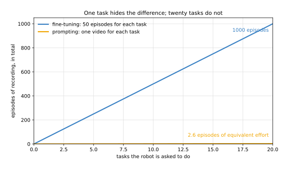

# Prompting with a demonstration

Every other page in this chapter assumes that teaching a robot a new task means
changing a model. You collect examples, you run training, and you end up with a new
model file that knows the task. This page is about a different answer, in which the
model file never changes at all: you show the robot one recording of the task, the
recording goes in alongside the camera picture, and the robot does the task.

This page is for a reader who has read [fine-tuning](../02_most-used/01_fine-tuning.md),
because the method here is best understood as the alternative to it. By the end you
will know what "in context" means, why a video says more than a sentence, what this
way of teaching costs, and how to decide which of the two routes a job needs. You will
also know what the evidence for it is today, which is thinner than the attention it
receives.

One thing is worth saying before the explanation starts. The method is real and it is
in commercial use, but the only well-documented model that does it cannot be
downloaded, has no published architecture and has not been evaluated by anybody
outside the company that built it. So this page teaches the idea, which is durable,
and treats the reported numbers as claims rather than as measurements.

## Contents

1. [The idea in one sentence](#1-the-idea-in-one-sentence)
2. [What "in context" means](#2-what-in-context-means)
3. [Where the idea comes from](#3-where-the-idea-comes-from)
4. [Why a video rather than a sentence](#4-why-a-video-rather-than-a-sentence)
5. [The two routes, side by side](#5-the-two-routes-side-by-side)
6. [What each route costs as the work grows](#6-what-each-route-costs-as-the-work-grows)
7. [A miniature that shows the mechanism](#7-a-miniature-that-shows-the-mechanism)
8. [The evidence so far, and what is missing from it](#8-the-evidence-so-far-and-what-is-missing-from-it)
9. [How to choose between the two routes](#9-how-to-choose-between-the-two-routes)
10. [Where it works and where it does not](#10-where-it-works-and-where-it-does-not)
11. [Where to read next](#11-where-to-read-next)
12. [Using it in Python](#12-using-it-in-python)

---

## 1. The idea in one sentence

**You teach the robot by giving it an example at the moment you ask, instead of by
training the example into the model beforehand.**

The example is an input to the model, in the same way that the camera picture is an
input. It arrives, it is used, and when the next request comes with a different
example the model does a different task. Nothing about the model is different before
and after. This is called **in-context learning**, because the learning happens inside
the context the model is given rather than inside its weights.

## 2. What "in context" means

To see why that is surprising, recall what a weight is. [Inside a neural
network](../../01_what-models-are/03_inside-a-neural-network.md) explained that a model
is a large set of numbers called weights, and that training is the process of changing
those numbers so that the model's outputs match the examples it was given. Under that
description, a model that has learned something must be a model whose numbers have
changed, and so teaching must mean training.

In-context learning breaks that link. The weights stay exactly as they were, and the
new information is supplied as part of the input. The model was trained, once and
expensively, to be good at reading an example and applying it. After that, each new
task costs one example and no training at all.

Two consequences follow from this, and they matter more than the mechanism.

The first is that nothing is remembered. A fine-tuned model carries its task in its
file, so the task survives a restart. A prompted model carries nothing: if you want
the task done again tomorrow, you supply the example again tomorrow. The example is
data you keep, not a model you keep.

The second is that one model does every task. Fine-tuning gives you one file for each
task, and a robot that does twelve jobs holds twelve files and must know which to
load. Prompting gives you one file and twelve recordings, and switching jobs means
handing over a different recording.

## 3. Where the idea comes from

This is not a new idea, and it is easier to understand if you have seen it in its
first setting, which is language.

A large language model is trained on text and then asked questions. Early on, people
found that if you put two or three worked examples into the question itself, the model
answered the rest far better than if you had simply asked. Writing out examples inside
the request is called **few-shot prompting**, and the page on [language models as
planners](../../07_language-models/03_also-used/01_language-models-as-planners.md#step-1-the-robot-writes-a-prompt)
describes how it is used to make a planner produce steps in the shape you want.

What made that so useful was the cost. Fine-tuning a language model for each new job
needs data, a graphics card and a training run, while writing three examples into a
prompt needs a minute. Few-shot prompting is the reason a language model can be put to
a new use in an afternoon, and it is the reason the same idea was worth trying for
robots.

The question for robotics was always whether a model could read an example of a
*physical* task and apply it, since a physical task is not a sentence. Answering that
took much longer than it did for language, and the answer is still only partly in.

## 4. Why a video rather than a sentence

Every vision-language-action model described in [the page on
them](../../07_language-models/02_most-used/01_vision-language-action-models.md) is told
what to do in words. The instruction "put the cup on the saucer" goes in beside the
camera picture, and the model produces movements.

Words are a narrow channel, and the narrowness is the problem. "Fold the towel" does
not say which fold, in which order, or to what standard. "Tidy the bench" does not say
what counts as tidy. The model has to guess the missing detail from whatever it saw
during training, and when your idea of the task differs from the average of its
training data, it does the average thing instead of your thing.

A video does not have that problem, because a recording of somebody doing the task
contains the order, the standard and the detail by construction. You do not have to
describe the fold. You show it.

This is the change that the method rests on, and it is worth stating plainly: the task
is specified by an example of the task, rather than by a description of it.

## 5. The two routes, side by side

The picture below puts the two ways of teaching next to each other. Both begin with a
model somebody else trained, and both end with a robot doing your task. What differs
is what changes along the way.


In the upper route the collected episodes are consumed by a training run, and the
thing that comes out is a different file. In the lower route nothing is consumed and
nothing is produced: the recording is held, and it is supplied again every time the
task is asked for.

The figure of one video being worth about 380 episodes is drawn from the launch post
for Skild AI's S1 model, and section 8 says what that number does and does not
establish. It is quoted here because it is the only published figure of its kind, not
because it has been checked.

## 6. What each route costs as the work grows

The difference between the two routes is almost invisible when a robot does one job,
and it becomes the whole story when a robot does many. The chart below counts the
recording a person has to do, measured in episodes, as the number of jobs grows.



At one task the two are close enough that the choice hardly matters. At twenty tasks
the fine-tuning route has cost a thousand recorded episodes and twenty separate
training runs, and the prompting route has cost twenty recordings and no training run
at all.

The lesson is not that one route is better. It is that **the question is how many
tasks, not how hard the task is.** A cell that does one job for a year should be
fine-tuned, because the cost is paid once and the result is more accurate, for the
reason section 7 shows. A cell whose job changes weekly is where the other route pays.

## 7. A miniature that shows the mechanism

The mechanism is easier to believe once you have watched it work on something small
enough to check by hand, so this section describes a tiny example and section 12 gives
the code for it.

The task is to say where to put the gripper, given where the object is. Three different
tasks share that shape: pick the object up, put it ten centimetres to the left, and put
it twelve centimetres behind. The robot is never told which task it is doing.

Two methods are compared. The first stands for fine-tuning: it is fitted to fifty
examples of the first task and then frozen. The second stands for prompting: it is
given one example at the moment it is asked, and its answer depends on that example.
Every recorded example carries five millimetres of error, because a person's hand is
never exactly on the mark, and that detail is what makes the comparison honest.

The average error, in centimetres, is this:

| task | the fitted method | the prompted method |
| --- | --- | --- |
| the task it was fitted on | 0.08 cm | 0.84 cm |
| put it to the left | 9.93 cm | 0.76 cm |
| put it behind | 12.08 cm | 0.82 cm |

Read the table one row at a time, because each row makes a different point.

The first row is the case for fine-tuning. On the one task it was fitted for, the
fitted method is about ten times more accurate, and the reason is that it averaged
fifty noisy examples while the prompted method had one. Averaging is how error is
removed, and a single example cannot average anything.

The next two rows are the case against it. On tasks it was not fitted for, the fitted
method is wrong by the whole difference between the tasks, roughly ten and twelve
centimetres, which is simply the offset it never learned. The prompted method stays at
about eight millimetres on every task, including the two nobody prepared it for.

So the trade is accuracy against reach. Fine-tuning is more accurate on the task it
knows and useless on the others. Prompting is slightly worse everywhere and about
equally good everywhere, which on a new task is the difference between working and not
working.

The example is a miniature and it is honest about being one. The relation between the
example and the answer is a simple offset, and a real model has to read that relation
out of a video of a person doing a ten-minute job. What the miniature shows faithfully
is the shape of the method: the answer depends on an input supplied at run time, and
no number inside the method was changed.

## 8. The evidence so far, and what is missing from it

One model is the reason this page exists, and it is worth separating what has been
reported from what has been established.

[Skild AI's S1](https://www.skild.ai/blogs/s1), published on 18 August 2026, is a
model that takes a video of a task instead of a sentence, and performs the task with
no fine-tuning. The company reports 66 per cent success on tasks it had never seen,
lasting between four and ten minutes, against 9 per cent for models prompted with
language and trained on the same 100,000 hours. It also reports 96 per cent on tasks it
had seen, and that one video demonstration did the work of about 380 episodes of
post-training.

The company says little about how, beyond that the model was built from the start as
an in-context learner, meaning the demonstration is supplied as input at run time
rather than folded into the weights by training.

Four things are missing, and a reader should hold all four.

The headline comparison is not what it first appears. The 66 per cent against 9 per
cent is an average of **per-step** success, not of whole tasks finished, and a
long task has many steps. The [frontier overview](../../../03_frameworks/08_frontier/01_overview.md#2-how-to-read-a-claim-in-this-field)
explains why an average of per-step scores flatters a long task, and that page is the
one to read before quoting the number anywhere.

Nobody outside the company has measured it. There is no independent evaluation, no
parameter count, no architecture and no named robot hardware in the post.

The post states no limitations at all, which is a gap rather than evidence that there
are none. Every other model in this book has a section on what it cannot do.

And you cannot have it. S1 is available to commercial partners and through an
early-access list, so nothing on this page can be run on your own arm today. The
[frontier chapter's open shelf](../../../03_frameworks/08_frontier/02_foundation-models.md#10-the-open-shelf-what-you-can-download-today)
lists what can actually be downloaded, and no model on that list learns in context.

## 9. How to choose between the two routes

The table compares the two routes on the things that decide a real job. Read each row
as a question you should be able to answer about your own cell before choosing.

| question | fine-tuning | prompting with a demonstration |
| --- | --- | --- |
| what you collect for a new task | tens to hundreds of episodes | one recording |
| what you run afterwards | a training run on a graphics card | nothing |
| what you end up with | a new model file per task | the same model file, plus recordings |
| time from "new task" to "robot does it" | hours to days | minutes |
| accuracy on the one task | higher, because many examples are averaged | lower, because one example is not |
| behaviour on a task nobody prepared for | it does the task it was trained for | it does the task in the recording |
| what happens when the task changes slightly | collect and train again | record again |
| can you run it today | yes, on downloadable models | no, not on anything you can obtain |

The last row is the one that settles most decisions in 2026. Whatever the method's
merits, the only way to put it on your own arm today is to become a commercial
partner of the one company that has it.

## 10. Where it works and where it does not

It works when the number of tasks is large and each one is seen a few times, because
that is exactly the case where the fine-tuning route spends most of its effort on
collection and training that is thrown away when the job changes.

It works when the task is easier to show than to describe. Any job whose standard
lives in a person's hands rather than in a sentence is in this category, and folding,
wiping and arranging are the usual examples.

It does not work when you need the last millimetre. A single example cannot average
away the error in itself, as section 7 measured, so a job whose tolerance is tighter
than the wobble in one human demonstration still wants many demonstrations and a
training run.

It does not work when the task cannot be shown in a recording. A task defined by a
measurement, a force or a rule, rather than by how it looks, gives the model nothing
to read.

And it does not work when you cannot get a model that does it, which today is almost
everybody. That is a statement about August 2026 rather than about the method, and it
is the part of this page most likely to be out of date first.

## 11. Where to read next

- [Fine-tuning](../02_most-used/01_fine-tuning.md) is the route this page is the
  alternative to, and the one you can actually run. Read it first if you have not.
- [Vision-language-action models](../../07_language-models/02_most-used/01_vision-language-action-models.md)
  explains the kind of model this method is built on, including which ones can be
  downloaded.
- [Language models as planners](../../07_language-models/03_also-used/01_language-models-as-planners.md)
  shows few-shot prompting in its original setting, which is where the idea came from.
- [Learning from human video](../../06_movement-models/03_also-used/04_learning-from-human-video.md)
  covers the other half of the same shift, which is using recordings of people instead
  of recordings of robots.
- [Where the data comes from](../../01_what-models-are/05_where-the-data-comes-from.md)
  explains pretraining and foundation models, which is what makes a model able to read
  an example at all.
- [Fine-tuning and adapters](../../../05_neural-networks/07_pretraining-and-adapting/03_fine-tuning-and-adapters.md)
  in Book 5 puts this on a ladder of five rungs, from a prompt to a full retrain, and
  gives the trainable-weight count for each one.
- [Vision-language-action models](../../../05_neural-networks/12_models-that-act/03_vision-language-action-models.md#8-how-the-task-is-given-words-and-then-a-video)
  in Book 5 explains why a transformer can take the task as input at all, which is the
  part of the mechanism this page assumes.
- [The frontier chapter on foundation models](../../../03_frameworks/08_frontier/02_foundation-models.md#9-skild-learning-from-one-video-and-self-play)
  has the news, the dates and the claims, and is the page to re-read when this one
  looks stale.

## 12. Using it in Python

No library implements this, because no model you can download does it. What this
section gives you instead is the miniature from section 7, which is short enough to
read in one sitting and shows the one thing that matters: the prompted method takes
the example as an argument, and the fitted method does not. After reading it you will
be able to tell the two shapes apart in any code you meet.

```python
import numpy as np

rng = np.random.default_rng(0)

# A "task" says where to put the gripper, given where the object is. Each task is a
# fixed offset in metres, and the robot is never told what the offset is.
PICK_IT_UP    = np.array([0.00, 0.00])
PUT_IT_LEFT   = np.array([-0.10, 0.00])
PUT_IT_BEHIND = np.array([0.00, 0.12])

# A person's hand is never exactly on the mark, so every recorded example carries a
# little error. This is what makes the comparison honest: fine-tuning averages that
# error away over fifty examples, and a single prompt cannot.
WOBBLE = 0.005        # 5 mm, one standard deviation

def examples(task, n):
    seen = rng.uniform([0.30, -0.20], [0.60, 0.20], size=(n, 2))
    return seen, seen + task + rng.normal(0, WOBBLE, size=(n, 2))

# Route 1: fine-tuning. Fit the offset from fifty episodes of one task, then freeze it.
# Note what the finished function takes: only the observation.
seen, done = examples(PICK_IT_UP, 50)
fitted = (done - seen).mean(axis=0)

def fine_tuned(where_it_is):
    return where_it_is + fitted

# Route 2: prompting. Nothing here was fitted to anything. The example arrives as an
# argument, so the same function does a different task when given a different example.
def prompted(where_it_is, example_seen, example_done):
    return where_it_is + (example_done - example_seen)

def error(fn, task, trials=200):
    seen = rng.uniform([0.30, -0.20], [0.60, 0.20], size=(trials, 2))
    want = seen + task
    got = np.array([fn(s) for s in seen])
    return np.abs(got - want).sum(axis=1).mean() * 100          # centimetres

for name, task in (('the task it was fitted on', PICK_IT_UP),
                   ('put it to the left', PUT_IT_LEFT),
                   ('put it behind', PUT_IT_BEHIND)):
    # One prompt is a lottery, so the prompted route is measured over many prompts.
    pr = np.mean([error(lambda w, s=examples(task, 1): prompted(w, s[0][0], s[1][0]), task)
                  for _ in range(200)])
    ft = error(fine_tuned, task)
    print(f'{name:28}  fine-tuned {ft:6.2f} cm   prompted {pr:6.2f} cm')
```

It prints the table of section 7:

```
the task it was fitted on     fine-tuned   0.08 cm   prompted   0.84 cm
put it to the left            fine-tuned   9.93 cm   prompted   0.76 cm
put it behind                 fine-tuned  12.08 cm   prompted   0.82 cm
```

The line worth looking at twice is the signature of each function. `fine_tuned` takes
the observation alone, because everything it knows is already inside `fitted`.
`prompted` takes the observation and the example, because what it knows arrives with
the question. Every real implementation of this idea has that difference somewhere in
it, however large the model.
