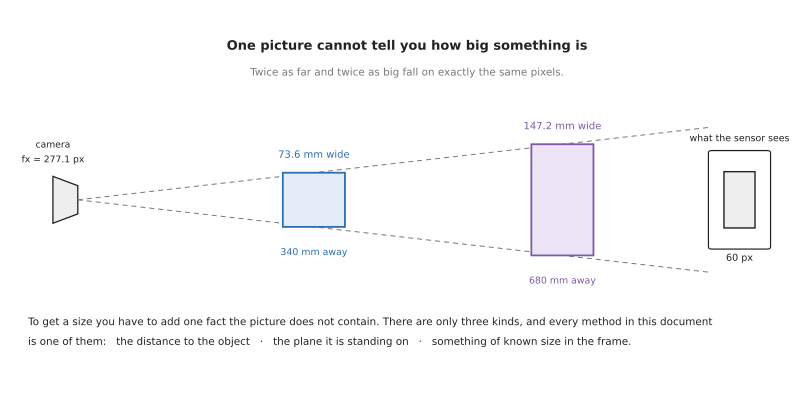
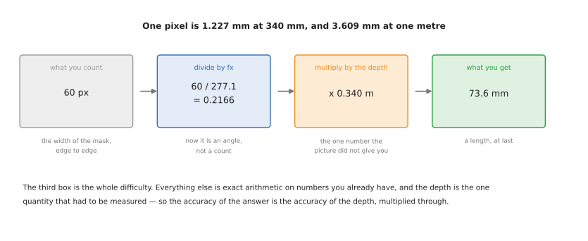
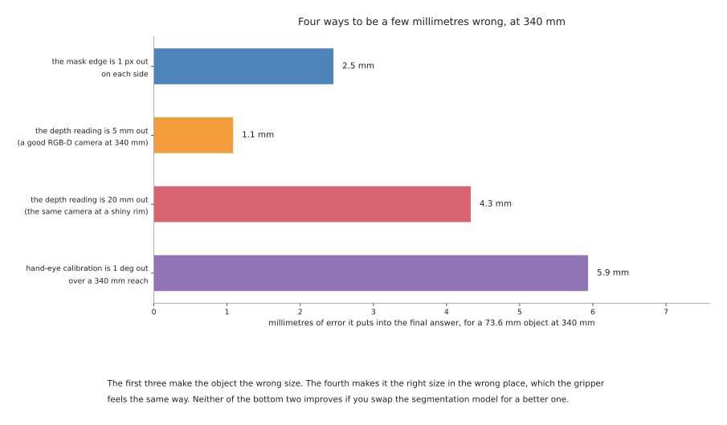

# Measuring the object: from pixels to millimetres

The [previous document](../06_object-segmentation/01_overview.md) ends with the
robot knowing which pixels the object is on. This one turns that into a size: how
wide, how tall, how deep, and which way it is turned. It covers the sensors, the
geometry, the models you can download, the frameworks, and — for each — where it
fits and where it does not.

The reason this is a separate document, rather than the last paragraph of the
previous one, is a fact that catches almost everybody once. **A picture contains
no sizes.** A perfect mask, correct to the pixel, still does not say whether the
object is seven centimetres across or seventy. Every technique here is a
different way of supplying the missing fact, and knowing which fact you are
supplying is most of the skill.

## Who this is for, and what it is for

This is for someone who has a camera working, can find the object in the picture,
and now has to hand the arm a number in millimetres. It assumes you have read the
[camera area](../05_camera/01_basics.md) or know what the four lens numbers are.
Everything else is explained where it appears.

As with its companion, every technique carries five jobs it suits and five it does
not, every licence is named, and everything says whether it runs on a Mac without
an NVIDIA graphics card.

One more thing shapes this document. Accuracy claims in this field are quoted far
more often than they are met. Where a number appears here, it says what conditions
it was measured under, because "one millimetre accuracy" from a data sheet and one
millimetre on your bench are rarely the same millimetre.

## Contents

1. [Why one picture has no size](#1-why-one-picture-has-no-size)
2. [The one calculation underneath everything](#2-the-one-calculation-underneath-everything)
3. [The three ways to supply the missing fact](#3-the-three-ways-to-supply-the-missing-fact)
4. [Where the millimetres go](#4-where-the-millimetres-go)
5. [Sensors that measure distance](#5-sensors-that-measure-distance)
6. [Geometry you write yourself](#6-geometry-you-write-yourself)
7. [Depth from a single picture](#7-depth-from-a-single-picture)
8. [Stereo matching](#8-stereo-matching)
9. [Pose estimation, when you have a model](#9-pose-estimation-when-you-have-a-model)
10. [Reconstruction, when you do not](#10-reconstruction-when-you-do-not)
11. [Calibration, which decides all of it](#11-calibration-which-decides-all-of-it)
12. [Frameworks and libraries](#12-frameworks-and-libraries)
13. [Datasets and benchmarks](#13-datasets-and-benchmarks)
14. [What runs on an Apple Silicon Mac](#14-what-runs-on-an-apple-silicon-mac)
15. [Putting it in ROS 2](#15-putting-it-in-ros-2)
16. [The comparison grid](#16-the-comparison-grid)
17. [What to actually reach for](#17-what-to-actually-reach-for)
18. [Where to read more](#18-where-to-read-more)

---

## 1. Why one picture has no size

A camera turns directions into pixels. Two objects lying along the same direction
land on the same pixels, whatever their size, as long as the bigger one is
proportionally further away. The picture below is that statement drawn out, using
the repo's own camera.



An object 73.6 mm wide at 340 mm and an object 147.2 mm wide at 680 mm both fill
exactly sixty pixels. No amount of image processing separates them, because there
is nothing in the image to separate. The information was lost by the lens, not by
the software.

This has a consequence worth stating plainly, because it is the root of a lot of
wasted effort. **Any method that gives you a size from one ordinary photograph has
assumed something.** Sometimes the assumption is reasonable and stated. Sometimes
it is buried in a trained model that learned, from its training set, that things
which look like mugs are about the size of mugs. That is a useful prior and it is
not a measurement, and the difference shows up the first time you point it at a
doll's-house mug.

## 2. The one calculation underneath everything

Every camera measurement in this document reduces to the same two steps. Divide by
the focal length to turn a pixel count into an angle. Multiply by the distance to
turn an angle into a length.



In code that is two lines, and the [camera
area](../05_camera/04_one-box-code.md) runs them on a real picture:

```python
size_across = depth / fx          # how many metres one pixel covers, at that depth
width = pixels_across * size_across
```

With the repo's camera, where `fx` is 277.1 pixels, one pixel covers 1.227 mm at
340 mm and 3.609 mm at one metre. Both numbers are worth remembering, because they
set the floor on what you can measure. If your object is 40 mm across at a metre,
it is eleven pixels wide, and a one-pixel error at each edge is an eighteen per
cent error in the answer.

The first step is exact. The second step is where every error in this document
enters, because the distance is itself a measurement.

## 3. The three ways to supply the missing fact

There are only three, and everything else is a variation on one of them.

**Measure the distance.** Use a sensor that reports how far away each pixel is: a
stereo pair, a structured-light projector, a time-of-flight sensor, or a laser
scanner. This is the most direct route and the one most robot cells take. Section
5 is about these sensors and what they actually achieve.

**Know the surface the object sits on.** If the object is standing on a table, and
you know where the table is, then you know the distance to the bottom of the
object without measuring it. This is how the [glass-picking case
study](../09_one-arm-training/07_case-study/01_place-glass.md) measures a glass
that a depth camera cannot see at all. It costs nothing, it needs no extra
hardware, and it fails the moment the object is not on the plane you assumed.

**Put something of known size in the picture.** A printed marker — ArUco, AprilTag,
ChArUco — of known dimensions gives the scale directly, because you know how big
it really is and you can see how big it appears. This is what photogrammetry does
with a scale bar, and it is the only way to get a true size out of a single
ordinary camera moved around an object.

The three are not exclusive and good systems use two of them, so that one can
check the other.

| The fact you add | How you get it | Costs | Breaks when |
| --- | --- | --- | --- |
| the distance to each pixel | a depth sensor | the sensor, and its failure modes on shiny and clear things | the surface returns no reading |
| the plane it stands on | measure the table once | nothing | the object is tilted, stacked or held |
| something of known size in view | a printed marker | putting the marker there | the marker is hidden, or not coplanar with the object |

## 4. Where the millimetres go

Before reaching for a better model it is worth knowing what the error actually
consists of. The chart below works it out for a 73.6 mm object at 340 mm, on the
repo's camera, with each cause acting on its own.



Two things in it are worth pulling out.

A hand-eye calibration that is one degree out costs 5.9 mm at a 340 mm reach — more
than twice what a one-pixel segmentation error costs. Calibration is the least
glamorous item in this document and it is usually the largest term in the budget.
Section 11 is about it.

A depth reading that is 20 mm out — which is what a consumer depth camera does at
the rim of a shiny object — costs 4.3 mm in the width. Notice that this is a
*width* error caused by a *depth* error: the depth multiplies through the whole
measurement, so a sensor that is reliable in the middle of a flat face and poor at
the edges gives you an object of the wrong size, not merely the wrong distance.

Neither of these improves if you swap the segmentation model for a better one,
which is the most common wrong response to a measurement that is off.

## 5. Sensors that measure distance

If you are going to measure the distance rather than infer it, this is what you
can buy. The numbers below are the manufacturers' own published figures, checked
against their data sheets in September 2026, and they are specifications rather
than what you will get on a bad day.

| Sensor | How it works | Published accuracy | Roughly |
| --- | --- | --- | --- |
| [RealSense D405](https://www.realsenseai.com/products/stereo-depth-camera-d405/) | active stereo, close range | ±2% at 50 cm, works from 7 cm | a few hundred pounds |
| [RealSense D435i](https://www.realsenseai.com/products/depth-camera-d435i/) | active stereo, general purpose | under 2% at 2 m; RMS about 2 mm at 1 m | a few hundred pounds |
| [Orbbec Gemini 335L](https://store.orbbec.com/products/gemini-335l) | active stereo, IP65 | 0.8% at 2 m, 1.6% at 4 m | a few hundred pounds |
| [Orbbec Femto Bolt](https://www.orbbec.com/products/tof-camera/femto-bolt/) | time of flight | systematic error under 11 mm plus 0.1% of distance | a few hundred pounds |
| [Zivid 2+](https://www.zivid.com/) | structured light | **±0.2 mm on a 100 mm distance at 1 m** | quote only, thousands |
| [Photoneo PhoXi L](https://photoneo.com/products/phoxi-scan-l/) | structured light | point-to-point 0.524 mm, temporal noise 0.19 mm | quote only, thousands |
| [Keyence LJ-X8000](https://www.keyence.com/products/measure/laser-2d/lj-x8000/) | laser profile | single-digit micrometres per point | quote only, thousands |

The gap between rows four and five of that table is the whole story of this
field. A consumer depth camera gets you to a few millimetres; an industrial
scanner gets you to a fifth of a millimetre and costs twenty times as much. Which
you need is decided by the tolerance of the job, and most table-top robot jobs are
genuinely happy in the first group.

Two pieces of news from 2025 and 2026 matter if you are choosing hardware now.
Intel spun RealSense out as an independent company in July 2025, and on 22
September 2026 Cognex agreed to acquire it for $500 million, with the deal
expected to close in the last quarter of 2026 — the terms are in [Cognex's own
filing with the Securities and Exchange
Commission](https://www.sec.gov/Archives/edgar/data/0000851205/000085120526000071/cgnx-20260922.htm). The
code has moved with it: `IntelRealSense/librealsense` now redirects to
[`realsenseai/librealsense`](https://github.com/realsenseai/librealsense), which is
still Apache-2.0 and still actively developed. The practical effect is that the
cheap hobbyist depth camera and the expensive industrial vision vendor are about
to be the same company.

### 5.1 How the four sensing principles fail

Every one of these sensors has a characteristic failure, and knowing which one you
are buying matters more than the accuracy figure.

**Passive stereo** matches features between two ordinary cameras. It works in
sunlight and costs almost nothing, and it fails completely on a blank wall,
because there is nothing to match.

**Active stereo** — the RealSense and Orbbec Gemini families — projects a speckle
pattern so that a blank surface has texture to match. That fixes the textureless
case and leaves the others: the pattern goes straight through transparent things,
bounces away from mirrored ones, and is washed out by strong sunlight.

**Structured light** — Zivid, Photoneo — projects a coded pattern and reads it with
one camera. It is the most accurate of the four by a wide margin. Its particular
weakness is motion: the pattern is captured over several exposures, so anything
that moves during the scan smears.

**Time of flight** times the light's return, so there is no matching problem at
all and blank surfaces are fine. Its particular weakness is multipath: light that
bounces off a mirror or a polished surface on its way back arrives late, is added
to the direct return, and produces a confidently wrong distance. It also produces
"flying pixels" — points floating in mid-air at the edges of objects.

All four share one blind spot. Semi-transparent materials — frosted glass, some
plastics, skin — scatter light beneath the surface, which delays the return for
time of flight and bends the pattern for the triangulating methods.

Five jobs a depth sensor suits:

- measuring opaque, matt objects, which is most of what a factory handles
- finding the work surface, which nearly every other technique then builds on
- obstacle avoidance, where approximate geometry is enough
- bin picking, where you need the shape of a pile and not the identity of it
- giving the scale that a colour camera cannot supply

Five jobs it cannot do:

- glass, clear plastic, and anything transparent
- polished metal, chrome and mirrors
- matt black surfaces, which absorb the projected pattern
- objects smaller than the sensor's resolution at that range
- measuring to better than a millimetre with anything in the consumer group

### 5.2 Measuring by touch

Touch is the other way to get a distance, and it is worth remembering that it is
the most accurate instrument an arm has. A robot's own joint encoders locate the
tool to a few hundredths of a millimetre, so a contact detected by a
force-torque sensor is a far better measurement than any camera in the table above.

In ROS 2 the pieces are the
[`force_torque_sensor_broadcaster` and `admittance_controller`](https://control.ros.org/rolling/doc/ros2_controllers/doc/controllers_index.html)
in [ros2_controllers](https://github.com/ros-controls/ros2_controllers)
(Apache-2.0). Section 6.7 covers what it is good for.

## 6. Geometry you write yourself

These are the methods with no model behind them. Between them they cover most of
what a table-top arm actually needs, they run in microseconds, and their failure
modes are ones you can reason about rather than discover.

### 6.1 A known depth, and the two-line calculation

**What it is.** Section 2, applied directly: take the mask, count its width in
pixels, read the depth at the object, and multiply. This is the baseline every
other method is compared against.

**What it costs.** A depth sensor, and care about *which* depth you read. The
depth at the centre of the object is the front face, not the middle, so an object
50 mm deep measured this way is reported 25 mm too near. For a width measurement
that hardly matters; for a grasp it can.

Five jobs it suits:

- boxes, blocks and flat-faced parts, measured face-on
- any object where a few per cent is good enough
- a first implementation, to find out what accuracy the rest of the system needs
- checking a more elaborate method, since it is easy to get right
- objects large enough that a pixel is a small fraction of them

Five jobs it cannot do:

- small objects far away, where the pixel count is too low to be precise
- transparent or mirrored objects, which return no usable depth
- measuring the dimension pointing away from the camera, which is invisible
- objects seen at an angle, where the apparent width is foreshortened
- anything needing better than about a millimetre with a consumer sensor

### 6.2 The plane the object stands on

**What it is.** Instead of measuring the distance to the object, measure the
distance to the table once, and use the fact that the object is standing on it.
The camera ray through the bottom of the object meets the table at a known point,
which gives the distance, which gives the scale.

**Why this rather than a depth reading.** Because it works on objects the depth
sensor cannot see. A wine glass returns no depth at all, but it stands on a table
that does, so its height and its diameter at every height can be measured from a
plain side-on picture. The [glass case
study](../09_one-arm-training/07_case-study/01_place-glass.md) is built entirely
on this.

**What it costs.** The assumption. If the object is not on the plane — if it is
tilted, stacked on another object, or in the gripper — the answer is confidently
wrong.

Five jobs it suits:

- glassware, and anything else transparent, standing on a surface
- shiny metal parts, which also defeat depth sensors
- any table-top cell, as a cheap check on the depth sensor's answer
- measuring with an ordinary colour camera, with no depth sensor at all
- measuring the height of an object, which is exactly the distance from the plane

Five jobs it cannot do:

- objects held in the gripper, which are no longer on the plane
- stacked or leaning objects
- scenes where the support surface is not flat or not visible
- objects hanging, on a hook or a conveyor
- anything where the plane's own measurement has drifted, which it does if the
  camera is knocked

### 6.3 A marker of known size

**What it is.** Put a printed square of known dimensions in the scene. Because you
know it is, say, 40 mm across and you can see how many pixels across it is, you
have the scale everywhere on that plane. The common families are
[ArUco](https://github.com/opencv/opencv_contrib/tree/4.x/modules/aruco), which
ships with OpenCV's contrib modules under the [Apache 2.0
licence](https://github.com/opencv/opencv_contrib/blob/4.x/LICENSE), and
[AprilTag](https://github.com/AprilRobotics/apriltag), which is
[BSD-2](https://github.com/AprilRobotics/apriltag/blob/master/LICENSE.md) and
generally the more robust of the two at long range and shallow angles. ChArUco is
a chessboard with ArUco markers in the white squares, and is the usual choice for
calibration because it gives many precise corners.

**What it costs.** Somebody has to put the marker there and keep it flat and
clean. A bent or partly obscured marker gives a pose that is wrong in a way that
looks plausible.

Five jobs it suits:

- calibration of every kind, which is where markers earn their keep
- giving a robot a reliable reference frame on a table or a fixture
- scaling a photogrammetric reconstruction, which otherwise has no size at all
- locating a pallet, a tray or a fixture whose contents you then measure
- checking that a camera has not moved, by watching a fixed marker

Five jobs it cannot do:

- measure an object that is not coplanar with the marker, without more geometry
- work when the marker is hidden by the very object you are measuring
- survive a dirty, wet or scratched environment
- operate where you cannot attach anything to the scene, such as a customer's
  goods
- give a good angle estimate from a single small square, which is famously
  unstable near face-on

### 6.4 The smallest rectangle round the mask

**What it is.** Given the object's pixels, `cv2.minAreaRect` finds the smallest
*rotated* rectangle that contains them, returning a centre, a width, a height and
an angle. It is the standard way to get a length, a width and an orientation from
a mask in one call, and it is documented among [OpenCV's contour
features](https://github.com/opencv/opencv/blob/4.x/doc/py_tutorials/py_imgproc/py_contours/py_contour_features/py_contour_features.markdown).

**Why this rather than the bounding box from a detector.** A detector's box is
axis-aligned, so for anything long and turned it reports a size that belongs to no
real dimension of the object. The rotated rectangle reports the object's own
length and width.

Five jobs it suits:

- long thin parts lying at any angle: screwdrivers, bars, cable segments
- deciding which way to turn the gripper, from the rectangle's angle
- measuring rectangular things, where the fit is exact
- a quick length and width for sorting by size
- anything flat, viewed from directly above

Five jobs it cannot do:

- round objects, where the angle it returns is meaningless noise
- concave shapes, where the rectangle contains a great deal that is not object
- objects seen at an angle, where the rectangle measures the projection
- giving any information about the third dimension
- objects whose mask is broken into pieces

### 6.5 An oriented box round the point cloud

**What it is.** The 3D version of the same idea. Take the object's points, find
the directions they vary along most — which is principal component analysis — and
fit a box aligned to those directions. Open3D does it with
[`get_oriented_bounding_box`](https://www.open3d.org/docs/release/python_api/open3d.geometry.OrientedBoundingBox.html),
and PCL with its [moment of
inertia](https://pointclouds.org/documentation/tutorials/moment_of_inertia.html)
estimator.

**What it costs.** The result is only as good as the points. A camera sees one
side of an object, so the cloud is a shell, and a box fitted to a shell is
systematically too small in the direction pointing away from the camera. Fitting a
box to two views taken from different sides fixes most of this.

Five jobs it suits:

- getting all three dimensions at once, when the point cloud is good
- finding which way a part is lying, for planning an approach
- boxes, cartons and pallets, where the fit is genuinely a box
- feeding a collision model to a motion planner, where a slightly large box is
  safe
- comparing two objects for size without knowing what either is

Five jobs it cannot do:

- measure the hidden side, without a second viewpoint
- fit anything round or irregular tightly — a box round a mug is mostly air
- work on transparent objects, which have no points
- distinguish orientation for a symmetric object, where the axes can swap
  arbitrarily between frames
- work with fewer than a few hundred points, below which the axes are noise

### 6.6 Silhouettes of a solid of revolution

**What it is.** A special case that is worth knowing because it is unreasonably
powerful when it applies. An object made on a lathe or a potter's wheel — a glass,
a bottle, a bearing, a turned leg — is a shape spun about an axis. Its outline
looks the same from every side, and the width of that outline at any height *is*
the diameter there. So one side-on picture gives the complete profile of the
object.

This is the technique the [glass case
study](../09_one-arm-training/07_case-study/01_place-glass.md) is built on, and it
turns "measure this object" into "measure one silhouette".

Five jobs it suits:

- glassware, bottles, cans, cups and jars
- turned and machined parts: bushes, bearings, spacers, pulleys
- measuring a full profile rather than a bounding size, which is what a shaped
  grip needs
- objects a depth sensor cannot see, since only the outline is needed
- inspection, where the profile can be compared against a nominal one

Five jobs it cannot do:

- anything not round: a mug with a handle breaks the assumption exactly at the
  handle
- objects lying on their side, where the axis is no longer vertical
- objects whose silhouette is hidden behind another object
- internal features, which a silhouette cannot show
- telling a solid from a hollow one, which is why the glass study weighs the
  glass instead

### 6.7 Measuring by touching it

**What it is.** Move the gripper until a contact sensor fires, and record where
the arm was. It is the oldest measuring method in robotics and it is still the
most accurate one available to an arm, because it removes the camera from the
chain entirely and leaves only the arm's own repeatability, which on an industrial
arm is a few hundredths of a millimetre.

**Why this rather than a camera.** Because for transparent, mirrored and matt
black objects, touch works and vision does not. And because a contact reading is a
fact about the world, where a camera reading is an inference about it.

Five jobs it suits:

- finding the exact top of a surface before placing something on it
- measuring a feature the camera cannot see, such as the inside of a bore
- glass and polished metal, which defeat every optical method here
- verifying an optical measurement before committing to a delicate action
- establishing the work surface's height at the start of a job

Five jobs it cannot do:

- measure quickly — each touch takes seconds, where a picture takes milliseconds
- measure anything soft, which moves before the sensor fires
- measure an object that is not fixed in place, which slides away
- survey a scene, since you must already know roughly where to touch
- measure anything fragile, which is why the glass study touches only with a
  known, capped force

## 7. Depth from a single picture

There is a family of models that takes one ordinary photograph and returns a
depth for every pixel. They are remarkable, they are widely misunderstood, and
using one to measure an object is usually a mistake. This section explains why,
because the mistake is easy to make and hard to notice.

### 7.1 Relative depth and metric depth are not the same thing

Most of these models predict **relative** depth, also called affine-invariant
depth. That means the output preserves only the *order* of distances: it tells you
that the mug is nearer than the wall, and it is defined up to an unknown scale and
an unknown offset. The same model gives the same answer for a doll's house and a
real room.

Models are trained this way on purpose. Dropping the requirement to be metric lets
them learn from many datasets at once, none of which agree about units, and that
is exactly what buys their famous ability to work on any picture. The
generalisation and the uselessness for measurement have the same cause.

**Metric** models predict actual metres. They are the ones you would need, and
they generalise noticeably worse, for the reason just given.

### 7.2 The models, and their licences

The weights licence is the one that binds you, and it is often not the code
licence. Read this table as: code first, then weights, then whether the output is
in real units.

| Model | Code | Weights | Metric? | Where |
| --- | --- | --- | --- | --- |
| Depth Anything 3 | Apache-2.0 | **split**: Small, Base, `DA3METRIC-LARGE`, `DA3MONO-LARGE` are Apache-2.0; Large, Giant, Nested are **CC BY-NC 4.0** | `DA3METRIC-LARGE` yes | [ByteDance-Seed/Depth-Anything-3](https://github.com/ByteDance-Seed/Depth-Anything-3) |
| Depth Anything V2 | Apache-2.0 | **Small Apache-2.0; Base, Large, Giant CC BY-NC 4.0** | fine-tunes only | [DepthAnything/Depth-Anything-V2](https://github.com/DepthAnything/Depth-Anything-V2) |
| Metric3D v2 | BSD-2-Clause | no separate licence stated | yes | [YvanYin/Metric3D](https://github.com/YvanYin/Metric3D) |
| MoGe-2 | MIT | MIT | yes | [microsoft/MoGe](https://github.com/microsoft/MoGe) |
| UniDepth v2 | **CC BY-NC 4.0** | non-commercial | yes | [lpiccinelli-eth/UniDepth](https://github.com/lpiccinelli-eth/UniDepth) |
| Depth Pro (Apple) | Apple sample-code licence, no patent grant | same | yes, and needs no focal length | [apple/ml-depth-pro](https://github.com/apple/ml-depth-pro) |
| Marigold | Apache-2.0 | RAIL++-M | no, relative only | [prs-eth/Marigold](https://github.com/prs-eth/Marigold) |
| ZoeDepth, MiDaS | MIT | — | ZoeDepth yes | **both archived — do not start here** |

Two things to take from that table. `DA3METRIC-LARGE` and MoGe-2 are the strongest
metric models with genuinely permissive weights, and that is a recent development:
until Depth Anything 3, the useful sizes of the most popular model were all
non-commercial. And the Apache-2.0 badge on the Depth Anything repositories refers
to the *code*; the large weights are not Apache, which is the single most common
licence misreading in this area.

### 7.3 What accuracy they actually achieve

The published tables and the independent evaluations do not agree, and the
difference is large enough to change decisions.

On their own benchmarks these models look superb. Metric3D v2 reports an absolute
relative error of 0.045 on NYUv2, and Depth Anything V2 reports 0.056. An absolute
relative error of 0.05 means five per cent of the true distance, so at one metre
that is **fifty millimetres**.

Read that again, because it is the point. The best published number on the
friendliest benchmark is ±50 mm at a metre. A three-hundred-pound RealSense gives
two to five.

Independent evaluations are worse still. A 2025 benchmark that measured these
models against ChArUco ground truth outside their training distribution found
Depth Anything V2 at 21.1% relative error and Depth Pro at 33.6% — and a plain
geometric projection baseline beat three of the four learned models. A robotics
paper measuring off-the-shelf Depth Anything for grasping found a mean absolute
error of 121 to 141 mm, and concluded in its own words that these models are
"insufficiently precise for tasks involving physical interaction".

The same paper got to 13.4 mm by aligning the model's output against a handful of
real measured points, which is the honest way to use these things: as a dense
guess that a few real measurements pin down.

Five jobs monocular depth suits:

- recovering scale for a reconstruction that has none, roughly, before refining it
- separating foreground from background, where ordering is all you need
- filling holes where a real depth sensor returned nothing
- checking that a scene looks the way you expect, as a sanity test
- working from an archive of ordinary photographs, where no other option exists

Five jobs it cannot do:

- measure an object to millimetres, which is this document's whole subject
- give trustworthy answers on objects unlike its training data
- measure transparent or reflective things, which it confidently hallucinates
- provide any error bar, so you cannot tell a good prediction from a bad one
- replace a depth sensor, at any price point

## 8. Stereo matching

A stereo pair of ordinary cameras a known distance apart gives metric depth by
triangulation, and the quality depends entirely on how well the two pictures are
matched. That matching is where learned models have genuinely helped.

| Model | Licence | Notes |
| --- | --- | --- |
| [RAFT-Stereo](https://github.com/princeton-vl/RAFT-Stereo) | **MIT** | the sensible default; its custom CUDA kernel is optional, so it runs without one |
| [IGEV / IGEV++](https://github.com/gangweiX/IGEV) | MIT | stronger on the KITTI benchmarks |
| [FoundationStereo](https://github.com/NVlabs/FoundationStereo) | **NVIDIA, non-commercial** | very strong; a separate commercial model is available from NVIDIA on request |
| CREStereo | Apache-2.0 | last touched in 2023, effectively dead |
| OpenCV `StereoSGBM` | Apache-2.0 | the classical baseline everything is measured against, and no GPU needed |

Five jobs stereo matching suits:

- outdoor and brightly lit scenes, where projected-pattern sensors wash out
- large working volumes, where you can afford a wide baseline
- textured objects, which give the matcher something to work with
- situations where you want to choose your own cameras and resolution
- refining a cheap depth sensor's output using the same two images

Five jobs it cannot do:

- textureless surfaces, without projecting a pattern — at which point it is active
  stereo
- transparent and mirrored objects, whose apparent position differs between the
  two views
- very close range, where the two cameras see too little in common
- thin structures, which fall between matched patches
- give better accuracy than the baseline and the calibration allow, regardless of
  the model

## 9. Pose estimation, when you have a model

If you already have a CAD model of the object, the measuring problem changes
shape. You no longer need to work out how big it is — you know. What you need is
where it is and which way it is turned, which is the 6-DoF pose from
[section 1 of the segmentation document](../06_object-segmentation/01_overview.md#1-four-answers-and-which-one-you-need).

This is the mature end of the field, and it is also where the licences are worst.
Read the table as: whether you need a CAD model, what the licence permits, and
whether it will run without an NVIDIA card.

| Method | Needs a model? | Licence | Commercial use | Runs without CUDA |
| --- | --- | --- | --- | --- |
| [HappyPose](https://github.com/agimus-project/happypose) (CosyPose + MegaPose) | yes | **BSD-2-Clause** | **yes** | **yes, documented CPU path** |
| [MegaPose](https://github.com/megapose6d/megapose6d) | yes | Apache-2.0 | yes | GPU assumed |
| [FoundationPose](https://github.com/NVlabs/FoundationPose) | CAD or a few reference images | **NVIDIA, non-commercial** | **no** | no, needs nvdiffrast and pytorch3d |
| [GigaPose](https://github.com/nv-nguyen/gigapose) | yes, as templates | MIT | yes | GPU assumed |
| [SAM-6D](https://github.com/JiehongLin/SAM-6D) | yes | **no licence file at all** | **no** | no |
| [DOPE](https://github.com/NVlabs/Deep_Object_Pose), [CenterPose](https://github.com/NVlabs/CenterPose) | trained per object | **NVIDIA, non-commercial** | **no** | no |
| [OnePose++](https://github.com/zju3dv/OnePose_Plus_Plus) | a reference video | **registration-gated** since 2026 | conditional | no |
| [Gen6D](https://github.com/liuyuan-pal/Gen6D) | reference images | **GPL-3.0** | copyleft | no |

Three things in that table are worth saying plainly.

**HappyPose is the practical answer for most people.** It is BSD-2-Clause, it is
actively developed, it packages CosyPose and MegaPose behind one interface, it has
a [ROS 2 wrapper](https://github.com/agimus-project/happypose_ros), and it is the
only entry here with a documented path that does not need an NVIDIA card.

**FoundationPose is the best-known and you probably cannot ship it.** Its licence
restricts use to research and evaluation. It is genuinely excellent and it is not
a product component.

**SAM-6D has no licence file at all**, which is legally worse than a
non-commercial licence: with no licence, default copyright applies and you have no
permission to use it for anything.

The benchmark for all of this is the [BOP
challenge](https://bop.felk.cvut.cz/), whose leaderboards are the place to look
for current standings. One caution about reading them: the headline number, AR, is
a recall rate — the fraction of object instances localised within a set of pose
error thresholds. It is not a measurement in millimetres and cannot be converted
into one.

Five jobs model-based pose suits:

- assembly, where the part must go in the right way round
- bin picking of a known part, which is the industry's single biggest application
- putting an object down in a specified orientation
- inspection, by comparing a fitted pose against a nominal one
- grasp planning against a known model, where good grasps can be precomputed

Five jobs it cannot do:

- objects you have no model of, which rules out most of the natural world
- deformable objects, whose shape is not a rigid transform of a model
- objects that vary between instances, such as produce or castings
- measuring an unknown size, since it assumes the size is known
- telling you which of several identical parts you are looking at

## 10. Reconstruction, when you do not

If you have neither a depth sensor nor a model, you can build a 3D model from many
pictures. This is photogrammetry, and its modern relatives are neural radiance
fields and Gaussian splatting.

The table gives the accuracy each method achieves on the DTU benchmark, in
millimetres of Chamfer distance, on objects roughly 20 to 30 cm across
photographed by about 50 calibrated cameras in a laboratory. Treat these as a best
case rather than a field result.

| Method | DTU error | Licence |
| --- | --- | --- |
| Neuralangelo | 0.61 mm | NVIDIA, non-commercial, and locked to NVIDIA processors |
| [NeuS](https://github.com/Totoro97/NeuS) | 0.84 mm | **MIT — the permissive one in this family** |
| PGSR | 0.47 mm | non-commercial |
| 2DGS, GOF, RaDe-GS | 0.68 to 0.80 mm | Inria licence, non-commercial |
| [3D Gaussian Splatting](https://github.com/graphdeco-inria/gaussian-splatting) | 1.96 mm | **Inria licence, research only** |
| [COLMAP](https://github.com/colmap/colmap) | — | **BSD-3** — classical photogrammetry, still the backbone |

### 10.1 Two warnings

**The licensing here is unusually bad.** Almost the entire Gaussian-splatting
surface-reconstruction ecosystem carries Inria's research-only licence, and the
variants inherit it verbatim. If you intend to ship something, the options are
COLMAP, [OpenMVG](https://github.com/openMVG/openMVG) (MPL-2.0), NeuS (MIT),
[Nerfstudio](https://github.com/nerfstudio-project/nerfstudio) (Apache-2.0) and
[Brush](https://github.com/ArthurBrussee/brush) (Apache-2.0). Note that
[OpenMVS](https://github.com/cdcseacave/openMVS) is AGPL-3.0, whose network clause
can oblige you to publish your own source if you run it behind a service.

**A Gaussian splat is not a surface.** The centres of the Gaussians are not points
on the object; they are blob centres optimised to make renders look right. Plain
3D Gaussian Splatting comes last in that table at 1.96 mm on a 25 cm laboratory
object — about 0.8% — which is worse than a RealSense. The surface-oriented
variants do much better and are the non-commercial ones.

### 10.2 And none of it has a scale

Every method in this section reconstructs up to an unknown scale, because a
pinhole camera measures directions and the reprojection error is unchanged if you
scale the whole scene and all the camera positions together. The DTU numbers above
are in millimetres only because DTU supplies external ground truth to register
against.

For a robot there is a neat answer that most write-ups miss. **The arm already
knows where the camera was.** If the camera is on the wrist, every viewpoint's
position is known in millimetres from the joint encoders, so feeding those known
camera positions into the reconstruction makes the result metric with no markers
in the scene at all. The accuracy is then bounded by your hand-eye calibration,
which is the next section.

Five jobs reconstruction suits:

- building a model of an object you will then track with the methods in section 9
- measuring something too large or awkward for a single view
- capturing shape where no CAD exists, such as a casting or a natural object
- inspection against a nominal model, once the scale is fixed
- documentation and simulation assets

Five jobs it cannot do:

- measure anything, until the scale has been supplied from outside
- work quickly — this is minutes to hours, not milliseconds
- handle transparent, shiny or textureless objects, which defeat the matching
- run unattended in a cell, in most current implementations
- be shipped commercially, for most of the newest and best methods

## 11. Calibration, which decides all of it

Calibration is the least interesting subject in this document and it is usually
the largest term in the error budget. The chart in [section
4](#4-where-the-millimetres-go) makes the point numerically: a hand-eye
calibration one degree out costs almost 6 mm at a 340 mm reach, more than twice
what a one-pixel segmentation error costs.

There are two calibrations and they are separate.

**Intrinsic calibration** finds the lens numbers — `fx`, `fy`, `cx`, `cy` and the
distortion — by photographing a known pattern from many angles. A good result has
a reprojection error below one pixel; a very good one is around 0.1 to 0.3 pixels.
A ChArUco board is now preferred to a plain chessboard, because a partly hidden
ChArUco board simply returns fewer corners while a partly hidden chessboard breaks
the row and column indexing entirely.

**Hand-eye calibration** finds where the camera is relative to the arm. OpenCV's
`calibrateHandEye` offers five methods — Tsai, Park, Horaud, Andreff and
Daniilidis — and the practical guidance from OpenCV's own issue discussions is that
**Park converges reliably in the widest range of cases**. Published results for
careful hand-eye calibration land around 0.9 mm of translation error and a quarter
of a degree of rotation.

| Tool | Licence | State |
| --- | --- | --- |
| [OpenCV `calib3d`](https://github.com/opencv/opencv) | Apache-2.0 | the reference implementation of both |
| [easy_handeye2](https://github.com/marcoesposito1988/easy_handeye2) | LGPL-3.0 | the usual ROS 2 choice, actively maintained |
| [mrcal](https://github.com/dkogan/mrcal) | Apache-2.0 | unusual and valuable: it propagates calibration *uncertainty*, not just a point estimate |
| [moveit_calibration](https://github.com/moveit/moveit_calibration) | BSD-3 | its ROS 2 work sits on an unmerged branch; treat as semi-maintained |
| [Kalibr](https://github.com/ethz-asl/kalibr) | BSD | camera and IMU rigs; slow-moving |

The conclusion worth carrying away is one of proportion. With a consumer depth
camera at two to five millimetres, a one-millimetre hand-eye error is not your
problem. Fit a Zivid at 0.2 mm and that same one millimetre becomes the entire
error. **Buying a better sensor without recalibrating buys you nothing.**
