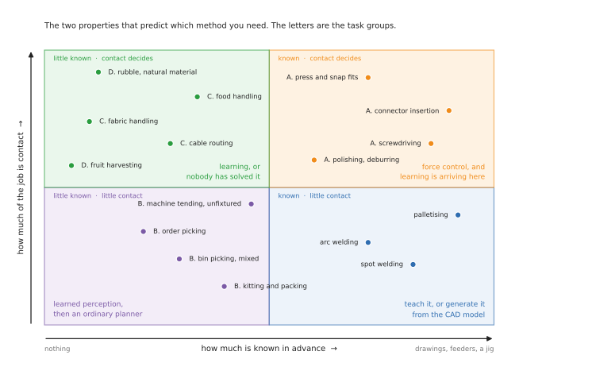
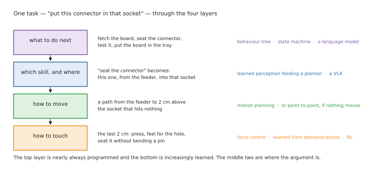
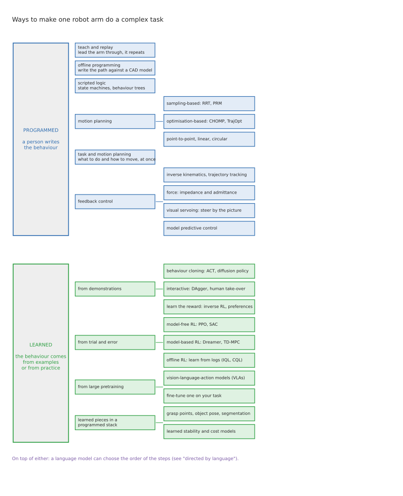

# Ways to programme or train one robot arm

There are perhaps a dozen genuinely different ways to make a robot arm do something
useful, and the first thing to understand is that they are not alternatives to one
another in the way that a list of them suggests. Some of these methods decide what
the arm should do next. Some decide how it should move from one place to another.
Some decide only what to do in the last millimetre, when the part the arm is
carrying has already touched the part it is being fitted into. Because they answer
different questions, a working robot system nearly always uses several of them at
the same time, and most of the arguments you will read about "planning versus
learning" turn out to be arguments between people who are talking about different
layers of the same machine without realising it.

This document is the map of that landscape. It sets out the jobs that arms are
actually bought to do, the layers that every arm system is built from, the family
tree of the methods themselves, and a grid that says which method suits which job.
The four companion documents then take the methods one at a time, and one of
them is a hands-on path if you would rather build than read.

## Who this is for, and what it is for

This is written for someone who can picture an arm moving, and who knows roughly
what a camera does and what a joint angle is, but who has not yet had to choose
between these approaches for a real project. You do not need to have used any of
them, and where a term is likely to be unfamiliar it is explained as it appears.

The folder also has a particular purpose behind it, and being explicit about that
changes quite a lot of what is in it. It is written for someone who wants to learn
this field well enough to be useful in it within about a year — well enough to talk
credibly about a robotics project, to scope one sensibly, to win service or
consulting work, or to start building something real over the next one to three
years as the hardware and the models get cheaper.

It is not a guide to building a production robot this month, and that difference
shows up in two ways throughout. The first is that every method carries a line
saying whether it is worth your time to learn right now, which is a genuinely
different question from whether the method is any good. Some excellent methods are
not worth your time, because they are research techniques that really need a team
and a budget behind them. Some distinctly unglamorous ones are very much worth your
time, because they are what people are actually paid to do. The second difference is
that wherever something has been announced but cannot actually be downloaded, or has
been demonstrated in a video but never deployed anywhere, this document says so
plainly. The gap between a press release and a working system is where most of the
wasted effort in this field ends up going.

**The short answer, before the long one.** There are two broad families. In
*programming*, a person writes down what the arm should do, in one form or another.
In *training*, the behaviour comes out of examples or out of practice instead of out
of somebody's head. Programming gives you precision, and it gives you a system you
can inspect and check line by line, which matters enormously in a factory; what it
cannot give you is any ability to cope with variety, because everything it knows had
to be written down in advance. Training is the other way round: it copes with
variety well, it needs a great deal of data to do so, and when it fails it cannot
tell you why. Every serious system therefore uses both, programming the parts of the
job that are easy to say out loud and training the parts that are not.

## The six documents

**This document — the map.** The tasks, the layers, the family tree, the grid of
which method suits which job, and an honest account of what is realistic to build in
the next year. Read it first. If you would rather start by building something, go
straight to [the learning path](04_learning-path.md) and come back here when a choice
needs making.

**[Programmed methods](02_programmed-methods.md).** The behaviour a person writes down:
teaching, offline programming, behaviour trees, motion planning, task and motion
planning, and feedback control. This is what runs in factories today.

**[Learned methods](03_learned-methods.md).** The behaviour that comes from data:
imitation learning, reinforcement learning, large pretrained policies, learned
components sitting inside an otherwise conventional system, and language models used
as planners. This is where most of the research is.

**[A learning path, in simulation](04_learning-path.md).** The practical companion to
the rest: five complete projects — tidy a desk, fit a connector, empty a bin, copy a
task from video of your own hand, assemble a kit — each built four times, starting
from code you write by hand and ending at the 2026 frontier. Every version has
cameras, motion, a grasp and an honest evaluation. Almost all of it runs on an
ordinary Mac.

**[Glossary](06_glossary.md).** Every term used in this folder, explained in plain
words and grouped by what it is about — the arm itself, seeing, moving, touching,
learning — followed by a table of every framework and whether it runs on a Mac. Look
things up here rather than reading it through.

**[What is changing, and why](05_what-is-changing.md).** The direction the field is
travelling in and the reasons behind it — why methods get displaced, the five forces
driving 2026, what each new capability actually lets you do, and how to tell a real
shift from a passing fashion. Read this when you want to understand the field rather
than any particular method.

There is also a companion folder, **[two-arm training](../08_two-arm-training/01_overview.md)**,
covering what changes when a second arm is added. That turns out to be considerably
more than you would guess, and none of it makes sense until the single-arm picture is
clear, so start here.

## Contents

1. [What an arm is actually asked to do](#1-what-an-arm-is-actually-asked-to-do)
2. [The five things that make a task hard](#2-the-five-things-that-make-a-task-hard)
3. [The four layers of an arm system](#3-the-four-layers-of-an-arm-system)
4. [The family tree](#4-the-family-tree)
5. [Which method for which task](#5-which-method-for-which-task)
6. [Three worked examples](#6-three-worked-examples)
7. [What is current, and what is fading](#7-what-is-current-and-what-is-fading)
8. [What each method costs you](#8-what-each-method-costs-you)
9. [What real systems actually do](#9-what-real-systems-actually-do)
10. [What you can realistically do in the next year](#10-what-you-can-realistically-do-in-the-next-year)
11. [How to read the numbers in this field](#11-how-to-read-the-numbers-in-this-field)
12. [Where this repo fits](#12-where-this-repo-fits)

---

## 1. What an arm is actually asked to do

Methods are far easier to compare once you have some real jobs in mind, so this
section sets out the jobs before anything else. They are arranged in four groups,
ordered by how much is known about the world in advance. That ordering is not
arbitrary, and it is worth saying why: how much you know in advance turns out to be
the single best predictor of which method you will end up using, better than the
industry you are in or the arm you have bought.

The picture below places all of these jobs on the two properties that do most of the
predicting. It is worth spending a minute on it before reading the tables, because
each of its four corners wants a genuinely different method, and the four groups
below are really just regions of that picture.

### The solved bulk, which comes before the four groups

Think of spot and arc welding, machine tending, palletising, painting and
dispensing, polishing a part that is clamped in a jig, or moving sample tubes
between laboratory instruments. What all of these have in common is that the
workpiece is held by a fixture, the geometry is known because it came off a drawing,
and the job is simply to be accurate and fast a million times in a row.

These tasks account for the great majority of the robots installed in the world, and
they are solved — solved by [the programmed methods](02_programmed-methods.md), and
solved well. Nothing in the learned-methods document improves on them. It is worth
saying that plainly right at the start, because a great deal of the writing about
robot learning carries an implication that the existing approaches are obsolete, and
in the places where robots actually earn their keep they are not remotely obsolete.
What *is* true is that these tasks are a shrinking share of what people now want
robots to do, and that is the reason the rest of this document exists.

### Group A: the parts are known, but the fit decides everything

Here you have the drawings, and the parts arrive neatly in feeders, and yet the job
still fails. The reason it fails is that success is settled in the last millimetre
by contact between two surfaces rather than by getting the arm to the right
position. This is where most of the difficulty in industrial robotics actually
lives, and it is a genuinely hard problem rather than a solved one.

| Task | What makes it hard |
| --- | --- |
| **Connector and harness insertion** | clearances under a millimetre, tighter than the arm's own repeatability, with the contact hidden from view |
| **Screwdriving** | engaging the thread without cross-threading, and knowing from the torque when it is properly seated |
| **Press-fits and snap-fits** | the force needed is large, the tolerance for being off-axis is small, and a failure damages the part |
| **Polishing and deburring** | holding a set contact force along a curved surface, faster than the arm can react |

### Group B: the objects are known, but their arrangement is not

In this group the catalogue of objects is fixed, or very nearly so, but nothing is
where you left it. The arm has to work out where things are before it can do
anything with them. This is the class of problem that learned perception unlocked,
and it is where machine learning is genuinely in production today rather than in a
demonstration video.

| Task | What makes it hard |
| --- | --- |
| **Bin picking of mixed items** | clutter, occlusion, and objects whose pose has to be worked out rather than known |
| **Order picking from shelves or totes** | thousands of product types, many of them deformable or shiny, at a rate per hour that matters commercially |
| **Kitting and packing** | many small motions, items starting in different places, a long sequence where one error spoils the tray |
| **Machine tending with unfixtured parts** | the part arrives roughly positioned, and the chuck needs it exactly positioned |

### Group C: the object has no fixed shape

Cloth, cable, food, foam, bags. The defining property of this group is that the
object's shape is decided by where you are holding it, which means there is no such
thing as "the object's position" in the way there is for a rigid block. You cannot
look up where a shirt is, because a shirt does not have a single answer to that
question.

| Task | What makes it hard |
| --- | --- |
| **Cable and harness routing** | the cable moves while you work, tension is invisible, and the task is long so failures compound |
| **Food handling** | every item differs, most are fragile, and hygiene rules constrain the gripper |
| **Garment and fabric handling** | effectively infinite configurations, and most of the object hidden under itself |

### Group D: the geometry is unknown and physics decides the outcome

This is the hardest class of all. There is no model of the object anywhere in the
system, and whether an attempt actually worked is often only known a moment after
the arm has let go.

| Task | What makes it hard |
| --- | --- |
| **Harvesting fruit and vegetables** | every specimen differs, the target is occluded by leaves, and it bruises |
| **Handling rubble, scrap or natural material** | no model of any piece, and errors accumulate |
| **Assembling something whose parts do not fit as drawn** | reality and the drawing disagree, and the arm has to find out by touching |

---

## 2. The five things that make a task hard

Five properties do most of the work in those tables, and placing a new task on these
five will tell you more about which method you need than any amount of reading about
the methods themselves. It is worth taking each in turn.

**How much is known in advance.** At one end of this scale sit fixtures, engineering
drawings and a fixed catalogue of parts; at the other sit a jumbled bin of objects
or a rough stone picked up off the ground. The programmed methods need this
knowledge in order to function at all, and where it exists they are excellent, which
is why the solved bulk above is solved.

**How much of the job involves contact.** Moving an arm through empty space is a
well-understood problem and a comparatively easy one to plan. Deciding what to do
while pressing one object against another is neither of those things, because the
outcome depends on friction and on contacts that are usually hidden from any camera
you could point at them. Insertion, polishing and folding are contact tasks in this
sense; welding and palletising are not, because the tool never has to feel its way.

**How many steps there are, and whether the order matters.** Driving a single screw
is one skill exercised once. Assembling and packing a component might be twenty
steps, and in a twenty-step job it is entirely normal for a small mistake at step
four to quietly ruin step nine, with nothing obviously wrong in between. Long tasks
therefore need something in the system that keeps track of where it has got to and
can recover when a step fails.

**How tight the tolerance is.** *Repeatability* is how precisely an arm returns to a
position it has been to before, and a good industrial arm manages about a tenth of a
millimetre. That sounds impressive until you try to seat an electrical connector
whose clearance is fifty microns — half of a tenth of a millimetre — because at that
point the arm's own error is larger than the gap it is aiming at. Once the tolerance
is tighter than the accuracy you can achieve, the task stops being a geometry
problem and becomes a feedback problem: the arm has to feel its way in rather than
calculate its way in.

**What a failure costs.** Failing to pick a strawberry costs you a retry. Scratching
a car body costs a great deal more than that. Tasks where failure is cheap and
easily repeated can be learned by practice, because practice means failing
repeatedly on purpose. Tasks where failure is expensive have to be verified before
they are allowed to run at all. This single property explains most of why industry
adopts new methods far more slowly than researchers expect it to.

---

## 3. The four layers of an arm system

An arm doing a real job has to answer four questions, over and over, and the useful
thing to notice is that "which method should I use" usually has a *different* answer
at each of the four. This is why comparing a motion planner with a
vision-language-action model is a bit like comparing a wheel with a car: they are
not competing, because they are answering different questions.

**What to do next** is the sequence of the job. For a circuit board it might be:
fetch the board, seat the connector, test it, and put the board in the tray.

**Which skill, and where** takes one of those steps and makes it concrete. "Seat the
connector" becomes *this* connector, taken from *that* feeder, and pushed into *that*
socket — which means that something in the system has to know where those three
things actually are at this moment.

**How to move** is the path from wherever the arm is now to where it needs to be,
arranged so that it does not hit anything on the way.

**How to touch** is the layer that actually decides whether the job succeeds:
pressing hard enough to seat the connector without bending a pin, feeling around for
the hole when the first attempt does not go in, and recognising from the force
reading that the part is properly home.

In practice the top layer is nearly always programmed, because a competent person
can write the sequence of a job down in a morning and there is little to be gained
from learning it. The bottom layer is increasingly learned, because nobody can write
down what to do in the last millimetre even though almost anybody can demonstrate
it. The two middle layers are genuinely contested, and that contest is where most of
current robotics research is happening.

---

## 4. The family tree

The first branch in the tree is the split introduced at the top of this document:
behaviour that a person writes down, against behaviour that comes out of data.
Within the programmed family, the branches run from simply replaying a recorded
motion, through computing motions from a model of the robot and its surroundings, to
planning what to do and how to move as a single problem. Within the learned family,
the branches are divided by where the learning signal comes from — from a person's
demonstrations, from the robot's own practice, or from a large pool of data gathered
somewhere else entirely.

One branch deserves attention before the others, because it is the quiet workhorse
of the whole field: *learned pieces sitting inside an otherwise programmed system*.
Most of the deployed robots that use machine learning at all use it in exactly this
way — a conventional system with one network doing the perception — rather than the
end-to-end approach that receives nearly all of the attention.

---

## 5. Which method for which task

This section gives the direct answer to "is this the right method for this task".
You can read a row of the grid to plan a system, or read a column to see where a
particular method earns its keep.

A column heading like "learned perception" is only a label, though, until you know
what you would actually install and run in order to get it. So the nine columns are
explained first, each with the open-source projects that implement it and something
concrete you can go and look at.

### The nine columns, explained

**Teach / offline programming.** These are two ways of writing the motion down in
advance. In teaching, you drive the arm to each position in turn and press a button
to record it. In offline programming, you build a model of the workcell in CAD and
generate the path against that model instead, without touching the robot.

The teaching half has no open-source equivalent at all, because it lives inside each
vendor's own pendant software. The nearest open thing to it is hand-guiding, where
you physically push the arm around and it remembers where you put it, and you get
that by running an
[admittance controller](https://github.com/ros-controls/ros2_controllers) on an arm
that can sense the torque in its joints.

The offline half, by contrast, has a serious open stack that almost nobody outside
industry seems to know exists.
[Tesseract](https://github.com/tesseract-robotics/tesseract) provides the planning
environment and the solvers,
[Noether](https://github.com/ros-industrial/noether) generates toolpaths from the
surface mesh of a part, and
[scan_n_plan_workshop](https://github.com/ros-industrial-consortium/scan_n_plan_workshop)
wires the whole chain together — scan the part, reconstruct its surface, generate a
toolpath, plan the motion, execute it. That last one is the thing to go and look at,
because it is a complete industrial pipeline that you can actually read.
[RoboDK](https://robodk.com/) is the accessible commercial tool if you want to see
what the mainstream looks like. One warning: Tesseract ships no packaged binaries,
so you will be building it from source.

**Motion planning.** The job here is to find a path from where the arm is to where
it needs to be that collides with nothing on the way.
[MoveIt 2](https://github.com/moveit/moveit2) is what you will actually use, and
[its tutorials](https://github.com/moveit/moveit2_tutorials) are the fastest way in;
[OMPL](https://ompl.kavrakilab.org/) supplies the underlying algorithms that search
for paths.

Two pieces inside MoveIt matter considerably more than their profile suggests. The
first is the **Pilz industrial motion planner**, which produces deterministic
point-to-point, straight-line and circular motions in the way a real industrial
controller does — meaning the arm does exactly the same thing every time, which is
what you need if you ever have to certify a cell. The second is
[Ruckig](https://github.com/pantor/ruckig), which works out the timing along a path
so that the arm accelerates smoothly rather than jerking. If you need multi-stage
pick-and-place with alternatives and fallbacks built in, look at
[MoveIt Task Constructor](https://github.com/moveit/moveit_task_constructor), which
is the closest mainstream thing to structured task planning. Finally,
[cuRobo](https://github.com/NVlabs/curobo) is a planner that runs on a graphics card
and is fast enough to replan continuously rather than planning once and executing —
it needs an NVIDIA card to work.

**Force control.** Instead of telling the arm where to be, you tell it how it should
respond when it feels a force. The baseline is
[ros2_control](https://github.com/ros-controls/ros2_control) together with the
admittance controller in
[ros2_controllers](https://github.com/ros-controls/ros2_controllers).

The piece that people consistently miss is
[cartesian_controllers](https://github.com/fzi-forschungszentrum-informatik/cartesian_controllers).
The distinction it draws matters: the standard controller works in joint space,
meaning it reasons about each joint separately, whereas this one works in Cartesian
space, meaning it reasons about the gripper's position and the forces on it
directly. That is much closer to how you naturally think about a contact task — push
this way with this much force — and much closer to what such tasks need.

Beyond those, [Drake](https://github.com/RobotLocomotion/drake) and
[Pinocchio](https://github.com/stack-of-tasks/pinocchio) are the model-based
libraries for anything serious,
[franka_ros2](https://github.com/frankaemika/franka_ros2) is the reference driver for
an arm that genuinely senses torque in every joint, and
[MuJoCo MPC](https://github.com/google-deepmind/mujoco_mpc) lets you drag a
predictive controller around on screen, which is by far the fastest way to build an
intuition for what these controllers are doing.

It is worth knowing where this stops, because the boundary is abrupt. There is no
open implementation of hybrid force-position control, and none of the contact-rich
assembly strategies that industry uses. Past admittance control, you either write it
yourself or buy it from the robot vendor.

**Learned perception.** Here a network tells you what is in front of the arm and
where it is, and ordinary code does everything else.
[Segment Anything](https://github.com/facebookresearch/segment-anything) works out
which pixels belong to which object, without having been trained on your particular
objects. [FoundationPose](https://github.com/NVlabs/FoundationPose) goes further and
estimates an object's full position and orientation — its position along three axes
and its rotation about each of them, which together are called its six degrees of
freedom — again without needing to be trained on that specific object first. That
last point is what changed the economics, because the old approach needed training
per object and therefore needed an engineer per customer.

For grasping, [GraspNet-1Billion](https://graspnet.net/) is now most useful as a
dataset and a benchmark rather than as code to run, and NVIDIA's
[GraspGen](https://github.com/NVlabs/GraspGen) is the current research line, though
note that it carries a research licence rather than a permissive one.
[Contact-GraspNet](https://github.com/NVlabs/contact_graspnet) is best avoided, as it
depends on a long-dead generation of TensorFlow.

The example worth building from this column is simple to describe: Segment Anything
and FoundationPose feeding grasp poses into MoveIt is a complete bin-picking system,
and it is the shape of essentially every deployed machine-learning robot on earth.

**Imitation.** You show the arm the task a number of times, and train a policy to
copy what you did. [LeRobot](https://github.com/huggingface/lerobot) is the answer
here and there is no close second: it hosts ACT, diffusion policy and the rest, it
supports the cheap open arms directly, and a policy trains in under an hour on a
single consumer graphics card.
[robomimic](https://github.com/ARISE-Initiative/robomimic) is a careful study of
which implementation details actually matter, and it is worth reading before you
conclude that your data is the problem.

If you want to practise without buying hardware,
[LIBERO](https://github.com/Lifelong-Robot-Learning/LIBERO) provides long
single-arm tasks and [FurnitureBench](https://github.com/clvrai/furniture-bench)
provides the honest hard case. The original
[ACT](https://github.com/tonyzhaozh/act) and
[diffusion_policy](https://github.com/real-stanford/diffusion_policy) repositories
are dormant now, so use LeRobot's versions of those methods rather than theirs.

**Reinforcement learning in simulation.** The idea is to let the robot practise
millions of times somewhere that costs nothing, and then transfer what it learned to
the real arm. [Isaac Lab](https://github.com/isaac-sim/IsaacLab) is the current
standard, and it requires an NVIDIA graphics card. So, be warned, does most of the
rest of this column: [MuJoCo Playground](https://github.com/google-deepmind/mujoco_playground)
documents no processor-only path, and the JAX backend it relies on does not support
Apple graphics at all. On a Mac the honest option is plain MuJoCo driven by
[Stable-Baselines3](https://stable-baselines3.readthedocs.io/) on the processor,
which is fine for learning how the algorithms behave and far too slow for a real
training run. This is the one column in the grid where the hardware genuinely
decides for you.

Around those, [ManiSkill](https://github.com/haosulab/ManiSkill) and
[robosuite](https://github.com/ARISE-Initiative/robosuite) provide the manipulation
tasks to practise on,
[mujoco_menagerie](https://github.com/google-deepmind/mujoco_menagerie) provides
ready-made models of real robots, and
[Stable-Baselines3](https://stable-baselines3.readthedocs.io/) is the cleanest place
to actually understand how the algorithms work.

The worked industrial example is [IndustRealKit](https://github.com/NVLabs/industrealkit),
where training happened entirely in simulation and transferred to a real arm with no
real-world data at all, reaching between 83% and 99% success across 600 insertion
trials. One note on staleness: if you meet a tutorial that uses Isaac Gym, it is out
of date.

**Real-robot reinforcement learning.** Here the arm practises on the actual
hardware, with a person standing by to take over when it is about to do something
stupid. [HIL-SERL](https://github.com/rail-berkeley/hil-serl) is the system, and it
now ships inside LeRobot, which is where you should use it from. Its predecessor
SERL has been formally deprecated by its own authors, so ignore any tutorial built
on it. This column carries the strongest published numbers in this entire document:
100% success on every task it was tried on, after between one and two and a half
hours of training on the real robot.

**Vision-language-action models.** These are single large pretrained models that
take camera images and a sentence describing the task, and emit arm commands. The
openly released ones are π₀, π₀-FAST and π₀.₅ from
[openpi](https://github.com/Physical-Intelligence/openpi), and
[GR00T N1.7](https://github.com/NVIDIA/Isaac-GR00T).

If you are working with a cheap arm, the one that actually matters is
[SmolVLA](https://huggingface.co/blog/smolvla). It ships inside LeRobot and it was
designed from the start to be trained and run on consumer hardware, which makes it
the realistic entry point to this whole column — the others are not, because they
want more memory than a consumer graphics card has.
[OpenVLA](https://github.com/openvla/openvla) is still the baseline in most papers,
but it has had no commits since March 2025, so treat it as a reference point rather
than as something to build on. [SimplerEnv](https://github.com/simpler-env/SimplerEnv)
is how you evaluate these models without owning a robot, and
[SimpleVLA-RL](https://github.com/PRIME-RL/SimpleVLA-RL) is the open version of the
reinforcement-learning stage that polishes a model once it has been fine-tuned.

**Language planner.** In this column a language model decides the order of the
steps, and something else entirely carries them out. There is no standard framework
here, and you should be suspicious of anyone who implies otherwise.
[SayCan](https://say-can.github.io/),
[Code as Policies](https://code-as-policies.github.io/) and
[VoxPoser](https://voxposer.github.io/) are research projects with web pages rather
than maintained libraries, and [Inner Monologue](https://innermonologue.github.io/)
is the idea of feeding failures back to the model so that it can replan.

In practice you build this yourself out of a language-model API plus
[BehaviorTree.CPP](https://github.com/BehaviorTree/BehaviorTree.CPP) or
[py_trees](https://py-trees.readthedocs.io/) as the thing that actually runs. The
model picks which branch of the tree to invoke, and the tree keeps the resulting
behaviour inspectable, which is the property you would otherwise lose.

### What runs on what

This is worth knowing before you invest a weekend, because discovering it afterwards
is the most common way to lose one. Everything in the imitation column trains on a
single consumer graphics card, or on a cheap rented one. Everything in the
vision-language-action column except SmolVLA wants more memory than a consumer card
has. Isaac Lab, cuRobo and MuJoCo Playground all require CUDA and will not run on an
Apple Silicon Mac, and neither will any open learned grasp-pose model. What does run
natively: MuJoCo, Gazebo, MoveIt 2, RViz2, `ros2_control`, Drake, Pinocchio, and
LeRobot's training on Apple's Metal backend.

### The grid

**★** the usual choice today · **✓** used, and works · **~** emerging, or used in
part · **–** not used

| Task | Teach / offline | Motion planning | Force control | Learned perception | Imitation | RL in sim | Real-robot RL | VLA | Language planner |
| --- | --- | --- | --- | --- | --- | --- | --- | --- | --- |
| **Welding, painting, palletising** | ★ | ✓ | – | – | – | – | – | – | – |
| **A. Connector / harness insertion** | ✓ | ✓ | ★ | ✓ | ✓ | ★ | ★ | ~ | – |
| **A. Screwdriving** | ★ | ✓ | ★ | ✓ | ~ | ~ | ✓ | – | – |
| **A. Polishing and deburring** | ★ | ✓ | ★ | – | – | ~ | ~ | – | – |
| **B. Bin picking of mixed items** | – | ★ | ✓ | ★ | ~ | ~ | – | ~ | – |
| **B. Order picking from shelves** | – | ★ | ✓ | ★ | ~ | – | – | ~ | ~ |
| **B. Kitting and packing** | ✓ | ★ | ~ | ★ | ~ | – | – | ~ | ~ |
| **C. Cable routing** | ~ | ✓ | ★ | ✓ | ★ | ~ | ~ | ~ | – |
| **C. Food handling** | ✓ | ✓ | ✓ | ★ | ✓ | – | – | ~ | – |
| **D. Fruit harvesting** | – | ★ | ✓ | ★ | ~ | ~ | – | ~ | – |
| **D. Unknown-geometry assembly** | – | ★ | ★ | ✓ | ~ | ~ | ~ | – | ~ |

Four things fall out of that grid, and each is worth drawing out.

The first row is the one to keep in mind whenever someone tells you the field has
moved on. The tasks that pay for most of the world's robots use two of these nine
columns and ignore the other seven entirely, and any claim about where robotics is
going has to account for that row rather than skipping past it.

Learned perception is the column that changed everything. It is the only learned
column with a star anywhere in it, and it has three of them. Turning "where is the
object" from an unsolved problem into a solved one is what made Group B
commercially real, and the striking thing is that it did so without disturbing
anything else in the stack: the planner, the controller and the logic all carried on
exactly as before.

Force control is the answer to Group A. Whatever else you use, the moment a job is
decided by contact rather than by position, something in the system has to manage
that contact. This is also the column where the learned methods are now arriving
most credibly, which makes Group A the interesting place to watch.

Groups C and D are where the learned methods stop being optional. There is no CAD
model of a shirt, and there is no CAD model of a strawberry. Where an object's shape
is not knowable in advance, learning is not an improvement on the alternative
approach — it is the only approach there is.

---

## 6. Three worked examples

**Inserting a connector into a board.** This is the canonical Group A problem and
the clearest case anywhere of position not being enough. The clearance is tighter
than the arm's repeatability, which means that a plan that is geometrically perfect
will still jam, because the arm cannot execute a perfect plan perfectly.

The way this is done is to programme the approach — either teach it or generate it
offline — and then to treat the last centimetre as a force problem rather than a
geometry problem. The arm comes in compliant, meaning deliberately soft so that a
small misalignment pushes it aside rather than jamming it. It then searches in a
small spiral or figure-of-eight pattern until the forces it feels indicate that the
pin has dropped into the hole, and only then pushes home.

This is a solved problem that vendors sell as a product, and it is simultaneously
the task where the learned methods have their strongest published numbers, which
makes it the best place in the whole field to compare the two families honestly. If
you want a project that teaches you the most per hour spent, this is it.

**Bin picking of mixed items.** This is the Group B problem, and it is the template
that essentially every deployed machine-learning robot follows. A depth camera looks
into the bin, a network proposes places the gripper could close, ordinary code picks
the best one that the arm can actually reach, a planner moves the arm there, and
force control handles pulling the item out without snagging it.

Nothing about this is end-to-end, and nothing needs to be. The learning is confined
to the one part of the job that required recognising something, everything else
stays inspectable, and when the system fails you can look at the grasps it proposed
and see which of them was wrong.

**Picking a strawberry.** This is the Group D problem, and it shows where the field
genuinely is rather than where the videos suggest it is. Every fruit is a different
shape, half of them are hidden behind leaves, the ripeness has to be judged
visually, and squeezing too hard destroys the very thing you are trying to sell.

Perception here has to be learned, because nothing else works on a natural object
that has no drawing. The approach path is planned in the ordinary way. The grasp and
the cut want force control, and a learned policy is a reasonable choice for the
final approach. This example is also a useful sanity check against hype: fruit
harvesting has had serious money and serious research behind it for over a decade,
and it is still hard, for reasons that are physical rather than algorithmic.

---

## 7. What is current, and what is fading

Methods in this field rarely die of old age. They are displaced by something that
needs less of whatever happens to be expensive at the time. That single sentence
explains nearly every transition you will read about, and it carries a corollary
worth holding on to: because what is expensive changes over the years, a method can
be displaced without ever having become worse at its job.

The short version for 2026 looks like this.

- **Superseded, with notices to prove it.** Isaac Gym (use Isaac Lab instead), D4RL
  (use Minari), OpenAI Gym (use Gymnasium), SERL (use HIL-SERL), RT-1 and RT-2,
  ROS 1, and hand-designed visual features.
- **Quietly dormant rather than dead.** The original ACT, diffusion_policy, Octo and
  OpenVLA repositories, along with the classical grasping stack. The imitation
  methods themselves are alive and maintained inside
  [LeRobot](https://github.com/huggingface/lerobot) — their homes changed, which is
  not at all the same thing as dying.
- **Widely got wrong.** CAD model matching was not replaced by learned grasping. It
  was replaced for unknown and mixed items only. For parts you know, model matching
  is still the standard product and still the right engineering choice.
- **Not moving at all, which is where the durable skills are.** Force control,
  behaviour trees, motion planning and calibration. Teaching is actually growing
  rather than shrinking, because collaborative-robot hand-guiding made it easier
  rather than obsolete.
- **Arriving now.** Reinforcement learning used as polish rather than as training;
  world models; learning from ordinary human video; verification at run time; and
  small vision-language-action models sized for cheap hardware.

**[What is changing, and why](05_what-is-changing.md)** is the full treatment of all of
this: the mechanism behind the shifts, the five forces driving 2026, every
deprecation with the reason behind it, what each new capability actually lets you
do, and five questions for telling a real shift from a fashion. If you read one
thing beyond this overview, read that one, because the specific names in the list
above will be stale within a year and the reasons behind them will not.

## 8. What each method costs you

These are the same methods as in [the grid above](#5-which-method-for-which-task),
but grouped differently — as things you would commit to building rather than as
capabilities you might want. That is why the columns do not match. Teaching and
offline programming split apart here, because although they achieve similar things
they cost completely different things, and three families appear that were not
columns in the grid at all.

### The three families that were not in the grid

**Task and motion planning**, usually shortened to TAMP, searches for what to do and
how to move at the same time, because there are situations where the two genuinely
cannot be separated. Whether you have to move the pan out of the way before putting
the mug in the sink depends on the geometry, and whether you *can* move the pan
depends on whether a collision-free path exists for it. Decide the sequence without
checking the geometry and you get plans that cannot be executed; check the geometry
and you needed the sequence first.

[PDDLStream](https://github.com/caelan/pddlstream) is the well-documented reference
implementation, and its last commit was in 2023, which is a fair indicator of the
state of the field. The expensive part is what you have to supply: a symbolic model
of your domain, listing every action along with its preconditions and its effects.
In industry this job is done by a behaviour tree instead, for the simple reason that
a tree is free to write and a domain model is not.

**Classical control** is the whole feedback layer treated as a single commitment
rather than as one column: inverse kinematics and trajectory tracking, force and
impedance control, visual servoing, and model predictive control. The stack you
would install is [ros2_control](https://github.com/ros-controls/ros2_control) with
[ros2_controllers](https://github.com/ros-controls/ros2_controllers) and
[cartesian_controllers](https://github.com/fzi-forschungszentrum-informatik/cartesian_controllers),
then [Drake](https://github.com/RobotLocomotion/drake) or
[Pinocchio](https://github.com/stack-of-tasks/pinocchio) for the model-based side,
and [ViSP](https://visp.inria.fr/) if you need visual servoing.

What this family asks of you is a model of the robot and something of a control
engineer's instincts. What it gives back is the only thing in this entire table that
genuinely handles contact, and the only thing you can verify line by line.

**Learned pieces inside a classical stack** is the least glamorous family here and,
by a wide margin, the most deployed. You keep the planner, the controller and the
logic exactly as they were, and you replace only the parts that require recognising
something. In practice that means
[Segment Anything](https://github.com/facebookresearch/segment-anything) and
[FoundationPose](https://github.com/NVlabs/FoundationPose) feeding
[MoveIt 2](https://github.com/moveit/moveit2), with the engineering that actually
matters sitting in the ordinary code in between.

It asks for labelled data, or increasingly for nothing at all beyond a downloaded
model. It gives back the ability to handle objects the system has never seen, while
keeping the system inspectable — when it fails you can look at the proposed grasps
and the estimated pose and see which one was wrong. If you are aiming at paid work
rather than at research, this is the family to be good at.

### What you would actually install

| Family | The stack you install | What you must supply | First milestone |
| --- | --- | --- | --- |
| **Teach & replay** | vendor pendant software; [ros2_controllers](https://github.com/ros-controls/ros2_controllers) admittance for hand-guiding | the motion itself | the arm repeats a taught path |
| **Offline prog. + planner** | [Tesseract](https://github.com/tesseract-robotics/tesseract), [Noether](https://github.com/ros-industrial/noether), [scan_n_plan_workshop](https://github.com/ros-industrial-consortium/scan_n_plan_workshop), [MoveIt 2](https://github.com/moveit/moveit2), [RoboDK](https://robodk.com/) | a CAD model, and calibration | a path generated from the model runs on the real cell |
| **TAMP** | [PDDLStream](https://github.com/caelan/pddlstream) | a symbolic domain model | a plan that is both sensible and reachable |
| **Classical control** | [ros2_control](https://github.com/ros-controls/ros2_control), [cartesian_controllers](https://github.com/fzi-forschungszentrum-informatik/cartesian_controllers), [Drake](https://github.com/RobotLocomotion/drake), [MuJoCo MPC](https://github.com/google-deepmind/mujoco_mpc) | a model of the robot | the arm presses on a surface without fighting it |
| **Imitation** | [LeRobot](https://github.com/huggingface/lerobot), [robomimic](https://github.com/ARISE-Initiative/robomimic), [LIBERO](https://github.com/Lifelong-Robot-Learning/LIBERO) | 50–1000 demonstrations | a policy that does the task some of the time |
| **RL (sim → real)** | [Isaac Lab](https://github.com/isaac-sim/IsaacLab) or [MuJoCo Playground](https://github.com/google-deepmind/mujoco_playground), both needing CUDA; [Stable-Baselines3](https://stable-baselines3.readthedocs.io/) on plain MuJoCo otherwise | a reward, and a simulator that is close enough | it works in simulation, then survives the transfer |
| **VLA fine-tune** | [openpi](https://github.com/Physical-Intelligence/openpi), [Isaac-GR00T](https://github.com/NVIDIA/Isaac-GR00T), [SmolVLA](https://huggingface.co/blog/smolvla) in LeRobot | 10–500 demonstrations, and a checkpoint that fits your robot | a pretrained model doing *your* task |
| **Learned pieces in a classical stack** | [Segment Anything](https://github.com/facebookresearch/segment-anything), [FoundationPose](https://github.com/NVlabs/FoundationPose), [GraspGen](https://github.com/NVlabs/GraspGen) + MoveIt 2 | labelled data, or just a downloaded model | picking an object the system has never seen |

The two tables that follow put the same eight families against seventeen points of
comparison. The first seven rows are what each method demands before it will work at
all; the remaining ten are what you get back in return. Where a cell says "somewhat",
it means the method copes with variation of a kind it has seen before but not with a
new kind. "Deployed widely" means you can buy it today; "research" means you would be
building it from papers.

**What the method asks of you**

| | Teach & replay | Offline prog. + planner | TAMP | Classical control | Imitation | RL (sim → real) | VLA fine-tune | Learned pieces in a classical stack |
| --- | --- | --- | --- | --- | --- | --- | --- | --- |
| **1. What you must supply** | the motion | a CAD model | symbolic rules + geometry | a model of the robot | demonstrations | a reward | demonstrations | labelled data, or a ready model |
| **2. Robot model needed** | no | yes | yes | yes | no | yes, for the simulator | no | no |
| **3. Simulator needed** | no | helpful | helpful | helpful | no | yes, in practice | no | no |
| **4. Training compute** | none | none | none | none | hours on one GPU | days, many GPUs | hours to days | hours |
| **5. Compute when running** | trivial | milliseconds to seconds | seconds or more | trivial | one network pass | one network pass | a large network pass | one network pass |
| **6. Time to something working** | hours | days | weeks | days | weeks | weeks to months | days, if a checkpoint fits | days |
| **7. Who has to be skilled** | an operator | a robot programmer | a researcher | a control engineer | anyone who can do the task | an RL practitioner | an ML engineer | an ML engineer |

**What you get back**

| | Teach & replay | Offline prog. + planner | TAMP | Classical control | Imitation | RL (sim → real) | VLA fine-tune | Learned pieces in a classical stack |
| --- | --- | --- | --- | --- | --- | --- | --- | --- |
| **8. Objects it has never seen** | no | no | limited | no | somewhat | somewhat | best of these | yes, that is the point |
| **9. Positions it has never seen** | no | yes, with sensing | yes | yes, with sensing | somewhat | somewhat | yes | yes |
| **10. Contact-rich work** | poor | poor | poor | good | good | good | good | not applicable |
| **11. Long multi-step tasks** | yes, if nothing varies | yes | yes, by design | no | poor | poor | improving | not applicable |
| **12. Can you see why it failed** | yes | yes | yes | yes | no | no | no | partly |
| **13. Can it be verified for safety** | yes | yes | mostly | yes | weak | weak | weak | inherits the stack's |
| **14. Cost to change the task** | re-teach it | edit and re-simulate | edit the domain model | re-tune | collect new demos | new reward, retrain | fine-tune again | often nothing |
| **15. Industrial maturity in 2026** | decades | decades | research | decades | early deployment | niche | early | deployed widely |
| **16. Typical failure** | the world moved and it did not notice | the model differed from reality | no plan found, or too slow | oscillation, or the wrong stiffness | drifts into a state no demo covered | learned to exploit the reward | confidently wrong | the perception was right and the choice was not |
| **17. Worth learning now** | understand it | **yes** | read about it | **yes** | **yes** | the fine-tuning use | **yes** | **yes** |

Read rows 12 and 15 together and the familiar trade-off appears. The methods you can
debug are the ones industry adopted, because a factory has to be able to say why a
machine stopped, and the methods that cope with novelty and with contact are the
learned ones, which is where all the unsolved tasks happen to be. If you are simply
deciding where to spend the next six months, read row 17 on its own.

---

## 9. What real systems actually do

Almost nothing that works in the real world uses only one method, so this section
looks at a handful of systems properly. The pattern that runs across all of them is
more informative than any individual system.

**A modern bin-picking cell** is a classical system with exactly one learned
component. The planning, the collision checking and the gripper logic are all
conventional code, and a network proposes the grasps. The reasoning behind that
split is worth stating: the objects vary, so the perception has to generalise, but
the motion does not vary, so it stays conventional and therefore verifiable.

**MIT's Jenga robot** inverts the usual assumption about what ought to be learned.
Its strategy and its controller are both conventional. What is learned is a model of
how the wooden block responds to being pushed, built from vision and force readings
together — which is precisely the part that nobody can write down.

**MimicGen** uses programming to manufacture the data that training needs, which is
a nice inversion of the usual relationship. A classical routine takes a handful of
demonstrations and turns them into thousands by re-composing them around wherever
the objects happen to be, and a policy is then trained on the result.

**SayCan** pairs a language model with a set of learned skills, and the contribution
is the pairing rather than either half on its own. The model knows perfectly well
that a spill needs a sponge, but it has no idea whether this particular robot can
reach the sponge. So each skill carries a learned estimate of its own chance of
succeeding, and the step that gets chosen has to be both sensible and feasible.

| System | Programmed part | Learned part | Why the split falls there |
| --- | --- | --- | --- |
| Typical industrial cell | taught or offline path, force control on insertion | often nothing | nothing varies, so learning buys little and costs verification |
| Bin picking, modern | planning, collision checking, gripper logic | grasp proposals, segmentation | objects vary, motions do not |
| [Amazon item stowing](https://arxiv.org/abs/2505.04572) | motion planning, grasp planning, force control, a library of named primitives | depth, segmentation, product identity, risk and free-space scoring | 500,000 real stows; 85.86% success; the split is stated by the authors |
| [Micropsi MIRAI](https://www.micropsi-industries.com/) | the force control underneath | a visuomotor skill trained by demonstration in days | learning removes positional variance; force control still handles contact |
| [ETH HEAP dry-stone wall](https://ethz.ch/en/news-and-events/eth-news/news/2023/11/autonomous-excavator-constructs-a-six-metre-high-dry-stone-wall.html) | all of it: scan, estimate mass, search poses, plan, place | nothing | a 6 m × 65 m wall from found boulders, with no learned policy anywhere |
| [MIT Jenga](https://news.mit.edu/2019/robot-jenga-0130) | strategy and control | a model of contact, from vision and force | contact is what cannot be written down |
| [MimicGen](https://mimicgen.github.io/) | the routine that multiplies demonstrations | the final policy, by imitation | programming manufactures the data training needs |
| [SayCan](https://say-can.github.io/) | the skill interfaces | the planner, the skills, and the feasibility estimates | the planner must know what is possible |
| [Code as Policies](https://code-as-policies.github.io/) | perception and control functions | a language model writes the glue | composition is language-shaped, primitives are not |
| [OpenAI's cube-solving hand](https://arxiv.org/abs/1910.07113) | the cube solver, a classical algorithm | in-hand finger motion, RL in simulation with heavy randomisation | solving the cube was solved; moving fingers was not |
| [HIL-SERL](https://hil-serl.github.io/) | safety limits, resets, the controller underneath | RL on the real robot, with human take-overs | real contact cannot be simulated well enough |

The pattern across that table is consistent enough to state as a rule. Learning is
applied to the part of the job that requires recognising or reacting to something,
and everything else stays classical — and the reason everything else stays classical
is that everything else can be checked.

---

## 10. What you can realistically do in the next year

Everything above this point has been about methods. This section is about what you
can actually get your hands on, because the gap between having read about this field
and having done any of it is the gap that matters, and in 2026 it is unusually cheap
to cross.

**The hardware barrier has fallen by roughly two orders of magnitude in three
years.** The open low-cost arm designs — the SO-100 and SO-101 family and their
relatives — put a working six-joint arm with a gripper in the low hundreds of
dollars, and [LeRobot](https://github.com/huggingface/lerobot) supports them
directly. A leader arm and a follower arm together give you a teleoperation rig, by
which is meant a setup where you move the small leader arm with your hand and the
real arm copies you, so that real demonstrations can be recorded. These are not toys
in the sense that matters: they are the hardware that a large fraction of 2026's
published low-cost manipulation work actually runs on.

They *are* toys in another sense, and it is worth being clear about it. They carry a
few hundred grams and they repeat to about a millimetre, so you will not be doing
connector insertion on one. What you will be doing is the whole loop — build,
calibrate, teleoperate, record, train, evaluate, fail, collect more data — and that
loop is the thing worth learning, because it is identical on a
thirty-thousand-dollar arm.

**A sourcing note for India, since price is usually the blocker there.** A community
guide, [so101-india-guide](https://github.com/prathamv0811/so101-india-guide),
documents building the SO-101 leader-and-follower pair entirely from Indian
suppliers — Feetech STS3215 servos from Evelta, driver boards and power supplies
from Robu.in, and local 3D printing — for roughly ₹25,000 to ₹27,000 excluding tax,
with no customs and no import risk at all. That works out at about 1.3 times the US
parts cost, rather than the 2 times that importing a kit would carry. Those prices
were last verified in April 2026, so check them before relying on them; the point
worth taking is that the channel exists.

**On compute, rent rather than buy.** This is the clearest financial advice in these
documents. An ACT policy trains in well under an hour on a single consumer graphics
card, which a rented cloud instance will give you for about the price of a coffee. A
large pretrained policy needs considerably more memory than any consumer card has,
so renting is the only option there anyway. And buying edge hardware got materially
worse during 2026: NVIDIA raised Jetson prices by up to 101% in July, without
announcing it, taking the Orin Nano Super developer kit from $249 to $399 and the
AGX Thor kit from $3,499 to $5,499. Any tutorial quoting the old numbers is stale.
Plan on a laptop plus a rented graphics card, and revisit the question in a year.

**A genuinely new option: you can collect data without owning a robot at all.**
[Grabette](https://huggingface.co/blog/grabette) (Apache-2.0, July 2026) is a €490
handheld recorder — cameras, an inertial sensor and a gripper encoder — that you
hold in your own hand and use to do the task yourself. Browser-based reconstruction
then turns the recording into six-degree-of-freedom trajectories in LeRobot format.
A matching €120 gripper puts the same jaws on a robot later, so that what you
recorded matches what the robot will do. If your constraint is that you have no arm
yet, this removes it entirely.

**Data is no longer scarce, which is a recent change.** There are now over
seventy-seven thousand datasets on the Hugging Face Hub carrying the LeRobot tag.
The one to start from is
[`lerobot/community_dataset_v3`](https://huggingface.co/datasets/lerobot/community_dataset_v3),
which pulls together 791 datasets covering 46 robot types from 235 contributors,
under Apache-2.0. Do check licences before building anything commercial on a
dataset, because several of the largest and most attractive ones are
non-commercial.

**A caution about following tutorials.** The ALOHA-era Trossen hardware that most
2023 to 2025 tutorials target has been discontinued, and the ROS packages underneath
it have not had a meaningful commit in over a year — with no deprecation notice
anywhere saying so. That is the general shape of the problem in this field: things
go stale quietly rather than loudly. Check the last commit date before you invest a
weekend.

**So, concretely, what does a realistic year look like?** Learn the programmed stack
first, because it is what people are paid for and because it is what the learned
methods are replacing. Then build or buy a cheap arm and go round the
imitation-learning loop once, end to end, on a task you have chosen yourself — that
single experience is worth more in a conversation with a client than any amount of
reading. After that, fine-tune an open pretrained checkpoint on your own small
dataset, because that is the skill which currently separates people who have done
this from people who have read about it. What you should not attempt is pretraining
a model from scratch, building your own simulator, or buying edge hardware.

### And be honest about where the paid work is

This question deserves evidence rather than opinion, because it is the one that
decides how you spend a year. The evidence turns out to be unambiguous and slightly
uncomfortable: the paid work is still in classical automation.

**First, a warning about the numbers people quote.** LinkedIn's public job-search
endpoint does not honour quoted phrases, which means that searching for `"imitation
learning"` in the United States returns the same 11,000-plus result count as
searching for `"PLC"`. Any analysis built on those headline counts is meaningless,
and several circulating ones are.

**Counted properly, the learned methods barely appear in hiring at all.** Across
6,766 job posts in Hacker News "Who is hiring?" threads between January 2025 and
September 2026 — which is about the most artificial-intelligence-forward hiring
corpus that exists anywhere — the counts run like this: "robot" appears in 224 posts,
or 3.3%; computer vision in 132; ROS in 21; imitation learning in 4; and
vision-language-action, diffusion policy and behaviour cloning in zero each. Within
those 224 robotics posts specifically, the stack actually being asked for is ROS,
C++ and Python, motion planning and sensors. A separate count of 1,900 live
German-market postings found the same shape, with one striking addition: CE marking
appears in 4.0% of all postings, which is more often than the word "robot" does.

Those zeros need reading carefully, because they are the useful part. Both corpora
under-sample traditional integrators, so the low counts for FANUC, KUKA and the
machine-vision vendors are an artefact of where the data came from rather than
evidence of no demand. But both corpora are *biased towards* AI-forward employers,
and the vision-language-action count is still zero. That is a real negative result
rather than an absence of data.

**There is also no services market for this yet.** No company could be found selling
vision-language-action or imitation-learning deployment as a paid engagement. The
firms doing this work build and sell robots, or sell robots as a service; they do not
bill days. The one documented on-site pilot — a large manufacturer fine-tuning an
open policy in its own plant — consumed ten hours and 2,535 episodes of data
collection across several iterative rounds, and ended without a publishable success
rate. If there is an adjacent niche today, it is in data collection, teleoperation
infrastructure and evaluation rather than in policy training.

**Meanwhile the classical market is growing, and more importantly it is changing
shape.** North American robot orders grew modestly through the first half of 2026,
but underneath that flat total the composition moved sharply: orders from automotive
manufacturers fell by a quarter, while semiconductors and electronics rose by about
a third and life sciences and pharmaceuticals by nearly as much. Non-automotive work
is now the majority. That matters more to you than the headline number does, because
it says where the new cells are being built, and it is not where the textbooks
assume. (The figures come from a voluntary survey of member suppliers run by a trade
body that exists to advocate for automation, so treat them as directionally useful
rather than audited.)

**And there is a specific, dated, compelled opportunity.** The robot safety standards
ISO 10218-1 and ISO 10218-2 were republished in February 2025, with European and
British adoptions following the next month, displacing editions that had stood since
2011. Separately, the European Union's Machinery Regulation
[(EU) 2023/1230](https://eur-lex.europa.eu/legal-content/EN/TXT/?uri=CELEX%3A32023R1230)
becomes mandatory on 20 January 2027, replacing the 2006 Machinery Directive — and
its recitals name artificial intelligence and robotics as the reason the old
directive needed replacing at all. A new standard edition plus a hard regulatory
deadline adds up to a two-year window of compelled, billable compliance work on
every robot cell placed on the European market. Set that against CE marking
appearing in 4% of German postings and it becomes the best-evidenced services
opportunity in this whole document — and it has nothing whatever to do with machine
learning.

**What to do with all that.** The classical skills are what you can sell now, and the
learned ones are what will make you useful as they arrive. Those two facts are not in
tension with each other, and the ordering is the point: build the first, and keep
current with the second. What you should not do is bet a year on a services market
that the hiring data says does not exist yet.

One thing this document will not give you is a billing rate. No credible public
benchmark for integrator or consultant rates exists — the trade bodies' salary and
utilisation surveys are all behind member walls, and every public figure traces back
to a vendor blog with no methodology attached. Anyone quoting you one is guessing.

---

## 11. How to read the numbers in this field

Robotics reporting is unusually unreliable, and developing an eye for it is worth as
much as learning any single method. Four habits will get you most of the way.

**Look for the denominator.** A 90% success rate over ten trials and a 90% success
rate over a thousand trials are completely different claims, and only one of them
means anything. The strongest results cited in these documents all publish their
trial counts: 100,000 real stows, 600 insertion trials, 1,800 real rollouts with
confidence intervals attached. Where a number appears with no denominator anywhere
in the source, treat it as marketing rather than as evidence.

**Read the table, not the abstract.** Averages hide the task that failed. It is
entirely routine for a paper's headline figure to cover the four tasks that worked
while omitting the two that did not, and the omitted ones are usually the
interesting ones, because they are usually the ones that reveal what the method
cannot do.

**Separate a demonstration from a deployment.** "We showed this working" and "this
runs every day in a customer's building" are separated by roughly two orders of
magnitude of reliability. The gap between 90% and the 99.9% that a commercial
process actually needs is most of the remaining work in this field, and it is
routinely skipped over.

**Separate announced from downloadable.** Several of the most impressive models of
2026 have no released code and no released weights. Read about them by all means,
but do not plan on using them. Check the repository's last commit date and its
licence before you build anything on it, because research licences that forbid
commercial use are common and easy to miss.

One widely repeated statistic is worth naming as a warning. The claim that over 90%
of industrial robots are programmed by teach pendant traces back to a single undated
page that no longer exists. It is not used anywhere in these documents, and when you
meet a statistic with no denominator and no date attached, this is usually what is
behind it.

---

## 12. Where this repo fits

Nearly everything in this repository sits in the programmed family, and that is
deliberate. The learned methods are much easier to understand once you know what
they are replacing, and the pieces they quietly assume — frames, transforms, depth
pictures, message passing — are the same either way.

- [ROS basics](../01_ros/02_ros-basics.md) is the plumbing that every method above runs on.
- [The arm area](../03_arm/01_overview.md) covers frames, transforms and kinematics: the
  model that classical methods need explicitly and that learned ones absorb
  implicitly.
- [The camera area](../05_camera/01_basics.md) and
  [finding objects](../05_camera/02_finding-objects.md) show a classical perception
  pipeline and a trained model doing the same job, which is the smallest clear
  illustration of the trade-off this whole document is about.
- [Stone stacking](../09_stone-stacking.md) and
  [full training](../11_full-training/01_overview.md) take a single task and work it
  through the programmed way and then the trained way.
- [Two-arm training](../08_two-arm-training/01_overview.md) is the companion folder for
  what a second arm changes.

**What was checked, and when.** The repository statistics, licences and activity
dates in this document were read from the GitHub API in September 2026, and the
deprecation claims come from the projects' own notices rather than from anyone's
summary of them. None of the external systems described here were run in this
repository; the links go to the people who built them. Project lists go stale
quickly, so before relying on anything here, check the licence and the last commit
date yourself.
