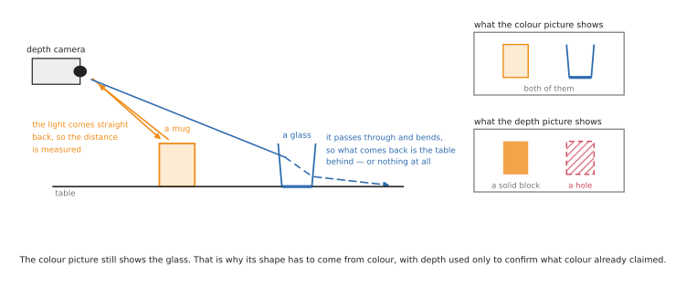
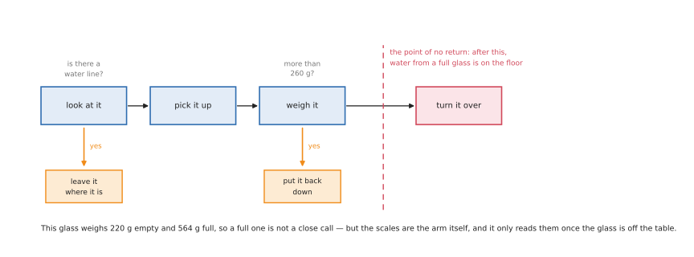
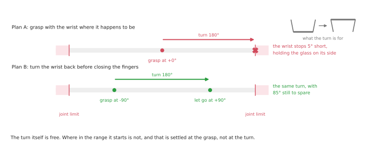
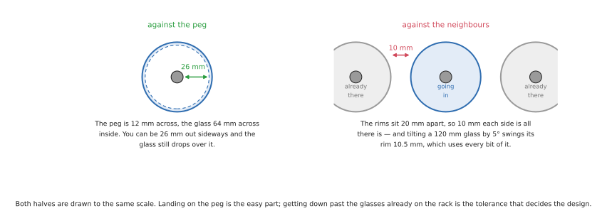
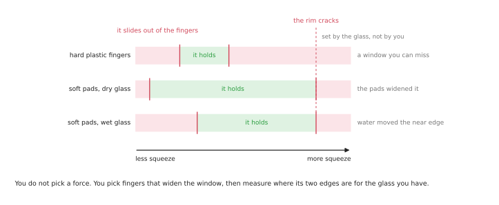
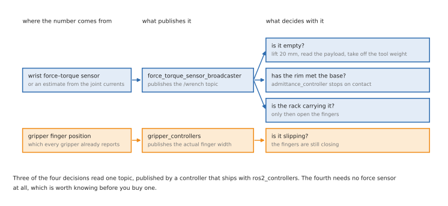
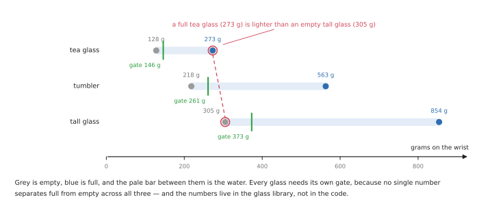
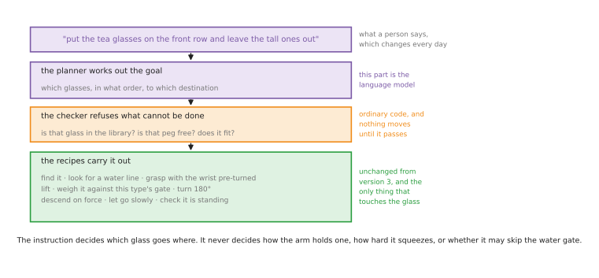

# Case study: standing an empty glass upside down on a drying rack

This document takes one household job and says how it would actually be built: which
part of it is a planner, which part is a model, which part is a force loop, and which
named tool does each one.

The job is this. Glasses are standing on a table. The robot has to pick up the empty
ones, turn each through 180 degrees, and stand it mouth-down on a drying rack — the
ordinary kitchen kind with a flat base and vertical pegs standing up from it. The
glasses that still have water in them must be left alone.

It sounds trivial and the moving part of it is trivial. Everything hard about it
comes from the object. The glass is transparent, so a depth camera cannot see it. It
has to be turned completely over, which most arms cannot do from an arbitrary
starting pose. It breaks if squeezed. And a glass with water in it must be spotted
before the turn, because after the turn the water is on the floor.

This is for somebody who has read [the overview](../01_overview.md) and wants the
method choices in it applied to one concrete problem. It is a design document, not
code. [The glossary](../06_glossary.md) has the longer explanation of any term.

## Contents

1. [The task](#1-the-task)
2. [What makes it hard](#2-what-makes-it-hard)
3. [The four versions](#3-the-four-versions)
4. [Which part uses what](#4-which-part-uses-what)
5. [When an unfamiliar glass turns up](#5-when-an-unfamiliar-glass-turns-up)
6. [What will bite you](#6-what-will-bite-you)
7. [What to measure](#7-what-to-measure)
8. [Where to go next](#8-where-to-go-next)

---

## 1. The task

The sequence, in the order it happens:

1. Find the glasses on the table, and find the rack.
2. Decide which ones are empty.
3. Choose a free peg.
4. Grasp an empty glass and lift it clear.
5. Confirm it is empty.
6. Turn it 180 degrees, so the mouth points down.
7. Lower it over the peg until the rim reaches the rack base.
8. Let go.
9. Check that it is standing.

Every number below comes from one example setup, which is also what the pictures are
drawn to. Measure your own before using any of them.

| Thing | Number |
| --- | --- |
| Glass rim, outside and inside | 70 mm and 64 mm |
| Glass height, wall thickness | 120 mm, 3 mm |
| Glass mass, empty and full | 218 g and 563 g |
| Peg diameter, peg height | 12 mm, 100 mm |
| Pegs on the rack, spacing | 6 in two rows of three, 90 mm apart |

The arm is an ordinary six-axis arm bolted to the table, with a repeatability of
around a tenth of a millimetre. Saying that early saves wasted effort: nothing here
fails because the arm cannot hit a position accurately enough.

An attempt succeeds when the glass is mouth-down on a peg, still standing ten seconds
later, with no neighbour moved and nothing broken. A full glass left untouched is
also a success. Water anywhere is a failure, however the run ended.

---

## 2. What makes it hard

Five things, each solved by a different part of the system.

### The depth camera cannot see it

A depth camera, meaning one that reports a distance for every pixel, sends light out
and measures what comes back. Most of that light goes straight through a glass, and
what does not is bent sideways by the curved wall. The depth picture therefore has a
hole exactly where the glass is.



The ordinary camera picture still shows the glass, in its edges and its highlights.
So the outline comes from a segmentation model run on that picture, and depth is
demoted to two jobs it can still do: measuring the table plane, and confirming a
result the model has already produced.

### A glass with water in it must be caught before the turn

There are two signals and they are worth using in order. Looking for a water line in
the picture is cheap and can be done before the arm touches anything. Weighing is
certain but only available after the lift, because the arm is the scales.



Weighing means reading the payload from the joint torques, or from a wrist force
sensor, with the glass lifted clear. The margin is large — 218 g against 563 g — so
the threshold is not delicate, and it is set low enough that a glass with a mouthful
left in it is still refused.

### The turn has to be planned backwards

Turning the glass over is 180 degrees about a horizontal line. The last joint of most
arms has a limited range, commonly plus or minus 175 degrees, and 180 degrees of turn
does not fit into that if you start in the middle of it.



The fix is to turn the wrist back before closing the fingers. That means the grasp
has to already know the release orientation, which is the thing most people get wrong
the first time: they write a grasp, then a turn, and find the turn impossible.

### The tolerance is not where you would guess

Getting a 64 mm glass over a 12 mm peg allows 26 mm of sideways error. The real
constraint is the rack filling up.



Pegs 90 mm apart and glasses 70 mm across leave 10 mm each side. Because the glass is
tall, orientation spends that budget faster than position does: a 5-degree tilt swings
the far end 10.5 mm sideways. So the descent must be vertical, and holding the glass
upright matters more than placing it exactly.

### Squeezing it wrong breaks it, once

There is a band of grip force that works. Below it the glass slips; above it the rim
cracks. The upper edge belongs to the glass and cannot be moved. The lower edge can,
by using fingers with more friction, and that is the only lever there is.



Wet glass, which is what comes out of a sink, pushes the lower edge up and narrows the
band further.

---

## 3. The four versions

Build it four times, the way [the learning path](../04_learning-path.md) does. Each
version removes one assumption from the one before, and each is a system you can run
and measure on its own. Do not start the next version until the current one fails for
a reason you can state out loud.

### Version 1: everything known in advance

**Assumes:** the glass always starts on a marked spot, every glass is the same, a
person puts out only empty ones, and the rack was measured once and has not moved.

**What it is:** a fixed sequence, with two of its steps controlled by force rather
than by position.

```
for peg in pegs:                          # measured once, in fill order
    move_to(pickup, wrist = -90°)         # pre-turned, so the flip will fit
    close_gripper(force = grip_force)
    if gripper_width > 68 mm: stop("no glass")
    lift(); turn_wrist(to = +90°)         # the glass is now mouth down
    move_above(peg, clearance = 130 mm)
    descend_until(vertical_force > 2 N)   # the rim has met the base
    open_slowly(); retreat(); check_standing()
```

**Stack:** ROS 2, the Robot Operating System, with URDF, the Unified Robot
Description Format, to describe the arm; [MoveIt 2](https://github.com/moveit/moveit2)
for the moves; [ros2_control](https://github.com/ros-controls/ros2_control) with an
admittance controller for the descent.

**Buys you:** a complete working loop in days, a cycle time you can measure, and a rig
to test everything that follows. **Cannot do:** anything if the glass moves, the rack
moves, or somebody puts out a full one.

### Version 2: the glass can be anywhere, and it might be full

**Adds perception.** An overhead camera finds every glass and classifies each one as
empty or full; a wrist camera checks the last stretch of the approach; the lift
confirms the weight before the turn.

There is more than one way to find the glass, and which one is right depends on how
fixed your set of objects is. Read the table as a shortlist, with the recommendation
underneath it.

| Option | What it gives you | When to pick it |
| --- | --- | --- |
| [YOLO segmentation](https://github.com/ultralytics/ultralytics) — You Only Look Once, a fast detector that also outlines what it finds | outlines of a fixed set of classes, plus the empty-or-full label in the same pass | the default, once you have labelled pictures of your own glasses |
| [SAM 2](https://github.com/facebookresearch/sam2) — the Segment Anything Model | outlines of objects it was never trained on | prototyping, and labelling the pictures YOLO will be trained on |
| [Grounding DINO](https://github.com/IDEA-Research/GroundingDINO) with SAM 2 | finds things from a written phrase, such as "drinking glass" | when the set of objects is open, or before you have any labels |
| [ClearGrasp](https://github.com/Shreeyak/cleargrasp), [TransCG](https://github.com/Galaxies99/TransCG) | fills in the hole a transparent object leaves in the depth picture | when you need the 3D shape and not just the outline |

Start with SAM 2, use it to label a few hundred pictures, then ship YOLO. SAM 2 is
class-agnostic and heavy; YOLO is fast and gives you the empty-or-full class in the
same pass, which is the class you actually need. What that costs you is a labelling
job on your own table, and a model that knows nothing outside the classes you
labelled.

One name worth separating out, because the two get confused. **SLAM** is not this.
SLAM, Simultaneous Localisation and Mapping, is how a robot that *drives around* a
building works out where it is while building a map of it as it goes. This arm is
bolted to a table that was measured once, so there is nothing to localise and no map
to build. The similar-sounding one you do want here is **SAM**, the Segment Anything
Model, in the table above.

**Stack, on top of version 1:** YOLO segmentation with two classes, empty glass and
full glass; [Open3D](https://github.com/isl-org/Open3D) to fit a cylinder to each
outline against the measured table plane; an
[AprilTag](https://github.com/AprilRobotics/apriltag) fiducial marker — a flat printed
pattern a camera can locate exactly — on the rack base;
[BehaviorTree.CPP](https://github.com/BehaviorTree/BehaviorTree.CPP) for the
sequencing, because this is the version where recovery branches start to multiply.

**Then it has to touch the glass.** Perception only says where the glass is. Four of
the nine steps in [section 1](#1-the-task) — grasping, confirming it is empty, coming
down onto the peg, and letting go — are settled by force rather than by geometry, and
the last step is settled by looking again. That is the difference between a sequence
that runs and a sequence that works.



Read the table as one row per moment: what it decides, and what gives you the number.

| Moment | What it decides | What provides it |
| --- | --- | --- |
| Closing on the glass | how hard to squeeze, so it neither slips nor cracks | [gripper_controllers](https://control.ros.org/jazzy/doc/ros2_controllers/gripper_controllers/doc/userdoc.html) in ros2_controllers, commanded as a force rather than as a width |
| While carrying it | whether it is slipping | the same controller's reported finger width, which keeps closing if the glass is sliding through |
| Just after the lift | whether it is empty | [force_torque_sensor_broadcaster](https://control.ros.org/jazzy/doc/ros2_controllers/force_torque_sensor_broadcaster/doc/userdoc.html), publishing the wrist wrench, with the gripper's own weight taken off |
| Coming down onto the peg | when the rim has met the base | [admittance_controller](https://control.ros.org/jazzy/doc/ros2_controllers/admittance_controller/doc/userdoc.html), or [cartesian_controllers](https://github.com/fzi-forschungszentrum-informatik/cartesian_controllers), moving on the force instead of to a height |
| Before opening the fingers | whether the rack is now carrying the glass | the same wrench: if the load has not transferred, the glass is hung up, so lift away rather than let go |
| After retreating | whether it is actually standing | the overhead camera and the same YOLO pass, asking whether there is a glass on that peg |

Two things are worth taking from that table. The first is that none of it is a new
framework: it is version 1's [ros2_control](https://github.com/ros-controls/ros2_control)
with two more controllers loaded and one topic read, which is the practical reason the
force work belongs here rather than in something written from scratch. The second is
that only one of these costs money. You have to buy the force reading — a wrist
force-torque sensor, or an arm that estimates it from joint currents well enough to
trust — while the slip check is free, because every gripper already reports where its
fingers are.

**Buys you:** the assumption that hurt most in version 1 is gone. The table can be
loaded any way round, and full glasses are handled correctly. **Costs you:** training
data and a labelling job, plus a component whose reasoning you cannot read.

### Version 3: a recipe for each glass we know

You know what your glasses look like, and version 2 tells you where they are. That is
enough to write down what to do with each one, and writing it down beats learning it
while the set is small and fixed. A **glass library** is a small file with one record
per type, and a **recipe** is the version 1 sequence reading its numbers from that
record instead of from constants.

Three types cover a normal kitchen. Read the table as one row per record, where every
column is a number the recipe uses directly.

| Type | Rim, height | Empty, full | Water gate | Most tilt allowed | Where it goes |
| --- | --- | --- | --- | --- | --- |
| Tea glass | 55 mm, 90 mm | 128 g, 273 g | 146 g | 6.4° | front row |
| Tumbler | 70 mm, 120 mm | 218 g, 563 g | 261 g | 4.8° | either row |
| Tall glass | 75 mm, 160 mm | 305 g, 854 g | 373 g | 3.6° | back row |

Two of those columns are worked out rather than measured, and both are worth
following. The tilt limit is the 10 mm neighbour budget from
[section 2](#2-what-makes-it-hard) divided by the height, which is why the tall glass
is the fussy one and the tea glass is forgiving. The water gate sits an eighth of the
way up from empty to full, so that a mouthful of water is still caught.

Those gates are the clearest argument for keeping all of this per type rather than
global.



**Stack:** no new frameworks at all. The library is a file, and the recipe is the
version 1 sequence with its constants replaced by lookups. The perception from
version 2 gains one job: say which of the three types it is looking at, which for
these three is a question of size and is already answered by the cylinder fit.

**Buys you:** three glass types handled properly, with numbers you can read, change
and argue about, and no training run anywhere. **Costs you:** it does not extend by
itself. Every type is a record somebody wrote, and
[section 5](#5-when-an-unfamiliar-glass-turns-up) is about the fourth one.

### Version 4: an instruction decides the goal

If the job is only ever "put the glasses on the rack", a language model adds nothing
and you should not fit one. There is a single goal, it never changes, and a sentence
describing it is strictly worse than a constant.

It earns its place when the **goal** changes, and the natural way for that to happen
here is sorting. Real instructions look like this:

- "Put the tea glasses on the front row and the tall ones at the back."
- "The wine glasses don't go on the rack — put them on the tray."
- "Leave the tea glasses out, we're using them."
- "The rack is full. Stack whatever is left on the tray."

Each of those changes which glasses are picked, in what order, and where they end up.
None of them changes how a glass is held. That split is the whole design.



**Stack:** an open vision-language model such as
[Qwen3-VL](https://github.com/QwenLM/Qwen3-VL) reads the instruction and the overhead
picture and writes a short programme that calls the version 3 recipes. That pattern —
the model writes the plan, ordinary code runs it — is the one
[Code as Policies](https://code-as-policies.github.io/) established, and
[the learned methods document](../03_learned-methods.md#5-directed-by-language) covers
the family properly.

**Buys you:** goals that change daily without a code change, and an operator who does
not have to be a programmer. **Costs you:** a new kind of failure. The model will
cheerfully produce a plan the cell cannot carry out — a peg that is taken, a glass
type it has never seen, a tray that is not there — and nothing downstream will notice
that the *goal* was wrong, only that some step failed. So a checker sits between the
model and the recipes, in ordinary code, and refuses anything that does not match the
library and the current state of the rack.

---

## 4. Which part uses what

This is the whole shortlist in one place. Read it as one row per job: what we use, and
the obvious alternative we are not using, with the reason.

| Job | What we use | Rather than |
| --- | --- | --- |
| Simulate it first | [Gazebo](https://github.com/gazebosim/gz-sim) | [MuJoCo](https://github.com/google-deepmind/mujoco) — better contact, but simulated cameras and ROS in the loop matter more here |
| Describe the arm | URDF | a bespoke model nothing else can read |
| Find the glasses | [YOLO segmentation](https://github.com/ultralytics/ultralytics) | colour thresholding, which has nothing to work with on a transparent object |
| Label the training pictures | [SAM 2](https://github.com/facebookresearch/sam2), or [Grounding DINO](https://github.com/IDEA-Research/GroundingDINO) with a phrase | outlining a few hundred glasses by hand |
| Tell empty from full | the same model, two classes, then confirmed by weight | vision alone, because the turn cannot be undone |
| Fill the depth hole, if needed | [ClearGrasp](https://github.com/Shreeyak/cleargrasp), [TransCG](https://github.com/Galaxies99/TransCG) | waiting for the depth camera to get better |
| Fit the shape and the table | [Open3D](https://github.com/isl-org/Open3D) | [PCL](https://github.com/PointCloudLibrary/pcl), the Point Cloud Library — capable, but heavier than this needs |
| Locate the rack | an [AprilTag](https://github.com/AprilRobotics/apriltag) marker, read by [apriltag_ros](https://github.com/AprilRobotics/apriltag_ros) | [FoundationPose](https://github.com/NVlabs/FoundationPose), unless you cannot glue a marker on |
| Plan the motion | [MoveIt 2](https://github.com/moveit/moveit2) | hand-written waypoints, which stop working the day the rack moves |
| Plan grasp, turn and place together | [MoveIt Task Constructor](https://github.com/moveit/moveit_task_constructor) | planning each stage separately, then finding the grasp forbids the release |
| Drive the joints | [ros2_control](https://github.com/ros-controls/ros2_control) | your own control loop, where the hard part is the timing |
| Descend onto the rack | the admittance controller in [ros2_controllers](https://github.com/ros-controls/ros2_controllers), or [cartesian_controllers](https://github.com/fzi-forschungszentrum-informatik/cartesian_controllers) | commanding a height into a rigid base |
| Sequence and recover | [BehaviorTree.CPP](https://github.com/BehaviorTree/BehaviorTree.CPP) | a state machine, which turns illegible once recovery branches multiply |
| Hold the per-glass numbers | a file, one record per type | constants spread through the code |
| Turn an instruction into a goal | [Qwen3-VL](https://github.com/QwenLM/Qwen3-VL) in the [Code as Policies](https://code-as-policies.github.io/) pattern | a menu of buttons, which cannot cover what people actually ask for |
| Learn a skill, if recipes run out | [LeRobot](https://github.com/huggingface/lerobot) | the original [ACT](https://github.com/tonyzhaozh/act) and [diffusion policy](https://github.com/real-stanford/diffusion_policy) repositories, which are quiet now |
| Record every attempt | rosbag2, which ships with ROS 2 | log lines, which cannot show you the frame before the drop |

The hardware choices are shorter, and only four of them matter.

| Part | What we use | Why |
| --- | --- | --- |
| Gripper | two-finger parallel, with soft silicone pads | the pads raise friction, which widens the low side of the force band; suction fails on a curved, wet, inverted object |
| Where it holds | the end that becomes the *top* after the turn | the fingers then stay clear of the pegs and the neighbouring rims during the descent |
| Cameras | one overhead, one on the wrist | the wrist camera removes the camera-to-arm calibration error, which is the error that actually sinks this task |
| Force | a wrist force sensor, or joint-torque estimates | it is needed twice: to weigh the glass, and to stop the descent on contact |

Three of those carry a cost worth knowing before you commit. MoveIt Task Constructor
is a noticeably steeper learning curve than plain MoveIt, and version 1 does not need
it. BehaviorTree.CPP adds a second representation, written in XML, that a newcomer
must learn before they can read your logic at all. And the admittance controller needs
a force reading you trust plus an afternoon of stiffness tuning with nothing to show
for it.

---

## 5. When an unfamiliar glass turns up

Version 3 knows three glasses. This section is about the fourth, and it is the
question that decides whether the system is a demonstration or a product.

### Noticing it is the safety-relevant half

The dangerous case is not a new glass. It is a new glass treated as an old one — a
cylinder fitted to a wine glass returns an answer, and the answer is confident and
wrong. Three cheap checks catch nearly all of it, and any one of them failing should
stop the attempt:

- the cylinder fit reports a poor fit against the outline;
- the measured rim and height match no record in the library;
- the weight after the lift matches neither the empty nor the full figure for the type
  the system thinks it is holding.

That third one is the quiet hero, because it runs after the grasp and before the turn,
which is exactly where a wrong guess is still recoverable.

### Then there are three routes, and you will use all of them

Read the table as three responses to the same event, in the order you would reach for
them.

| Route | What happens | What it costs | When it is right |
| --- | --- | --- | --- |
| Refuse it | the glass is left on the table and flagged for a person | nothing | always the default, and the only correct answer for a wine glass, which cannot go on a peg at all |
| Measure and add | somebody writes a record, or the robot runs a measuring routine and proposes one | minutes | a new size of a shape you already handle |
| Learn it | demonstrations are collected and a policy is trained for shapes no recipe covers | a few hundred demonstrations and a rig to collect them | when unfamiliar shapes stop being rare |

The measuring routine is worth building, because the robot can fill in most of a
record by itself. Segmentation against the table plane gives the rim diameter and the
height. Closing carefully at the grasp height gives the width. Lifting gives the empty
mass, and the full mass follows from the internal volume. The one number it cannot
measure is the force that cracks the rim, because measuring that destroys a glass — so
a new record starts with a deliberately gentle grip force, and a person tightens it by
hand after watching a few runs.

Route three is where [LeRobot](https://github.com/huggingface/lerobot) comes in, and
[the learned methods document](../03_learned-methods.md#1-learning-from-demonstrations)
covers what it involves. It is the right answer when the library stops keeping up — a
café with forty kinds of glassware, rather than a kitchen with three.

Across all three routes the pattern is the same, and it is the real answer to the
question: **a new size is nearly free, a new shape never is.** Changing size changes
numbers. Changing shape changes which surfaces can be held and which way up the thing
can stand, and no amount of training data turns that into the same problem.

---

## 6. What will bite you

- **Broken glass is not a retry.** It leaves shards, and an arm that will happily
  carry on moving through them. The response to a drop is to stop the cell and call a
  person. Decide that before writing the recovery logic, because it changes its shape.
- **Water is worse than breakage.** It spreads, it reaches the electronics, and it is
  a slip hazard for the people nearby. That is why there are two gates before the turn
  rather than one.
- **A nearly-empty glass looks empty.** A centimetre of water in the bottom is hard to
  see and easy to weigh, which is the whole argument for the second gate.
- **One water threshold will not do.** A full tea glass weighs less than an empty tall
  glass, so the gate has to come from the library rather than from a constant.
- **Calibration drift eats your margin.** You have 10 mm between rims. A 3 mm error
  between where the camera thinks the rack is and where it is has taken a third of it
  before the arm has moved.
- **Wet glass is a different object.** It slips at forces a dry one holds at. If the
  glasses come from a sink, every grip number has to be measured wet.
- **The rack moves, and it fills.** It is light plastic on a table. Fix it down or find
  it every cycle — and fill the pegs in an order that keeps the occupied ones away from
  the next one for as long as possible.
- **Simulation will not give you the grip numbers.** Rigid fingers on a thin rigid
  shell is close to the worst case for a physics engine. Use the simulator for
  reaching, planning, the turn and the clearances; get the grip from a real glass.

---

## 7. What to measure

Robot demonstrations are easy to make look good, so decide what you are counting
before you start. These six numbers are enough.

| Number | How to count it |
| --- | --- |
| Success rate | glasses standing ten seconds after release, over attempts |
| Full glasses correctly left alone | over full glasses presented — a miss here is a wet floor |
| Breakages per thousand attempts | the number that decides whether this can ever ship |
| Unfamiliar glasses correctly refused | over unfamiliar glasses presented — the measure of section 5 |
| Cycle time | from reaching for the glass to the arm clear of the rack |
| Failures caught before release | as a share of all failures — whether the checks are working |

The last row is the one people leave out and the one to watch most closely. A system
that notices it has the glass wrong and puts it back down is in a different class from
one that finds out by hearing it break, even at the same success rate.

Log every attempt: the camera frames, the force trace, the gripper width, and the
planned and actual poses. Without those, a failure two weeks from now is a story
rather than a bug.

---

## 8. Where to go next

- [The overview](../01_overview.md), and its
  [grid of which method suits which task](../01_overview.md#5-which-method-for-which-task),
  is where these choices came from.
- [Programmed methods](../02_programmed-methods.md) covers the planning, the behaviour
  trees and the [force control](../02_programmed-methods.md#6-feedback-control) used in
  versions 1 to 3.
- [Learned methods](../03_learned-methods.md) covers
  [language as a planner](../03_learned-methods.md#5-directed-by-language) for version 4,
  and [learning from demonstrations](../03_learned-methods.md#1-learning-from-demonstrations)
  for the third route in section 5.
- [The learning path](../04_learning-path.md) has five projects to build in
  simulation; projects 1 and 2 between them cover most of what this task needs.
- [Tools and libraries](../../06_tools-and-libraries.md) is the fuller version of
  [section 4](#4-which-part-uses-what).
