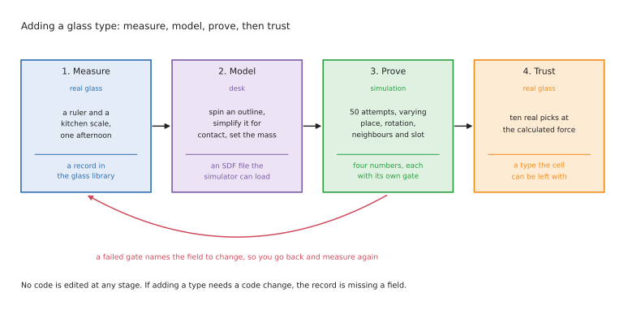

# Version 1: pick up a glass and stand it upside down

## What this project is

A robot arm stands beside a table. Glasses are standing the right way up on that
table. A drying rack sits on the same table, with six slots in it. The robot picks up
each glass, turns it completely over, stands it mouth-down in a free slot, and says
when each one is done.

That is the whole job. One arm, one gripper, two cameras, and a force sensor at the
wrist.

The moving part of it is simple. Everything difficult about it comes from the object.
A glass is transparent, so a depth camera cannot see it properly. It has to be turned
right over, which most arms cannot do from any starting position. And it breaks if you
squeeze it too hard, which means the grip force is something you have to work out
rather than guess.

## What this version is for

This version exists to get one thing right: **pick a glass up and invert it, without
breaking it or dropping it.** Everything else in the document is in service of that.

It is also built so that **adding a new type of glass is easy**. The robot starts
knowing five types. Adding a sixth should mean writing one record in a data file and
running a test, with no code changed anywhere. That is a design goal rather than a
nice-to-have, and
[section 5](#5-adding-a-new-glass-type) is about how it is met and how you prove it in
simulation before you trust it with a real glass.

## What is in scope, and what is not

**In scope.** Finding the glasses and the rack. Working out which type each glass is.
Picking it up at the right place with the right force. Turning it over. Standing it in
a slot. Reporting what happened, one glass at a time. Recovering when a step fails.

**Not in scope, on purpose.**

*Liquid.* Every glass in this version is empty. Nothing looks for water and nothing
weighs a glass to find out. That check is real work — a camera pass, a weight rule per
type, and a decision about what to do with a full one — and mixing it into the first
version makes it harder to tell whether a failure came from the grasp or from the
check. [The case study](01_place-glass.md) is where liquid is worked out.

*Learning.* Nothing here is trained to do the task. Perception uses a trained model,
which is a different thing: a network recognises the glass, and ordinary code decides
what to do about it. No policy, no demonstrations.

*Anything the robot has never seen.* If a glass is not one of the types in the
library, the robot leaves it alone and says so. That is the correct behaviour, not a
failure.

## Who this is for

Somebody about to build this. It says what happens first, what happens next, and which
named tool does each step.

The reasoning behind the choices — why a depth camera cannot see a glass, why the turn
has to be planned backwards, where the grip force window comes from — lives in
[the case study](01_place-glass.md), which is the longer document this one condenses.
Read that for the argument. Read this for the sequence.

Every tool named here is open source, and
[section 7](#7-every-framework-and-why-it-was-chosen) gives the licence of each. One of
them has a licence that will matter to you if this ever becomes paid work, and it is
called out there rather than buried.

## Contents

1. [What is known and what is not](#1-what-is-known-and-what-is-not)
2. [The shape of the solution](#2-the-shape-of-the-solution)
3. [The glass library](#3-the-glass-library)
4. [Where to hold a glass, and how hard](#4-where-to-hold-a-glass-and-how-hard)
5. [Adding a new glass type](#5-adding-a-new-glass-type)
6. [The workflow, step by step](#6-the-workflow-step-by-step)
7. [Every framework, and why it was chosen](#7-every-framework-and-why-it-was-chosen)
8. [How the robot reports each glass](#8-how-the-robot-reports-each-glass)
9. [When a step fails](#9-when-a-step-fails)
10. [Build it in this order](#10-build-it-in-this-order)
11. [Where to read more](#11-where-to-read-more)

---

## 1. What is known and what is not

This split decides almost every choice further down. Anything in the first column can
be written in a file. Anything in the second column has to be worked out by a camera
or a sensor, on every single run.

| Known in advance | Not known until the robot looks |
| --- | --- |
| The glass types, and their measurements | How many glasses are on the table |
| The weight of each type | Which types are on the table this time |
| The rack has six slots, and how far apart they are | Where each glass is standing |
| The height of the rack and the size of a slot | Which way a handle is pointing |
| Where the arm and the table camera are bolted down | Where the rack is on the table |
| Where to hold each type, and how hard to squeeze | Which slots are already taken |

Two entries in the right-hand column shape the whole design.

Because the number of glasses is unknown, the robot cannot make one plan at the start
and follow it. It has to look, do one glass, and look again.

Because the rack position is unknown, every slot position has to be worked out from
something the camera can find. No slot position may be a constant in the code.

The five types it starts with are a straight glass, such as a rocks or vodka glass; a
wine glass with a bowl, a stem and a foot; a glass with a handle, such as a beer mug;
a milkshake glass, tall with sloping walls; and an Irish coffee glass, which is
short-stemmed and often has a small handle.

---

## 2. The shape of the solution

The robot runs one loop. The loop handles one glass from start to finish before it
looks at the table again.

```
find the rack, and which of its six slots are free
look at the table and list the glasses, with a type for each
while there is a known glass on the table and a free slot:
    choose the next glass, and the slot it will go in
    pick it up using the record for its type
    lift it clear and check it is held properly
    turn it 180 degrees, mouth down
    lower it into the slot until it touches
    let go, retreat, and check it is standing
    report this glass as done
    look at the table again
report what is left and why
```

Looking again after every glass costs a second or two, and it is worth it. Glasses get
nudged. A person puts another one down. A glass that slipped in the fingers is back on
the table somewhere nobody planned for. A plan made once at the start would be wrong
by the third glass.

---

## 3. The glass library

Everything that differs between one type of glass and another lives in a single file.
This is the most important design decision in the document, because it is what makes
[adding a new type](#5-adding-a-new-glass-type) a matter of measurement rather than
programming.

The rule is strict and worth stating plainly: **no number that describes a glass may
appear anywhere in the code.** If the code needs to know how wide a glass is, it looks
it up. If you find yourself writing `if glass_type == "wine"`, the library is missing a
field.

### What one record holds

Write it as [YAML](https://yaml.org/), which is a plain text format a person can edit
and a program can read.

```yaml
straight_glass:
  # measured with a ruler and a kitchen scale
  rim_diameter_mm:     80
  height_mm:           90
  mass_g:              250

  # where the fingers go
  grasp_height_mm:     30      # measured up from the table
  finger_opening_mm:   78      # how wide the fingers are when they touch
  approach:            any     # any | square_to_handle
  grasp_force_n:       4       # per pad

  # what it needs on the rack
  inverted_width_mm:   80      # how wide it is standing upside down
  needs_empty_neighbour: false

  # how to recognise it
  model_class:         straight_glass
  mass_tolerance_g:    30
```

Every field is read by a step further down, and nothing else is. The reason for
splitting them into four groups is that they come from four different places: the
first group from measuring, the second from the three rules in
[section 4](#4-where-to-hold-a-glass-and-how-hard), the third from the rack geometry,
and the fourth from the perception model you trained.

### The five starting types

These are example numbers. Measure your own glasses; the point is the shape of the
table, not the values in it.

| Type | Rim across | Height | Weight | Hold it by |
| --- | --- | --- | --- | --- |
| Straight glass | 80 mm | 90 mm | 250 g | the side wall, low down |
| Wine glass | 85 mm | 200 mm | 180 g | the stem |
| Handled glass | 75 mm | 130 mm | 420 g | the wall opposite the handle |
| Milkshake glass | 90 mm | 175 mm | 300 g | the wall, low down where it is most upright |
| Irish coffee glass | 70 mm | 150 mm | 220 g | the bowl, just above the foot |

Each type is awkward in its own way, and the awkwardness is the reason there is one
record per type rather than a single routine for all five.

| Type | What makes it different | What the record does about it |
| --- | --- | --- |
| Straight glass | nothing, it is a cylinder with straight walls | the plain case; build this one first |
| Wine glass | a thin bowl that cracks, on a narrow stem | close on the stem, which is strong and the same width on every wine glass |
| Handled glass | the handle sticks out and can hit a neighbour | perception reports which way the handle points, and the placement turns it outward |
| Milkshake glass | sloping walls, so flat fingers slide up the taper as they close | grip low, where the wall is most vertical, and stop on force rather than on width |
| Irish coffee glass | short stem, thin glass, sometimes a handle | the wine glass record with the handle rule of the mug |

### The rack file

The rack is known, but where it is standing is not. So a second file holds the rack's
own measurements: six slots, the spacing between them, the slot height, and where each
slot sits relative to a corner of the rack. At run time the camera finds the rack once,
and every slot position follows from that one measurement.

Spacing is what limits how a slot can be used. With slots 100 mm apart, a straight
glass 80 mm across leaves 10 mm of clearance on each side. Because the glass is tall,
that clearance is used up by tilt much faster than by sideways error. The arm can be
10 mm out sideways, or it can be tilted by `atan(10 / 90)`, which is 6.3 degrees, but
not both.

For the milkshake glass, 90 mm across and 175 mm tall, the same sum gives 1.6 degrees.
No arm should be asked for that. So the rack file also says which types need an empty
slot beside them. Leaving a gap turns 1.6 degrees into 17.4 degrees, which is a
placement that works. That is what the `needs_empty_neighbour` field is for.

---

## 4. Where to hold a glass, and how hard

Two numbers decide whether a glass survives being picked up. The spot where the fingers
close, and how hard they close. Both are different for every type.

The short answer to "how does the arm work it out?" is that it does not. A person
measures it once per type and writes it into the library. The arm looks it up. Nothing
here is learned or guessed while the robot is running.

### Why one answer does not fit all five

Imagine holding each of these yourself, with two fingers, with your eyes shut.

- The **straight glass** is easy. It is a tube. Anywhere on the side works.
- The **wine glass** is not. The bowl is thin and will crack. The stem is narrow,
  strong, and always about the same thickness. You would hold the stem, and so does
  the robot.
- The **handled glass** has a lump sticking out of it. Close your fingers the wrong way
  round and one of them lands on the handle, so the glass hangs at an angle nobody
  planned for. You have to come in square to the handle, which means the robot has to
  know which way the handle is facing.
- The **milkshake glass** is a cone. Squeeze a cone with two flat fingers and it squirts
  upwards out of your grip, the way a wet bar of soap does. You hold it low down, where
  the sides are closest to vertical.
- The **Irish coffee glass** is a small wine glass with thicker walls. Hold the bowl
  just above the foot, where the glass is strongest.

A single rule such as "close on the middle of the object at ten newtons" breaks the
wine glass, drops the milkshake glass, and lands on the mug handle. That is the whole
argument for one record per type.

### The three rules that pick the spot

Apply them in this order. They sometimes disagree, and the earlier rule wins.

1. **Hold the end that becomes the top after the turn.** The glass is going to be
   turned upside down, so whatever the fingers are holding ends up in the air. Hold it
   low, near its base. After the turn the fingers are then high above the rack, instead
   of down among the pegs and the neighbouring glasses.
2. **Hold the strongest part.** Thin bowls crack. Stems, thick walls, and the area just
   above a foot do not.
3. **Hold where the wall is vertical.** Two flat fingers closing on a slope push the
   glass along that slope. On a vertical wall they just press.

Applying those to the five types gives the numbers below. Height is measured up from
the table. The opening is how far apart the fingers are when they touch.

| Type | Close the fingers this high up | Fingers this far apart | Come in from |
| --- | --- | --- | --- |
| Straight glass | 30 mm | 78 mm | any side |
| Wine glass | 90 mm, on the stem | 9 mm | any side |
| Handled glass | 40 mm | 72 mm | square to the handle |
| Milkshake glass | 40 mm | 60 mm | any side |
| Irish coffee glass | 60 mm | 62 mm | square to the handle, if it has one |

Two rows are worth a second look. The wine glass opening is 9 mm rather than 85 mm,
because the fingers are on the stem and not on the bowl. The milkshake opening is
60 mm even though the rim is 90 mm, because the glass is much narrower at the bottom
than at the top, and 40 mm up is near the bottom.

### How the arm turns that into a place in the room

The record says something like "40 mm up, fingers 72 mm apart, come in square to the
handle". That describes a spot on the glass, not a spot on the table. Three things
together turn one into the other.

| What the arm needs | Where it comes from |
| --- | --- |
| Which record to read | the type, from the segmentation model in step 2 |
| Where the base of this glass is standing | the outline from the same model, met with the table plane from the depth camera |
| Which way it is turned | only matters for a handle: the handle is the part of the outline that sticks out of the circle |

Add the three together and you have a target pose, meaning a position and a direction,
in the robot's own coordinates. That is the only language the planner speaks.
[MoveIt 2](https://github.com/moveit/moveit2) then finds a path to it that does not go
through the table or the other glasses.

For four of the five types the direction does not matter, so the robot is free to pick
whichever approach keeps the arm away from neighbouring glasses. For the mug it is not
free, and that one difference is why perception has to report a rotation rather than
just a point.

### How hard to squeeze

A glass held between two fingers is not resting on anything. It hangs there, and the
only thing stopping it sliding down is friction between the rubber pad and the glass.
Press harder and there is more friction. Press too hard and the glass cracks. The right
force is the smallest one that is safely above sliding.

You can calculate the lower end of that. In words:

> the force each pad presses with = (the weight of the glass × a safety factor)
> ÷ (2 × the grip factor)

Taking each piece in turn. The **weight** in newtons is the mass in kilograms times
9.81, so a 250 g glass weighs 2.45 N. The **2** is there because two pads each do half
the holding. The **grip factor** says how grippy the pad is against glass; for a soft
silicone pad on dry glass, 0.6 is a reasonable starting figure and one you should
measure yourself. The **safety factor** of 2 means you squeeze twice as hard as the sum
says, which covers a small knock.

For the straight glass that gives 2.45 × 2 ÷ (2 × 0.6) = 4.1 N, so 4 N per pad. The
same sum for the other four gives this:

| Type | Weight | Force per pad |
| --- | --- | --- |
| Straight glass | 250 g | 4 N |
| Wine glass | 180 g | 3 N |
| Handled glass | 420 g | 7 N |
| Milkshake glass | 300 g | 7 N |
| Irish coffee glass | 220 g | 4 N |

The milkshake glass is the one that does not follow the sum. It works out at 5 N and
the table says 7 N, because the sloping wall is also trying to push the glass out of the
grip, and that has to be paid for. Half as much again is a sensible allowance.

Two things about these numbers matter more than the numbers themselves.

**This is the floor, not the ceiling.** The sum tells you the least you can squeeze. The
most you can squeeze is whatever cracks the rim, and you do not measure that, because
measuring it costs a glass every time. So set the force from the sum, watch ten picks,
and raise it by one newton at a time only if something slips.

**Heavier is not automatically stronger.** The mug needs 7 N because it is heavy. The
wine glass needs 3 N because it is light. If you gave the wine glass the mug's number,
you would be squeezing a thin stem more than twice as hard as it needs.

### How the number gets into the gripper

Command a force, not a width. The fingers close, the force builds, and the controller
stops when it reaches the number from the record. That is
[gripper_controllers](https://control.ros.org/jazzy/doc/ros2_controllers/gripper_controllers/doc/userdoc.html)
in [ros2_controllers](https://github.com/ros-controls/ros2_controllers), driven by
[ros2_control](https://github.com/ros-controls/ros2_control), doing exactly what it is
for.

The obvious alternative is to command a width: "close to 72 mm". Do not. Glasses of
the same type vary by a millimetre or two. And if perception was 3 mm out, the fingers
reach the commanded width without ever touching the glass, and nothing reports a
problem, because the gripper did exactly what it was told.

### How the arm knows it got it right

Three checks, all using sensors the job already has, and all before anything is
irreversible.

| When | What to look at | What it tells you |
| --- | --- | --- |
| As the fingers close | the finger width at the moment the force arrives | matching the record means the glass is where perception said; closing further means nothing is there |
| Just after the lift | the twist in the wrist force sensor | an unexpected twist means the grip is off to one side, high, or low |
| Before the turn | tilt the glass 20 degrees slowly and watch the finger width | a width that creeps means it is sliding, while sliding is still recoverable |

A failed check costs one regrasp. Not checking costs a glass.

---

## 5. Adding a new glass type

This is the part the whole design is arranged around, so it gets its own section.

The promise is that adding a type means **writing one record and running one test**. No
code is edited. If adding a type ever requires a code change, something above this
section is wrong, and the right fix is to add a field to the record rather than a
branch to the code.

The work comes in three parts: measuring the glass, putting it into simulation, and
proving it works there before you touch a real one.



Notice where the real glass appears. Only the first stage and the last stage involve
one, and everything in between happens on a desk or in a simulator. That is the point
of the arrangement: the stage most likely to break a glass is the stage you reach
last, after three cheaper stages have already caught the mistakes.

### Part one: measure the glass

One afternoon per type, with a ruler and a kitchen scale.

1. **Stand it on the table and measure its height and its rim.** Those two numbers go
   straight into the record.
2. **Decide the grip height** using the three rules in
   [section 4](#the-three-rules-that-pick-the-spot). Low, strong, vertical.
3. **Measure how wide the glass is at exactly that height.** That is the finger
   opening, and it is not the rim diameter unless the glass happens to be a cylinder.
4. **Weigh it**, and put the weight through the force sum to get a starting force.
5. **Measure how wide it is upside down**, which decides which slots it can use, and
   whether it needs an empty neighbour.
6. **Decide the approach.** If it has a handle, the approach is square to the handle
   and perception has to report a rotation for it.

### Part two: put it into the simulator

The robot cannot be tested on a glass the simulator does not have, so the new type
needs a model. A glass is an easy shape to make, because it is symmetrical about its
vertical axis.

**Make the visual shape.** Draw the outline of one side of the glass, from the base up
to the rim, then spin that outline around the vertical axis.
[trimesh](https://github.com/mikedh/trimesh) does this in a few lines and is MIT
licensed. [Blender](https://www.blender.org/) does it interactively if you would rather
see what you are doing.

**Make the collision shape separately, and keep it simple.** The collision shape is
what the physics engine uses to work out contact. It does not have to look like the
glass, and it should not be the detailed mesh, because detailed meshes make contact
slow and unstable. A stack of two or three cylinders is usually enough. Where the shape
genuinely is not convex, such as a mug handle,
[CoACD](https://github.com/SarahWeiii/CoACD) (MIT) will break it into convex pieces
automatically.

**Set the mass to the weight you measured.** This matters more than the shape does,
because it is what the weight check compares against.

**Write the model file.** Gazebo reads
[SDF](https://github.com/gazebosim/sdformat), which points at the visual mesh, the
collision shape and the mass. One file per glass type, next to the library record.

### Part three: prove it in simulation before trusting it

This is the part people skip, and it is the reason a new type breaks the cell a week
later. Do not add a type to the real robot until it has passed a scripted test.

The test is the same every time, which is what makes it useful.

| What to vary | Over what range | Why |
| --- | --- | --- |
| Where the glass stands on the table | anywhere the arm can reach | the grasp pose is computed, so it must work everywhere |
| Which way it is turned | 0 to 360 degrees | catches a handle rule that only works from one side |
| How close its neighbours are | from clear to nearly touching | catches an approach that swings into the glass next door |
| Which slot it is going to | every slot, including the end ones | catches a tilt budget that only works in the middle |

Run at least fifty attempts. Record four numbers, because they fail for different
reasons and lumping them together hides which part is broken.

| Number | What it means | A reasonable gate |
| --- | --- | --- |
| Grasp success | the fingers closed on the glass and the width matched the record | 95% |
| Lift success | it came off the table and the wrist twist stayed small | 95% |
| Invert success | it turned 180 degrees without shifting in the fingers | 98% |
| Place success | it is standing in the slot afterwards | 90% |

If a gate fails, the number that failed tells you which field to change.

- **Grasp fails** — the grip height or the finger opening is wrong. Measure again at
  exactly the grip height.
- **Lift fails with a twist** — you are gripping off-centre. Usually the approach
  direction, and usually a handle.
- **Invert fails** — the wrist ran out of travel, so the grasp needs to start further
  back, or the grip is too low on a tall glass.
- **Place fails** — the tilt budget. Set `needs_empty_neighbour` and try again.

### What simulation will not tell you

Be clear about the limit, because trusting the simulator here is the expensive
mistake.

**The grip force is not simulated usefully.** Rigid fingers closing on a thin rigid
shell is close to the worst case for any physics engine. The number the simulator gives
you for contact force is not a number to put in the library.

So take the reach, the planning, the clearances, the tilt budget and the slot choice
from simulation, all of which it models well. Get the grip force from the sum in
[section 4](#how-hard-to-squeeze), and then confirm it on ten real picks.

### The checklist

Adding a type is done when all of this is true.

- [ ] A record exists in the glass library, with every field filled in
- [ ] An SDF model exists, with a simple collision shape and the measured mass
- [ ] The perception model recognises the new type
- [ ] Fifty simulated attempts pass all four gates
- [ ] Ten real picks at the calculated force, with nothing slipping
- [ ] No code was changed to make any of the above work

The last line is the one to take seriously. If you changed code, write down what the
record could not express, and add that as a field.

---

## 6. The workflow, step by step

Each step says what happens, which tools it uses, and how the robot knows the step
worked. That last part is what turns a demonstration into something you can leave
running.

### Step 1: find the rack and count the free slots

The robot takes one picture from the table camera and finds the rack in it. The
reliable way is a printed marker, an
[AprilTag](https://github.com/AprilRobotics/apriltag), glued to the rack base. A tag is
a flat black-and-white pattern that a camera can locate exactly, in both position and
rotation, from a single frame. Given the tag, every slot position follows from the rack
file.

Then it works out which slots are already occupied. Run the same segmentation model
used in step 2 over the rack area, and mark a slot as taken if a glass outline covers
it. Six slots is few enough that this is reliable.

**Uses:** [apriltag_ros](https://github.com/AprilRobotics/apriltag_ros) to read the
marker, running inside [ROS 2](https://docs.ros.org/en/jazzy/index.html), the Robot
Operating System; the table camera read through
[image_pipeline](https://github.com/ros-perception/image_pipeline), the ROS packages
that turn a raw camera frame into a corrected one; the segmentation model for occupancy.

**Confirmed by:** a tag pose inside the table area that has not jumped since the last
cycle, and a free-slot count between zero and six. If the tag cannot be seen at all,
stop, because there is nowhere to put anything.

### Step 2: find the glasses and say what each one is

One picture of the table, one pass of a segmentation model, and the result is an outline
and a type for every glass. Segmentation means the model returns the shape of each
object rather than just a box around it, and outlines are what the next steps need.

A depth camera is nearly useless for the glass itself. Most of its light goes straight
through the glass, and the rest is bent by the curved wall, so the depth picture has a
hole exactly where the glass is. Depth is still used, but for the table plane. The
outline comes from the ordinary colour picture, and where the outline meets the table
plane is where the glass is standing.

**Uses:** a segmentation model trained on a few hundred pictures of your own types —
see [section 7](#7-every-framework-and-why-it-was-chosen) for which one and why the
licence matters; [SAM 2](https://github.com/facebookresearch/sam2), the Segment
Anything Model, to outline those training pictures quickly instead of drawing them by
hand; [Open3D](https://github.com/isl-org/Open3D) to fit the table plane and a cylinder
to each outline.

**Why not the obvious alternative:** colour thresholding, which is how most beginner
pipelines find an object, has nothing to work with on something transparent. The cost
of using a model instead is a labelling job on your own table, and a component whose
reasoning you cannot read.

**Confirmed by:** every detection having a type, a position on the table plane, and a
cylinder fit that actually fits. A poor fit means it is not one of the known types, and
the right response is to leave it alone.

### Step 3: choose the next glass and its slot

There is now a list of glasses and a list of free slots, and something has to pair them.
Keep it simple and greedy. Take the glass nearest the robot with nothing standing
between it and the arm, and give it the free slot whose neighbours are emptiest.

Two rules from the rack file apply here. A type with `needs_empty_neighbour` set removes
two slots from the list rather than one. And filling order matters: work outward from
the far end, so the glasses already placed are never between the arm and the next slot.

**Uses:** ordinary [Python](https://www.python.org/). This is arithmetic over six slots
and a handful of glasses. Reaching for a solver here would be a mistake.

**Confirmed by:** a chosen slot that is still free in this cycle's occupancy check.

### Step 4: pick it up

The arm goes to the grasp pose worked out in
[section 4](#4-where-to-hold-a-glass-and-how-hard) and closes the fingers at the force
from that type's record.

One detail is easy to get wrong and expensive to discover late. **Turn the wrist
backwards before closing the fingers**, so that the 180 degrees of turn still fits
inside the wrist's travel. Most arms have a last joint that stops at about 175 degrees,
and a turn planned after the grasp is a turn that does not fit.

**Uses:** [MoveIt 2](https://github.com/moveit/moveit2) to plan the reach;
[MoveIt Task Constructor](https://github.com/moveit/moveit_task_constructor) to plan
the grasp, the turn and the placement as one problem rather than three;
[gripper_controllers](https://control.ros.org/jazzy/doc/ros2_controllers/gripper_controllers/doc/userdoc.html)
commanded as a force.

**Confirmed by:** the finger width when the force arrives, as in section 4.

### Step 5: lift it and check it is held properly

The arm lifts the glass clear of the table and holds still for a moment. The wrist force
sensor reads the weight of the glass plus the gripper, and subtracting the gripper gives
the glass. It should match the weight in the record for the type the robot thinks it is
holding, within that type's `mass_tolerance_g`.

This is the cheapest check in the job, and it sits in the one place where a wrong answer
is still recoverable. The glass is in the air, but nothing has been turned over yet. A
weight that matches no record at all means the type is wrong, and the right response is
to put it back down and flag it.

**Uses:**
[force_torque_sensor_broadcaster](https://control.ros.org/jazzy/doc/ros2_controllers/force_torque_sensor_broadcaster/doc/userdoc.html),
which publishes the wrist force and twist as a ROS topic.

**Confirmed by:** the weight matching the record, and the wrist twist staying small.

### Step 6: turn it over

The wrist rotates 180 degrees and the glass is now mouth-down. The move is planned as
part of step 4's problem, not as a separate one, which is the reason for using MoveIt
Task Constructor at all.

**Uses:** [MoveIt Task Constructor](https://github.com/moveit/moveit_task_constructor).

**Confirmed by:** the wrist twist before and after. A change means the glass shifted in
the fingers, which is worth catching now rather than above the rack.

### Step 7: lower it into the slot

The arm moves above the chosen slot, then comes straight down, vertically. It does not
descend to a commanded height. It descends until the force sensor says the rim has met
the rack. The rack is light plastic and the exact height of its base is not worth
trusting to a measurement.

The descent must be vertical and upright. This is where the tilt budget from section 3
is spent, and a tilted descent is what knocks over the glass in the next slot.

**Uses:** the
[admittance_controller](https://control.ros.org/jazzy/doc/ros2_controllers/admittance_controller/doc/userdoc.html)
in [ros2_controllers](https://github.com/ros-controls/ros2_controllers), or
[cartesian_controllers](https://github.com/fzi-forschungszentrum-informatik/cartesian_controllers).
Either one moves on a force instead of to a position. The cost is a force reading you
trust, plus an afternoon of tuning with nothing visible to show for it.

**Confirmed by:** contact force arriving within the expected range of heights. Too early
means it hit something that should not be there. Too late means the slot is not where
the rack file says.

### Step 8: let go, back off, and look

Before the fingers open, read the wrist force again. If the rack is now carrying the
glass, the load has gone. If it has not, the glass is caught on something and opening
the fingers will drop it, so lift away and try the slot again.

After the fingers open and the arm has retreated, take one more picture and ask the step
2 model whether there is a glass standing in that slot.

**Uses:** the same force topic and the same segmentation model. Nothing new.

**Confirmed by:** the load transfer, then the picture. Both have to agree before the
glass is counted.

### Step 9: report and loop

Publish one message for this glass, then go back to step 1. When there are no known
glasses left on the table, or no free slots left, stop and publish a summary.

---

## 7. Every framework, and why it was chosen

Everything here is open source. The table gives the licence of each, because the
licence is part of choosing a tool and it is easier to check now than after you have
built on it.

Read it as one row per job: what we use, what we are not using, and why.

| Job | What we use | Licence | Rather than |
| --- | --- | --- | --- |
| Run everything and let the parts talk | [ROS 2](https://docs.ros.org/en/jazzy/index.html) | Apache-2.0 | writing your own message passing, and then your own tooling for it |
| Describe the arm | [URDF](https://docs.ros.org/en/jazzy/Tutorials/Intermediate/URDF/URDF-Main.html) | — | a bespoke model no other tool can read |
| Try it before the hardware exists | [Gazebo](https://github.com/gazebosim/gz-sim) | Apache-2.0 | [MuJoCo](https://github.com/google-deepmind/mujoco), whose contact model is better but which makes cameras and ROS harder, and here those matter more |
| Describe a glass to the simulator | [SDF](https://github.com/gazebosim/sdformat) | Apache-2.0 | hard-coding shapes in the world file, which cannot be reused |
| Make a glass mesh | [trimesh](https://github.com/mikedh/trimesh) | MIT | modelling each one by hand in a 3D tool |
| Simplify a mesh for contact | [CoACD](https://github.com/SarahWeiii/CoACD) | MIT | letting the physics engine use the detailed mesh, which is slow and unstable |
| Find the rack | [AprilTag](https://github.com/AprilRobotics/apriltag) via [apriltag_ros](https://github.com/AprilRobotics/apriltag_ros) | BSD-2-Clause | recognising the rack itself, which is more work for a thing you may glue a marker to |
| Get corrected pictures from the camera | [image_pipeline](https://github.com/ros-perception/image_pipeline) | BSD | opening the camera device yourself, then writing your own lens correction |
| Label the training pictures | [SAM 2](https://github.com/facebookresearch/sam2) | Apache-2.0 | outlining a few hundred glasses by hand |
| Find the glasses and their type | see the note below | — | colour thresholding, which has nothing to work with on a transparent object |
| Fit the table plane and the glass shape | [Open3D](https://github.com/isl-org/Open3D) | MIT | [PCL](https://github.com/PointCloudLibrary/pcl), which is capable and heavier than this needs |
| Plan reach, turn and place as one | [MoveIt Task Constructor](https://github.com/moveit/moveit_task_constructor) | BSD-3-Clause | planning each stage separately, and finding that the grasp makes the turn impossible |
| Plan an ordinary move | [MoveIt 2](https://github.com/moveit/moveit2) | BSD-3-Clause | hand-written waypoints, which stop working the day the rack moves |
| Drive the joints | [ros2_control](https://github.com/ros-controls/ros2_control) | Apache-2.0 | your own control loop, where the hard part is the timing |
| Squeeze without breaking | the gripper controller in [ros2_controllers](https://github.com/ros-controls/ros2_controllers), commanded as a force | Apache-2.0 | commanding a finger width, which is wrong for a tapered glass |
| Check the weight | [force_torque_sensor_broadcaster](https://control.ros.org/jazzy/doc/ros2_controllers/force_torque_sensor_broadcaster/doc/userdoc.html) | Apache-2.0 | a scale in the table, which cannot weigh a glass the arm is holding |
| Come down onto the rack | the [admittance_controller](https://control.ros.org/jazzy/doc/ros2_controllers/admittance_controller/doc/userdoc.html) or [cartesian_controllers](https://github.com/fzi-forschungszentrum-informatik/cartesian_controllers) | Apache-2.0 | commanding a height into a rigid plastic base |
| Sequence the steps and recover | [BehaviorTree.CPP](https://github.com/BehaviorTree/BehaviorTree.CPP) | MIT | a state machine, which becomes unreadable as soon as recovery branches multiply |
| Hold the per-type numbers | one [YAML](https://yaml.org/) file, one record per type | — | constants spread through the code |
| Record every attempt | [rosbag2](https://github.com/ros2/rosbag2) | Apache-2.0 | log lines, which cannot show you the frame before the drop |

### The one licence that will catch you out

The obvious choice for segmentation is
[Ultralytics YOLO](https://github.com/ultralytics/ultralytics). It is excellent, it is
the easiest to train, and nearly every tutorial uses it.

**It is licensed AGPL-3.0.** That is an open source licence, and it is a strong one. In
plain terms: if you run AGPL software as part of a service that other people use over a
network, you have to offer them the complete source of your system. For a hobby project
that is fine. For consulting work, or anything you deliver to a client, it is a
decision to make deliberately rather than discover later. Ultralytics sells
[a commercial licence](https://www.ultralytics.com/license) for exactly this reason.

If you would rather stay permissive, these do the same job:

| Alternative | Licence | What it is |
| --- | --- | --- |
| [torchvision](https://pytorch.org/vision/stable/models.html) Mask R-CNN | BSD-3-Clause | segmentation built into PyTorch. Fewest new dependencies, and the plainest code |
| [Detectron2](https://github.com/facebookresearch/detectron2) | Apache-2.0 | Meta's detection library. More capable, more to learn |
| [mmdetection](https://github.com/open-mmlab/mmdetection) | Apache-2.0 | a large model library with many architectures behind one configuration system |

For five glass types on one table, torchvision is enough, and it is the one to reach
for first. The whole job is a few hundred labelled pictures either way, and SAM 2
produces the labels.

### The hardware

Shorter, and worth stating because two of the three are not optional.

A **two-finger parallel gripper with soft silicone pads**. The pads raise friction, and
friction is the only thing that lets you hold a glass gently. Suction is no use on a
curved object you are about to turn over.

**Two cameras.** One above the table, and one on the wrist. The wrist camera removes
the camera-to-arm calibration error over the last few centimetres, and that is the
error that actually sinks this task.

**A force reading at the wrist**, needed twice: to check the weight in step 5, and to
stop the descent in step 7.

---

## 8. How the robot reports each glass

The requirement is a confirmation per glass, one at a time. That is a
[ROS 2 action](https://docs.ros.org/en/jazzy/Concepts/Basic/About-Actions.html), not a
topic. An action is the ROS call that runs for a while, sends progress while it runs,
and ends in success or failure, which is the shape of this job exactly.

Define one action for one glass. The goal names the glass and the slot. The feedback
says which step is running. The result says what happened.

| Field | What it carries |
| --- | --- |
| Goal | the glass identifier, its type, and the slot chosen for it |
| Feedback | the current step, the measured weight, the measured finger width |
| Result | placed, refused as unrecognised, or failed at step N |

A refusal is a result, not an error. A glass the robot did not recognise and left alone
is the system working, and it should be reported in the same words every time, so that
a day's log can be counted.

Record every attempt with [rosbag2](https://github.com/ros2/rosbag2): the camera frames,
the force trace, the finger width, and the planned and actual poses. Without them, a
failure next month is a story rather than a bug.

---

## 9. When a step fails

Decide these before writing the code, because they change its shape.

| What happens | What the robot does |
| --- | --- |
| No glass where perception said | abandon this glass, take a new picture, carry on |
| Fingers close further than the record says | open, abandon this glass, take a new picture |
| Weight matches no record | put it back, mark it unknown, leave it for a person |
| Glass shifts in the fingers | put it down and grasp again, at most twice |
| Rim meets the rack too early | lift away, try the same slot once, then mark the slot bad |
| Load does not transfer before release | do not open the fingers, lift away, try again |
| Nothing standing in the slot afterwards | stop the cell and call a person |
| Anything breaks | stop the cell and call a person |

The last two are deliberately blunt. Broken glass leaves shards, and an arm that will
carry on moving through them, so a drop is never a retry. Stopping and calling somebody
is the correct response, and deciding that now changes the shape of the recovery code
you write.

---

## 10. Build it in this order

Four sittings, each of which ends with something that runs.

1. **One straight glass, everything known.** Mark a spot on the table, measure the rack
   once, and hard-code both. No camera. This gets the grasp, the turn, the force descent
   and the release working, and it is the rig on which everything else is tested. Do it
   in [Gazebo](https://github.com/gazebosim/gz-sim) first, where a dropped glass costs
   nothing.
2. **Add the camera.** Steps 1 to 3 of section 6, so the glass can be anywhere and the
   rack can be anywhere. This is where most of the work is.
3. **Add the library, and then the other four types.** Replace every constant from step
   1 with a lookup. Then add the four remaining types by following
   [section 5](#5-adding-a-new-glass-type) exactly, including the simulated test. If
   the fifth type takes noticeably less time than the second, the design is working.
4. **Add the reporting and the recovery.** Sections 8 and 9, moved into a behaviour
   tree. Only now is it something you can leave running.

Do not start one of these until the previous one fails for a reason you can say out
loud.

After all four, the next version is the one that deals with water, and
[the case study](01_place-glass.md) is where that is worked out.

---

## 11. Where to read more

- [The case study](01_place-glass.md) is the reasoning behind every choice here,
  including [what to use for each job](01_place-glass.md#4-which-part-uses-what),
  [where to hold a glass and why the middle is wrong](01_place-glass.md#where-to-hold-it),
  and [what to do about a glass with no record](01_place-glass.md#5-when-an-unfamiliar-glass-turns-up).
  It is also where the liquid checks left out of this version are worked through.
- [Tools and libraries](../../06_tools-and-libraries.md) explains each of the tools in
  section 7 properly, with code, including
  [MoveIt 2](../../06_tools-and-libraries.md#5-moveit-2-planning-a-safe-path),
  [ros2_control](../../06_tools-and-libraries.md#6-ros2_control-driving-the-motors) and
  [behaviour trees](../../06_tools-and-libraries.md#11-behaviour-trees-putting-a-task-in-order).
- [Programmed methods](../02_programmed-methods.md) covers the
  [force control](../02_programmed-methods.md#6-feedback-control) that steps 4, 5, 7
  and 8 all depend on.
- [The glossary](../06_glossary.md) explains any term used here.
- [One-arm training](../01_overview.md) is the map of every other way this job could
  have been built, and
  [why the programmed route suits this one](../01_overview.md#5-which-method-for-which-task).
