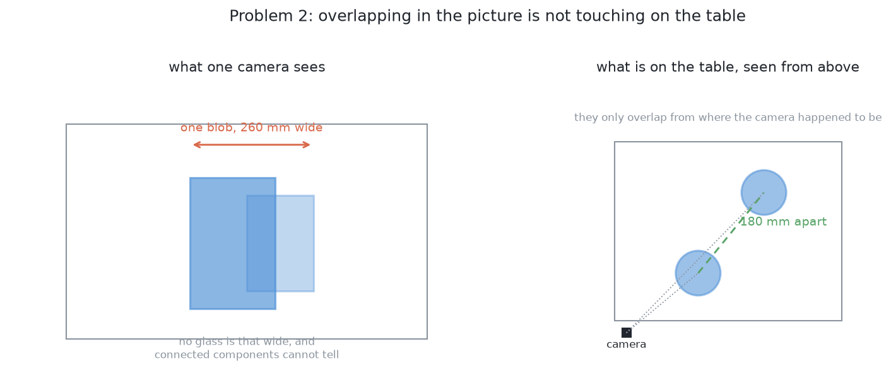
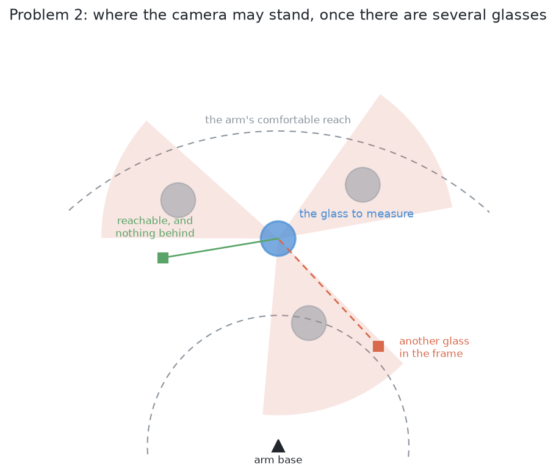

# The problem: many glasses, seen from few viewpoints

## Introduction

Several glasses stand on the table. They are all the same kind, and the kind is
known. The arm photographs them and has to work out **which pixels belong to
which glass**. That is the whole problem: it does not pick anything up and it
does not measure a shape. It ends with a set of pixels per glass and a place on
the table for each. By the end of this document you will understand the three
difficulties that make this harder than photographing one glass, and why the
hardest of the three is not that two glasses run together in a picture but that
**one of them can be absent from the picture altogether**.

## Contents

1. [Introduction](#introduction)
1. [What is on the table](#what-is-on-the-table)
1. [What is asked for](#what-is-asked-for)
1. [The three difficulties](#the-three-difficulties)
1. [What the difficulties do to the solutions](#what-the-difficulties-do-to-the-solutions)
1. [What is deliberately not in this problem](#what-is-deliberately-not-in-this-problem)
1. [What "done" means](#what-done-means)
1. [A note on the cell's own settings](#a-note-on-the-cells-own-settings)
1. [How it would be solved](#how-it-would-be-solved)

---

## What is on the table

Four to six glasses, all of one kind, drawn at proportions picked at random
inside that kind's range. They stand upright and opaque. The drying rack is
where it always is, and nothing else changes from
problem 1: same cell, same camera, same table.

Two properties of that arrangement do the work in this problem, and both are
deliberate.

**The kind is tapered, and its range of sizes is wide.** Tapered means the rim
is wider than the base, so the glass opens outwards as it rises. The range runs
from a small tapered glass at one end to a large one at the other, and the tall
end is more than twice the height of the short end. It is the widest range of
any kind in this cell, and the next section is what that width causes.

**They stand apart.** There is a guaranteed smallest gap between the centres of
any two glasses, and it is wide enough that even the two widest glasses of the
kind leave a clear strip of bare table between their rims, so no two glasses
ever touch. Separating glasses that touch is problem
3.

## What is asked for

For each glass on the table:

- a **mask**, meaning which pixels in which picture are that glass and not
  another;
- a **position** on the table, measured from the arm's base;
- a **rough width** of its footprint.

And one thing problem 1 never had to produce: an honest statement of **which
glasses it could not separate, and why**. A pair the arm cannot tell apart is a
result rather than a failure, and it is the input to
problem 3.

There is a fourth thing this problem now has to produce, and it follows from the
first difficulty below: **an honest statement of where it could not have seen a
glass at all**. That is not the same as saying which glasses it found.

## The three difficulties

The difficulties are ordered here by how dangerous they are, which is not the
order in which they are easiest to notice.

### A glass can be missing from a picture altogether

This is the difficulty the wide size range creates, and it is the worst of the
three because **nothing in the picture says it happened**.

To see why it happens, start with what a camera looking straight down does to a
tall object. The table is the furthest thing from the lens and a glass's rim is
the nearest, because the rim has climbed most of the way from the table towards
the camera. Nearer things are drawn larger and further out from the middle of
the picture. So a glass's outline is not drawn over the glass. It leans
outwards, away from the point directly below the camera, and **the taller the
glass, the further out it is thrown**. This project calls that effect **splay**.

Now put a wide range of heights inside one kind. A tall glass's outline is
thrown a long way outwards. A short glass standing beyond it is thrown hardly at
all. So the tall glass's outline can sweep outwards over the short one and cover
it completely.

When that happens, the picture looks perfectly innocent. It holds one glass of
an entirely legal width, with a clean outline, and nothing about it is wrong.
The survey simply returns fewer glasses than are standing on the table.

Two things make this worse than it first sounds.

The first is that **every check in this project is a check on something that was
found**. A width can be compared against the range the kind allows. A fitted
circle has a residual. A group can be asked how many stations saw it. None of
those exist for a glass that produced no pixels, so none of them fires.

The second is that the same cause also pushes glasses **out of the frame**.
Splay throws a tall glass outwards, and past a certain distance from the middle
of the picture it is thrown past the edge. So a glass can be absent because
something covered it, or because splay carried it out of frame, and usually
because of a mixture of the two. The outcome is identical, which means the
honest question is not "was it hidden?" but "**could I have seen it at all?**"

That question has a surprisingly good answer, and it is the reason this
difficulty is worth having in the problem. Splay is exact arithmetic, and the
glasses that *were* found have known footprints and known heights. So the region
of table that could not have been seen from a given camera position is
**computable**. An unknowable — is something missing? — becomes a checkable one:
**where could something have been hiding?**

### Glasses merge in the picture even when they are apart on the table

Problem 1 finds a glass by taking the pixels that stand above the table top and
grouping the ones that touch. With one glass that is enough. With several it is
not, because **two glasses that are nowhere near each other can still land on
top of each other in a picture**, if the camera happens to be in line with both.
The grouping step then returns one blob, and one blob means one glass to
everything downstream.

The wide size range makes this more common than it was, for the same reason as
before: a tall glass's outline is thrown outwards far enough to reach a shorter
one, so the two need not be anywhere near each other for their outlines to
touch.

This failure is at least **loud**. The blob is wider than any glass of the kind
can be, so something can notice. But noticing is not separating, and the
projection has thrown away the information needed to separate them, which is
which pixels were near the camera and which were far.

The fix is not a better grouping rule. It is to stop grouping in the picture.

### The camera can no longer stand wherever it likes

This difficulty is easy to miss when reading problem 1, because problem 1 simply
does not have it.

Problem 1 measures a glass by standing the camera back from it, looking level,
and photographing its outline. It tries several directions round the glass and
takes the first one the arm can reach. With one glass on a bare table, several
always work.

With five glasses, each direction has to clear three separate things at once.
There is **the line of sight**, because another glass behind the target lands in
the same picture and the two then measure as one object. There is **the arm**,
because the camera is on the wrist, so putting it somewhere means putting the
whole arm somewhere, and the path there may cross a glass that is in the way.
And there is **the reach**, because standing well back from a glass already near
the edge of the working area puts the camera outside it.

Each of those alone is survivable. Together they can leave a glass with **no
usable viewpoint at all**, which is not a failure of perception but a fact about
where the glasses are standing. The only way out of it is to move something.

## What the difficulties do to the solutions

The three difficulties are not independent, and the connection between them is
the reason this problem is worth solving carefully.

The second difficulty can be answered inside one picture, or at least inside one
station's pair of pictures, because the information needed is still there in the
depth readings. The first and third cannot. A glass that produced no pixels
cannot be recovered by any amount of work on the pixels that exist, and a glass
with no clear viewpoint cannot be measured from the viewpoints available.

So the answer to this problem is not one method. It is a **combination**: a way
to place what was seen, a way to work out what could not have been seen, and a
way to go and look again. Any solution that supplies only the first of those has
answered the easy difficulty.

## What is deliberately not in this problem

**Naming the kind.** The glasses are all of the same kind and that kind is
known. Problem 4 is where that stops being true.

**Measuring a shape.** A shape needs the view from the side, and whether such a
view is available is exactly what this problem is about. Once this problem has
said which glasses can be seen from where, problem 1 does the measuring
unchanged.

**Picking anything up.** No grasp, no lift, no rack.

**Moving anything.** If two glasses cannot be separated from any reachable
viewpoint, this problem reports that and stops. Moving them apart is
problem 3.

## What "done" means

A run is **done** when every glass on the table has a mask, a position and a
rough width; when every glass that could not be separated from its neighbour is
listed with the reason; and when every region of table that could not have been
seen is listed as unsearched rather than quietly treated as empty.

Scored against the simulator's own record of what it spawned — which the report
may read and the arm may not — the numbers worth watching are these:

- how many glasses were found, against how many were put out;
- how many were **missed**: on the table, and in no report at all;
- how many were **merged**: two real glasses reported as one;
- how many were **split**: one real glass reported as two;
- for each glass found, how far its reported position is from the true one;
- how many glasses had no usable viewpoint, which is the handover to problem 3;
- how much of the zone was reported as unsearched, and whether anything was
  actually standing there.

The one to watch hardest is **missed**, and it has taken that place from
*merged*. A split glass looks wrong immediately, because both halves are too
small to be glasses. A merged pair looks like one large glass, which is worse,
because everything downstream believes it. But a missed glass leaves no trace at
all: there is no bad number to find, no failed check, and nothing in the run to
read. The only defence against it is to have worked out, in advance, where a
glass could have been hiding.

## A note on the cell's own settings

The range of sizes and the guaranteed gap described here are the ones the cell
actually uses, and both are recorded in [the cell](../01_the-cell.md) together with
the file that holds them. The tapered kind is the widest of the four kinds on
purpose, because a narrow range of sizes cannot produce the first difficulty at
all.

The short end of that range is set by two parts of the cell that have nothing to
do with perception: below it a glass no longer clears a rack peg when it is
stood mouth down, and the gripper can no longer close on it where the rule for
this kind says to hold it. So the hardest arrangement this problem can be given
is the hardest one the rest of the arm can still work with, which is the right
place for the limit to come from.

## How it would be solved

→ [Solution overview](03_the-ten-solutions.md)
