# Solution 4 — choosing the next look

*Hybrid, with the model as a ranker. The geometry decides where the camera is
allowed to stand; a learned score decides which of those places is worth the
seconds.*

> **The cell is described once, in [the cell](../../01_the-cell.md)** — the
> layout, the two places the camera works from, from the top and from the side,
> all four sensors, and the words this project uses them with. What follows is
> only what is specific to this solution.

## Introduction

This document explains how a machine can learn to choose where to look next, and
it sits directly on top of [move the
camera](../04_programmed/03_move-the-camera.md). That solution already generates
every candidate viewpoint and already rejects the unsafe ones with arithmetic.
It then orders the survivors with a rule somebody wrote down, and that rule is
the only part of it this document replaces.

Replacing it matters because the arm can afford one or two extra pictures at
most, so whatever puts the survivors in order is deciding how the most expensive
resource in the cell gets spent. A written rule does that badly in a way no
amount of care removes, and the next section shows exactly where it goes wrong.

There are two honest ways to learn a better order, and they differ in what the
model is asked to predict. The first asks **how much doubt would this look
remove?** The second asks **would the answer actually change?** The first is
easier to obtain and is a stand-in for what you want; the second is the thing
you want and takes more care to label. They share a skeleton, so this document
builds both and says which rung to climb to.

By the end you will understand why the ordering is the only safe place for a
model in a machine that moves, what a doubt number has to satisfy before it is
allowed to steer an arm, why that doubt has to be a list of measurements rather
than one number, where the labels for the second kind come from for nothing, and
why the arithmetic keeps every power to refuse in both.

## Contents

1. [Introduction](#introduction)
1. [The problem this solves](#the-problem-this-solves)
1. [The main idea](#the-main-idea)
1. [The arithmetic comes first](#the-arithmetic-comes-first)
1. [The lower rung: ordering by doubt](#the-lower-rung-ordering-by-doubt)
1. [The upper rung: ordering by the outcome itself](#the-upper-rung-ordering-by-the-outcome-itself)
1. [How the concepts fit together](#how-the-concepts-fit-together)
1. [The loop, and why it must have a budget](#the-loop-and-why-it-must-have-a-budget)
1. [When the glasses are completely hidden](#when-the-glasses-are-completely-hidden)
1. [A worked example](#a-worked-example)
1. [The counter-argument, which is the honest part](#the-counter-argument-which-is-the-honest-part)
1. [Where the ideas come from](#where-the-ideas-come-from)
1. [The general ideas behind this](#the-general-ideas-behind-this)
1. [Where it is strong and where it breaks](#where-it-is-strong-and-where-it-breaks)
1. [Where it sits among the other solutions](#where-it-sits-among-the-other-solutions)

---

## The problem this solves

The problem statement asks for one set of pixels per glass, a position for each,
and an honest list of the pairs that could not be separated.

Two glasses that stand far apart on the table can still land on top of each
other in a picture. When that happens, the step that groups touching pixels
returns one blob, and everything downstream believes it is one glass. That is
the failure the problem watches hardest, because it does not announce itself.

The fix is to take a different picture. But the camera is mounted on the wrist,
so a viewpoint is an arm pose, and that costs seconds of movement while the
picture itself costs milliseconds. So the question is not *can we look again*.
The question is **where**, given that we can only afford one or two more looks.

[Solution 3](../04_programmed/03_move-the-camera.md) answers that question with a
rule. Throw away the poses the arm cannot reach. Throw away the ones looking
through another glass. Of whatever is left, take the one that asks least of the
arm's reach.

That rule is cheap, printable, and right most of the time. Its blind spot is not
an oversight by whoever wrote it. **It is a symmetry.**

### The symmetry a reach-based rule cannot see

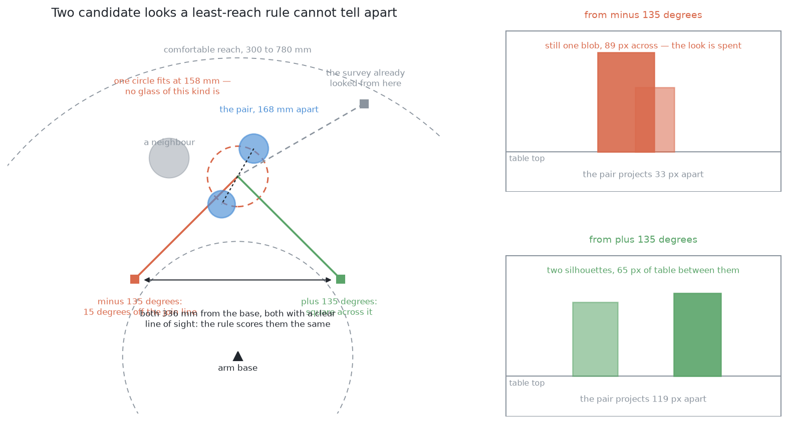

Here is the geometry. How far the camera ends up from the arm's base depends
only on the angle between the direction it stands off in and the line running
out from the base. Swing that same angle to the other side of that line, and the
distance from the base is identical.

So **every viewpoint has a mirror image that scores exactly the same.** A rule
that ranks by reach cannot separate two candidates on opposite sides of the line
out from the base, however different what they would see. Both of the coloured
cameras in that picture stand the same distance back from the same group, both
are the same distance from the base, and neither has anything in the way. To a
reach-based score they are the same pose.

They are not remotely equally useful. One of them looks **across** the line
joining the hidden pair, so the two glasses land well apart in the picture with
clear table between them, and the fit resolves them. The other looks almost
**along** that line, so the near glass covers most of the far one and the
picture comes back as a single blob — no better than the picture that raised the
doubt in the first place, and one look poorer.

To tell those two apart, a rule would have to know about the line joining the
proposed pair, about which views have already been taken, and about how both of
those interact with the fitted widths. Somebody could write that rule. Then they
would write the next one, and the one after that.

### The alternative: measure the outcome directly

The alternative is to stop writing rules and ask the question we actually care
about: **if I go there and take the picture, will this group come apart into two
glasses?**

That is a yes-or-no question about one pose in one arrangement, and it has an
exact answer. Better still, the simulator can simply look that answer up,
because it renders the view from any pose it is asked for, and it knows exactly
what it spawned.

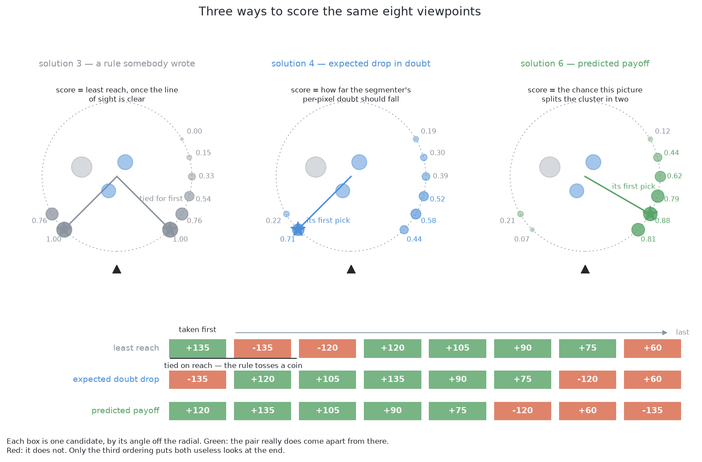

Those three panels show one arrangement and a set of candidates, scored three
ways, where green in the rows at the bottom means the pair really does come
apart from there.

**Solution 3** scores by least reach. Its top two candidates are tied exactly,
because of the symmetry above, and one of them is useless.

**The lower rung here** scores by how far the model's own doubt should fall.
That is a better question than reach, but it is still a stand-in for the real
one, and it has a specific bad case. From the pose that lines the two glasses
up, the blob looks like one clean, well-bounded glass, so the model is
*confident*, and a large predicted drop in doubt is exactly the wrong answer.

**The upper rung** scores the chance the picture splits the group, and it is the
only one of the three that puts both useless looks at the end.

## The main idea

The main idea is a division of labour, and the division is chosen so that the
learned part cannot do harm.

The geometry stays in charge of where the camera is **allowed** to stand. A
place to stand has to be reachable, it has to have a clear line of sight, and
the planner has to accept a path to it. All three of those are arithmetic or
nearly so, and all three run first.

A learned number then does the smaller job of saying which of the survivors is
worth the seconds. It can never let in a pose the arithmetic rejected, and it
can never declare a glass settled.

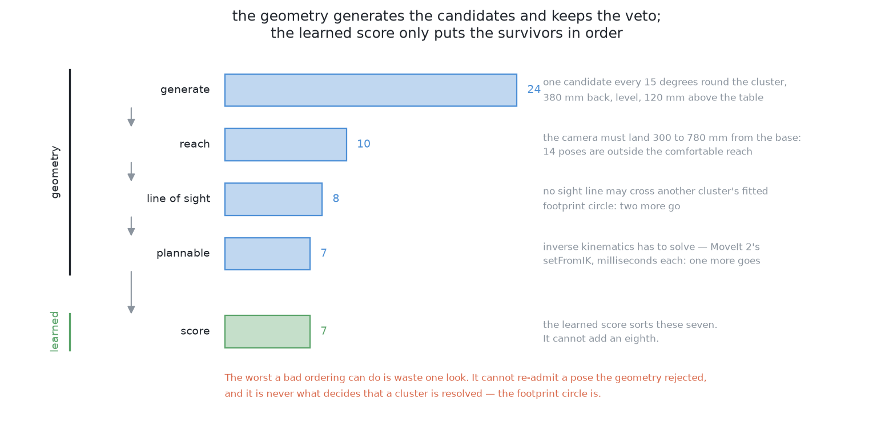

Notice in that picture that the count of candidates only ever falls. The learned
stage takes the survivors and hands back the same survivors in a different
order. That is what makes this a hybrid rather than a learned system, and it is
what guarantees that a wrong prediction costs **one wasted look** rather than a
wrong answer.

What remains is to decide what the learned number should mean, and there are two
answers worth building. They form a ladder, and it is worth seeing both rungs
before choosing one.

**The lower rung orders by doubt.** The model estimates how much the doubt about
a glass would fall if the camera went to this pose. Doubt is something the
pipeline can already measure without any extra machinery, so this rung needs no
new source of truth. Its weakness is that it is a stand-in: doubt falling is a
proxy for the answer improving, and the two can come apart.

**The upper rung orders by the outcome itself.** The model predicts whether a
picture from this pose would actually change the answer — split an ambiguous
group into two glasses, or find a glass that was not in the list before. That is
the thing actually wanted rather than a stand-in for it, and the simulator can
look the answer up exactly, so the labels cost nothing. Its weakness is that it
needs those labels, and therefore a training run, before it can do anything at
all.

The rest of this document builds the shared skeleton first, then each rung in
turn, then the loop they both drive and the case that defeats both.

## The arithmetic comes first

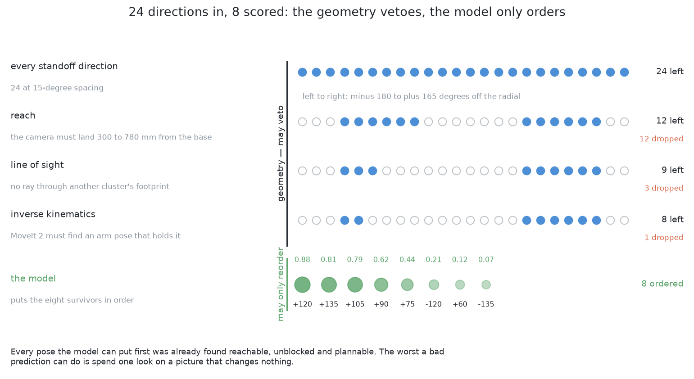

Before the model is consulted at all, the candidates pass through the same three
vetoes [solution 3](../04_programmed/03_move-the-camera.md) uses, in the same
order, cheapest first.

The **reach** veto requires the camera to land inside the band of distances the
arm works comfortably in. The **line of sight** veto rejects any ray passing
through another group's fitted footprint circle. And the **plannability** veto
asks whether any set of joint angles exists that puts the hand at the pose at
all, dropping the ones that have none.

Only then does the model read its measurements and return a probability.

That ordering is the safety argument, and it is a rule rather than an
implementation detail: **everything that can reject a pose is arithmetic, and
the model comes after all of it.** The worst a wrong prediction can do is put
one reachable, unblocked, holdable pose ahead of another. The cost of that is
one look. The model is never asked about safety, so it cannot cause an unsafe
movement.

There is one more reason the ring of candidate directions should be **fine**
rather than coarse, and it belongs here because it depends on the vetoes being
cheap. Over hundreds of drawn arrangements, a coarse ring leaves getting on for
half of all glasses with no usable viewpoint, while a fine ring leaves only a
small fraction. So most of what this cell calls "no viewpoint" is the ring
running out of spokes rather than the geometry running out of room. Generating
more candidates costs arithmetic and nothing else, because the vetoes throw them
away before the planner is ever asked.

## The lower rung: ordering by doubt

The first way to order the survivors is to ask how much each look would settle.
Because the whole design then rests on that one number, the next four sections
are about it: what it is, what it has to catch, how it can be obtained, what has
to be true of it before it is allowed to steer an arm, and why it must not be a
single number at all.

### What a doubt number is

**Uncertainty** is a second number returned beside an answer, saying how far to
trust the first number.

Its shape depends on what the model was asked. For a **detection**, which is a
rectangle drawn round an object, the doubt is one number for the whole
rectangle. For a **segmentation**, which is a yes-or-no label at every pixel,
the doubt is one number per pixel, so the doubt is itself a picture the same
size as the original.

Three questions have to be asked of such a number before it is allowed to spend
arm time, and the next three sections are those questions.

#### The one case it has to catch

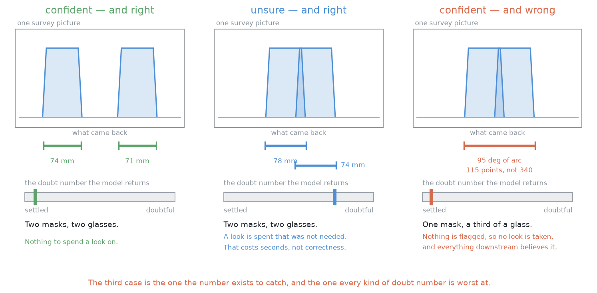

There are three cases, and they are not equally important.

The first case is **confident and right**. Two masks over two glasses, with low
doubt. There is nothing to spend a look on, and the loop correctly spends
nothing.

The second case is **unsure and right**. Here the loop spends a look it did not
need. That costs seconds of arm time rather than correctness, and seconds are
the cheaper currency, so this case is a nuisance rather than a danger.

The third case is **confident and wrong**. One mask lying over two glasses, or a
mask covering only part of one glass, with low doubt attached. Nothing is
flagged, no look is taken, and the run reports a glass that is not where it says
it is.

Look at the third panel of that picture. The doubt is low and the answer is
wrong, and the bar looks exactly like the bar in the first panel, where the
answer was right. **A doubt number is only worth having if it catches the third
case**, and every method described later is best at the second case and worst at
the third.

Worse, in that third case the model's uncertainty is often *genuinely* low, and
it is worth understanding why, because the reason is not a flaw in the model.
The mask really is a perfectly good mask — of two glasses, or of part of one.
The model was asked which pixels are glass, and it answered that correctly.
Nothing in that question has any opinion about how many glasses there are, or
about how much of one glass you happen to be looking at.

So the doubt has to come from somewhere that does have an opinion about those
things, and in this cell that somewhere is the geometry: the circle fitted to
the footprint, and how much of that circle the points actually cover.

#### Wrong is not the same as unusual

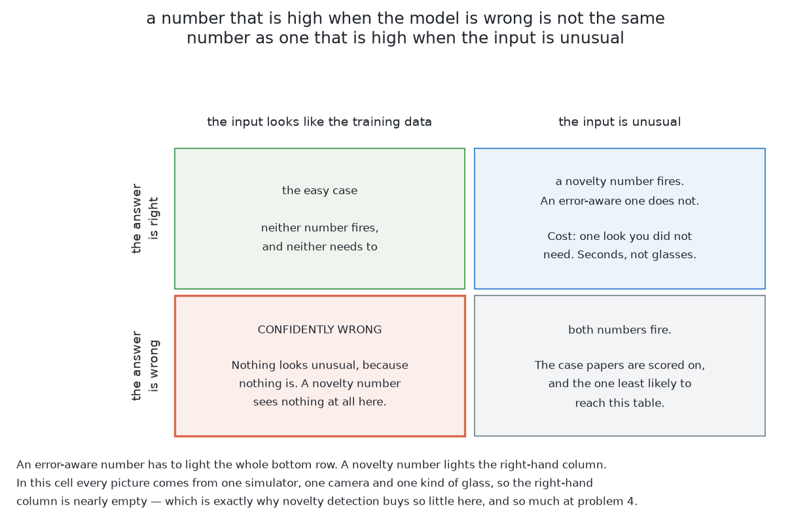

The second question separates two ideas that are constantly confused, and the
confusion matters because one of them is much easier to get than the other.

**Novelty detection** is high when the input looks unlike the training data.
**Error-awareness** is high when the answer is wrong, whatever the input looked
like. The loop wants the second, and the second is far harder.

Read the left-hand column of that picture. Both of those cells hold ordinary,
familiar-looking inputs. One answer is right and one is wrong, and no amount of
novelty detection tells them apart, because nothing about the input was unusual.
The two ideas coincide only where an unusual input also produces a wrong answer,
which is the corner most published work is scored on.

In this cell, every picture comes out of one simulator, through one camera, with
one kind of glass. So the unusual-input column is nearly empty, and novelty
detection buys almost nothing here. It starts buying a great deal at problem
4, where the kind is no longer known, and where
a badly calibrated model is most confident precisely about the shape it has
never seen.

#### Two kinds of not knowing

The third question asks whether another picture could even help, and there are
two established words for the answer.

**Aleatoric** doubt is noise in the measurement itself, and another picture will
not remove it. A genuinely blurred edge stays ambiguous however many times you
photograph it.

**Epistemic** doubt is the model not knowing, and a different picture can remove
it.

Only epistemic doubt justifies moving the arm, and this is the sentence that
makes the whole loop sensible rather than superstitious. A hidden glass is
epistemic almost by definition: the fact that would settle it exists in the
world, and it is simply not in a picture taken from in line with its neighbour.

### Five ways to get a doubt number

Having established what the number has to do, here are the practical ways to
obtain one. They differ far more in what they cost to train than in what they
cost to run.

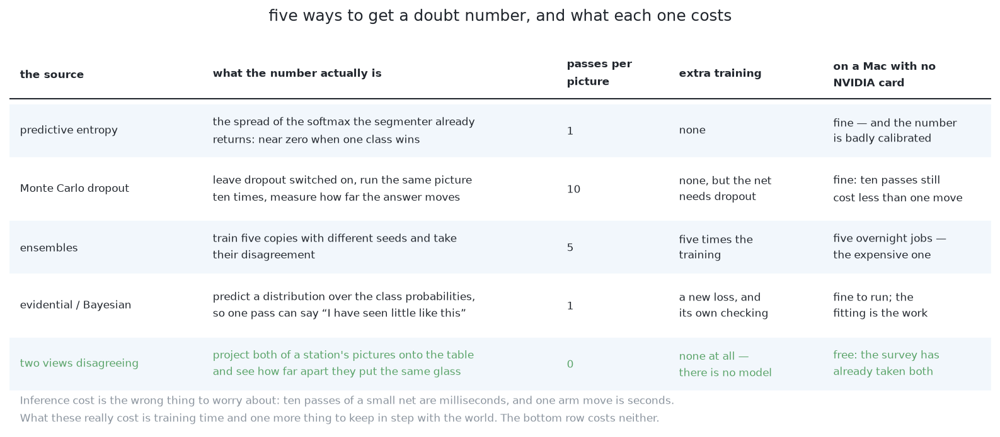

The first is **predictive entropy**, which measures how spread out the model's
per-pixel probability is. Entropy is worth reading as a shape rather than as a
formula: it is largest when the model is exactly torn between its two answers,
and it falls away towards zero as the model becomes sure of either one. So a
large value means "no idea" and a small one means "sure". It costs one pass
through the network and no extra training, which is why almost everyone reaches
for it first. Its weakness is the one that matters here, because these outputs
are systematically overconfident ([Guo and
colleagues](https://arxiv.org/abs/1706.04599)), so a confidently wrong answer
comes back with confidently *low* entropy, which is exactly the third panel
above.

The second is **Monte Carlo dropout**. Dropout is a training trick that switches
off random parts of a network so that it does not lean too heavily on any one
part. The trick here is to leave it switched on when the model is *used*, run
the same picture several times, and read the spread of the answers ([Gal and
Ghahramani](https://arxiv.org/abs/1506.02142), with [Bayesian
SegNet](https://arxiv.org/abs/1511.02680) as the per-pixel version). It needs
several passes rather than one, and no extra training at all.

The third is **ensembles**. Train several copies of the network from different
random starts, and then read their disagreement. Where the copies agree, the
answer came from the data; where they disagree, it came from the random start.
[Deep ensembles](https://arxiv.org/abs/1612.01474) win most published
comparisons, and they multiply the training cost by however many copies you
train.

The fourth is **evidential and Bayesian deep learning**, where the network
predicts a distribution *over* probabilities rather than a single probability,
so one pass returns both the answer and how much evidence stands behind it
([Sensoy and colleagues](https://arxiv.org/abs/1806.01768), and [Amini and
colleagues](https://arxiv.org/abs/1910.02600) for continuous outputs). The cost
is a less familiar training objective, and the evidence strength then needs its
own calibration check.

The fifth needs **no model at all**, and for that reason it is the one to build
first. Segment both pictures of a station, project each onto the table, and
measure how far apart the two of them put the same glass. The two views should
agree to within the noise in a depth reading, so a disagreement several times
larger than that is not noise. It is a sign that one of the two views was
looking at something other than a whole glass. This costs nothing, because both
pictures are already paid for.

The comparison between these is easier than it looks, because of the cost
imbalance in this cell. Even a method that needs several passes through the
network is still thousands of times cheaper than one movement of the arm. So on
a machine with no dedicated graphics card, the choice between them is about
**training cost**, and not about what happens while the run is going.

### Calibration: what makes the number mean anything

A doubt number can behave correctly and still be useless, and calibration is the
property that separates the two.

A doubt number is **calibrated** when its claims come true about as often as it
says they will. If it says it is sure, it should usually be right. If it says it
is unsure, it should be wrong a fair share of the time. Anything else, and a
threshold placed on that number is a threshold on nothing in particular.

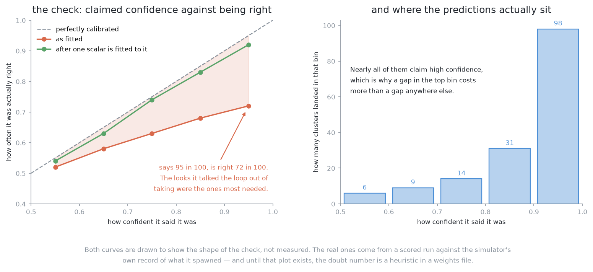

The gap between the curve and the dashed diagonal is the thing to look at. Where
the model claims to be almost certain and is in fact right only about two thirds
of the time, the loop is being talked out of exactly the looks it most needed.

Checking calibration is straightforward here, because the simulator knows what
it spawned. Run the pipeline over a few hundred spawned arrangements, sort every
prediction into bins by the confidence it claimed, and plot claimed against
observed. A curve below the diagonal is overconfident, which is both the usual
direction and the dangerous one. The single summary number is the average gap
between claim and outcome, weighted by how many predictions fell in each bin,
and that weighting matters because nearly all predictions claim high confidence.

The repair is cheap and standard. It is called **temperature scaling**, and it
divides the model's raw scores by one single number before they are turned into
probabilities, with that number fitted on data the model never trained on. It
does not make a wrong answer right. It makes the model's *claim* about that
answer honest, which is all the loop needs.

Until that plot exists for this cell, the doubt number is a rule of thumb that
happens to live in a weights file. That is an argument for measuring it rather
than an argument against fitting it, and the simulator makes the labels free.

### Why the doubt has to be a list

We now have everything needed to explain the most important design decision in
this solution, which is that the doubt is **several measurements rather than one
number**.

Start with the obvious design and see it fail. Suppose the score the model is
trained to predict is the expected drop in the model's own uncertainty. If the
perception step is confidently wrong, then there is no uncertainty to drop, so
every candidate scores near zero, and the ordering carries no information at all
— in exactly the case where the ordering was needed.

The repair is to make the doubt a list of measurements that come from different
places, and then to have the learned part predict how far that whole list would
fall. The list has five entries in this solution.

The first entry is the model's own doubt, as the average per-pixel entropy over
the group's mask. The second is pure geometry, owing nothing to the model: the
residual of the fitted circle, and whether its width is inside the range this
kind of glass can be. The third is also geometry, and it is the entry that
catches the case the model is blind to: how much of the circle the points
actually span, and how many points there are against how many a footprint that
size should give. The fourth is the model-free disagreement between the
station's two views, which is already paid for.

The fifth entry is different in kind from the other four, and it has to be there
because of the difficulty this problem added. **It is the unsearched area** —
how much table could not have been seen, in patches large enough to hold the
smallest glass of the kind, as computed by [solution
2](../04_programmed/02_cluster-on-the-table.md)'s blind-region arithmetic. Why that
entry is necessary, what it buys and what it does not, is the subject of [when
the glasses are completely hidden](#when-the-glasses-are-completely-hidden)
below.

Two properties of that list matter more than its contents.

The first is that a group is doubtful if **any one** of the entries fires. They
are combined with *or* rather than with *and*, so a silent model cannot suppress
a geometric complaint. If they were averaged into one number, a confident model
could quietly drown out the geometry.

The second is that where the model's own doubt is real it will dominate the
list, and where the model is confidently wrong the geometric entries still have
something to say, so the score still orders the candidates sensibly. **Making a
model's own confidence the sole currency of doubt is the mistake.** The geometry
has to be in the currency too.

#### What the model is trained on, and where that comes from

The training data is free, which is the practical reason this is buildable at
all. Spawn an arrangement in the simulator. Run the survey. Note which groups
are doubtful and by how much. Pick a candidate pose, render the view from it,
run the geometry again, and measure how far the doubt actually fell. That gives
one training example — the state and the pose going in, the measured drop coming
out — with no arm moving and nobody labelling anything. A few thousand of them
is an overnight job.

## The upper rung: ordering by the outcome itself

Ordering by doubt is ordering by a stand-in. What is actually wanted is not that
a number should fall but that the answer should improve, and those two can come
apart: a look can make a model less sure while leaving the report exactly as it
was, and a look can leave a model's confidence untouched while finding a glass
nobody had.

So the upper rung predicts the outcome directly. Score a candidate viewpoint by
the chance that a picture from there splits an ambiguous group into two glasses,
or finds a glass that was not in the list before. That question has an exact
answer, the simulator can simply look it up, and choosing a viewpoint therefore
becomes ordinary supervised learning with labels that cost nothing.

There is no episode, no reward, no exploration schedule and no discount factor.
There is an input, an attempt, and a recorded outcome. The two sections below
are where those come from and what the model is shown.

### Where the training data comes from

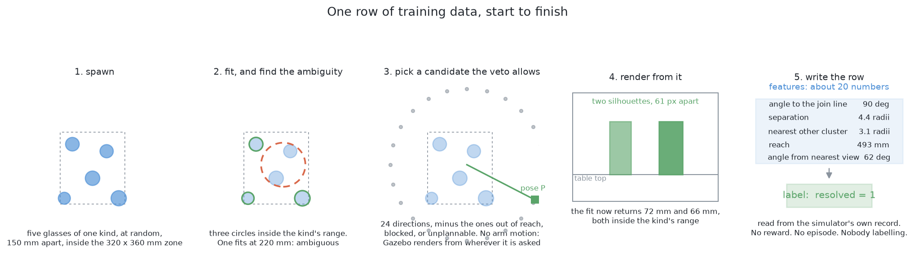

The training data comes from a sweep that needs neither a person nor an arm. It
runs entirely inside the simulator and appends one row each pass, in five steps.

First it **spawns** an arrangement: four to six glasses of one kind in the zone
at random, never closer than the smallest legal gap, with proportions drawn from
the kind's plausible range.

Then it **fits**, by running the normal survey and the normal clustering. A
group whose fitted circle falls outside the range this kind of glass is allowed
is ambiguous, and those are the groups this solution is about. In the picture
above, one group fits a circle far too wide for any single glass of its kind.

Then it **picks a candidate**, by generating the ring of directions round that
group and dropping the ones the geometry rejects.

Then it **renders** the view from that pose. Note what does *not* happen here:
the arm does not move and nothing is planned. This is a camera placed in a scene
and nothing more, which is why the sweep is cheap.

Finally it **writes the row**, holding the candidate's measurements and the
outcome of re-running the fit on the rendered picture.

The outcome in that last step is **read rather than judged**, and this is what
makes the labels exact. The simulator holds the true poses of everything it
spawned, so "did the group come apart into the right two glasses" is a lookup
rather than an opinion.

A few thousand arrangements give tens of thousands of rows, because about ten
candidates survive the veto per group and an arrangement usually yields one or
two ambiguous groups.

One thing about splitting that data matters, and getting it wrong would quietly
invalidate everything. **Hold back whole arrangements, not individual rows.**
Two candidates from the same arrangement are not independent of each other, so
splitting by row lets the model look the answer up instead of predicting it, and
the measured accuracy then means nothing at all.

#### The one choice about the label that decides everything

There is a choice hiding in that last step, and it decides more than it appears
to.

The label is *did this picture change the answer*, which is yes if the failed
group came back as two circles inside the kind's allowed range, and no
otherwise. It is **not** *was the final answer correct*.

The difference is the whole reason the second loop later in this document is
possible. Being correct needs ground truth, which the arm will never have
outside a simulator. Having changed the answer needs only the two fits, before
and after, and a comparison between them. So the label is **observable during an
ordinary run**, on a real table, with no simulator and nobody watching.

That one property is what turns this from a thing you train once into a thing
that improves with use.

The same label extends cleanly to the second kind of request this problem makes,
which is a look aimed at a place a glass could be hiding in rather than at a
group that came back too wide. [When the glasses are completely
hidden](#when-the-glasses-are-completely-hidden) works that case through.

### What the model is shown

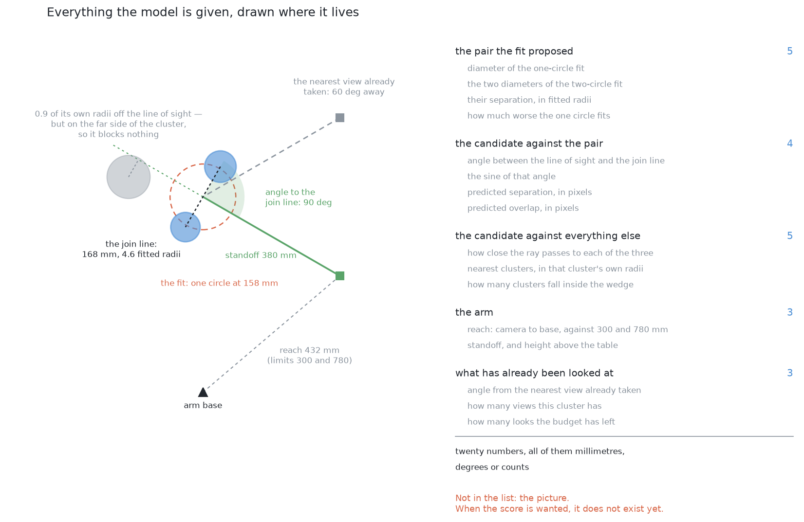

Every measurement handed to the model is a length, an angle or a count, and
**never a pixel value**. There is a hard reason for that rather than a stylistic
one: at the moment the score is wanted, **the picture does not exist yet**. The
arm is deciding whether to spend seconds going somewhere, so the only input
available is a prediction computed from what it currently believes.

Hand-made measurements have three further advantages here. They transfer,
because a length on the table means the same thing under a different light, with
a different glass colour and a different camera setting. They can be fitted from
thousands of rows, where raw pixels would need orders of magnitude more, and
every one of those rows costs a render. And when the model chooses wrongly, you
can print the measurements and see at a glance which one was unusual.

They fall into five groups, and each group answers a different kind of question.

**About the proposed pair**, there is the width of the single fitted circle, the
two widths the two-circle fit proposes, the separation between those two centres
measured in fitted radii rather than in millimetres so that the number means the
same for a large glass and a small one, and how much worse one circle fits than
two — which is how strongly the geometry believes there are two things there at
all.

**About the candidate against that pair**, there is the angle between the line
of sight and the line joining the two proposed centres, where square across
separates them as much as possible and straight along separates them not at all,
together with the separation and overlap the pair would show in the picture.
Those last two are the same geometry expressed in the units the camera actually
works in, and that is what decides whether the two outlines touch.

**About the candidate against everything else**, there is how close the ray
passes to each of the nearest other groups, measured in that group's own radii,
and how many groups fall inside the camera's view. One subtlety is included
deliberately: a neighbour can sit close to the line of sight and block nothing
at all, because it is on the far side of the target, so the sign matters and is
part of the measurement.

**About the arm**, there is how the reach sits against the two ends of the
comfortable band, the standoff, and the height above the table. The vetoes have
already worked all of these out, so they cost nothing to include.

**About what has already been looked at**, there is the angle from the nearest
view already taken, how many views this group has had, and how many looks the
budget has left. This is the group a hand-written rule always forgets, and it is
what decides the worked example below, because **a picture taken from almost
where you already stood is almost the same picture**, and it teaches you almost
nothing new.

#### Why trees rather than a network

A yes-or-no answer predicted from a short table of numbers of different kinds —
angles, lengths, ratios and counts — is exactly the case that **decision-tree
boosting** was made for (Friedman, *Greedy Function Approximation: A Gradient
Boosting Machine*, Annals of Statistics, 2001).

A tree asks threshold questions, such as "is the line of sight more than halfway
towards square with the joining line?", and lands in a leaf holding a
prediction. Boosting fits a weak tree, then fits the next tree to whatever the
first one got wrong, and adds them up. On a table of this size that trains in
seconds on an ordinary processor, with no graphics card involved anywhere.

A small network is worth having only if the target stops being a yes or no and
becomes a number, such as how far the fit error dropped, because a network fits
a smooth curve more naturally than a staircase of thresholds does. But an
ordering needs only the ranking, so a yes-or-no target is enough to start with.

## How the concepts fit together

Both rungs share one pipeline, and it is worth seeing the whole of it in order,
because each stage constrains the next.

A run produces a **report**: a list of glasses with positions and widths, a list
of pairs it could not separate, and a list of places it could not have seen.
From that report come the **requests** — a doubtful glass, or an unsearched
patch — and each request is a thing the arm might spend a picture on.

For each request the geometry **generates candidates**, which are poses the
camera could take, and then **vetoes** the ones that fail reach, line of sight
or the planner. Every veto is arithmetic and every veto runs before anything
learned is consulted. What survives is a set of poses, all of them safe, none of
them ordered.

The **model orders them**. On the lower rung its input is a vector of doubt
measurements and its output is how far that doubt should fall. On the upper rung
its input is a set of measurements about the request and the pose and its output
is the chance the answer changes. In both cases the output is used for one thing
only, which is to sort.

The arm **takes the first look** the budget allows, the report is recomputed,
and the cycle repeats until nothing is doubtful or the budget is spent.

Three properties of that chain are what make it safe to put a model inside it.

**The count of candidates only falls.** Nothing learned can add a pose, so
nothing learned can put the arm somewhere the arithmetic refused.

**The doubt is a list, not a number.** The measurements are combined with *or*,
so a confident model cannot silence a geometric complaint. That is argued in
full above and it is the single most important design decision in this document.

**The budget is written down, not learned.** How many looks a run may take, and
how they are divided between doubtful glasses and unsearched patches, belongs in
a rule a person can read and change. A model that decided its own budget could
spend the whole of it on one glass.

## The loop, and why it must have a budget

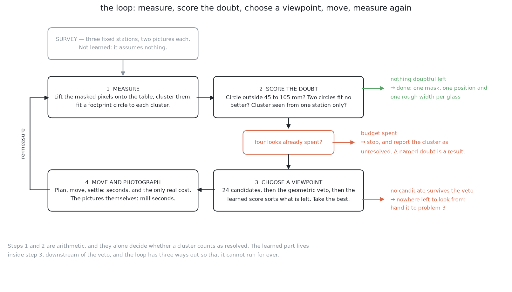

Follow the right-hand edge of that picture. There are three ways out of the
loop, and one of them is simply running out of time.

The loop itself is old. Bajcsy's *Active Perception* (Proceedings of the IEEE,
1988) made the argument that a camera which can move is not the same instrument
as one that cannot, and Connolly's *The Determination of Next Best Views* (ICRA,
1985) named the step that follows from it: given what has been seen, decide
which viewpoint comes next. This solution keeps that shape and changes only what
"next best" is scored on.

### The classical score, and why it is not used here

It is worth knowing the textbook score, because dismissing it without
understanding it would be a mistake.

The textbook score is **information gain over an occupancy map**. You cut the
room into cubes, store a probability of occupancy for each cube, and score a
candidate pose by how much of the map's total uncertainty that picture would
resolve (Moravec and Elfes, ICRA 1985, with OctoMap as the standard
implementation).

It is affordable here. The glass zone is small and the glasses are short, so a
grid fine enough to be useful comes to a few hundred thousand cubes. One
candidate casts one ray per pixel of the picture, and each ray crosses a few
tens of cubes, so that is a few million cube visits per candidate, which is
milliseconds of work. The whole ring of candidates still finishes well inside a
second, and the motion planner already keeps an occupancy map, so the structure
exists whether or not this solution is built on top of it.

It is not used because **it answers a different question**. Occupancy
uncertainty asks *where is the room unmapped*. The question here is *have I seen
enough of this glass*, and a badly seen glass sits on a perfectly well-mapped
table. So a volume-based score would happily send the arm to look at the empty
half of the table. What survives from the idea is its shape: score a candidate
by the doubt it would remove.

### The budget, which is the exit condition

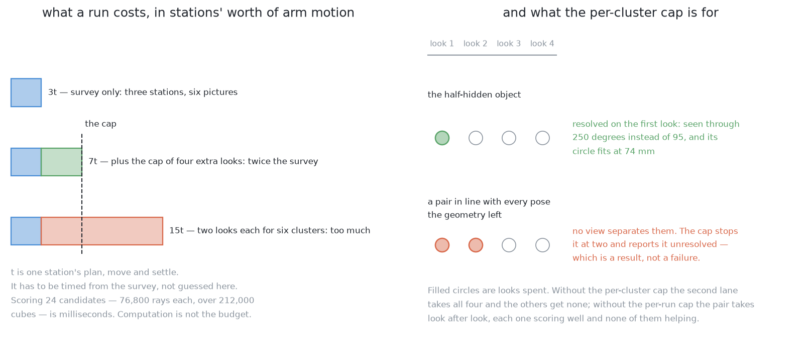

The budget is easiest to reason about in the right unit, and the natural unit is
one station's worth of arm motion: one plan, one movement, one settle. That
absolute figure has to be measured rather than asserted, so both panels of that
picture are drawn in units of it.

In those units the survey is three units. With a small cap on the extra looks,
the worst case comes to a little over twice the survey, which fits a run meant
to take tens of seconds. Letting every object take its full allowance of looks
would come to about five times the survey, which does not fit at all.

That gives **two caps rather than one**, and both are needed for different
reasons. A **per-object cap** stops a single hopeless object eating everything.
A **run-wide cap** stops several moderately doubtful objects between them eating
everything.

The right-hand panel shows why both are needed. One object resolves on its first
look and gives the rest of its allowance back. Another object — one lying in
line with every pose the geometry left available — never resolves, and without
the per-object cap it would take the whole run's budget, with each look scoring
well and none of them helping.

When a cap fires, the object is reported as unresolved together with its reason.
That is a result and not a failure, because the problem statement asks for
exactly this list.

### What the loop costs in computation, which is nothing

It is worth adding up the computation, because the answer settles an argument
that otherwise recurs.

Per doubtful object, the loop does one square root per candidate direction for
the reach test, one line-against-circle test per candidate and neighbour for the
sight lines, one inverse-kinematics query at milliseconds each for whatever
survives those, and one pass of a small network per remaining candidate. Even
the full volume-based score, casting a ray per pixel through a grid of hundreds
of thousands of cubes, would be milliseconds.

Measured against the cost of one arm movement in seconds, every bit of that is
free. So **the thing to economise on is the number of times the arm moves, and
not the arithmetic.** A design that saves computation by taking one more look
has the trade exactly backwards.

## When the glasses are completely hidden

The difficulty this section is about was named near the start of this document:
a glass can be absent from a picture altogether. Everything since then has been
about doubt attached to something the camera found. This section is about the
case where the camera found nothing, and that case breaks the connection between
the two.

Start from where a doubt number comes from. A doubt number is produced from
something the model was shown. A glass that contributed no pixels was not shown.
There is no mask of it, no group of points, no fitted circle and no entropy over
anything. Four of the five entries in the doubt list are measurements of a
group, so all four stay silent. The loop then spends its whole budget improving
measurements of glasses it can already see, while an entirely unseen glass goes
unmentioned. It would be busy and useless in exactly the case that matters most.

So if the run is to hold any doubt at all about a glass it never saw, that doubt
cannot be attached to a detection. It has to be attached to a **place**: a patch
of table, carrying a statement about what could have been standing on it. That
is what the fifth entry in the doubt list is, and it is why the list has one
entry that is not about any object.

A doubt attached to a place cannot be worked out from the picture alone, and it
is worth being exact about what else has to be fed in. The first thing is where
the camera stood and how high, because without that nothing about the picture
can be turned back into positions on the table. The second is the height and
width of every glass that *was* found, because each of those is what hides the
table behind it. The third is the edge of the frame, which is a fact about the
lens rather than about the table. The fourth is the smallest footprint this kind
of glass can have, which comes from the problem statement and not from any
camera. None of those four is in the pixels, and a model shown only pixels
cannot supply any of them.

The two ways a glass ends up contributing nothing are different failures with
different cures, and the rest of this section takes them one at a time.

### When the camera is looking straight down

This is the survey view: the camera 450 mm above the table, pointed straight
down. The mechanism here is splay, and it is worth restating in the form this
case needs.

A slice of a standing glass at height *z* is nearer the lens than the table is,
so it is drawn as though it had been scaled about the point directly below the
camera by *H* / (*H* − *z*), where *H* is the camera's height. The point
directly below the camera is called the nadir. At *H* = 450 mm a slice 225 mm up
has a factor of exactly 2, so the rim of a 225 mm glass is drawn twice as far
out from the nadir as the glass really stands, and twice as wide. Every part of
the glass moves directly away from the nadir, which is why the effect is radial
rather than in some fixed direction.

That outward throw is what lets one glass's outline reach over a neighbour. A
short glass standing beyond a tall one is thrown outwards hardly at all, while
the tall one is thrown a long way, so the tall one's outline can sweep over it.
When the tall glass's splayed outline contains the whole of the short glass's,
the short glass contributes no pixels at all. What comes back is one patch, and
it is one patch of an entirely ordinary glass: the group fits a circle at the
tall glass's own width, which is a legal width for the kind, with a small
residual and dots round most of it. The model's own doubt about it is low, and
correctly so, because the mask really is a good mask of the tall glass.

Three things have to be true at once for this to happen, and they are worth
separating. The two glasses have to stand close together. They have to differ a
lot in height, which is why this problem widened the kind's range. And they have
to lie the right way round: splay is radial, so a pair lying along a radius from
the nadir can hide and the same pair lying across a radius cannot. Of the 132
ordered pairs that twelve glasses drawn from this kind's range make, twenty can
swallow the other whole at the guaranteed 150 mm gap, and in every one of the
twenty the hidden glass is the shorter one.

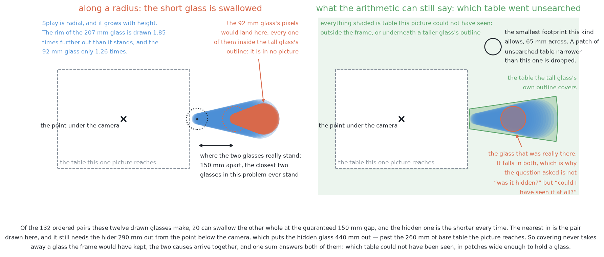

There is a measured limit to this, and it changes the question worth asking. The
nearest-in pair of the twenty still needs the hider to stand 290 mm from the
nadir, which puts the hidden glass 440 mm out. One survey picture reaches only
260 mm of bare table sideways, and a glass of the shortest size this kind allows
is thrown past that edge once it stands more than 208 mm from the nadir. So the
hidden glass is off the edge of the picture as well as underneath its
neighbour's outline. The two causes arrive together, and neither the picture nor
any model can separate them. The honest question is therefore not "was it
hidden?" but "**could I have seen it at all?**"

That question is arithmetic, which is the whole reason this case is handled at
all. Splay is exact, the glasses that were found have known positions, widths
and heights, and the frame edge is known from the lens. So the table each found
glass hides is computable, the ring outside the frame is computable, and what
comes out is a short list of patches, each one wide enough to hold the smallest
glass of the kind. That list is [solution
2](../04_programmed/02_cluster-on-the-table.md)'s blind-region arithmetic, and it
is the fifth entry in the doubt list. Nothing in it is learned, and nothing in
it needs to be.

Once that entry is in the list, what the loop is choosing between changes. With
only the first four entries, every candidate pose was a view of a **glass**.
With the fifth, some candidates are views of a **place** instead, and the two
are not compared on the same footing: a view of a place can only reduce the
unsearched area, and a view of a glass can only reduce the doubt about that
glass. So the learned score has to predict a drop in a list whose entries are
not interchangeable, and the honest way to handle that is to let the score
decide the order *within* each kind of request and let a written rule decide how
the budget is split *between* them. A model is a poor place to put a judgement
about which kind of failure matters more, because that judgement belongs to
whoever reads the report.

What the arithmetic cannot do is say whether a patch is worth the seconds. It
reports possibility and the loop needs likelihood, and every scene produces some
unsearched patches because every glass hides something behind it. Deciding which
of them probably has a glass in it is a different job, and it is the one [a
learned verifier over the places nobody could
see](05_is-anything-hiding-there.md) exists to do.

### When the camera is looking level

This is the measuring view: the camera 120 mm above the table, standing 380 mm
back from the glass and looking level at it. It is the view every extra look in
this solution is taken from, so a failure here is a failure of the loop itself
rather than of the survey.

The mechanism is plain line of sight, and no splay is needed for it. The near
glass simply stands between the lens and the far one, and its outline covers the
far one's. Standing the two further apart does not help, because the far glass
shrinks in the picture faster than it moves sideways in it. With a 207 mm glass
at the standoff and a 92 mm glass 300 mm behind it, the far glass would have lit
1231 pixels of the camera's 320 by 240 on its own, and it lights none. At the
guaranteed 150 mm gap fifty of its pixels survive, at 200 mm four survive, and
from about 250 mm apart none do. Of the same 132 ordered pairs, 77 leave the far
glass with no pixels at all at this spacing.

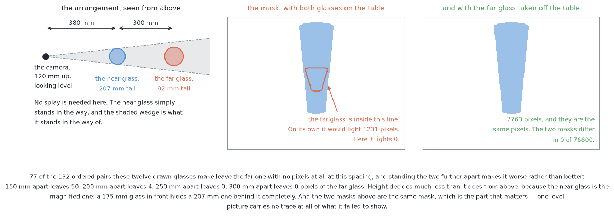

Height decides much less here than it does from above. The hidden glass is the
further one whatever its height, because the near glass is the magnified one: at
380 mm and 680 mm the near glass is drawn about 1.8 times larger than a glass of
the same size standing behind it. A 175 mm glass in front therefore hides a 207
mm one behind it completely, which never happens in the overhead case, where the
hidden glass is always the shorter one.

The difference that matters most between the two cases is what each leaves
behind in the picture. Looking straight down, the splay factor can be read back
out of the patch itself, so the picture carries a geometric hint that something
could be underneath, and the blind-region sum turns that hint into a number.
Looking level, there is nothing to read. The mask with both glasses standing
there and the mask with the far glass taken off the table are the same mask, to
the pixel: 7763 lit pixels either way, and a difference of 0 out of 76,800. A
level picture of one glass in line with another is a picture of one glass.

So nothing in the doubt list fires, and nothing can. Every defence against this
case is upstream of the look and is pure geometry. [Solution
3](../04_programmed/03_move-the-camera.md) drops any candidate pose whose sight
line crosses another group's fitted footprint circle, and the ordering in [the
worked example](#a-worked-example) below prefers poses square across the line
joining a doubtful glass and its neighbour. Both of those work on *fitted*
circles, which is one of the two holes this solution's own list of limits names:
a circle fitted to a sliver of a glass is too small and in the wrong place, so
it fails to block the sight lines it should have blocked.

The learned part does contribute something here, and it is worth stating exactly
what, because it is easy to claim more. The score is trained on what actually
happened when the arm went to each pose, so poses that look down the line
joining two glasses are trained towards a low score by every arrangement in
which they wasted a look. That is a preference learned across thousands of
scenes, and it is not a detection in the scene in front of it. On any single
run, a look taken from a blocked direction comes back, the doubt list does not
fall, and nothing says why. The loop has spent a look and learned nothing from
it. What follows is the per-object cap, and then the object reported as
unresolved with its reason attached, which the problem statement asks for. When
no candidate pose survives the geometric veto at all, that is a fact about where
the glasses stand rather than a perception failure, and it goes to problem
3.

The two cases are worth holding side by side, because what this solution can do
about each follows from what each leaves behind. Read the table a row at a time:
each row asks one question of both cases.

| | looking straight down | looking level |
| --- | --- | --- |
| what makes it happen | one glass's outline is thrown outwards over another | one glass stands in front of another |
| what it needs | the two close together, differing a lot in height, and lying along a radius | only that the camera, the near glass and the far glass are in line |
| which glass goes missing | the shorter one, every time | the further one, whatever its height |
| does one picture carry a hint | **yes** — splay is exact, so the table behind each found glass is computable | **no** — the mask is identical to a mask of one glass |
| what this solution does | counts the unsearched patches as the fifth doubt entry, and can send a look to a place | nothing during the run; the geometric veto has to prevent it beforehand |
| what it hands on | which patch is likely to hold a glass, to [solution 5](05_is-anything-hiding-there.md) | an unresolved object, to the report and to problem 3 |

So the honest summary is this. **This solution handles the overhead case only
partly, and the level case not at all.** It handles the overhead case to the
point of knowing that a place went unsearched and being able to spend a look
there, and every bit of that comes from arithmetic rather than from the model.
It cannot handle the level case during a run, because the picture that would
have to raise the alarm is the picture the glass is missing from, and the only
signal it ever produces is a look that changed nothing. What stands between the
loop and that failure is the geometry that chooses where to stand, and the two
caps that stop a hopeless object eating the budget.

## A worked example

This example follows one object through the method. It is described in terms of
what happens rather than what is measured, and its purpose is to show the one
case where the learned ordering beats the printed rule.

The survey has finished. There is one group on the table for each glass, and one
more besides.

Most of the groups fit footprint circles comfortably inside the range this kind
of glass is allowed, with plenty of dots spread all the way round the circle.
Those groups are settled, and nothing further happens to them.

One group is the interesting one, and it is worth being precise about why,
because the obvious story is the wrong one. It is **not a merge**. Two glasses
at the closest spacing this problem allows still have a strip of bare table
between them several times wider than the grouping distance, so they come back
as two groups and not one. Inside this problem's spacing rule, clustering on the
table does not merge two glasses.

What actually goes wrong is that **one glass is barely seen at all**. The second
glass of a pair stands almost directly behind the first, from every one of the
survey stations, so only a sliver of its footprint ever reaches the camera.

Three things then come back about that group, and the first of them is the trap.

Its fitted circle is **inside** the allowed range. That is the trap, because the
range check is the one arithmetic test that decides whether an object is
resolved, and it has nothing to complain about — a sliver of a circle can be
fitted by a circle of a perfectly ordinary size.

Its dots span only a **narrow arc** of that circle, where a glass seen properly
gives dots round most of it. A narrow arc is what a glass seen through a gap
looks like.

And it holds **far fewer dots** than a footprint of that size should give at
that distance. The expected count is arithmetic, because it follows from how
much table one pixel covers, so the shortfall is measurable rather than a
feeling.

Meanwhile the model's own doubt about this group is **low**. Its mask is a
perfectly good mask, crisply drawn, with confident pixels. It is just a mask of
a third of a glass, and nothing about a mask says how much of an object it
covers.

So **the geometry flagged it and the model would have said nothing.** That is
the single most important sentence in this document, and it is why the doubt
entries are combined with *or* rather than averaged.

### Filtering the candidates

The ring of candidate directions is now cut down, cheapest test first.

**Reach** goes first. Picture two circles drawn on the table around the arm's
base: an inner one the camera must not come inside, and an outer one it must not
go beyond. The candidate directions pointing back towards the base put the
camera inside the inner circle, folded over itself. The ones pointing away from
the base put it outside the outer circle, stretched straight. What survives is a
band of directions running roughly *across* the line from the base to the
object, and on a fine ring that band still holds a good number of candidates.
Reach alone removes over half of them, at one square root each.

**Line of sight** goes second. A third glass stands off to one side, and the
sight lines that would pass through its fitted circle are dropped. It is worth
seeing why this is a real removal rather than a pedantic one: from those
directions the third glass would sit in the frame *on top of* the target,
covering a good part of the width of the picture, so the mask would once again
be a mask of two things.

**Whether the arm can hold the pose** goes third. For each survivor, the
question is whether any set of joint angles exists that puts the hand there at
all, and one or two of them turn out to have none.

What reaches the learned score is a handful of candidates, every one of them
genuinely worth visiting. That is the whole point of the ordering: the expensive
stage is handed a short list.

### The ordering, which is where the model earns its place

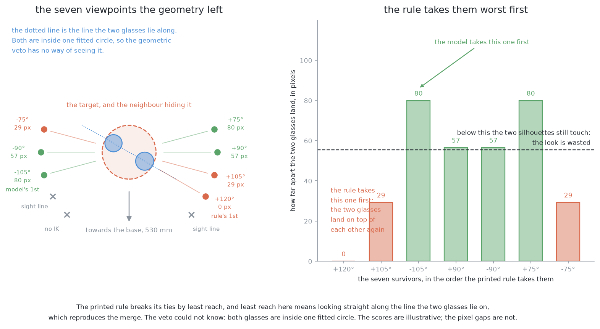

The bar chart is ordered the way the printed rule takes the candidates, and the
very first bar it takes is zero. That is the case this whole solution exists to
make.

Here is what the geometry could not know. The glass hiding our target stands
close beside it, and the line joining the two runs off at an angle to the line
from the arm's base. Both glasses look perfectly settled in their own right, so
**no line-of-sight test fires**: that test asks whether a sight line crosses
another object's fitted circle, and from most of these directions it does not.
What the test never asks is whether the target will end up *behind* its
neighbour at the moment the shutter opens.

Think about what governs that. Two glasses separate in the picture by an amount
that depends on the angle between the camera's direction and the line joining
the pair. Stand square across that line, and they separate as much as they
possibly can. Stand along it, and they separate not at all, because one is dead
behind the other. In between, the separation falls off smoothly, like the sine
of the angle you have turned away from square. And the two only truly come apart
once that separation exceeds their two half-widths added together.

So the candidates fall into three groups.

| where the camera stands | do the two glasses come apart? |
| --- | --- |
| square across the joining line, or nearly so | **yes**, clearly |
| part-way round from square | **just barely** |
| along the joining line, or nearly so | **no** — one sits inside the other |

That is the same answer solution 3's arithmetic gives from the other direction,
where a neighbour blocks a wedge of directions round the joining line and the
wedge grows as the neighbour gets closer or wider. The two arguments agree
exactly, which is a good sign that neither of them is wrong.

**The printed rule gets this badly wrong.** Every survivor has a clear line of
sight, because the filter saw to that, so the rule has nothing left to separate
them and falls through to its tiebreak, which is to prefer the pose that asks
the least of the arm's reach. And the pose that asks least of the reach is the
one nearest the object along the line from the base — which here is almost
exactly along the line joining the two glasses. So the rule's first pick is the
one direction that looks straight down the pair, and the look reproduces the
original problem exactly. Its second pick is the next one round, which is still
inside the neighbour's wedge. **Both of the object's looks are spent and nothing
is resolved.**

**The learned score gets it right**, and orders the candidates roughly by how
nearly square they are to the joining line. Its first pick is one of the square
ones. Between the two square candidates it prefers the one that keeps the arm
less extended, which means less stretch, less wobble at the wrist, and less
distance to travel. Nobody told the model either of those things. Both came out
of training on what actually happened when the arm went to each pose.

The model's ordering is the illustrative part of this example. The reasoning
about when two glasses come apart is not illustrative at all, because it is what
the camera would really see, and you can check it with a ruler and a piece of
paper.

### What the look buys

Plan, move, settle — seconds, and this is the only real cost in the whole
method. Then several pictures along the slide rather than only two, because the
arm is already standing there and a picture costs almost nothing.

The target is now seen through most of a circle instead of a narrow arc, with
the dot count to match, and its circle fits at a width comfortably inside the
kind's range. Every one of the three complaints that flagged it has gone quiet,
and one look has been spent out of the run's budget.

## The counter-argument, which is the honest part

This document would be dishonest without the following section, because the
example above can be answered without any model at all.

What the model learned to prefer is viewpoints across the line joining a
doubtful object and whatever is hiding it. That preference can simply be written
down:

> Take the doubtful object and its nearest neighbour. Sort the surviving
> candidates by how nearly square they are to the line joining the two.

That is four lines of arithmetic, with no data, no weights file and no training
run, and on this example it picks the same viewpoint. This is why the overview
describes this solution as *the richest version of moving the camera* rather
than as something to build first. With one known kind of glass, the thing that
makes a look pay off is one nameable quantity, and **a nameable quantity should
be named rather than fitted**.

Fitting earns its keep when there is no single quantity to name: when the kind
is unknown, when the allowed range of footprint widths is the union of several
kinds, and when whether a look pays off depends on shape as well as on geometry.
That is problem 4, and not this one.

There is also a real trade-off between the two rungs worth restating here.
Predicting *whether the answer changes* is a more direct target than predicting
how far the doubt falls, which argues for the upper rung. But a continuous doubt
also tells the loop whether to look at all and when to stop, whereas a
did-it-change classifier can only put poses in order. So the lower rung is not
merely a worse version of the upper one; it carries a piece of information the
upper one does not.

## Where the ideas come from

This solution joins three bodies of work, one for each part of it. The first is
about making a model say how sure it is, which is what the lower rung needs. The
second is about deciding what to measure next, which is the loop both rungs
drive, and it is much older than the first. The third is about predicting whether
an action will work before taking it, which is what the upper rung does.

### Uncertainty quantification in deep learning

A network trained the usual way outputs a number between zero and one, and it
will happily report near-certainty about an input unlike anything it has ever
seen. Making that number mean something is a field in itself, with three
practical families. Monte Carlo dropout is the cheapest to adopt and has the
weakest guarantees (Gal and Ghahramani,
[arXiv:1506.02142](https://arxiv.org/abs/1506.02142)). Deep ensembles are
consistently the strongest and the most expensive, since they multiply training
cost (Lakshminarayanan and colleagues,
[arXiv:1612.01474](https://arxiv.org/abs/1612.01474)). Evidential and Bayesian
methods have the network output the parameters of a distribution rather than a
single point, which needs one pass at the cost of a less familiar objective
(Sensoy and colleagues, [arXiv:1806.01768](https://arxiv.org/abs/1806.01768)).

These are used anywhere being wrong is expensive and saying "I do not know" is
cheap, such as medical imaging, self-driving, industrial inspection, and active
learning, where the doubt is what picks the next thing to label. They are rarely
right for cases where the model is wrong in a way it cannot represent, because
every method here measures *disagreement between plausible models*, so a mistake
they all share is invisible. None of them reliably detects "my training data did
not contain this situation at all".

For more, see [uncertainty
quantification](https://en.wikipedia.org/wiki/Uncertainty_quantification) and
[ensemble learning](https://en.wikipedia.org/wiki/Ensemble_learning).

### Aleatoric and epistemic uncertainty

The distinction between noise in the data and the model not knowing is what
makes this solution's loop sensible rather than superstitious, and Kendall and
Gal ([arXiv:1703.04977](https://arxiv.org/abs/1703.04977)) is the standard
treatment.

It is used for deciding *what to do* about doubt: epistemic doubt says gather
more, while aleatoric doubt says the measurement will not improve, so either
accept it or change the sensor. The two are rarely separable cleanly in
practice, because the split depends on the model and they are easy to confuse —
which is why the guards here never let the model decide anything on its own.

### Calibration

A model is calibrated when the things it calls likely happen about as often as
it says they will. Modern networks are badly overconfident by default, and the
standard fix is temperature scaling with one single number fitted on held-out
data (Guo and colleagues, [arXiv:1706.04599](https://arxiv.org/abs/1706.04599)).

Calibration matters for any system that acts on a probability rather than simply
taking the highest-scoring answer, which covers triage, abstention,
risk-weighted decisions, and exactly the budget-spending this solution does. It
is rarely optional: if nothing downstream reads the number as a probability then
calibration does not matter, but the moment a threshold appears, it does.

For more, see [Platt scaling](https://en.wikipedia.org/wiki/Platt_scaling).

### Active learning and information gain

The general principle is older than the vision problem. Given a budget, spend it
on the measurement that most reduces what you do not know. In machine learning
this is **active learning**, where the model picks which example to have
labelled. In robotics it is view planning, where it picks where to stand. Both
score candidates by how much uncertainty they expect to remove.

It is used wherever measurements are expensive and there are many to choose
from, such as labelling budgets, designing scientific experiments, and robot
exploration. It is rarely right for cheap measurements, because if another
picture costs milliseconds you should take several and skip the reasoning —
which is precisely why this cell's *pictures* are taken freely and only its
*movements* are planned.

For more, see Settles, [Active Learning Literature
Survey](https://burrsettles.com/pub/settles.activelearning.pdf), and [active
learning](https://en.wikipedia.org/wiki/Active_learning_%28machine_learning%29).

### Active perception, and the loop that follows from it

The first is the observation that a camera which can move is not the same
instrument as one that cannot. Bajcsy's *Active Perception* (Proceedings of the
IEEE, 1988) named it, and Connolly's *The Determination of Next Best Views*
(ICRA, 1985) is the loop that follows from it: given what you have seen and
where you could go, where next? Scott, Roth and Rivest's survey *View planning
for automated three-dimensional object reconstruction and inspection* (ACM
Computing Surveys, 2003) collects the classical answers, nearly all of which
score a viewpoint by how much unknown space it would resolve. Solution 3 is a
small, hand-cut version of that tradition.

### Predicting whether an action will work, from data

The second is a move that grasping made about ten years ago, for exactly the
reason that applies here. Nobody could write down a rule saying whether a
gripper pose would hold an object, so people collected attempts and fitted a
function from the pose to whether it worked. Pinto and Gupta's [*Supersizing
Self-supervision*](https://arxiv.org/abs/1509.06825) (ICRA 2016) had a robot try
tens of thousands of grasps and label them by whether the object came up. Levine
and colleagues' [*Learning Hand-Eye Coordination for Robotic
Grasping*](https://arxiv.org/abs/1603.02199) (2016) is the larger version.

Neither of those is reinforcement learning, and the distinction matters. There
is no episode and no reward, only an input, an attempt, and a recorded outcome.
The label is free because the world produces it.

### Next best view as supervised learning

The third is the same move made for this exact payoff. Vasquez-Gomez and
colleagues' [*Supervised learning of the next-best-view for 3D object
reconstruction*](https://arxiv.org/abs/1905.05833) trains a model to pick the
best of a fixed set of poses, with labels generated by simulating each pose and
measuring what it gained.

### Why this is not reinforcement learning

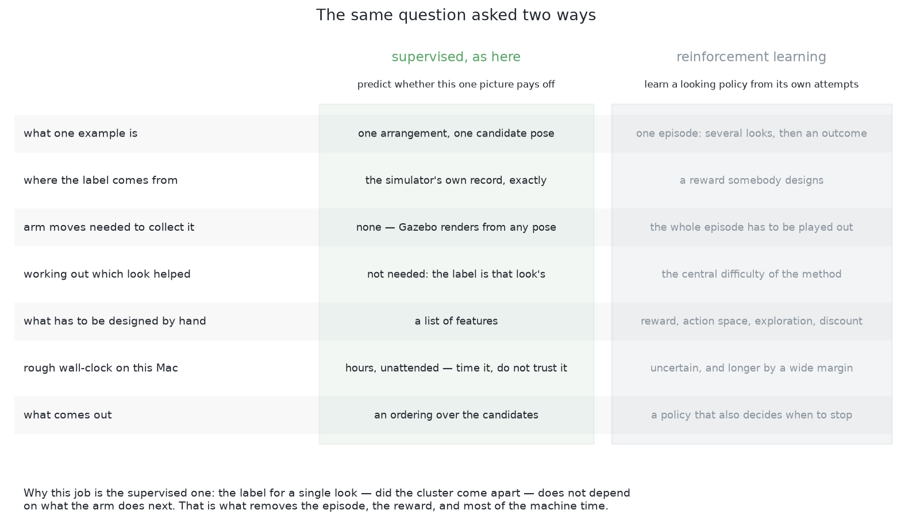

The comparison worth having in mind is against the heavier alternative, which is
a policy trained by reinforcement learning, written up as [an active-vision
policy](11_needs-more-than-a-simulator.md#an-active-vision-policy) in the companion
document.

Read the "working out which look helped" row of that comparison first, because
it decides everything else. A reinforcement-learning agent takes several looks
and then gets one number saying how the whole episode went. Working out
**which** of those looks earned that number is the central difficulty of the
method, and it is why episodes have to be played out in their thousands.

Here, the label for one look does not depend on what the arm does next, so there
is nothing to work out. Remove that problem and the episode goes with it, and
with the episode go the reward function, the exploration schedule, the discount
factor and most of the machine time.

A policy does buy one thing this solution does not: it can also learn **when to
stop**. Here that stays a written rule, which is to stop when nothing is
ambiguous or the budget is spent.

## The general ideas behind this

This solution predicts the *value of an action* rather than a property of the
world, which puts it in a different family from everything before it — and one
where the simulator rather than a person supplies the labels. Five general ideas
are worth knowing separately.

### Learning a utility, rather than learning to perceive

The model here does not say what is on the table. It says how much a given
action would help. That is called **utility** or **value** estimation, and the
trick that makes it workable is that the answer is cheap to check: take the
action in simulation and see what happened. A viewpoint either resolved the
ambiguity or it did not. So a hard question about the future becomes ordinary
supervised learning on an exactly labelled past.

It is used for choosing among actions wherever the outcome can be simulated or
replayed, such as view planning, grasp ranking, move ordering in games, and any
situation with a cheap way to ask "did that work?". It is rarely right for
actions whose outcome cannot be judged without doing them for real, because then
there is no free label set and the problem becomes reinforcement learning, with
all of its cost in attempts.

### Learning to rank — the order matters and the score does not

Nothing downstream uses the predicted number itself. Only the order of the
candidates matters. That is called **learning to rank**, and it is an easier
problem than predicting the number, because a model that is wrong by the same
amount everywhere still ranks perfectly, and it only ever needs to be right
about the top of the list.

It is used for search, recommendation and advertisement placement, and in
exactly the same shape for ordering candidate grasps, viewpoints or motions in
robotics. It is rarely right where the *size* of the number is used rather than
just the order, such as deciding whether to act at all, or comparing against a
fixed budget. **Ranking tells you which candidate is best. It never tells you
whether the best one is any good.** That is why the floor described earlier
exists.

### Supervised learning on labels a simulator generates

The simulator knows exactly what it spawned, so every training row comes
labelled for nothing. That removes the expensive part of supervised learning and
replaces it with a different problem: the labels are perfect, but the world is
not real.

It is used throughout robotics and self-driving, where real labelled data is
slow and dangerous to collect, and where the quantity that matters — a pose, a
contact, an outcome — is exactly what a simulator holds and a human labeller
cannot see. It is rarely right **without** a plan for the gap between simulation
and reality, because a model trained only on synthetic scenes has fitted one
renderer's shading and one spawner's habits, and it will be confidently wrong on
anything outside both.

For more, see [domain
adaptation](https://en.wikipedia.org/wiki/Domain_adaptation) for the family of
fixes, and the domain randomisation described in [solution
7](06_a-network-trained-from-scratch.md) for the one that suits simulators.

### Active learning — the same idea pointed at a labelling budget

Choosing the most informative next viewpoint is the robot's version of choosing
the most informative next example to label. The mathematics is shared, and so is
the central warning: a rule that always picks the most uncertain case tends to
pick the *unlabelable* ones, meaning the corrupted, the ambiguous and the
genuinely undecidable. Which is precisely why a floor and a cap matter more here
than the score does.

It is used wherever labels are expensive, such as medical annotation, expert
review and scientific experiments. It is rarely right for cheap measurements,
where taking several and skipping the reasoning is faster than deciding which
one to take.

### Generate, veto, then rank

The last idea is the structural pattern, and it is the reason a wrong prediction
here costs one wasted look rather than a wrong answer. Geometry generates the
candidates and holds an absolute veto, and the model is only allowed to reorder
what survives. **Position in the pipeline is what limits the damage** — see
[where the learned part
sits](../03_the-ten-solutions.md#three-families-and-what-hybrid-means).

## Where it is strong and where it breaks

**Failure is bounded by construction.** The model can only reorder poses the
arithmetic already approved, so the worst a wrong prediction costs is one look
spent in the wrong place. That is not a claim about how good the model is. It is
a property of where the model sits, and it holds however badly the model is
fitted.

**It improves with use.** Every look the arm ever takes is another labelled
example, and on the upper rung the label — did the answer change — can be read
on a real table without any ground truth at all. A cell that runs every day gets
better at choosing where to look without anyone retraining it deliberately.

**It changes no answers.** This is worth stating as a limitation rather than as
a virtue. Nothing in this document makes a single measurement more accurate. It
makes the budget go further, which is worth a great deal when the budget binds
and worth nothing when it does not.

**It needs the budget to bind before it is worth building.** If the arm can
afford to look everywhere, ordering the looks is pointless. The measurement that
decides whether to build this is how often [move the
camera](../04_programmed/03_move-the-camera.md)'s printed rule already settles the
doubt on its first try.

**It cannot see a glass that is absent from the picture.** Both rungs order
looks at things the report already contains, and a glass that produced no pixels
appears in no report. The fifth doubt entry, the unsearched patch, is what stops
this being fatal, and it comes from geometry rather than from either model.

**Its training set is a record of one cell.** Change the layout, the camera or
the range of sizes a kind is drawn from, and the fitted numbers describe a room
that no longer exists. The arithmetic underneath does not have this problem,
which is part of why it is underneath.

## Where it sits among the other solutions

This solution and [move the camera](../04_programmed/03_move-the-camera.md) share a
skeleton exactly. Both generate candidates, filter them with arithmetic, and
order the survivors. They differ only in what the ordering is based on, and that
is the whole of the difference.

Solution 3 orders by a printed rule, which is cheap, needs no training and has
the symmetry blind spot described at the top of this document. The lower rung
here orders by how far a model's own doubt should fall, which is better but is
still a stand-in for what is wanted. The upper rung orders by the predicted
outcome itself, which is the thing actually wanted.

So the three form a ladder, and the rung to build is the lowest one that
measurably does the job. Start at the bottom, measure how often the printed rule
picks a viewpoint that settles the doubt on its first try, and climb only if
that measurement says the ordering is costing looks.

What all three agree about completely is what is *allowed*. They differ only
about what is *preferred*. That is not an accident of how they were written; it
is the property that makes a learned component safe to add to a machine that
moves, and it is the single idea most worth carrying out of this folder.

← [Move the camera](../04_programmed/03_move-the-camera.md) · [Is anything hiding
there?](05_is-anything-hiding-there.md) →
