# Solution 6 — a network trained from scratch

*Learned, as the decider. One small network, trained from nothing on pictures
the simulator renders and labels for free, with two output heads: one says which
pixels are glass, and the other says which glass each of those pixels belongs
to.*

> **The cell is described once, in [the cell](../../01_the-cell.md)** — the
> layout, the two places the camera works from, from the top and from the side,
> all four sensors, and the words this project uses them with. What follows is
> only what is specific to this solution.

## Introduction

This document explains how to answer problem 2 with a network rather than with
arithmetic, and it is the only solution here that needs no depth readings at
all. That matters because real glassware returns almost none, so a method that
works from colour alone is the one that survives the day the simulated glasses
are replaced by real ones.

The network is built in two stages, and the second reuses almost everything the
first sets up. The first stage asks a question about **classes**: is this pixel
glass, or is it table? That is enough to find where the glasses are and not
enough to say which glass is which, because two glasses that overlap in the
picture come back as one region. The second stage asks each glass pixel a
different question: **which way is the middle of your own glass?** The answers
are arrows, one per pixel, and counting glasses becomes counting the places the
arrows point at.

Keeping both stages in one document is deliberate, because they are one network.
They share a shape, a training recipe, a source of labels and a set of traps.
What differs is the last layer and what it is asked to predict, so describing
them apart would mean writing the same network down twice.

By the end you will understand why a small network is enough for a cell this
narrow, why training it from nothing beats adapting a large model here, why the
obvious measure of success rewards saying nothing at all, why an arrow has to be
measured in millimetres on the table rather than in pixels, and why this whole
family is blind to the one failure the problem says to watch hardest.

## Contents

1. [Introduction](#introduction)
1. [The problem this solves](#the-problem-this-solves)
1. [The main idea](#the-main-idea)
1. [What a network is, and what training means](#what-a-network-is-and-what-training-means)
1. [Why train from scratch rather than borrow](#why-train-from-scratch-rather-than-borrow)
1. [The shape of the network](#the-shape-of-the-network)
1. [The receptive field, and the warning it gives](#the-receptive-field-and-the-warning-it-gives)
1. [Where the weights sit](#where-the-weights-sit)
1. [The first head: which pixels are glass](#the-first-head-which-pixels-are-glass)
1. [The second head: which glass each pixel belongs to](#the-second-head-which-glass-each-pixel-belongs-to)
1. [The network and its training](#the-network-and-its-training)
1. [Domain randomisation](#domain-randomisation)
1. [The arithmetic still decides](#the-arithmetic-still-decides)
1. [How the concepts fit together](#how-the-concepts-fit-together)
1. [The feedback loop, and where doubt has to be counted](#the-feedback-loop-and-where-doubt-has-to-be-counted)
1. [Doubt measured from the votes themselves](#doubt-measured-from-the-votes-themselves)
1. [When the glasses are completely hidden](#when-the-glasses-are-completely-hidden)
1. [A worked example](#a-worked-example)
1. [What it needs](#what-it-needs)
1. [Where it is strong and where it breaks](#where-it-is-strong-and-where-it-breaks)
1. [The general ideas behind this](#the-general-ideas-behind-this)
1. [Where it sits among the other solutions](#where-it-sits-among-the-other-solutions)

---

## The problem this solves

Four to six glasses stand on the table. They are all the same kind, the kind is
known, and they are solid, so the depth camera sees them. The job is to say
which pixels belong to which glass, to give each glass a position on the table,
and to give each a rough footprint width. Nothing is picked up and no shape is
measured here.

Two different things defeat the obvious methods, and this solution is aimed at
the second one.

### In the picture, outlines overlap

If the camera is roughly in line with two glasses, the near one covers part of
the far one and their two outlines join.

To see why that is fatal, two words are needed. A **mask** is a picture the same
size as the photograph in which every pixel is just yes or no, where yes means
"this is glass". The step that turns a mask into separate objects is called
**connected components**, or a flood fill: take a yes pixel nobody has visited,
spread out to every yes pixel touching it, call everything you reached one
object, and repeat.

The trouble is that a flood fill answers exactly one question, which is *are
these pixels joined?* And joined is precisely what the two overlapping outlines
are.

### On the table, the points can be too close to group

[Solution 2](../04_programmed/02_cluster-on-the-table.md), *cluster on the table*,
avoids the picture entirely. Every pixel with a depth reading becomes a point in
the room, the points standing clear of the table are kept, and points closer
together than a chosen **grouping distance** go in the same group.

That one distance has to satisfy two demands at once. It must be **larger** than
the biggest hole inside one glass's own points, or one glass comes back as two.
And it must be **smaller** than the strip of bare table between two glasses, or
two come back as one.

At the spacing this problem guarantees, there is plenty of daylight between
those two limits and the choice barely matters. As the glasses close up, the
window narrows. And when two glasses touch, **the window shuts completely**: no
grouping distance keeps them apart while also keeping each of them whole.

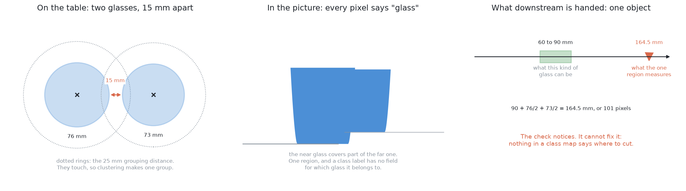

The middle panel of that picture has no seam between the two outlines for
anything to find. The right panel shows what the next step is handed, which is
**a single object far wider than any glass of this kind can be**.

The range check notices that much. But noticing is all it can do, and the reason
is worth stating exactly, because it is what this solution exists to repair.
**Nothing in a class map says where to cut.** Every pixel carries the same
label, "glass", and a label that is the same everywhere cannot possibly mark a
boundary.

### More training does not rescue a class map

It is tempting to think a better-trained network would solve this, and it would
not, because the limitation is in the shape of the output rather than in the
quality of the fit.

**Semantic segmentation** labels every pixel with a class. **Instance
segmentation** labels every pixel with a class *and* with which object it
belongs to. This problem asks for the second. A perfectly trained class map
still merges touching glasses, because "glass" is the only value the answer has
room to hold.

So the fix is not a better network. **It is a different output.**

## The main idea

The main idea has two halves, and the first is a claim about this cell rather
than about networks.

**This cell is narrow, so the network can be small.** Consider how little varies
here. There is one class to predict, which is glass or not glass. There is one
kind of object at a time, drawn from inside that kind's plausible range of
shapes. There is one camera, with one lens. There is one lighting setup, inside
one simulator. And the glasses are always upright and always solid. Almost all
the variety a general-purpose model is built to absorb simply does not occur, so
the network can be small — and a small network with an endless supply of exactly
labelled pictures is something you can train from nothing in an afternoon.

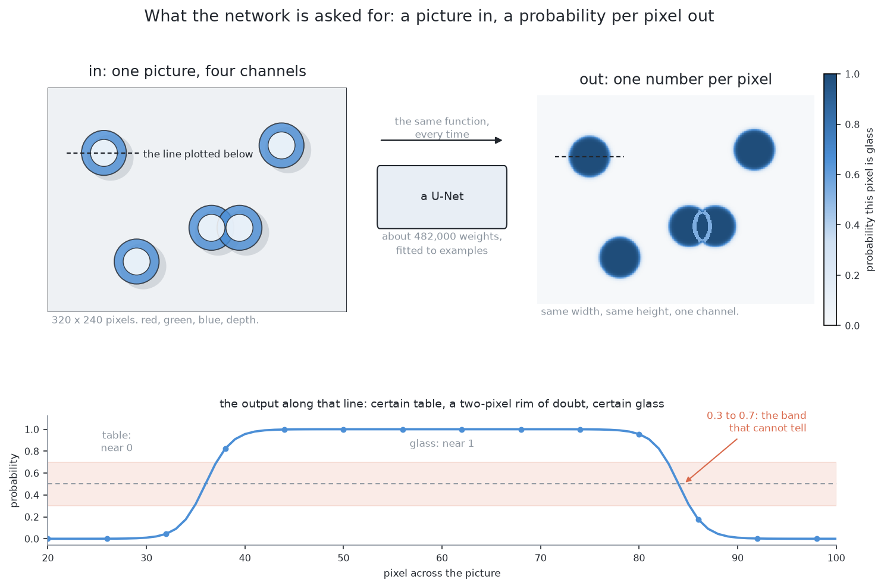

Look at the right-hand panel of that picture. It is the same width and height as
the picture on the left, but every pixel holds one number between zero and one,
saying how sure the network is that this particular pixel is glass. The plot
underneath follows the dashed line across one glass. The number sits near zero
over the table, near one over the glass, and it passes through the middle only
in a narrow band at the rim — exactly where a person with a magnifying glass
could not say either. **That narrow band is the network being honest**, and
later in this document it turns out to be the reason doubt has to be counted
inside a region rather than at its edge.

**The second half is that a class map is not an answer, and the fix is to ask
each pixel for an arrow instead of a label.** At every glass pixel, the network
predicts a short arrow pointing towards the middle of that pixel's own glass.
Add the arrow to the pixel's own position, and what you have is a **vote** for
where that glass's centre is. One glass then makes one pile of votes. Two
glasses make two piles. Counting glasses becomes counting piles.

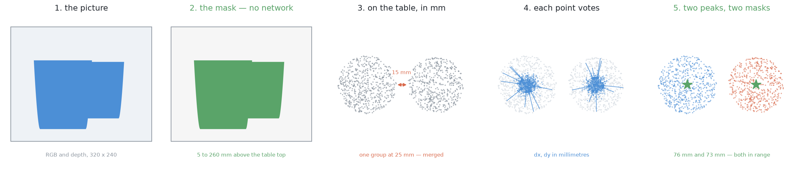

Read those five panels left to right. The network is involved in one stage only,
and everything before and after it is arithmetic the project already has.

The rest of this document builds both halves up. First comes what a network is
and why this one is trained from nothing, then its shape and the two things that
shape decides. Then the first head and the trap hiding inside its measure of
success. Then the second head, the single most important decision in its design,
which is what units the arrow is measured in, and how a cloud of votes becomes a
count of glasses. Then what keeps the whole thing honest.

## What a network is, and what training means

Before going further, two words need defining, because everything after this
uses them.

A **neural network** is a program whose behaviour comes from numbers fitted to
examples, rather than from rules anybody wrote. Those numbers are called
**weights**. They start as random noise, and **training** shows the network a
picture, compares what it produced against the answer wanted, and nudges each
weight in the direction that would have helped. Nobody writes the rule the
network ends up applying, and nobody can read that rule back out afterwards.

**Fine-tuning** means not starting from random numbers. You take a network
somebody else trained on a large collection of labelled photographs, throw away
its last layer, attach your own, and carry on training. This is the standard
advice everywhere, and the reason is that **labelled real pictures are scarce**,
because somebody has to draw round every object in every picture, and a borrowed
network cuts the number of labels you need by a large factor.

## Why train from scratch rather than borrow

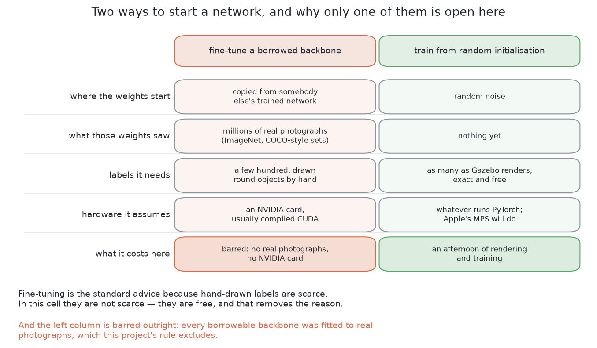

Two things make the usual argument for fine-tuning collapse in this cell, and it
is worth being clear that only one of them is about this project's rules.

The first is that **every network worth borrowing was fitted to real
photographs.** The large collections of labelled images that such networks are
trained on are photographs, and so is everything trained on them, including the
large general-purpose segmentation models. This project's rule is that
everything a solution needs must be producible by the simulator on this machine,
and a file of weights fitted to photographs of the real world is not. That is
not a judgement about whether those models are good. They are excluded by
**where their numbers came from**, and the versions of this project that do
allow them are written up in
[`learned-with-hardware.md`](11_needs-more-than-a-simulator.md).

The second reason is the one that actually matters, because it would apply even
without the rule. **The scarcity that fine-tuning exists to solve is not present
here.** Asking the simulator for a render and its per-object mask costs the same
as asking for the render alone. There is no annotator, so there is no
annotator's budget and no annotator's mistakes. Labels here are free.

There is also a third, smaller reason: most ready-made networks expect a
dedicated graphics card, and this machine has none. That alone would decide
nothing, because plenty of them run without one, but it removes the last
practical argument for borrowing.

So the answer is a random start — and it is reasonable **only because of the
second reason**. Training from scratch on a few hundred hand-drawn labels would
be a bad idea. Training from scratch on an endless supply of exact ones is not.

## The shape of the network

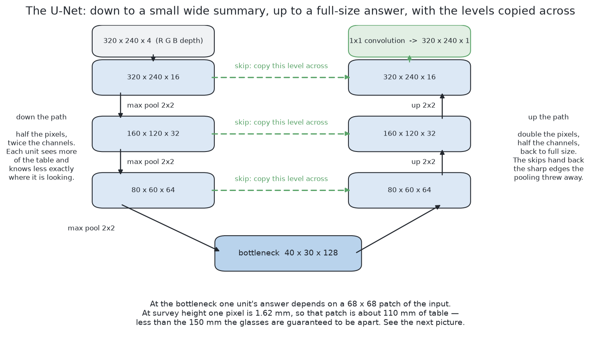

The shape used here is called a **U-Net**, and the picture explains the name:
follow the left column down, then the right column up, and the dashed lines
across the middle are the part that makes it a U.

### The down path

Start with the picture, four channels deep: red, green, blue and depth.

Apply two **convolutions**. A convolution takes a small square window, slides it
over the picture, and at each position multiplies the values inside the window
by a fixed set of weights and adds them up. One set of weights produces one
output channel, and many sets produce many channels.

Then **halve it**. A max pool keeps the largest value out of each little block
of pixels, so the picture comes out half as wide and half as tall. Then two more
convolutions, with the channel count doubled. Halve again and double again.
Halve once more. That last, smallest, widest layer is called the **bottleneck**.

Two things happen on the way down, and they pull against each other. Each
halving throws away exactly *where* something is, because one unit now stands
for a whole patch of the original picture. But each halving also means the next
window covers four times as much of the original picture as it did before. So
deeper units know less and less precisely where they are looking, and more and
more about what is around them.

**That trade is the entire reason for going down**, and the section after next
is what happens if you do not check it.

### The up path

A **transposed convolution** does the reverse of a pool: it doubles the width
and height back up while narrowing the channels. Two more convolutions, double
again, and again, until the block of numbers is back to the size of the original
picture. A final convolution with a window of exactly one pixel — so no mixing
across space at all, just a weighted sum of the channels — collapses it to a
single channel. Then a function that squashes any number into the range zero to
one turns that into a probability.

### The skip connections, which are the point of the shape

Here is the problem the up path alone cannot solve. The bottleneck knows there
is a glass roughly over *there*, but the halvings have destroyed which exact
pixel its rim sits on. Doubling the size back up cannot invent that detail,
because the detail was thrown away.

So do not throw it away. Before each halving, keep a copy of the block of
numbers, and on the way back up **attach the copy on** as extra channels. The
fine detail comes across on the copy, the sense of context comes up from below,
and the convolution after the join mixes the two. Those copies are the dashed
lines in the picture, and they are what the U refers to.

The design is Ronneberger, Fischer and Brox, 2015
([arXiv:1505.04597](https://arxiv.org/abs/1505.04597)), and it was written for
microscope images, where exactly the same problem arises: label every pixel,
with very few examples.

## The receptive field, and the warning it gives

There is one thing worth working out **before** trusting this design, and it
follows directly from the trade described in the down path. It is called the
**receptive field**, and it is how much of the original picture one unit at the
bottleneck actually depends on.

It is easy to compute. Each convolution extends the field by one pixel on each
side, *at whatever scale it is currently working at*, and each pool doubles that
scale. So the field grows slowly at first and then in bigger and bigger jumps,
and by the time you reach the bottleneck it covers a square patch of the
original picture some tens of pixels across.

Now turn that patch into a distance on the table, using how much table one pixel
covers from the height the camera flies at. Here is the warning:

> **That patch of table is smaller than the smallest gap the cell guarantees
> between two glasses.**

Read that again, because it is the kind of thing that becomes invisible once
training has started. The deepest layer — the one layer with enough context to
reason about a neighbour at all — **cannot see two glasses at the same time**.
It is structurally incapable of the comparison you might have hoped it was
making.

Adding a fourth halving fixes it. The bottleneck then works at half the scale
again, and its receptive field covers a patch of table comfortably wider than
the guaranteed gap. It costs about four times as many weights, for the reason
given in the previous section.

Whether the extra level is actually needed is **not known**, and this document
is not going to pretend otherwise. Two things could rescue the shallower design.
The decoder's own convolutions widen the field further on the way back up. And
the evidence that separates two overlapping outlines may turn out to be entirely
local to the seam where they meet, in which case no unit ever needs to see both
glasses at once.

It is flagged here for one reason: **it is far cheaper to check this with
arithmetic before training than to diagnose it afterwards**, when all you have
is a network that quietly never separates anything.

## Where the weights sit

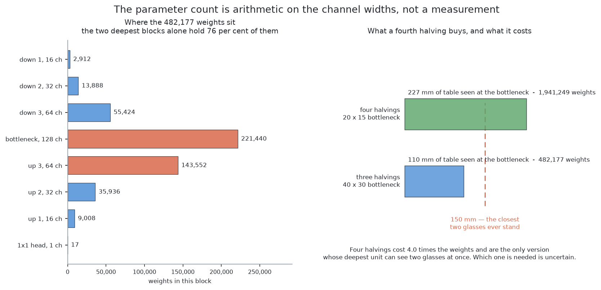

One fact about convolutions decides the shape of the whole weight budget, and it
is worth understanding rather than looking up.

A convolution holds one weight per window position, per input channel, per
output channel. So **the weight count of a block grows with the product of its
two channel counts.**

Follow what that implies. Going one level deeper doubles the input channels
*and* doubles the output channels, so it roughly quadruples the weights in that
block. Meanwhile that block is working on a picture a quarter of the size, so it
costs no more arithmetic than before.

The result is that **the deep, narrow layers hold nearly all the weights.** The
bottleneck and the block just after it hold roughly three quarters of the total
between them, while the first block, the one working on the full-size picture,
holds almost none. Widening the deepest level is expensive, and widening the
first is nearly free. So anyone tuning this network should spend their attention
at the bottom rather than the top.

And the whole thing is small. The total comes to a few hundred thousand weights,
which is a couple of megabytes stored, or under half that at reduced precision.
This is a file you can commit to the repository, version alongside the code, and
regenerate without thinking about it — which is exactly not true of the large
pre-trained models this solution deliberately does not use.

## The first head: which pixels are glass

With the shape settled, the two heads can be taken in turn, and the first is the
simpler of them. It has one output channel, it produces one number per pixel,
and that number is how sure the network is that the pixel is glass. Everything
in the next three sections is about that one channel: how its success is
measured, what a second input channel does and does not buy, and where it stops
being enough.

### The loss, and why most pixels being table matters

Training needs a **loss**, which is one number saying how wrong an answer was,
and which the nudging then tries to reduce.

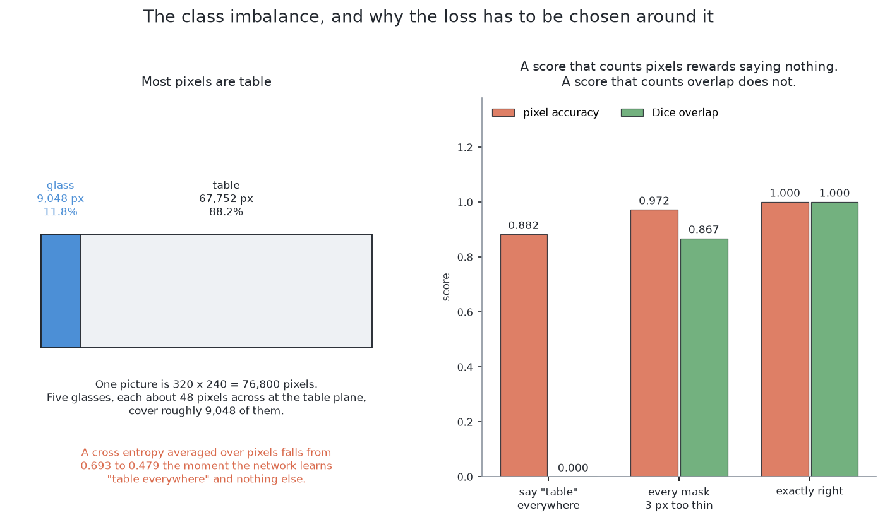

The obvious loss is called **binary cross entropy**. For a pixel that really is
glass, the penalty is smaller the higher the probability the network gave it, so
being sure and right costs almost nothing while being sure and wrong costs a
great deal. For a table pixel it is the same with the probability flipped. Then
you average over every pixel in the picture.

**That average is the trouble**, and the trouble comes straight out of this
cell's geometry. Seen from the top, a glass takes up a small patch of a large
picture, and there are only a handful of glasses. Count the pixels and the great
majority of every picture is bare table. Glass is the rare class by a wide
margin.

So a network can lower the average a long way without learning anything at all.
Imagine it starts by saying "maybe" to every pixel. Now let it learn exactly one
thing: *say "not glass" everywhere*. The table pixels, which are the great
majority, now cost almost nothing each. The glass pixels cost a great deal each,
but there are few of them. Work the weighted average through and **it has fallen
substantially**. The network has been rewarded for producing an empty picture,
and this is at its worst early in training, when there is nothing better on
offer and this is the easiest improvement available.

Two standard fixes exist, and this design uses both.

The first is to **weight the rare class up**. Multiply every glass pixel's
contribution by the ratio of the two class sizes, so that the glass pixels and
the table pixels contribute equally to the total. Now "say nothing is glass" is
no longer an improvement at all.

The second is to **add a loss that measures overlap rather than counting
pixels**. The **Dice coefficient** is twice the number of pixels that both the
answer and the truth call glass, divided by the total number either of them
calls glass. It is one for a perfect match, zero when they share nothing, and it
has no term for the table at all. Using one minus Dice alongside the weighted
cross entropy is the usual recipe, from Milletari and colleagues, 2016
([arXiv:1606.04797](https://arxiv.org/abs/1606.04797)).

The right-hand panel of that picture shows why the second fix is needed, by
scoring three answers two ways.

| the answer | pixel accuracy | Dice |
| --- | --- | --- |
| say "table" everywhere | **high** | **zero** |
| every mask a few pixels too thin | **higher still** | noticeably below perfect |
| exactly right | perfect | perfect |

Pixel accuracy gives a **useless** answer a high score, and a **visibly wrong**
one an even higher score, because what it is mostly reporting is how many table
pixels were correctly called table, and that is the easy part. Dice gives the
useless answer zero, because the two masks share nothing, and it notices the
thin masks, because they share less than they should.

The lesson generalises far beyond this page: **a score that rewards saying
nothing will be optimised by a network that says nothing.**

### The depth channel, and what it does not buy for free

Depth is one of the four input channels, and that needs stating plainly, because
it means this solution does **not** get "works without depth" for free.

A network handed depth will lean on it, because depth is by far the easiest
signal in the picture, and the colour path will then never develop at all.

The property is worth wanting. If the glasses ever become real glass, the depth
camera stops returning anything useful through them, and every method that
groups points in the room loses its input at once. A colour-only method survives
that day.

It is earned rather than given, by a trick called **modality dropout**: on some
of the training pictures, the depth channel is replaced with nothing. After that
the same weights run on colour alone, **less accurately** — the depth channel
was carrying real information, and dropping it costs something — but they run.
What share of pictures should have their depth removed is a choice rather than a
measurement, and what is right here is not known.

One further detail matters for the same reason. The depth channel is scaled into
the same range as the colour channels, and it is deliberately **not** converted
into a height above the table. Converting it would hand the network the very
clue the clustering solutions use, and it would make the colour-only claim
hollow.

### Which pixels are glass, but not which glass

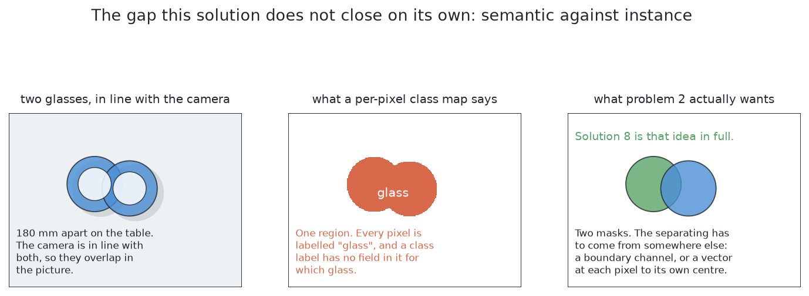

This is the limitation named in the introduction, and it is structural rather
than a matter of training harder.

The middle panel of that picture is the point: one region, every pixel correctly
labelled "glass", and no way whatever to ask it *which* glass.

A per-pixel class map is called **semantic** segmentation. This problem asks for
**instance** segmentation, which means one mask per object. So on its own this
solution does not answer the problem, and the separating has to be added
somewhere.

There are two cheap places to add it. One is a second output channel predicting
each object's **boundary**, so that regions can be cut along the predicted seam.
The other is a pair of channels predicting, at every glass pixel, the **offset
to the centre of its own object**.

Offsets fail more gently, and the reason is worth remembering as a general
principle. A seam has to be predicted correctly along its whole length, and one
missing pixel rejoins two objects completely. Offsets are one vote per pixel, so
a few wrong votes are simply outvoted by the many right ones. [Solution
8](06_a-network-trained-from-scratch.md) is that idea in full.

## The second head: which glass each pixel belongs to

The previous section ends where the problem starts asking which glass is which,
so this is where the second head comes in. It keeps the network's shape and its
training recipe almost unchanged and replaces the single output channel with a
pair of them, holding the two components of an arrow. Nothing else about the
network changes, which is the reason these two stages belong in one document.

What follows is why an arrow can be predicted pixel by pixel at all, what units
it has to be measured in, why nothing has to find a boundary, and how a cloud of
arrows becomes a count of glasses.

### Every glass pixel already has a place on the table

The first thing to notice is how much work has already been done before the
network is consulted, and it means the network is asked a much smaller question
than it might have been.

The table's height is known, and the glasses are opaque, so a depth reading
comes back for every glass pixel. Solution 2's arithmetic already turns each
such pixel into a point in the room and drops it onto the table. So **every
glass pixel already has a position on the table**, worked out from its depth
reading, the lens and the recorded camera pose.

That shrinks the network's job to one question: *how far, and in which
direction, to my own glass's footprint centre?*

There is a second thing that is free for the same reason. **The mask is free.**
Nothing has to be learned to decide *whether* a pixel is a glass pixel, because
the existing test — does the point behind it stand clear of the table and below
the tallest glass the cell accepts — already says so. The network therefore
needs only two output channels, one for each direction of the arrow, and it
never spends any capacity on the easy question.

### Voting in distances on the table, not in the picture

This is the decision the whole solution rests on, so it is worth going through
slowly.

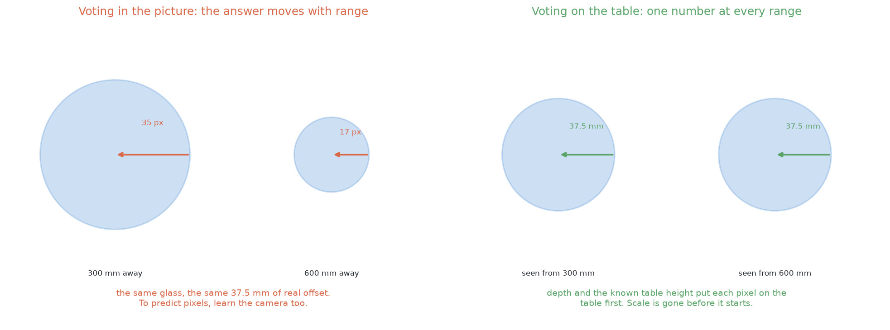

The left panel shows the trouble with arrows measured in **pixels**. The same
glass, with the same real displacement, photographed from twice as far away, is
half as many pixels across. So a network predicting arrows in pixels has to
learn how that number shrinks with distance — which is to say, **it has to learn
the camera before it can learn anything about glasses.**

And it is not only a problem between one picture and the next, which is the part
people usually notice. Consider a single picture taken from the top. The table
is the full camera height away from the lens, while the rim of a tall glass has
climbed most of the way towards it. So the correct arrow in pixels varies by a
large factor **within one photograph**. Measured on the table, it does not vary
at all.

There is a second benefit, and it is the one that makes a small network
plausible. Measuring the arrow on the table puts a **hard limit** on what the
network ever has to predict. An arrow runs from a pixel to the centre of its own
glass, so the longest arrow that can ever occur is half the widest footprint the
cell handles — whatever the distance, whatever the angle. Every training target
is therefore a pair of numbers inside a small, known box. **A target that is
bounded and does not depend on the camera is far easier to fit than an unbounded
one.**

### What the votes look like, and why no boundary is needed

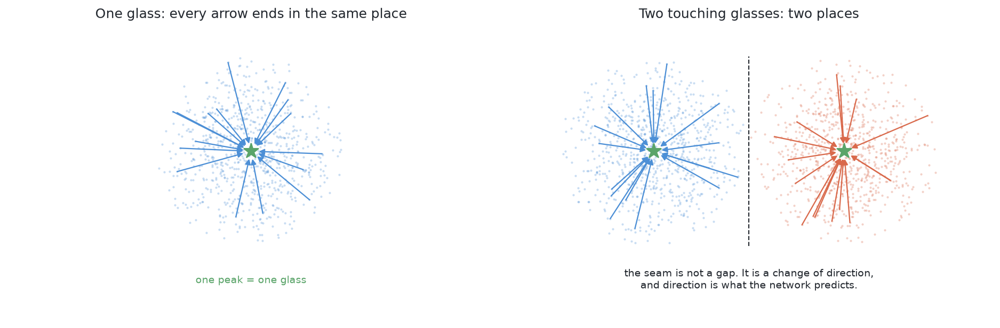

The right-hand panel of that picture is the whole argument, and it is worth
looking at carefully.

The two sets of pixels **touch**. There is no gap anywhere along the dashed
line. And it does not matter, because what changes at the seam is not the pixels
but the **direction the arrows point**. The pixels on the left half point left,
the pixels on the right half point right, and the seam between them is not
something anything has to find.

**Nothing has to find a boundary, so nothing can get one wrong.** That single
sentence is why this method survives touching glasses when nothing else here
does.

The method is also robust in a way that a boundary method is not. A glass seen
from the top casts one vote for every pixel of its outline, which is well over a
thousand votes. A handful of those pointing the wrong way are a handful of
strays among thousands, and a pile of thousands does not notice them. Compare
that with predicting a seam, where one missing pixel along the seam rejoins two
objects completely.

There is one more consequence of voting in table distances, and it pays off
later in this document. Because a vote is a place on the table rather than a
place in a picture, **votes from two photographs taken from two different places
land in the same frame**, and they can be pooled with no matching step at all.
That is what makes both the second picture of each pair and the feedback loop
cheap.

### Turning a cloud of votes into a count of objects

Each glass should make one tight pile of votes, so the remaining question is
simply where the votes pile up.

The method for that is called **mean shift**. Put a circular window down on one
vote, move the window to the average position of the votes inside it, and repeat
until it stops moving. Each move is a step uphill towards thicker votes. Run it
from every vote, and the votes whose windows stop in the same place belong to
one pile.

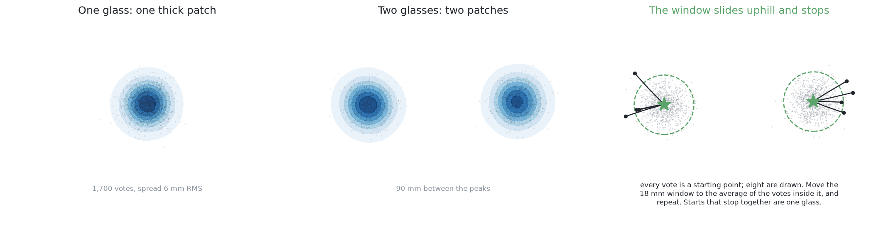

The left two panels of that picture are the raw signal: one thick patch of votes
for one glass, and two patches for two. The right panel shows several windows
started at several different votes, each walking uphill and stopping, with the
dashed circles marking each window where it came to rest.

So counting glasses has become counting distinct stopping places. The important
property of mean shift here is what it does **not** need to be told: unlike
other grouping methods, **nothing has to say how many piles to expect**. That
matters a great deal, because in this problem the count *is* the answer.

#### Choosing the one window size

There is exactly one number to choose, which is the window radius, and it is
pinned at both ends before anything is run. This is the same shape of argument
used for the grouping distance in solution 2.

The **floor** is the spread of the votes themselves. The votes for one glass do
not land on a single point; they scatter around the true centre, and that
scatter can be measured on held-out renders where the truth is known. A window
much smaller than that scatter fits *inside* one pile, so it climbs some local
lump within the pile rather than the pile as a whole, and one glass then comes
back as several peaks.

The **ceiling** is the closest two centres can ever be. The worst case is two of
the narrowest glasses this kind allows, pressed rim to rim, and then their
centres are one footprint apart and nothing can bring them closer. A window
whose radius reaches much more than half of that covers **both** centres at
once, and the two piles merge into one.

There is comfortable room between those two limits, and the chosen radius sits
inside it. It is worth seeing what a careless choice would cost, because the
failure is quiet: a window large enough to span the narrowest possible centre
gap swallows two centres whole, so it would merge exactly the pairs this
solution exists to separate — and it would do so **silently**, because a merged
pile looks perfectly tight and complains about nothing.

One practical note. Running a window from every single vote means comparing
every vote with every other vote on every step, and with tens of thousands of
votes that is far more arithmetic than the job needs. Seeding the windows from a
few hundred votes drawn at random fixes it, because **a pile of thousands is
found just as reliably from a sample of it**, and every vote is still assigned
at the end by which peak it is nearest, so nothing is lost.

## The network and its training

The network takes four channels the size of the picture — the three colour
channels and the **height above the table** — and returns two channels the same
size, holding the two parts of the arrow.

Height is used rather than raw depth for the same reason the arrow is measured
on the table: height means the same thing from every viewpoint, and raw depth
does not.

Its shape is the same encoder-and-decoder design used in [solution
7](06_a-network-trained-from-scratch.md), which halves the picture repeatedly
while widening it so that later layers see a large part of the scene, then
doubles it back to full size, with each level on the way down copied across to
the matching level on the way up so that fine detail is not lost.

Seeing a large part of the scene is exactly what this task needs, because **a
pixel cannot possibly know where its glass's middle is by looking only at
itself.** It has to see enough of the glass around it to tell which way the
middle lies.

For the same reason, the receptive-field warning given above applies here **with
more force rather than less**. That warning is that the deepest layer of a
shallow network may cover a smaller patch of table than the task needs, and here
the task needs each pixel to see the whole of its own glass. The size and depth
of this network are therefore **not settled**, and working out whether they are
sufficient is something to measure rather than to assert.

### The loss, and the two choices inside it

The network is scored by how far each predicted arrow is from the true one,
using a loss that behaves differently for small and large mistakes. It scores a
small mistake by its square, and a large one by its size. Squaring the small
errors makes the fit precise where it is nearly right, and not squaring the
large ones stops a handful of wild pixels dominating every update. Pixels near
an edge, where a pixel may genuinely belong to either glass, are exactly the
wild ones.

The second choice inside the loss is not a detail either. The loss is applied
**over glass pixels only**. Most pixels in a picture from the top are table, and
a table pixel has no correct arrow at all, because there is no object for it to
point at. So the loss is multiplied by the mask before it is added up, and the
network is scored only where the question has an answer.

### The labels are arithmetic, not annotation

The training labels cost nothing, and this is what makes the whole thing
practical.

The simulator already knows, for each object, which pixels are which and where
each object stands. So for a pixel inside one glass's mask, the target arrow is
that glass's footprint centre minus the pixel's own position on the table. It is
a subtraction rather than a judgement.

No annotator means no annotator's mistakes, and no limit on how many scenes can
be made beyond the time it takes to render them.

### Two things about the training set that decide whether it works

The first is to **spawn the hard case**. The cell's own rule keeps glasses a
comfortable distance apart, and a training set drawn only from that rule never
once shows the network a pair that a page of clustering code could not already
separate. So the teaching has to happen on pairs standing far closer than the
rule allows, and on pairs actually touching. But **keep the easy case too**, in
proportion, because otherwise the network quietly learns that there is always a
pair to find.

The second is to **randomise everything that is not shape**. A simulator will
render the same table under the same light for ever, and a network given a
constant will use it as a clue. Domain randomisation (Tobin and colleagues,
[arXiv:1703.06907](https://arxiv.org/abs/1703.06907)) varies the lighting, the
textures, the glass tint, the camera pose, the exposure, the picture noise, the
depth noise and dropout, and the number and placement of the glasses, so that
shape is the only thing left that predicts the answer. This matters even though
the system will only ever run inside one simulator, because this cell's own
lighting and table will change during the project's life.

## Domain randomisation

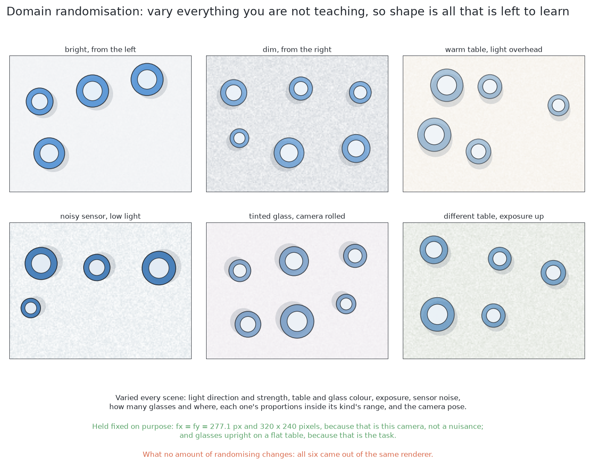

Those are six renders of the same arrangement. Look at what changes between
them, and then at the two lines underneath saying what is deliberately held
still.

Here is the failure this prevents. The simulator will render this table, under
this light, with this shade of grey, for ever, in exactly the same way. If every
training picture has the table at the same shade, then the network is free to
learn "glass means the pixels that are not that shade of grey". That rule scores
perfectly on every training picture *and* on every held-out one, because the
held-out pictures came out of the same renderer. Then somebody changes the world
file, or adds a light, and the model falls over for a reason that appears in
none of the numbers.

**Domain randomisation** is the fix, and it is blunt: vary everything you are
not trying to teach, scene by scene, over a range wider than anything you expect
to meet. The network then cannot use any of the varied things as a shortcut,
because none of them is reliable. What is left constant is the shape and
position of the objects, so that is what it has to learn. The idea is from Tobin
and colleagues, 2017 ([arXiv:1703.06907](https://arxiv.org/abs/1703.06907)).

It matters **even though this cell only ever runs in one simulator**, because
the world file will change during the project's life. A model that has quietly
keyed on a texture breaks silently the day somebody changes that texture, and
randomising is how you find that out during training instead of afterwards.

What would be varied, scene by scene, is the light, meaning its direction,
intensity, colour and how many sources there are; the table, meaning its colour
and texture; the glasses, meaning their tint, their shininess, and each one's
proportions drawn independently from its kind's plausible range; the camera
pose, jittered slightly around the nominal place it looks down from, because the
arm's own positioning is not exact; the exposure and the sensor noise; and the
arrangement itself, with four to six glasses placed anywhere in the zone.

One thing is worth randomising **past** the specification, which is the minimum
separation between glasses. The cell guarantees a certain gap, but training with
pairs standing much closer than that makes the guaranteed gap an *ordinary* case
in the middle of the range, rather than the very hardest thing the network ever
saw. As a general rule: **the edge of the specification should sit somewhere in
the middle of the training set**, so that the model has seen worse than it will
ever meet.

One thing would **not** be varied, which is the camera's lens. The focal length
and the picture size are facts about the camera this cell has, and not nuisances
to be made robust against. Teaching the network to cope with lenses it will
never meet spends its limited capacity on nothing. The same goes for the glasses
standing upright on a flat table, because that is the task rather than an
accident of the data.

## The arithmetic still decides

One thing has not changed from solution 2, and it is deliberate.

Each pile's voters — the pixels, at their own positions on the table — are
fitted with a circle, which returns a centre, a width and a fit error. A pile
whose fitted width falls outside the range this kind of glass can be is **not
reported as a glass**, whatever the votes may say.

So the network proposes and the geometry disposes. That is what keeps this
solution inside the same safety argument as the programmed ones: a learned
component decides which pixels group together, and an arithmetic check decides
whether the result is believable.

## How the concepts fit together

Everything above is one pipeline, and it is worth seeing the whole of it in
order before the failure cases, because each stage inherits what the last one
got wrong.

A **picture** goes in. The **network**, whose shape was chosen so that a unit
near the output can see a large part of the scene, produces two things at every
pixel: a **probability** that the pixel is glass, and an **arrow** towards the
middle of that pixel's own glass. The probability is thresholded into a
**mask**. Every mask pixel with a depth reading is back-projected into a **point
on the table**, and the arrow, which was predicted in millimetres on the table
rather than in pixels, is added to that point to give a **vote**. The votes pile
up, one pile per glass, and **mean shift** finds the piles without being told
how many to expect. Each pile's centre is a glass's position, its spread is a
confidence that came for nothing, and the pixels that voted into it are that
glass's mask.

Three things are worth holding on to about that chain.

The **units** decision is the one that makes it work. An arrow measured in
pixels would mean something different at every distance and under every amount
of splay, so the same glass would demand a different answer from the network in
every picture. Measured in millimetres on the table, the arrow is a fact about
the glass rather than about where the camera happened to be.

The **loss** decision is the one that most often goes wrong. Most pixels in
these pictures are table, so a measure of success that counts pixels rewards a
network for saying nothing at all, and the fix is to score the overlap of the
shape rather than the count of the pixels.

And the **arithmetic** decision is what keeps the whole thing honest. The
network proposes; the fitted circle and the kind's own range of widths dispose.
A pile of votes that implies a footprint no glass of this kind could have is
rejected by a rule nobody trained.

## The feedback loop, and where doubt has to be counted

A per-pixel model has a measure of doubt built into its output, which most
methods do not. It does not return a mask. It returns a **confidence map**, with
a probability at every pixel.

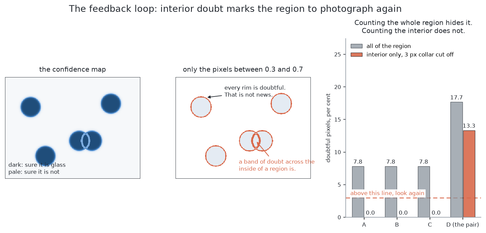

Thresholding that map gives a mask and throws the doubt away. Keeping the map
gives the loop something to run on. Call a pixel **doubtful** when its
probability is neither clearly glass nor clearly not, because the network
genuinely cannot say.

Two things can then be read off: **how much** doubt surrounds a region, and
**where** that doubt sits.

The "how much" needs care, because the obvious way of measuring it does not
work, and this is the most useful practical idea in this document.

**The rim has to be removed before anything is counted.** Every region has a
doubtful rim a couple of pixels wide, because at the edge of any object some
pixel really *is* half glass and half table. That is the correct answer rather
than a failure. But it is not small either: for a glass-shaped region, a rim
that thin is already a noticeable fraction of the whole region before anything
has gone wrong at all.

Worse, that fraction depends on the region's **shape** rather than on its
trouble. A long thin region has more perimeter for each unit of area than a fat
one, so it looks more doubtful simply for being thin. Counting doubtful pixels
over a whole region therefore mostly measures perimeter against area, which
tells you nothing about whether the answer is right.

So **erode the region first**, which means shaving a thin collar off its
outside, and count only what is left. A glass the network is sure about then has
essentially nothing uncertain inside it. And doubt in a band across a region's
**middle** is the signature of a second glass behind it — which, after the
erosion, is the only thing left there.

That gives the loop both of the things it needs. A region far more doubtful than
its neighbours is one to photograph again, and the band of doubt gives the
direction to look from, because the band marks where one object's edge crosses
another, so the two objects are stacked across it.

The loop needs a third thing, which is a budget. Moving the arm and letting it
settle costs seconds, while a picture costs milliseconds and one pass of a
network this small costs tens of milliseconds at most. **The expensive thing is
the movement**, by a factor of thousands. So the loop caps the extra looks per
doubtful region, and when the budget is spent it reports the region as doubtful
rather than guessing.

## Doubt measured from the votes themselves

**The doubt here is free**, which is unusual and is one of the best reasons to
prefer this design. How far a pile's votes sit from its own peak, on average, is
a per-glass confidence, and it costs one line to compute.

It needs calibrating once. Run the trained network over held-out renders where
the truth is known, and record what that spread looks like when the answer is
right. Every threshold below is then a multiple of that measured figure, rather
than a constant somebody chose.

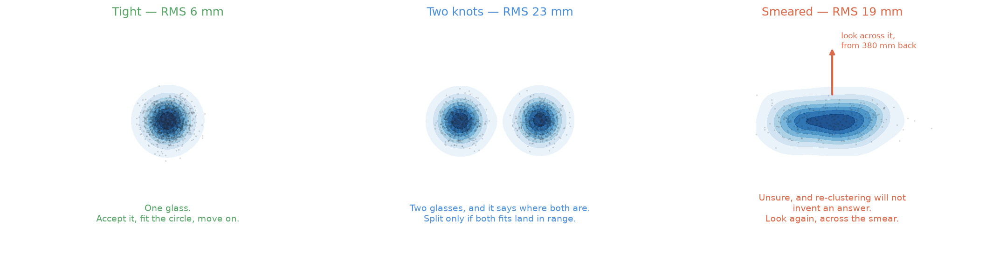

There are three shapes of cloud and three actions, and the important point is
that the shape says not only *whether* to look again but *where*.

**A tight pile**, at or below the held-out figure, is one glass. Fit the circle,
check the width against the kind's range, report it, and move on.

**Two knots inside one pile** means the votes have split into two tight lumps.
That is two glasses, and it has already said where both of them are. So propose
the split, and then check it: accept it only if **both** fitted circles land
inside the kind's range. If only one of them does, the split is not believed,
and the pair is reported doubtful rather than guessed at.

**One broad smear**, with no lump sharper than the rest, is the network saying
it does not know. Re-running the grouping will not manufacture an answer that is
not in the data.

That last case is where the loop starts, and the smear says which picture to
take. A smear almost always has a long axis, and that axis is the direction
along which the evidence is thin. So look **across** it, square to the long
axis, from the side at the measuring standoff. Note that there is **no search
over candidate viewpoints** here at all: the vote cloud names the direction by
itself, and geometry the project already has turns a direction into a reachable
pose.

### Too few votes, whatever the spread

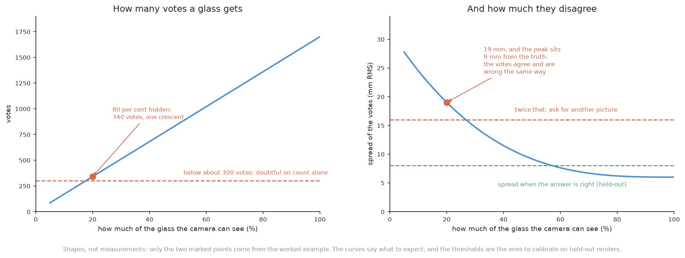

There is a fourth case, checked separately, because the spread does not catch
it.

A heavily hidden glass votes only from a crescent down its visible side, and
those votes can agree very closely with each other while being **wrong
together**. So a pile built from a small fraction of the votes a whole glass
should give is doubtful on count alone, however tight it looks.

This is the one check that catches confident agreement between witnesses who all
stood in the same wrong place, and it is worth having for exactly that reason.
The two curves in that picture are shapes to expect rather than measurements,
and both thresholds are figures to calibrate on held-out renders.

### What the second picture buys, and what it costs

Because the votes are places on the table and the camera pose is known, the new
picture's votes go into the same plane as the old ones. **There is no matching
problem to solve** and no pairing of regions between views. The piles simply
gain more voters from a better angle.

That is a direct consequence of voting in table coordinates, and it would not be
available at all if the arrows were measured in pixels.

The cost is arm motion, which is by far the most expensive resource in this
cell, so the loop is capped at a small number of extra looks per doubtful pile.
A pile still doubtful after that is **reported as an unseparated pair**, with
its position and its reason, and handed to problem 3.

That is a result rather than a failure. The rule the whole project runs on
applies here too: anything doubtful is reported, and never guessed.

## When the glasses are completely hidden

A glass can be missing from a picture altogether. It is standing on the table,
it is solid, the depth camera is pointed straight at the part of the table it is
on, and not one pixel of it comes back. This section works out what this
solution does about that. It is for anyone deciding how much of problem 2 this
solution can be asked to carry on its own, and the answer has two halves that
point in opposite directions, so it is worth going through both.

Start with what makes this solution's position unusual. Every other method on
these pages separates two glasses by finding something between them: a gap in
the picture, a strip of bare table, a seam. This one finds nothing between them.
Each glass pixel votes for where its own glass's centre is, and it casts that
vote whether or not anything can be told apart anywhere. So a glass that is
**partly** covered still speaks. Its surviving pixels vote for the right centre,
and they do not have to be joined to each other, or to make a recognisable
shape, or to lie on any particular part of the glass.

A large glass standing in front of a small one hides much more of it than a
glass of its own size would, so a glass can be left with only a crescent of
itself in the picture, at the gap the cell guarantees. That is uncommon rather
than the normal case — it wants a crowded line of glasses running out from the
point below the camera — and it is the case voting is unusually good at, so it
is worth putting a number on how good.

**The arithmetic needs very few votes.** A vote is the pixel's own place on the
table plus the arrow to its own glass's centre, so every vote is an estimate of
the same point, and averaging several of them shrinks the scatter. Against the
held-out spread of 6 mm this document calibrates everything else against, five
votes put the peak within 4.6 mm of the true centre nineteen times in twenty,
and twenty votes put it within 2.3 mm.

**Finding a pile that small is the harder half.** The windows are started from a
few hundred votes drawn at random, as [choosing the one window
size](#choosing-the-one-window-size) describes, and a pile only gets a window
started in it if one of those seeds lands in it. In a picture holding about
seventeen thousand votes, a pile of twenty is found by three hundred seeds
thirty per cent of the time, a pile of a hundred eighty-three per cent of the
time, and a pile of three hundred, which is under two per cent of the picture,
ninety-nine and a half per cent of the time. That floor is a choice rather than
a law: seeding a window at every vote removes it entirely, at the price of the
arithmetic that made the sampling worth doing.

**And the vote count check refuses to believe a pile that small anyway.** That
is deliberate and it is argued in [too few votes, whatever the
spread](#too-few-votes-whatever-the-spread): a crescent's votes agree with each
other and are wrong together.

So the honest figure is a few hundred pixels — well under a tenth of a glass —
for voting to find a hidden glass and place it to a millimetre or two.

**None of which helps when the number is nought.** A glass that is covered
completely owns no pixels, so it casts no votes, so there is no pile to find, no
spread to be loose and no count to be short. The vote map simply has one peak
where two glasses are standing, and **nothing in it is wrong**. Both of this
solution's own alarms are measurements of votes, and there are no votes to
measure.

That is a limit rather than a bug, and it is the same limit every method here
that works from pixels runs into. This solution cannot handle the completely
hidden case and must hand it on. What it hands on is not a glass but a region:
the part of the table it could not have seen. Working out that region is
arithmetic on splay and on the glasses that *were* found, and it belongs to
[cluster on the table](../04_programmed/02_cluster-on-the-table.md). Deciding which
of those places is worth spending a picture on belongs to [is anything hiding
there](05_is-anything-hiding-there.md). Moving the camera and taking that
picture belongs to [move the camera](../04_programmed/03_move-the-camera.md).

### Why more training cannot fix it

It is worth settling whether more training would help, because it is the first
thing anyone suggests, and the reason it cannot is worth being exact about.

Take the scene with the hidden glass and the same scene with
that glass removed. The two produce the same picture, pixel for pixel. No
function of the picture can tell them apart, whatever its shape and however it
was fitted, because the thing that differs between the two scenes left no trace
in the input. This is the one limitation in this document that is a fact about
the input rather than about the model.

There is a qualification that deserves working out rather than waving at,
because it is the obvious objection. A network *can* be trained to mark part of
an object it cannot see. The name for that is **amodal segmentation**, which
means predicting an object's whole extent rather than only the visible pixels of
it, and it is ordinary rather than exotic — it is what lets a person report one
cat behind a railing instead of five slices of cat. The silhouette of a tall
glass is sometimes consistent with something standing behind it, so a network
could in principle learn to mark that, and the simulator can supply the label to
train it on.

The first head described above does **not** do that. It has one output channel
and it is trained against the mask the simulator returns for what the camera can
see, so the only thing it can learn to mark is glass that is visible. Making it
amodal would take three things: ask the simulator for each glass's mask with the
other objects taken away, which costs no more than the visible mask; train
against that instead; and accept that the mask now claims pixels whose evidence
is some other object's surface, so the circle fitted to those pixels is a
prediction rather than a measurement.

Even then it would not answer this section's question, and the reason is the
same one as before. Amodal completion extends evidence, so it needs some of the
object to be visible to extend from. With no pixels at all there is nothing to
extend, and a model asked to mark a glass that *might* be behind this one would
be inventing a scene rather than reading a picture. The same limit is written
down for the hardware version of the idea, in
[`learned-with-hardware.md`](11_needs-more-than-a-simulator.md), and the right machinery
for a guess about a scene is not a segmenter at all.

The two subsections below work out how a glass comes to be covered in each of
the cell's two views, because the geometry is different in each and so is the
handful of pixels that survives when the covering is not quite complete.

### When the camera is looking straight down

The survey looks straight down from 450 mm above the table top. The table is the
furthest thing from the lens and a glass's rim is the nearest, because the rim
has climbed most of the way from the table towards the camera, and anything
nearer the lens is drawn larger and further out from the middle of the picture.

The arithmetic is exact. A slice of a standing glass at height *z* is drawn as
though it had been scaled about the point directly below the camera by

    k = H / (H - z)

where *H* is the camera's height above the table top. At the survey height a
slice 225 mm up has k = 450 / 225 = **2.00**: its circle is drawn at twice its
real distance out from that point, and at twice its real radius. This project
calls that outward stretch **splay**.

Now take two glasses of the one kind, both drawn from the project's own range.
One is 223.8 mm tall with a rim 102.9 mm across, so its rim is scaled by 1.99.
The other is 93.8 mm tall with a rim 83.6 mm across, so its rim is scaled by
1.26. Stand the tall one 205 mm out from the point below the camera and the
short one 150 mm further out along the same line — and 150 mm is the closest two
glasses ever stand, so this is an ordinary arrangement rather than a contrived
one.

The tall glass's splayed outline then contains the short glass's outline
entirely. **Nought of the short glass's 4,669 pixels reach the picture.**

What comes back is one patch of 16,781 pixels. Those pixels back-project to a
footprint 103 mm across, and the widest this kind of glass can be is 105 mm, so
the patch is an entirely legal width and nothing about it looks wrong. It is
worth being clear about why the patch measures 103 mm when its outline in the
picture spans 325 mm. Splay decides which pixels exist; it does not decide where
they land. Each pixel's depth reading puts it back at its own true place on the
table, so the tall glass's pixels come back as its own real footprint.

Hiding this way needs two things at once. The two glasses have to be close
together, and they have to differ a lot in height, because k grows with height
and it is the difference in k that lets one outline sweep over the other. The
hidden glass is therefore always the shorter one.

It also depends on where the pair is standing relative to the point below the
camera, because splay runs outwards from that point and nowhere else. Read the
next table as follows: keep the two glasses 150 mm apart and swing the short one
about the tall one, away from the line running out from the camera, and count
how many of the short glass's pixels reach the picture. The whole-glass count
changes a little from row to row because swinging the glass moves it nearer to
or further from that point, which changes how large it is drawn.

| the short glass, swung off the line out from the camera | its pixels that reach the picture |
| --- | --- |
| 0 degrees | 0 of 4,669 |
| 8 degrees | 0 of 4,687 |
| 12 degrees | 87 of 4,704 |
| 16 degrees | 324 of 4,716 |
| 20 degrees | 663 of 4,658 |
| 30 degrees | 2,107 of 4,653 |
| 90 degrees | 4,043 of 4,043 |

A pair lying along that line hides. The same pair lying across it does not hide
at all. And the change between the two is quick: the short glass goes from
invisible at eight degrees to keeping nearly half of itself at thirty.

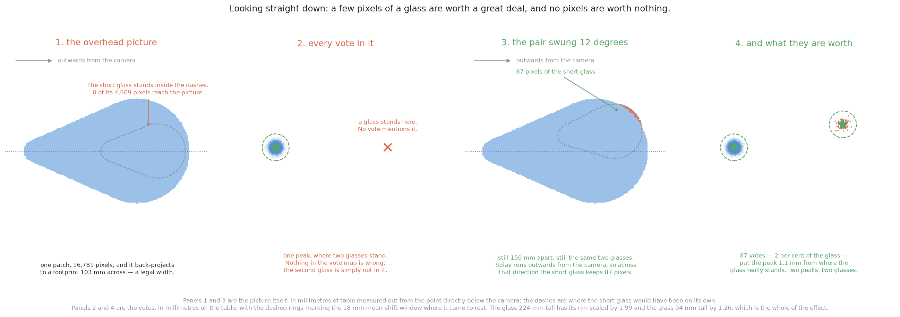

The second panel is the case this section is about. One peak, where two glasses
are standing, and the peak that is there is in exactly the right place with an
entirely believable width behind it.

The fourth panel is the other half of the argument. Swung twelve degrees, the
short glass keeps 87 pixels — under two per cent of itself, a thin crescent
along one edge — and a window started in those votes comes to rest 1.1 mm from
where the glass really stands. A boundary method has nothing to work with there,
because there is no boundary between the two outlines to find. Voting does not
need one.

One measurement is worth recording about *which* pixels survive, because it
decides how hard the network's job is. Looking straight down, the mouth of the
glass is visible and it is the part nearest the lens, so it is the first thing a
covering outline takes. What is left is a strip of far wall and far rim. Those
survivors sit on average 41.7 mm out from their own glass's centre, on a rim
radius of 41.8 mm, against 29.4 mm averaged over the whole glass. They are the
most extreme pixels the glass has, which means their arrows are the longest the
network is ever asked to predict.

### When the camera is looking level

The measuring view is different in kind. The camera stands 120 mm above the
table top and 380 mm back from the glass it is looking at, and it looks level. A
level camera throws nothing outwards, so splay plays no part at all. What
happens here is plain line of sight: the near glass is in the way.

Put the short glass straight behind the tall one and it disappears, and the
distance between them buys nothing whatever. Nought of its pixels survive at 150
mm apart, nought at 300 mm, and nought at 600 mm. The reason is that the near
glass is nearer, so it is drawn larger: the tall glass, 102.9 mm across, is 75
pixels wide in the picture at the standoff, while the short glass, 83.6 mm
across, is 34 pixels wide at 300 mm behind it.

So the hidden glass here is the further one, whatever its height. Swap the two
round and the magnification works the same way. The near short glass is 61
pixels wide in the picture against the far tall glass's 42, so it covers 26 per
cent of that glass: the lower part of it, up to about the height of its own rim.

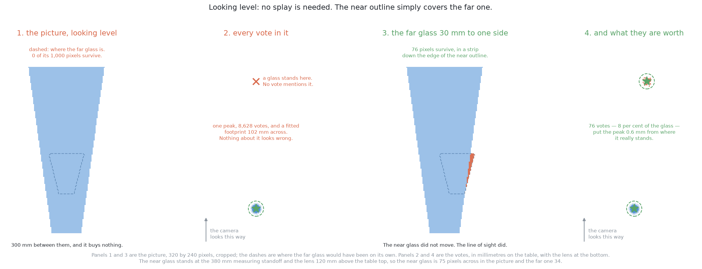

Again the second panel has one peak where two glasses stand, and again there is
nothing wrong with it: 8,628 votes, a fitted footprint 102 mm across, a tight
pile. Step the far glass 30 mm to one side and 76 of its 1,000 pixels survive,
as a strip down the edge of the near glass's outline, and a window started in
those votes comes to rest 0.6 mm from the truth.

The survivors sit differently here, and the difference is smaller than it
sounds. Looking level, the lens is below the rim of anything tall, so there is
no mouth to lose in the first place, and the strip that survives sits 35.5 mm
out from its own centre against 31.8 mm over the whole glass. Looking straight
down, the surviving pixels were the most extreme the glass had; from the side
they are barely more extreme than average.

What the two cases share is the thing that matters to the network. Whichever
view it is, the pixels that survive are a crescent down one edge, and every
pixel of that crescent sees the same one-sided part of the glass. So their arrow
errors agree with each other rather than cancelling, which is exactly what the
count check in [too few votes, whatever the
spread](#too-few-votes-whatever-the-spread) exists to catch. The arithmetic
earlier in this section is therefore a floor on what is possible and not a
promise about what a trained network will do.

And when the crescent is empty, none of that applies. There is no strip, no
pile, no spread and no count. The only remaining question is a geometric one
about where a glass could have been standing unseen, and this solution does not
answer it.

## A worked example

Everything below follows from the cell's own constants and nothing else.

**The scale.** Seen from the top, one pixel covers a millimetre or two of table.
So a glass's footprint is a few tens of pixels across, and its outline covers a
disc of that width, which is well over a thousand pixels. **That is over a
thousand votes per glass**, and it is the number to keep in mind for everything
that follows.

**The case that defeats clustering.** Take two glasses of one kind standing much
closer together than the cell allows, so that the strip of bare table between
their rims is narrower than solution 2's grouping distance. The chain crosses
that strip, so the two sets of points come back as **one group**, spanning both
glasses plus the gap, which is far wider than any single glass of this kind can
be. So solution 2's range check fires correctly — but it fires on a blob it has
no way whatever to divide.

**What the votes do.** The *pixels* of the two glasses are exactly as merged as
before, because nothing has changed about them. Their *votes* are not. Each
glass's pixels point inwards at their own glass's centre, so the votes land in
two piles whose separation is the full centre-to-centre distance — comfortably
more than the mean-shift window can span, so the two piles stay two. Both piles
are tight, with a spread inside the held-out figure, and circle fits on the two
sets of voters come back inside the kind's range.

Two glasses, two positions, two masks, two widths, out of a picture in which the
pixels themselves never came apart. **That is the whole idea of this solution in
one example.**

**The case that defeats voting.** Now stand one glass mostly behind another, so
that only a crescent down one side of it is ever visible.

It contributes a small fraction of the votes it should, and worse, every one of
them comes from that same crescent. So the votes **agree with each other and are
wrong in the same direction**, which is exactly what a one-sided view does. The
pile lands noticeably off the true centre, and its spread comes out several
times the held-out figure.

Notice that the vote count and the spread both complain, independently, and that
neither of them is the network's own opinion of itself. They are measurements of
the votes.

**What that costs to fix.** The spread is over the threshold, so the arm takes
one more picture: from the side, standing back at the measuring standoff,
looking level, across the line joining the two glasses. Standing that much
closer, each pixel covers far less, so the glass fills more of the frame than it
did from the top — more pixels on the glass, from a direction where nothing is
in front of it. Its votes come back to a normal spread, and the peak lands where
it should.

**What that costs in time.** Running the network on a picture costs
milliseconds. Moving the arm to the new pose and letting it settle costs
seconds. The whole design of the loop follows from that ratio: **compute freely,
and move rarely.**

## What it needs

This is the most demanding solution in this folder to set up, and it is worth
being plain about what that means before anyone starts.

It needs a **deep learning framework** and the environment to run it in, which
is a large dependency for a cell whose recommended answer is a page of
arithmetic. It needs a **training set**, which the simulator renders and labels
for nothing — that is the one genuinely cheap part, and it is what makes
training from scratch reasonable here at all. It needs **hours rather than
minutes** of that rendering, and a similar amount again of training, on the
machine this project runs on. And once trained, it needs a **file of weights
kept in step with the world**: change the lighting, the camera or the range of
sizes a kind is drawn from, and the file is quietly out of date in a way that no
test of the code will notice.

Against that, what it needs at run time is small. One pass of a small network
over a small picture is milliseconds, which is nothing beside the seconds an arm
movement costs, so the cost of this solution is entirely in building it rather
than in running it.

## Where it is strong and where it breaks

**It needs no depth readings.** This is the strength that matters most, and it
is the reason this document exists. Every programmed solution in this project
rests on the depth camera returning points on a glass, and real glassware
returns almost none. A method that works from colour alone is the one that
survives contact with real glass.

**It separates glasses that touch.** Nothing here has to find a boundary, so
nothing can get a boundary wrong. Every other method on these pages needs a gap
of some kind — a gap in the picture, a strip of bare table, a seam — and when
two glasses touch there is no gap anywhere to find. This is the only method that
does not care.

**It is unusually good at partly hidden glasses.** A crescent of surviving
pixels still votes towards the right centre, and the votes do not have to be
joined to each other or to make a recognisable shape. Because one kind spans a
small tapered glass to a large one, a glass can be left with only a crescent of
itself even at the gap the cell guarantees, which is uncommon rather than the
normal case and is exactly the case voting handles best.

**It is blind to a glass that is hidden completely.** No pixels means no votes,
which means no pile, no spread and no short count. This is a fact about the
input rather than about the model, and the section above works it out in full.

**Its answer cannot explain itself.** When a fitted circle is wrong you can
print one number and see why. When a network is wrong you can look at the
picture and guess. The arithmetic wrapped round it is what makes that tolerable.

**Its weights are a second copy of the world.** The code says what the cell is;
the weights say what the cell looked like on the day they were fitted. Keeping
those two in step is a maintenance job that the programmed solutions simply do
not have.

## The general ideas behind this

This is mainstream deep segmentation and mainstream voting, both shrunk. Every
component is standard and most of them are ten years old. Two things here are
unusual: the decision to train from a random start on synthetic data rather than
fine-tune something large, and the decision to have one network answer a question
about classes and a question about instances from the same shared body.

### Semantic segmentation — a class label at every pixel

Rather than a box round an object, produce a label for each pixel. The idea
became practical with **fully convolutional networks** (Long, Shelhamer and
Darrell, [arXiv:1411.4038](https://arxiv.org/abs/1411.4038)), which replaced a
classifier's final layers with convolutions so that a picture of any size maps
to a label map of the same size.

It is used for medical imaging, satellite and aerial pictures, driving scenes
and industrial inspection — anywhere the *extent* of a thing matters more than a
box round it. It is rarely right for counting or separating individuals, because
a class label has nowhere to record *which* object a pixel belongs to, so two
touching things of the same class come back as one region. That is the
limitation this solution runs into and that [solution
8](06_a-network-trained-from-scratch.md) removes.

For more, see [image
segmentation](https://en.wikipedia.org/wiki/Image_segmentation).

### The encoder–decoder with skip connections

Halve the resolution repeatedly while widening the channels, then double it back
up, and copy each level on the way down across to the matching level on the way
up, so that detail lost going down is available coming back. That is the
**U-Net** (Ronneberger, Fischer and Brox,
[arXiv:1505.04597](https://arxiv.org/abs/1505.04597)), designed for biomedical
images with very few training examples — which is exactly why it suits a small
synthetic dataset.

It is used for labelling every pixel when data is limited, such as cell and
organ segmentation, defect detection and depth estimation, and it remains the
default architecture for a small segmentation problem. It is rarely right for
problems needing broad understanding of a scene or many classes, where a large
pretrained network earns its size, because a small network knows only what its
receptive field and its training set contained.

### Overlap losses — scoring the shape rather than the pixel count

Cross-entropy averages over pixels, so on a picture that is mostly background a
model can score well by predicting background everywhere. **Dice** and
**intersection over union** losses score the overlap between the predicted and
the true regions instead, and they are usually added to cross-entropy rather
than used in place of it (Milletari and colleagues,
[arXiv:1606.04797](https://arxiv.org/abs/1606.04797)).

They are used wherever one class is far rarer than the other, which covers most
medical and industrial segmentation. They are rarely enough on their own,
because an overlap score says nothing about how confident the individual pixels
were, which is exactly the information the feedback loop in this document runs
on.

### Domain randomisation — training on variation instead of realism

Vary everything you are not trying to teach, over a range wider than reality, so
that the model cannot key on any of it (Tobin and colleagues,
[arXiv:1703.06907](https://arxiv.org/abs/1703.06907)).

It is used wherever training data comes from a simulator and has to work
somewhere else, which is most of robotics. It is rarely sufficient on its own
for fine visual judgements, because randomising appearance makes a model ignore
appearance, and sometimes appearance is the signal.

### Training from scratch against fine-tuning a large model

The last idea is the choice this whole document turns on. Fine-tuning wins
whenever labels are scarce, which is almost always. Training from scratch wins
in the narrow case where labels are free, the problem is small, and the borrowed
weights would bring knowledge of a world you do not have. This cell is that
narrow case, and it is worth noticing how rare that is rather than generalising
from it.

### The Hough transform — local evidence for a global claim

A single edge pixel cannot say where a shape is, but it can vote for every shape
that would explain it. Add up the votes, and the peaks are the shapes really
present. Hough's 1962 patent did this for straight lines in bubble-chamber
photographs, and the **generalised Hough transform** (Ballard, *Pattern
Recognition*, 1981) extended it to any shape at all, by replacing the equation
with a lookup table of offsets.

It is used for finding shapes in noisy, cluttered pictures where much of the
outline is missing, such as lines, circles and ellipses in inspection, document
analysis and lane finding. Voting is naturally robust to things being hidden,
because the visible part still votes correctly. It is rarely right for shapes
with many parameters, because the table of votes grows explosively with them,
and it is also poor when a learned detector is available and the shape has no
clean equation.

For more, see the [Hough
transform](https://en.wikipedia.org/wiki/Hough_transform) and the [generalised
Hough transform](https://en.wikipedia.org/wiki/Generalised_Hough_transform).

### Learned voting — replacing the lookup table with a model

**Hough forests** (Gall and Lempitsky, CVPR 2009) first replaced the hand-built
table of offsets with a learned one, so that patches vote for an object centre
and a fitted model decides how. The neural descendants apply the same structure
to points and pixels. **VoteNet**
([arXiv:1904.09664](https://arxiv.org/abs/1904.09664)) has points from a depth
sensor vote for object centres, and **PVNet**
([arXiv:1812.11788](https://arxiv.org/abs/1812.11788)) has pixels vote for
landmark points when working out an object's orientation — specifically because
voting survives things being hidden.

These are used for finding objects and their orientation when much is hidden and
the scene is cluttered, such as bin picking and crowded scenes, because a method
needing the whole object visible fails there while a method needing only a
fraction does not. They are rarely right for objects with no well-defined
centre, or where the offsets are large compared with the picture, because then
the number the network has to predict grows and the votes scatter.

### Per-pixel offsets as a way to separate objects

The general problem this solves is that a class map has nowhere to record
*which* object a pixel belongs to. Predicting an arrow per pixel, towards its
own object's centre, is one of two standard answers. The other is to have the
network give each pixel a made-up identity code and group those codes instead,
which is called **associative embedding** (Newell and colleagues,
[arXiv:1611.05424](https://arxiv.org/abs/1611.05424)).

Offsets fail more gently than predicting boundaries, and the comparison is worth
remembering as a general principle: one bad pixel in a seam rejoins two objects,
whereas one bad vote is simply outvoted.

### Mean shift — finding peaks without being told how many

Slide a window to the average of the points inside it, and repeat until it stops
moving. Every starting point that ends in the same place belongs to one peak
(Comaniciu and Meer, *PAMI*, 2002). Unlike methods that divide data into a fixed
number of groups, it does not need the count in advance, which is the whole
point here, because **the number of groups is the answer**.

It is used for finding peaks when the count is unknown, such as tracking, colour
segmentation, and exactly this job of turning a cloud of votes into objects. It
is rarely right for data with many dimensions, where it is slow and the window
size becomes impossible to choose, and it is poor for groups of very different
densities, where one window size cannot serve both.

For more, see [mean shift](https://en.wikipedia.org/wiki/Mean_shift).

## Where it sits among the other solutions

This solution and the programmed ones answer the same question from opposite
directions, and the comparison is sharper than it first looks.

On any day the depth readings work, [cluster on the
table](../04_programmed/02_cluster-on-the-table.md) is better in every way that
matters here. It is a page of arithmetic rather than a file of weights, it needs
no training set, it explains its own failures, and it places a glass more
accurately than this does. Preferring a network on such a day would be choosing
the harder tool for a job the easier one already does.

The day this solution earns its place is the day the depth readings stop, which
is the day the glasses become real glass. Then the programmed methods lose their
input entirely, and this one loses nothing, because it never used depth in the
first place. The other such day is the day two glasses are allowed to touch,
since that is the case no gap-finding method can answer at all.

What it cannot do, on any day, is notice a glass that is absent from the
picture. That failure is answered by geometry rather than by appearance:
[cluster on the table](../04_programmed/02_cluster-on-the-table.md) works out where
a glass could have been hiding, [move the
camera](../04_programmed/03_move-the-camera.md) acts on that argument by choosing
somewhere else to stand, and [is anything hiding
there](05_is-anything-hiding-there.md) is the learned version of deciding which
hiding place is worth the trip. This solution contributes the masks those three
argue from, and none of the argument.

← [Is anything hiding there?](05_is-anything-hiding-there.md) · [Self-supervised
from the arm's own movement](07_self-supervised-from-the-arms-own-movement.md) →
