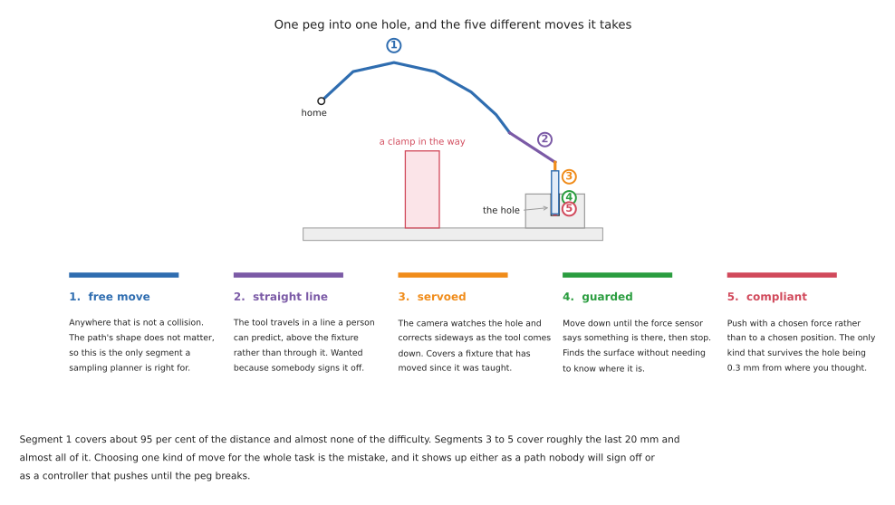

# Arm movement: getting there, safely and the same way every time

The arm is here and the thing it has to touch is there. This area is about the
gap between those two sentences.

It is the least glamorous part of a robot project and it is where most of the
time goes. Perception gives you a number. Gripping gives you a grasp. In between
sits the question of whether the arm can actually get to that number, whether the
route it takes is one anybody would sign off, and what happens in the last
twenty millimetres when the number turns out to have been slightly wrong.

This document is the map. It sets out the five kinds of move an arm makes, what
real tasks actually use, and which of the other five documents answers which
question.

## Who this is for, and what it is for

This is written for someone who can already picture a robot arm and a camera,
has read the [arm area](../03_arm/01_overview.md) or knows the equivalent, and
now has to make a real arm go somewhere. You do not need to have used a motion
planner. Every term is explained where it first appears.

Three areas of this repository already touch this subject, and this one
deliberately does not repeat them.

[Position, frames and transforms](../03_arm/01_overview.md) builds the maths
underneath everything here: what a frame is, what a transform is, and how joint
angles become a position. Read it first if those words are new.

[Tools and libraries](../09_tools-and-libraries.md) introduces MoveIt 2,
ros2_control, the kinematics libraries and behaviour trees, each with pseudo code
and working code. It answers "what is this piece of software and how do I call
it". This area answers "which one, when, and what goes wrong".

[Programmed methods for one arm](../10_one-arm-training/02_programmed-methods.md)
maps the landscape: the families of motion planning, the families of control,
and whether each is worth learning. It is a map. This is the ground.

Three things shape how this is written, and they are the same three that shape
the [object perception area](../06_object-perception/01_overview.md).

Every technique carries five jobs it suits and five it cannot do. That is more
useful than a score, because every planner works on the demonstration its authors
chose, and the interesting question is always which job it quietly fails at.

Every licence is named and was read from the project's own licence file. There
are real traps here. The inverse kinematics solver MoveIt uses by default is
LGPL-2.1, not BSD, and almost nobody notices.

Everything says whether it runs on an Apple Silicon Mac. ROS 2 has no official
support tier for macOS on `arm64` at all, in any distribution, and the practical
route is a community redistribution. Finding that out after two days is a common
and avoidable waste.

## Contents

1. [Five kinds of move, and which one you need](#1-five-kinds-of-move-and-which-one-you-need)
2. [What your task actually needs](#2-what-your-task-actually-needs)
3. [What you know before the arm moves](#3-what-you-know-before-the-arm-moves)
4. [Plan once, plan continuously, or do not plan](#4-plan-once-plan-continuously-or-do-not-plan)
5. [The one calculation underneath everything](#5-the-one-calculation-underneath-everything)
6. [Where the millimetres go](#6-where-the-millimetres-go)
7. [Why a plan that succeeds can still fail](#7-why-a-plan-that-succeeds-can-still-fail)
8. [The five documents that follow](#8-the-five-documents-that-follow)

---

## 1. Five kinds of move, and which one you need

People say "move the arm" as though moving were one thing. It is five, and they
want opposite things from the software underneath. The picture below takes one
ordinary task — pick up a peg and push it into a hole — and marks which kind of
move each segment is.



**A free move** goes from one pose to another and the shape of the route does
not matter, only that it hits nothing. This is the segment a motion planner is
genuinely the right tool for, and it is usually most of the distance.

**A straight-line move** keeps the tool travelling along a line in space. It
matters when a person has to predict what the arm will do, when the tool is
carrying something that must stay level, and when the path passes over
equipment the arm must not swing across. It is harder than a free move, not
easier, because every point along the line has to have a joint solution and the
solutions have to join up smoothly.

**A guarded move** goes in a direction until something stops it. You do not say
where to stop; you say what to stop for. Move down until the force sensor reads
more than three newtons, then hold. This is how an arm finds a surface whose
height it does not know, and it is the cheapest substitute for a measurement
there is.

**A compliant move** commands a force rather than a position. The arm behaves
like a spring with a stiffness you chose, so a millimetre of unexpected contact
produces a modest push instead of an escalating one. This is the only kind of
move that survives being slightly wrong about where the world is.

**A servoed move** closes the loop on a sensor while the arm is moving. A camera
watches the target and the arm corrects towards it continuously, rather than
measuring once and then executing blind. It costs a control loop running at
tens of hertz and it buys immunity to the target having moved since you looked.

The practical rule is that the kind of move is a property of the segment, not of
the task. Almost every job in this area contains at least two of the five, and
choosing one for the whole job is where the trouble starts.

The table below reads left to right: what each kind of move needs from you, what
it gives back, and the situation in which it is the wrong choice.

| The move | What you give it | What it gives back | Wrong when |
| --- | --- | --- | --- |
| free | a goal pose and a model of the obstacles | any collision-free route | the route has to be predictable or repeatable |
| straight line | two poses and a step size | a tool path that is a line, or a partial one | the line leaves the reachable region, which it can do while both ends are inside it |
| guarded | a direction and a stopping condition | contact, and the position at which it happened | the sensor cannot observe the event you are waiting for |
| compliant | a stiffness or a force | contact that does not escalate | you need the arm to hold a position against a load |
| servoed | a target in sensor units and a loop rate | continuous correction | the sensor is slower than the loop needs, which makes it unstable rather than merely slow |

## 2. What your task actually needs

People reach for a motion planner because it is the piece with the tutorials. The
table below is real task types against what they genuinely use. Read the last
column carefully; it is where the effort usually goes that need not have.

| Task | What it uses | What it skips, and why |
| --- | --- | --- |
| **machine tending** | taught poses, joint moves between them | no planner at all. The machine and the fixture do not move, so the route was decided once and never needs deciding again |
| **palletising** | a straight-line approach, joint moves between layers | no collision search. The stack geometry is arithmetic, and a planner would give a different answer every run |
| **bin picking** | a free move into the bin, then a straight-line lift | no taught poses, because the grasp is different every time. This is the one task where sampling planners earn their keep outright |
| **assembly and insertion** | a guarded move to find the surface, then compliance | almost no planning. The whole difficulty is in the last few millimetres, and a planner has nothing to say about them |
| **polishing, deburring, sanding** | a Cartesian path along the surface, with force control normal to it | no free moves during the work. The path is the part's geometry, not a search result |
| **welding and dispensing** | Cartesian paths with speed held constant along the seam | no collision avoidance in the work, and no replanning. The speed matters more than the route |
| **lab and kitchen handling** | free moves, then servoed or guarded approach | rarely force control. The objects are light; the difficulty is that they are not where you were told |
| **anything with a person nearby** | slow joint moves, monitored speed | no clever paths. Everything is subordinate to being able to say what the arm will do |

Four things follow from that table, and each of them saves work.

**Most industrial arm motion is not planned.** It is taught, or computed
deterministically from geometry, and then replayed. A planner is what you reach
for when the scene changes between runs. If your scene does not change between
runs, a planner buys you a different path every time, which is a cost rather
than a feature.

**The hard part is almost always the last twenty millimetres.** Look down the
table and the tasks people describe as difficult — insertion, polishing,
connector seating — are the ones whose difficulty is entirely in contact. A
better planner does not help with any of them, and this is the single most
common misallocation of effort in the field.

**Cartesian control and force control travel together.** Every row that needs a
straight line also needs to care about what happens when the line meets
something. This is why [controlling the move](04_controlling-the-move.md) treats
them as one subject rather than two.

**The cheapest motion is the one you do not have to compute.** A fixture, a hard
stop, a taught pose. Planning is what you reach for when the geometry stopped
being known in advance, which is the same argument the
[perception area](../06_object-perception/01_overview.md#2-what-your-task-actually-needs)
makes about fixtures, for the same reason.

### 2.1 When a planner makes things worse

The instinct, when an arm has to cope with a scene that varies, is to reach for a
planner. Often that is right. Three times it is not, and it is worth knowing
which three.

**A planner gives a different answer every time, and that is its design.** The
sampling planners in [planning a path](03_planning-a-path.md) draw random
configurations. Run the same problem twice and you get two paths, both valid,
neither the same. For a research demonstration that is irrelevant. For a cell
somebody has to sign off, it means you cannot state what the arm will do, and
proving a machine safe usually requires exactly that.

**A planner hides a reachability problem instead of reporting one.** If the goal
is awkward, a sampling planner does not say "this pose is near a singularity and
the wrist will have to spin". It either finds a path that does spin the wrist, or
it times out with no explanation. Both outcomes lose an afternoon.
[Reaching and reachability](02_reaching-and-reachability.md) is about finding out
first.

**A planner plans in a world you described, and the description is where the
error lives.** The path avoids the obstacles you put in the planning scene. It
does not avoid the cable you forgot, the fixture that was moved, or the object
now in the gripper that you did not attach to the model. The most common planning
failure is not a bad path; it is a good path through a world that was wrong.

None of this says planners are wrong. It says they are right for one of the five
kinds of move and are routinely asked to do all five.

## 3. What you know before the arm moves

The single best predictor of which approach you need is not how hard the motion
looks. It is how much of the scene was decided before the robot was switched on.
The table below reads from the top down, from knowing the most to knowing the
least, and the work goes up as you go down.

| What is fixed in advance | What that lets you do | What it costs |
| --- | --- | --- |
| everything: part, fixture, and where they sit | teach the poses once and replay them. No planner, no perception, no inverse kinematics at runtime | a fixture, and a part mix that does not change |
| the part, but not where it is | plan or compute a path to a pose that perception supplies | a camera, a calibration, and a reachability check per pose |
| where it is, but not what shape it is | plan freely, and let contact find the detail | force sensing, and a controller that can be soft |
| nothing: the scene is different every cycle | plan continuously, or learn a policy | either a planner fast enough to run every control cycle, or a training pipeline |

Most projects that get into trouble here have reached for the bottom row while
genuinely in the top two. The bottom row is what the papers are about, so it is
what people read first.

## 4. Plan once, plan continuously, or do not plan

There are three postures towards motion and they are not degrees of the same
thing. They have different failure modes and different hardware.

**Compute the path once, then execute it.** The arm plans, gets a trajectory,
hands it to the controller, and the controller follows it. This is what MoveIt
does by default and it is what nearly every tutorial shows. It assumes the world
holds still while the arm moves, which in a fixtured cell is true.

**Replan every cycle.** The planner runs continuously, tens or hundreds of times
a second, each time from where the arm actually is. The arm is no longer
following a path; it is reacting. This needs a planner fast enough, which in
practice means one running on a graphics card. It changes what the arm can do
rather than merely making it faster, and it is the live area of development.

**Do not plan; compute.** Point-to-point, linear and circular moves between
taught poses, worked out deterministically from geometry, following a speed
profile the controller guarantees. This is how the great majority of installed
industrial arms move. It looks limited if you have only met sampling planners,
and it is indispensable if you have ever had to prove what a machine will do.

The table below is those three against the questions that decide between them.
Read the last column first if you are choosing.

| | Same answer every run | Needs a model of obstacles | Reacts to change | Typical hardware |
| --- | --- | --- | --- | --- |
| plan once | no, for sampling planners; yes, for optimisers | yes | no, unless you replan on failure | any computer |
| replan every cycle | no | yes | yes | a graphics card |
| compute, do not plan | yes | no — you avoid obstacles by choosing the poses | no | the arm's own controller |

## 5. The one calculation underneath everything

Every difficulty in this area reduces to one relationship. The tool's speed is
the joint speeds multiplied by a matrix called the Jacobian, which says how far
the tool moves when each joint turns a little. Turn that round and the joint
speeds are the tool speed multiplied by the Jacobian's inverse. When the Jacobian
is close to being uninvertible, a modest tool speed needs an enormous joint
speed, and the arm either lurches or refuses.

The [arm area](../03_arm/01_overview.md) builds this arm: two links, 3 m and 2 m,
lying flat. For that arm the relationship is exactly

```
determinant of the Jacobian = L1 · L2 · sin(q2) = 6 · sin(q2)
```

where `q2` is the elbow angle. When the elbow is straight, `sin(q2)` is zero, the
determinant is zero, and the arm cannot move its tool along its own length at
any speed at all. Nothing is broken and nothing has collided. The geometry simply
ran out.

That is the whole of singularity, and everything in
[reaching and reachability](02_reaching-and-reachability.md) is a consequence of
it. The same sentence in three registers:

- in geometry, the arm has reached the edge of what it can do
- in arithmetic, a matrix stopped being invertible
- on the bench, the wrist spins violently, or the controller throws a fault, or
  the arm stops a millimetre short and you cannot see why

## 6. Where the millimetres go

Before reaching for a better planner it is worth knowing what "the arm went to
the wrong place" actually consists of. Five causes account for nearly all of it,
and they are not equally large.

**Repeatability and accuracy are different numbers, and almost every datasheet
quotes only the first.** Repeatability is how close the arm gets to the same
place when sent there twice. Accuracy is how close it gets to the place you
named. Industrial arms are repeatable to a fraction of a millimetre and accurate
to something closer to a millimetre, because accuracy depends on the arm's model
of its own dimensions and that model is nominal rather than measured. Any
workflow that commands a pose computed from a camera is using accuracy. Any
workflow that replays a taught pose is using repeatability. The second is the
better number and most projects quietly assume it while relying on the first.

**The tool offset is the largest term nobody measures.** If the software thinks
the tool tip is 140 mm from the flange and it is 143 mm, every commanded pose is
3 mm out, and no amount of planning fixes it. Worse, an error in the *direction*
of the tool becomes a position error that grows with how far the tool sticks out.

**Hand-eye calibration puts the perception error into the motion.** This is
covered properly in the
[perception error budget](../06_object-perception/01_overview.md#8-where-the-millimetres-go),
and the number quoted there is worth repeating: one degree of hand-eye error
costs 5.9 mm at a 340 mm reach. The arm did nothing wrong; it was told the wrong
place.

**Deflection under load is real and is not in the model.** An arm holding a
payload at full extension sags. The encoders are at the motors, so the controller
cannot see it, and the arm reports that it is exactly where it was asked to be.

**Following error is what the arm actually did while it was moving.** A
trajectory says where each joint should be at each instant, and the joint is
always somewhat behind. At the end of the move it catches up. In the middle of
the move it does not, which matters when something in the middle of the move was
close to an obstacle. This is the subject of
[section 3 of controlling the move](04_controlling-the-move.md#3-what-the-move-failed-actually-means).

## 7. Why a plan that succeeds can still fail

This is the part of the area worth reading twice, because every failure in it is
silent. Nothing throws. Nothing logs an error. The arm does something reasonable
and the task is broken anyway.

**A Cartesian path can leave the workspace while both of its ends are inside
it.** Two poses are checked for reachability and both pass. The straight line
between them passes through a region the arm cannot reach, and the interpolator
stops partway and reports the fraction it managed. If the calling code does not
read that fraction, it executes a partial motion and the arm stops in mid-air.
[Section 2 of reaching and reachability](02_reaching-and-reachability.md#2-the-workspace-and-its-holes)
works this out on the repo's own arm.

**A joint-space plan between two poses does not travel between them.** The tool
sweeps whatever curve the joints happen to trace. On the repo's arm, two poses
4.123 m from the base give a path that bows 588 mm away from the straight line —
into space the planning scene may or may not have been told about.
[Section 5 of planning a path](03_planning-a-path.md#5-cartesian-paths-and-what-they-are-not)
draws it.

**A limit meant to bound the search bounds the answer instead.** MoveIt gives its
inverse kinematics solver 50 milliseconds by default, and its default solver is
iterative and seeded from a guess. "Unreachable" therefore means "no solution
found within 50 ms from the seeds it happened to try", which is a much weaker
statement than "no solution exists" — and the two are reported identically.
Worse, the joint limits a planner is told about need not be the arm's real ones:
the official Universal Robots description deliberately halves the UR5e elbow's
range, for reasons that are good and that make half the arm's nominal travel
invisible to every planner that reads the file.
[Section 4](02_reaching-and-reachability.md#4-joint-limits-and-the-range-that-is-not-there)
has that verbatim.

**A tolerance tighter than the thing it is measuring never succeeds, and a
tolerance of zero never fails.** Both live in the same configuration file.
`joint_trajectory_controller` ships with its trajectory and goal tolerances set
to `0.0`, and zero means the tolerance is not applied — so by default the
controller reports success without ever comparing where the joint is with where
the trajectory said it should be. Meanwhile a goal orientation tolerance of a
thousandth of a radian, on an arm whose accuracy is a millimetre, produces a
planner that times out on a goal it is physically capable of reaching.

**An early choice can make a later step impossible.** This is the one that costs
whole days. A pick-and-place is planned step by step: plan the reach, execute it,
then plan the place. Each step succeeds. But the grasp chosen at step one fixed
the wrist's orientation, and from that orientation there is no solution for the
place — the wrist would have to pass through a joint limit that has no way round.
Nothing was wrong with either plan. The failure is that the first was committed
to before the second was checked.

The fix is not to adopt a task-planning framework. The fix is to verify the whole
chain before committing to any of it: solve the grasp, then solve the place from
that grasp, and only then move. If you cannot solve the place, pick a different
grasp — you have not moved yet, so it costs nothing.
[Section 9 of planning a path](03_planning-a-path.md#9-planning-the-whole-task-as-one-thing)
is about this, including when the framework does become worth its cost.

## 8. The five documents that follow

The table lists them in reading order, with the question each one answers.

| | What it answers |
| --- | --- |
| [Reaching and reachability](02_reaching-and-reachability.md) | can the arm get there at all: workspace, joint limits, singularities, elbow configurations, where to bolt the arm down, and how to find out before you commit |
| [Planning a path](03_planning-a-path.md) | the planner families and what each costs, Cartesian paths, the planning scene, timing, and planning a whole task as one thing |
| [Controlling the move](04_controlling-the-move.md) | executing the trajectory, joint against Cartesian control, impedance and admittance, force, visual servoing, predictive control, and what "the move failed" actually means |
| [Learned motion](05_learned-motion.md) | what learning replaces in the move, what is downloadable in 2026, and where it is honestly not the right tool |
| [Licences and platforms](06_licences-and-platforms.md) | what you may ship, what runs on a Mac without an NVIDIA card, the ROS 2 packages and versions, and every method side by side |

If you are starting a project rather than reading it through, the order that
wastes least time is: this document, then
[reaching and reachability](02_reaching-and-reachability.md), then
[controlling the move](04_controlling-the-move.md). Reach for
[planning a path](03_planning-a-path.md) when you know the scene really does
change between runs, which for a table-top arm is later than most people expect.
