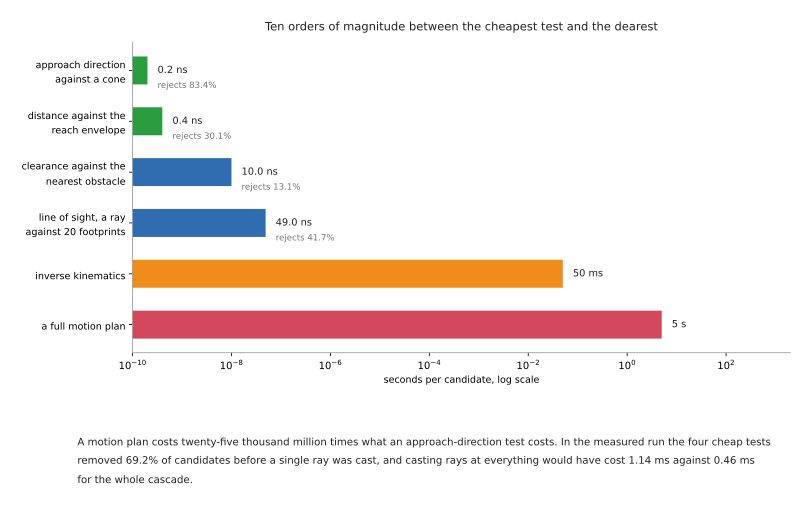

# Reaching and reachability: can the arm get there at all

Before any question about how to move, there is a question about whether the move
exists. This document is about that question, and about the fact that it has four
separate answers rather than one.

It is the most under-documented subject in this area. Motion planning has books,
tutorials and a healthy open-source ecosystem. Reachability has a parameter in a
configuration file and a solver that returns nothing when it fails. A great deal
of real project time is lost here, and almost all of it is lost to failures that
do not announce themselves: a pose that is reachable in one wrist configuration
and not the other, a straight line whose two ends are fine and whose middle is
not, a joint limit that a description file quietly narrowed, and a solver that
said no when it meant "not yet".

This is written for someone who is about to bolt an arm to a table, or has done
so and is now finding that a third of the poses they wanted do not work. It
follows on from [the overview](01_overview.md) and assumes the frames and
transforms of the [arm area](../03_arm/01_overview.md).

## Contents

1. [Four things "reachable" can mean](#1-four-things-reachable-can-mean)
2. [The workspace and its holes](#2-the-workspace-and-its-holes)
3. [Singularities, and what the controller does at one](#3-singularities-and-what-the-controller-does-at-one)
4. [Joint limits, and the range that is not there](#4-joint-limits-and-the-range-that-is-not-there)
5. [Configurations: the eight ways to reach the same pose](#5-configurations-the-eight-ways-to-reach-the-same-pose)
6. [Redundancy, and the seventh joint](#6-redundancy-and-the-seventh-joint)
7. [Where to bolt the arm down](#7-where-to-bolt-the-arm-down)
8. [Finding out before you commit](#8-finding-out-before-you-commit)
9. [Cheap tests before expensive ones](#9-cheap-tests-before-expensive-ones)
10. [The five failures that do not announce themselves](#10-the-five-failures-that-do-not-announce-themselves)

---

## 1. Four things "reachable" can mean

When somebody says a pose is reachable they may mean any of four different
things, and a system can pass three of them and fail the fourth.

**The position is inside the workspace.** The tool centre point can be put at
that point in space by some combination of joint angles. This is the weakest of
the four and it is the one people usually check.

**The position and the orientation are both achievable.** Most positions inside
the workspace can only be reached with the tool pointing in some directions and
not others. The set of positions reachable with *every* orientation is called the
dexterous workspace and it is much smaller than the reachable workspace — for a
typical six-joint arm it is a modest region in the middle, not the whole envelope.

**A joint solution exists that is also collision-free and inside the joint
limits.** Inverse kinematics can return an answer that puts the elbow through the
table. Reachability without a collision check is a statement about geometry, not
about the cell.

**A path exists from where the arm is now to that solution.** This is the one
that is almost never checked and the one that bites. Two configurations can both
be valid while no continuous motion connects them, because getting from one to
the other would mean passing through a joint limit or through the table.

The table below is those four against what tells you the answer. Read it as a
checklist in order: each row assumes the row above it passed.

| The question | What answers it | What it misses |
| --- | --- | --- |
| is the point inside the envelope | arithmetic on the link lengths | orientation, entirely |
| is this full pose achievable | an inverse kinematics solver | collisions, and the joint limits if the solver ignores them |
| is there a valid, collision-free joint solution | the solver plus a planning scene | that reaching it may require passing through something |
| can the arm get there from here | a motion planner, run for real | nothing — but it is the most expensive of the four |

## 2. The workspace and its holes

The reachable workspace is the set of points the tool can be put at. For an arm
whose links are `L1` and `L2` and whose joints have no limits, it is the region
between two spheres: an outer one at `L1 + L2` and an inner one at `|L1 − L2|`.
The inner sphere is a hole, and nothing inside it is reachable at any joint
angle, because the two links cannot fold closer together than the difference in
their lengths.

The [arm area](../03_arm/01_overview.md) builds an arm with `L1 = 3 m` and
`L2 = 2 m`, so its reachable region runs from 1 m to 5 m from the base. The
picture below is that region, with a move whose two ends are comfortably inside
it and whose middle is not.


Both ends of that move sit 4.9 m from the base. Ask for a path in joint space and
one is found immediately: the joints simply rotate from one set of angles to the
other. Ask for a straight line between the same two poses and it fails in the
middle, because the straight line passes 0.851 m from the base and nothing nearer
than 1.0 m exists. A metre and five centimetres of the requested path is outside
the arm's world.

Three things about that are worth stating plainly.

**Checking each pose for reachability does not catch it.** Both poses pass. The
check is on poses and the failure is on the path between them.

**Turning the base does not help.** The hole is a solid of revolution about the
base axis, so it is in the way for every direction the arm might approach from.

**A real six-joint arm has the same hole, and it has a second one that the
two-link arithmetic does not predict.** The wrist joints are offset sideways
from the plane the two long links move in, so the arm cannot put its tool on the
base's own axis of rotation. Taking the UR5e's link offsets from the official
description — 133.3 mm from the forearm to the first wrist joint, and 99.7 mm
from there to the second — and building the transform chain the URDF builds, the
tool flange cannot come closer than **33.6 mm** to the base axis, which is
exactly the difference between those two offsets. Sampling four hundred thousand
random joint configurations reaches 33.7 mm and never closer, which is what a
sampled minimum of an exact 33.6 mm should look like.

Thirty-three millimetres sounds like nothing and behaves like something. It is
the reason an arm cannot point its tool straight down at the spot directly under
its own shoulder, and that spot is exactly where people like to put the part
tray.

The practical consequence is a rule worth adopting early: **put nothing important
in the first fifth of the arm's reach, and nothing important in the last tenth.**
The inner region is the hole, and the outer region is the subject of the next
section.

## 3. Singularities, and what the controller does at one

A singularity is a configuration in which the arm loses the ability to move its
tool in some direction, however fast the joints turn. It is not a fault and not a
collision. It is the geometry running out.

[The one calculation](01_overview.md#5-the-one-calculation-underneath-everything)
gives the condition for the repo's two-link arm exactly: the Jacobian determinant
is `L1 · L2 · sin(q2)`, so the arm is singular when the elbow angle `q2` is zero
or 180 degrees — straight out, or folded back on itself.

The important thing is not the singular point. It is the region around it, and
how expensive that region gets. The chart below holds the tool speed constant at
50 mm/s straight out along the arm's own length, and asks what the elbow has to
do to deliver it.


At 10 mm from full extension the elbow needs 18.5 degrees per second, which is
nothing. At 1 mm it needs 58.5. At a tenth of a millimetre it needs 184.9, and
the official Universal Robots description caps every UR5e joint at 180 degrees
per second. So the last tenth of a millimetre of reach costs more joint speed
than the whole first 190 mm, and on a real arm it is not available at all.

What actually happens on the bench takes one of three forms, depending on what
the controller does when the arithmetic asks for more than it has.

**The arm slows down.** A well-behaved Cartesian controller scales the whole
motion back so no joint exceeds its limit. The tool no longer travels at the
speed you asked for, which is safe and which breaks any process that depends on
speed — welding, dispensing, anything with a flow rate.

**The arm lurches.** A controller that clamps each joint independently produces
a motion that is no longer along the path at all. Near a wrist singularity this
shows up as the wrist spinning rapidly through half a turn while the tool barely
moves.

**The arm faults and stops.** Most industrial controllers refuse, which is the
honest answer and is the one that gets reported as "the robot will not do the
program".

A six-joint arm with a spherical wrist has three families of singularity, and
they need to be recognised by sight because they are diagnosed on the bench more
often than in software.

| Kind | The configuration | What is lost |
| --- | --- | --- |
| shoulder | the wrist centre lies on the axis of joint 1 | motion in the direction perpendicular to the arm's plane; joint 1 would have to turn infinitely fast |
| elbow | the arm is fully extended, or fully folded | motion along the arm's own length, which is the case drawn above |
| wrist | two of the three wrist axes line up | one rotational degree of freedom; the two aligned joints do the same thing, and their difference is undetermined |

The wrist one is the most common in practice and the most surprising, because
nothing about the arm looks extended. It happens whenever the tool points
straight along a wrist axis, which is exactly what happens when you ask an arm to
point straight down at a table — a request that comes up constantly.

**Five situations where a singularity will find you:**

- a straight-line move that reaches for something at the edge of the envelope
- pointing the tool straight down at a table from directly above
- any path you generated by interpolating tool poses without checking the joints
- teaching poses by hand, where a person naturally straightens the arm to reach
- a task that needs a full turn of the tool about its own axis

**Five situations where it will not:**

- joint-space moves between taught poses well inside the envelope
- work confined to a region a third to two thirds of the way out
- a seven-joint arm using its extra freedom to keep the wrist away from alignment
- planning that scores configurations on manipulability, which is a measure of
  how far a configuration is from being singular
- a mounting that puts the work in front of the arm rather than directly above
  or below the base

## 4. Joint limits, and the range that is not there

Joint limits are simple to state and are the source of two of the least obvious
failures in this document.

**A joint that can turn more than a full circle makes the planner's problem
harder, not easier.** Several arms have wrists that travel two full turns. That
means the same tool pose corresponds to several distinct joint values, and the
planner has to decide which. Get it wrong and the arm unwinds its own wrist in
the middle of a task, which is a valid motion and is not what anybody wanted.

**A joint whose real range is divided in two produces a search space that is
divided in two.** This is worth quoting in full, because it is in a file that
thousands of projects load without reading. The official Universal Robots ROS 2
description says this about the UR5e's elbow, in
[config/ur5e/joint_limits.yaml](https://github.com/UniversalRobots/Universal_Robots_ROS2_Description/blob/ros2/config/ur5e/joint_limits.yaml):

> we artificially limit this joint to half its actual joint position limit to
> avoid (MoveIt/OMPL) planning problems, as due to the physical construction of
> the robot, it's impossible to rotate the 'elbow_joint' over more than approx
> +- 1 pi (the shoulder lift joint gets in the way). This leads to planning
> problems as the search space will be divided into two sections, with no
> connections from one to the other.

Read what that says. The joint's nominal limit is plus or minus 360 degrees. Its
physical limit is about plus or minus 180, because the shoulder gets in the way.
If the planner is told the nominal figure it explores a space in two disconnected
halves and behaves badly, so the description file tells it the physical figure
instead. The decision is correct. The consequence is that **half the elbow's
nominal travel is invisible to every planner that loads this file**, and nothing
anywhere reports that.

That is the general shape of the problem. The limits the planner sees come from a
description file, and a description file is a claim about the arm rather than the
arm. Three ways it drifts from the truth:

- a limit narrowed deliberately, as above, for a reason that was true then
- a limit that does not account for the tool, the cable, or the dress pack, all
  of which reduce the real range
- a limit that is right for the joint and wrong for the pair, because two joints
  that are each within range can still collide with each other

**Five things a joint limit stops you doing that are easy to miss:**

- following a circular path that requires the wrist to keep turning the same way
- approaching the same object from two sides without an intervening reset
- executing a taught programme after the tool has been changed for a longer one
- reaching a pose that inverse kinematics found, because the solver was not told
  about the limits
- reversing a path, because the way back can need a joint value the way out did
  not

## 5. Configurations: the eight ways to reach the same pose

For a six-joint arm with a spherical wrist — which is most industrial arms — a
given tool pose generally has **eight** distinct joint solutions. They come from
three independent binary choices.

**Shoulder, left or right.** The arm can reach the same point with the base
turned towards it or turned away from it and reaching backwards over its own
shoulder.

**Elbow, up or down.** The classic pair. Same wrist position, elbow above or
below the line from shoulder to wrist.

**Wrist, flip or no-flip.** The wrist can be turned through half a turn on joints
4 and 6 while joint 5 changes sign, which puts the tool in the same place
pointing the same way.

Two by two by two is eight. Every one of them is a correct answer to "where do I
put the joints", and they are not interchangeable:

- they have different distances to the joint limits
- they have different distances to a singularity
- they collide with different things
- the arm cannot generally get from one to another without passing through a
  singularity, which is the reason it matters

That last point is the one to hold on to. **The eight solutions are not eight
points in a connected space you can slide between.** They are, for practical
purposes, eight separate regions. A path that starts elbow-up and ends elbow-down
has to straighten the arm completely somewhere in the middle, and a planner will
either refuse or produce a motion that alarms whoever is watching.

This is where an early choice makes a later step impossible, and it is worth
being concrete. Suppose a pick-and-place: reach into a bin, grasp a part, place
it in a fixture. The grasp is chosen first, because the part's pose decides it.
That grasp has eight joint solutions and the planner picks one — usually the one
nearest the current configuration, which is a reasonable default and is not a
decision anybody made. Now the place pose is planned, and from that
configuration the only solutions for the place are on the other side of a joint
limit. The place fails. Nothing was wrong with the grasp, nothing was wrong with
the place, and the error message will be about the place.

The fix is in [section 9 of planning a path](03_planning-a-path.md#9-planning-the-whole-task-as-one-thing),
and it is not a framework. It is to solve the whole chain before committing to
the first step of it.

**Five jobs where configuration choice is the whole problem:**

- any task with a fixed approach direction, such as inserting into a machine
- palletising, where the same motion repeats at many positions and must not flip
  configuration halfway across the pallet
- a cell with a wall or a fence on one side, which makes one shoulder solution
  illegal everywhere
- bin picking, where the grasp pose varies and the configuration must not
- any task where a person watches, because a configuration flip looks exactly
  like a malfunction

**Five jobs where it does not matter:**

- a single move between two taught poses in the middle of the envelope
- work on a small, flat region where all eight solutions are far from limits
- a seven-joint arm with a null-space policy, which handles it continuously
- teaching and replay, where the configuration is recorded along with the pose
- simulation with no joint limits modelled, which is why the problem is usually
  discovered on hardware

## 6. Redundancy, and the seventh joint

Six numbers describe a pose: three for position, three for orientation. An arm
with six joints has exactly enough freedom to hit a pose, and generally a finite
number of ways to do it. An arm with seven joints has one more than it needs, and
therefore an infinite family of joint solutions for the same tool pose — a
continuous one-dimensional set you can slide along without the tool moving at
all. That set is called the null space, and sliding along it is usually described
as the elbow swinging round while the hand stays put.

What the extra joint buys you:

- it can hold the tool still while moving the elbow out of the way of an obstacle
- it can hold the tool still while moving away from a joint limit
- it can hold the tool still while moving away from a singularity
- it can serve a secondary objective continuously, rather than by choosing
  between eight discrete options
- it makes a configuration flip unnecessary, because there is a continuous route
  between solutions that a six-joint arm would have to jump between

What it costs:

- inverse kinematics no longer has a closed-form answer, so you are solving
  numerically and the solution depends on where you started
- the null-space policy becomes part of your system, and a policy nobody chose is
  still a policy
- repeatability of the *configuration* is lost: the same tool pose commanded
  twice can give two different arm shapes, which matters near obstacles
- a joint more is a motor more, a brake more, and a failure mode more
- it is harder to explain to anybody signing off the cell

Seven-joint arms include the Franka research arms and Kinova's Gen3. Six-joint
arms include the whole Universal Robots range and most of what is installed in
factories. The choice is not about capability in the abstract; it is about
whether your cell has obstacles the arm has to reach past.

## 7. Where to bolt the arm down

This is the cheapest decision in the whole area and the most expensive to reverse.
It is usually made by whoever built the bench.

Four things the mounting decides, in rough order of how often they are
overlooked.

**How much of the workspace is usable.** Bolt the arm in the middle of a table
and the region directly above the base — the hole from section 2 — sits over the
most convenient part of the table. Mount it at the edge, facing in, and the hole
is off the table.

**Whether the arm can reach a pose in a good configuration or only a bad one.**
The same point can be well inside the dexterous region for one mounting and right
at the singular edge for another. Moving the base 150 mm is often the difference
between a task that works and a task that needs a seven-joint arm.

**What the arm collides with.** An arm mounted upright collides with its own
table when reaching low. An arm mounted on a wall or inverted on a frame does
not, which is why so many production cells hang the arm upside down.

**Gravity, and therefore payload and force control.** An inverted arm carries its
own weight differently, and its gravity compensation model must know which way up
it is. This is a configuration item, and getting it wrong shows up as an arm that
drifts when you enable compliance.

The table below is the three usual mountings against what each is for. Read the
last column as the reason people regret it.

| Mounting | Suits | Regretted because |
| --- | --- | --- |
| upright on a bench | most table-top work, teaching, anything a person stands beside | the hole sits over the best part of the bench, and reaching low means reaching around the base |
| inverted on a frame | dense cells, machine tending, anything needing reach down onto a surface | everything is harder to reach by hand, and the frame is in the way of a person |
| on a wall or a pillar | long reaches across a bench, keeping the bench clear | the reachable region is a half-space, so half the eight configurations are unavailable everywhere |

One further point that is specific enough to be worth naming. **Deciding the
mounting requires knowing the task poses, and deciding the task poses requires
knowing the mounting.** The way out is to compute a reachability map for two or
three candidate mountings before anything is bolted to anything, which is the
subject of the next section and takes an afternoon.

## 8. Finding out before you commit

There are four levels of answer here and they cost wildly different amounts. Take
the cheapest one that settles your question.

**Arithmetic on the link lengths.** The inner and outer radii, worked out by
hand. Costs nothing, answers only the crudest question, and rules out more bad
layouts than people expect.

**Inverse kinematics on every pose you care about.** Write the list of poses the
task needs, ask the solver for each, and count the failures. Costs an hour and
answers the second and third of the four questions in section 1. This is the
step most projects skip and it is the one with the best return.

**A reachability map.** Sample the volume in front of the arm on a grid, try many
orientations at each point, and record what fraction succeeded. The result is a
picture of where the arm is genuinely comfortable, and it makes the mounting
decision for you.
[reach](https://github.com/ros-industrial/reach), from ROS-Industrial, is the
maintained tool for this and is Apache-2.0. It was last pushed in March 2025, so
it is stable rather than active. The older and better-known
[Reuleaux](https://github.com/ros-industrial-consortium/reuleaux) has been moved
into ROS-Industrial's attic, was last touched in July 2024, and carries no
licence file at all, which under default copyright means no permission to use it
for anything. It is worth knowing the name because papers cite it, and it is not
worth building on.

**Running the planner.** The only thing that answers the fourth question. Costs
the most and is the only honest test of "can the arm get there from here".

### 8.1 The solver's answer is weaker than it looks

One detail matters more than everything else in this section, because it makes
the second and third levels above unreliable if you take them at face value.

MoveIt's default inverse kinematics solver is KDL, which is iterative. It starts
from a seed, steps towards the goal, and gives up when it runs out of time. The
time it is given is the `kinematics_solver_timeout` parameter, and its default
value in MoveIt is **0.05 seconds**.

So when a reachability check reports a pose as unreachable, what it has actually
established is: *no solution was found within 50 ms, starting from the seeds this
run happened to try.* That is not the same statement as "no solution exists", and
the two are reported identically. Poses near the edge of the workspace, and poses
that need an unusual configuration, are exactly the ones a seeded iterative
solver is worst at, and they are exactly the ones you are testing.

Three practical responses:

- raise the timeout when you are surveying rather than executing; 50 ms is a
  runtime figure, not a survey figure
- retry from several seeds and count how many succeed, which turns a yes-or-no
  answer into a measure of how marginal the pose is
- use a solver with a different failure mode when it matters.
  [TRAC-IK](https://github.com/traclabs/trac_ik) (BSD-3) exists because KDL fails
  on poses that have solutions, and it runs two methods in parallel and takes
  whichever answers first. [pick_ik](https://github.com/PickNikRobotics/pick_ik)
  (BSD-3) is the maintained modern alternative inside MoveIt and is under active
  development.

## 9. Cheap tests before expensive ones

Section 8 put four ways of answering the reachability question in order of what
they cost. Section 8.1 then showed that the expensive answer is also the least
trustworthy one, because "unreachable" turned out to mean "not found in fifty
milliseconds". Both of those are cases of a more general idea, and the general
idea is worth stating on its own, because it changes the shape of the code
rather than one parameter in it.

**A planner charges you the same whether the answer is yes or no.** Every
request costs milliseconds or seconds, and a request that fails costs the most,
because a planner that cannot find a route spends its whole time budget
discovering that. Meanwhile most of the candidate poses a real system produces
can be thrown away by arithmetic that costs nanoseconds. So the rule is to put
your tests in order of what they cost, run the cheap ones first, and never ask
an expensive question about a candidate that a cheap question could have
rejected.

### 9.1 The order, and what each test costs

The table below is that order, cheapest first. The second column is what one
candidate pose costs. The first four figures are measured: a loop over two
million candidates written in C, compiled with `cc -O2` on an Apple M4, with
twenty obstacles in the scene for the two tests that need them. They are
per-candidate costs inside a batch, which is how a filter is actually run. The
last two figures are not measurements but budgets — the default time MoveIt
allows one call before it gives up — because what you must plan against is the
failing call that uses all of it. Read the last column as the reason the row
below it still has to exist.

| Test | Cost per candidate | What it rules out | What it cannot see |
| --- | --- | --- | --- |
| approach direction, against the cone the task allows | 0.2 ns | grasps that come in from a direction the task forbids | whether the arm can achieve that direction at that place |
| distance from the shoulder, against the reach envelope | 0.4 ns | points no joint configuration can put the tool at | orientation, obstacles, and everything else |
| clearance, distance to the nearest obstacle | 10 ns | poses with no room for the gripper's own body | contact along the approach, and the arm's own links |
| line of sight, a ray against the known obstacles | 49 ns | viewpoints from which the target is hidden | anything the world model does not contain |
| inverse kinematics | up to 50 ms | poses with no joint solution | collisions, unless a planning scene is attached |
| a motion plan | up to 5 s | goals with no route from where the arm is now | nothing |

The two ends of that order are ten orders of magnitude apart. Fifty
milliseconds of inverse kinematics is 125 million times the 0.4 nanoseconds of
the reach test. Five seconds of planning is 102 million times the 49
nanoseconds of a ray cast, and 25 thousand million times the 0.2 nanoseconds of
the approach cone. Put the other way round: in the time one failing planning
request takes, the reach test can be run on about twelve thousand million
candidates.

Those figures come from one machine and one compiler, and a single isolated
call costs more than a call inside a loop. None of that matters, because the
decision they support only needs the orders of magnitude to be right, and ten
orders of magnitude survive any amount of measurement error.

One refinement changes the order in some scenes. The right thing to sort by is
not cost on its own but cost divided by the fraction of candidates the test
rejects, smallest first, because a test that costs twice as much and rejects
five times as many candidates should go earlier rather than later. In the run
above, the approach cone rejected 83.4 per cent of candidates, the reach test
30.1 per cent, the ray cast 41.7 per cent and the clearance test 13.1 per cent.
Dividing through gives 0.24, 1.3, 118 and 76 nanoseconds per rejection, which
is the same order that cost alone gives. That is a coincidence of these
particular numbers and not a rule, so measure your own rejection rates before
deciding you have the order right.




### 9.2 Reach as arithmetic

An **annulus** is the region between two circles that share a centre. Its
three-dimensional version, the region between two spheres that share a centre,
is what section 2 showed the reachable region to be for a two-link arm. Testing
a point against one is three subtractions, three multiplications, two additions
and two comparisons.

```
dx = p.x - shoulder.x
dy = p.y - shoulder.y
dz = p.z - shoulder.z
d2 = dx*dx + dy*dy + dz*dz          # squared, so there is no square root

reject if d2 < r_min_squared or d2 > r_max_squared
```

The two squared radii are computed once, when the arm is chosen, and never
again. The absence of the square root is the reason this costs less than a
nanosecond.

The radii come from the arm's published dimensions. Taking the UR5e's official
ROS 2 description again, this time
[config/ur5e/default_kinematics.yaml](https://github.com/UniversalRobots/Universal_Robots_ROS2_Description/blob/ros2/config/ur5e/default_kinematics.yaml),
the upper arm is 425 mm, the forearm is 392.2 mm, and the three offsets below
the forearm are 133.3 mm, 99.7 mm and 99.6 mm. Sampling four hundred thousand
random joint configurations puts the tool flange between 33.8 mm and 968.8 mm
from the shoulder point.

Do not use the sampled maximum as `r_max`. A sampled maximum is always an
underestimate, and a test built on it will reject poses the arm can reach. The
figure that is safe is the sum of every offset below the shoulder, because no
chain of links can put its end further away than the sum of their lengths, and
`425 + 392.2 + 133.3 + 99.7 + 99.6` comes to 1149.8 mm. That is 181 mm larger than
the sampled envelope, so it rejects fewer candidates, and every candidate it
does reject is genuinely out of reach. Use the sum when the filter must never
be wrong, and use a measured envelope from a reachability map — section 8's
third level — when you have built one and can defend it.

How much work the test does depends entirely on where the candidates come from,
and the difference is larger than people expect. The table below takes the same
annulus, with `r_min` of 33.6 mm from section 2 and `r_max` of 968.8 mm, and
applies it to a million points drawn uniformly from four different regions.
Read it as a warning against assuming the test is doing work it is not doing.

| Where the candidate positions come from | Fraction the reach test rejects |
| --- | --- |
| a 2.0 by 2.0 by 0.6 m cell centred on the arm | 30.1 per cent |
| a 2.0 by 1.6 by 0.6 m area in front of the arm | 56.3 per cent |
| a 1.2 by 0.8 by 0.3 m bench in front of the arm | 0.3 per cent |
| a 0.3 m bin standing 0.5 m from the base | 0.0 per cent |

A filter that rejects nothing is still worth keeping at 0.4 nanoseconds, but it
is not the thing protecting your cycle time, and believing otherwise is how a
pipeline ends up with no protection at all.

Two limits on the test are worth naming. The reachable set is not really an
annulus: section 2 showed the UR5e has a second hole, 33.6 mm wide, around its
own base axis, and a radial test from the shoulder does not model that at all.
And passing the test says nothing about orientation. The dexterous workspace
from section 1 — the positions reachable with every tool direction — is a much
smaller region inside the same annulus, so a point can pass the reach test and
still have no solution with the direction the task requires.

### 9.3 Line of sight is a precondition, not a difficulty

A **ray cast** is the test of whether the straight line from one point to
another passes through anything. For a camera looking at a grasp, the two
points are the lens and the target, and the things in the way are the objects
the perception system has already found. Testing the segment against a circular
footprint is a projection, a clamp and one comparison of squared distances, and
twenty of them came to 49 nanoseconds above. For a full three-dimensional
occupancy map, [OctoMap](https://github.com/OctoMap/octomap) provides the same
test, as a method called `castRay`, and its library is under the three-clause
BSD licence, read from `octomap/LICENSE.txt` in the repository.

Choosing viewpoints properly is a subject of its own, and [choosing where to
look](../06_object-perception/09_choosing-where-to-look.md) in the perception
area treats it as one. The point that belongs here is narrower and is about
movement.

**Visibility and reachability are independent filters, and both are cheaper
than planning.** A viewpoint can be comfortably inside the arm's envelope and
see nothing, because a box is in the way. A viewpoint with a completely clear
view of the target can be outside the envelope entirely, or inside it and only
reachable in a configuration that puts the elbow through the bench. Neither
test predicts the other, so neither can be skipped, and running both still
costs about fifty nanoseconds against a planner call's milliseconds. The
mistake this prevents is the common one of treating occlusion as something the
planner will sort out. It will not. It will plan a perfectly good motion to a
pose from which the camera sees a box.

### 9.4 Clearance is a precondition too

Clearance is the free space a gripper needs around the object before its
fingers can close on it, and how much it needs follows from the jaw geometry.
The gripping area derives that properly in [choosing a
grip](../07_gripping/03_choosing-a-grip.md), which is where the numbers belong.
The movement-side point is that the derived figure is a distance, and a
distance can be tested against a scene by arithmetic, long before anything is
asked to plan.

The test is the same shape as the reach test: for each obstacle, compare the
squared distance from the grasp point to the obstacle against the squared sum
of the obstacle's radius and the clearance the gripper needs. Twenty obstacles
came to 10 nanoseconds above.

**A pipeline that collision-checks only the final pose will miss this.** The
closed grasp pose is a pose in which the fingers are around the object and
touching nothing, so it passes. What fails is the open gripper arriving: the
jaws are wider apart on the way in than they are at the end, and the last
hundred millimetres of the approach sweeps a volume that the final pose does
not occupy. Checking the goal and not the approach is one of the reasons a
grasp that looked fine in simulation knocks its neighbour over on the bench.

When you do want the exact answer rather than the cheap one,
[FCL](https://github.com/flexible-collision-library/fcl) is the library
MoveIt's default collision checking is built on. It answers distance queries as
well as collision queries, and a distance query is what clearance needs. It is
under the three-clause BSD licence, read from its `LICENSE` file.

### 9.5 What the cheap tests cannot tell you

They fail in two directions and the two are not equally dangerous.

**A conservative bound produces false negatives, and they are silent.** The
1149.8 mm figure above is correct and loose. Any candidate it rejects is
genuinely unreachable, but a tighter bound you cannot prove would have rejected
more, and a looser one rejects fewer. The cost of getting this wrong in the
safe direction is work you did not need to do. The cost of getting it wrong in
the other direction is a rejected candidate that was fine, never looked at
again, and never reported, because a filter that discards a candidate writes
nothing anywhere.

**An incomplete world model produces false positives, and those are the ones
that break things.** Every test in this section is a test against a model of
the scene, not against the scene. The model does not contain the cable, the
clamp somebody left on the bench, the second object that moved after the last
camera frame, or the operator's hand. A candidate that passes every cheap test
and then collides is a candidate the model said was fine, and no amount of
making the tests cheaper or faster addresses that.

The rule that follows is short. **Write the cheap tests so they can only ever
reject.** A rejection from a sound bound is a real answer. An acceptance is not
an answer at all; it is permission to ask the next, more expensive question.
The cheap tests raise how many candidates you can consider. They do not replace
the collision check on the trajectory that is actually going to be executed,
and a system that treats them as though they do has moved its failures from the
planner, where they were reported, to the hardware, where they are not.

### 9.6 A worked ordering

A candidate grasp pose arrives from whatever produced it — a grasp sampler, a
model, a taught list — and passes through the filters in cost order. The cost
against each line is per candidate, measured for the cheap ones and budgeted
for the expensive ones, as in the table above.

```
# one candidate grasp pose, filtered cheapest test first

# 0.2 ns: approaching from a direction the task forbids
if dot(candidate.approach_axis, task.required_axis) < cos(task.tolerance):
    reject

# 0.4 ns: outside the reach envelope
dx, dy, dz = candidate.position - arm.shoulder_point
if not (r_min_squared <= dx*dx + dy*dy + dz*dz <= r_max_squared):
    reject

# 10 ns for twenty obstacles: no room for the gripper's own body
for each obstacle in scene:
    need = obstacle.radius + jaw_clearance
    if squared_distance(candidate.position, obstacle) < need*need:
        reject

# 49 ns: the grasp cannot be seen from where the camera is
if ray_hits_anything(camera.position, candidate.position, scene):
    reject

# 49 ns: the approach itself is blocked
if ray_hits_anything(candidate.approach_start, candidate.position, scene):
    reject

# up to 50 ms: no joint solution was found, which is not the same
# as none existing -- section 8.1
q = inverse_kinematics(candidate.pose,
                       seed  = arm.current_joints,
                       valid = not colliding in the planning scene)
if q is None:
    reject

# up to 5 s: no route from where the arm is now. This is the call
# every line above it exists to avoid making.
plan = motion_plan(arm.current_joints, q)
if plan is None:
    reject

return plan
```

Three things in that sequence are the reason for writing it out rather than
describing it.

**The clearance test comes before both ray casts, and that is deliberate.** A
ray cast costs 49 nanoseconds and the clearance test costs 10, so putting the
clearance test first means the two rays are only run on candidates that already
have room for the gripper. Here that saves a few tens of nanoseconds and
nothing else. It is worth doing anyway, because it is the same reasoning that
saves seconds when applied to the bottom two lines.

**The collision check happens inside the inverse kinematics call.** MoveIt
takes a validity callback, so the solver rejects a colliding solution and keeps
searching instead of returning one you then have to discard. The second and
third questions in section 1's table are answered by one call, and that call
was going to be made anyway.

**The last two lines carry almost all of the cost and they are the only two
that answer the question.** Everything above them is a way of reaching them
less often. Nothing above them can tell you a path exists, and if a candidate
reaches the bottom of the list and fails there, no cheap test was wrong — none
of them ever claimed it would work.

**Five jobs this approach suits:**

- bin picking, where a grasp sampler produces hundreds of candidates per camera
  frame and there is time to plan for perhaps three of them
- deciding where to stand a mobile base, or where to bolt a fixed one, which is
  a search over hundreds of base positions with every task pose to check at
  each
- deciding which of several objects on a table to reach for first, where most
  of the answer is which ones are reachable and visible at all
- choosing where to move a wrist camera, where a large majority of candidate
  viewpoints are either blind or out of the envelope
- any cell with a cycle-time budget, where the planner gets one attempt and a
  failed attempt spends the budget without producing anything

**Five jobs it cannot do:**

- tell you a path exists, which is the fourth question in section 1 and which
  only a planner run for real answers
- see anything the world model does not contain, which is where the failures
  that hurt come from
- choose between two candidates that both pass, because a filter sorts nothing
  and every survivor looks identical to it
- catch the failure in section 2, where both ends of a move pass every test and
  the middle of it is outside the workspace
- replace the collision check on the trajectory that will actually run, which
  stays exactly where it was

## 10. The five failures that do not announce themselves

Collected here because they are the return on reading this document.

**The straight line between two reachable poses is not reachable.** Section 2.
Both ends check out; the middle does not. Nothing in a per-pose check can see it.

**"Unreachable" means "not found in 50 milliseconds".** Section 8.1. A survey
built on the runtime default will mark good poses as bad, and the marginal poses
are the ones it gets wrong.

**The joint limits in the description are not the joint limits of the arm.**
Section 4. The UR5e's elbow is deliberately halved in the file everybody loads.
The decision is right; the silence about it is the problem.

**The grasp you chose decided the configuration, and the configuration decided
that the place is impossible.** Section 5. Both plans succeed on their own. The
failure appears at the second step and was caused by the first.

**The dexterous workspace is much smaller than the workspace, and every
tutorial's example pose is in the middle of it.** Section 1. A task developed on
poses 400 mm in front of the arm will work. The same task at 700 mm, with the
tool pointing sideways, may have no solution at all, and the first symptom will
be a planner that times out rather than a message about orientation.

Next: [planning a path](03_planning-a-path.md), which assumes the goal is
reachable and asks how to get to it. Or back to
[the overview](01_overview.md).
