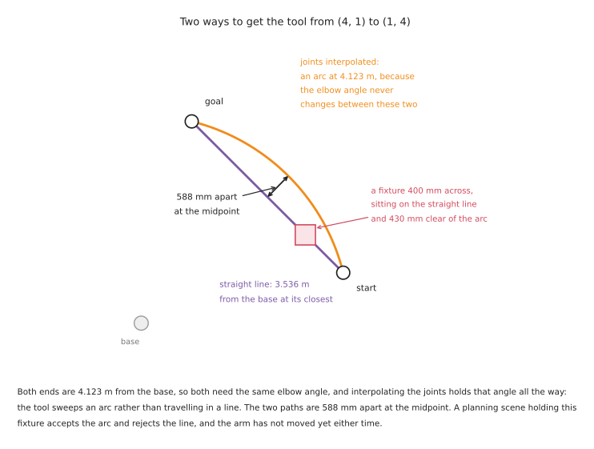

# Planning a path

The goal is reachable. Now something has to work out a route to it that does not
hit anything. This document is about the methods that do that, what each one
costs, and the several ways a planner can succeed and still leave you worse off.

It assumes [reaching and reachability](02_reaching-and-reachability.md), because
a planner asked for an unreachable goal spends its whole budget failing and then
tells you nothing about why. It does not repeat
[the tools document](../09_tools-and-libraries.md#5-moveit-2-planning-a-safe-path),
which shows how to call MoveIt, or the
[map of planner families](../10_one-arm-training/02_programmed-methods.md#4-motion-planning)
in the one-arm training area. This is the practice: which family for which job,
what the defaults actually do, and the failures that look like successes.

## Contents

1. [What the planner is actually searching](#1-what-the-planner-is-actually-searching)
2. [Sampling-based planners](#2-sampling-based-planners)
3. [Optimisation-based planners](#3-optimisation-based-planners)
4. [Computed industrial motion, which is not planning](#4-computed-industrial-motion-which-is-not-planning)
5. [Cartesian paths, and what they are not](#5-cartesian-paths-and-what-they-are-not)
6. [Planning on a graphics card, and replanning continuously](#6-planning-on-a-graphics-card-and-replanning-continuously)
7. [The planning scene, and what collision checking really checks](#7-the-planning-scene-and-what-collision-checking-really-checks)
8. [Turning a path into a trajectory](#8-turning-a-path-into-a-trajectory)
9. [Planning the whole task as one thing](#9-planning-the-whole-task-as-one-thing)
10. [When planning is the wrong tool](#10-when-planning-is-the-wrong-tool)

---

## 1. What the planner is actually searching

A planner does not search the space the arm moves through. It searches the space
of joint angles, which has one dimension per joint, and this is the single fact
that explains everything else about how planners behave.

A six-joint arm has a six-dimensional configuration space. Every obstacle in the
room carves a forbidden region out of that space, and those regions have no
simple description at all: a plain rectangular box on a table becomes, once
translated into joint angles, a shape nobody could draw. So planners do not
describe the free space. They probe it, one configuration at a time, asking the
collision checker "is this one all right" and building an answer out of the
replies.

Two consequences follow, and both explain complaints people make about planners.

**The planner's world is the planning scene and nothing else.** It cannot avoid
what it was not told about. Section 7 is about the ways the scene differs from
the room.

**A path that looks sensible in joint space need not look sensible in the room.**
Interpolating between two joint configurations moves every joint at a steady
rate, and the tool traces whatever curve that produces. The picture below is two
poses on the repo's own arm, joined both ways.

Both poses sit 4.123 m from the base, so both need the same elbow angle.
Interpolating the joints holds that angle the whole way, and the tool sweeps an
arc 588 mm outside the straight line between the two poses. Neither path is
wrong. They are answers to different questions, and if you did not say which
question you were asking, you got whichever one your library defaults to.

## 2. Sampling-based planners

**What they are.** Throw random joint configurations at the space, discard the
ones that collide, and connect the survivors until a route from start to goal
appears. The family is named after how it builds the connections.

**RRT**, the rapidly-exploring random tree, grows a tree from the start
configuration towards random samples. **RRT-Connect** grows two trees, one from
each end, and tries to join them; it is much faster than plain RRT and it is
what MoveIt uses when nothing else is configured — the OMPL interface falls back
to `geometric::RRTConnect` when no `default_planner_config` is named. **PRM**,
the probabilistic roadmap, builds a reusable graph of the free space in advance
and then answers many queries against it. **RRT\*** and **PRM\*** are the
asymptotically optimal versions: given more time they converge on the shortest
path rather than merely a path.

**What they cost.** The path is usually ugly, wandering off on detours that have
to be smoothed out afterwards. And it is different every run, which is not a bug
to be fixed but the method working as designed.

**Why these rather than an optimiser.** They are very good at finding a route
through an awkward space where an optimiser would get stuck. If the arm has to
reach past a fixture into a bin, or thread between two obstacles, a sampler will
eventually find the way and a gradient-based method may never.

Five jobs they suit:

- bin picking, where the reach into the bin is different every cycle
- any move whose start or goal came from perception rather than from a teach
  pendant
- cluttered cells where the free space is genuinely awkward
- getting a first working motion quickly, before anyone has decided what the
  motion should look like
- a one-off move to recover from a fault, where "any valid path" is the whole
  requirement

Five jobs they cannot do:

- anything that has to be identical every run, because they are random by
  construction and a smoothing pass does not remove that
- anything you have to certify, for the same reason
- producing a straight line, or any other shape you have in mind
- a hard real-time budget, because the time to find a path is unbounded; a
  sampler that usually answers in 50 ms will occasionally take a second
- telling you *why* it failed. A timeout and an unreachable goal and a start
  state in collision all look the same from outside

[OMPL](https://github.com/ompl/ompl) is the reference implementation, BSD-3, and
is what MoveIt calls. It was last pushed in September 2026 and is healthy.

## 3. Optimisation-based planners

**What they are.** Start from a guess at the whole path — usually a straight line
in joint space that goes through every obstacle — and then push it away from the
obstacles while keeping it short and smooth. The output is an entire trajectory
refined as a unit rather than a route discovered a sample at a time.

**CHOMP** does gradient descent on a cost made of an obstacle term and a
smoothness term. **STOMP** does the same job without needing gradients, by
sampling noisy variations of the current path and taking a weighted average of the
better ones, which lets it handle costs that are not differentiable. **TrajOpt**
formulates it as sequential convex optimisation with explicit constraints. All
three are available in ROS 2: MoveIt ships
[CHOMP](https://github.com/moveit/moveit2/tree/main/moveit_planners/chomp) and
[STOMP](https://github.com/moveit/moveit2/tree/main/moveit_planners/stomp) as
planner plugins, and
[tesseract_planning](https://github.com/tesseract-robotics/tesseract_planning)
carries a maintained TrajOpt.

**What they cost.** They get stuck. Because they descend a cost, they find the
best path near the one they started from, and if the straight-line guess is on
the wrong side of an obstacle they will push it into a local minimum and report
failure on a problem a sampler would have solved. They also need the obstacle
cost to have a gradient, which means a distance field, which means computing one.

**Why these rather than a sampler.** The path is smooth and short without a
separate smoothing pass, and the same problem gives the same answer, which is the
property samplers cannot offer at any price.

Five jobs they suit:

- a repeated motion in a fixed cell, where you want the same path every cycle
- paths that should stay away from obstacles rather than merely miss them, which
  the obstacle cost gives you directly
- anything with an extra objective to trade off, such as keeping the tool level
  or staying away from joint limits
- warm-starting from the previous cycle's answer, which makes repeated planning
  in a slowly changing scene very fast
- generating a path a person will look at, because the output is smooth

Five jobs they cannot do:

- thread through a narrow gap that the initial guess was on the wrong side of
- explore a space with disconnected free regions, which is what section 4 of
  [reaching and reachability](02_reaching-and-reachability.md#4-joint-limits-and-the-range-that-is-not-there)
  shows a wide joint limit producing
- guarantee to find a path when one exists, which samplers do given enough time
- work without a distance field, which costs memory and update time
- handle a goal expressed as a region rather than a point, without extra work

## 4. Computed industrial motion, which is not planning

This is the family learners consistently miss and industry uses constantly. Most
installed arms do not plan. They execute point-to-point, linear and circular
motions between taught poses, computed deterministically, following a speed
profile the controller guarantees.

In ROS 2 this is the
[Pilz industrial motion planner](https://github.com/moveit/moveit2/tree/main/moveit_planners/pilz_industrial_motion_planner),
which ships inside MoveIt under the same BSD-3 licence. It provides three
commands, and they are the same three every industrial teach pendant has had for
thirty years:

- **PTP**, point to point, moves every joint from its start value to its goal
  value on a synchronised profile. The tool traces whatever curve results. It is
  the fastest way between two poses and the shape of the path is not controlled.
- **LIN** moves the tool along a straight line.
- **CIRC** moves the tool along a circular arc through a given intermediate
  point.

Pilz's default configuration names PTP as the default command, and it ships a
sequence action that plans a chain of these commands as one request with blending
between them — which matters for section 9.

Five jobs it suits:

- any cell that has to be validated, because the motion is deterministic and can
  be stated in advance
- palletising and machine tending, where the poses are taught and the geometry is
  arithmetic
- welding, dispensing and any process where speed along the path is part of the
  specification
- teaching by hand, because what you teach is exactly what you get
- a cell where an operator has to be able to predict where the arm will be

Five jobs it cannot do:

- avoid an obstacle it was not taught around — there is no collision search at
  all, and avoiding things is your job when you choose the poses
- cope with a goal that moves between runs, unless every pose is recomputed
- reach into clutter
- find a route through a space where the straight answer is blocked
- recover from a failure by trying a different way round

## 5. Cartesian paths, and what they are not

Asking for a straight line looks like a smaller request than asking for a plan.
It is a larger one, and the interface that serves it is the most misused in
MoveIt.

**What it does.** `computeCartesianPath` steps the tool along the requested line
in small increments, solves inverse kinematics at each step, and strings the
results together. It is interpolation with an IK call inside the loop.

**What it is not.** It is not a planner. It does not search. If a step has no IK
solution, or the solution jumps discontinuously from the last one, the path stops
there. It does not back up and try another way, because there is no other way to
try — the line was the specification.

**And it reports partial success as success.** The function returns a fraction:
how much of the requested path it managed. The
[header in MoveIt's source](https://github.com/moveit/moveit2/blob/main/moveit_core/robot_state/include/moveit/robot_state/cartesian_interpolator.hpp)
says it plainly — in case of IK failure, the computation stops and the value
returned corresponds to the distance that was achieved. There is no exception, no
error code, and nothing in the returned trajectory marks it as truncated. Code
that ignores the fraction executes a partial motion and leaves the arm stopped
part-way along the line, in a position that is perfectly valid and completely
wrong.

**This is where the workspace hole from
[section 2 of reaching and reachability](02_reaching-and-reachability.md#2-the-workspace-and-its-holes)
comes back.** Both endpoints check out; the line between them leaves the
reachable region; the fraction comes back as 0.4; the arm moves 40 per cent of
the way and stops. Every part of that is the library doing what it says.

The rule is short. **Always read the fraction, and decide what fraction is
acceptable before you see it.** Anything below one means the move you asked for
does not exist, and executing part of it is almost never what you want.

Five jobs a Cartesian path suits:

- approach and retreat, the short straight segments either side of a grasp
- lifting a filled container straight up so its contents stay level
- following a seam, an edge or a surface whose geometry you know
- moving through a gap where only one direction of travel fits
- any motion an operator has to be able to predict by eye

Five jobs it cannot do:

- get round an obstacle, because it will not deviate from the line
- cross a singularity, which is where the IK jumps and the path is cut short
- span the workspace, because a long line is far more likely to leave the
  reachable region than either of its ends is
- change the arm's configuration, since flipping the elbow needs a discontinuity
  the interpolator rejects
- report its own failure in a way that a caller cannot ignore

## 6. Planning on a graphics card, and replanning continuously

Planning fast enough to run every control cycle turns the planner from something
that produces a path into something that produces a reaction, which is a
different capability rather than a faster version of the old one. The way this is
done is to evaluate thousands of candidate trajectories in parallel on a graphics
card.

[cuRobo](https://github.com/NVlabs/curobo) is the implementation people mean.
Its licence is **Apache-2.0**, read from the repository's own LICENSE file, which
is worth saying because NVIDIA research code is very often released under a
non-commercial licence and this one is not. It provides parallel inverse
kinematics, parallel collision checking and trajectory optimisation, and its
README describes it as built on PyTorch, CUDA and Warp.

That last clause is the whole platform answer. **cuRobo requires CUDA, so it does
not run on an Apple Silicon Mac at all**, with no CPU fallback.

Five jobs it suits:

- an arm working alongside a person or a conveyor, where the obstacles move
- reactive grasping, where the object is being tracked rather than measured once
- generating large numbers of motions for training data or for evaluation
- solving inverse kinematics for thousands of candidate grasps at once, to pick
  the one with the best arm configuration
- any situation where a plan computed 200 ms ago is already out of date

Five jobs it cannot do:

- run without an NVIDIA graphics card
- give you the same answer every run, which the optimiser's warm start makes
  likelier but does not guarantee
- remove the need for a controller that behaves well on contact
- replace teaching in a fixtured cell, where nothing it offers is needed
- make a bad planning scene into a good one, which is the next section

## 7. The planning scene, and what collision checking really checks

The planning scene is the planner's entire model of the world: the arm, the
objects attached to it, the table, and whatever the depth camera has reported as
occupied. Collision checking is a query against that model. Everything in this
section is about the gap between the model and the room.

### 7.1 The default clearance is zero

MoveIt's planning scene monitor reads four padding parameters —
`default_robot_padding`, `default_robot_scale`, `default_object_padding` and
`default_attached_padding` — and its defaults are `0.0`, `1.0`, `0.0` and `0.0`.

So out of the box the planner will accept a path in which the gripper touches the
table with zero clearance, because zero clearance is not a collision. Add the
arm's own positioning error from
[section 6 of the overview](01_overview.md#6-where-the-millimetres-go), and a
path the planner called valid is one the arm can execute into the table.

Padding is the fix and it is one line of configuration. The reason to set it
deliberately is that padding too generously makes narrow gaps unplannable, so the
number is a decision rather than a default.

### 7.2 Collisions are checked at sampled points, not continuously

A sampling planner checks an edge between two configurations by testing points
along it. How close together those points are is set by
`longest_valid_segment_fraction`, and OMPL's default, as MoveIt's source records,
is `0.01` — one hundredth of the whole joint space's extent. On an arm with wide
joint limits that is on the order of ten degrees of joint motion between checks.
That figure is an order of magnitude rather than a measurement, because the
extent depends on how the state space weights each joint, and the point does not
need a precise value.

Anything thinner than the swept volume of ten degrees of motion can pass between
two checks unnoticed. The planner will happily return a path through a plate, a
fence post or a thin fixture. This is not a rare pathology: MoveIt's own test
configuration for the Pilz PRBT arm sets the value to `0.005` rather than
relying on the default, which tells you what practitioners do.

### 7.3 The object in the gripper is part of the arm

Once the gripper closes on something, that something moves with the arm and can
collide with the world. MoveIt models this by *attaching* the object to a link,
at which point it is checked against the environment and stops being checked
against the gripper that is holding it.

Forget the attach and the planner cheerfully plans a path that drags the held
part through the table, because as far as it is concerned the part is still
sitting where it was. Forget the *detach* after release and the arm carries a
ghost object around for the rest of the session, failing to plan into spaces that
are actually empty.

### 7.4 Some collisions are switched off on purpose

The setup assistant writes an allowed collision matrix: a list of link pairs that
never need checking because they are permanently in contact or can never touch.
This makes checking much faster and it is a list of assertions about the arm that
were true when the file was generated. Bolt a longer tool on, or a camera bracket,
and some of those assertions stop being true, silently.

### 7.5 Five things the planning scene routinely does not contain

- cables, dress packs and air lines, which is the most common real collision
- the operator's hand
- anything the depth camera cannot see, including glass, polished metal, and the
  region directly behind every object
- the tool, if the tool was changed and the description was not
- the part currently held, if nobody called attach

## 8. Turning a path into a trajectory

A path is a sequence of configurations. A trajectory is a path with times
attached, and producing one is a separate step with its own failure modes.

**Time-optimal trajectory generation**, usually shortened to TOTG, is what MoveIt
applies by default. It takes the path and fits the fastest timing that respects
the joint velocity and acceleration limits. It is in
[moveit_core](https://github.com/moveit/moveit2/blob/main/moveit_core/trajectory_processing/src/time_optimal_trajectory_generation.cpp).

**Ruckig** smooths the result so the arm accelerates and decelerates gently
rather than jerking. MoveIt ships a Ruckig smoothing step alongside TOTG, in
[the same directory](https://github.com/moveit/moveit2/blob/main/moveit_core/trajectory_processing/src/ruckig_traj_smoothing.cpp).

**TOPP-RA** is the well-known alternative, time-optimal path parameterisation by
reachability analysis, at [toppra](https://github.com/hungpham2511/toppra) under
MIT.

### 8.1 The Ruckig trap, which is worth knowing about

[Ruckig](https://github.com/pantor/ruckig) is MIT licensed and the badge on its
README says so. There is a detail underneath that has nothing to do with the
licence and everything to do with whether you can ship it.

Ruckig's own README states that the Community Version supports intermediate
waypoints **using a cloud API for remote calculation**, and that it switches to
that cloud API as soon as intermediate positions are given. The same README
notes that this path is not real-time capable, and that local calculation of
intermediate waypoints is a feature of the paid Pro version, along with position
limits and calculation interruption.

So a library whose job is to generate trajectories in a real-time control loop
will, in one specific configuration, make a network call. Nothing about this is
hidden — it is in the README — and nothing about it is visible from the licence
badge, the package name, or the fact that it works on your desk.

The practical position is calm rather than alarming. **MoveIt's use of Ruckig is
smoothing an existing waypoint sequence, not supplying intermediate positions, so
it does not touch the cloud path.** If you use Ruckig directly and pass
`intermediate_positions`, you are in the other case, and you should know it.

### 8.2 Speed scaling, and why it is not a safety mechanism

MoveIt and most controllers accept velocity and acceleration scaling factors that
multiply the joint limits before timing is computed. They are the right knob for
slowing an arm down while you are developing.

They are not a safety mechanism, for a reason worth being precise about. Scaling
is applied when the trajectory is timed, so it affects motions planned after the
change. It does not affect the motion currently executing, and it is not enforced
by anything independent of the software that applied it. A safety-rated speed
limit is a separate, certified function in the robot's own controller, and it is
the thing that actually stops the arm.

## 9. Planning the whole task as one thing

Here is the failure this document exists for.

A pick-and-place is written as a sequence: plan the reach and execute it, plan
the grasp and execute it, plan the lift, plan the place. Each step is planned
when it is reached, which is the obvious way to write it and is what every
tutorial shows. Every step succeeds, right up to the one that does not.

The reason is in
[section 5 of reaching and reachability](02_reaching-and-reachability.md#5-configurations-the-eight-ways-to-reach-the-same-pose).
The grasp fixed the arm's configuration — which way round the wrist is, which
side the elbow is on — and the planner chose it by a rule nobody thought about,
usually "nearest to where the arm already was". From that configuration, the
place pose has no solution, because getting there would mean passing through a
joint limit. Both plans were correct. The sequence is impossible.

**The fix is not to adopt a task-planning framework.** The fix is to verify the
whole chain before committing to any of it. Solve the grasp. From that solution,
solve the lift. From that, solve the place. Only when the last one succeeds does
the arm move. If the place fails, go back and take a different grasp — you have
not moved, so it costs nothing but a few milliseconds of inverse kinematics.

That is a loop you can write yourself in an afternoon and it removes most of the
problem. Three more things it is worth doing inside that loop:

- score the candidate grasps by how far their configuration is from a joint
  limit and from a singularity, and try the best ones first
- keep the configuration fixed across the whole chain, rather than letting each
  step choose again
- record which grasp was rejected and why, so the report says "grasp 3 of 9,
  rejected because the place had no solution" rather than "planning failed"

**When the framework is worth its cost.** Two exist and they are different
things.

[MoveIt Task Constructor](https://github.com/moveit/moveit_task_constructor)
(BSD-3) does exactly the above as a first-class structure. You describe the task
as stages — approach, grasp, lift, place — and it plans them together, propagating
solutions forwards and backwards so that a stage that cannot be solved prunes the
choices upstream that caused it. It pays for itself when the number of choices is
large: many candidate grasps, several possible place poses, two arms. It is
overhead when there is one grasp and one place. It was last pushed in September
2026 and is maintained, with a modest 287 stars, which is a fair description of
how widely this idea has been adopted.

Pilz's `MoveGroupSequenceAction`, mentioned in section 4, does a simpler version
for computed industrial motion: a chain of PTP, LIN and CIRC commands planned as
one request, with blending between them so the arm does not stop at every
waypoint. It is the right tool when the poses are taught and the sequence is
fixed.

And the genuinely general version, **task and motion planning**, which searches
the symbolic sequence and the geometry together, is covered in
[the one-arm training area](../10_one-arm-training/02_programmed-methods.md#5-task-and-motion-planning),
along with the honest reason almost nobody uses it.

## 10. When planning is the wrong tool

Five situations where the answer is not a better planner.

**The scene does not change between runs.** Then the path was decided once and a
planner gives you a different one each time, which is a cost. Teach the poses.

**The difficulty is in the last twenty millimetres.** Insertion, seating a
connector, polishing. A planner has nothing to say about contact and
[controlling the move](04_controlling-the-move.md) has everything.

**The goal is moving.** Planning to where the object was is a race you lose.
Either replan continuously, which needs section 6's hardware, or servo, which
needs section 6 of the next document.

**The failure is in reachability.** A planner asked for an impossible goal will
spend its entire timeout discovering that and will then report a timeout.
[Section 8 of reaching and reachability](02_reaching-and-reachability.md#8-finding-out-before-you-commit)
is minutes of work and answers it directly.

**The planning scene is wrong.** No planner recovers from a model that does not
contain the cable. The fix is upstream of everything in this document.

Next: [controlling the move](04_controlling-the-move.md), which takes the
trajectory this document produced and asks what happens when the arm executes it.
