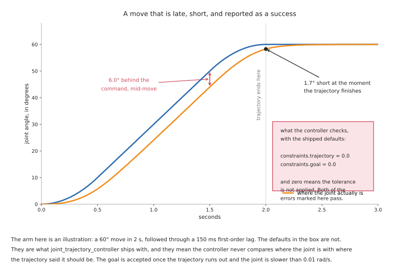

# Controlling the move

A planner hands you a trajectory. Something now has to make the motors produce
it, decide what happens when the arm meets the world, and say afterwards whether
it worked. This document is about that layer.

It is where the difficulty of most real tasks actually lives. The
[task table in the overview](01_overview.md#2-what-your-task-actually-needs)
shows why: insertion, polishing, connector seating and every other job people
call hard are hard in contact, and a better planner has nothing to say about any
of them.

It assumes [the tools document's account of ros2_control](../09_tools-and-libraries.md#6-ros2_control-driving-the-motors),
which shows how the layer is put together and how to call it, and the
[feedback control section](../10_one-arm-training/02_programmed-methods.md#6-feedback-control)
of the one-arm training area, which is the map of the ideas. This is the
practice: what the defaults do, what each controller is genuinely for, and what
"the move failed" turns out to mean.

## Contents

1. [The layer between a trajectory and the motors](#1-the-layer-between-a-trajectory-and-the-motors)
2. [Joint space and Cartesian space](#2-joint-space-and-cartesian-space)
3. [What "the move failed" actually means](#3-what-the-move-failed-actually-means)
4. [Position, stiffness and force](#4-position-stiffness-and-force)
5. [Guarded moves, and what the sensor can actually observe](#5-guarded-moves-and-what-the-sensor-can-actually-observe)
6. [Visual servoing](#6-visual-servoing)
7. [Model predictive control](#7-model-predictive-control)
8. [Speed and acceleration scaling](#8-speed-and-acceleration-scaling)
9. [A diagnosis ladder](#9-a-diagnosis-ladder)

---

## 1. The layer between a trajectory and the motors

In ROS 2 this layer is [ros2_control](https://github.com/ros-controls/ros2_control),
Apache-2.0, and it runs a loop at a fixed rate — commonly 100 to 1000 times a
second. Each time round it reads where every joint is, lets the controllers
decide what to do, and writes commands to the hardware.

The controller that executes a planner's output is
[joint_trajectory_controller](https://github.com/ros-controls/ros2_controllers/tree/master/joint_trajectory_controller).
It holds the trajectory, works out where each joint should be at the current
instant, and commands that. Everything in section 3 is about what it checks while
doing so, which is less than people assume.

There is a third option that has recently appeared and is worth knowing about.
[motion_primitives_controllers](https://github.com/ros-controls/ros2_controllers/tree/master/motion_primitives_controllers),
Apache-2.0, sends PTP, LIN and CIRC primitives down to the robot's own controller
rather than streaming joint positions at it. That means the vendor's controller
does the interpolation, with its own guarantees, and ROS supplies the sequence.
Its documentation carries a caution worth repeating, because it is the honest
version of a thing people assume: there is no guarantee that a Cartesian
primitive such as LIN will be executed exactly as planned, because the inverse
kinematics is not always unique.

## 2. Joint space and Cartesian space

Everything in this document happens in one of two coordinate systems, and the
choice is not a matter of convenience.

**Joint space control** commands each joint an angle. It is what every arm does
underneath, it never has a singularity problem, and its errors are per joint and
easy to reason about. What it cannot express is anything about the tool's path in
the room, so a "move 50 mm to the left" has to be converted to joint angles by
something else first.

**Cartesian control** commands the tool a pose or a velocity, and the controller
converts continuously using the Jacobian. It is the natural language for contact
tasks, for servoing, and for anything specified relative to a workpiece. Its
costs are exactly the ones in
[section 3 of reaching and reachability](02_reaching-and-reachability.md#3-singularities-and-what-the-controller-does-at-one):
near a singularity, a modest tool velocity demands a joint velocity the arm does
not have, and the controller must either scale the motion back, clamp and lurch,
or fault.

In ROS 2 the practical Cartesian options are two.
[moveit_servo](https://github.com/moveit/moveit2/tree/main/moveit_ros/moveit_servo),
BSD-3, takes a stream of tool twists or joint jogs and converts them in real
time, with singularity handling and collision checking built in; it is what you
use to steer an arm from a joystick, from a game controller, or from a
perception loop. The
[FZI cartesian_controllers](https://github.com/fzi-forschungszentrum-informatik/cartesian_controllers),
BSD-3, provide Cartesian motion, force and compliance controllers as
ros2_control plugins. They are widely used and they were last pushed in October
2024, so treat them as stable rather than active.

## 3. What "the move failed" actually means

This section is the reason to read this document. The controller's report of
success or failure is configuration-dependent to a degree that surprises almost
everybody, and the shipped configuration checks nothing.

`joint_trajectory_controller` takes its tolerances under `constraints`. Two of
them are per joint:

- `trajectory` is how far a joint may be from where the trajectory said it should
  be, *during* the move
- `goal` is how far it may be from the goal at the end

Both default to `0.0`. And the header of
[tolerances.hpp](https://github.com/ros-controls/ros2_controllers/blob/master/joint_trajectory_controller/include/joint_trajectory_controller/tolerances.hpp)
states what zero means: a tolerance value of zero means that no tolerance will be
applied for that variable.

So the shipped default is that the controller never compares where the joint is
with where the trajectory said it should be, at any point, including the end. The
other two constraints do have non-zero defaults — `goal_time` is 10.0 seconds of
grace, and `stopped_velocity_tolerance` is 0.01 — so what "success" means out of
the box is approximately *the trajectory ran out, and within ten more seconds the
joint was moving slower than 0.01*.

The picture below is an ordinary move under those defaults.

The arm in that picture is an illustration — a 60 degree move in two seconds,
followed through a 150 millisecond lag — and the defaults in the box are not.
Six degrees of following error mid-move and 1.7 degrees short at the moment the
trajectory finishes both pass, because neither is compared against anything.

Three things follow.

**Set the tolerances deliberately, and set them from the hardware.** A goal
tolerance is a statement about how accurately this arm can stop, which is a
number you can measure in an afternoon. A trajectory tolerance is a statement
about how far behind you are willing to let it get mid-move, which matters
because mid-move is when it is near obstacles.

**A tolerance of zero never fails and a tolerance tighter than the measurement
never succeeds.** These are the same mistake in two directions and they live in
the same file. A goal tolerance below what the arm can
actually achieve produces a controller that aborts every move; a tolerance of 0.0
produces one that accepts every move. The correct value is the arm's own settling
figure with a margin, taken from its datasheet or measured, and choosing it
requires having that number rather than a guess at it.

**Following error is not the same as goal error, and only one of them is about
safety.** The arm always catches up at the end, because the trajectory stops
changing and the controller does not. What happened in the middle is where the
arm was actually closest to the table.

### 3.1 The other three ways a move "fails"

Beyond tolerances, the same phrase covers three different events and they need
different responses.

**The planner found nothing.** No motion happened. This is a reachability or a
planning-scene problem, and
[section 10 of planning a path](03_planning-a-path.md#10-when-planning-is-the-wrong-tool)
is the list of causes.

**The trajectory was rejected before execution.** The start state was in
collision, or the start state did not match where the arm actually is, or the
trajectory's first point is too far from the current position. This is a timing
or a state-synchronisation problem and it looks nothing like the others.

**The trajectory executed and the outcome was wrong.** The arm went exactly where
it was told and the part is not in the hole. Nothing in the motion stack failed.
This is either the pose that was commanded or the contact that followed, and the
diagnosis ladder in section 9 separates them.

## 4. Position, stiffness and force

A position controller commanded to a point one millimetre inside a rigid surface
sees an error it cannot remove, and increases its command to close it. The error
is still there, so it increases again. This is how arms break things and it is
not a bug — it is precisely what a position controller is for. The
[one-arm training area](../10_one-arm-training/02_programmed-methods.md#6-feedback-control)
makes this argument with a picture, and it is the most important single idea in
this whole area.

The alternative is to command how the arm should respond to force.

**Impedance control** makes the arm behave like a spring and damper with a
stiffness you chose. You still command a position, but a millimetre of unexpected
contact produces a force proportional to the stiffness rather than an escalating
one. It needs torque control at the joints, or a very good estimate of it, which
is why it is available on arms that measure torque in every joint and not on arms
that do not.

**Admittance control** is the same behaviour reached from the other end. You
measure the force with a sensor, work out how a spring would have moved under it,
and command that motion to a position-controlled arm. It works on an ordinary
position-controlled arm with a force-torque sensor at the wrist, which is why it
is the one the open stack ships:
[admittance_controller](https://github.com/ros-controls/ros2_controllers/tree/master/admittance_controller),
Apache-2.0, in ros2_controllers.

The difference in practice is that impedance is stiffer and faster because the
loop is closed inside the joint, and admittance is limited by how fast the arm's
position loop can respond, which is slower. Admittance also has a characteristic
failure: if you make it too soft against a stiff environment it becomes unstable
and buzzes.

**Explicit force control** commands a force directly along some axes while
controlling position along the others. Push against this surface with 20 newtons
while following this path across it. This is what polishing, deburring and
sanding need.

Five jobs compliance suits:

- inserting a part into a hole whose position you know to within a millimetre or
  two but not better
- pressing a connector home, where the force tells you whether it seated
- polishing and sanding, where the tool must follow a surface it cannot model
- letting a person push the arm out of the way, which is the whole basis of hand
  guiding
- assembling anything where two parts have to find each other

Five jobs it cannot do:

- hold a position accurately against a load, because a soft arm sags under one
  and that is the point of it
- move quickly, since stiffness and speed trade against each other
- work without knowing the arm's own dynamics — the gravity and inertia model
  has to be right, or the arm drifts when compliance is enabled
- replace a fixture where the part must be held rigidly
- run the fast contact loops that polishing really wants, which is the next
  paragraph

One detail worth absorbing because it says something real about the physics. For
polishing and deburring the force loop frequently does not live in the arm at
all. It lives in a **compliant flange**: a small spring-loaded device bolted
between the arm and the tool that holds a set force over a few millimetres of
travel, far faster than the arm could. A six-axis arm is too heavy and too slow
to control contact well, and the tooling industry has quietly conceded this. No
controller and no learned policy changes that mass.

**And the open stack stops abruptly here.** `ros2_control` gives you an
admittance controller and a force-torque broadcaster. Hybrid force-position
control, contact-rich assembly strategies, seam tracking and search patterns are
things you write yourself or buy from the arm's vendor. That gap is the main
reason serious contact work still runs on vendor software, and it is worth
knowing before you promise a schedule.

## 5. Guarded moves, and what the sensor can actually observe

A guarded move goes in a direction until a condition fires. It is the cheapest
way to find a surface whose height you do not know, and it is how an arm measures
by touch.

The first thing to be clear about is where the measurement comes from. **It is
not from the touch sensor.** It comes from the joint encoders, which know where
the tool was at the instant contact was reported. The sensor's only job is to say
*when*. The
[perception area's touch section](../06_object-perception/02_sensors.md#2-measuring-by-touch)
develops this properly.

The second thing is the failure mode, and it is silent in the worst way: **a
condition on a sensor that cannot observe the event never fires, and never
errors.** The arm simply keeps going. Three concrete cases:

- a wrist force-torque sensor reads the force along the tool, so a guarded move
  sideways into a wall registers on a different axis than the one being watched
- pad sensors in the fingers feel the object being gripped and cannot feel that
  object's base touching the table, because the contact is not between the
  fingers and anything
- a threshold set above the noise floor of a filtered signal will never be
  crossed if the filter's time constant is longer than the contact event

The third thing is that contact is not support. An object caught on the lip of a
fixture registers contact while still hanging, and a guarded move that stops
there has found something that is not the surface.

Five jobs a guarded move suits:

- finding the height of a table, a pallet layer, or a stack whose count is
  unknown
- seating a part until it bottoms out
- confirming that a part is present where it should be
- measuring a dimension to a precision no camera reaches, since the encoders are
  better than the optics
- establishing contact before switching into a compliant mode

Five jobs it cannot do:

- find anything softer than the sensor's threshold, which includes foam, cloth,
  and light parts
- work at speed, because the arm must be slow enough to stop within the contact
  event
- distinguish the surface from an obstruction on the way to it
- observe an event on an axis the sensor does not measure
- tell you that nothing was there, unless you also set a travel limit — a guarded
  move with no distance cap on a missing workpiece will drive the arm until
  something else stops it

## 6. Visual servoing

Visual servoing closes the loop on the camera rather than on the encoders. You
measure the difference between what the camera sees now and what it should see
when the job is done, and move so as to reduce it.

Its great virtue is that it sidesteps a whole class of calibration error. It
never needs to know where the object is in world coordinates; it only needs to
know whether the picture is getting closer to the target picture. If your
hand-eye calibration is a degree out, a look-then-move system is 5.9 mm out at a
340 mm reach, as
[the perception error budget](../06_object-perception/01_overview.md#8-where-the-millimetres-go)
computes, and a visual servo converges anyway.

There are two formulations. **Image-based** servoing works entirely in pixels: it
drives image features to their target pixel positions. It is robust to
calibration error and its tool path through space can be strange.
**Position-based** servoing estimates the object's pose and drives the arm to it,
which gives a sensible path and puts the calibration back in the loop.

The cost is the loop rate. The
[perception area's timing section](../06_object-perception/07_making-it-work.md#2-how-fast-does-it-actually-have-to-be)
states it precisely: servoing needs 30 Hz or better, and because the loop is
closed, latency becomes phase lag and makes the controller unstable rather than
merely slow. This rules out almost everything learned and is why classical
feature tracking still runs industrial visual servoing.

**The licence here is the trap.**
[ViSP](https://github.com/lagadic/visp), the reference visual servoing library
from Inria, is **GPL-2.0 or later**, read from its own LICENSE.txt. It is
excellent, it is actively maintained — last pushed September 2026 — and it is
copyleft. A commercial product that links it inherits the GPL. The ROS wrapper
[vision_visp](https://github.com/lagadic/vision_visp) is the same code. This is
not a criticism of the choice; it is a warning that the most natural library to
reach for in this corner is the one with the strongest licence obligation, and
almost no tutorial mentions it.

Five jobs visual servoing suits:

- aligning to a target that has moved since it was measured
- inserting into a hole the camera can see all the way down
- following a seam or an edge
- any task where recalibrating after every knock is not practical
- tracking a moving object, such as picking from a conveyor without stopping it

Five jobs it cannot do:

- work when the feature is occluded, including by the tool itself at the moment
  of contact, which is exactly when you want it most
- run on a perception method slower than about 30 Hz
- guarantee a sensible path through space, in the image-based form
- handle the target leaving the field of view, which ends the loop abruptly
- replace force control, because once contact is made the picture stops changing

## 7. Model predictive control

Model predictive control repeatedly solves a short optimisation: given where I am
now, and a model of how this system moves, what is the best sequence of commands
over the next second or so. It executes only the first command, throws the rest
away, and solves again. The waste is the point — re-solving from the current
state is how the controller absorbs everything its model got wrong.

The libraries, with licences read from their repositories:
[acados](https://github.com/acados/acados) is BSD-2 and is the fast embedded
solver; [OCS2](https://github.com/leggedrobotics/ocs2) is BSD-3;
[Crocoddyl](https://github.com/loco-3d/crocoddyl) is BSD-3 and is the
differential-dynamic-programming one;
[MuJoCo MPC](https://github.com/google-deepmind/mujoco_mpc) is Apache-2.0 and is
by a distance the fastest way to build an intuition for it, because you can watch
it work and drag the target around while it runs.

Five jobs it suits:

- anything with a constraint that must hold over time rather than instantaneously,
  such as staying inside a region while moving
- systems where the dynamics genuinely matter — high speed, a heavy payload,
  something swinging
- coordinating motion with a moving target whose future you can predict
- mobile manipulation, where the base and the arm have to be solved together
- replacing a hand-tuned cascade of loops with one statement of what you want

Five jobs it cannot do:

- run without a dynamics model, which for a real arm means identifying its
  inertias
- meet a hard real-time deadline without care, because solve time varies with the
  problem
- fix a model that is wrong in a way that is consistent, since it re-solves
  against the same wrong model every cycle
- replace a safety-rated stop
- be debugged by inspection, because the answer comes from a solver rather than
  from a rule you wrote

## 8. Speed and acceleration scaling

Two knobs multiply the joint limits before the trajectory is timed. They are the
right way to slow an arm down while developing, and they have three properties
worth knowing.

**They are applied at planning time, not at execution time.** Changing the factor
does not slow the motion that is currently running.

**They scale the limits, not the path.** The arm follows the same route more
slowly, so a path that was marginal on clearance is still marginal.

**They are not a safety function.** A safety-rated speed limit is a separate
certified function inside the robot's own controller, independent of the software
that asked for the motion. Scaling is a request; safety-rated speed monitoring is
an enforcement. The distinction matters the moment a person is in the cell, and
[section 2 of the overview](01_overview.md#2-what-your-task-actually-needs) puts
"anything with a person nearby" in a row of its own for this reason.

One more effect that surprises people. Slowing an arm down does not slow
everything down proportionally. Following error generally falls, because the
joints are asked for less. The kinetic energy carried into any unplanned contact
falls with the square of the speed, since that is what kinetic energy does. But
settling time at the end of the move does not improve, because it is set by the
arm's own dynamics rather than by how fast it arrived. A move
scaled to a tenth is not a tenth as accurate at the end; it is approximately as
accurate, and takes ten times as long.

## 9. A diagnosis ladder

Motion failures nearly all present the same way — the arm is not where it should
be — and the cause can be at any of six levels. Test them in this order, because
each rung assumes the ones below it are sound. This is the motion counterpart of
[the perception ladder](../06_object-perception/07_making-it-work.md#3-when-it-does-not-work-a-diagnosis-ladder),
and the two meet at rung 3.

**1. Did a trajectory get produced at all?** If the planner returned nothing,
everything below is irrelevant. Check whether the goal is reachable before
assuming it is a planning problem;
[section 8 of reaching and reachability](02_reaching-and-reachability.md#8-finding-out-before-you-commit)
takes minutes.

**2. Did the whole trajectory get executed?** For a Cartesian path, read the
fraction. For a trajectory action, read the result code rather than assuming
success. A partial Cartesian path is the single most common silent failure in
this area.

**3. Was the commanded pose right?** Command the arm to a known point with no
perception involved and measure where the tool goes with a ruler. A constant
offset along one axis is a tool-offset or hand-eye error, not a control problem.

**4. Did the joints follow the trajectory?** Record the commanded and actual
joint positions and subtract them. If the tolerances are at their defaults, the
controller will not have told you, so you have to look. A large following error
mid-move with a small one at the end is the normal shape; a large one at the end
means the arm did not finish.

**5. Did the arm arrive and then move?** Settling, deflection under load, and a
gripper that shifts the part when it closes all happen after the controller has
reported success. Read the position again half a second later.

**6. Did the arm arrive correctly and the task still fail?** Then it is contact,
and nothing above this rung will show it. Log the force during the final approach
and look at the trace. An insertion that jams, a part that was already seated
when you thought you were still approaching, and a part that never touched
anything all have distinct force traces and are indistinguishable from position
data alone.

The reason to follow the order is that rungs 3 and 5 both look exactly like rung
4 from outside, and retuning the controller — the usual first move — fixes
neither.

Next: [learned motion](05_learned-motion.md), which asks what a trained policy
replaces in all of this. Or back to [the overview](01_overview.md).
