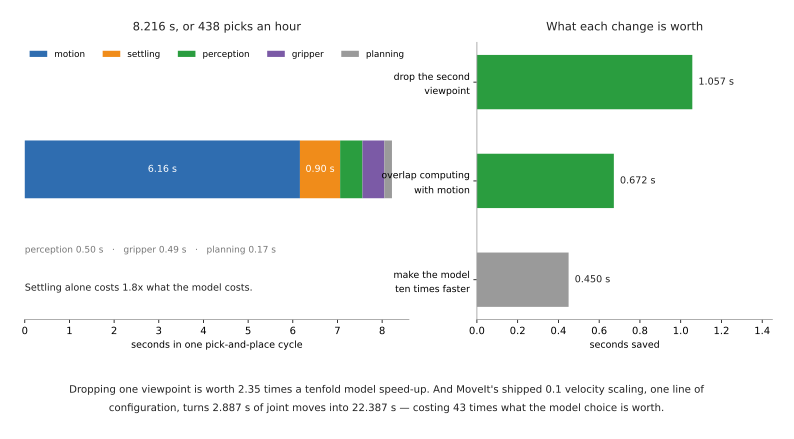

# The cost of a move

Most people who arrive at robotics from software carry one instinct with them:
that the expensive thing in a system is computation, and that making the code
faster is how you make the system faster. In a robot cell that instinct is
usually wrong, and this document is about how wrong, in seconds.

The claim it sets out to prove is this. **Optimising the number of physical
actions matters far more than optimising milliseconds of inference.** A move
takes seconds. A model takes milliseconds. A pipeline that thinks for half a
second and thereby saves one arm move comes out ahead, and it comes out ahead by
a margin large enough that you should stop measuring the model and start counting
the moves.

It is for anyone deciding what to work on next: which model to pick, whether to
buy a faster computer, whether to add a second viewpoint, whether the cell is
slow because the code is slow. It assumes you have read
[controlling the move](04_controlling-the-move.md), because two facts from there
are load-bearing here — that speed and acceleration scaling are applied at
planning time, and that the controller's idea of "stopped" is a configurable
tolerance rather than a physical fact.

It extends an argument the perception area already makes on its own side of the
cell.
[Making it work, section 2](../06_object-perception/07_making-it-work.md#2-how-fast-does-it-actually-have-to-be)
establishes that perception latency is dead time in a look-then-move cycle, that
half a second of it is affordable, and that the ninety-ninth percentile is the
number to watch rather than the mean. That is the perception half. This document
prices the whole cell, so that the half-second can be compared against the things
it competes with.

Everything here is about robot arms in general. The arithmetic uses one arm's
published limits as a worked example, and the method transfers to any arm whose
datasheet you can read.

## Contents

1. [What things actually cost](#1-what-things-actually-cost)
2. [The arithmetic that follows](#2-the-arithmetic-that-follows)
3. [Settling time, the cost people forget](#3-settling-time-the-cost-people-forget)
4. [Where the real savings are](#4-where-the-real-savings-are)
5. [When the instinct is right](#5-when-the-instinct-is-right)
6. [What this means for choosing a model](#6-what-this-means-for-choosing-a-model)

---

## 1. What things actually cost

### 1.1 Why you cannot look up how long a move takes

Start with the disappointing part, because everything else depends on accepting
it. **You cannot compute how long an arm move takes from the arm's published
specification.** The specification gives you a top speed and stops there.

Universal Robots publish, in the
[UR5e user manual](https://s3-eu-west-1.amazonaws.com/ur-support-site/69091/99404_UR5e_User_Manual_en_Global.pdf)
at the technical specifications page, a maximum joint speed of 180 degrees per
second, an approximate tool speed of 1 metre per second, a pose repeatability of
±0.03 mm measured to ISO 9283, and a system update frequency of 500 Hz. That is a
generous specification by the standards of this industry. It still does not let
you compute a move time, because a move time depends on acceleration as much as
on top speed, and acceleration is not there.

This is not an oversight you can work around by reading harder. Universal Robots'
own ROS 2 description package,
[Universal_Robots_ROS2_Description](https://github.com/UniversalRobots/Universal_Robots_ROS2_Description)
(BSD-3-Clause, licence read from the repository), carries the admission in a
comment repeated against every single joint in
[config/ur5e/joint_limits.yaml](https://github.com/UniversalRobots/Universal_Robots_ROS2_Description/blob/ros2/config/ur5e/joint_limits.yaml):
`acceleration limits are not publicly available`. The file sets
`has_acceleration_limits: false` on all six joints as a result. The vendor's own
engineers writing the vendor's own robot description could not source the number
either.

So there are exactly two honest positions. The first is to assume an acceleration
and be explicit that you assumed it, which is what section 1.2 does. The second
is to measure it on your own arm, which takes about an hour and is the only thing
that produces a number you may quote. **What you must not do is take a top speed,
divide a distance by it, and write the answer down as a move time.** That answer
is a lower bound, and on short moves it is a lower bound by a factor of two or
more, because a short move never reaches top speed at all.

What to measure, concretely: command the same move twenty times, log the joint
states at the controller rate, and take the time from the first non-zero velocity
to the moment the position stops changing by more than your repeatability figure.
Do it for a long move and a short one. The long move gives you an effective top
speed, the short one gives you an effective acceleration, and the difference
between the two gives you the settling term that section 3 is about.

### 1.2 The arithmetic of a single move

An arm move under a trajectory that ramps up, holds, and ramps down has a
standard closed form. For a distance `d`, a top speed `v` and an acceleration
`a`, the move either reaches top speed or it does not:

```
if d >= v² / a:     t = d/v + v/a        # it reaches v and holds it
else:               t = 2 · sqrt(d/a)    # it never reaches v
```

The crossover distance `v²/a` is the useful quantity, because below it the top
speed in the datasheet is irrelevant. With a joint limited to 180 degrees per
second and an assumed acceleration of 1000 degrees per second squared, the
crossover is `180² / 1000` = **32.4 degrees**. Every joint move shorter than
that is pure acceleration and deceleration, and quoting the 180 figure for it is
meaningless.

The table below applies that formula to a set of joint moves. Read it as: the
size of the move in the dominant joint, the time an ideal arm at the published
top speed would take, and the time the formula gives once acceleration is
included. The acceleration is assumed, not published, and every number in the
third column moves if you measure a different one.

| Dominant joint move | At top speed alone | With `a` = 1000 °/s² | Which regime |
| --- | --- | --- | --- |
| 6.74° (a 40 mm step at 340 mm radius) | 0.037 s | **0.164 s** | never reaches top speed |
| 30° | 0.167 s | **0.346 s** | never reaches top speed |
| 60° | 0.333 s | **0.513 s** | reaches top speed |
| 90° | 0.500 s | **0.680 s** | reaches top speed |
| 120° | 0.667 s | **0.847 s** | reaches top speed |
| 180° | 1.000 s | **1.180 s** | reaches top speed |

The first row is the one the perception area already met. The wrist camera
document computes that same 40 mm sideways step at a 340 mm radius, gets 37
milliseconds at the top joint speed, and says plainly that nobody achieves it —
see
[what a view actually costs](../06_object-perception/08_the-wrist-camera.md#4-what-a-view-actually-costs).
The formula above says why in one line: 6.74 degrees is a fifth of the crossover
distance, so the move is entirely ramp, and it takes 4.4 times the naive figure
before any settling is counted at all.

### 1.3 The cost table

Here is the whole cell in one place. Read it as: the thing that costs time, what
it costs, where the figure comes from, and under what conditions it holds. A
figure marked *computed* was derived from a published limit by the formula in
section 1.2 and can be reproduced. A figure marked *assumed* is one nobody
publishes, and the last column says what to measure instead.

| What | Cost | Source | Conditions and caveats |
| --- | --- | --- | --- |
| a free-space move, 90° in the dominant joint | 0.680 s | computed | 180 °/s from the UR5e manual; **acceleration assumed at 1000 °/s² because no vendor publishes it** |
| the same move at MoveIt's shipped defaults | 5.180 s | computed | velocity and acceleration both scaled by 0.1, which is the default in [move_group_interface.cpp](https://github.com/moveit/moveit2/blob/main/moveit_ros/planning_interface/move_group_interface/src/move_group_interface.cpp) |
| a short approach, 50 mm straight line | 0.700 s | computed | at 100 mm/s with 500 mm/s²; the speed is one **you** choose, not a limit, and section 4 argues for choosing it low |
| a fast retreat, 50 mm straight line | 0.632 s | computed | at 250 mm/s with 500 mm/s²; never reaches 250, so the ceiling is irrelevant |
| a settle, 1 mm of ring down to 0.03 mm | 0.45 s | computed | assumes a 25 Hz structural mode at 5% damping; **no arm vendor publishes this and it must be measured** |
| a gripper close | 0.200 s | [OnRobot 2FG7 datasheet](https://onrobot.com/storage/datasheets/2fg7/datasheet_2fg7_v2.0_en.pdf) | typical, including brake activation, **at 4 mm of travel and 80 N** |
| the same gripper closing its full stroke | 0.300 s | the same datasheet | typical, at the full 38 mm stroke and 80 N |
| a Robotiq 2F-85 closing its full stroke | 0.567 s | computed | 85 mm opening at the published 150 mm/s maximum finger speed, from the [2F-85 manual](https://assets.robotiq.com/website-assets/support_documents/document/2F-85_2F-140_Instruction_Manual_e-Series_PDF_20190206.pdf); at the 20 mm/s minimum it is 4.25 s |
| a picture | 0.011 s | [RealSense datasheets](https://www.realsenseai.com/product-datasheets/) | one frame at 90 frames per second on a D405; exposure is essentially free |
| an inference pass, small model on a graphics card | 0.0017 to 0.0172 s | [RF-DETR benchmark table](https://github.com/roboflow/rf-detr) | the whole published field, from YOLO26-N to RF-DETR-2XL, on an NVIDIA T4 with TensorRT, FP16, batch size 1 |
| an inference pass, on a processor | 0.056 to 0.463 s | [Ultralytics YOLO11 documentation](https://docs.ultralytics.com/models/yolo11/) | YOLO11n to YOLO11x, ONNX runtime, 640 pixels; **the page does not say which processor**, which is itself the point |
| a planning call | **not sourceable** | — | sampling-based planning time is problem-dependent and heavy-tailed; MoveIt's own default *budget* is 5.0 s with one attempt, in the same file as the scaling defaults |

Four entries in that table deserve a sentence each, because they are where the
document's argument actually comes from.

**The gripper figures are the best-documented numbers in the whole cell, and they
are still conditional.** OnRobot quote 200 milliseconds and then attach a
footnote saying that this is at 4 mm of stroke and 80 newtons, and that the
typical value at the full 38 mm stroke is 300 milliseconds. That is exactly how a
timing figure should be published, and it is rare. Robotiq, by contrast, publish
a finger speed of 20 to 150 mm/s in their mechanical specifications table and no
closing time at all, so the 0.567 s above is a division you do yourself. It also
carries an ambiguity to resolve on the bench, because the manual does not say
whether 150 mm/s is the rate at which the gap between the fingers closes or the
speed of each finger through space, and those two readings differ by a factor of
two.

**Inference on a graphics card is not a cost.** The entire published field, from
the fastest tiny detector to the largest transformer in the comparison, spans
1.7 to 17.2 milliseconds. The difference between the fastest and the slowest
model anyone would consider is 15.5 milliseconds. That is 2.3 per cent of one
90-degree joint move. There is no model choice on a graphics card that a stopwatch
pointed at the cell could detect.

**Inference on a processor is a cost, and still a small one.** The spread from
YOLO11n to YOLO11x is 56.1 to 462.8 milliseconds. Even the worst case is less
than the time the arm spends approaching 50 mm.

**The planning call is the one row that cannot be filled in, and that is
informative.** No published figure exists because sampling-based planners do not
have a characteristic time — they have a distribution with a long tail, and the
tail depends on your obstacles.
[Section 2 of planning a path](03_planning-a-path.md#2-sampling-based-planners)
explains why. The evidence that the maintainers know this is the default
`allowed_planning_time_` of 5.0 seconds with `num_planning_attempts_` of 1. A
five-second budget is not what you set for an operation you expect to take
milliseconds.

### 1.4 The default that costs more than every optimisation on this page

There is one line of configuration that dominates the whole cost model, and it is
a default rather than a choice.

MoveIt's C++ interface initialises its velocity and acceleration scaling factors
from parameters whose fallback value is **0.1**. You can read it in
[move_group_interface.cpp](https://github.com/moveit/moveit2/blob/main/moveit_ros/planning_interface/move_group_interface/src/move_group_interface.cpp),
where `default_velocity_scaling_factor` and `default_acceleration_scaling_factor`
are both fetched with `0.1` as the value used when nothing sets them. MoveIt 2 is
BSD-3-Clause, read from the repository, and the default is deliberate — it is
there so that a newcomer's first program does not swing an arm at full speed.

The consequence is that, out of the box, every move costs roughly seven and a half times
what section 1.2 computes. A 90-degree joint move at full limits takes 0.680
seconds. The same move with both factors at 0.1 takes 5.180 seconds. Four such
moves — which is a modest pick-and-place — take 2.887 seconds at full limits and
**22.387 seconds** at the shipped defaults.

That gap is 19.5 seconds. Section 2 will show that the most aggressive plausible
model optimisation in the same cell saves 0.450 seconds. **The scaling default
costs 43 times what the model choice is worth**, it is one line to change, and it
is invisible because nothing reports it.
[Section 8 of controlling the move](04_controlling-the-move.md#8-speed-and-acceleration-scaling)
covers what the knobs do and why they are not a safety function. The point here
is narrower and it is about arithmetic: before you profile anything, print the
scaling factors your cell is actually running at.




## 2. The arithmetic that follows

### 2.1 A worked cycle

Take an ordinary pick-and-place with two viewpoints. The arm starts at a home
pose, moves to look at the scene, takes a picture, repositions slightly and takes
a second, runs one inference pass over both, plans, moves to a pre-grasp,
approaches, closes, retreats, transfers, approaches the place location, opens,
retreats, and returns home.

Every motion figure below comes from section 1.2 with the same assumed
accelerations. The settle figure comes from section 3.2. The gripper figures are
the OnRobot datasheet's. The inference figure is 500 milliseconds, a round number
chosen to sit near the published 462.8 milliseconds for the largest YOLO11 on a
processor. The planning figure of 150 milliseconds is an assumption and is marked
as one.

Read the table as one row per step, in the order the steps happen, with the kind
of cost each one is.

| Step | Kind | Seconds |
| --- | --- | --- |
| move home to the viewpoint, 90° dominant joint | motion | 0.680 |
| settle at the viewpoint | settling | 0.446 |
| reposition 40 mm to the second viewpoint | motion | 0.600 |
| settle at the second viewpoint | settling | 0.446 |
| two frames, one at each viewpoint | perception | 0.022 |
| one inference pass | perception | 0.500 |
| one planning call (assumed) | planning | 0.150 |
| move to the pre-grasp, 60° dominant joint | motion | 0.513 |
| approach 50 mm at 100 mm/s | motion | 0.700 |
| close the gripper | gripper | 0.300 |
| retreat 50 mm at 250 mm/s | motion | 0.632 |
| transfer, 120° dominant joint | motion | 0.847 |
| place approach 50 mm at 100 mm/s | motion | 0.700 |
| open the gripper | gripper | 0.200 |
| retreat 50 mm at 250 mm/s | motion | 0.632 |
| return home, 120° dominant joint | motion | 0.847 |
| **total** | | **8.216** |

At 8.216 seconds a cycle, the cell does 438 picks an hour if nothing ever goes
wrong.

### 2.2 Where the time went

Grouping the same rows by kind gives the answer the document exists to give.
Read it as: the kind of cost, its total, and its share of the cycle.

| Kind of cost | Seconds | Share of the cycle |
| --- | --- | --- |
| motion | 6.152 | 75% |
| settling | 0.892 | 11% |
| perception | 0.522 | 6% |
| gripper | 0.500 | 6% |
| planning | 0.150 | 2% |

Three-quarters of the cycle is the arm moving. Another ninth is the arm having
moved and not yet being still. Everything a software engineer would instinctively
attack — the model, the planner, the image pipeline — is 8 per cent of the total
between them.

And note which row settling beats. **Waiting for the arm to stop vibrating costs
1.8 times what running the model costs**, and almost nobody measures it, because
it does not appear as a line in a profiler. It appears as a `sleep`.

### 2.3 Three ways to spend an afternoon

Now compare the things you could actually do to that cycle. Read the table as:
the change, the cycle time afterwards, what it saved, and what it cost you to
make the change.

| Change | New cycle | Saved | What it costs you |
| --- | --- | --- | --- |
| make the model ten times faster, 500 ms to 50 ms | 7.766 s | 0.450 s, 5.5% | a smaller model, worse accuracy, or new hardware |
| drop the second viewpoint | 7.159 s | 1.057 s, 12.9% | whatever that viewpoint was buying, which is often nothing |
| run perception and planning while the arm moves | 7.544 s | 0.672 s, 8.2% | a restructure of the sequence, and nothing else |

**Dropping one viewpoint is worth 2.35 times a tenfold speed-up of the model.**
Overlapping the computation with motion is worth 1.49 times it. Neither of those
two changes requires a different model, a different computer, or a compromise on
accuracy.

The viewpoint result is not a coincidence, and it is the same result the
perception area reached from the other direction. The wrist camera document
computes that going from two views to twenty improves a measurement by 0.223 mm,
costs eighteen extra moves, and concludes that
**the eighteen extra pictures did their job perfectly and their job was not worth
doing** — see
[why not twenty](../06_object-perception/08_the-wrist-camera.md#3-why-not-twenty).
This document supplies the other half of that sentence. A viewpoint costs
1.057 seconds here because it costs a move, a settle and a frame, and the move
and the settle are 99 per cent of it.

One more comparison closes the argument. The 0.450 seconds you win by making the
model ten times faster is 2.3 per cent of the 19.5 seconds that section 1.4's
scaling default silently costs. If your cell is running at MoveIt's shipped
defaults, then every conversation about model latency is a conversation about the
forty-third most important number in the system.

## 3. Settling time, the cost people forget

### 3.1 An arm that has arrived is not yet still

When a trajectory finishes, the controller reports that the joints are at their
target. The arm is not at rest. A robot arm is a cantilever with several hundred
millimetres of aluminium and a gripper on the end, and stopping it excites the
structure, which then rings. The ring decays. How long it takes to decay below
the accuracy you need is the **settling time**, and it is a genuine physical cost
that sits between the end of a move and the beginning of anything that depends on
the arm being where it says it is.

A measurement taken before the arm has settled is worse than no measurement.
No measurement leaves you knowing you do not know. A measurement taken mid-ring
gives you a number, with a plausible-looking uncertainty, that is wrong by an
amount nothing downstream can detect. The perception area's diagnosis ladder puts
this at rung 5 and notes that it looks exactly like rung 1, which is a bad model
— see
[the diagnosis ladder](../06_object-perception/07_making-it-work.md#3-when-it-does-not-work-a-diagnosis-ladder).
Swapping the segmentation model is the usual first move and it fixes nothing.

The software stack barely acknowledges this. In `joint_trajectory_controller` the
only parameter that looks at whether the arm has stopped is
`stopped_velocity_tolerance`, whose default is 0.01, and `goal_time`, whose
default is 10.0 seconds of grace — both readable in
[joint_trajectory_controller_parameters.yaml](https://github.com/ros-controls/ros2_controllers/blob/master/joint_trajectory_controller/src/joint_trajectory_controller_parameters.yaml),
Apache-2.0. A joint velocity below 0.01 is a statement about the motor, not about
the tool at the end of half a metre of arm. And the controller's action status is
monitored at a default `action_monitor_rate` of 20 Hz, so even the moment of
completion is only observable to within 50 milliseconds through that channel.

The vendor side is quieter still. The UR5e manual quotes a pose repeatability of
±0.03 mm and names the standard it was measured to. It quotes no settling figure
of any kind. The number that decides when your picture is worth taking is not in
the manual, and it is not in the controller.

### 3.2 Putting a number on it

Since nobody publishes it, compute a plausible range and then go and measure your
own. A lightly damped structure ringing at frequency `f` with damping ratio `ζ`
has an amplitude that decays as `exp(-2π ζ f t)`, so the time for the ring to
fall from an initial amplitude `x₀` to a tolerance `x₁` is:

```
t = ln(x₀ / x₁) / (2π · ζ · f)
```

Take an initial overshoot of 1 mm at the tool and a tolerance of 0.03 mm, which
is the UR5e's published repeatability — there is no point waiting for the ring to
fall below the arm's own positioning error. That gives `ln(1/0.03)` = 3.507 in
the numerator. The table below is that expression evaluated across a plausible
range. Read it as: the structural frequency across the columns, the damping ratio
down the rows, and the settling time in each cell. Both inputs are assumptions
and both are measurable in an afternoon.

| Damping ratio `ζ` | `f` = 10 Hz | `f` = 15 Hz | `f` = 25 Hz |
| --- | --- | --- | --- |
| 0.03 | 1.860 s | 1.240 s | 0.744 s |
| 0.05 | 1.116 s | 0.744 s | 0.446 s |
| 0.10 | 0.558 s | 0.372 s | 0.223 s |

The range across that table is a factor of eight, from 0.223 seconds to 1.860
seconds. That is the honest state of knowledge before you measure. Section 2's
cycle uses the 25 Hz, 5 per cent cell, which is 0.446 seconds and sits in the
optimistic half.

**Measure it like this.** Command a move that ends where you can see the tool.
Log the joint states at the controller rate, and either fit the decay of the
residual, or, better, put a camera on it and watch a target feature. Take the
time from the reported end of the trajectory to the moment the feature stops
moving by more than your measurement noise. Do it with the gripper empty and with
the heaviest payload you carry, because adding mass lowers the frequency and the
frequency is in the denominator. Do it after a long fast move and after a short
slow one. Then use the slowest of those numbers, not the average, for the same
reason the perception area tells you to quote a ninety-ninth percentile.

### 3.3 What this does to the number of pictures

Settling interacts directly with viewpoints, and it is the interaction that makes
extra viewpoints so much more expensive than they look.

A **frame** is one exposure from the camera at the pose the arm is already
holding. A **viewpoint** is a new pose, which means a move. The distinction is
the whole economics of the thing, and the wrist camera document makes it
precisely in
[how many pictures each task needs](../06_object-perception/08_the-wrist-camera.md#2-how-many-pictures-each-task-needs).

An extra frame costs 11 milliseconds and no settling, because the arm has not
moved. An extra viewpoint costs a move, a settle and a frame: in section 2's
cycle, 0.600 + 0.446 + 0.011 = 1.057 seconds. **The extra viewpoint costs 95
times the extra frame, and 42 per cent of that cost is waiting for a stationary
arm to stop vibrating.**

The thing that makes this worse than it sounds is that the settling cost is
invisible in exactly the systems that get it wrong. A cell that does not wait
long enough does not pay the 0.446 seconds. It pays instead in measurements that
are occasionally wrong, at a rate that varies with how heavy the payload was and
how fast the previous move happened to be. That failure is intermittent, it
correlates with speed, and it is nearly always diagnosed as a perception problem.

## 4. Where the real savings are

Here is the ranking the arithmetic supports, best first. Each entry says what it
is worth in section 2's cycle.

**1. Remove a move.** Every free-space move in the cycle is between 0.5 and 0.85
seconds. Removing one is worth more than any software change on this list. The
moves that are easiest to remove are the ones nobody chose: a return to a home
pose that exists only because the first program had one, a retreat to a safe
height that the next approach immediately undoes, a separate pre-grasp pose that
could be the end of the previous move. Look at the sequence as a list of poses
and ask of each one what would break if it were not there.

**2. Remove a viewpoint.** Worth 1.057 seconds in section 2's cycle, which is
12.9 per cent. This is a move plus a settle plus a frame, and the frame is the
cheap part. Before adding a viewpoint, work out which quantity it improves and by
how much — the wrist camera document shows how to do that arithmetic, and shows
it coming out at 0.223 mm for eighteen views. Before keeping an existing one, do
the same in reverse.

**3. Overlap computation with motion.** Worth 0.672 seconds, which is 8.2 per
cent, and it costs nothing but a restructure. This is the one technique in this
document, so it gets its own treatment below.

**4. Reduce settling by creeping into the final position.** Worth about 0.196
seconds per settle in section 2's cycle, which is less than it first appears, and
the reason it is less is worth understanding because it is the same reason extra
frames are cheap.

The initial ring amplitude `x₀` is set by how hard the arm decelerated into the
pose, so decelerating gently rings less. But `x₀` enters section 3.2's formula
inside a logarithm, so the payoff is severely diminishing. At 25 Hz and 5 per cent
damping, halving the initial ring saves 0.088 seconds, reducing it fivefold saves
0.205 seconds, and reducing it tenfold saves 0.293 seconds. Meanwhile the move
time grows roughly as one over the acceleration, which is not a logarithm at all.

Slowing the whole move is therefore a clear loss. Taking the 40 mm reposition
from 100 mm/s at 500 mm/s² down to 50 mm/s at 50 mm/s² turns a 0.600-second move
into a 1.789-second one, spending 1.189 seconds to save at most 0.293. Splitting
the move is a modest win. Travelling the first 35 mm at full speed and creeping
the last 5 mm at 20 mm/s with 100 mm/s² costs 0.450 seconds for that last
segment instead of 0.200, so it spends 0.250 seconds — and if the gentler arrival
puts the ring under the 0.03 mm tolerance on arrival, the 0.446-second settle
disappears entirely and you are 0.196 seconds ahead at each viewpoint, or 0.392
seconds across the two.

Whether the gentler arrival really does put the ring under tolerance is the thing
to measure, and the arithmetic above is what tells you whether measuring is worth
your afternoon. Note that this item and the next are close enough on these
numbers that the ordering could go either way on your arm. It is placed above the
model because it costs no accuracy and no hardware.

**5. Make the model faster.** Worth 0.450 seconds for a tenfold improvement,
which is 5.5 per cent, and it is the item on this list that costs the most to
achieve. It is last for a reason, and section 5 says when it is not.

### 4.1 Overlapping computation with motion

The technique is to run the computation for step *n+1* during the motion of step
*n*, so the computation costs nothing at all rather than costing its own runtime.
It is ordinary pipelining, and the reason it works so well here is the ratio: in
section 2's cycle there are 3.226 seconds of place-and-return motion during which
nothing in the cell has any computing to do, and 0.672 seconds of perception and
planning that would fit inside it nearly five times over.

The constraint is a dependency. You can only overlap computation with a motion
whose destination does not depend on that computation's answer. Perception for
*this* object cannot overlap the move to *this* object's pre-grasp, because the
pre-grasp is what the perception produced. Perception for the *next* object
overlaps the whole of this object's transfer, place and return, because none of
those poses depend on it.

Five jobs it suits:

- a cell processing a queue of items, where the next item can be perceived while
  the current one is being placed
- planning the retreat and transfer while the gripper is closing, since the
  transfer path does not depend on whether the grasp succeeded
- any pipeline with a slow model and a long transfer, which is the common case in
  bin picking
- warming a model — loading weights, allocating buffers, running one throwaway
  pass — during the first move of a cycle rather than in front of the first
  measurement
- pre-computing the inverse kinematics for a set of candidate poses while the arm
  travels to the viewpoint that will choose among them

Five jobs it cannot do:

- overlap anything with the motion it determines, which is the dependency above
  and is not negotiable
- help a cell that handles one item at a time with a human in the loop between
  items, because there is no next item to work on
- help when the computation is short relative to the motion anyway, where it adds
  concurrency bugs for a saving you cannot measure
- survive a scene that changes during the overlap, because the perception you
  computed early describes a world that has moved on — the wrist camera document
  makes this point about fusing views taken at different times
- hide a computation whose *variance* is the problem, since an occasional
  two-second pass still overruns the motion it was hiding behind and now stalls
  the cell at a less predictable moment

That last one is worth dwelling on. Overlapping converts a latency problem into a
scheduling problem, and a scheduling problem is only solved if the tail fits.
This is the same ninety-ninth-percentile argument
[making it work](../06_object-perception/07_making-it-work.md#2-how-fast-does-it-actually-have-to-be)
makes about model latency, arriving from a different direction: a model that
takes 50 ms usually and 2 seconds occasionally is worse than one that takes 200
ms every time, and it is worse specifically because the occasional case arrives
when the arm is already moving.

## 5. When the instinct is right

Everything above is about look-then-move, which is nearly every arm task. There
are two regimes where the instinct that milliseconds matter is correct, and
naming them is what stops the rule from being overapplied.

### 5.1 Visual servoing, where latency becomes phase lag

Visual servoing closes the control loop on the camera: the picture steers the arm
continuously rather than being consulted once. The moment the loop is closed, the
arithmetic in this document stops applying, because latency is no longer dead
time added to a cycle. It becomes **phase lag**, which is the delay between the
system doing something and the controller finding out, expressed as a fraction of
the oscillation the controller is trying to damp. Enough of it and the controller
drives the oscillation instead of damping it.

The practical threshold is 30 Hz or better, which
[section 6 of controlling the move](04_controlling-the-move.md#6-visual-servoing)
and
[making it work](../06_object-perception/07_making-it-work.md#2-how-fast-does-it-actually-have-to-be)
both state. Thirty hertz is a 33-millisecond budget for the whole loop —
exposure, transfer, detection, control law, command. That budget rules out almost
everything learned and it is why classical feature tracking still runs industrial
visual servoing. It also carries the licence trap that the same section names:
[ViSP](https://github.com/lagadic/visp), the reference library, is GPL-2.0 per
its own repository, which is the strongest obligation of anything in this corner
of the stack.

The distinction to hold on to is that in look-then-move a slower model makes the
cell slower, and in visual servoing a slower model makes the cell **unstable**.
Those are not the same kind of cost and no amount of cycle-time arithmetic
converts one into the other.

### 5.2 High-rate control, where the deadline is hard

Underneath everything, [ros2_control](https://github.com/ros-controls/ros2_control),
Apache-2.0, runs a fixed-rate loop, commonly at 100 to 1000 hertz. The UR5e
manual gives the robot's own system update frequency as 500 Hz, which is a
2-millisecond period. Inside that loop, missing the deadline is not slowness. It
is a skipped command, a discontinuity in the commanded trajectory, and a joint
that jerks.

This is a different kind of constraint from either of the other two, because it
is not about the average or even the tail — it is about every single iteration.
Nothing that allocates memory, takes a lock, or waits on a network belongs inside
it. The cost model in this document has nothing to say about that layer, and
should not be used to argue that 2 milliseconds is a small number there.

### 5.3 Anything that must stop within a deadline

There is a third case, and it is a safety one rather than a performance one.
Safety-rated stopping functions have hard timing requirements — the UR5e's safety
configuration limits speed so that the robot can stop within 300 milliseconds,
and it enforces that in the robot's own certified controller rather than in the
software that asked for the motion. Latency there is not a throughput question at
all.
[Section 8 of controlling the move](04_controlling-the-move.md#8-speed-and-acceleration-scaling)
draws the line between a request and an enforcement, and it is the line that
matters the moment a person is in the cell.

## 6. What this means for choosing a model

The practical conclusion is short, and it inverts the order in which most people
choose.

**Choose the model by its licence, its maintenance and its accuracy, and treat
its latency as a tie-breaker.** A permissively licensed model that takes 200
milliseconds is nearly always a better choice than an awkwardly licensed one that
takes 20 milliseconds, because the 180-millisecond difference is 26 per cent of
one 90-degree joint move and 2.2 per cent of section 2's cycle, while the licence
difference is permanent and follows the product.

The published evidence makes this unusually easy to check, because one benchmark
table reports latency and licence side by side. The
[RF-DETR repository](https://github.com/roboflow/rf-detr) — Apache-2.0, read from
the repository — measures every model in one place, on an NVIDIA T4 with
TensorRT, FP16 and batch size 1, and prints the licence in the last column. Read
the extract below as: the model, its accuracy on COCO at the strict measure, its
measured latency, and its licence.

| Model | COCO AP 50:95 | Latency | Licence |
| --- | --- | --- | --- |
| RF-DETR-L | 56.5 | 6.8 ms | Apache-2.0 |
| RF-DETR-M | 54.7 | 4.4 ms | Apache-2.0 |
| D-FINE-L | 57.2 | 7.5 ms | Apache-2.0 |
| LW-DETR-L | 56.1 | 6.9 ms | Apache-2.0 |
| YOLO11-X | 50.9 | 10.5 ms | AGPL-3.0 |
| YOLO26-X | 56.9 | 9.6 ms | AGPL-3.0 |

The whole column of latencies spans 4.4 to 10.5 milliseconds. That is 0.6 to 1.5
per cent of one 90-degree joint move. There is no row in that table whose speed
should decide anything. There are rows whose licence decides a great deal:
[Ultralytics](https://github.com/ultralytics/ultralytics) is AGPL-3.0, confirmed
from its repository, and the AGPL's network clause reaches further than most
people expect.

The reason to connect this to the licence documents rather than restate them is
that they already do the work.
[Licences and platforms in this area](06_licences-and-platforms.md#1-licences-and-the-four-that-will-catch-you-out)
covers the four traps in the motion stack, including MoveIt's default inverse
kinematics solver being LGPL-2.1 and ViSP being GPL.
[The perception area's equivalent](../06_object-perception/06_licences-and-platforms.md#1-licences-and-the-one-that-will-catch-you-out)
covers the one that catches people out on the vision side. What this document
adds is only the exchange rate: **the latency you would trade a licence away for
is worth, in arm-time, approximately nothing.**

Three consequences follow, and they are the practical output of the whole
document.

The first is about hardware. Buying a faster computer to run a model that is
already on the graphics card buys you at most 15.5 milliseconds against a cycle
of 8.216 seconds, which is 0.2 per cent. Spending the same money on an arm that
accelerates harder, or on a fixture that removes a viewpoint, buys you seconds.

The second is about accuracy. Section 2's cycle can absorb a model that is ten
times slower for 5.5 per cent of its cycle time. If ten times slower also means
materially more accurate, it is very likely worth it, because a failed grasp
costs a whole cycle and sometimes a broken object — which is precisely why
[making it work](../06_object-perception/07_making-it-work.md#1-how-to-tell-whether-it-is-working)
counts attempts that failed after committing in a column of their own.

The third is about where to look first. Before profiling anything, print your
velocity and acceleration scaling factors, count the poses in your sequence, and
measure one settling time. Those three numbers between them account for more of
your cycle than every piece of software in it.
