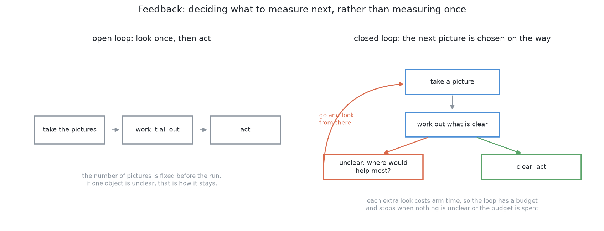

# How it would be solved: the ten solutions

## Introduction

[The problem](02_the-problem.md) says what is asked for and why it is hard. This
document is the way into the ten solutions. It covers what they share: what
each does about a glass nobody saw, the few words they use, where a learned part
can sit, what it means to choose the next measurement, and the rule every one of
them had to pass. It ends with what was built, and where that can fail.

Each solution has a full document of its own, and this one does not repeat them.
The table of [the ten](#the-ten-in-two-folders) says in one line what each
is and which difficulty it attacks.

> **The cell is described once, in [the cell](../01_the-cell.md)** — the layout,
> the two places the camera works from, from the top and from the side, all four
> sensors, and the words this project uses them with.

## Contents

1. [Introduction](#introduction)
1. [Where we are](#where-we-are)
1. [When a glass is completely hidden](#when-a-glass-is-completely-hidden)
1. [The words](#the-words)
1. [Three families, and what "hybrid" means](#three-families-and-what-hybrid-means)
1. [Feedback: choosing what to measure next](#feedback-choosing-what-to-measure-next)
1. [The rule every solution passed](#the-rule-every-solution-passed)
1. [The ten, in two folders](#the-ten-in-two-folders)
1. [The decision: what was built](#the-decision-what-was-built)
1. [Where what was built can fail](#where-what-was-built-can-fail)
1. [How it would be solved](#how-it-would-be-solved)

---

## Where we are

Four to six opaque glasses of one kind stand on the table. The kind is tapered
and its range of sizes is wide, and the glasses stand at least 150 mm apart
between centres, which leaves a narrow strip of bare table between any two rims.
The arm has to produce a set of pixels, a place and a rough width for each
glass, and two honest statements: which glasses it could not separate, and where
it could not have seen a glass at all. It does not pick anything up and it does
not measure a shape.

[The problem](02_the-problem.md#the-three-difficulties) sets out the three
difficulties: a glass can be missing from a picture altogether, glasses merge in
the picture while standing apart on the table, and the camera can no longer
stand wherever it likes. All three come from **splay**, which [the
cell](../01_the-cell.md#the-words) explains.

The solutions lean on one property of splay that is easy to miss. It is a
**radial scaling** about the point directly below the camera: it multiplies
distance from that point and size by the same factor. So it never changes how
wide a glass looks *as an angle*; it only decides how far out along its own
direction the outline lands. That is what turns the difficulties from things you
can describe into things you can compute.

## When a glass is completely hidden

This is the worst of the three difficulties, because **every check in this
project is a check on something that was found**. A width can be compared
against what the kind allows, a fitted circle has a residual, and a group can be
asked how many stations saw it. A glass that produced no pixels gives none of
them anything to fire on.

The two places the camera works from produce it in different ways, and only one
of them produces it in this cell.

- **Looking straight down**, a tall glass's outline sweeps over a short one. The
  range of sizes inside this kind is wide enough for that to happen at the
  guaranteed gap between centres rather than needing the glasses closer than the
  cell allows, with the covering glass comfortably inside the frame. So from the
  top a glass can go missing either because something covered it or because the
  survey never looked at that piece of table, the two are indistinguishable from
  the picture, and the signal worth having is therefore *unsearched area* rather
  than *hidden glass*.
- **Looking level**, no sweep is involved. One glass stands in front of another,
  which needs neither a height difference nor closeness: two glasses 600 mm
  apart hide each other as completely as two 150 mm apart, and the one that goes
  is the further one, whatever its height.

How often that happens has a measured answer, and it is worth recording, because
it is an easy thing to overstate. Complete covering is **possible at the
guaranteed gap between centres**, and an arrangement that produces it can be
written down. It is **uncommon in the layouts the cell spawns** rather than the
normal case: across a sweep of spawned scenes of the tapered kind, surveyed at
the cell's own height from the three stations the cell computes, only a small
share of glasses lose any pixels at all to a neighbour, a smaller share again
lose every pixel at one station, and none loses them at more than one. And none
of it arises at the height
[`problem-2-sim`](../../../code/src/08_robotics-by-example/problem-2-sim/README.md) renders its top view from,
which is higher than the cell's own survey height and holds the whole zone in
one frame, because the higher the camera the less splay throws each outline.
That is why a run of either pipeline below never meets this case, and why the
answer to it has to be argued from the geometry rather than from a failure
somebody has watched happen. It stays the worst of the three difficulties
because nothing in the data can flag it.

Being seen in *part* is a different matter, and the same sweep settles it the
other way about. **Nearly every glass is cut by the edge of the picture at one
station or another, and most glasses have no station at all that returns a whole
footprint**; roughly one in six have exactly one. So a circle fitted at a single
station usually rests on an arc rather than on a whole disc, and an arc gives a
footprint too small and displaced, with a width the kind allows and a small
residual, which nothing in one picture objects to. That is why [asking the
stations to
agree](04_programmed/02_cluster-on-the-table.md#asking-the-stations-to-agree) is
load-bearing, and why [amodal masks for the hidden
part](05_learned/10_amodal-masks-for-the-hidden-part.md) repairs an ordinary
failure rather than a rare one.

Every solution document ends with a section called "when the glasses are
completely hidden". They do not agree, and the disagreement is the useful part.

| # | Looking straight down | Looking level |
|---|---|---|
| [1](04_programmed/01_split-the-blob-in-the-picture.md#when-the-glasses-are-completely-hidden) | never asked: the method reads a bottom edge against a horizon, and there is none | answers "one glass" confidently and is not wrong about anything it was asked |
| [2](04_programmed/02_cluster-on-the-table.md#when-the-glasses-are-completely-hidden) | partly: it cannot find the glass but it can bound where one could be, and the stations then look | no: the blocked strip never closes, so it cannot be bounded |
| [3](04_programmed/03_move-the-camera.md#when-the-glasses-are-completely-hidden) | no: the cure is the station layout, not anything the loop decides | partly: it refuses poses that would hide one *known* glass behind another |
| [4](05_learned/04_choosing-the-next-look.md#when-the-glasses-are-completely-hidden) | partly: doubt attaches to a place rather than a glass, though the candidate poses are one ring at one height | no: two pictures differing by zero pixels cannot carry different doubt |
| [5](05_learned/05_is-anything-hiding-there.md#when-the-glasses-are-completely-hidden) | yes, as far as ranking goes: the blind wedge has a measurable reach and area | barely: the strip is computed from what was already known, so nothing varies |
| [6](05_learned/06_a-network-trained-from-scratch.md#when-the-glasses-are-completely-hidden) | no, and this is the cleanest no here: zero pixels cast zero votes | no: the two scenes produce the same picture pixel for pixel, though a sliver of a glass is worth more here than anywhere else |
| [7](05_learned/07_self-supervised-from-the-arms-own-movement.md#when-the-glasses-are-completely-hidden) | no: hands it to solution 2 and the overlapping stations | yes: the revealing pictures are already being taken |
| [8](05_learned/08_segment-anything-then-keep-the-glasses.md#when-the-glasses-are-completely-hidden) | no: a prompt point can only land on something the picture shows, so a covered glass is never proposed and the keeper is never offered it | no: the picture is the same as if the further glass were not on the table, so the set of proposals is the same too |
| [9](05_learned/09_a-fine-tuned-instance-segmenter.md#when-the-glasses-are-completely-hidden) | no: a region is proposed only where something in the picture suggests one, and a covered glass suggests nothing | no: nothing in the picture tells the two scenes apart, so the same regions come back with the same scores |
| [10](05_learned/10_amodal-masks-for-the-hidden-part.md#when-the-glasses-are-completely-hidden) | no: completion extends the evidence a glass leaves, and a glass that left none has nothing to extend | no: the whole silhouette of the near glass says nothing about whether a second one stands behind it |

## The words

**Mask**, **patch** and **cluster** mean what [the
cell](../01_the-cell.md#the-words) says. Three more run through all ten.

**Connected components**, also called a flood fill, turns a mask into separate
objects: take a glass pixel nobody has visited, spread to every glass pixel
touching it, call that patch one object, and repeat. It answers only *are these
pixels joined?*, which is why two glasses that touch in a picture come back as
one.

A **point cloud** is every pixel with a depth reading turned into a point in the
room. The pixel gives the direction, the depth gives how far along it, and the
camera's pose gives where the direction starts.

**Segmentation** is used for three different jobs, and only one of them answers
this problem.

**Detection** puts a rectangle round each object, so pixels where two overlap
belong to both. **Semantic segmentation** labels every pixel "glass" or not, and
nothing says which glass, so two overlapping glasses become one region.
**Instance segmentation** labels every pixel with a class *and* with which
object it belongs to, so five glasses come back as five masks. This problem asks
for instance segmentation, and anything less has not answered it.

## Three families, and what "hybrid" means

**Programmed.** You state the rule and the computer applies it. No training
data, no weights file, no graphics card. It runs in about a millisecond, works
on an object it has never seen, and when it fails you can usually find out why
by printing one number. Its limit is that somebody has to be able to write the
rule down.

**Learned.** The behaviour comes from numbers fitted to examples, so it can do
things nobody knows how to state. It pays with a training set, a weights file
that has to be kept in step with the world, hardware to run it, and an answer
that cannot explain itself.

**Hybrid.** Both together, arranged so that the learned part sits inside
something checkable.

### The question to ask of any hybrid

The question is not how much of it is learned but **where the learned part
sits**, because that decides what happens when the model is wrong, and a model
is sometimes wrong by construction.

- **As the decider.** The model's answer is the answer. A wrong answer is acted
  on, because nothing downstream is in a position to disagree.
- **As a proposer.** The rules hand the hard cases to the model and check its
  suggestion. A wrong suggestion is rejected by arithmetic, and the system falls
  back to what it had.
- **As a ranker.** The rules generate every candidate and reject the unsafe
  ones; the model only orders the survivors. A bad ordering costs one wasted
  attempt and nothing worse.
- **As a verifier.** The rules act and the model checks what happened. A wrong
  check costs one extra measurement.

In the last three, **the learned part's mistakes are limited by something that
does not need the model to be right**. A better model makes failures rarer; only
the arrangement puts a ceiling on how bad they get.

A hybrid is usually *cheaper* than a fully learned solution, not dearer, because
the learned piece has one narrow job. Learning "is this one object or two?"
needs a small fraction of the data that "find all the objects" needs, and trains
on an ordinary laptop.

## Feedback: choosing what to measure next

**The number of measurements does not have to be decided in advance.**

An open-loop pipeline takes a fixed number of pictures, works everything out and
acts, so an object that turns out unclear stays unclear and everything
downstream inherits the doubt without being told. A closed loop takes a picture,
works out what is not settled, asks *where would I have to look for this to
become clear?*, goes and looks, and repeats.

It needs three things, and with only two it is not really a loop:

- **a measure of doubt** that separates settled from not sure, rather than always
  producing an answer;
- **actions that could reduce it**, with some way of guessing which would help;
- **a budget**, because every extra look costs arm time. The loop stops when
  nothing is unclear or the budget is spent, and reports what is still doubtful
  rather than guessing.

That reverses the usual instinct. **The thing to save here is not computation.
It is the number of times the arm has to move**: a move costs seconds, and any
of these models costs milliseconds.

## The rule every solution passed

A solution is listed here only if **everything it needs can be produced by the
simulator on the machine this project runs on**: no NVIDIA card and therefore no
CUDA, no robot on a bench, no real-world data. The machine does have a graphics
processor, built into its main chip and sharing one pool of memory with the
processor beside it, and PyTorch reaches that graphics processor through its MPS
backend, which is why a model of moderate size both trains and runs here. So
what is ruled out is anything that needs code compiled for NVIDIA's cards,
rather than anything that needs a graphics processor at all. The four conditions
this comes to, and the good answers that fail them, are in [the ones that need
more than a simulator](05_learned/11_needs-more-than-a-simulator.md).

Two consequences are worth seeing coming. The rule pushes the learned solutions
towards **small models trained from scratch on synthetic data**, away from the
usual advice to fine-tune a large model; for a cell with one kind of object, one
lighting setup and one camera, that is less of a sacrifice than it sounds. And
the first three solutions need nothing added to the environment, while
everything from the fourth on begins by adding a dependency, and the learned
ones add a large one.

**One of those conditions has an exception, and it is worth naming rather than
stepping round.** The condition is that nothing an approach needs may come from
outside the simulator, and solutions 8, 9 and 10 each download a file of weights
fitted elsewhere, so they do not meet it. They are listed because everything
else about them runs on this machine, and because a large model fitted elsewhere
is the first thing a team with a real camera would reach for, so leaving it out
would hide a real option. The exception has a price. Those weights were fitted
on photographs, while the cell renders a grey picture shaded from depth, so the
model is asked about pictures unlike the ones it learned from; and reproducing a
result means fetching the same file rather than running the training again from
a random start, so the file has to stay available and stay the same. The three
documents say what that costs in their own terms.

## The ten, in two folders

The solutions are split by whether they contain a trained model. The three in
[`programmed/`](04_programmed) are rules somebody wrote down; the seven in
[`learned/`](05_learned) all have numbers fitted to examples somewhere inside
them, whether those numbers were fitted here or somewhere else, and whether the
fitted part decides the answer or only puts candidates in order.

| # | Solution | Family | Where the model sits | The idea | What it attacks |
|---|---|---|---|---|---|
| 1 | [Split the blob in the picture](04_programmed/01_split-the-blob-in-the-picture.md) | programmed | — | each flat stretch along a patch's bottom edge is one glass standing on the table; needs no depth readings | the merge, mainly from the side |
| 2 | [Cluster on the table](04_programmed/02_cluster-on-the-table.md) | programmed | — | drop the depth points onto the table and group them by distance; then compute which parts of the table nobody could have seen | the merge, **and where nobody could have seen** |
| 3 | [Move the camera](04_programmed/03_move-the-camera.md) | programmed | — | walk round, testing reach, then line of sight, then the planner; cover the unsearched patches with the fewest positions | no usable viewpoint, and unsearched places |
| 4 | [Choosing the next look](05_learned/04_choosing-the-next-look.md) | hybrid | ranker | keep solution 3's candidates and vetoes, and order the survivors by a learned score: either how much doubt a look removes, or the chance it changes the answer | which look to spend the budget on |
| 5 | [Is anything hiding there?](05_learned/05_is-anything-hiding-there.md) | hybrid | verifier | weigh several weak clues, the glass count among them, to say which unsearched patch probably holds a glass | which unsearched place is likely occupied |
| 6 | [A network trained from scratch](05_learned/06_a-network-trained-from-scratch.md) | learned | decider | one small network, two heads: which pixels are glass, and which way each glass pixel's own centre lies | finding glasses with no depth, and separating glasses that touch |
| 7 | [Self-supervised from the arm's own movement](05_learned/07_self-supervised-from-the-arms-own-movement.md) | learned | decider | points on one glass shift together when the arm moves the camera, and that is the label | separating glasses with no labels |
| 8 | [Segment anything, then keep the glasses](05_learned/08_segment-anything-then-keep-the-glasses.md) | learned | decider | prompt a borrowed segmentation model with a grid of points and it proposes a mask for everything in the scene; a small learned keeper then says which proposals are glasses, so the part that finds the objects is borrowed whole rather than fitted here | finding glasses with almost nothing trained here |
| 9 | [A fine-tuned instance segmenter](05_learned/09_a-fine-tuned-instance-segmenter.md) | learned | decider | continue a large instance segmenter's training on this cell's pictures with one class, and take the masks it returns as the answer | the merge, with no grouping rule to write down |
| 10 | [Amodal masks for the hidden part](05_learned/10_amodal-masks-for-the-hidden-part.md) | learned | decider | the same segmenter, with each mask trained against the glass's whole silhouette instead of only the pixels the camera can see | a partly hidden glass read as a smaller glass in the wrong place |

Two of those entries are documents that were written separately and then joined,
because in each pair the second was not a different method but the same method
with one part changed.

**Solution 4** was two ways of ordering the same candidates. Both keep [move the
camera](04_programmed/03_move-the-camera.md)'s candidate generation and all of its
vetoes, and both replace only the rule that sorts the survivors — one with a
learned estimate of how much doubt a look would remove, the other with a learned
estimate of whether the answer would change. They agree completely about what is
*allowed* and differ only about what is *preferred*, so they are now one
document describing a ladder with two rungs.

**Solution 6** was two heads on one network. The same shape, the same training
recipe and the same source of labels produce a class map when the last layer has
one output channel, and one mask per glass when it has two. Describing them
apart meant writing the same network down twice.

The last three sit apart from the other two solutions that let a model decide
the answer. Solutions 6 and 7 fit every number they use inside this cell, on
pictures the simulator drew, so the model is small and there is nothing else to
it. Solutions 8, 9 and 10 start instead from a large model fitted somewhere
else, and they keep the written-down part as small as it will go: the finding is
done by borrowed weights, and what is fitted here is either a small keeper over
what that model proposes or a short continuation of its training. This is a
different trade rather than a better one. Weights fitted inside this cell
describe exactly the pictures the cell produces, while these were fitted on
photographs and the cell can only render a grey picture shaded from depth, so
the last three carry a **domain gap**, a difference between the pictures a model
learned from and the pictures it is asked about, which a network trained here
from scratch does not have.

## The decision: what was built

Two pipelines were built, and both are scored on the same 50 held-out scenes
drawn by [`problem-2-sim`](../../../code/src/08_robotics-by-example/problem-2-sim/README.md). The one this
project takes forward is **the learned pipeline**. [Its
README](../../../code/src/08_robotics-by-example/problem-2-learned/README.md) says how it works and why, how to
train it, and how to look at what each model is taught and answers.

**The learned pipeline** has three steps.

1. **Find.** TopNet does [solution 6](05_learned/06_a-network-trained-from-scratch.md): each
   glass pixel votes for the middle of its own glass, and the votes are
   counted. The place and width of each glass then come from the voting
   pixels' depth readings, by arithmetic.
2. **Choose where to look from the side.** 24 places round each glass. Geometry
   vetoes the places out of reach, the places where the camera would stand in
   another glass, and the places with a glass squarely in the way: the
   arithmetic tests of [solution 3](04_programmed/03_move-the-camera.md), without asking the
   motion planner. A learned Ranker orders what is left. It sits in the ranker
   position of [choosing the next look](05_learned/04_choosing-the-next-look.md), so
   a wrong order wastes a look and nothing more. A best score under 0.5 hands the glass to problem 3.
3. **Measure.** SideNet reads the height and 16 widths straight off the side
   picture. This is problem 1's job, done here by a model.

**The programmed twin**,
[`problem-2-programmed`](../../../code/src/08_robotics-by-example/problem-2-programmed/README.md), takes the
same three steps with rules: [solution
2](04_programmed/02_cluster-on-the-table.md)'s clustering on the table to find, the
same veto with a written rule to order the places, and a silhouette measurement
that is checked and tried from up to three places.

| Step | Learned | Programmed |
|---|---|---|
| Find | 250 of 250; position 0.4 mm median | 250 of 250; 0.2 mm median |
| Choose | first place clean 232 of 245; 5 handed over | 246 of 250; 2 handed over |
| Measure | height 5.4 mm median, 36 mm worst | height 0.8 mm median, 2.3 mm worst |

The learned pipeline finds glasses as well as the rules do and measures them
worse. Its README says why.

**What is not built.** Neither pipeline has these parts of the ten:

- solution 2's second half, the blind-region arithmetic that says where nobody
  could have seen a glass;
- solution 3's covering step, and its check with the motion planner;
- the survey from several stations. Both take one overhead picture from
  750 mm, high enough that the whole glass zone is in frame.

No test scene needed them to find every glass. They are what to add first when
the cell changes, for the reasons below.

**A third folder holds the three that borrow weights.** Nothing from solutions
8, 9 and 10 is in either pipeline, because each of those is a whole alternative
to the find step rather than a part missing from it, so the three are built and
scored on their own in
[`problem-2-pretrained`](../../../code/src/08_robotics-by-example/problem-2-pretrained/README.md). That folder
surveys from the cell's own height, from the three stations the cell computes,
which is what makes its numbers different in kind from the two pipelines above.
It scores each solution twice: once on the layouts the cell's placement rule
produces, and once on layouts built on purpose to put one glass in front of
another.

The row that makes the rest of the table readable is the first one, which is not
a solution at all. It is the renderer's own exact masks, handed to the same
arithmetic and judged by the same scorecard, so it says what any segmenter here
could manage at best.

| Find, from the top | The rule's own layouts | One glass in front of another |
|---|---|---|
| exact masks, no model | 100 of 100; 6.3 mm median, 46.5 worst | 83 of 101; 0.4 mm median, 50.0 worst |
| 8, segment anything | 74 of 100; 2.7 mm median, 43.1 worst | 75 of 101; 0.8 mm median, 31.1 worst |
| 9, fine-tuned | 100 of 100; 6.8 mm median, 46.5 worst | 75 of 101; 0.5 mm median, 86.2 worst |
| 10, amodal | 100 of 100; 6.8 mm median, 46.5 worst | 84 of 101; 1.2 mm median, 62.9 worst |

Three things follow from it. **On the layouts the cell's own rule produces, the
model is not what limits the answer**, because the fine-tuned segmenter sits
within half a millimetre of what exact masks give and shares their worst case
exactly, so what is left of the error belongs to the arithmetic and to the
geometry of looking from the top. **Completing the hidden part earns its place
only where something really stands in front**, since solutions 9 and 10 are
indistinguishable on ordinary layouts, while on crowded ones solution 10 finds
about one glass in ten more, which is as many as the renderer's own exact masks
find. And **a borrowed
model with almost nothing fitted behind it finds the fewest glasses on an
ordinary table, and is the only row here that never merges two of them**, which
is a trade worth seeing stated in one line.

## Where what was built can fail

**Nothing says where a glass could have been missed.** The one overhead picture
holds the whole zone, and no test scene lost a glass. But the problem asks for
the places that could not have been seen, and the pipeline has no such list. The
day the zone widens or the glasses get taller, a missing glass will leave no
trace. Solution 2's second half is the fix.

**The one high picture hides what a survey is for.** The reason no scene lost a
glass is that both pipelines take a single overhead picture from high enough
that the whole glass zone is in frame and nothing there covers anything.
Surveyed instead from the cell's own height, where three stations are needed to
hold the zone between them, most glasses are cut by the edge of some station's
picture, and a footprint cut by the frame back-projects to an arc rather than to
a whole circle. [Cluster on the table](04_programmed/02_cluster-on-the-table.md)
measures how often that happens, and the third folder shows what it costs: on an
ordinary table it is the edge of the picture rather than a neighbouring glass
that sets how far a found place sits from the true one.

**Glasses that could not be separated are not reported.** The problem asks for
that list too. The votes either split two glasses or they do not, and nothing
compares a found glass's width against what the kind allows.

**SideNet's answer is not checked.** It gets one picture and no retry. When the
Ranker's first choice is spoiled, 13 times in 245 on the test scenes, the
spoiled picture is measured as if it were clean. The programmed twin catches
this with a width check and tries the next place.

**Heights come out about 3% short.** `pipeline.measure` passes the 16 levels on
as the glass's profile, and a profile's height is its top level, which sits at
97% of the height SideNet said.

**200 examples is few.** SideNet pulls unusual glasses towards the average, so
its worst errors are the tallest stemmed glasses read short. The Ranker's first
choice is clean 232 times in 245, against 219 for a random allowed place, so it
has learned little.

**The veto does not ask the motion planner.** A place can pass the veto while
the arm's path to it crosses a glass. The same is true of the programmed twin.

**Everything is learned from a perfect depth camera.** Both pipelines run only
on `problem-2-sim`'s pictures, not in Gazebo, and those show opaque glasses with
a depth reading on every pixel. Real glass gives almost no depth readings, and
all three models are given depth.

**Two glasses that genuinely touch** are problem
3's business. Voting is the method that could
separate them, but no test scene has glasses touching.

## How it would be solved

← [The problem](02_the-problem.md) · [The ones that need more than a
simulator](05_learned/11_needs-more-than-a-simulator.md) · Problem 3 — moving them
apart →
