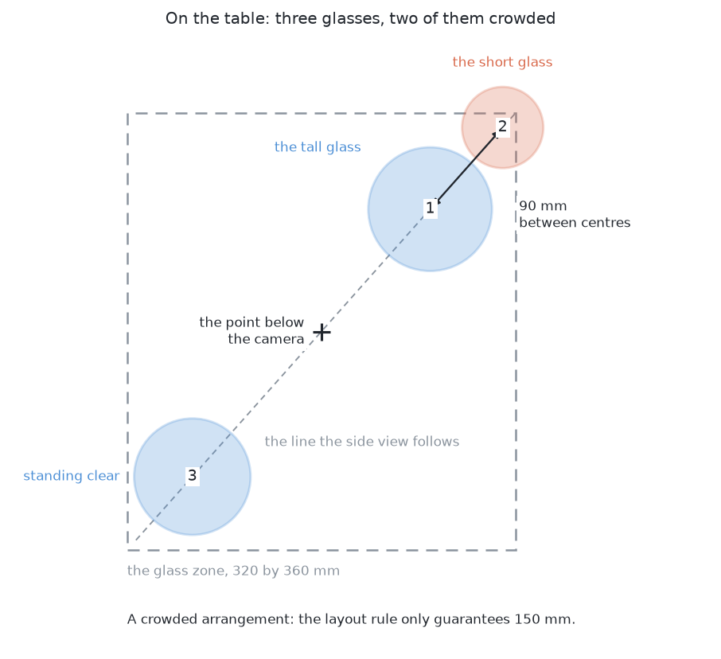
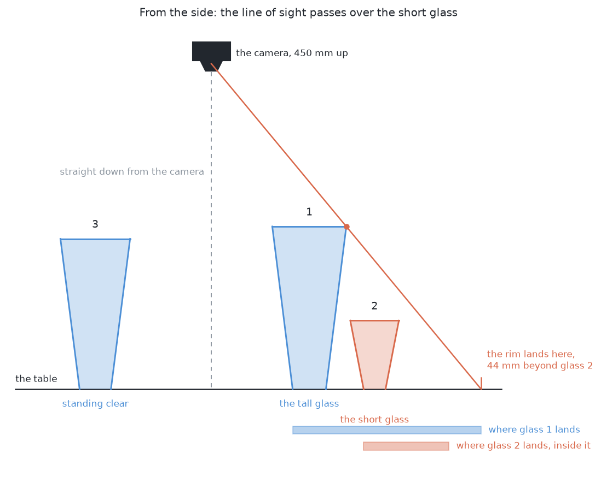
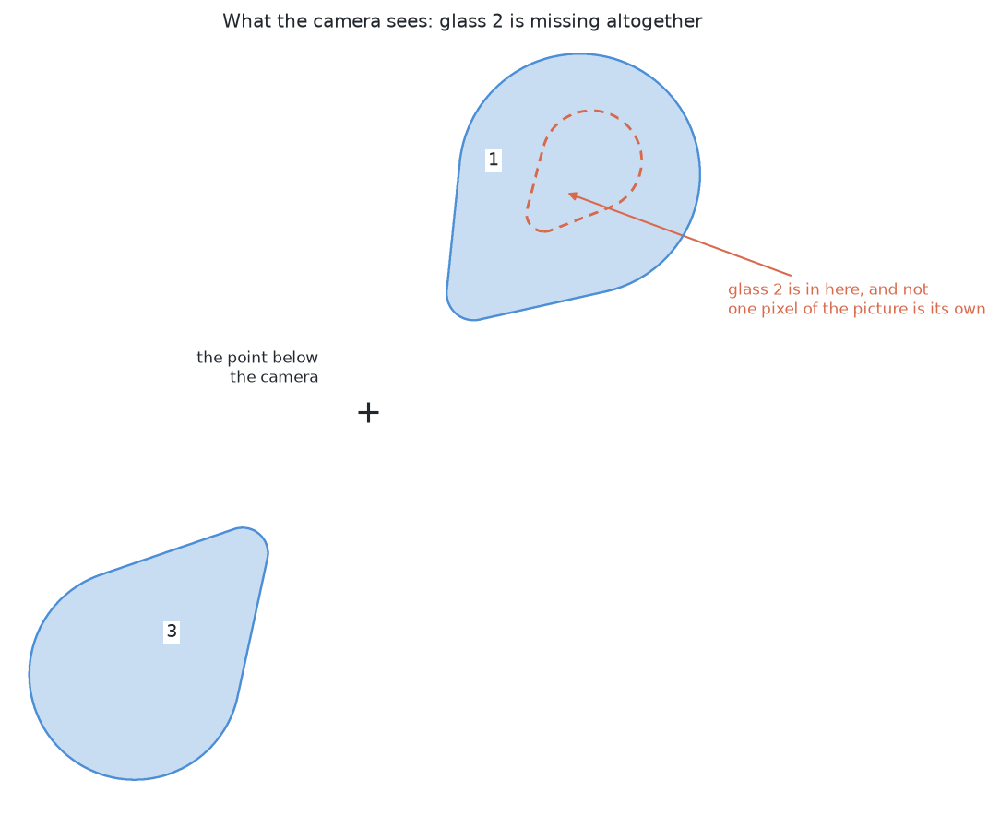
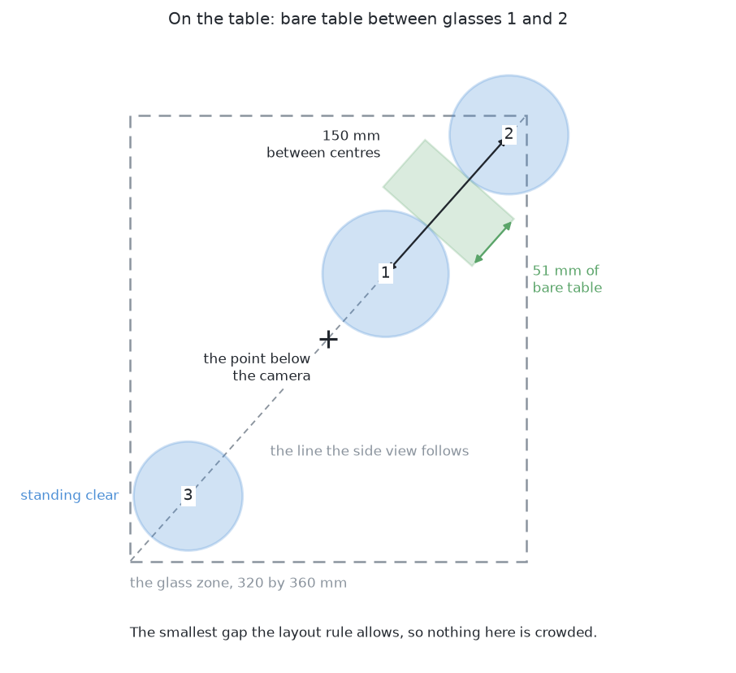
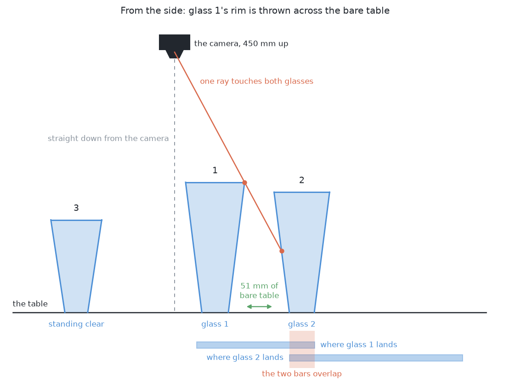
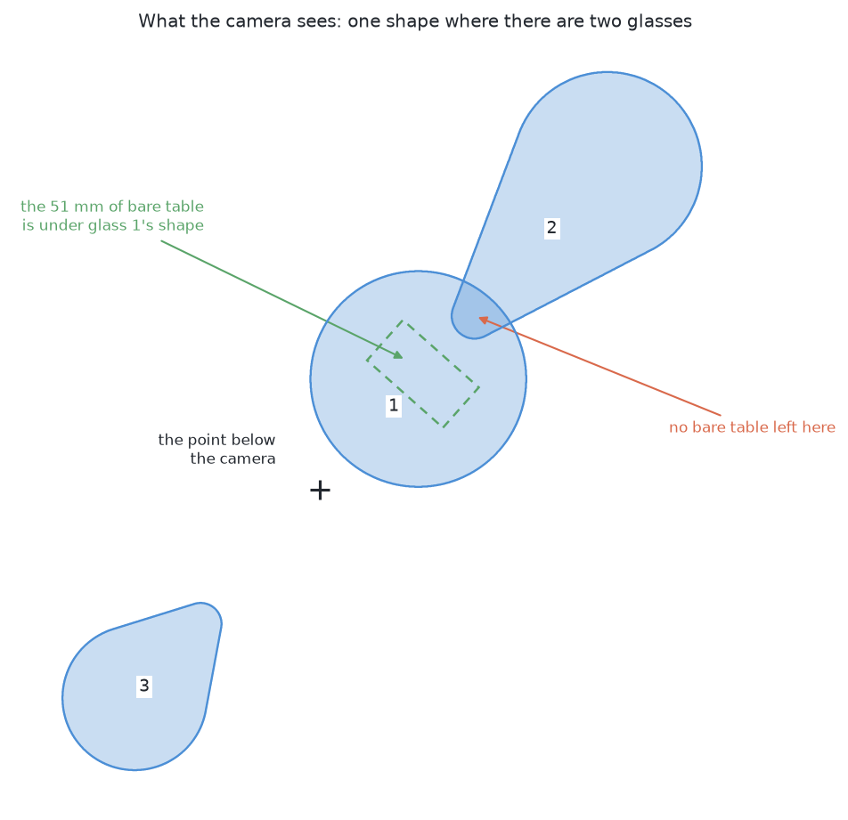

# What is asked for — segment the glasses

## 1. Introduction

The whole job this cell was built for is picking glasses off a table and
standing them on a rack. A glass can only be picked up once the arm knows which
glass is which and where each one stands, so that is the part this book takes:
**several glasses stand on the table, the arm photographs them from the top,
and it has to work out which pixels belong to which glass and where each glass
stands.**

It stops there. It picks nothing up, it measures no shape, and if two glasses
cannot be told apart from any reachable viewpoint it reports that and stops,
because moving them apart is [the next
book](../../09_pushing-the-glasses-apart/01_the-problem/01_what-is-asked-for.md).

The reason to state it this carefully is that **this book exists to compare six
ways of answering it**. Six quite different methods are each given this one
question, and a comparison only means something when the question was
identical, so what goes in and what must come out are fixed here once. By the
end of this document you will know both of those exactly, and the two
difficulties that make this harder than photographing one glass — the one the
six differ on, and the one none of them can answer.

## Contents

1. [Introduction](#1-introduction)
2. [What is on the table](#2-what-is-on-the-table)
3. [What goes in](#3-what-goes-in)
4. [What must come out](#4-what-must-come-out)
5. [The two difficulties](#5-the-two-difficulties)
6. [What "done" means](#6-what-done-means)
7. [Where to go next](#7-where-to-go-next)

## 2. What is on the table

Four to six glasses, standing upright and opaque, drawn at proportions picked at
random inside their kind's range. The drying rack is where it always is, and
nothing else changes from the job of carrying a single glass to the rack: same
cell, same camera, same table.

**All the glasses in one arrangement are the same kind, and the kind changes
from one arrangement to the next.** The cell has four kinds, described in [the
cell](../01_the-cell.md), and the arrangements cycle through them, so a run
meets all four in turn. That matters for comparing answers, because the four
kinds are not equally hard to outline. Seen from straight above, a stem is
never a band of its own, because the bowl is thrown outwards far enough to
cover it. What a bowl-only outline loses is the foot and the sliver of stem
beside it, so the two kinds with a stem are the harder pair and the stemmed
glass is the hardest of the four. That holds for a solution built from rules
written by hand, which the marking confirms. It does not hold for a solution
fitted on this cell's own pictures, which covers all four kinds about equally
well. So the difference between the kinds is a difference between methods as
much as between shapes, which is why every answer here is broken down by kind.

**The glasses stand apart.** There is a guaranteed smallest gap between any two
centres, wide enough that even the two widest glasses of a kind leave bare table
between their rims, so no two glasses ever touch. Separating glasses that touch
is the job of [pushing the glasses apart](../../09_pushing-the-glasses-apart/01_the-problem/01_what-is-asked-for.md).

**One kind's range of sizes is deliberately very wide.** The tapered kind runs
from a small glass to one more than twice its height, which is the widest range
of the four. That width is not decoration: it is what causes the first
difficulty below, and a narrow range could not produce it at all.

## 3. What goes in

Every answer to this problem is given exactly this and nothing more.

**The survey pictures.** The arm flies the camera over the glass zone looking
straight down and parks at several overlapping stations. At each station it
takes a pair of pictures a short distance apart, so the apparent shift between
them gives depth. For each picture an answer may read three things: the grey
picture, shaded from how far away each surface is; the depth reading at every
pixel; and the camera's own pose, which the arm knows from its joint encoders.

**Nothing else.** In particular, no answer may read the simulator's record of
what it spawned. That record exists, and it is how the run is marked afterwards,
but an answer that reads it is not answering this problem.

This matters more here than in the other jobs. Six quite different methods
are compared on this question, and a comparison only means something when the
question was identical, so the input is stated once here and the [test
examiner](../03_the-examiner.md) hands exactly it to every one of them.

## 4. What must come out

**For each glass on the table, one record holding three things:**

- its **mask** — which pixels in which picture are that glass and not another;
- its **place** on the table, measured from the arm's base;
- a **rough width** of its footprint.

The place is a position rather than a full pose, and the reason is worth saying
once because it removes a question that would otherwise come up six times. A
glass stands upright on a flat table, so its axis is vertical and the only thing
left to find is where that axis meets the table. Nothing has to work out which
way a glass is turned, because a glass is the same shape from every side.

**And two honest statements, neither of which is a list of glasses:**

- **which glasses could not be separated, and why.** A pair the arm cannot tell
  apart is a result, not a failure, and it is the input to [pushing the glasses
  apart](../../09_pushing-the-glasses-apart/01_the-problem/01_what-is-asked-for.md).
- **where a glass could not have been seen at all.** This is the one that
  follows from the first difficulty below, and it is not the same as saying
  which glasses were found.

## 5. The two difficulties

Both come from the same fact, and it is worth stating once before either of
them. **A camera looking straight down does not draw a glass's outline on top
of the glass.** The rim is nearer the lens than the table, so the outline is
thrown outwards, away from the point directly below the camera, and the taller
the glass the further out it goes.

What that does depends on how close two glasses stand. The second difficulty
below is the one the six solutions differ on, and every number in the results
is about it. The first is the one none of them answers.

### A glass can be missing from the picture altogether

A tall glass's outline can sweep right over a short neighbour and cover it
completely, and the short glass then appears in no picture at all. The three
pictures below are one crowded arrangement: where the glasses really stand, the
same glasses from the side with the camera above them, and the picture that
comes back.

It takes an unusual arrangement. For the tapered kind, the tallest glass covers
the shortest only when their centres are about 124 mm apart or less, and the
layout rule guarantees 150 mm, so **it never happens in an ordinary arrangement
at all**. It happens when the glasses stand closer than the rule allows, which
is why the arrangements come in a crowded family as well as an ordinary one.

This is the dangerous one because it leaves no trace. There is no bad number to
find and no check that fails, so nothing in the run tells anybody a glass is
missing. **No solution in this book recovers one**, and that is not a failure
of any of them: handed the renderer's own perfect masks, the examiner still
misses 18 of the 101 crowded glasses, because a glass that left no pixels
cannot be drawn by anybody. The only defence is to work out in advance
**where** a glass could have been hiding, which is geometry rather than
perception, and then to move the camera and look there. That also makes
choosing where to look its own small problem, because with five glasses on the
table a position that would see one of them may put another squarely in the
line of sight. [Looking again at what was
hidden](02_looking-again-at-what-was-hidden.md) sets out both, and says plainly
that it is a design rather than something that runs.

### Glasses merge in the picture although they stand apart on the table

Two glasses with clear bare table between them can still leave one connected
shape in the picture, because the same outward throw makes each glass cover
more of the picture than its footprint deserves. The same three pictures tell
this one, on an ordinary arrangement.

A method that treats each connected shape as one object then reports one glass
where two are standing, and the report looks like one perfectly ordinary large
glass with nothing wrong about it.

**This one is answerable, and that is why it is the difficulty this book is
really about.** The pixels alone cannot separate the two, but the pixels are
not all there is: every pixel carries a depth reading, and the two glasses
stand at different places on the table whatever their outlines do in the
picture. So the information needed to tell them apart is in the input already,
and the six methods are six different ways of getting at it. One writes down a
rule about distance on the table. One fits a network that has every glass pixel
vote for the middle of its own glass. Four ask a model to return one outline
per object so that nothing is ever joined in the first place.

The spread between them is wide, which is what makes the comparison worth
having. On the crowded arrangements, where this difficulty is at its sharpest,
the six merge between 0 and 10 pairs and find between 4 and 78 of the 101
glasses. Every row of [the results](../11_the-results.md) is a different answer
to this one paragraph.

## 6. What "done" means

A run is **done** when every glass has a mask, a place and a rough width; when
every glass that could not be separated from its neighbour is listed with the
reason; and when every region of table that could not have been seen is listed
as unsearched rather than quietly treated as empty.

The [examiner](../03_the-examiner.md) marks a run against the simulator's own
record and describes each measurement in full. Two of them are what the six
answers are compared on: how many glasses were found, missed, merged or split,
and how much of each glass the mask actually covered. The picture below says
why **missed** is the one to watch hardest.

## 7. Where to go next

- [The examiner](../03_the-examiner.md) — the scenes, the pictures, and how a run is
  marked. Read this before any solution.
- [Looking again at what was hidden](02_looking-again-at-what-was-hidden.md) — the part every
  solution shares.
- [The six solutions](../04_the-six-solutions/01_how-the-six-compare.md) — the six answers, and what
  separates them.

← [The cell — the layout, the sensors, and the words](../01_the-cell.md) · [Looking again at what was hidden](02_looking-again-at-what-was-hidden.md) →
