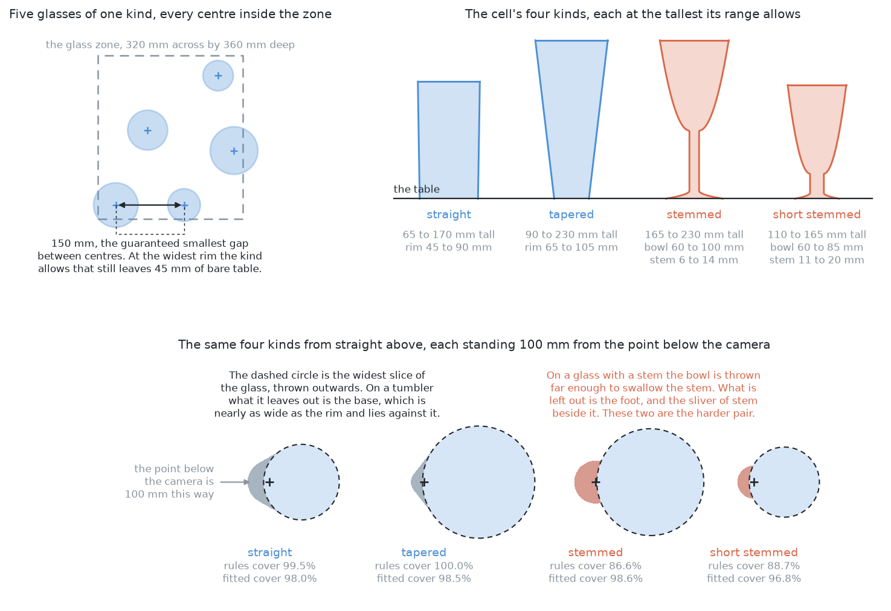
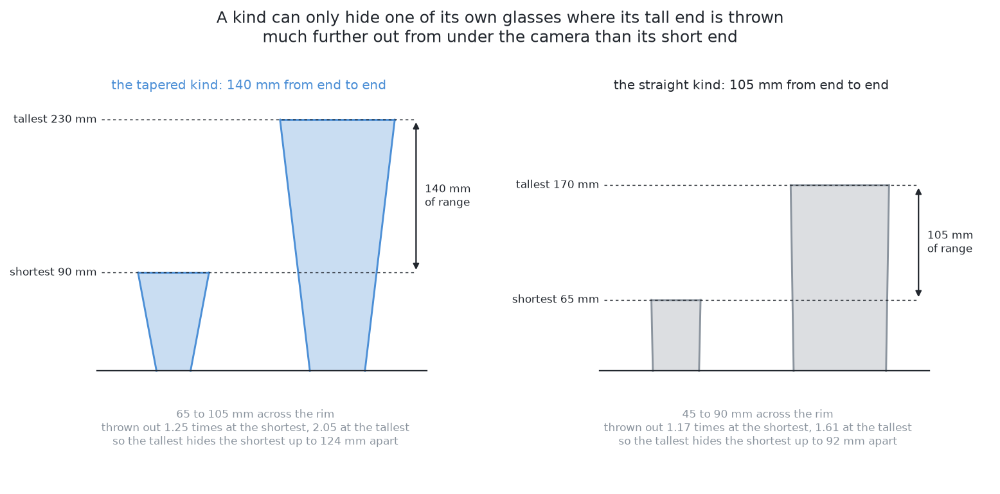
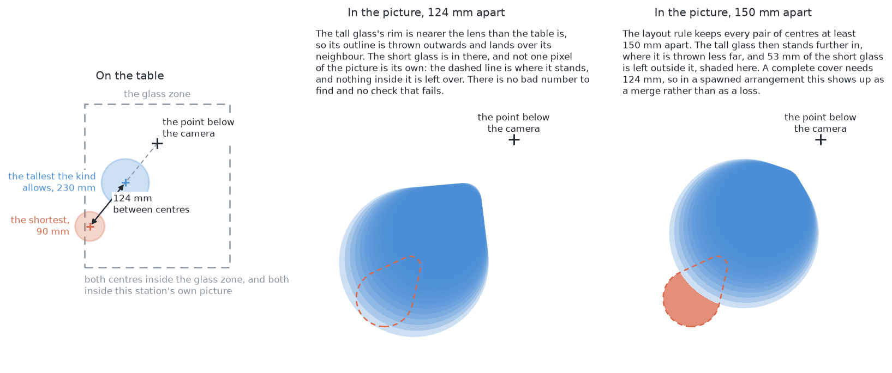
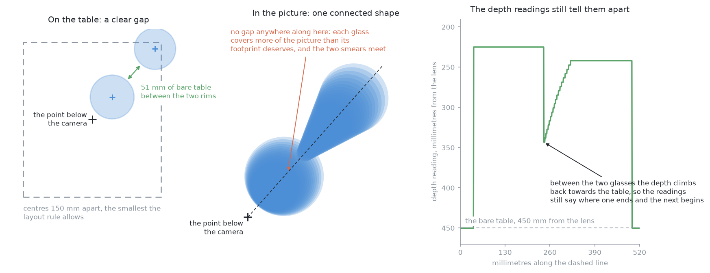
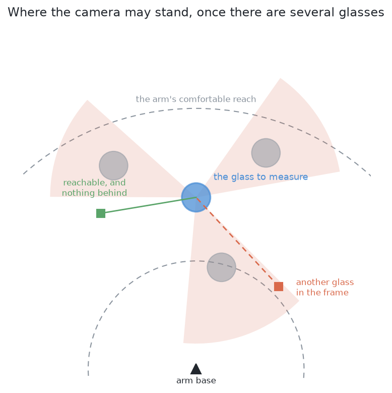

# What is asked for — segment the glasses

## 1. Introduction

Several glasses stand on the table. The arm photographs them from the top and
has to work out **which pixels belong to which glass**, and where each glass
stands. That is the whole problem: it picks nothing up and it measures no
shape. By the end of this document you will understand exactly what goes in and
exactly what must come out, because this problem is answered six different ways
and the only way to compare six answers is to give them all the same question.
You will also understand the three difficulties that make this harder than
photographing one glass, and why the hardest of the three is not that two
glasses run together in a picture but that **one of them can be absent from the
picture altogether**.

This work cell was built for a series of five jobs, and each one is harder than
the one before it because it takes away one more assumption. The first job is a
single glass carried from the table to the rack, start to finish. This book is
the second, where several glasses stand on the table and the arm has to tell
them apart. [Pushing the glasses
apart](../../09_pushing-the-glasses-apart/01_the-problem/01_what-is-asked-for.md)
is the third, where the glasses stand too close together for the gripper and the
arm has to make room. The last
two jobs are not written up here: in one, several kinds of glass stand on the
table at once, and in the other the proportions each kind is drawn from are not
known in advance. Only the second job and the third have books, so where these
pages mention a neighbouring job they describe it in words rather than sending
you to read it.

## Contents

1. [Introduction](#1-introduction)
2. [What is on the table](#2-what-is-on-the-table)
3. [What goes in](#3-what-goes-in)
4. [What must come out](#4-what-must-come-out)
5. [The three difficulties](#5-the-three-difficulties)
6. [Why one method is not enough](#6-why-one-method-is-not-enough)
7. [What is deliberately not in this problem](#7-what-is-deliberately-not-in-this-problem)
8. [What "done" means](#8-what-done-means)
9. [Where to go next](#9-where-to-go-next)

## 2. What is on the table

Four to six glasses, standing upright and opaque, drawn at proportions picked at
random inside their kind's range. The drying rack is where it always is, and
nothing else changes from the job of carrying a single glass to the rack: same
cell, same camera, same table.

**All the glasses in one arrangement are the same kind, and the kind changes
from one arrangement to the next.** The cell has four kinds, described in [the
cell](../01_the-cell.md), and the arrangements cycle through them, so a run
meets all four in turn. That matters for comparing answers, because the four
kinds are not equally hard to outline. Seen from straight above, a stem is
never a band of its own, because the bowl is thrown outwards far enough to
cover it. What a bowl-only outline loses is the foot and the sliver of stem
beside it, so the two kinds with a stem are the harder pair and the stemmed
glass is the hardest of the four. That holds for a solution built from rules
written by hand, which the marking confirms. It does not hold for a solution
fitted on this cell's own pictures, which covers all four kinds about equally
well. So the difference between the kinds is a difference between methods as
much as between shapes, which is why every answer here is broken down by kind.

**The glasses stand apart.** There is a guaranteed smallest gap between any two
centres, wide enough that even the two widest glasses of a kind leave bare table
between their rims, so no two glasses ever touch. Separating glasses that touch
is the job of [pushing the glasses apart](../../09_pushing-the-glasses-apart/01_the-problem/01_what-is-asked-for.md).

**One kind's range of sizes is deliberately very wide.** The tapered kind runs
from a small glass to one more than twice its height, which is the widest range
of the four. That width is not decoration: it is what causes the first
difficulty below, and a narrow range could not produce it at all.

## 3. What goes in

Every answer to this problem is given exactly this and nothing more.

**The survey pictures.** The arm flies the camera over the glass zone looking
straight down and parks at several overlapping stations. At each station it
takes a pair of pictures a short distance apart, so the apparent shift between
them gives depth. For each picture an answer may read three things: the grey
picture, shaded from how far away each surface is; the depth reading at every
pixel; and the camera's own pose, which the arm knows from its joint encoders.

**Nothing else.** In particular, no answer may read the simulator's record of
what it spawned. That record exists, and it is how the run is marked afterwards,
but an answer that reads it is not answering this problem.

This matters more here than in the other jobs. Six quite different methods
are compared on this question, and a comparison only means something when the
question was identical, so the input is stated once here and the [test
bench](../03_the-test-bench.md) hands exactly it to every one of them.

## 4. What must come out

**For each glass on the table, one record holding three things:**

- its **mask** — which pixels in which picture are that glass and not another;
- its **place** on the table, measured from the arm's base;
- a **rough width** of its footprint.

The place is a position rather than a full pose, and the reason is worth saying
once because it removes a question that would otherwise come up six times. A
glass stands upright on a flat table, so its axis is vertical and the only thing
left to find is where that axis meets the table. Nothing has to work out which
way a glass is turned, because a glass is the same shape from every side.

**And two honest statements, neither of which is a list of glasses:**

- **which glasses could not be separated, and why.** A pair the arm cannot tell
  apart is a result, not a failure, and it is the input to [pushing the glasses
  apart](../../09_pushing-the-glasses-apart/01_the-problem/01_what-is-asked-for.md).
- **where a glass could not have been seen at all.** This is the one that
  follows from the first difficulty below, and it is not the same as saying
  which glasses were found.

## 5. The three difficulties

They are ordered by how dangerous they are, which is not the order in which they
are easiest to notice.

### A glass can be missing from a picture altogether

A camera looking straight down does not draw a glass's outline on top of the
glass. The rim is nearer the lens than the table, so the outline is thrown
outwards, away from the point directly below the camera, and the taller the
glass the further out it is thrown. When a kind holds both short glasses and
much taller ones, a tall glass's outline can sweep right over a short neighbour
and cover it completely, and the short glass then appears in no picture at all.

How close the two have to stand for that is worth knowing, because it decides
where the difficulty appears. For the tapered kind, the tallest glass covers
the shortest only when their centres are about 124 mm apart or less, and the
pair then has to sit some 240 mm out from the point below the camera for the
throw to be large enough. At the 150 mm the layout rule guarantees, the pair
would have to sit 300 mm out, and no point that far out is both inside the
glass zone and inside that station's own picture, which reaches 252 mm at the
furthest. So a complete cover happens when the glasses stand closer than the
rule allows, and that is exactly why the arrangements come in a crowded family
as well as an ordinary one. In a spawned arrangement the same geometry shows up
as a merge instead.

This is the dangerous one because it leaves no trace. There is no bad number to
find and no check that fails. The only defence is to have worked out in advance
**where** a glass could have been hiding, which is geometry rather than
perception, and then to go and look.

### Glasses merge in the picture even when they stand apart on the table

Two glasses with clear table between them can still leave one connected shape in
the picture, because the same outward throw that hides a glass also makes each
glass cover more of the picture than its footprint deserves. A method that
treats each connected shape as one object then reports one glass where two are
standing.

This difficulty is answerable inside one station's pictures, because the depth
readings still hold the information needed to tell the two apart. It is the one
most of the six answers are really about.

### The camera can no longer stand wherever it likes

With one glass on the table, the camera could be parked anywhere around it. With
five, a glass that would give a clear view of one glass may stand inside
another, or put a third squarely in the line of sight. So choosing where to look
stops being free and becomes its own small problem, described in [looking again
at what was hidden](02_looking-again-at-what-was-hidden.md).

## 6. Why one method is not enough

The three difficulties are not independent, and the connection between them is
why this problem is worth answering carefully.

The second can be settled from the pictures already taken. The first and third
cannot. A glass that produced no pixels cannot be recovered by any amount of
work on the pixels that exist, and a glass with no clear viewpoint cannot be
measured from the viewpoints available.

So a complete answer is a **combination**: a way to place what was seen, a way
to work out what could not have been seen, and a way to go and look again. Only
the first of those differs between the six solutions. The other two are the same
for all of them, and they live in [looking again at what was
hidden](02_looking-again-at-what-was-hidden.md) so that no solution has to restate them.

## 7. What is deliberately not in this problem

**Naming the kind.** Every glass in an arrangement is the same kind and that
kind is known. The harder job where several kinds stand on the table at once is
where that stops being true.

**Measuring a shape.** A shape needs the view from the side, and whether such a
view is available is exactly what this problem is about. Once this problem has
said which glasses can be seen from where, the job of measuring a single glass
does that part exactly as it did before.

**Picking anything up.** No grasp, no lift, no rack.

**Moving anything.** If two glasses cannot be separated from any reachable
viewpoint, this problem reports that and stops. Moving them apart is the job of
[pushing the glasses apart](../../09_pushing-the-glasses-apart/01_the-problem/01_what-is-asked-for.md).

## 8. What "done" means

A run is **done** when every glass has a mask, a place and a rough width; when
every glass that could not be separated from its neighbour is listed with the
reason; and when every region of table that could not have been seen is listed
as unsearched rather than quietly treated as empty.

The [test bench](../03_the-test-bench.md) marks a run against the simulator's own record,
and it describes each measurement in full. Two of them are worth naming here,
because they are what the six answers are compared on.

**How many glasses were found, missed, merged or split** says whether the method
separated the glasses at all. Of these, **missed** is the one to watch hardest.
A split glass announces itself, because both halves are too small to be a
glass. A merged pair looks like one large glass, which is worse, because
everything downstream believes it. A missed glass leaves nothing at all.

**How much of each glass the mask actually covered** says how good the outline
was, and it is the measurement that separates methods which the others cannot.
The step that turns a mask into a place is deliberately forgiving, so two very
different masks can give almost the same place. Comparing the masks themselves
is what shows the difference.

## 9. Where to go next

- [The test bench](../03_the-test-bench.md) — the scenes, the pictures, and how a run is
  marked. Read this before any solution.
- [Looking again at what was hidden](02_looking-again-at-what-was-hidden.md) — the part every
  solution shares.
- [The six solutions](../04_the-six-solutions/01_how-the-six-compare.md) — the six answers, and what
  separates them.

← [The cell — the layout, the sensors, and the words](../01_the-cell.md) · [Looking again at what was hidden](02_looking-again-at-what-was-hidden.md) →
