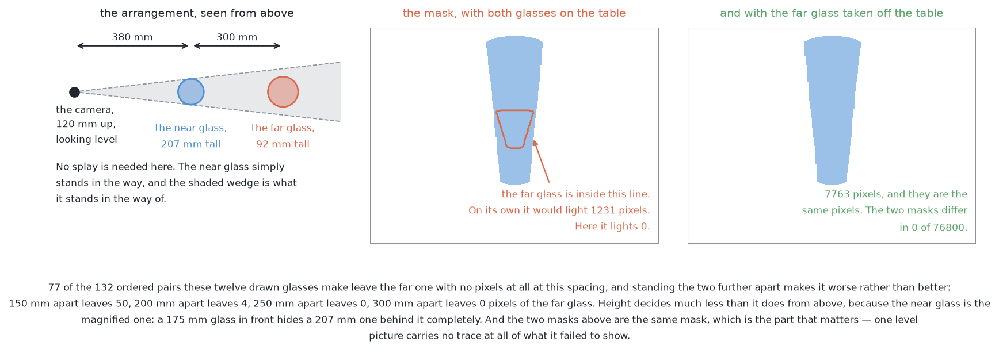
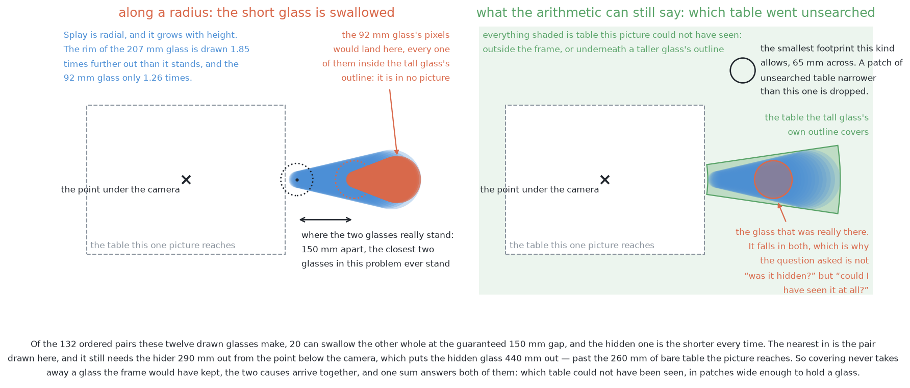
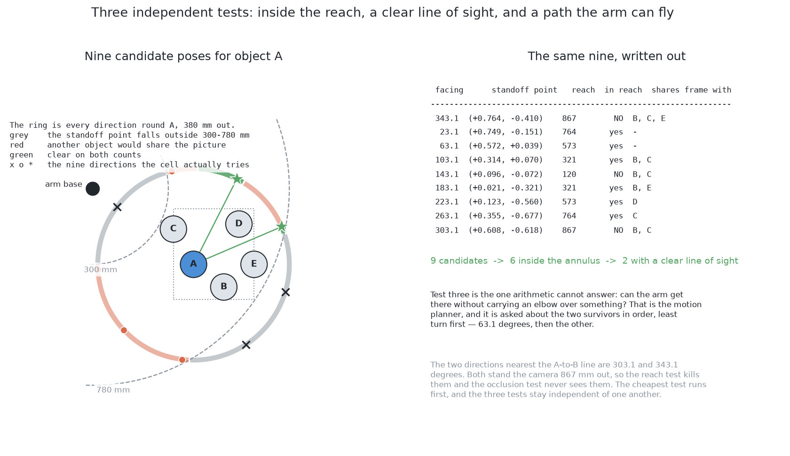
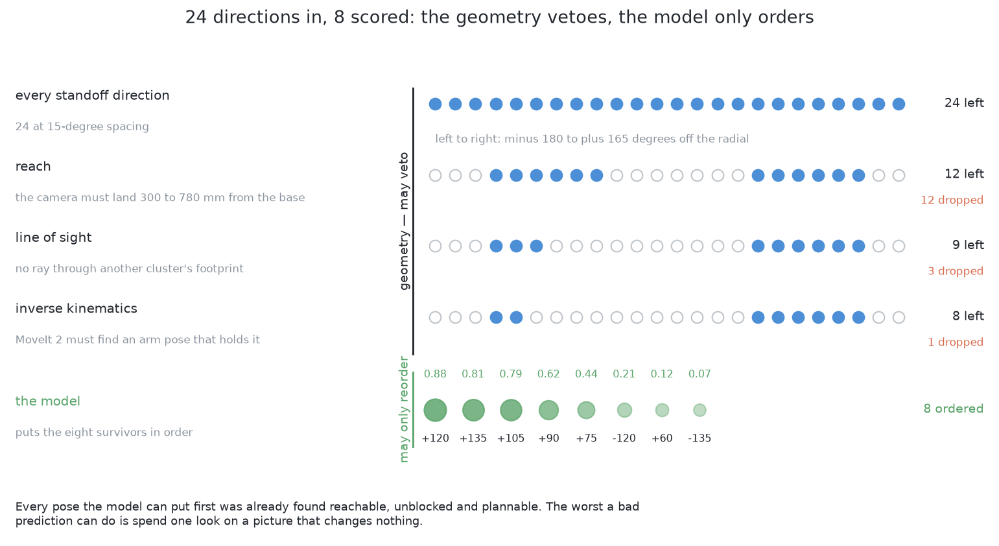
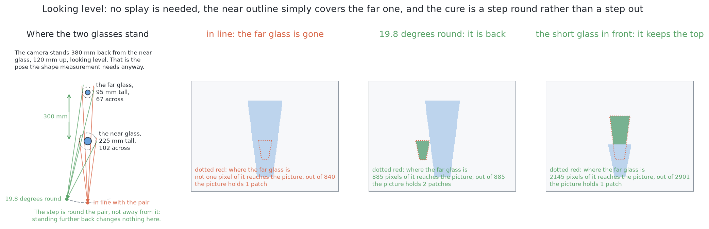

# Looking again at what was hidden

## 1. Introduction

A camera looking straight down at a table of glasses sometimes photographs only
some of them. A tall glass's outline is thrown outwards away from the point
below the camera, far enough that it can sweep over a shorter neighbour and
cover it completely, and the shorter glass then appears in no picture at all.
This document explains what is done about that, and it is deliberately separate
from the six solutions because **every one of them needs it and none of them
differs in it**. By the end you will understand why no amount of work on the
pixels can recover a glass that left none, how the arm works out *where* a glass
could have been hiding without having seen it, how choosing where to look next
becomes a covering problem with a known name, and why the one learned part in
here is placed where a wrong answer costs a few seconds rather than a glass.

**What follows is a design, and none of it is built.** The six solutions are
built and scored; this is not, and no number anywhere in this book belongs to
it. There is no code that computes the wedges, chooses where to look next, or
sends the arm back for a second picture. The other documents separate what
exists in code from what is prescribed, and this one is prescribed from
beginning to end, so read it as the answer this book proposes to its own
hardest difficulty rather than as the answer it delivered.

## Contents

1. [Introduction](#1-introduction)
2. [Why no solution can answer this on its own](#2-why-no-solution-can-answer-this-on-its-own)
3. [Step one: where could a glass have been hiding?](#3-step-one-where-could-a-glass-have-been-hiding)
4. [Step two: where should the camera stand?](#4-step-two-where-should-the-camera-stand)
5. [Step three: which look to take first](#5-step-three-which-look-to-take-first)
6. [The honest limit](#6-the-honest-limit)
7. [Where to go next](#7-where-to-go-next)

## 2. Why no solution can answer this on its own

The six solutions differ in how they turn pictures into masks. That difference
is invisible here, because the problem is not a hard mask to draw — it is that
there is nothing to draw.

A method that finds objects in a picture can only find objects the picture
contains. Where a tall glass covered a short one, those pixels show the tall
glass and nothing else, so the covered glass is not mis-measured, it is absent.
No threshold, no larger model and no better training changes that, because the
evidence is not weak, it is missing. The same holds in the other direction for
the view from the side: two arrangements, one with a far glass standing behind a
near one and one with the far glass taken away, produce the same picture pixel
for pixel, so any method that reads only the picture must answer both the same
way.

So the answer has to come from somewhere that does not depend on the picture at
all, and that somewhere is **geometry**. The arm knows where its camera was,
what its lens does, and where the glasses it *did* find are standing. From those
three it can work out which parts of the table no ray from the lens could have
reached — and that is a statement about the world rather than about the picture,
which is exactly why it survives a glass being invisible.

## 3. Step one: where could a glass have been hiding?

The arm starts from what it found, and asks what each found glass could have
been concealing.

**Each found glass hides a wedge of table behind itself.** Think of the straight
line from the lens, grazing the glass's widest part, and carrying on until it
meets the table. Everything in the shadow of that line is table the camera could
not see, and the shape of that shadow is a wedge spreading away from the point
below the camera. The taller and wider the glass, the larger its wedge. This is
the same arithmetic that explains why a glass's outline lands further out than
the glass itself, run the other way round.

**The edge of the picture hides the rest.** A camera sees a rectangle, so
anything outside that rectangle is unseen for a much simpler reason. The
stations overlap on purpose, so that a strip missed by one station falls well
inside another's picture, which is why the frame edge is a smaller worry than
the wedges.

**What is left over is reported.** Put all the wedges and all the frame edges
from all the stations together, and subtract them from the glass zone. Whatever
remains is table that nobody saw. Each remaining piece large enough to hold the
smallest footprint a glass of this kind can have is reported as an **unsearched
patch**.

That word "unsearched" is doing careful work, so it is worth being plain about
it. **An unsearched patch is not a glass, and it is not a guess that a glass is
there.** It is a statement that the question was never asked at that place. Most
unsearched patches are empty, because most hidden table really is empty. The
value of reporting them is that it converts an invisible failure into a visible
piece of work.

## 4. Step two: where should the camera stand?

Now the arm has a list of places that were never seen, and it has to choose
camera positions that would see them. This is a different question from the one
the earlier job of measuring a single glass asks, and the difference matters.

When a glass needs measuring, it has a position, so "somewhere around it, at
the right distance, looking at it" is a sensible family of poses to try. An
unsearched patch has no glass in it. There is nothing to look *at* and nothing
to stand *around*. Worse, a patch has extent rather than being a point, so a
camera position sees all of it, or part of it, or none of it.

So the test is not "is the line of sight clear?" but **"does this patch fall
inside what this camera position can see?"** — which is the wedge arithmetic
from step one run forwards instead of backwards. For a candidate position, work
out the wedges the known glasses would hide and the part of the zone that would
fall outside the frame; what is left is that position's visible region, and
testing a patch against it is a containment test.

### Three tests, and why their order matters

Not every position is usable, and the candidates are filtered before anything is
ranked. Three tests do it, and they are applied cheapest first.

**Can the arm reach it?** Pure arithmetic on the arm's own dimensions, and it
costs almost nothing.

**Would something else share the frame?** A position is refused if a known glass
would stand squarely in the line of sight, or if the camera itself would have to
occupy the space a glass is standing in. Also arithmetic, and also cheap.

**Can the arm actually fly there?** This asks the motion planner, which is by
far the most expensive of the three, so it is asked last and only about
candidates that already passed the other two.

Putting the cheap arithmetic first is not a detail. A planner query that was
never going to be used is seconds spent for nothing, and this loop runs inside a
budget.

### Which makes it a covering problem

Each surviving camera position sees some subset of the unsearched patches. The
run wants every patch seen, and every position costs seconds, so the question
becomes: **what is the smallest set of positions whose visible regions between
them cover every patch?**

That is a classical problem with a name worth knowing, which is **set cover**:
given a collection of sets and a target to cover, choose as few sets as
possible. Solving it exactly is known to be hard. The useful part is that a very
simple approximate method is provably close to the best possible — take the
candidate that covers the most patches not yet covered, and repeat until
everything is covered. That is the **greedy method**, and for set cover it is
about as good as any simple approach can be.

## 5. Step three: which look to take first

Covering says *which* positions are needed. It does not say which to take first,
and that matters because the run has a budget and may not get through the whole
set.

This is where the single learned part of the shared machinery sits: a small
model that takes the survivors and puts them in order. It is given a short list
of plain numbers about each candidate — how many unsearched patches it would
cover, how large those patches are, how many glasses are still unaccounted for
against the number the problem says to expect — and it returns a score used only
for sorting.

**Where that model sits is the whole reason it is safe to have.** The geometry
generates every candidate and refuses the unsafe ones; the model only orders
what is left. So a bad ordering costs one wasted look and nothing worse. It
cannot cause a glass to be missed, because every patch stays on the list until
something has actually looked at it, and it cannot cause a collision, because
the vetoes do not consult it. A better model makes wasted looks rarer; only the
arrangement puts a ceiling on how bad things can get.

**And it degrades to nothing.** With no model at all, the patches are covered in
whatever order the geometry suggests, and the run is slower rather than wrong.

### One number the model needs that is not in any picture

One of its inputs deserves naming, because it comes from [the problem
statement](01_what-is-asked-for.md) rather than from a sensor: **how many
glasses are on the table**. The problem says four to six, and the run knows how
many it has already placed.

That single number changes how seriously the whole list of patches should be
taken. If six glasses were expected and six were found, the patches are almost
certainly empty and the looks can be skipped. If six were expected and four
were found, two glasses are somewhere, and the patches are the only places left
for them to be. An empty result then teaches something too: the count still
stands at four, there are fewer places left, and the remaining patches become
*more* suspicious rather than less.

## 6. The honest limit

This machinery recovers a glass hidden from the top, because the wedges can be
computed and a new position can be found that sees into them. It does much less
for a glass hidden from the side.

Looking level, the strip of table behind a near glass cannot be seen from
anywhere along the line the two glasses lie on, at any distance. The request is
therefore specifically for a position off that line, which the overlapping
stations of the survey already provide — so in practice the survey closes this
case before the side views begin. What nothing closes is the general statement:
two arrangements that produce identical pictures cannot be told apart by
anything that reads those pictures.

## 7. Where to go next

- [The problem](01_what-is-asked-for.md) — what is asked for, and the three difficulties.
- [The examiner](../03_the-examiner/01_the-examiner.md) — the shared input, output and marking.
- [The six solutions](../04_the-six-solutions/01_how-the-six-compare.md) — what each one puts between the
  pictures and the masks.

← [What is asked for — segment the glasses](01_what-is-asked-for.md) · [The examiner — the same question for every answer](../03_the-examiner/01_the-examiner.md) →
