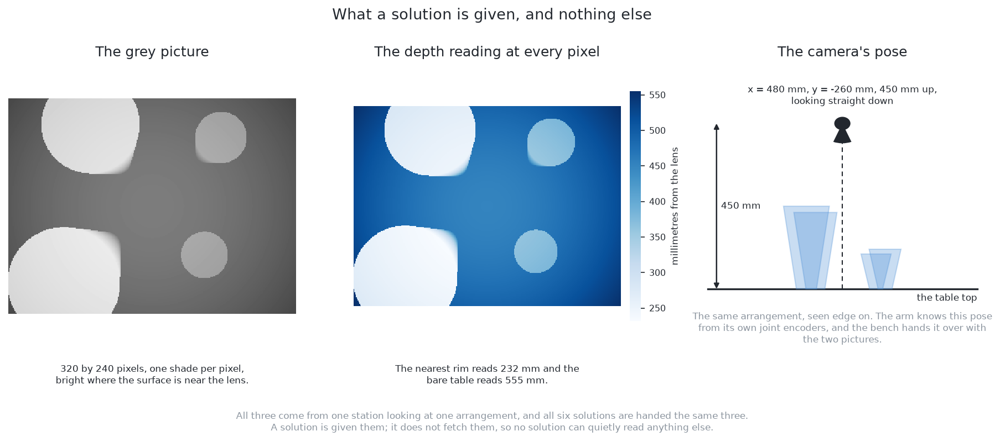
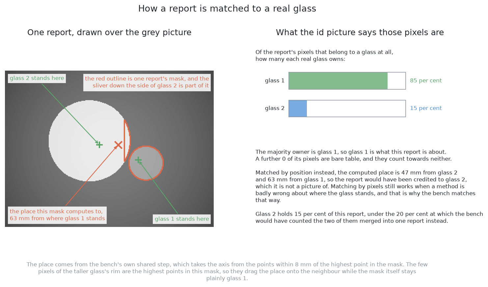
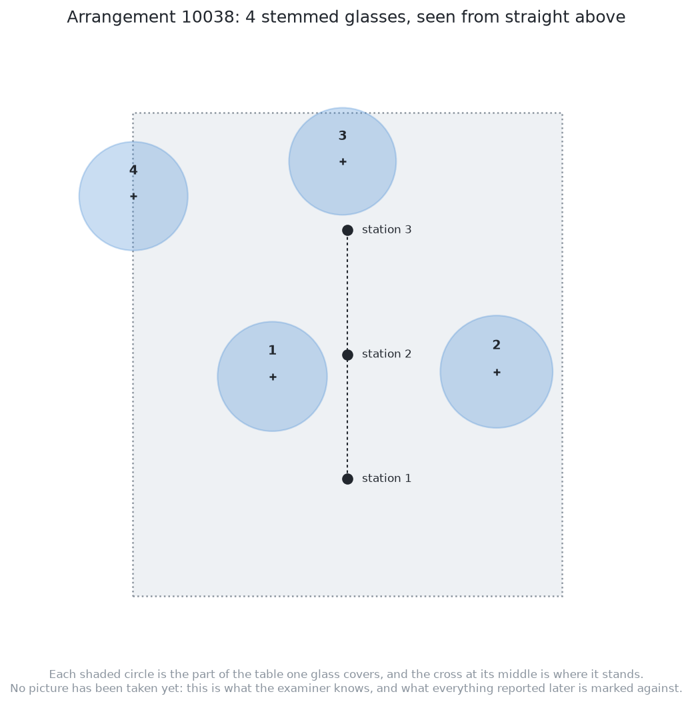
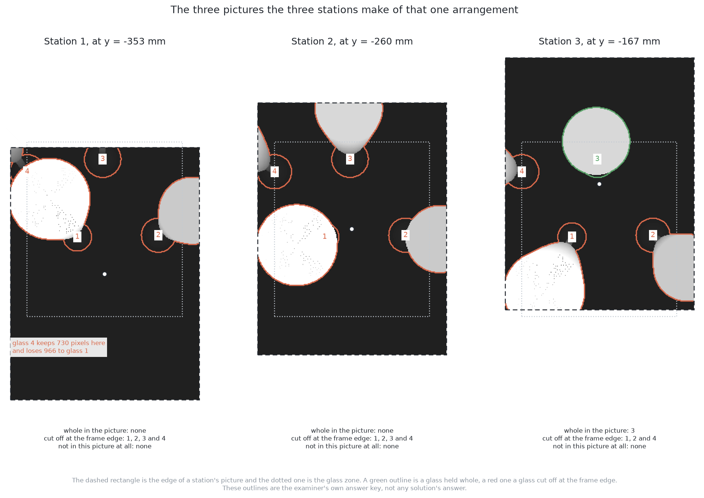
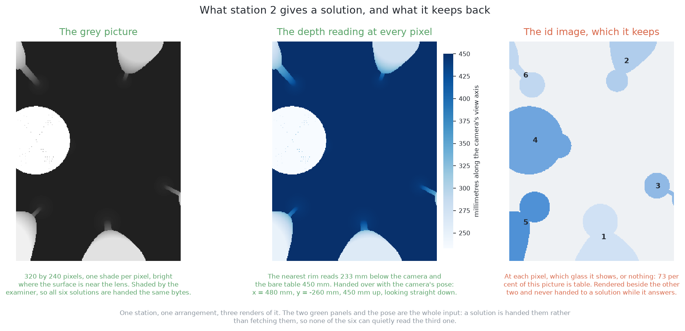
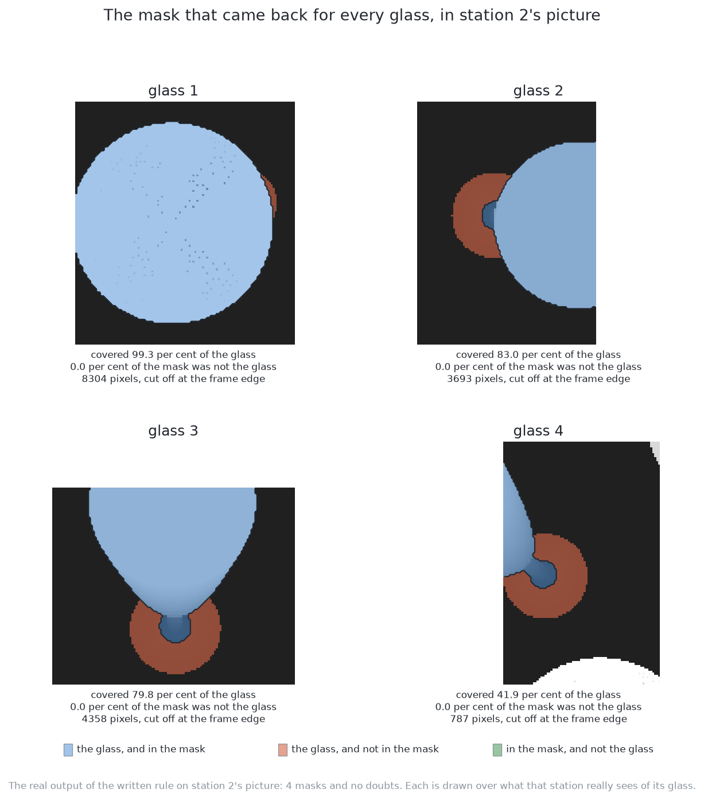
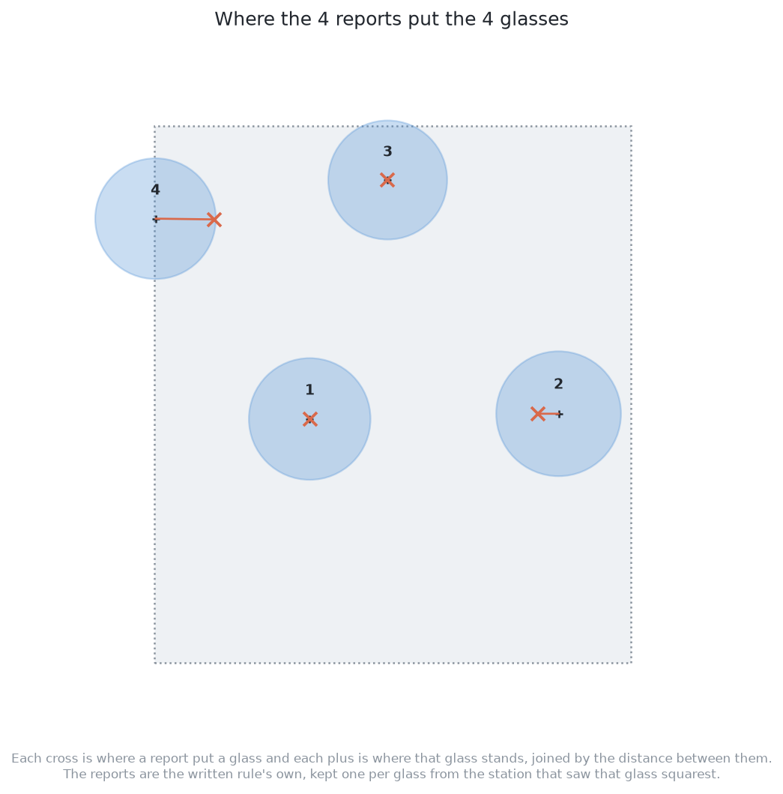

# The examiner — the same question for every answer

## 1. Introduction

This problem is answered six different ways, and six answers are only
comparable if they were asked the same question and marked the same way. The
examiner is the program that does both. It draws the arrangements of glasses,
renders the pictures, hands exactly those pictures to whichever solution is
being tried, and then marks what comes back against what it knows it put out.
By the end of this document you will understand what the examiner gives a
solution, what it keeps to itself, how a report is matched to a real glass,
which numbers decide whether one method beat another, and why one of those
numbers matters far more than it first appears.

Read this before any of the solution documents, because every one of them
assumes it.

## Contents

1. [Introduction](#1-introduction)
2. [Why there is an examiner at all](#2-why-there-is-an-examiner-at-all)
3. [What the examiner draws](#3-what-the-examiner-draws)
4. [What a solution is given](#4-what-a-solution-is-given)
5. [What the examiner keeps to itself](#5-what-the-examiner-keeps-to-itself)
6. [What must come back](#6-what-must-come-back)
7. [How a report is matched to a real glass](#7-how-a-report-is-matched-to-a-real-glass)
8. [What the examiner measures](#8-what-the-examiner-measures)
9. [One arrangement, followed all the way through](#9-one-arrangement-followed-all-the-way-through)
10. [Where to go next](#10-where-to-go-next)

## 2. Why there is an examiner at all

Without one, each method would arrive with its own arrangements and its own
idea of a good answer, and nothing could be concluded by putting their results
side by side. The examiner exists to remove every difference between the six
except the one being studied.

It does that by holding three things fixed. The **input** is the same pictures
from the same arrangements, in the same order. The **output** is the same record
per glass, produced by the same final step. The **marking** is the same set of
measurements, computed the same way. Everything a solution is free to change
sits between the input and the output, and that is exactly the part we want to
compare.

The comparison that follows from this is sharper than it sounds. Two of the six
solutions use the same model from the same library, starting from the same
downloaded weights, and one of them has had its training continued on this
cell's pictures. That training also cuts the borrowed list of everyday
categories down to a single class, because a model cannot be trained towards
this cell's labels while still being asked which household object it is looking
at — so the two changes cannot be had separately. Because the examiner holds
everything else still, nothing varies between those two that the training did
not bring, which makes the gap between them a measurement of what training
bought.

## 3. What the examiner draws

**It draws the arrangements, not Gazebo.** The real simulator would produce a
slower picture of the same thing, and a few hundred arrangements are needed, so
the examiner renders them directly from the cell's own glass shapes, the cell's own
table layout and the wrist camera's real lens. Nothing about the geometry is
invented for convenience.

**Each arrangement holds four to six glasses of one kind**, and the kind changes
from one arrangement to the next so that all four kinds are met in turn. The
glasses stand far enough apart never to touch.

**There are two families of arrangement.** The ordinary one spaces the glasses
as the cell's spawner would. The crowded one pushes them as close as the cell
allows, which is where the methods separate most, because crowding is what
creates both the merge and the complete hiding.

**Arrangements are split into a training half and a test half**, by the number
used to draw them. Anything a method is fitted on comes from below the dividing
line, and everything it is marked on comes from above it, so no method is ever
tested on an arrangement it learned from.

## 4. What a solution is given

For each arrangement, the camera is parked at several overlapping stations above
the glass zone, looking straight down. The overlap matters: a glass cut off at
the edge of one station's picture sits well inside another's.

From each picture a solution may read three things:

- the **grey picture**, shaded from how far away each surface is;
- the **depth reading** at every pixel;
- the **camera's pose**, which the arm knows from its own joint encoders.

That is the whole input. It is the same for all six, and it is handed over by
the examiner rather than fetched by the solution, so no solution can quietly read
anything else.

## 5. What the examiner keeps to itself

Every picture also carries an **id image**: at each pixel, which glass that
pixel shows, or nothing. The examiner renders it alongside the depth and never
gives it to a solution at run time.

That image is the examiner's whole power, and it is used for two different jobs
which are worth keeping apart.

**As the answer key**, it is how marking works. Because the examiner knows which
glass owns each pixel, it can decide what a returned mask is really a picture
of.

**As a training label**, it is what a fitted method learns from — but only from
the training half of the arrangements. A method may be *trained* on id images
and is never *run* on them. Any method that read one while answering would not
be answering this problem.

## 6. What must come back

One record per glass, holding its mask pixels, its place on the table, a rough
width of its footprint, and **whether the picture held the whole glass** — that
last one because a glass at the edge of a station's frame shows only part of its
footprint, so a width read off it is part of a width, and a solution refusing a
report on its width has to be able to tell which it has. The examiner observes it;
what to do about it is the solution's own. Beside those records come the two
honest statements [the problem](02_the-problem/01_what-is-asked-for.md) asks for: which glasses could not be
separated and why, and which parts of the table could not have been seen at
all. Neither is a list of glasses, and the examiner counts both rather than
treating a reported doubt as a missing answer.

**The step that turns a mask into a place and a width is the examiner's, not
the solution's.** This is the single most important decision in the whole
arrangement. Each mask pixel carries a depth reading, so the mask becomes a
cloud of points standing in the room, and the examiner reads a place and a
width off that cloud the same way for every solution. [How a mask becomes a
record](12_how-a-mask-becomes-a-record.md) sets out the arithmetic; nothing in
the comparison depends on it.

Because that step is shared, **a difference in the result belongs to the mask**.
No solution can win by measuring more cleverly, and none can lose by measuring
worse. The only thing any of them contributes is which pixels belong to which
glass, which is what this problem asks.

One consequence is worth stating plainly, because it answers a question that
would otherwise come up in all six solution documents. **No model in this book
produces a pose.** Models produce masks. The pose comes from depth and the
camera's own pose, by arithmetic, and a glass standing upright on a flat table
has no orientation left to find.

## 7. How a report is matched to a real glass

Before anything can be counted, the examiner has to decide which real glass a
report is talking about. It does this by pixels rather than by position: it
looks at the pixels the report is made of, asks the id image which real glass
owns most of them, and that majority owner is the glass the report refers to.

Matching by pixels rather than by position is deliberate, because it still works
when a method is badly wrong about where the glass stands. A report whose mask
is plainly a picture of glass number three is credited to glass number three,
even if the place it computed is well off.

## 8. What the examiner measures

### Did it separate the glasses?

Five counts come straight out of the matching, and between them they describe
every way the finding step can go right or wrong.

| Count | What it means |
|---|---|
| **put out** | how many glasses were really on the table |
| **found** | how many distinct real glasses got a report |
| **missed** | real glasses that got no report at all |
| **merged** | one report that two real glasses each own more than a fifth of |
| **split** | one real glass that collected two reports |
| **false** | a report whose pixels belong to no glass at all |

**Missed is the count to watch hardest.** A split glass announces itself,
because both halves are too small to be a glass. A merged pair looks like one
large glass, which is worse, because everything downstream believes it. A
missed glass leaves no trace at all — no bad number, no failed check, nothing
in the run to read. The only defence is to have worked out in advance where a
glass could have been hiding, which is what [looking again at what was
hidden](02_the-problem/02_looking-again-at-what-was-hidden.md) is for.

### How far out was the place?

For each glass that was found, the examiner records how far the reported place is
from the true one, and reports the middle value and the worst.

**This number saturates, and knowing that saves a lot of confusion.** The step
that turns a mask into a place is deliberately forgiving, so two quite
different masks can produce almost the same place, close enough to the floor of
error described below that the difference between them disappears into it. [How
a mask becomes a record](12_how-a-mask-becomes-a-record.md) says why it is
built that way. The consequence here is that this number stops telling the six
apart long before the masks do, which is why the mask itself has to be measured
as well.

### How good was the mask?

This is the measurement that separates methods when the place cannot, and it is
the reason the examiner looks at the mask itself rather than only at what the
arithmetic made of it.

Two numbers per glass: **how much of the real glass the mask covered**, and
**how much of the mask was not that glass**. The first catches an outline that
lost the foot of a stemmed glass or stopped at the edge of an occluder. The
second catches an outline that leaked onto the table or swallowed a neighbour.

Both are then **broken down by kind of glass**, because the four kinds are not
equally hard to outline and an average over all four would hide that.

What the breakdown shows is not what the shapes alone suggest. Seen from
straight above, a stem is never a band of its own: the bowl is thrown outwards
far enough to cover it, so what a bowl-only outline really loses is the foot
and the sliver of stem beside it. A solution built from rules written by hand
loses exactly that. It covers the two kinds without a stem almost completely,
99.5 and 100.0 per cent at the median, and the two kinds with one noticeably
less, 86.6 and 88.7. A solution fitted on this cell's own pictures does not: it
covers all four between 96.8 and 98.6 per cent. So the foot of a stemmed glass
is where a written rule runs out, and not where every method runs out.

Those two solutions differ in the other number instead, and in opposite
directions. The written rule almost never includes a pixel that is not the
glass, because it only accepts a pixel it is sure about, so it is exact about
what it claims and simply claims too little. The fitted model always includes a
few, because a learned outline follows the shape coarsely and its edge sits a
little outside the glass, so it claims the whole glass and a thin margin around
it. Neither of those two habits can be seen in the places the solutions report,
which is the reason this measurement exists at all.

The measurement is checked against the floor below, where the masks are the ones
the renderer itself drew. There both numbers come out perfect for all four
kinds, which is what a correct yardstick has to say about a perfect mask.

### The ceiling: what the best possible answer would be

One more measurement is not about any method. The examiner can run its own id
images through the shared arithmetic, as though a method had returned perfect
masks. What comes out is the **floor of error**, or equivalently the ceiling of
achievable accuracy: the best place and width the shared step can produce even
when the mask is exactly right.

That number is what makes the others readable. A method within a hair of the
floor is not a good method so much as a method whose remaining error is not its
fault, and knowing that stops effort being spent on the wrong half of the
pipeline.

It also exposes one trap that is easy to fall into. A mask may claim pixels the
camera never saw the glass at, which happens on purpose when a method predicts
the hidden part of a glass. The depth reading at such a pixel belongs to
whatever stood in front, so feeding it in drags the computed place onto the
object in front. Measured with exact masks over the 133 partly hidden glasses
of the crowded arrangements, naming those pixels and leaving them out puts the
place 12.2 mm out at the median, where feeding them in puts it 46.1 mm out. So
a mask that asserts pixels must say which ones, and the examiner excludes their
depth readings rather than guessing a value for them.

## 9. One arrangement, followed all the way through

Everything above says what happens in general. This section says it once on a
real arrangement, number 10046, which holds six stemmed glasses. Every picture
below was made by running the examiner's own code on that arrangement, and every
number on them was measured rather than chosen.

It begins with the glasses standing on the table. This is what is really there,
which only the examiner knows, and it is what everything afterwards is marked
against.

The camera then takes one picture from each of the three stations, and the three
are not interchangeable. **Station 1 holds glass 1 whole and loses glass 6
entirely**: glass 6's outline falls inside the frame, and every one of those
pixels shows glass 4, whose bowl is thrown out over it. Station 2 holds no glass
whole, because every one of the six reaches a frame edge. Station 3 holds glass
2 whole. That is the overlap doing its work: what one station loses, another
holds.

One of those three pictures, taken apart, is the whole of what a solution is
given, plus the one thing it is not. The grey picture and the depth reading go
to the solution with the camera's pose. The id picture does not.

Handed that, a solution returns one mask per glass. The masks below are the real
output of the written rule, run on station 2's grey picture and depth reading
and told only that the glasses are stemmed. Read them against the two numbers
the examiner measures. **Every one of the six lost the band at the base of its
glass**, which is where that rule stops being sure, so the coverage falls; and
not one of them claimed a pixel that was not its glass, so the second number is
zero six times over. That is the habit of a rule written by hand: it claims too
little and never too much.

A mask on its own is not a record. The examiner's own arithmetic turns it into
one, the same arithmetic for every solution, which is why a difference between
two scorecards belongs to the mask rather than to the measuring.

What this one arrangement adds to the scorecard is below. All six glasses were
found and nothing was missed, merged, split or falsely reported, which is the
easy half of the result. The hard half is in the other columns, and the worst
entries point back at the pictures above. The place is furthest out on glass 5,
at 35.5 mm, whose mask held only 1902 pixels because the station it was kept
from cut it off at the frame edge. The coverage is worst on glass 3, at 22.6
per cent, whose mask is 264 pixels: a glass seen almost edge on, with the rule
keeping only the part of it the depth readings make it sure about.

Two things are worth taking from this one arrangement before reading any
solution. **A glass is scored from the station that saw it best, not from an
average of three**, so a station losing a glass costs nothing as long as another
station holds it. And **the place error and the mask error are not the same
measurement**: this solution's places are good while its masks are missing a
fifth of some glasses, which is exactly the gap the mask numbers exist to show.

## 10. Where to go next

- [The problem](02_the-problem/01_what-is-asked-for.md) — what is asked for, and the three difficulties.
- [Looking again at what was hidden](02_the-problem/02_looking-again-at-what-was-hidden.md) — the shared part that
  recovers a glass no picture held.
- [The six solutions](04_the-six-solutions/01_how-the-six-compare.md) — what each method puts between the
  input and the output.
- [How a mask becomes a record](12_how-a-mask-becomes-a-record.md) — the
  arithmetic this document leaves out, for a reader who wants it. Nothing in
  the comparison depends on it.

← [Looking again at what was hidden](02_the-problem/02_looking-again-at-what-was-hidden.md) · [The six solutions — one question, six ways to see](04_the-six-solutions/01_how-the-six-compare.md) →
