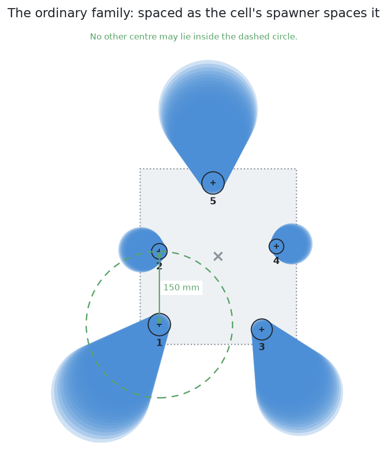
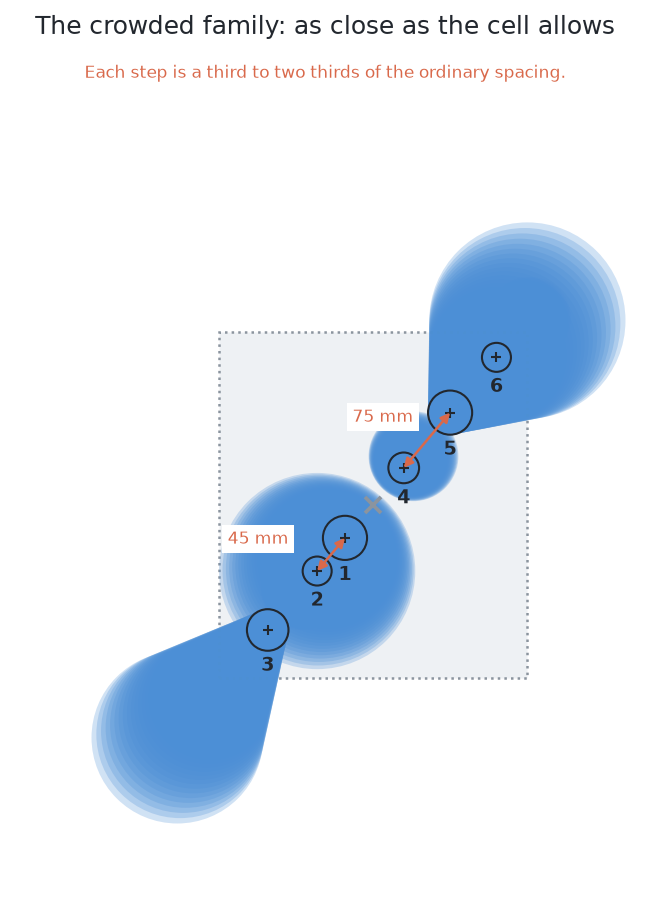

# The examiner — the same question for every answer

## 1. Introduction

This problem is answered six different ways, and six answers are only
comparable if they were asked the same question and marked the same way. The
examiner is the program that does both. It works in four steps, and the whole
of this document is those four steps in order. It **arranges** glasses on the
table and photographs them from three camera stations. It **hands** exactly
those three pictures to whichever solution is being tried. It **takes back**
what that solution returns. Then it **marks** the answer against what it knows
it put out.

Those four steps are run twice for every solution: once with the glasses spaced
as the cell normally spaces them, and once with the glasses crowded closer than
the cell allows. So each of the six comes back with two scorecards rather than
one, and section 3 says why.

By the end of this page you will know what the examiner puts on the table, why
it puts it out twice, what it gives a solution, what it keeps to itself, and
what has to come back. The
three pages after it do the same thing once on one real arrangement: [an example
of the input](02_an-example-of-the-input.md) shows the pictures that go in, [an
example of the output](03_an-example-of-the-output.md) shows the masks that come
back, and [comparing the outputs](04_comparing-the-outputs.md) is the marking.

Read this before any of the solution documents, because every one of them
assumes it.

## Contents

1. [Introduction](#1-introduction)
2. [Why there is an examiner at all](#2-why-there-is-an-examiner-at-all)
3. [What the examiner draws](#3-what-the-examiner-draws)
4. [What a solution is given](#4-what-a-solution-is-given)
5. [What the examiner keeps to itself](#5-what-the-examiner-keeps-to-itself)
6. [What must come back](#6-what-must-come-back)
7. [Where to go next](#7-where-to-go-next)

## 2. Why there is an examiner at all

Without one, each method would arrive with its own arrangements and its own
idea of a good answer, and nothing could be concluded by putting their results
side by side. The examiner exists to remove every difference between the six
except the one being studied.

It does that by holding three things fixed. The **input** is the same pictures
from the same arrangements, in the same order. The **output** is the same record
per glass, produced by the same final step. The **marking** is the same set of
measurements, computed the same way. Everything a solution is free to change
sits between the input and the output, and that is exactly the part we want to
compare.

The comparison that follows from this is sharper than it sounds. Two of the six
solutions use the same model from the same library, starting from the same
downloaded weights, and one of them has had its training continued on this
cell's pictures. That training also cuts the borrowed list of everyday
categories down to a single class, because a model cannot be trained towards
this cell's labels while still being asked which household object it is looking
at — so the two changes cannot be had separately. Because the examiner holds
everything else still, nothing varies between those two that the training did
not bring, which makes the gap between them a measurement of what training
bought.

## 3. What the examiner draws

**It draws the arrangements, not Gazebo.** The real simulator would produce a
slower picture of the same thing, and a few hundred arrangements are needed, so
the examiner renders them directly from the cell's own glass shapes, the cell's own
table layout and the wrist camera's real lens. Nothing about the geometry is
invented for convenience.

**Each arrangement holds four to six glasses of one kind**, and the kind changes
from one arrangement to the next so that all four kinds are met in turn. The
glasses stand far enough apart never to touch.

That rotation is why **a score is an average over all four kinds** rather than a
result for one. An ordinary run of 20 arrangements comes out at roughly a
quarter of each kind, and the four are not equally hard to outline, so the
examiner reports every measurement broken down by kind as well as over all of
them. [The results](../11_the-results.md) shows the breakdown where it matters
most. The problem statement explains its difficulties with the tapered kind
alone, to keep the explaining simple, but nothing is ever scored on that kind by
itself.

**There are two families of arrangement**, and the difference between them is
only how far apart the glasses stand. Both pictures below are drawn from
straight above, and both use the same limits, so the spacing in one can be
compared with the spacing in the other by eye. In each of them the shaded patch
is what the overhead camera sees of a glass, which leans outwards from the point
below the lens, and the small circle and cross is where that glass really
stands.

The **ordinary family** is what the cell's own spawner produces. It keeps 150 mm
between any two centres, which is the dashed circle in the picture: no second
centre may lie inside it. That guarantee is what leaves a strip of bare table
between every pair of glasses, and the five glasses below make five separate
patches of pixels with nothing hidden behind anything.

The **crowded family** pushes the glasses as close as the cell allows, which is
a third to two thirds of that ordinary spacing. This is where the methods
separate most, because crowding is what creates the two failures worth studying.
In the six glasses below, glasses 4, 5 and 6 run into a single patch of pixels,
so one report would cover all three of them; and glass 2 stands behind glass 1
and loses 100 per cent of its outline, so it appears in this picture not at all.
The whole arrangement makes two patches of pixels where there are six glasses.

**Arrangements are split into a training half and a test half**, by the number
used to draw them. Anything a method is fitted on comes from below the dividing
line, and everything it is marked on comes from above it, so no method is ever
tested on an arrangement it learned from.

### Every solution is tested twice, once on each family

This is the shape of the whole test, so it is worth stating on its own. **A
solution is not run once and scored once. It is run twice, once on each family,
and it comes back with two scorecards.** Both runs use the same 20 held-out
arrangements of their family, and both are marked exactly the same way, so the
only thing that changes between a solution's two scorecards is how close the
glasses were standing.

| run | arrangements | glasses | what it asks |
|---|---|---|---|
| the ordinary run | 20 | 100 | can the method do the job the cell actually sets it? |
| the crowded run | 20 | 101 | where does the method begin to break? |

Every solution gets the same two runs, so the twelve scorecards in [the
results](../11_the-results.md) are two columns of six rather than six separate
numbers. Reading a solution means reading its pair: a method that does well on
the ordinary run has met the cell's own spacing, and the distance between its
two rows is how much of that depended on the glasses standing apart.

A fitted solution is still trained only once. Its training set is drawn from
below the dividing line and holds both kinds of arrangement mixed together, so
no method meets crowding for the first time in the run that scores it.

## 4. What a solution is given

For each arrangement, the camera is parked at several overlapping stations above
the glass zone, looking straight down. The overlap matters: a glass cut off at
the edge of one station's picture sits well inside another's.

From each picture a solution may read three things:

- the **grey picture**, shaded from how far away each surface is;
- the **depth reading** at every pixel;
- the **camera's pose**, which the arm knows from its own joint encoders.

That is the whole input. It is the same for all six, and it is handed over by
the examiner rather than fetched by the solution, so no solution can quietly read
anything else.

## 5. What the examiner keeps to itself

Every picture also carries an **id image**: at each pixel, which glass that
pixel shows, or nothing. The examiner renders it alongside the depth and never
gives it to a solution at run time.

That image is the examiner's whole power, and it is used for two different jobs
which are worth keeping apart.

**As the answer key**, it is how marking works. Because the examiner knows which
glass owns each pixel, it can decide what a returned mask is really a picture
of.

**As a training label**, it is what a fitted method learns from — but only from
the training half of the arrangements. A method may be *trained* on id images
and is never *run* on them. Any method that read one while answering would not
be answering this problem.

## 6. What must come back

One record per glass, holding its mask pixels, its place on the table, a rough
width of its footprint, and **whether the picture held the whole glass** — that
last one because a glass at the edge of a station's frame shows only part of its
footprint, so a width read off it is part of a width, and a solution refusing a
report on its width has to be able to tell which it has. The examiner observes it;
what to do about it is the solution's own. Beside those records come the two
honest statements [the problem](../02_the-problem/01_what-is-asked-for.md) asks for: which glasses could not be
separated and why, and which parts of the table could not have been seen at
all. Neither is a list of glasses, and the examiner counts both rather than
treating a reported doubt as a missing answer.

**The solution picks the pixels, and the examiner does the measuring.** A mask
is a set of pixels, and three things are enough to turn it into a place on the
table and a width: the grey picture says which pixels there are, the depth
reading beside each pixel says how far away that bit of glass was, and the
camera's pose says where the camera was standing while it looked. Those are the
same three things the examiner handed over in section 4, and the examiner runs
that step itself, the same way for every solution.

So the final answer — which glass is where, and how wide — depends on nothing
but which pixels the solution chose. No solution can win by measuring more
cleverly, and none can lose by measuring worse. **The method that scores best is
simply the one whose masks pin down the exact position and size of the glasses**,
because choosing the pixels is the only thing any of the six contributes.
[How a mask becomes a record](../12_how-a-mask-becomes-a-record.md) sets out the
arithmetic of that shared step for a reader who wants it, and nothing in the
comparison depends on reading it.

One thing follows from this and is worth saying plainly here, because it would
otherwise come up in all six solution documents. **No model in this book
produces a pose.** Models produce masks. The place comes afterwards, from the
depth readings and the camera's pose, by arithmetic — and a glass standing
upright on a flat table has no orientation left for anybody to find.

That is the whole arrangement in general terms. The next page does it once, on
one real arrangement of four glasses, so that you can see what the examiner
actually hands over.

## 7. Where to go next

- [An example of the input](02_an-example-of-the-input.md) — one real
  arrangement, and the three pictures the examiner hands over for it.
- [An example of the output](03_an-example-of-the-output.md) — the masks that
  came back for that arrangement, and the record each one becomes.
- [Comparing the outputs](04_comparing-the-outputs.md) — how the examiner marks
  what came back.
- [The problem](../02_the-problem/01_what-is-asked-for.md) — what is asked for, and the two difficulties.
- [Looking again at what was hidden](../02_the-problem/02_looking-again-at-what-was-hidden.md) — the shared part that
  recovers a glass no picture held.
- [The six solutions](../04_the-six-solutions/01_how-the-six-compare.md) — what each method puts between the
  input and the output.

← [Looking again at what was hidden](../02_the-problem/02_looking-again-at-what-was-hidden.md) · [An example of the input](02_an-example-of-the-input.md) →
