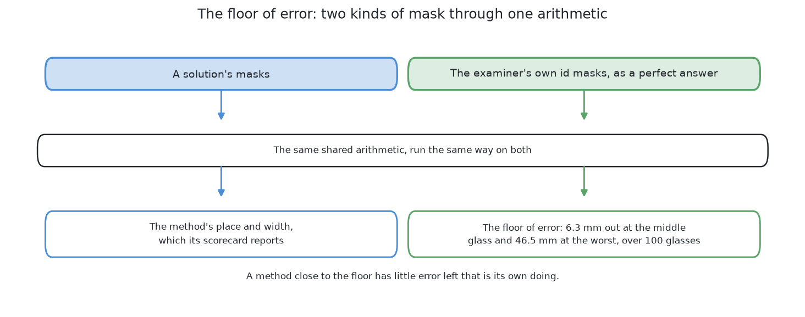
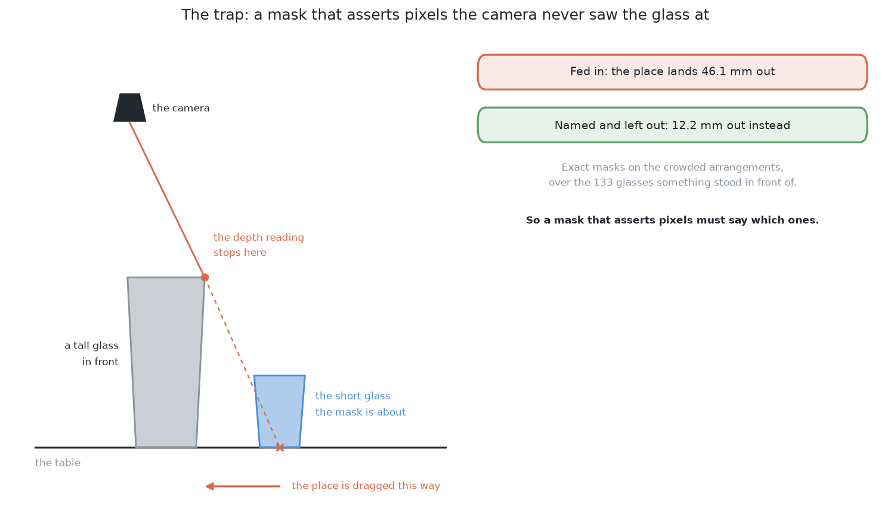

# Comparing the outputs

## 1. Introduction

The previous page, [the examiner](01_the-examiner.md), ended with six masks
handed back from one arrangement. A mask on its own is not yet an answer to
anything, and it is certainly not a score. This page is the second half of the
examiner's job: taking what came back and saying how good it is.

The marking happens in four steps, and this page is those four steps in order.
First the examiner has to work out **which real glass each report is talking
about**, because a solution hands back a set of pixels and not a name. Then it
turns each mask into **a place and a width**, using the one shared piece of
arithmetic that every solution's answer goes through. Then it asks the three
questions that make up the score: did the method **separate** the glasses, how
far out was the **place**, and how good was the **mask** itself. Finally it
compares all of that against the best answer the arithmetic could give even from
a perfect mask, which is what tells you whether a remaining error is the
method's fault at all.

The same arrangement from the previous page is carried through to the end, so
every number on this page was measured on glasses you have already seen.

## Contents

1. [Introduction](#1-introduction)
2. [Which real glass is this report about?](#2-which-real-glass-is-this-report-about)
3. [From a mask to a place and a width](#3-from-a-mask-to-a-place-and-a-width)
4. [Did it separate the glasses?](#4-did-it-separate-the-glasses)
5. [How far out was the place?](#5-how-far-out-was-the-place)
6. [How good was the mask?](#6-how-good-was-the-mask)
7. [The best possible answer, and the trap below it](#7-the-best-possible-answer-and-the-trap-below-it)
8. [What one arrangement adds to the scorecard](#8-what-one-arrangement-adds-to-the-scorecard)
9. [Where to go next](#9-where-to-go-next)

## 2. Which real glass is this report about?

Nothing can be counted until this question is answered, because a solution hands
back a set of pixels and never says which glass it thinks they belong to. The
examiner decides instead, and it decides **by pixels rather than by position**:
it looks at the pixels a report is made of, asks the id image which real glass
owns most of them, and that majority owner is the glass the report refers to.

Matching this way is deliberate, because it still works when a method is badly
wrong about where the glass stands. A report whose mask is plainly a picture of
glass number three is credited to glass number three, even if the place it
computed is well off. Matching by position would instead have credited that
report to whichever glass happened to stand near the wrong answer, and the
method would then have been marked for a mistake it did not make.

## 3. From a mask to a place and a width

Once a report is attached to a real glass, the examiner can turn its pixels into
the thing the problem actually asks for, which is a place on the table and a
rough width. As [the examiner](01_the-examiner.md#6-what-must-come-back) said,
this step belongs to the examiner and not to the solution, and it uses only the
three things every solution was given: the pixels, the depth reading beside each
one, and the camera's pose.

The picture below follows a single mask through it. The pixels become points
standing in the room, the upright axis of the glass is taken from the points at
the top of it, the width is how far the cloud of points reaches out from that
axis, and the place that falls out at the end is shown beside the place the
glass really stands.

Because every solution's masks go through exactly this, a difference between two
scorecards belongs to the masks and not to the measuring. That is what makes the
three questions below a fair comparison.

## 4. Did it separate the glasses?

This is the first and coarsest question, and it is answered by five counts that
come straight out of the matching in section 2. Between them they describe every
way the finding step can go right or wrong. Read the table as one row per thing
that can happen to a real glass or to a report.

| Count | What it means |
|---|---|
| **put out** | how many glasses were really on the table |
| **found** | how many distinct real glasses got a report |
| **missed** | real glasses that got no report at all |
| **merged** | one report that two real glasses each own more than a fifth of |
| **split** | one real glass that collected two reports |
| **false** | a report whose pixels belong to no glass at all |

**Missed is the count to watch hardest.** A split glass announces itself,
because both halves are too small to be a glass. A merged pair looks like one
large glass, which is worse, because everything downstream believes it. A
missed glass leaves no trace at all — no bad number, no failed check, nothing
in the run to read. The only defence is to have worked out in advance where a
glass could have been hiding, which is what [looking again at what was
hidden](../02_the-problem/02_looking-again-at-what-was-hidden.md) is for.

## 5. How far out was the place?

Separating the glasses is only the beginning, so the next question is how
accurate the answer is. For each glass that was found, the examiner records how
far the reported place is from the true one, and reports the middle value and
the worst.

**This number saturates, and knowing that saves a lot of confusion.** The step
in section 3 is deliberately forgiving, so two quite different masks can produce
almost the same place, close enough to the floor of error described in section 7
that the difference between them disappears into it. The consequence is that
this number stops telling the six apart long before the masks do, which is why
the mask itself has to be measured as well.

## 6. How good was the mask?

This is the measurement that separates methods when the place cannot, and it is
the reason the examiner looks at the mask itself rather than only at what the
arithmetic made of it.

There are two numbers per glass: **how much of the real glass the mask covered**,
and **how much of the mask was not that glass**. The first catches an outline
that lost the foot of a stemmed glass or stopped at the edge of whatever stood
in front. The second catches an outline that leaked onto the table or swallowed
a neighbour. Both are then **broken down by kind of glass**, because the four
kinds are not equally hard to outline and an average over all four would hide
that.

What the breakdown shows is not what the shapes alone suggest. Seen from
straight above, a stem is never a band of its own: the bowl is thrown outwards
far enough to cover it, so what a bowl-only outline really loses is the foot
and the sliver of stem beside it. A solution built from rules written by hand
loses exactly that. It covers the two kinds without a stem almost completely,
99.5 and 100.0 per cent at the median, and the two kinds with one noticeably
less, 86.6 and 88.7. A solution fitted on this cell's own pictures does not: it
covers all four between 96.8 and 98.6 per cent. So the foot of a stemmed glass
is where a written rule runs out, and not where every method runs out.

Those two solutions differ in the other number instead, and in opposite
directions. The written rule almost never includes a pixel that is not the
glass, because it only accepts a pixel it is sure about, so it is exact about
what it claims and simply claims too little. The fitted model always includes a
few, because a learned outline follows the shape coarsely and its edge sits a
little outside the glass, so it claims the whole glass and a thin margin around
it. Neither of those two habits can be seen in the places the solutions report,
which is the reason this measurement exists at all.

## 7. The best possible answer, and the trap below it

One more measurement is not about any method at all, and it is what makes the
three questions above readable. The examiner can run its own id images through
the shared arithmetic of section 3, as though a method had returned perfect
masks. What comes out is the **floor of error**: the best place and width that
step can produce even when the mask is exactly right.

A method within a hair of that floor is not a good method so much as a method
whose remaining error is not its fault, and knowing that stops effort being
spent on the wrong half of the pipeline. The measurement is also how the
yardstick itself is checked, because a correct yardstick has to report a perfect
mask as perfect, and it does, for all four kinds.

The same run exposes one trap that is easy to fall into. A mask may claim pixels
the camera never saw the glass at, which happens on purpose when a method
predicts the hidden part of a glass. The depth reading at such a pixel belongs
to whatever stood in front, so feeding it into the arithmetic drags the computed
place onto the object in front. Measured with exact masks over the 133 partly
hidden glasses of the crowded arrangements, naming those pixels and leaving them
out puts the place 12.2 mm out at the median, where feeding them in puts it 46.1
mm out. So a mask that asserts pixels must say which ones, and the examiner
excludes their depth readings rather than guessing a value for them.

## 8. What one arrangement adds to the scorecard

All four steps can now be run on the six masks from the previous page, and what
they contribute is below. All six glasses were found and nothing was missed,
merged, split or falsely reported, which is the easy half of the result.

The hard half is in the other columns, and its worst entries point back at
pictures you have already seen. The place is furthest out on glass 5, at 35.5
mm, whose mask held only 1902 pixels because the station it was kept from cut it
off at the frame edge. The coverage is worst on glass 3, at 22.6 per cent, whose
mask is 264 pixels: a glass seen almost edge on, with the rule keeping only the
part of it the depth readings make it sure about.

Two things are worth taking from this one arrangement before reading any
solution. **A glass is scored from the station that saw it best, not from an
average of three**, so a station losing a glass costs nothing as long as another
station holds it. And **the place error and the mask error are not the same
measurement**: this solution's places are good while its masks are missing a
fifth of some glasses, which is exactly the gap the mask numbers of section 6
exist to show.

## 9. Where to go next

- [The six solutions](../04_the-six-solutions/01_how-the-six-compare.md) — what each method puts between the
  input and the output.
- [The results](../11_the-results.md) — every measurement on this page, for all
  six solutions at once.
- [How a mask becomes a record](../12_how-a-mask-becomes-a-record.md) — the
  arithmetic of section 3 in full, for a reader who wants it. Nothing in the
  comparison depends on it.

← [The examiner — the same question for every answer](01_the-examiner.md) · [The six solutions — one question, six ways to see](../04_the-six-solutions/01_how-the-six-compare.md) →
