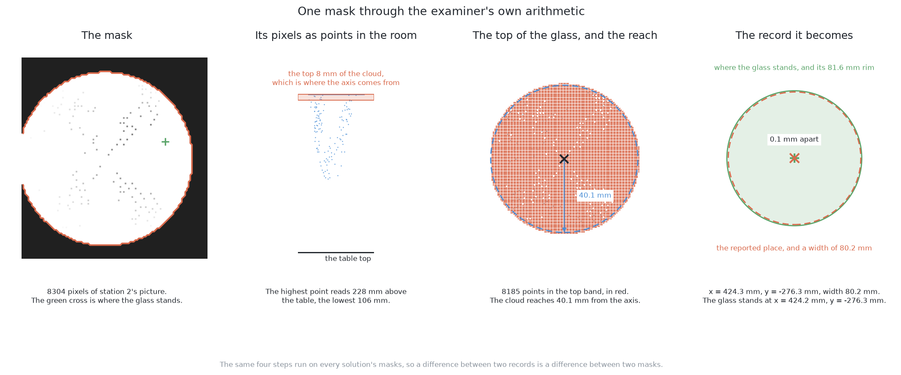

# An example of the output

## 1. Introduction

The previous page, [an example of the input](02_an-example-of-the-input.md),
ended with the three pictures of arrangement 10038 being handed over. This page
is what comes back when a solution is given them.

The solution here is the written rule, which is [the first of the
six](../04_the-six-solutions/02_rules-on-the-table.md). It was run on station
2's grey picture and depth reading and told only that the glasses are stemmed
glasses, and the masks below are its real output rather than a drawing of what
good output would look like. By the end of this page you will know what one
solution hands back, how good or bad each piece of it is, and what the examiner
turns each piece into before any marking starts.

## Contents

1. [Introduction](#1-introduction)
2. [The four masks](#2-the-four-masks)
3. [What the two mask numbers say here](#3-what-the-two-mask-numbers-say-here)
4. [From one mask to one record](#4-from-one-mask-to-one-record)
5. [Where to go next](#5-where-to-go-next)

## 2. The four masks

A solution hands back one record per glass, and the part of that record it
chooses for itself is the mask: the set of pixels it believes are that glass.
The written rule returned four masks for station 2's picture and raised no
doubts, so there is one panel per glass below.

Read each panel by its three colours. **Blue** is glass the mask got. **Red** is
glass the mask missed. **Green** is pixels the mask claimed that are not that
glass, and there is no green anywhere in this picture, which is itself a result
and is explained below.

The red in every panel sits in the same place: a band at the base of the glass,
with the foot under it. That is where the written rule stops being sure, because
it keeps a pixel only when the depth reading there makes it certain the pixel
stands above the table, and the base of a glass is exactly where that certainty
runs out. Every one of the four masks lost that band.

## 3. What the two mask numbers say here

The examiner takes two numbers off every mask: **how much of the glass the mask
covered**, and **how much of the mask was not that glass**. The four masks above
give a wide spread on the first number and the same answer every time on the
second, and both facts are worth reading.

| glass | mask covered | mask not the glass | pixels |
|---|---|---|---|
| 1 | 99.3 per cent | 0.0 per cent | 8304 |
| 2 | 83.0 per cent | 0.0 per cent | 3693 |
| 3 | 79.8 per cent | 0.0 per cent | 4358 |
| 4 | 41.9 per cent | 0.0 per cent | 787 |

**The first number depends on how much of the glass the station saw.** Glass 1
stands almost under the camera, so station 2 sees 8359 pixels of it and the mask
keeps 99.3 per cent of them. Glass 4 is at the far edge of the picture, where
station 2 sees only 1880 pixels of it, and the mask keeps 41.9 per cent. Nothing
about the rule changed between those two glasses; the view did.

**The second number is zero four times over**, because the written rule only ever
accepts a pixel it is sure about. That is the habit of a rule somebody wrote
down: it claims too little and never too much. A fitted model has the opposite
habit, because a learned outline follows the shape coarsely and its edge sits a
little outside the glass, so it covers the whole glass and claims a thin margin
of table with it. Neither habit can be seen in the places the two methods report,
which is the reason the examiner measures the mask itself as well.

## 4. From one mask to one record

A mask is not yet an answer to the question the problem asks, which is where
each glass stands. The examiner turns each mask into a place and a width itself,
the same way for every solution, and the picture below follows glass 1's mask
through that step.

Read it left to right as four steps. The **mask** is 8304 pixels of station 2's
picture. Each of those pixels carries a depth reading, so each becomes a **point
standing in the room**: the highest reads 228 mm above the table and the lowest
106 mm. The **axis** of the glass comes from the top 8 mm of that cloud rather
than from all of it, because a rim seen from above leans away from the point
below the camera while the middle of the rim still sits over where the glass
really stands; 8185 of the points fall in that band. The **width** is how far
the cloud reaches out from that axis, taken at the 95th percentile so that one
stray point cannot widen it, which here is 40.1 mm.

What comes out is the record: x = 424.3 mm, y = −276.3 mm, with a width of 80.2
mm. Glass 1 really stands at x = 424.2 mm, y = −276.3 mm with a bowl 81.6 mm
across, so the place is 0.1 mm out and the width is 1.4 mm narrow. Handed the
examiner's own exact mask of glass 1 instead of this one, the same arithmetic
lands in the same place to within a tenth of a millimetre, which says that what
little error is left here belongs to the step and to the view rather than to the
mask.

Because that step is the examiner's and is the same for all six, a difference
between two solutions' records is a difference between their masks and nothing
else. How those records are then marked is the next page.

## 5. Where to go next

- [Comparing the outputs](04_comparing-the-outputs.md) — how the examiner marks
  what came back, finished on this same arrangement.
- [An example of the input](02_an-example-of-the-input.md) — the three pictures
  these masks were made from.
- [Rules on the table](../04_the-six-solutions/02_rules-on-the-table.md) — the
  solution whose masks these are.
- [How a mask becomes a record](../12_how-a-mask-becomes-a-record.md) — the
  arithmetic of section 4 in full, for a reader who wants it.

← [An example of the input](02_an-example-of-the-input.md) · [Comparing the outputs](04_comparing-the-outputs.md) →
