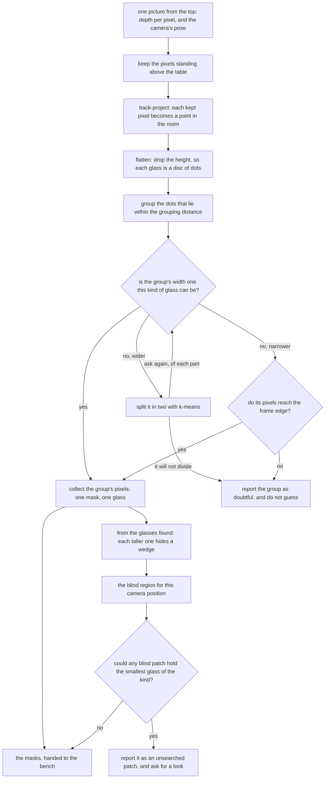

# Solution 1 — rules on the table

> **What it uses** — NumPy for the arithmetic over the depth readings, and
> OpenCV for the picture handling the cell already does. There is no model, no
> weights file, no training data and no licence condition, because no number in
> this solution was fitted to anything.
> **What it does** — Every pixel the camera hands over carries a depth reading,
> and a depth reading is enough to turn that pixel into a point in the room. So
> the solution turns the picture into a crowd of points, drops every point
> straight down onto the table, and then groups the resulting dots by nothing
> more than how far apart they are on the table. Each group is taken to be one
> glass, and the pixels that fed a group are that glass's mask. The whole method
> is one written rule applied to distances in the room, and the reason it is
> worth writing is that the rule works where the picture cannot: two glasses
> whose outlines run together in the picture are still standing well apart on
> the table.
> **How the output is produced** — from each picture, keep the pixels whose
> points stand above the table top; turn each kept pixel into a point in the
> room using its depth reading and the camera's own pose; drop the height, so
> each glass becomes a flat patch of dots on the table; join dots that lie
> within one chosen distance of each other into groups; check each group against
> the widths this kind of glass is allowed, and split a group that is too wide
> to be one glass; then hand back, for each surviving group, the picture pixels
> its dots came from. Those pixels are the mask, and the mask is the whole
> contribution.
> **How it differs from the other five** — solution 2 trains a small network
> here on this cell's own pictures, so it needs labelled arrangements and a
> training run, where this one needs neither; solution 3 runs Ultralytics
> YOLO26-seg exactly as it downloads, so it fits nothing in this cell either,
> but it carries a weights file that somebody else fitted on somebody else's
> pictures; solution 4 is that same model fine-tuned on this cell's own
> arrangements, which buys a far more reliable finding of the glasses for the
> price of labels and training time, and leaves the coarseness of its outlines
> where it was; solution 5 keeps a large promptable model, SAM 2, and fits only
> a small keeper that decides which of the many outlines it offers are glasses;
> and solution 6 fine-tunes a transformer segmenter, RF-DETR-Seg, which is the
> largest fitted model of the six. This one is the only one of the six that
> holds no fitted numbers at all, anywhere, and the only one that makes its
> decision in the room rather than in the picture.
> **What it costs** — no labels, because nothing learns; no training time, for
> the same reason; no graphics processor, because the work is a few passes over
> a small grid of numbers; and no licence condition, because the two libraries
> it uses are already in the cell and neither carries one. The whole cost is the
> thinking needed to state the rule and to justify its one setting.

> **The cell is described once, in [the cell](../01_the-cell.md)** — the layout,
> the two places the camera works from, from the top and from the side, all four
> sensors, and the words this project uses them with. What follows is only what
> is specific to this solution.

## Introduction

This document describes the one answer to [problem 2](../02_the-problem/01_what-is-asked-for.md) that
contains no model of any kind. The problem is to say which pixels belong to
which glass when several glasses stand on a table and the camera looks at them
from the top. Five of the six answers to that problem fit numbers to examples,
either here or somewhere else, and then trust the fitted numbers. This one fits
nothing. It states a rule, in words a person can read, and applies it.

The rule is possible because of one fact about the input. Every pixel arrives
with a depth reading beside it, and a pixel with a depth reading is not really a
pixel at all: it is a point in the room, waiting to be worked out. Once the
picture has become a crowd of points in the room, the question "which glass is
this?" stops being a question about the picture and becomes a question about
distance on the table. That change of place is the whole idea, and everything
else in this document follows from it.

By the end you will understand how a pixel and a depth reading become a point in
the room, why throwing the height of those points away makes the grouping easy
rather than harder, what the one grouping rule is and where its single setting
comes from, why this solution's masks are a *consequence* of the grouping rather
than the thing it directly produces, and what that costs it on the one
measurement the test bench uses to separate methods. You will also understand
why this solution is the one the other five are read against: it needs no data,
no training, no weights file and no graphics processor, so if a model cannot
beat a written rule, the model has earned nothing.

Two honest notes before the method starts, because both change how the rest
should be read.

**The method is built, and the numbers quoted below were measured by running
it.** The code is in `02-segment-glasses/01-rules-on-the-table/` and it writes
its own `results.json` beside itself. Five things this document describes are
still prescriptions rather than code, and each is named where it appears: the
grouping distance is a constant rather than computed from the two limits it sits
between, the fit returns a width and no residual, there is no
minimum-neighbours guard, a group only one station found is not reported as
doubtful, and the branch that works out where a glass could have been hiding is
arithmetic set out here rather than code that runs.

**Nothing here quotes a size.** The cell's rule is that no glass's size is
written down anywhere, so this document speaks in relations — wider than any
glass of this kind can be, narrower than the strip of bare table between two
glasses — and never in figures.

## The rule, in the code

Before going into why the method is built this way, it is worth seeing it. The
rule the introduction describes is written out in
`02-segment-glasses/01-rules-on-the-table/`, and two short pieces of it carry
the whole method: the circle fitted to a
group, and the question the fit is asked again of every part a split produces.
Everything else in the folder is the arithmetic that turns pixels into dots and
the plumbing that hands masks to the bench.

This is the fit, from ``01-rules-on-the-table/find.py``. The first function is
the one-shot least-squares solve, which is NumPy's `lstsq` and nothing else;
the second hands it the outside of the patch rather than all of the patch,
which is OpenCV's `convexHull`.

```python
def circle_width(dots: np.ndarray) -> float:
    """How wide the circle through a ring of dots is, in one solve and with no starting guess.
    ...
    """
    terms = np.column_stack([dots, np.ones(len(dots))])
    solved = np.linalg.lstsq(terms, (dots**2).sum(1), rcond=None)[0]
    x, y = solved[0] / 2.0, solved[1] / 2.0
    return 2.0 * float(np.sqrt(max(solved[2] + x * x + y * y, 0.0)))


def footprint(dots: np.ndarray) -> float:
    """How wide the circle round the patch of table a group of dots marks is.
    ...
    """
    return circle_width(cv2.convexHull(dots.astype(np.float32)).reshape(-1, 2).astype(float))
```

This is the check itself, from the same file. It is the four outcomes described
below, and the repetition is the last line of the second function asking the
first function again.

```python
def as_glasses(picture: Picture, one: Found, widths: tuple[float, float]) -> list[Found] | None:
    """The glasses one patch of dots holds, or None if the fitted circles cannot say.
    ...
    """
    width = footprint(dots_of(picture, one.pixels))
    if widths[0] <= width <= widths[1]:
        return [one]
    if width > widths[1]:
        return come_apart(picture, one, widths)
    return [one] if one.cut_off else None


def come_apart(picture: Picture, one: Found, widths: tuple[float, float]) -> list[Found] | None:
    ...
    mine = halve(dots_of(picture, one.pixels))
    if mine.all() or not mine.any():
        return None
    parts: list[Found] = []
    for half in (~mine, mine):
        ...
        got = as_glasses(picture, measured, widths)
        if got is None:
            return None
        parts.extend(got)
    return parts
```

Two things are worth reading off that. The borrowed work is two library calls,
one solve and one hull, and everything around them is this project's own; and
the fitted width never leaves these functions, because the only thing it is
allowed to decide is whether a patch comes apart. The width that goes into the
record is measured by the bench, from the pixels these functions hand back.

## The problem this solves

To state the problem we need the situation and three words, and the three words
are used in a particular way here.

The situation is the one [problem 2](../02_the-problem/01_what-is-asked-for.md) sets out. Four to six
drinking glasses stand upright on a table, all of the same kind, and the kind is
known. They stand inside the rectangle of table this project calls the glass
zone. The camera is on the arm's wrist, and for this problem it works **from the
top**, which means the arm lifts it well clear of the tallest glass the cell
handles and points it straight down. The job is to say which pixels belong to
which glass.

The first word is **mask**. A mask is a picture the same size as the camera's
picture, in which every pixel holds only yes or no, and yes means that this
pixel is believed to show a glass.

The second word is **patch**. A patch is one group of touching yes pixels — what
you get by starting at a yes pixel and spreading out to every neighbouring yes
pixel until nothing new joins. A patch is cheap to find and it is exactly what a
single glass on an empty table gives back, so it is the obvious thing to reach
for. **One patch is not the same as one glass**, however, and that gap is the
first difficulty of this problem.

The third word is the promise the problem makes about where the glasses stand.
There is a guaranteed smallest distance between the centres of any two glasses,
and it is wide enough that even the two widest glasses of a kind leave bare
table between their rims. So two glasses can never touch, and there is always a
strip of bare table between them. Everything below rests on that strip existing,
which is why it is stated here rather than assumed later.

### Why a picture from the top joins two glasses that stand apart

The reason one patch can hold two glasses is worth following, because it is also
the reason the fix has to work outside the picture.

A picture of a tall object is not a picture of its base. The camera looks down,
so the table is the furthest thing from the lens and a glass's rim is the
nearest, because the rim has climbed most of the way from the table up towards
the camera. Nearer things look larger and they also land further out from the
middle of the picture. So a glass's outline is drawn as though the glass stood
further out from the point directly below the camera than it really does, and
**the taller the glass, the further out it is thrown**. This project calls that
effect **splay**, and [the cell](../01_the-cell.md) derives it in full.

The practical result is that a tall glass's outline leans outwards, away from
the point below the camera, and it can come to rest on top of whatever stands in
that direction. Whether that matters depends on how much the heights inside one
kind differ, and in this problem one kind is deliberately very wide: its tall
glasses are more than twice the height of its short ones. A tall glass of that
kind is thrown outwards a long way while a short glass standing beyond it is
barely thrown at all, so the tall glass's outline can reach the short one and
pass over it.

That gives two failures rather than one, and they are not equally dangerous.

**The merge is the loud failure.** If the tall glass's outline reaches the short
one without covering it, the two touch and come back as a single patch. That
patch is wider than any glass of this kind can be, so something can notice.

**The complete cover is the quiet failure.** If the tall glass's outline covers
the short one entirely, the short glass contributes no pixels at all. What comes
back is one patch, of one perfectly ordinary width, with a clean outline, and
nothing about it is wrong. The picture simply holds one glass fewer than the
table does.


The second failure cannot be answered by grouping pixels better, because the
pixels are not there to group. It is answered instead by arithmetic that never
looks at the picture's contents, and [when the glasses are completely
hidden](#when-the-glasses-are-completely-hidden) is where that arithmetic is set
out. The first failure is what the rest of this method is about, and the lesson
it teaches is that no amount of care inside the picture will fix it: the picture
has already thrown away the one thing that would have kept the two glasses
apart, which is which pixels were near the camera and which were far.

## The main idea

The main idea is a change of place rather than a change of algorithm, and it is
small enough to state in two sentences.

A depth camera gives a distance for every pixel, which is enough to turn each
pixel into a point in the room: the pixel says which direction the camera was
looking, the depth says how far along that direction to travel, and the camera's
own pose says where that direction starts. Once every pixel has become a point
in the room, the glasses are told apart by distance on the table, and the strip
of bare table between two glasses — which the picture could not show us — is
simply there to be measured.

That is the whole method. Five concepts fill it in, and the sections below take
one at a time, in the order the work happens: turning a pixel into a point,
keeping only what stands above the table, throwing the height away, grouping the
dots by distance, and checking each group against the widths the kind allows.

## Turning a pixel into a point in the room

The first concept is the one everything else is built on, and it has a standard
name: **back-projection**. Projection is what a camera does when it turns a
place in the room into a place in a picture, so back-projection is that same
step run backwards.

Running it needs three inputs and no guessing. The pixel's column and row,
measured out from the middle of the picture, give the direction the camera was
looking. The depth reading at that pixel gives how far along that direction to
travel. The camera's pose says where the ray begins and which way it faces, and
the arm knows that pose exactly from its own joint encoders, which is why this
step needs nothing estimated. Scaling the sideways offsets by the depth and then
moving the result into the frame the arm works in gives one point in the room.


The lesson worth carrying away is that **a pixel on its own is not a thing; a
pixel is a direction with a distance written on it.** Two details about that
distance catch people out, and both matter here.

The first is that the depth is measured straight out along the lens axis, and
not along the slanted line from the lens to that particular pixel. So a pixel
near the corner of the picture is genuinely further from the lens than its depth
reading says, and this is exactly why the sideways offsets are needed rather
than treating the depth as the distance.

The second is that some pixels come back with no reading at all. Those are
dropped rather than guessed, because a pixel with no distance cannot be placed
anywhere in the room. That is a small loss here and a large one later, and
[where it is strong and where it
breaks](#where-it-is-strong-and-where-it-breaks) returns to it, because it is
the single assumption that would stop this method working outside the simulator.

There is one more thing the camera hands over that is easy to misread, which is
the **focal length**. Despite its name it is not a length: it is a conversion
factor between directions and pixels, and it follows from how wide an angle the
lens covers and how many pixels it spreads that angle across. A wider lens over
the same number of pixels gives a smaller focal length. The only consequence
this document needs is that, because the lens spreads a fixed angle over a fixed
number of pixels, **how much of the world one pixel covers depends only on how
far away that world is**.

That consequence explains the choice of camera height. From the survey height
one pixel covers a small patch of table top, which is coarse compared with a
ruler and fine compared with a glass, because a glass is tens of pixels across.
The ratio between those two is why a method built on counting pixels into groups
can work at all.

Doing this for every kept pixel gives a **point cloud**, which is simply a list
of positions in the room with no grid, no neighbours and no order. That loss of
structure sounds like a step backwards, and it is in fact the point:
neighbouring in the picture is the misleading idea this method is trying to
escape.

## Keeping only what stands above the table

The second concept decides which pixels are worth turning into points at all,
and it is the cheapest step in the method because of one gift the cell gives it.

Each point in the room has a height above the table, and the table's own height
is a constant the code can look up, because the table is bolted to the same
frame as the arm. So deciding whether a pixel shows the table or something
standing on it is a comparison between two numbers rather than a search for
anything. A pixel is kept when its point stands more than a small clearance
above the table top, and that clearance is chosen to be larger than the noise on
a depth reading and much smaller than the shortest glass the cell handles, so
nothing real falls between the two.

Two more comparisons trim what is left. Anything whose point stands higher than
the tallest glass the cell handles is dropped, which is mostly the arm's own
fingers passing through the picture. Anything with no depth reading is dropped,
for the reason given above. What survives is a mask of pixels that show
something standing on the table, and nothing else about them is known yet.

This step deserves its own section for a reason that returns later and is easy
to miss. **This test, and not the grouping, is what fixes the outer edge of
every mask this solution reports.** The grouping decides which glass a kept
pixel belongs to; it never adds a pixel this test threw away. So the mask stops
a small distance above the table, where the glass's wall can no longer be told
apart from the table it stands on, and it stops wherever the depth reading was
missing. No later step can recover either, and [the masks are what this
contributes](#the-masks-are-what-this-contributes) is where that matters.

## Throwing the height away

The third concept is the one that surprises people, because it discards
information on purpose. Every point is dropped straight down onto the table, so
a point in three dimensions becomes a dot in two, and the height is simply gone.

To see why that helps, look first at the shape the point cloud actually has. A
camera looking down from the top sees the side wall of a glass almost edge-on,
and an edge-on wall catches very few pixels, so there are many points on the top
of a glass, a few near its base, and almost nothing in between. The cloud is not
shaped like a glass at all. It is shaped more like a lid with a thin ring of
crumbs underneath it.

That shape is fatal if you try to group the points in three dimensions, and the
argument is worth following slowly, because it is the heart of this step. In
three dimensions, the top of a glass and the base of the **same** glass are
separated by the glass's whole height, with a hole in between where the wall
should have been. Meanwhile the nearest points of two **different** glasses are
separated only by the strip of bare table between them, and that strip is
narrower than a glass is tall. So the gap *inside* one object is larger than the
gap *between* two objects.

Once that is true, no grouping distance can work. Any distance small enough to
keep two glasses apart also cuts each glass into a top and a bottom, and any
distance large enough to hold one glass together also reaches across to its
neighbour. There is no value in between to choose, because the two requirements
have crossed over each other.

Flattening removes the problem completely. Each glass becomes a small solid disc
of dots, no taller than the paper it is drawn on, while the strip of bare table
between two discs is exactly as wide as it was, because dropping a point
straight down moves it nowhere sideways. So the gap inside one object becomes
zero and the gap between two objects is the whole strip, and a wide range of
grouping distances now works. The short way to remember it is that **height is
the dimension that varies most and tells you least**.


One caveat belongs here so that nobody reads more into the disc than it holds.
The flattened disc is not the glass's base. It is the outline of the glass's
widest horizontal slice, because that slice is what hides everything underneath
it from a camera looking down. For a glass with no stem the widest slice and the
base are nearly the same, and the difference does not matter. For a stemmed
glass, whose bowl is wider than its foot, the disc is the bowl. This problem
asks for a rough width rather than an exact one, so the widest slice is an
honest answer, and the exact shape is measured later with the camera brought
down and round to look at the glass **from the side**.

## Grouping the dots by how close they are

The fourth concept is the grouping rule itself, and now that the dots are flat
on the table it fits in one sentence.

> Start from a dot nobody has visited. Take every dot within a chosen distance
> of it. Then take every dot within that distance of those. Keep going until
> nothing new joins, and call that clump one glass. Then start again from a dot
> that has not been used.

This rule has a published name, **Euclidean cluster extraction**, and its most
important property is how little it is told. The only setting is the one
distance. Nobody tells it how many groups to find, or how large they should be,
or what shape they should have. That matters a great deal here, because a method
that is told to find five groups can never report that there were four or six,
and reporting the count honestly is part of what this problem asks for.

The rule also **chains**, which means that if A joins B and B joins C then all
three are one group, even when A and C are far apart. Chaining is what lets the
rule hold a ragged, uneven scatter of dots together without being told anything
about shape. However, chaining is also the rule's one weakness, because a single
stray dot sitting in the strip between two glasses is enough to link them into
one group.

There is a practical point about running the rule, and it is a useful habit
rather than a detail of this problem. Comparing every dot with every other dot
means a number of comparisons that grows with the square of the number of dots,
which becomes hopeless quickly. Sorting the dots into square bins fixes that,
because two dots within the grouping distance of each other must then lie in the
same bin or in a bin close by, so each dot is only ever compared with a handful
of others. The code takes that one step further and never compares two dots at
all: it marks a grid of squares much finer than the grouping distance, grows
every marked square outwards by that distance, and joins the squares that then
touch, which is two OpenCV calls over a small grid. The same idea under a
grander name is a k-d tree.

## The one setting, and where it comes from

Because there is only one setting, it is worth being careful about where its
value comes from, and the good news is that it does not come from trial and
error. It is pinned between two limits that are both known before a run starts,
and then placed in the gap between them. This is the same reasoning used when
choosing a measurement tolerance, which has to be larger than the instrument's
noise and smaller than the smallest real difference that must not be missed.

The **lower limit** is set by how far apart the dots on one glass are.
Neighbouring pixels land on neighbouring pieces of table, so the dots arrive in
a mesh whose spacing is roughly what one pixel covers. Two things change that
spacing. The top of a glass is nearer the lens than the table is, which tightens
the mesh there. But a surface seen at a slant, such as the shoulder of a glass
or the outer curve of a bowl, spreads its dots out, because one pixel now covers
a longer piece of surface. If the chosen distance is smaller than the widest
stretch anywhere in that mesh, the chain breaks in the middle of a single glass
and one glass comes back as two or three groups.

The **upper limit** is set by the strip of bare table between two glasses, and
there is a trap here worth naming. The problem promises a smallest distance
between glass **centres**, but the grouping rule measures **edge to edge**. So
the worst case is that smallest centre distance with the two widest glasses of
the kind standing in it. Take half of each glass off the centre distance, and
what is left is the narrowest strip the method will ever be shown. If the chosen
distance is larger than that strip, the chain hops across it and two glasses
come back as one.

How much room is there between those two limits? The narrowest strip the problem
allows is comfortably wider than the widest stretch in the dot mesh, so there is
a broad window and almost any sensible value inside it works. That is a reason
to compute the value rather than to relax about it. The window is wide because
of two quantities that live in two different parts of the project — the widest
rim this kind allows, and the guaranteed distance between centres — and neither
of them belongs to this solution. So the design prescribes that the grouping
distance be **computed** from those two rather than typed in, **checked from the
other side as well** against how far apart the measured dots actually fall, and
that the run print both ends of the window. A value that is derived stays
correct the day somebody widens a kind or moves the glasses closer together; a
value that was typed in once goes quietly wrong on that day, and takes a long
time to find.


Inside that window the design places the value deliberately **low** rather than
in the middle, because the two mistakes are not equally bad. A glass split into
two groups usually announces itself: half a footprint is far too narrow to be a
glass of this kind, so both halves fail the width check described next. Usually
and not always, and the exception is worth knowing, because it is the same
exception that check has to make anyway. A glass at the edge of a station's
frame is already short of its own footprint through no fault of the grouping, so
the check cannot refuse a narrow width read off a group whose pixels reach that
edge — and a half of such a glass reaches it too. There the split goes
unannounced. Two glasses merged into one group are quieter still, everywhere. So
the setting leans towards splitting, which is the mistake that mostly gets
caught.

## Checking a group against the widths the kind allows

The fifth concept is a check rather than a step, and it is what makes the method
safe to trust with a moving arm.

A glass seen from the top flattens to a disc, so each group of dots should be a
filled circle. Fitting a circle to the dots of a group gives back a centre and a
width, and the standard fit offers a third number as well: the **residual**,
which is how far the dots sit from the fitted circle on average. None of the
four outcomes below uses the residual, so the code computes only the width, and
it fits the dots on the outside of the patch rather than all of them, because a
circle fitted to a filled disc of dots comes back narrower than the disc. The
fit has a pleasant property worth knowing. Written in the obvious way the
equation of a circle is not linear in its centre and its radius, which would
normally mean an iterative search with a starting guess, but if the equation is
multiplied out and certain combinations of the unknowns are treated as the
unknowns instead, it becomes linear. So the fit has a direct solution: no
iteration, no starting guess, and the radius recovered at the end.

**This fitted width is for the check only, and not for the answer.** The test
bench computes the place and the width that go into the record, from the mask
pixels this solution hands back, and the same bench step does it for all six
solutions. So the circle fitted here never leaves this solution. It earns its
place because of what it changes: when it says a group is too wide to be one
glass, the group is split, and splitting a group changes which pixels go into
which mask. That is a decision about masks, which is this solution's own
business.

The ruler the fitted width is held against deserves attention, because it is
stronger here than it looks. Across all four kinds the cell handles, the range
of possible widths is broad, since the narrowest glass of the narrowest kind and
the widest glass of the widest kind are very different objects. Within a
*single* kind the range is much narrower, and this problem says which kind is on
the table. So the check available here is far tighter than a general-purpose
test asking only whether an object is object-sized.

The design prescribes the check as a rule that **repeats**, and it has four
outcomes. Fit one circle to the group. If its width lies inside the kind's
range, the group is one glass and its pixels are reported as one mask. If the
width is **wider** than any glass of this kind, the group is not one glass, so
it is split in two and the same question is then asked of each part: a part
inside the range is one glass, and a part still too wide is split again. If the
width is **narrower** than any glass of this kind, splitting cannot help, since
both halves of a footprint are narrower than the footprint; such a part is a
glass the picture did not hold all of when its pixels reach the edge of the
frame, and a refusal when they do not. And if any part cannot be settled either
way, the whole group is reported as doubtful, with which side of the range it
failed, rather than guessed at.


Splitting a group in two is done with a simple and well-known method called
k-means with two centres: put one seed at each end of the group's longest
direction, give each dot to whichever seed is nearer, move each seed to the
middle of the dots it was given, and repeat until nothing moves. Then fit a
circle to each half. The picture above is one round of that, and the rule above
is that round applied again to a half that is still too wide.

What makes this check worth having is that it is **arithmetic rather than
judgement**. The statement "this group is too wide to be one glass" contains two
quantities, both of which were known before the run started, and both of which
can be printed. It is not a threshold somebody adjusted until the tests passed,
and that difference is the whole reason a written rule can be trusted here.

### Why one split is not enough

Splitting once answers two glasses run together, and two is not what the
difficult arrangements hold. The bench's crowded family stands **three** glasses
to a line and two lines to an arrangement, closer together than the cell's own
layout rule allows, so a chain of three or more glasses in one group is the
ordinary case there rather than the exception. It was counted: over 20 held-out
crowded arrangements, 72 groups held more than one glass and **47 of those held
three or more**. One split into two necessarily leaves at least one part holding
two glasses, that part is still too wide, and a rule that stops after one split
can only hand the whole group over.

What the difference is worth was measured both ways on those same 20
arrangements. Stopping after one split finds **17** of 101 glasses and hands 54
groups over. Repeating the split on any part still too wide finds **71** of 101
and hands 3 over. The second reports 10 masks covering two glasses where the
first reports none, and that is the price of it; the places it reports sit
6.0 mm from the truth at the median against 0.7 mm. On the spawned arrangements,
where the layout rule keeps every glass clear of the next, the two rules find
the same 100 glasses at the same places, and repeating removes the three groups
one split had to hand over. So the repetition costs nothing where it is not
needed.

That is not a new rule so much as the natural form of the one already stated.
"A group too wide for one glass of this kind is not one glass" is a statement
about any patch of dots, including a patch that came out of a split, and
applying it to the parts is what the document means by it.

### Where the repetition stops

Nothing is counted down, and no limit is written anywhere. Each split gives both
of its parts strictly fewer dots than the part they came from, so the splitting
runs out on its own, and it runs out in one of three ways. Every part is a width
the kind allows, which is the answer. Or a part comes back narrower than the
kind allows, which splitting cannot repair. Or a part cannot be divided at all —
the halving puts every dot on one side of it, or a half holds too few depth
readings for the bench to fit a footprint to.

A group with any part left over at the end is handed over **whole**, and not in
pieces. Reporting the parts that happened to fit while dropping the one that did
not would be claiming to know how many glasses the group holds, and the one
thing the fit has just said is that it cannot say.

**The condition that two circles together account for all the dots is answered
by the repetition rather than kept as a test of its own.** It was there to catch
two circles fitted to a smear of three glasses, with the middle glass inside
neither of them; repeating the split answers that case directly, by cutting the
smear again. Keeping it as well was measured and it is strictly worse: on the
crowded arrangements it takes the run from 71 glasses found and 3 groups handed
over down to 53 found and 37 handed over, and on the spawned arrangements it
refuses 20 whole glasses that nothing else objects to. The reason is geometry
rather than bad luck. A part cut out of a filled patch by a straight line is not
a disc, so a circle fitted to it does not reach into the corners the cut left,
and the further the splitting goes the less disc-like the parts become.

## The masks are what this contributes

Every one of the six solutions is given the same input and judged on the same
output, and the step that turns a mask into a place and a rough width belongs to
the [test bench](../03_the-test-bench.md) rather than to any solution. So this solution
contributes **only the masks**, and a difference in its score belongs to the
mask. It cannot win by measuring more cleverly and it cannot lose by measuring
worse.

There is one thing about this solution's masks that is true of no other of the
six, and it has to be said plainly because it cuts both ways.

**This solution's masks are a consequence of the grouping rather than the thing
the method produces.** The other five run a model whose job is to draw an
outline: the outline is what they are trained or built to get right, and every
pixel of it is a decision the model made. Here, no step ever asks where a glass
ends. One step decides which pixels stand above the table, and a quite different
step decides which of those pixels belong together. The mask that comes out is
simply the picture pixels that fed one group, collected afterwards. Nobody chose
its edge.

That has a good consequence and a bad one, and they land on the two different
numbers the bench takes for mask quality.

**How much of the mask was not that glass** should be very good, which is the
good consequence. A pixel is put in the wrong glass's mask only if its dot
chained into the wrong group, and the two groups are a whole strip of bare table
apart, so it takes a line of stray dots across that strip for this to happen at
all. The method also never asserts a pixel it did not see. Every pixel in every
mask carried a real depth reading, which means this solution never falls into
the trap the bench warns about, where a mask claims pixels the camera never saw
the glass at and the depth reading at such a pixel belongs to whatever stood in
front. There is nothing for this solution to declare, because it claims nothing.

**How much of the real glass the mask covered** is where the consequence is bad,
and it is bad in a way that no better grouping can repair. The edge of every
mask here was fixed by the step that kept pixels standing above the table, not
by the grouping, so the mask loses two things by construction. It loses the band
at the very bottom of the glass, where the wall is too close to the table to be
told apart from it, and it loses every pixel the depth camera returned no
reading for. It loses nothing else, but those two are enough: the shortfall is a
thin rim round the base of every glass in every picture, and the grouping rule
never had a chance to recover it, because those pixels were gone before the
grouping started.

Two further points follow, and both are about how to read this solution's score
rather than about the method.

The first is that the shortfall is **the same shape for every kind of glass**.
The band lost at the base of a glass with no stem and the band lost at the foot
of a stemmed glass are both bands at the bottom of the glass, so the per-kind
breakdown the bench computes will spread this solution's coverage much less than
it spreads a model's. A model can learn an outline that follows the glass right
down to the table, so a model has room to beat this solution on coverage. A
model can also learn an outline that wanders onto the table or swallows a
neighbour, which this solution has almost no way to do. **So the two mask
numbers are expected to disagree about which method is better, and that
disagreement is itself the useful result.**

The second is that the shortfall is a property of the depth test, which means it
is a property of the input rather than of the rule. Any solution that built its
mask from the standing-above-the-table test would lose the same band, and any
solution that drew its own outline would not. That is worth knowing before
reading the numbers, because it is easy to credit a model with understanding
glasses when what it actually learned was where the table is.

## How the concepts fit together

Put in order, the five concepts make one flow with two branches that share only
their inputs. The left branch groups what was seen. The right branch works out
what could not have been seen. They meet only in the report.



Two things about that flow are worth pointing out, because the textbook version
of this recipe does more work than this one needs.

The first is the saving already described: the standard recipe finds the table
by searching the point cloud for its largest flat surface, while here the
table's height is a constant, so finding the table is a comparison rather than a
search. That is a real saving and it is worth understanding rather than copying,
because if the table were moved or the arm remounted, the constant would be
wrong in a way that a search would not be.

The second is that the right-hand branch takes its input from the **glasses
found** rather than from the pixels. It needs their positions, widths and
heights and nothing else, which is why it can say something about a glass that
produced no pixels at all. The next section is where that branch is worked out.

## When the glasses are completely hidden

Everything so far groups the glasses the pictures contain. This section is about
the glasses they do not contain, which [problem 2](../02_the-problem/01_what-is-asked-for.md) names as the
most dangerous of its three difficulties.

The difficulty was described earlier and is worth putting once more in the form
the method has to deal with. A glass can contribute no pixels at all — not a
partial arc, not a few dots, none — and then there is no group, no fitted
circle, no residual and no flag. **Every check described above is a check on
something that was found**, and not one of them can report anything about
something that was not.

So the question has to be reversed. Instead of asking "did I miss a glass?",
which nothing in the picture can answer, the method asks **"where could a glass
have been hiding?"**

That second question is one this solution is unusually well placed to answer,
and it is well placed because of the same choice that makes the rest of it work.
A method that decides inside the picture has nothing left to work with once the
pixels are gone. This one already holds, for every glass it found, where that
glass stands and how wide it is, and because each dot was born from a depth
reading it also holds how tall the glass is, from the highest point in the
group. It holds the camera's own position in the same real distances. From those
it can work out which pieces of table no ray from the lens ever reached, without
looking at the picture's contents again. The union of those pieces is the
**blind region** for that camera position.

A blind region always exists and most of it is harmless, so on its own it is a
shape rather than an answer. What turns it into an answer is the one thing the
problem guarantees about sizes: the smallest glass of a kind has a known
smallest footprint, so a blind patch matters only if it is large enough to hold
that footprint. Anything narrower cannot be hiding a glass of this kind,
whatever else it may be hiding.

Two properties of splay make that region cheap to write down rather than
expensive to search for, and both come free with the mechanism.

The first is that **splay throws a taller glass further out than a shorter one
standing at the same distance from the point below the camera.** So for any
glass, the only things that can be covering it are the glasses taller than it,
and shorter neighbours cannot reach it however close they stand. That gives a
cheap ordering: sort the glasses found by height, tallest first, and test each
one only against the ones above it in the list. It is the same idea as drawing a
scene back to front, and it turns a test over every pair into a test over about
half of them.

The second is that **splay does not change a glass's angular width about the
point below the camera at all.** Splay scales a glass's distance from that point
and its radius by the same factor, which leaves the ratio between them
unchanged, and that ratio is what fixes the angle the glass covers. So a glass
covers the same wedge of directions whatever its height, and height decides only
how far out along that wedge its outline is thrown. That is why the blind region
can be written down in closed form instead of being drawn and looked at: **the
region a glass hides is a wedge, and the only question is where along that wedge
it starts and stops.** Each taller glass contributes one such wedge, and the
edge of the frame contributes a ring outside everything. The union is the blind
region.

The word *stops* is the important one. No glass of this kind is thrown out by
more than a bounded factor, because that factor depends on the glass's own
height and the kind's tallest glass is known, so each wedge ends at a distance
the arithmetic knows and the blind region is a bounded shape.

The honest summary for this solution is that it handles the hidden case **in
part**, and the parts are worth keeping separate.

It never finds the hidden glass, because there is nothing of it to find. What it
does is say exactly where one could have been standing, as a short list of
patches, each computed from arithmetic alone and each printable. What then finds
the glass is not the arithmetic but the survey, and the reason is one more fact
about the cell. The camera does not take one picture of the glass zone. It
visits several **stations**, meaning places the arm parks it above the zone, and
the stations overlap, so most of the table appears in more than one picture.
Moving the camera moves the point below it, and every wedge swings when it does.
A glass hidden from one station is therefore very unlikely to be hidden from the
next.


So the list of patches is not what makes this solution work. It is what lets the
run **prove** that its answer is complete instead of hoping so, and it is what
would catch the problem the day somebody moves the stations, drops one of them,
widens the glass zone, or stands a glass on something. A method that relies on
the stations happening to be enough ought to be able to show that they are.

One limit of that reasoning has to be stated with it, because it is the failure
to watch for. **The arithmetic reasons from the glasses it found, so a glass
hidden behind a glass that was itself hidden is outside its reach.** It is also
only as good as the positions, widths and heights it is given, so a badly
grouped glass casts a badly computed wedge. Neither limit arises while no glass
is hidden from every station, and both arrive together the day one is.

The rest of what follows from a list of unsearched patches — how the camera is
sent to look at one, in what order, and at what cost in arm time — is the same
for all six solutions and is described once in [looking again at what was
hidden](../02_the-problem/02_looking-again-at-what-was-hidden.md), rather than six times.

## A worked example

This example follows one arrangement through the whole method. It is described
in terms of what happens rather than what is measured, and the two relations
that make it interesting were both chosen as worst cases rather than drawn at
random.

Six glasses of the widest-ranging kind stand in the glass zone. Call them G1 to
G6.

| | where it stands | how big, as this kind goes |
| --- | --- | --- |
| G1 | middle of the zone, a little to the near side | large: tall and wide |
| G2 | the far corner of the zone, out past G1 on a diagonal | middling |
| G3 | the near corner on the other side | middling |
| G4 | out along the far edge, away from G2 | middling |
| G5 | the near corner on G1's side | middling |
| G6 | on the same diagonal as G1, beyond it | the smallest the kind allows |

The first relation that matters is that **G1 and G2 are the closest pair and
they are only just legally apart**, so their centres are barely further apart
than the smallest distance this problem promises. They also lie along the
diagonal running away from the middle of the zone, which is the direction splay
throws things.

The second is that **G6 is the smallest glass of the kind and it stands beyond
the largest one, on that same diagonal**. G1 is tall, so splay throws its
outline a long way out along the diagonal, and G6 is short, so splay barely
moves it at all.

The camera goes to one station above the zone, lifted to the survey height and
pointed straight down, so the whole zone is inside the frame and nothing is lost
for an uninteresting reason.

### What grouping in the picture would return

G1 stands a short way out from the point directly below the camera, on the
diagonal towards the far corner, so splay throws its rim outwards along that
diagonal and G1's outline does not sit over G1. It leans out past it, towards
G2.

G2 stands much further out along the same diagonal, so splay throws its rim
outwards too, and by more, because the further a glass stands from the point
below the camera the further splay pushes it. That is where the trouble comes
from. G2's outline is pushed so far out that part of it runs past the edge of
the picture, and only the near part of it is drawn. G1's outline, leaning
outwards, reaches the near edge of what is left of G2's. The two outlines touch,
so collecting touching pixels into patches would give one patch where two
glasses stand, and the picture would show four patches for five visible glasses.

It is worth being careful about *why* this pair merges, because two outlines can
meet by either of two routes and the two are worth keeping apart.

The first route needs the frame edge. When two glasses of similar height stand
along the same diagonal from the point below the camera, splay pushes both
outwards and pushes the further one more, so the distance between them in the
picture **grows** rather than closes, and they meet only when one of them is
partly out of frame.

The second route needs no frame edge at all. If the nearer glass is much taller
than the further one, splay pushes the near one's outline out by a large factor
and the far one's by a small factor, so the distance between them in the picture
**closes**. Whether two outlines meet is therefore a question about the
difference in their heights as much as about where they stand.

The merged patch would run from G1's near edge all the way to the corner of the
frame, several times wider than any glass of this kind can be. So the picture
*can* tell that something is wrong. What it cannot tell is *what* is wrong —
whether one impossibly wide object, or two glasses, or three — because the one
thing that would separate them was thrown away the moment the scene became
pixels.

### What grouping on the table returns

On the table, G1 and G2 are nowhere near touching. Take the distance between
their centres, subtract half of each glass, and what is left is a strip of bare
table several times wider than the grouping distance. The chain cannot cross a
strip of nothing, so G1 and G2 come back as two separate groups. Every other
pair in the arrangement stands further apart than that pair, so every other pair
is separate too. Five groups come out of the one picture that would have given
four patches, and five masks go back to the bench.

| | the group | the mask it gives |
| --- | --- | --- |
| G1 | a full disc of dots | a complete outline, less the band at the base |
| G2 | a partial disc: its top ran past the frame edge | the near part of the glass only |
| G3 | a full disc of dots | a complete outline, less the band at the base |
| G4 | a full disc of dots | a complete outline, less the band at the base |
| G5 | a full disc of dots | a complete outline, less the band at the base |

Four of the five masks are as good as this method can make them, and the one
thing missing from each is the thin band at the base that the depth test
removed. That is the shortfall [the masks are what this
contributes](#the-masks-are-what-this-contributes) describes, and it is the same
band on all four.

G2 needs its footnote, and the footnote is the interesting part. Part of G2 is
simply not in this picture, so its group is short of dots and its mask covers
only the near part of the glass. The width a circle fitted to that group would
report is perfectly ordinary for this kind, and **that is precisely the
danger**: the arithmetic of one picture has nothing to object to. What makes it
safe is that the camera visits more than one station. Each station stands
somewhere different, so each one cuts G2 along a different line, and two
stations that put G2 in the same place have fitted it to the glass rather than
to the edge of a picture. A group that only one station found has nothing to
check against, so the design prescribes reporting it as doubtful — not because
it is probably wrong, but because it has been seen once.

### And the glass that is not in the list at all

Count the rows of that table again. There are five, and six glasses are standing
on the table.

G6 is missing, and nothing above noticed. G1 is tall and wide and stands nearer
the point below the camera, while G6 is the kind's smallest glass standing
further out along the same diagonal. Splay throws G1's outline a long way out
along that diagonal and barely moves G6's, so G1's outline sweeps over G6 and
covers it completely. G6 contributes no pixels, so there is no group, no mask
and no flag.

Look at what the checks had to work with. The width check compares a fitted
width against the kind's limits, and there is no fitted width. The residual
measures how well a circle explains a group's dots, and there are no dots. The
rule about stations agreeing asks how many stations found a group, and no group
exists to ask about. **Every check is a check on something that was found.**

Now run the other branch, the one that never looks at the pixels. G1 was found,
so where it stands, how wide it is and how tall it is are all known. Its wedge
of hidden directions can be computed, and so can the stretch of that wedge its
own outline covers. G6's position falls inside that stretch. The arithmetic does
not know that G6 is there, and it cannot, but it does know that **a patch of
table large enough to hold the kind's smallest glass lies inside that wedge and
would have left no trace.** So the patch is reported as unsearched.

The next station then settles it. From there the point below the camera has
moved, so G1's wedge has swung away and G6 is plainly visible. The union of the
two stations holds all six glasses, and the unsearched patch from the first
station is closed by the second.

That is what the arithmetic bought, and it is worth being precise about it. It
did not find G6. **It made the difference between a run that reports five
glasses and a run that reports five glasses and one place it had not looked.**
The first of those is wrong and silent. The second is incomplete and says so.

### The case the rule cannot answer

The bench never draws the next case, because it always keeps the glasses a legal
distance apart. The rule still has to behave sensibly in it, because [problem
3](../../09_pushing-the-glasses-apart/01_the-problem/01_what-is-asked-for.md) is about exactly this.

If two glasses stood closer together than the cell allows, the strip of bare
table between them would be narrower than the grouping distance, the chain would
cross it, and they would come back as one group. This is where the width check
earns its place: the circle fitted to that group would come out about twice as
wide as a glass of this kind can be, so the group would be rejected as one glass
and split in two, two circles would be fitted to the halves, and if both landed
inside the kind's range the answer would be two glasses. That answer is
recovered not by distance, which had already failed, but by the check on the
width.

If the two glasses were actually touching, there would be no strip of bare table
at any grouping distance, so distance would have nothing left to say. It would
be one group, always, and everything about the answer would then rest on the
width: the group is too wide for one glass, so it is cut in two, and the two
parts are believed only if both come back widths the kind allows. With three
touching in a row the cut repeats, and the arithmetic can still arrive at three
parts that each fit — but every one of those cuts is a straight line through a
patch of dots with no gap in it, drawn where the dots happen to divide rather
than where the glasses do, so where the masks meet is a guess and the places
read off them are worth less the more cuts it took. That is the handover to
[problem 3](../../09_pushing-the-glasses-apart/01_the-problem/01_what-is-asked-for.md), and
it is the honest edge of this method.


## What it needs

The list is short, which is the point of this solution.

**No labelled data.** Nothing in the method is fitted, so the bench's training
half of the arrangements is never read. Every arrangement is a test arrangement
for this solution, which is a small extra benefit when the four fitted solutions
can only be marked on half of them.

**No training time and no weights file.** There is nothing to train and nothing
to keep in step with the cell. A change to the cell's layout changes the two
quantities the grouping distance is pinned between, and the design has the next
run compute a new one.

**No graphics processor.** The work is a comparison over a grid of depth
readings, one multiplication per kept pixel, dropping one column of numbers, a
spreading-out step over a grid of bins, and a direct least-squares solve per
group. All of it is ordinary processor work on a small picture. The design
expects one picture to be handled in a time far too short to matter beside any
movement of the arm, because every small movement of the arm costs seconds. That
expectation follows from the amount of arithmetic rather than from a timing
anybody has taken, and it is stated that way on purpose.

**Two libraries, both already in the cell.** NumPy does the arithmetic over the
depth readings. OpenCV does the picture handling the cell already does, which
here means growing and joining the marked squares into groups, and finding the
outside of a patch of dots before a circle is fitted to it. Neither carries a
licence condition that reaches this project, which is a difference worth noting
beside the two solutions built on Ultralytics YOLO26-seg, where the licence is
a real cost rather than a footnote.

**Three things from the problem rather than from the sensor.** The method needs
the table's height, which the cell knows because the table is bolted to the
arm's own frame; the guaranteed smallest distance between two glass centres,
which is what gives the grouping distance an upper limit; and the range of
widths the kind on the table is allowed, which is what gives the width check
something to compare against. If any of the three were unavailable, the rule
could not be stated.

**And depth readings.** This is the one requirement that is not free, and it is
the one the next section is mostly about.

## Where it is strong and where it breaks

The strengths all come from how little this method assumes.

**It needs nothing fitted, so it can be read.** The rule is one sentence about
distance on the table, and its one setting is computed from two quantities the
project already holds. Anybody can read the rule, disagree with it, and say
exactly which quantity they disagree about. None of the other five offers that,
because a fitted model's rule is spread across its weights and cannot be stated
in a sentence.

**It is exact and repeatable.** The same picture gives the same groups every
time, because nothing in the method samples randomly or depends on an order.
That is worth more than it sounds when a result has to be reproduced months
later.

**When it fails, printing one number usually tells you why.** Every step
produces one quantity worth printing: how many pixels passed the
standing-above-the-table test, how many bins were marked, how many groups came
out, how many dots each group held, and each group's fitted width. These fail
in a characteristic order. A table height set slightly too low turns the whole
table top into one enormous group, and the standing-pixel count says so
immediately. A grouping distance set too small shows up as too many groups,
each with too few dots. One set too large shows up as too few groups with one
impossible width. **A fitted model's failure has no equivalent, because there
is no single number inside it that was wrong first.** That difference is the
strongest practical argument for keeping this solution in the set, whatever its
score.

**It answers in real distances from the arm's base**, because it worked in the
room the whole time rather than converting at the end. Three gifts from the cell
make that easy: the table's height is known, the glasses stand upright so they
flatten to neat discs, and only one kind of glass is on the table at a time.

**It can say where it has not looked.** Almost no perception method can, because
almost none of them has a way to tell "nothing there" from "could not have been
seen". This one can, from arithmetic it is already doing, once that branch is
built.

The weaknesses divide into one limit on the idea itself, one limit on the
sensor, and several assumptions.

**The limit on the idea is that somebody has to be able to state the rule.**
This method works here because the problem hands it a rule that can be written
down: glasses stand further apart than a known distance, so distance separates
them. The moment that promise goes, the rule goes with it. Two glasses that
touch leave no strip of bare table at any grouping distance, which is why
[problem 3](../../09_pushing-the-glasses-apart/01_the-problem/01_what-is-asked-for.md) exists; two glasses one behind the other
at the same distance from the camera stay one group, because distance cannot
separate things that are not apart in the direction being measured. And allowing
all four kinds on the table at once widens the acceptable range of widths and
weakens the width check by exactly as much, since a group that would be
impossible for the narrowest kind is ordinary for the widest, which is problem
4. In every one of those cases the fix is not a
better rule but a method that does not need one, and that is the argument for
the other five.

**The limit on the sensor is that the rule needs depth readings, and real
transparent glass does not give them.** This is the most important sentence in
the document to read honestly. Every dot in this method was born from a depth
reading, so a pixel with no reading contributes nothing. A depth camera measures
distance by what bounces back off a surface, and a beam aimed at real glassware
mostly passes straight through it, so the readings come back missing, or worse,
belonging to whatever stood behind the glass. **The cell gets away with this
only because the simulator renders the glasses as opaque solids**, which is what
the problem statement assumes. So this method would not transfer to a real table
of real glasses as it stands, and that is a limit of the method rather than of
the cell. Methods built on the grey picture rather than on the depth reading do
not share it, which is a real point in their favour and not a courtesy.

The assumptions are worth listing because each of them is true here and is still
an assumption. The method assumes a round footprint, and a jug would come back
as a width the kind allows with nothing to object to it, because the width is
the only number the fit keeps. It assumes things stand apart, which the grouping
distance is derived from rather than tuned to, but derived from an assumption is
still from an assumption. One stray dot in the wrong place chains two groups
into one, and a table height set slightly too low turns the whole table top
into one group; the guards against both are a minimum number of dots per group,
which the code applies, and the minimum-neighbours rule described in the next
section, which discards a dot with nothing around it and is not built. Finally,
points higher than the tallest glass the cell handles are dropped, and although
nothing legal is cut, the design prescribes that the run report how many points
were dropped at each end, because a sudden change there means something is
wrong that nothing else would catch.

## The general ideas behind this

None of this was invented for glassware. It is the standard recipe for a robot
arm working over a table, and has been for about twenty years: treat the depth
picture as a cloud of points, delete the table, and group whatever is left into
clumps, where each clump is one object. It became the default because of what it
does *not* need — no training data, no model file and no idea what the objects
are — so it works on an object the robot has never seen, and it gives positions
in real distances straight away, which is what an arm needs anyway.

Five published ideas sit underneath it. Each is given here with an honest note
on where it is normally right and where it is not, because four of the five
appear in almost every robot that looks at objects on a surface.

### The pinhole camera model — turning a pixel and a depth into a point

A pixel, plus a depth reading, plus the camera's pose, is a point in the room:
the pixel gives a direction, the depth says how far along it to travel, and the
pose says where the ray starts. Reversing a projection this way is called
back-projection, and it is the bridge between everything measured in pixels and
everything an arm does in real distances.

It is used in anything with a depth camera — building point clouds, turning a
detection into a pose the gripper can go to, lining separate scans up with each
other. It is rarely right for surfaces a depth sensor reads badly, such as
glass, polished metal, black plastic, or anything shiny or see-through, because
there the depth is missing or wrong and back-projection then produces confident
nonsense. That is exactly the limit described above.

For more, see the [pinhole camera
model](https://en.wikipedia.org/wiki/Pinhole_camera_model), and Hartley and
Zisserman's [Multiple View Geometry](https://www.robots.ox.ac.uk/~vgg/hzbook/).

### Plane segmentation with RANSAC — finding and deleting the table

**RANSAC**, which stands for random sample consensus, fits a model to data full
of stray readings by guessing repeatedly from small samples (Fischler and
Bolles, *CACM*, 1981). For a table that means picking three points at random,
making the plane through them, counting how many other points lie on that plane,
and keeping the best plane after a few hundred tries. Deleting the biggest plane
is how a table-top scene becomes just the objects.

It is used wherever most of the data does not belong to the model you want:
finding the ground, fitting lines and circles, joining pictures together, lining
point clouds up. It is rarely right for scenes with no dominant shape, or where
the thing you want *is* the minority and several models fit equally well. It
also does not give the same answer twice, which matters when a result has to be
repeatable.

**This solution skips it**, because the table is fixed to the arm's frame and
its height is known, so the plane is a constant and finding it is a comparison
rather than a search. For more, see
[RANSAC](https://en.wikipedia.org/wiki/Random_sample_consensus).

### Density-based clustering — grouping points by how close they are

Start from a point, take everything within a chosen distance, take everything
within that distance of those, and repeat until nothing new joins. There is one
setting and no assumption about what the objects are. In the robotics literature
this is **Euclidean cluster extraction**; its better-known cousin in the
statistics literature is **DBSCAN**, which adds a minimum-neighbours rule so
that scattered noise cannot form clusters of its own (Ester and colleagues, KDD
1996). That extra rule is what the guard described above borrows.

It is used for table-top work and bin picking, where objects are separated in
space and nobody wants to say in advance what they look like, and it is the
first thing to try on any depth picture of a scene. It is rarely right for
objects that genuinely touch, because distance can only separate things that
have distance between them. It is also poor when the right grouping distance
differs across the scene, since one number has to serve everywhere.

For more, see [DBSCAN](https://en.wikipedia.org/wiki/DBSCAN) and [cluster
analysis](https://en.wikipedia.org/wiki/Cluster_analysis) for the wider family.

### Least-squares shape fitting — turning a cloud of dots into a number

Fit a shape to a set of points by minimising an error that can be written as a
linear equation, which then has a direct solution and needs no iteration. A fit
uses every point rather than the two extreme ones, so one stray dot moves it far
less than it moves a box drawn round the extremes. And its **residual**, meaning
how far the points sit from the fitted shape on average, is a free measure of
how well the shape really explains the data.

It is used for measuring manufactured parts, which are mostly made of circles,
lines and planes, so it appears throughout metrology and inspection and anywhere
an object's geometry is known in advance. It is rarely right for shapes the
model does not describe, because then it returns a confident number together
with a large residual that nobody checks. The residual is the guard, and
ignoring it is the classic mistake.

For more, Kåsa's algebraic circle fit with the Pratt and Taubin refinements are
the three standard versions, and the geometry is in [circular
segment](https://en.wikipedia.org/wiki/Circular_segment).

### Visibility reasoning — knowing where you could not have looked

The fifth idea is the least familiar of the five, although it is old and
standard in its own field. It is that a sensor's view divides space into three
parts rather than two: the part it can see and found something in, the part it
can see and found nothing in, and **the part it could not have seen at all**.
Treating the third as if it were the second is the mistake, and it is an easy
one, because both of them look like absence in the data.

Mobile robots meet this constantly and have standard machinery for it. They keep
a map in which every cell is marked free, occupied or **unknown**, and the
unknown cells are what exploration is for: a robot that treats unknown as free
drives into walls, and one that treats it as occupied never moves. The same
three-way distinction is what turns "I found nothing there" into the two quite
different statements "there is nothing there" and "I have not looked there".

It is used for exploration and mapping, for planning when things are hidden
behind other things, and for any inspection task where saying "clear" carries a
cost if it is wrong. It is rarely done **analytically**, as it is here, because
most scenes are too irregular for the hidden region to have a closed form, so
the usual approach is to divide space into cells and trace rays through them.
This cell is the lucky case: the objects are upright round solids on a known
plane and the camera looks straight down, so the hidden region is a union of
wedges and can be computed exactly and cheaply.

For more, the general form is [occupancy grid
mapping](https://en.wikipedia.org/wiki/Occupancy_grid_mapping), where the
three-way marking is the whole point.

## Where it sits among the other five

This is the solution the other five are read against, and it is worth being
exact about why, because the comparison is sharper than "rules against models".

It is the only one of the six that holds **no fitted numbers at all**. Solution
2 fits a small network here, and solutions 4 and 6 fine-tune a borrowed model
here, so all three need labelled arrangements, a training run and a weights file
to keep in step with the cell. Solution 5 fits only a small keeper on top of SAM
2, which is much less, but it is not nothing, and the model underneath it was
fitted by somebody else. Solution 3 fits nothing in this cell, which makes it
the closest of the five to this one in cost — but it still carries a weights
file, and the rule inside that file was fitted on somebody else's photographs
for somebody else's purpose, so nobody using it can say what the rule is. **This
solution's rule is one sentence, and that is the difference.**

One more thing follows from holding no fitted numbers, and it is worth naming
because the other documents lean on it. Four of the six start from weights
fitted on photographs of the everyday world rather than on this cell's own
pictures, and that difference between the two sets of pictures is called the
**domain gap**. This solution has none — trivially, because it has no model
that could have one. Solution 2 is the one for which having no gap is a real
property, because it is fitted, and fitted here.

That is what makes it the baseline. The test bench holds the input, the output
and the marking fixed, so a model's score can be compared with this one's
directly, and the comparison has a plain reading: **if a model cannot beat a
written rule, it has earned nothing.** It cost labels, training time and
hardware that this one did not, so matching it is not a result. Beating it is,
and the bench's mask measurements are where that would show, because this
solution's masks are limited by the step that decides which pixels stand above
the table and a model's are not.

The comparison runs the other way as well, which is the part that is easy to
forget. This solution is the one that shows what the problem's *promises* are
worth. Its rule exists only because the glasses are guaranteed to stand apart,
the table's height is known, one kind is on the table at a time, and the glasses
return depth readings. Each of the five models needs fewer of those promises
than this one does, and the later problems in this project remove them one at a
time. So a reader who finds this solution convincing should read it as a
statement about the problem rather than about the method: **a problem that a
written rule can answer is a problem whose promises were generous**, and the
value of the other five is what they do when the promises stop.

← [Problem 2 — segment the glasses](../02_the-problem/01_what-is-asked-for.md) · [Solution 2 — a network
trained from scratch](03_a-network-trained-from-scratch.md) →
