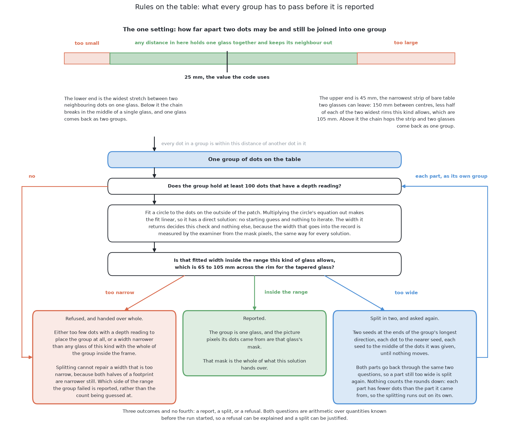

# Rules on the table

This page describes the first of the six solutions in about eight minutes of
reading. It is the one solution that holds no fitted numbers at all: it answers
the question this book asks by stating a rule in words and applying it, and
there is no model, no training set and no file of weights anywhere in it. By
the end of this page you will know the one idea it rests on, the five steps it
takes, what it costs to set up, what it scored on the shared examiner, and
the one condition it needs that a real table of real glassware would not meet.
If you then want the method in full, with every step derived and every setting
justified, [the chapter on this solution](../05_rules-on-the-table/01_what-it-is.md)
is about an hour of reading.

## Contents

1. [What it is](#1-what-it-is)
2. [How it works](#2-how-it-works)
3. [What it needs](#3-what-it-needs)
4. [What it scored](#4-what-it-scored)
5. [Where it is strong and where it breaks](#5-where-it-is-strong-and-where-it-breaks)
6. [When to choose it](#6-when-to-choose-it)

## 1. What it is

The problem this book sets is to say which pixels of a camera picture belong to
which glass, when four to six glasses of one known kind stand upright on a
table and the camera looks down at them from above. [What is asked
for](../02_the-problem/01_what-is-asked-for.md) states that question in full.
The difficulty is that a picture from the top can join two glasses that stand
well apart on the table, because the camera sees a tall glass's rim much closer
than it sees the table, so the glass is drawn as though it stood further out
from the point below the camera than it really does. Two outlines then touch,
and the pixels come back as one shape.

This solution's answer is to stop asking the question about the picture and ask
it about the room instead. Every pixel the camera hands over carries a depth
reading beside it, and a pixel with a depth reading is not really a pixel: it
is a point in the room waiting to be worked out, because the pixel says which
direction the camera was looking, the depth says how far along that direction
to travel, and the camera's own pose says where that direction starts. Once
every pixel has become a point in the room, "which glass is this?" becomes a
question about distance on the table, and the strip of bare table between two
glasses, which the picture could not show, is simply there to be measured.

That change of place is the whole solution. The rule that follows from it is one
sentence long: dots that lie within one chosen distance of each other on the
table belong to the same glass. The rule is possible only because the problem
promises that no two glasses stand closer than a known distance, so there is
always bare table between them, and the rule stops working the moment that
promise does.

## 2. How it works

The work happens in five steps, in this order, and each one hands its result to
the next.

**It keeps the pixels that stand above the table.** The table is bolted to the
arm's own frame, so its height is a known constant rather than something to be
searched for, and deciding whether a point stands above it is a comparison
rather than a fit. Points higher than the tallest glass the cell handles are
dropped as well.

**It turns each kept pixel into a point in the room.** This is the step
described above, and the arithmetic for it is the standard pinhole camera model
run backwards, which is called back-projection.

**It throws the height away.** Each point keeps where it stands on the table
and loses how high it is, so a glass stops being a hollow tube of points and
becomes a flat patch of dots. That sounds like a loss and is not: an upright
glass flattens to a solid disc of dots, while the strip of bare table between
two glasses stays exactly as wide as it was.

**It groups the dots by how close they are.** Start from one dot, take every
dot within the chosen distance, take every dot within that distance of those,
and repeat until nothing new joins. Each group is taken to be one glass. The
robotics literature calls this Euclidean cluster extraction, and its
better-known relative in statistics is DBSCAN.

**It checks each group against the widths the kind allows.** A circle is fitted
to each group by least squares, which uses every dot rather than the two
extreme ones, so a stray dot moves the answer far less than it would move a box
drawn round the edges. A group wider than any glass of this kind can be is two
glasses that were joined, and it is split. The pixels that fed each surviving
group are that glass's mask, so the masks are a consequence of the grouping
rather than the thing the method directly produces.

The one setting is the grouping distance, and it is not tuned. It is pinned
between two quantities the project already holds: it has to be larger than the
gaps between dots on one glass, and smaller than the narrowest strip of bare
table two glasses can leave. The window between those two limits is wide, which
is why the value can be computed from the limits instead of being tried out.

## 3. What it needs

The list is short, and its shortness is the point of this solution.

It needs **no labelled data**, because nothing in it is fitted, so every
arrangement is a test arrangement. It needs **no training run and no file of
weights**, so there is nothing to keep in step with the cell. It needs **no
graphics processor**, because the work is a few passes over a small grid of
numbers and one direct least-squares solve per group. It needs **two libraries,
both already in the cell**: NumPy for the arithmetic over the depth readings and
OpenCV for the picture handling. Neither carries a licence condition, which is a
real difference from the two solutions built on Ultralytics YOLO26-seg.

It needs **three facts from the problem rather than from the sensor**: the
table's height, the guaranteed smallest distance between two glass centres, and
the range of widths the kind on the table is allowed. Without any one of the
three the rule could not be stated at all.

And it needs **depth readings**. That is the one requirement that is not free,
and section 5 is mostly about it.

## 4. What it scored

Every solution is given the same arrangements and marked the same way by [the
examiner](../03_the-examiner.md), which is what makes the numbers below
comparable. There are two sets: spawned layouts, at the spacing the cell's own
layout rule gives, and crowded layouts, closer than that rule allows. The
columns say how many real glasses got a report, how many got none, and how good
the masks were.

| | found | missed | merged | position median | mask covered | mask not the glass |
|---|---|---|---|---|---|---|
| spawned, 100 glasses | 100 | 0 | 0 | 8.5 mm | 98.9% | 0.0% |
| crowded, 101 glasses | 71 | 30 | 10 | 6.0 mm | 94.6% | 0.0% |

On the spawned layouts it found every glass, which no other solution in the
book did. That is the result to take seriously, because those are the
arrangements the cell actually produces, and the rule was derived for exactly
their spacing. Its masks never leaked onto a neighbour or onto the table in
either set, which is what the zero in the last column means.

On the crowded layouts it missed thirty glasses and merged ten pairs, and both
failures have one cause: the promise the rule was derived from has been
withdrawn, so the strip of bare table the grouping distance relies on is
sometimes not there. Its position error is the largest of the six on the
spawned layouts, which matters less than it looks, because that number
saturates by design. The full table, with all six solutions, is in [the
results](../11_the-results.md).

## 5. Where it is strong and where it breaks

Its strengths all come from how little it assumes.

**The rule can be read, disagreed with and argued about**, because it is one
sentence and its one setting is computed from two quantities the project holds.
No fitted model offers that, because a fitted model's rule is spread across its
weights. **It is exact and repeatable**, since nothing in it samples randomly.
**When it fails, printing one number usually says why**: a table height set
slightly too low turns the whole table top into one enormous group and the
count of standing pixels says so at once, while a grouping distance set too
small gives too many groups with too few dots each. A fitted model has no
equivalent, because there is no single number inside it that was wrong first.
And **it can say where it has not looked**, which almost no perception method
can, because the hidden region behind an upright round solid on a known plane
can be computed exactly.

Its weaknesses are one limit on the idea and one limit on the sensor.

**The limit on the idea is that somebody has to be able to state the rule.**
This works here because the problem hands it a usable promise. Two glasses that
actually touch leave no bare table at any grouping distance, which is why [the
job of pushing crowded glasses
apart](../../09_pushing-the-glasses-apart/01_the-problem/01_what-is-asked-for.md)
exists at all, and allowing several kinds of glass on one table widens the
acceptable range of widths and weakens the width check by the same amount.

**The limit on the sensor is the most important sentence on this page.** Every
dot in this method was born from a depth reading, and real transparent glass
does not give depth readings, because a depth camera measures distance by what
bounces back and a beam aimed at glassware mostly passes straight through it.
This cell gets away with it only because the simulator renders the glasses as
opaque solids. So this method would not transfer to a real table of real
glasses as it stands, and methods built on the grey picture rather than on the
depth reading do not share that limit.

## 6. When to choose it

Choose this solution when the depth readings are reliable and a rule can
honestly be written down for the spacing the objects keep. In that case it is
the better tool in almost every way that is not accuracy: it needs no data, no
training, no weights and no licence, it explains its own failures, and it
answers in real distances from the arm's base because it worked in the room the
whole time.

Do not choose it when the objects may touch, when several kinds of object share
a table, or when the surfaces are transparent, polished or dark enough that a
depth camera reads them badly. In each of those cases the repair is not a
better rule but a method that needs no rule, and that is the argument for the
other five.

This is also the solution the other five are read against. It cost no labels,
no training time and no hardware, so a model that merely matches it has earned
nothing. The comparison runs the other way as well: this solution's rule exists
only because the glasses are guaranteed to stand apart, the table's height is
known, one kind is on the table at a time, and the glasses return depth
readings. **A problem that a written rule can answer is a problem whose
promises were generous**, and what the other five are for is the day those
promises stop.

The code is in
[`src/08_seeing-the-glasses/01-rules-on-the-table/`](../../../code/src/08_seeing-the-glasses/01-rules-on-the-table)
and it writes its own `results.json` beside itself. The full treatment, which
derives each step, justifies the one setting, works through a crowded
arrangement by hand and lists the published ideas the method is assembled from,
starts at [what it
is](../05_rules-on-the-table/01_what-it-is.md).

← [The six solutions — one question, six ways to see](01_how-the-six-compare.md) · [A network trained from scratch](03_a-network-trained-from-scratch.md) →
