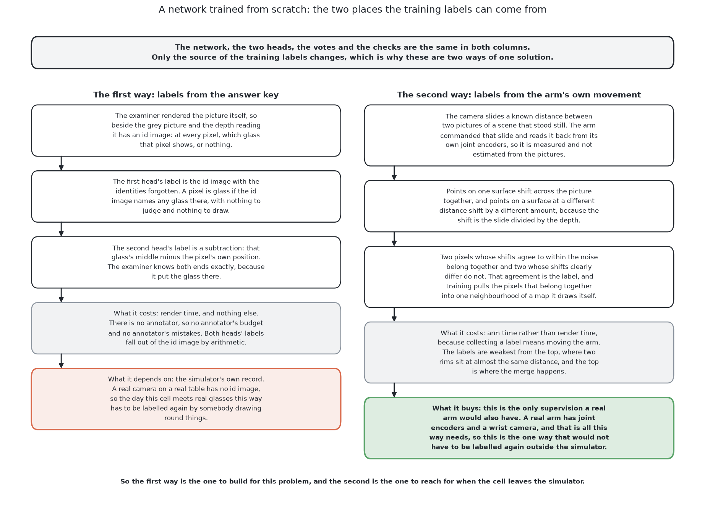

# A network trained from scratch

This page describes the second of the six solutions in about eight minutes of
reading. It is the one solution that fits every number it holds on this cell's
own pictures and borrows nothing from anybody, so it is the control for the
whole comparison: whatever the four borrowed models achieve, the distance
between them and this one is the measurement of what borrowing was worth. By
the end of this page you will know what the network is asked to predict, why
that choice separates glasses whose outlines run together in the picture, what
the training costs, what it scored on the shared examiner, and the one
failure no amount of training can remove. The full method, with the shape of
the network and both ways its labels can be produced, is in [the chapter on
this solution](../06_a-network-trained-from-scratch/01_what-it-is.md), which is
about an hour of reading.

## Contents

1. [What it is](#1-what-it-is)
2. [How it works](#2-how-it-works)
3. [What it needs](#3-what-it-needs)
4. [What it scored](#4-what-it-scored)
5. [Where it is strong and where it breaks](#5-where-it-is-strong-and-where-it-breaks)
6. [When to choose it](#6-when-to-choose-it)

## 1. What it is

A **neural network** here means a stack of numbers, called weights, arranged so
that a picture can be pushed through them and something useful comes out the
other end. The weights start as random numbers and are then changed, a little
at a time, until the output matches examples whose answers are known. That
process is called **training**, and **training from scratch** means starting
from those random numbers rather than from weights somebody else has already
fitted.

This solution trains one small network from scratch, inside this cell, on
pictures this cell renders. Nothing is downloaded. The reason to do that is not
that it is the cheapest way to get a good answer, because it is not. The reason
is that four of the other five solutions begin from weights fitted on
photographs of the everyday world, while this cell renders a grey picture shaded
from depth readings. The difference between the pictures a model was fitted on
and the pictures it is asked about is called the **domain gap**, and it is the
single most important idea for reading this chapter. This solution has no
domain gap, because everything it knows came from the pictures it will be shown.
That makes it the line the borrowed models are measured against.

## 2. How it works

The interesting decision is not the shape of the network but what the network is
asked to predict, so that is where this section starts.

The obvious thing to ask for is a label at every pixel saying whether that pixel
is glass. That is called **semantic segmentation**, and on its own it is not
enough here, because a class label has nowhere to record *which* glass a pixel
belongs to. Two glasses whose outlines run together give one connected region of
glass pixels, and nothing in the labels says where to cut it.

So the network answers two questions instead of one, from one shared body of
weights.

**The first question is asked of every pixel: is this pixel glass?** That gives
the region.

**The second question is asked only of the glass pixels: which way does the
middle of my own glass lie?** The answer is an arrow. Each glass pixel then
casts one vote for the place its arrow points at, so every pixel of one glass
votes for roughly the same place, and the votes pile up there. One glass makes
one pile and two glasses make two piles. The glasses are the piles, counted
afterwards, and a connected region comes apart into separate glasses **without
any rule for cutting it having been written down**.

That voting idea is old and well tested. It is the Hough transform, in which a
single piece of local evidence cannot say where a shape is but can vote for
every shape that would explain it, with the hand-built table of offsets
replaced by a learned one. Its value here is that voting survives things being
hidden: a crescent of surviving pixels on a partly covered glass still votes
towards the right middle, because each pixel votes on its own and the votes
never have to be joined to each other or to form a recognisable shape.

The network itself is the standard shape for a small segmentation problem, an
encoder and decoder with skip connections, known as a **U-Net**. It halves the
resolution repeatedly while widening the channels, then enlarges it back,
copying each level on the way down across to the matching level on the way up,
so that detail lost going down is available coming back. It was designed for
biomedical pictures with very few training examples, which is exactly why it
suits a small rendered training set.

Where the labels come from is the one place this solution has two ways. The
first way takes them from the examiner's own answer key, which records which glass
owns each pixel, so the labels are exact and cost only render time. The second
way takes them from the arm's own movement instead: the camera is moved a known
distance between two pictures, and points on one rigid surface then move
together in the picture while points on a surface at a different distance do
not. That is enough to group pixels with no answer key at all, which is the idea
called self-supervised learning. The first way is what the numbers below come
from.

## 3. What it needs

This is the most demanding of the six to set up, and it is worth being plain
about that.

It needs **PyTorch**, running on this machine's integrated graphics through
Apple's Metal Performance Shaders, the software layer through which PyTorch
reaches the graphics processor on an Apple machine. No dedicated graphics card
is required, and nothing is
downloaded, so no licence condition applies to anything it uses.

It needs **a training set**. For the first way that is arrangements rendered by
the examiner together with their answer keys, which costs render time and nothing
else. For the second way it is pairs of pictures with the camera's movement
logged beside each one, which costs arm time.

It needs **a training run before it can answer anything at all**. The network is
small and the pictures are small, so the run is short enough on this machine to
be repeated whenever the cell changes, and that property is what makes the next
cost bearable.

It needs **a file of weights kept in step with the cell**, and this is the cost
that is easiest to forget. The code says what the cell is; the weights say what
the cell looked like when they were fitted. Change the lighting, the camera, or
the range of proportions a kind of glass is drawn from, and the file is quietly
out of date in a way that no test of the code will notice.

At run time it needs very little: one pass of a small network over a small
picture, which is nothing beside the seconds an arm movement costs.

## 4. What it scored

Every solution is given the same arrangements and marked the same way by [the
examiner](../03_the-examiner.md). There are two sets: spawned layouts, at
the spacing the cell's own layout rule gives, and crowded layouts, closer than
that rule allows. Read the rows against each other rather than on their own.

| | found | missed | merged | position median | mask covered | mask not the glass |
|---|---|---|---|---|---|---|
| spawned, 100 glasses | 63 | 37 | 0 | 0.5 mm | 98.2% | 1.5% |
| crowded, 101 glasses | 72 | 29 | 1 | 0.7 mm | 97.2% | 1.4% |

Two things in this table are worth reading carefully, and they point in opposite
directions.

**Its positions are the most accurate in the book**, at half a millimetre on
both sets, and it merged almost nothing. When this solution reports a glass, the
report is very good.

**It reported far too few of them.** It found 63 of 100 glasses on the easy set,
which is the worst finding rate of any solution here except the borrowed model
that was never trained. It is also the one solution that does *better* on the
crowded set than on the spawned one, which is a strong hint that the shortfall
is in the training set rather than in the idea: the crowded arrangements are
over-represented in what it was fitted on. The full table for all six is in
[the results](../11_the-results.md).

## 5. Where it is strong and where it breaks

**It has no domain gap**, which is the one strength no borrowed model can claim,
and the reason this solution is the control for the comparison.

**It separates glasses that are joined in the picture**, and it does so without
anything having to find a boundary, so nothing can get a boundary wrong. The
separation survives cases where there is no gap anywhere to find.

**It is unusually good at a partly hidden glass**, because a crescent of
surviving pixels still votes towards the right middle.

**Its doubt costs nothing.** How many votes a pile holds is a confidence figure
for that glass, measured from the votes rather than asked of the network, which
is a better kind of warning than most learned methods give.

Against that:

**It is blind to a glass hidden completely.** No pixels means no votes, no pile
and no short count. That is a fact about the input rather than about the model,
and it is answered by geometry instead, in [looking again at what was
hidden](../02_the-problem/02_looking-again-at-what-was-hidden.md).

**It answers nothing until it has been trained**, where a borrowed model can be
pointed at a picture on the day it is downloaded. That gap in setup cost is
real.

**Its answer cannot explain itself.** When a fitted circle is wrong you can
print one number and see why; when a network is wrong you can look at the
picture and guess.

**Its weights are a second copy of the cell**, and keeping them in step with the
first copy is a maintenance job that [rules on the
table](02_rules-on-the-table.md) simply does not have.

## 6. When to choose it

Choose this when the labels are free and the pictures are nothing like
photographs. Both conditions hold here, because the renderer knows which glass
owns each pixel and hands that over for nothing, and because the input is depth
shaded into grey rather than a photograph of a room. In that situation starting
from somebody else's weights brings knowledge of a world the model will never
see, and starting from random numbers costs little, since the network is small
and the training run is short.

Do not generalise from that. Fine-tuning a larger model wins whenever labels
are scarce, which is almost always, and this cell is the narrow exception rather
than the rule.

The comparison this solution exists for is the gap between its line and the
four borrowed ones: **if a model fitted somewhere else does no better than a
small network fitted here from random numbers, then its size and its licence
bought nothing in this cell.** One pairing nearby is sharper still and is worth
knowing while reading this one. [A borrowed model, as it
downloads](04_a-borrowed-model-as-it-downloads.md) and [the same model,
fine-tuned](05_the-same-model-fine-tuned.md) are the same model from the same
library with the same starting weights, and the only difference between them is
whether it was trained here. That gap measures what training bought; the gap
between this solution and the pair of them measures what the starting weights
bought.

The code is in
[`src/08_seeing-the-glasses/02-train-from-scratch/`](../../../code/src/08_seeing-the-glasses/02-train-from-scratch)
and it writes its own `results.json` beside itself. The full treatment, with the
network's shape set out layer by layer, both ways of producing the labels, and
the published ideas behind the voting, starts at [what it
is](../06_a-network-trained-from-scratch/01_what-it-is.md).

← [Rules on the table](02_rules-on-the-table.md) · [A borrowed model, as it downloads](04_a-borrowed-model-as-it-downloads.md) →
