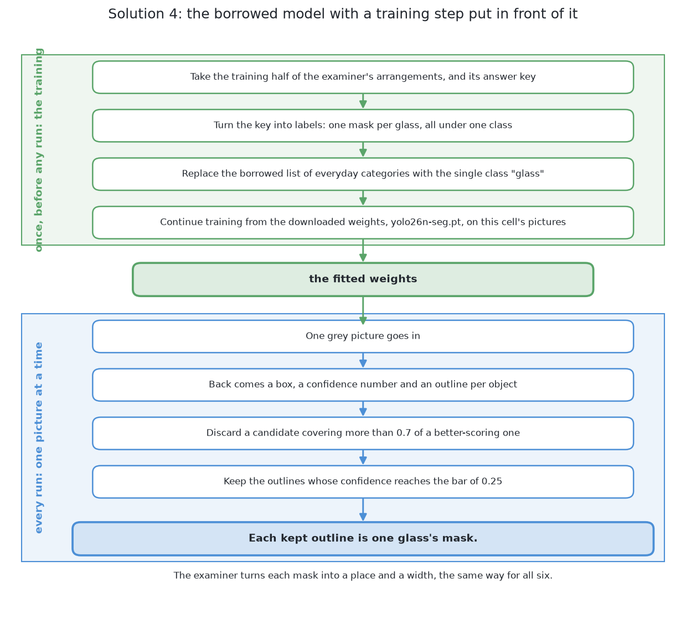
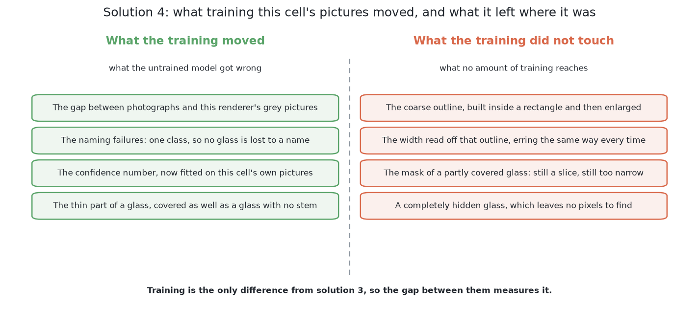

# The same model, fine-tuned

This page describes the fourth of the six solutions in about eight minutes of
reading. It is the same library, the same model and the same downloaded weights
as [a borrowed model, as it downloads](04_a-borrowed-model-as-it-downloads.md),
with one thing added: its training is continued on this cell's own pictures. The
pair is the cleanest comparison in the book, because nothing else varies between
them, so whatever separates their scores is what training bought. By the end of
this page you will know what fine-tuning is, why the list of categories is cut
to a single class, what the training costs, what it scored on the shared test
examiner, and why the licence is the one weakness no amount of engineering removes.
The full treatment is in [the chapter on this
solution](../08_the-same-model-fine-tuned/01_what-it-is.md), which is about
three quarters of an hour of reading.

## Contents

1. [What it is](#1-what-it-is)
2. [How it works](#2-how-it-works)
3. [What it needs](#3-what-it-needs)
4. [What it scored](#4-what-it-scored)
5. [Where it is strong and where it breaks](#5-where-it-is-strong-and-where-it-breaks)
6. [When to choose it](#6-when-to-choose-it)

## 1. What it is

**Fine-tuning** means taking a model whose weights have already been fitted to
one large collection of pictures and continuing that same training on a much
smaller collection of your own, so that the general machinery it learned is kept
while its opinions are moved towards the pictures it will actually be shown. It
sits between the two extremes the other solutions occupy. [A network trained
from scratch](03_a-network-trained-from-scratch.md) starts from random numbers
and has to learn everything from this cell's pictures alone. [A borrowed model,
as it downloads](04_a-borrowed-model-as-it-downloads.md) keeps somebody else's
opinions and changes nothing. This solution keeps the machinery and changes the
opinions.

It is the standard repair for a domain gap, and the domain gap here is severe:
the borrowed weights were fitted on photographs of everyday rooms, while this
cell renders a grey picture shaded from depth readings, and solution 3 found ten
glasses out of a hundred because of it. So this solution is the direct test of
whether that repair works.

## 2. How it works

The method is solution 3's method with a training step in front of it, so this
section is mostly about the training.

**The training set costs nothing.** The examiner renders each arrangement together
with an answer key recording which glass owns each pixel, and a mask is a
selection over that key, so an exact label for every glass is produced for free.
This matters more than it sounds: the usual reason not to fine-tune a model is
that somebody has to draw the outlines by hand, and here nobody does. The
training half of the arrangements is used, including crowded arrangements the
cell's own placement rule would never produce, and the other half is held back.

**The list of categories is cut to one class, "glass".** The borrowed model
arrives able to name dozens of everyday objects. A model cannot be trained
towards this cell's own labels while still being asked which everyday object it
is looking at, so the general list is replaced by the single class. This is
worth naming because it is a second change alongside the training, not a
separate decision taken beside it: it comes with the training, so nothing varies
between solutions 3 and 4 that the training did not bring, and the pair stays a
clean measurement.

**The output and the arithmetic after it are unchanged.** For each object the
fitted model returns a rectangle, a confidence number and an outline of the
pixels inside that rectangle. Candidates that overlap a better-scoring candidate
too heavily are discarded, the outlines scoring above a bar are kept, and [the
examiner](../03_the-examiner/01_the-examiner.md) turns each kept mask into a place on the
table and a rough width with the same shared arithmetic it uses for all six.

What training closes is the gap between the pictures: the model stops looking
for the light passing through a glass and starts recognising the shapes this
renderer draws. What training cannot touch is the shape of the output. The
outline is still built coarsely inside a rectangle and then enlarged, so its
edge still carries an error that does not average away, and the mask still marks
only pixels where the camera actually saw the glass.

## 3. What it needs

It needs the **Ultralytics package** and the downloaded weights, which the
package fetches by itself. That file is large, comes from outside the project,
and is not something to commit beside the code. It needs **PyTorch** reaching
this machine's integrated graphics through Metal Performance Shaders, Apple's
own layer for that; there is no separate
graphics card here, and memory is shared between the graphics processor and the
main processor, which is what lets a model this size be trained at all on this
machine.

It needs **a training set**, which the examiner renders and labels for nothing, and
**time on the machine** for the training run, far less than a start from random
numbers would need but not nothing. It needs **a held-out half** of the
arrangements, both for setting the bar on the confidence number and for checking
that the model learned the glasses rather than the arrangements, and the examiner
provides exactly that.

Once fitted it needs **a file of weights kept in step with the cell**. Change
the camera, the way depth is shaded into grey, or the range of proportions a
kind of glass is drawn from, and the file is quietly out of date in a way no
test of the code would notice. At run time it needs one pass over one picture,
which is a small fraction of the seconds an arm movement costs, so the cost of
this solution sits almost entirely in building it rather than in running it.

The licence is the expensive part, and this solution carries it twice over.
Ultralytics YOLO26-seg is **AGPL-3.0**, the third version of the Affero General
Public License, whose network clause reaches a product
that only ever serves answers over a network. Solution 3 runs the downloaded
weights and nothing more; this one produces a *new* weights file by continuing
the training of those weights, and a file derived from an AGPL work is bound by
the same terms. So the output of the training run is not a clean asset the
project owns outright, and it cannot be relicensed by having been trained here.

## 4. What it scored

The two sets of arrangements are the ones every solution is given: spawned
layouts at the cell's own spacing, and crowded layouts closer than that.

| | found | missed | merged | position median | mask covered | mask not the glass |
|---|---|---|---|---|---|---|
| spawned, 100 glasses | 99 | 1 | 0 | 5.5 mm | 99.8% | 4.4% |
| crowded, 101 glasses | 73 | 28 | 1 | 0.9 mm | 99.3% | 3.9% |

**Read this table beside solution 3's, because that is what the pair is for.**
Ten glasses found became ninety-nine; four became seventy-three. Nothing changed
except that the model was trained on the pictures it would be shown. That is the
measurement of what fine-tuning bought in this cell, and it is large.

**Its masks cover more of the glass than any other solution's**, on both sets,
which is the column that separates methods when the positions cannot. Against
that, 4.4% of each mask was not the glass, which is the highest figure of the
six, so its outlines are generous: they cover the glass completely and reach a
little beyond it. That is the enlargement error training could not remove, and
it is a reasonable trade for a cell where a mask is used to find a place to
grip. The full table for all six is in [the results](../11_the-results.md).

## 5. Where it is strong and where it breaks

**It answers the question actually asked**, one outline per object, so nothing
has to be converted and no step has to find a seam in a joined region. **It is
fitted on the pictures it will be shown**, which is the single strongest thing
about it and the thing its partner cannot claim: the domain gap is closed by
construction rather than left to hope. **Its labels cost nothing.** And **it has
little to set by hand** — no grouping distance and no seam threshold, only a
confidence bar and an overlap allowance, both plain numbers rather than lengths
that have to be defended against the geometry of the cell.

Against that, three kinds of weakness.

**What it inherits from the model.** The enlarged outline carries a width error.
The masks mark only what the camera saw, so a partly hidden glass is reported as
a smaller glass in the wrong place, and a completely hidden one is invisible. The
confidence number is about the class and not about the mask, so a badly cut
outline can still score highly.

**What it owes to being trained.** A fine-tuned model becomes good at this cell
and worse elsewhere, so its weights are a narrow asset to be kept in step. A
small or uniform training set would teach it the arrangements rather than the
glasses, and only the held-out half would reveal it. And its answer cannot
explain itself.

**What it owes to the licence.** The AGPL reaches both the library and the
weights file the training produces, and that is the one weakness here that no
amount of engineering removes.

## 6. When to choose it

Choose this when a borrowed model nearly works and the labels are cheap. Both
conditions hold here, so this is the solution that produced the best mask
coverage in the book for a modest training run on a laptop. More generally,
fine-tuning is the right default whenever the pictures differ from the ones a
public model was fitted on and somebody can produce a few hundred labelled
examples, which covers most industrial vision work.

Do not choose it if the licence matters. If the work is headed anywhere
commercial, the AGPL on both the library and the derived weights is
disqualifying, and the replacement is straightforward: [a transformer
segmenter, fine-tuned](07_a-transformer-segmenter-fine-tuned.md) does the same
job under Apache 2.0. Do not choose it either if the labels would have to be
drawn by hand in quantity, because then [a foundation model with a
keeper](06_a-foundation-model-with-a-keeper.md) needs far fewer of them.

If you read this page for one reason, read it for the pair. Same library, same
model, same starting weights, same examiner, and the only difference is the
training. **Whatever separates the two scores is what fine-tuning bought, and
nothing else can be blamed for it.**

The code is in
[`src/08_seeing-the-glasses/04-yolo-fine-tuned/`](../../../code/src/08_seeing-the-glasses/04-yolo-fine-tuned)
and it writes its own `results.json` beside itself. The full treatment, with
what one class does, where the training set comes from, and the two ways
training on one cell's pictures goes wrong, starts at [what it
is](../08_the-same-model-fine-tuned/01_what-it-is.md).

← [A borrowed model, as it downloads](04_a-borrowed-model-as-it-downloads.md) · [A foundation model with a keeper](06_a-foundation-model-with-a-keeper.md) →
