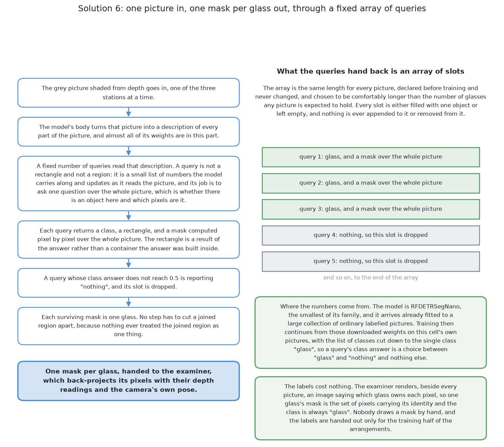

# A transformer segmenter, fine-tuned

This page describes the sixth of the six solutions in about eight minutes of
reading. It is the most modern architecture in the book and the one with
everything fitted here: a transformer that detects and segments in a single
pass, fine-tuned on this cell's own pictures, under a permissive licence. By the
end of this page you will know what makes a transformer segmenter different from
the older shape, why that difference removes a setting somebody would otherwise
have to justify, what it scored on the shared examiner, and why it is the only
one of the six that could be asked for the part of a glass nobody saw. The full
treatment is in [the chapter on this
solution](../10_a-transformer-segmenter-fine-tuned/01_what-it-is.md), which is
about an hour of reading.

## Contents

1. [What it is](#1-what-it-is)
2. [How it works](#2-how-it-works)
3. [What it needs](#3-what-it-needs)
4. [What it scored](#4-what-it-scored)
5. [Where it is strong and where it breaks](#5-where-it-is-strong-and-where-it-breaks)
6. [When to choose it](#6-when-to-choose-it)

## 1. What it is

The model is **RF-DETR-Seg**, published under the Apache 2.0 licence and offered
in a range of sizes, so the size can be chosen to suit the machine. It arrives
with its weights already fitted to a large collection of ordinary labelled
pictures, and training then continues on this cell's own pictures with the list
of classes cut down to the single class "glass", exactly as [the same model,
fine-tuned](05_the-same-model-fine-tuned.md) does.

That is the point of having both. The two are fitted the same way, on the same
pictures, with the same single class and the same free labels, so **the amount
of fitting is held still and the architecture is what changes**. Whatever
separates their scores is about design rather than about training. It is the
natural question to ask once the pair of solutions 3 and 4 has answered what
training is worth at all.

## 2. How it works

The older shape of detector proposes many candidate rectangles, scores them, and
then throws away the ones that overlap a better-scoring candidate too heavily.
That last step needs a number: how much overlap is too much. A transformer
segmenter does not work that way, and the difference is the heart of this
solution.

**The model carries a fixed number of queries.** A **query** is a slot, and each
slot either reports one glass or reports nothing. There is no list of candidate
rectangles to prune, because the slots are matched to the real glasses one to
one while the model is being trained, so each slot learns to be responsible for
at most one glass. This is called **set prediction**: the model is asked for a
set of objects rather than for a scored list of guesses.

Two consequences follow, and both matter here.

**Two glasses whose outlines join were never one region.** They occupy two
slots, so there is nothing joined and nothing to cut apart. No seam has to be
found anywhere.

**There is one fewer number to justify.** Because the matching is one to one,
there is no overlap amount deciding when two claims are duplicates, so nobody
has to choose a value generous enough to survive the worst legitimate overlap
this cell can produce. A score threshold remains, and it is a plain number with
an obvious meaning rather than a length that has to be defended against the
geometry of the cell.

The second difference is where the mask is drawn. The older shape predicts the
outline inside the rectangle it found, so the mask can never reach beyond that
rectangle. Here the mask is predicted over the whole picture, with no rectangle
boxing it in. That is why this is the only one of the six that could be asked
for a glass's *whole* silhouette, including the part standing behind another
glass that nobody saw: with no rectangle to escape, asking for the hidden part
is a change of training target and nothing else. That second way is specified
in the full chapter and was not fitted to completion, so it claims no number
here.

The run itself is short. The grey picture shaded from depth goes in; the model's
body turns it into a description of every part of the picture; the queries read
that description and each returns a class, a rectangle and a mask over the whole
picture; the queries reporting "nothing" are dropped; and [the test
examiner](../03_the-examiner.md) turns each surviving mask into a place and a
rough width with the same shared arithmetic it uses for all six.

## 3. What it needs

This is one of the more demanding solutions in the book to set up.

It needs **a deep learning framework** and the environment to run it, which is a
large dependency for a cell whose simplest answer is a page of arithmetic. It
needs **a downloaded file of weights**, which is large, is fetched rather than
committed with the code, and which this project cannot produce, so it comes from
outside and is taken on trust.

It needs **a training set**, which the examiner renders and labels for nothing,
including the crowded arrangements the cell's own rule would never produce. That
is the genuinely cheap part and it is what makes fine-tuning reasonable here. It
needs **time on the machine** for the fine-tune, far less than a start from
random numbers would need but still the largest cost in the solution.

It needs **hardware it fits on**. The machine here is a laptop whose graphics
processor shares memory with the main processor, reached through Metal
Performance Shaders, Apple's own layer for that; there is no NVIDIA card and no
CUDA. The shared memory is part of why a model this size fits at all, and the
model being offered in a range of sizes is the other part.

Once fine-tuned it needs **a file of weights kept in step with the world**.
Change the camera, the shading, or the range of proportions a kind is drawn
from, and the file is quietly out of date in a way no test of the code will
notice. At run time it needs one pass over one picture, so the cost of this
solution sits almost entirely in building it rather than in running it.

The licence is the one thing it does not need to worry about. **Apache 2.0** is
permissive: the model may be used, changed and shipped inside other work with no
obligation falling on the code around it. That is a real difference from the two
solutions covered by the Affero General Public License, and it is worth knowing
before a choice is made
rather than after.

## 4. What it scored

The two sets of arrangements are the ones every solution is given: spawned
layouts at the cell's own spacing, and crowded layouts closer than that.

| | found | missed | merged | split | position median | mask covered | mask not the glass |
|---|---|---|---|---|---|---|---|
| spawned, 100 glasses | 96 | 4 | 0 | 0 | 4.5 mm | 96.7% | 0.0% |
| crowded, 101 glasses | 78 | 23 | 3 | 2 | 0.5 mm | 97.3% | 0.0% |

**It found more crowded glasses than any other solution**, 78 of 101, where the
examiner's own exact masks manage only 83, because a glass standing wholly behind
another is in no picture at all. On the crowded set it also has the best
position error of the six, at half a millimetre, and none of its masks leaked
onto a neighbour or onto the table in either set.

It is not the best on every column, and the places where it is not are worth
noting. The fine-tuned YOLO found more glasses on the spawned set, 99 against
96, and its masks covered more of the glass on both sets. This solution merged
three crowded pairs and split two glasses, where that solution merged one and
split none. So the honest summary is that the newer architecture wins where the
arrangement is hard and the older one wins where it is easy, and the gap in
either direction is small compared with the gap between either of them and the
untrained model. The full table for all six is in [the
results](../11_the-results.md).

## 5. Where it is strong and where it breaks

**It answers the question actually asked**, one mask per glass, so no machinery
has to convert its answer into something else. **It separates glasses whose
outlines join, and nothing has to decide where to cut.** **It has one fewer
number to justify than the older shape.** **It is the only one of the six that
can be asked for the part of a glass nobody saw**, and that is a consequence of
its shape rather than a feature added on. **And its licence is permissive**,
which matters when the same model has to be shipped inside something else.

Against that:

**Models of this family want patience in training.** The one-to-one matching has
to settle before the slots stop changing their minds about which glass each of
them is responsible for, and the fine-tune has a domain gap to close as well.
That is a cost in training time rather than in correctness.

**Its second way is the easiest thing in the book to implement wrongly.** If
the pixels the model asserts for the hidden part are fed into the shared
arithmetic instead of being named and excluded, the answer gets worse in exactly
the way the way exists to prevent, and nothing complains: the mask looks
better, the footprint stays round, and the width stays inside the range the kind
allows.

**It is blind to a glass hidden completely**, and so is its second way. No
pixels means no slot filled, no low score and nothing to check.

**Its answer cannot explain itself**, and **its weights are a second copy of the
world**, most of which came from somewhere else and cannot be regenerated here.

## 6. When to choose it

Choose this when the work has to ship and the licence has to be clean. It is
close to the best of the six on the hard arrangements, it needs no length
chosen and defended, and Apache 2.0 places no obligation on the code around it.
On any comparison of capability alone it and the fine-tuned YOLO are near
enough to each other that the licence is the deciding difference.

Choose it also when the hidden part of an object is part of the answer, because
no other solution here can be asked for it at all.

Do not choose it if setup cost is what you are short of, because it is one of
the two most demanding solutions to build, and [a foundation model with a
keeper](06_a-foundation-model-with-a-keeper.md) gets a usable answer from
almost no training data. And do not choose it expecting independence from the
depth camera: the only picture this renderer makes is depth shaded into grey,
so this solution needs depth exactly as [rules on the
table](02_rules-on-the-table.md) does.

That last comparison is the one every fitted solution here faces, and it is not
flattering. On any day the depth readings work, the written rule is better in
almost every way that is not accuracy: a page of arithmetic rather than a file
of weights, no training set, failures it explains itself, and the ability to say
where it has not looked. What this solution buys is that no length has to be
chosen, that two joined glasses were never one region, and that the part of a
glass nobody saw can be asked for at all.

The code is in
[`src/08_seeing-the-glasses/06-rf-detr-fine-tuned/`](../../../code/src/08_seeing-the-glasses/06-rf-detr-fine-tuned)
and it writes its own `results.json` beside itself. The full treatment, with
what a transformer segmenter does differently, what set prediction means, and
the second way that trains against the whole silhouette, starts at [what it
is](../10_a-transformer-segmenter-fine-tuned/01_what-it-is.md).

← [A foundation model with a keeper](06_a-foundation-model-with-a-keeper.md) · [Rules on the table — what it is](../05_rules-on-the-table/01_what-it-is.md) →
