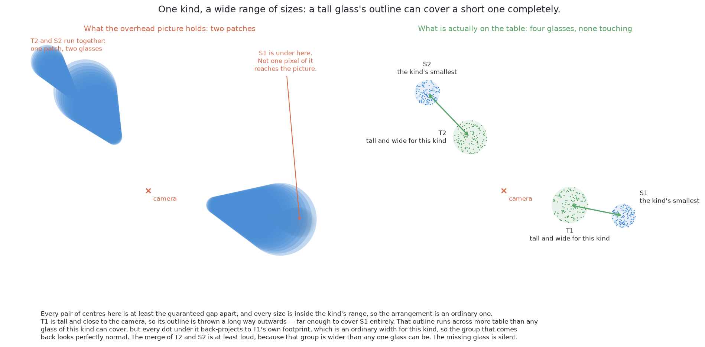

# What it is

> **What it uses** — NumPy for the arithmetic over the depth readings, and
> OpenCV for the picture handling the cell already does. There is no model, no
> weights file, no training data and no licence condition, because no number in
> this solution was fitted to anything.
> **What it does** — Every pixel the camera hands over carries a depth reading,
> and a depth reading is enough to turn that pixel into a point in the room. So
> the solution turns the picture into a crowd of points, drops every point
> straight down onto the table, and groups the resulting dots by nothing more
> than how far apart they are on the table. The rule works where the picture
> cannot: two glasses whose outlines run together in the picture are still
> standing well apart on the table.
> **How the output is produced** — from each picture, keep the pixels whose
> points stand above the table top; turn each kept pixel into a point in the
> room; drop the height; join dots that lie within one chosen distance of each
> other into groups; check each group against the widths this kind of glass is
> allowed, and split a group that is too wide to be one glass; then hand back,
> for each surviving group, the picture pixels its dots came from. Those pixels
> are the mask, and the mask is the whole contribution.
> **What it costs** — no labels, no training time, no graphics processor and no
> licence condition. The whole cost is the thinking needed to state the rule and
> to justify its one setting.

> **The cell is described once, in [the cell](../01_the-cell.md)** — the layout,
> the two places the camera works from, from the top and from the side, all four
> sensors, and the words this project uses them with. What follows is only what
> is specific to this solution.

## Contents

1. [Introduction](#1-introduction)
2. [The problem this solves](#2-the-problem-this-solves)
3. [The main idea](#3-the-main-idea)

## 1. Introduction

This document describes the one answer to [the problem this book
sets](../02_the-problem/01_what-is-asked-for.md) that contains no model of any
kind. It fits nothing. It states a rule, in words a person can read, and applies
it.

The rule is possible because of one fact about the input. Every pixel arrives
with a depth reading beside it, and a pixel with a depth reading is not really
a pixel at all: it is a point in the room, waiting to be worked out. Once the
picture has become a crowd of points in the room, the question "which glass is
this?" stops being a question about the picture and becomes a question about
distance on the table. That change of place is the whole idea, and everything
else in this document follows from it.

**The method is built, and the numbers quoted in this chapter were measured by
running it.** The code is in
[`src/08_seeing-the-glasses/01-rules-on-the-table/`](../../../code/src/08_seeing-the-glasses/01-rules-on-the-table)
and it writes its own `results.json` beside itself. Four things this chapter
describes are still prescriptions rather than code, and each is named where it
appears: the grouping distance is a constant rather than computed from the two
limits it sits between, the fit returns a width and no residual, a group only
one station found is not reported as doubtful, and the branch that works out
where a glass could have been hiding is arithmetic set out here rather than code
that runs.

**No glass's size is written down anywhere.** That is the cell's own rule, so
this document says wider than any glass of this kind can be, or narrower than
the strip of bare table between two glasses, rather than naming a glass. The
figures it does quote — the grouping distance, the guaranteed distance between
centres, the range of widths a kind allows — are limits on the kind or settings
of the method, and never the size of one glass on the table.

## 2. The problem this solves

The situation is the one [this book's problem
statement](../02_the-problem/01_what-is-asked-for.md) sets out. Four to six
drinking glasses of one known kind stand upright inside the rectangle of table
this project calls the glass zone, the camera on the arm's wrist looks down on
them from well clear of the tallest glass, and the job is to say which pixels
belong to which glass.

Two words are used throughout. A **mask** is a picture the same size as the
camera's picture, in which every pixel holds only yes or no, and yes means that
this pixel is believed to show a glass. A **patch** is one group of touching yes
pixels — what you get by starting at a yes pixel and spreading out to every
neighbouring yes pixel until nothing new joins. **One patch is not the same as
one glass**, and that gap is the first difficulty of this problem.

The third thing to have in mind is the promise the problem makes about where the
glasses stand. There is a guaranteed smallest distance between the centres of
any two glasses, and it is wide enough that even the two widest glasses of a
kind leave bare table between their rims. Everything below rests on that strip
of bare table existing, which is why it is stated here rather than assumed
later.

### Why a picture from the top joins two glasses that stand apart

A picture of a tall object is not a picture of its base. The camera looks down,
so a glass's rim is the nearest thing to the lens and the table is the furthest,
and nearer things land further out from the middle of the picture. So a glass's
outline is drawn as though the glass stood further out from the point directly
below the camera than it really does, and **the taller the glass, the further
out it is thrown**. This project calls that effect **splay**, and [the
cell](../01_the-cell.md) derives it in full.

A tall glass is therefore thrown outwards a long way while a short glass
standing beyond it is barely thrown at all, so the tall glass's outline can
reach the short one and pass over it. That gives the two failures this solution
exists to deal with.

**The merge is the loud failure.** If the tall glass's outline reaches the short
one without covering it, the two touch and come back as a single patch. That
patch is wider than any glass of this kind can be, so something can notice.

**The complete cover is the quiet failure.** If the tall glass's outline covers
the short one entirely, the short glass contributes no pixels at all. What comes
back is one patch, of one perfectly ordinary width, with a clean outline, and
nothing about it is wrong. The picture simply holds one glass fewer than the
table does.

## 3. The main idea

Both failures come from the same place: the picture has thrown away the one
thing that separates the two glasses, which is how far apart they stand on the
table. The depth reading beside each pixel gives it back. The pixel says which
direction the camera was looking, the depth says how far along that direction to
travel, and the camera's own pose says where that direction starts, so each
pixel becomes a point in the room. The glasses are then told apart by distance
on the table, and the strip of bare table between two of them — which the
picture could not show — is simply there to be measured.

The second failure is not answered that way, because the pixels of the covered
glass are not there to be measured. It is answered instead by arithmetic that
never looks at the picture's contents, and [when the glasses are completely
hidden](04_a-worked-example.md#1-when-the-glasses-are-completely-hidden) is
where that arithmetic is set out.

← [A transformer segmenter, fine-tuned](../04_the-six-solutions/07_a-transformer-segmenter-fine-tuned.md) · [How it works](03_how-it-works.md) →
