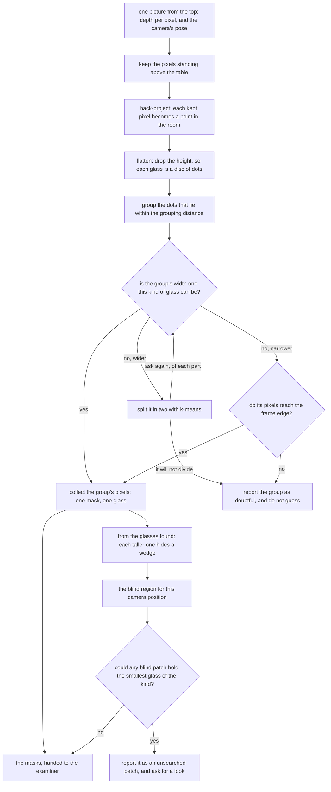

# The code

This page shows the code at the heart of this solution, and says what the
solution hands back to the rest of the cell. It follows [what it
is](01_what-it-is.md), and [how it works](03_how-it-works.md) explains, part by
part, what the code below is doing. The second explains the first,
which is why they are on one page.

## Contents

1. [The rule, in the code](#1-the-rule-in-the-code)
2. [The masks are what this contributes](#2-the-masks-are-what-this-contributes)
3. [How the concepts fit together](#3-how-the-concepts-fit-together)

## 1. The rule, in the code

Before going into why the method is built this way, it is worth seeing it. The
rule the introduction describes is written out in
`src/08_seeing-the-glasses/01-rules-on-the-table/`, and two short pieces of it
carry the whole method: the circle fitted to a group, and the question the fit
is asked again of every part a split produces.
Everything else in the folder is the arithmetic that turns pixels into dots and
the plumbing that hands masks to the examiner.

This is the fit, from `01-rules-on-the-table/find.py`. It runs in five steps,
and the comments in the code carry the same numbers. Step 1 writes each dot as
one row of an equation, because the circle equation multiplied out is a straight
line in three unknowns. Step 2 solves all of those rows at once with NumPy's
`lstsq`, which is one solve and no starting guess. Step 3 reads the circle's
centre off that solution. Step 4 turns the third unknown and the centre back
into a width. Step 5 is the second function, which hands the solve the outline
of the patch rather than every dot in it, using OpenCV's `convexHull`.

```python
def circle_width(dots: np.ndarray) -> float:
    """How wide the circle through a ring of dots is, in one solve and with no starting guess.
    ...
    """
    # Step 1: one row per dot, holding its x, its y and a 1 -- the circle equation written out flat
    terms = np.column_stack([dots, np.ones(len(dots))])
    # Step 2: solve every row at once for D, E and F -- least squares, so no starting guess is used
    solved = np.linalg.lstsq(terms, (dots**2).sum(1), rcond=None)[0]
    # Step 3: halve D and E to get the centre -- that is where the multiplied-out equation puts it
    x, y = solved[0] / 2.0, solved[1] / 2.0
    # Step 4: turn F and the centre back into a width -- held at zero so a bad fit cannot go under
    return 2.0 * float(np.sqrt(max(solved[2] + x * x + y * y, 0.0)))

def footprint(dots: np.ndarray) -> float:
    """How wide the circle round the patch of table a group of dots marks is.
    ...
    """
    # Step 5: fit the circle to the outline of the patch only -- all the dots would read too narrow
    return circle_width(cv2.convexHull(dots.astype(np.float32)).reshape(-1, 2).astype(float))
```

This is the check itself, from the same file, and it is the four outcomes
described below. The step numbers carry on from the fit. Step 6 measures the
patch of table a group's pixels stand on. Step 7 accepts a patch whose width the
kind allows as one glass. Step 8 sends a patch wider than the kind allows to be
split. Step 9 keeps a patch narrower than the kind allows only when its pixels
reach the edge of the frame, and refuses it otherwise. Steps 10 and 11 are the
split: the dots are cut in two with k-means, and a cut that leaves one half
empty ends the attempt. Steps 12 and 13 turn each half back into a mask and hand
it to the examiner to be placed and measured. Step 14 is the repetition, where
the question of step 6 is asked again of the half.

```python
def as_glasses(picture: Picture, one: Found, widths: tuple[float, float]) -> list[Found] | None:
    """The glasses one patch of dots holds, or None if the fitted circles cannot say.
    ...
    """
    # Step 6: measure the patch of table this group's own pixels stand on
    width = footprint(dots_of(picture, one.pixels))
    # Step 7: a width the kind allows means one glass, and this patch is finished
    if widths[0] <= width <= widths[1]:
        return [one]
    # Step 8: wider than the kind allows means more than one glass, so split the patch
    if width > widths[1]:
        return come_apart(picture, one, widths)
    # Step 9: narrower is forgiven only when the frame cut the patch short, else refuse to guess
    return [one] if one.cut_off else None

def come_apart(picture: Picture, one: Found, widths: tuple[float, float]) -> list[Found] | None:
    ...
    # Step 10: cut the patch's dots in two with k-means -- which of the two halves each dot went to
    mine = halve(dots_of(picture, one.pixels))
    # Step 11: a cut that leaves one half empty is no cut, so hand the whole group over as doubtful
    if mine.all() or not mine.any():
        return None
    parts: list[Found] = []
    for half in (~mine, mine):
        # Step 12: turn this half's dots back into a mask of the picture's own pixels
        side = np.zeros(picture.depth.shape, dtype=bool)
        side[one.pixels[half, 0], one.pixels[half, 1]] = True
        # Step 13: let the examiner place and measure the half, as it does any other mask
        measured = masks_to_glasses.one_glass(picture, side)
        if measured is None:
            return None
        # Step 14: ask Step 6 again of the half -- a part still too wide is split again
        got = as_glasses(picture, measured, widths)
        if got is None:
            return None
        parts.extend(got)
    return parts
```

Two things are worth reading off that. The borrowed work is two library calls,
one solve and one hull, and everything around them is this project's own; and
the fitted width never leaves these functions, because the only thing it is
allowed to decide is whether a patch comes apart. The width that goes into the
record is measured by the examiner, from the pixels these functions hand back.

## 2. The masks are what this contributes

Every one of the six solutions is given the same input and judged on the same
output, and the step that turns a mask into a place and a rough width belongs to
the [examiner](../03_the-examiner/01_the-examiner.md) rather than to any solution. So this solution
contributes **only the masks**, and a difference in its score belongs to the
mask. It cannot win by measuring more cleverly and it cannot lose by measuring
worse.

There is one thing about this solution's masks that is true of no other of the
six, and it has to be said plainly because it cuts both ways.

**This solution's masks are a consequence of the grouping rather than the thing
the method produces.** The other five run a model whose job is to draw an
outline: the outline is what they are trained or built to get right, and every
pixel of it is a decision the model made. Here, no step ever asks where a glass
ends. One step decides which pixels stand above the table, and a quite different
step decides which of those pixels belong together. The mask that comes out is
simply the picture pixels that fed one group, collected afterwards. Nobody chose
its edge.

That has a good consequence and a bad one, and they land on the two different
numbers the examiner takes for mask quality.

**How much of the mask was not that glass** should be very good, which is the
good consequence. A pixel is put in the wrong glass's mask only if its dot
chained into the wrong group, and the two groups are a whole strip of bare table
apart, so it takes a line of stray dots across that strip for this to happen at
all. The method also never asserts a pixel it did not see, so it never falls
into the trap the examiner warns about, where a mask claims pixels the camera
never saw the glass at and the depth reading at such a pixel belongs to whatever
stood in front.

**How much of the real glass the mask covered** is where the consequence is bad,
and it is bad in a way that no better grouping can repair. The edge of every
mask here was fixed by the step that kept pixels standing above the table, not
by the grouping, so the mask loses two things by construction. It loses the band
at the very bottom of the glass, where the wall is too close to the table to be
told apart from it, and it loses every pixel the depth camera returned no
reading for. It loses nothing else, but those two are enough: the shortfall is a
thin rim round the base of every glass in every picture, and the grouping rule
never had a chance to recover it, because those pixels were gone before the
grouping started.

The measurement bears both out. Over the five blocks of spaced arrangements
these masks cover 99.1 per cent of the glass at the median, and 0.0 per cent of
a mask is not the glass. The lost band is the missing per cent. On the crowded
arrangements the coverage falls to 91.9 per cent, and that is a different loss
with a different cause: a mask cut out of a run-together group holds part of a
glass rather than all of it, which is the price of the splitting rather than a
property of the depth test.

One thing follows that is about how to read the scores rather than about the
method. A model can learn an outline that follows the glass right down to the
table, so a model has room to beat this solution on coverage; a model can also
learn an outline that wanders onto the table or swallows a neighbour, which this
solution has almost no way to do. **So the two mask numbers are expected to
disagree about which method is better, and that disagreement is itself the
useful result.** It is easy to credit a model with understanding glasses when
what it actually learned was where the table is.

## 3. How the concepts fit together

Put in order, the five concepts make one flow with two branches that share only
their inputs. The left branch groups what was seen. The right branch works out
what could not have been seen. They meet only in the report.



The right-hand branch is the part of that flow worth looking at twice. It takes
its input from the **glasses found** rather than from the pixels, and it needs
their positions, widths and heights and nothing else, which is why it can say
something about a glass that produced no pixels at all. It is also the one
branch of this chart that is arithmetic set out in this chapter rather than code
that runs. [A worked example](04_a-worked-example.md) is where it is worked out.

← [What it is](01_what-it-is.md) · [How it works](03_how-it-works.md) →
