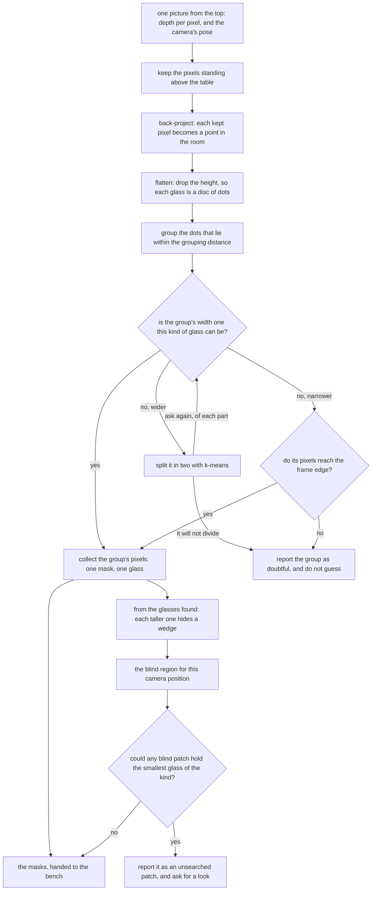

# Rules on the table — the code

This page shows the code at the heart of this solution, and says exactly what
the solution hands back to the rest of the cell. The two belong on one page
because the second explains the first: the code is far easier to read once you
know which of its results leave this solution and which are working detail. By
the end you will be able to point at the lines that produce the masks, and to
see where the ideas of [how it works](02_how-it-works.md) meet.

## Contents

1. [The rule, in the code](#1-the-rule-in-the-code)
2. [The masks are what this contributes](#2-the-masks-are-what-this-contributes)
3. [How the concepts fit together](#3-how-the-concepts-fit-together)

## 1. The rule, in the code

Before going into why the method is built this way, it is worth seeing it. The
rule the introduction describes is written out in
`src/08_seeing-the-glasses/01-rules-on-the-table/`, and two short pieces of it
carry the whole method: the circle fitted to a group, and the question the fit
is asked again of every part a split produces.
Everything else in the folder is the arithmetic that turns pixels into dots and
the plumbing that hands masks to the bench.

This is the fit, from `01-rules-on-the-table/find.py`. The first function is
the one-shot least-squares solve, which is NumPy's `lstsq` and nothing else;
the second hands it the outside of the patch rather than all of the patch,
which is OpenCV's `convexHull`.

```python
def circle_width(dots: np.ndarray) -> float:
    """How wide the circle through a ring of dots is, in one solve and with no starting guess.
    ...
    """
    terms = np.column_stack([dots, np.ones(len(dots))])
    solved = np.linalg.lstsq(terms, (dots**2).sum(1), rcond=None)[0]
    x, y = solved[0] / 2.0, solved[1] / 2.0
    return 2.0 * float(np.sqrt(max(solved[2] + x * x + y * y, 0.0)))

def footprint(dots: np.ndarray) -> float:
    """How wide the circle round the patch of table a group of dots marks is.
    ...
    """
    return circle_width(cv2.convexHull(dots.astype(np.float32)).reshape(-1, 2).astype(float))
```

This is the check itself, from the same file. It is the four outcomes described
below, and the repetition is the last line of the second function asking the
first function again.

```python
def as_glasses(picture: Picture, one: Found, widths: tuple[float, float]) -> list[Found] | None:
    """The glasses one patch of dots holds, or None if the fitted circles cannot say.
    ...
    """
    width = footprint(dots_of(picture, one.pixels))
    if widths[0] <= width <= widths[1]:
        return [one]
    if width > widths[1]:
        return come_apart(picture, one, widths)
    return [one] if one.cut_off else None

def come_apart(picture: Picture, one: Found, widths: tuple[float, float]) -> list[Found] | None:
    ...
    mine = halve(dots_of(picture, one.pixels))
    if mine.all() or not mine.any():
        return None
    parts: list[Found] = []
    for half in (~mine, mine):
        ...
        got = as_glasses(picture, measured, widths)
        if got is None:
            return None
        parts.extend(got)
    return parts
```

Two things are worth reading off that. The borrowed work is two library calls,
one solve and one hull, and everything around them is this project's own; and
the fitted width never leaves these functions, because the only thing it is
allowed to decide is whether a patch comes apart. The width that goes into the
record is measured by the bench, from the pixels these functions hand back.

## 2. The masks are what this contributes

Every one of the six solutions is given the same input and judged on the same
output, and the step that turns a mask into a place and a rough width belongs to
the [test bench](../03_the-test-bench.md) rather than to any solution. So this solution
contributes **only the masks**, and a difference in its score belongs to the
mask. It cannot win by measuring more cleverly and it cannot lose by measuring
worse.

There is one thing about this solution's masks that is true of no other of the
six, and it has to be said plainly because it cuts both ways.

**This solution's masks are a consequence of the grouping rather than the thing
the method produces.** The other five run a model whose job is to draw an
outline: the outline is what they are trained or built to get right, and every
pixel of it is a decision the model made. Here, no step ever asks where a glass
ends. One step decides which pixels stand above the table, and a quite different
step decides which of those pixels belong together. The mask that comes out is
simply the picture pixels that fed one group, collected afterwards. Nobody chose
its edge.

That has a good consequence and a bad one, and they land on the two different
numbers the bench takes for mask quality.

**How much of the mask was not that glass** should be very good, which is the
good consequence. A pixel is put in the wrong glass's mask only if its dot
chained into the wrong group, and the two groups are a whole strip of bare table
apart, so it takes a line of stray dots across that strip for this to happen at
all. The method also never asserts a pixel it did not see. Every pixel in every
mask carried a real depth reading, which means this solution never falls into
the trap the bench warns about, where a mask claims pixels the camera never saw
the glass at and the depth reading at such a pixel belongs to whatever stood in
front. There is nothing for this solution to declare, because it claims nothing.

**How much of the real glass the mask covered** is where the consequence is bad,
and it is bad in a way that no better grouping can repair. The edge of every
mask here was fixed by the step that kept pixels standing above the table, not
by the grouping, so the mask loses two things by construction. It loses the band
at the very bottom of the glass, where the wall is too close to the table to be
told apart from it, and it loses every pixel the depth camera returned no
reading for. It loses nothing else, but those two are enough: the shortfall is a
thin rim round the base of every glass in every picture, and the grouping rule
never had a chance to recover it, because those pixels were gone before the
grouping started.

Two further points follow, and both are about how to read this solution's score
rather than about the method.

The first is that the shortfall is **the same shape for every kind of glass**.
The band lost at the base of a glass with no stem and the band lost at the foot
of a stemmed glass are both bands at the bottom of the glass, so the per-kind
breakdown the bench computes will spread this solution's coverage much less than
it spreads a model's. A model can learn an outline that follows the glass right
down to the table, so a model has room to beat this solution on coverage. A
model can also learn an outline that wanders onto the table or swallows a
neighbour, which this solution has almost no way to do. **So the two mask
numbers are expected to disagree about which method is better, and that
disagreement is itself the useful result.**

The second is that the shortfall is a property of the depth test, which means it
is a property of the input rather than of the rule. Any solution that built its
mask from the standing-above-the-table test would lose the same band, and any
solution that drew its own outline would not. That is worth knowing before
reading the numbers, because it is easy to credit a model with understanding
glasses when what it actually learned was where the table is.

## 3. How the concepts fit together

Put in order, the five concepts make one flow with two branches that share only
their inputs. The left branch groups what was seen. The right branch works out
what could not have been seen. They meet only in the report.



Two things about that flow are worth pointing out, because the textbook version
of this recipe does more work than this one needs.

The first is the saving already described: the standard recipe finds the table
by searching the point cloud for its largest flat surface, while here the
table's height is a constant, so finding the table is a comparison rather than a
search. That is a real saving and it is worth understanding rather than copying,
because if the table were moved or the arm remounted, the constant would be
wrong in a way that a search would not be.

The second is that the right-hand branch takes its input from the **glasses
found** rather than from the pixels. It needs their positions, widths and
heights and nothing else, which is why it can say something about a glass that
produced no pixels at all. The next section is where that branch is worked out.

← [Rules on the table — how it works](02_how-it-works.md) · [Rules on the table — a worked example](04_a-worked-example.md) →
