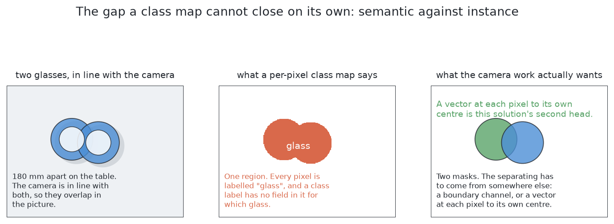
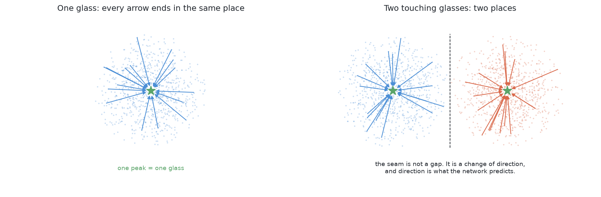

# What it is

> **What it uses** — PyTorch, running on this machine's integrated graphics
> through the MPS backend. One small convolutional network, written for this
> cell and fitted entirely inside it. No downloaded weights and no model from
> anybody else, so there is no licence condition to meet.
> **What it does** — one network looks at a survey picture and answers two
> questions at every pixel. The first question is whether the pixel is glass.
> The second question, asked only of the glass pixels, is which way the middle
> of that pixel's own glass lies. Each glass pixel then votes for the place its
> arrow points at, so one glass makes one pile of votes and two glasses make
> two piles, and a connected blob of glass pixels comes apart into separate
> glasses without any rule for cutting it having been written down.
> **How the output is produced** — the depth reading goes into the network at
> half size; the first head gives a glass-or-not score at every pixel and the
> second head gives an arrow at every glass pixel; the votes are piled up and
> the peaks are counted; the pixels that voted into one peak are one glass's
> mask; the examiner's shared arithmetic turns each mask into a place and a
> width.
> **What it costs** — a training set of this cell's own pictures with labels,
> a training run before the solution can answer anything, and a file of weights
> that has to be kept in step with the cell. The training run is short enough
> on this machine's integrated graphics that it can be repeated whenever the
> cell changes, and no dedicated graphics card is needed. At run time one pass
> of a small network over a small picture is cheap beside one movement of the
> arm.

> **The cell is described once, in [the cell](../01_the-cell.md)** — the
> layout, the two places the camera works from, from the top and from the side,
> all four sensors, and the words this project uses them with. What follows is
> only what is specific to this solution.

## Contents

1. [Introduction](#1-introduction)
2. [The problem this solves](#2-the-problem-this-solves)
3. [The main idea](#3-the-main-idea)

## 1. Introduction

This document explains how to answer [the problem this book
sets](../02_the-problem/01_what-is-asked-for.md) with a network that is built
and fitted entirely inside this cell, borrowing nothing from anywhere else.
That is the one property worth holding on to while reading, because it is what
makes this solution different from the four learned ones beside it. Each of
those starts from weights somebody else fitted to photographs of the real
world. This one starts from random numbers and learns only from pictures this
project rendered itself.

By the end you will understand four things. You will understand why a network
is wanted here at all, which is that the hard part of this problem is a
grouping rule nobody can write down neatly. You will understand how one small
network answers both the question *is this pixel glass* and the question *which
glass is it*, and why asking the second question as an arrow rather than as a
label is what makes the merge answerable. You will understand where the
training labels come from, and this is the part the chapter is really for,
because there are two quite different answers to it and the second one is the
interesting one. And you will understand why this solution is the control for
the one question the other five cannot answer between themselves.

That last point is worth stating now, because it explains why this chapter
exists even though a borrowed model is easier to set up. Every other learned
solution here carries a **domain gap**, which is the gap between the pictures a
model learned from and the pictures it is asked about. A model fitted to
photographs of kitchens and streets has never seen this simulator's table, this
lens or these four kinds of glass, and nobody can say in advance how much of
what it learned still applies. This solution has no domain gap of any size,
because everything it knows came from this cell's own pictures. Without it, a
good score from a borrowed model proves only that the model is good, and not
that borrowing helped.

## 2. The problem this solves

The problem is the one [this book
states](../02_the-problem/01_what-is-asked-for.md), and this section narrows it
down to the single difficulty this solution is aimed at.

Four to six glasses stand on the table. They are all the same kind, the kind is
known, and they are opaque, so the depth camera gets a reading on them. They
stand far enough apart never to touch. The arm photographs them from the top
and has to say which pixels belong to which glass.

The difficulty is not finding the glass. **It is telling one glass from
another.** Two words are needed to say why. A **mask** is a picture the same
size as the photograph in which every pixel is marked glass or not glass. The
usual step that turns a mask into separate objects is **connected
components**, also called a flood fill: take a marked pixel nobody has visited,
spread out to every marked pixel touching it, call everything you reached one
object, and repeat.

A flood fill answers exactly one question, which is *are these pixels joined?*
And joined is what two glasses in a survey picture often are, because a camera
looking straight down throws each glass's outline outwards from the point below
the lens, so each glass covers more of the picture than its footprint on the
table deserves. Two glasses with clear table between them can therefore leave
one connected shape, and a method that treats one connected shape as one object
reports one glass where two are standing.

**Training harder does not remove that difficulty, because it is a limit on the
shape of the answer rather than on the quality of the fit.** A picture that
labels every pixel with a class is called **semantic** segmentation. A picture
that labels every pixel with a class *and* with which object it belongs to is
called **instance** segmentation. This problem asks for the second. A perfectly
fitted class map still merges two joined glasses, because "glass" is the only
value it has room to hold, and a value that is the same everywhere cannot mark
a boundary. So the fix is not a better network. **It is a different output**,
and that is what the second half of this solution's network is.

## 3. The main idea

The main idea has two halves. The first half is a claim about this cell rather
than about networks, and the second half is the different output just promised.

**This cell is narrow, so the network can be small.** Consider how little
varies here. There is one class to predict, glass or not glass. There is one
kind of glass at a time, drawn from inside that kind's range of proportions.
There is one camera with one lens. There is one simulator with one lighting
setup. The glasses are always upright and always opaque. Almost all the variety
a general-purpose model is built to absorb simply does not occur here, so a
small network has enough capacity for the job — and a small network with an
endless supply of labelled pictures is something that can be fitted from
nothing on an ordinary machine.

**The second half is that each glass pixel is asked for an arrow instead of a
label.** At every pixel it calls glass, the network predicts a short arrow
pointing towards the middle of that pixel's own glass — strictly, towards the
middle of its rim, which is what the camera draws from above. Add the arrow to
the pixel's own position and the result is a **vote** for where that middle is.
One glass makes one pile of votes, because all of its pixels point at the same
middle. Two glasses make two piles, because each glass's pixels point at their
own middle. So counting glasses becomes counting piles, and splitting a blob
becomes asking which pile each of its pixels voted into.

Two things about that are worth noticing immediately, because they are why this
design is chosen over the obvious alternatives.

**Nothing has to find a boundary, so nothing can get a boundary wrong.** Where
two glasses meet in the picture, the pixels do not change at all. What changes
is the direction the arrows point: the pixels on one side point one way and the
pixels on the other side point the other way. The seam between them is a
consequence rather than something anything has to locate.

**A wrong vote is outvoted rather than fatal.** A glass seen from the top
covers many pixels, so it casts many votes, and a handful of them pointing the
wrong way are a handful of strays in a pile of many. Compare that with
predicting the seam directly, where one missing pixel along the seam rejoins
two objects completely.

The rest of this chapter builds that up: what exists in code and what is a
design, what training from scratch means, the shape of the network and its two
heads, the two places the training labels can come from, what the solution hands
to the examiner, the failures no amount of training can fix, and where this sits
among the other five.

← [Rules on the table — how it compares](../05_rules-on-the-table/06_how-it-compares.md) · [How it works](02_how-it-works.md) →
