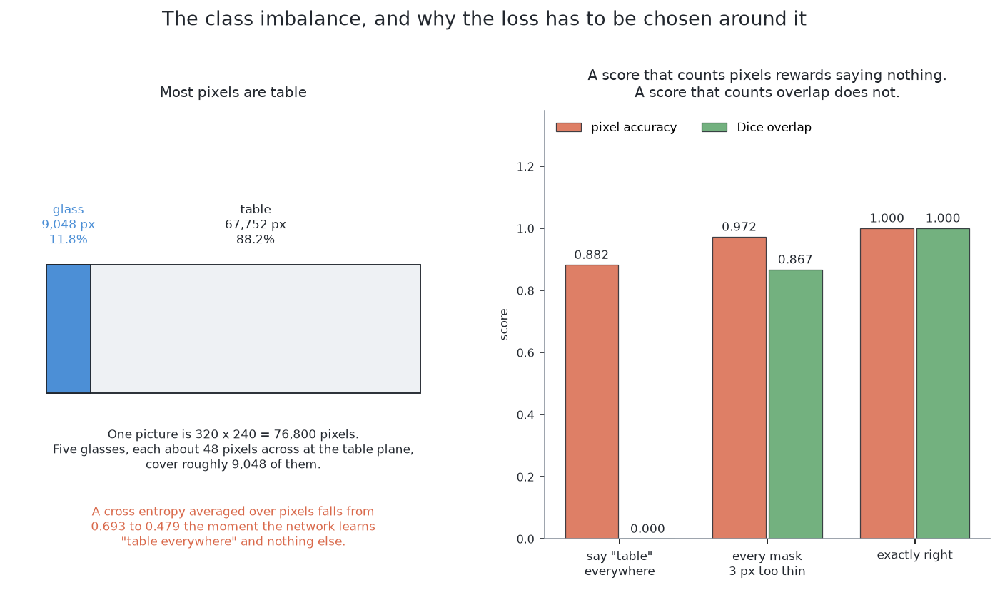
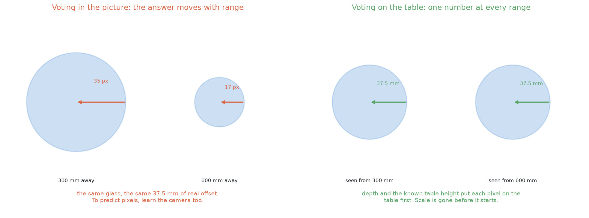
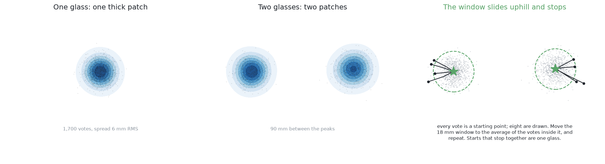
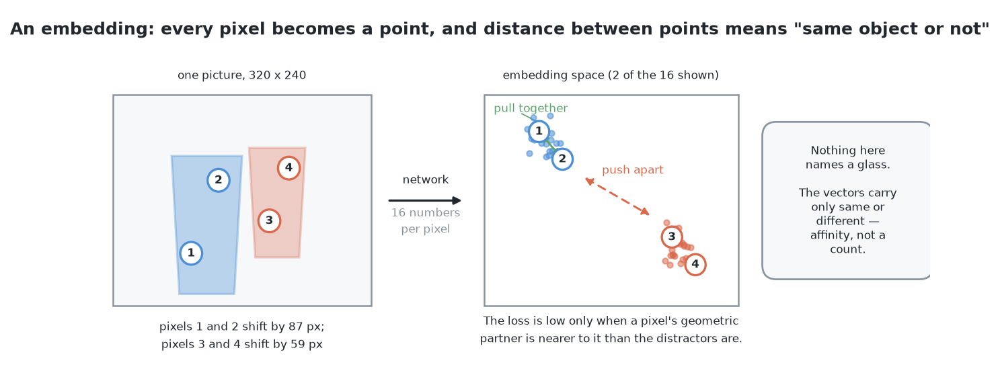
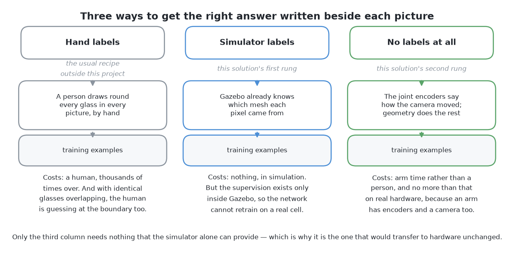

# How it works

This page explains what happens inside this solution, part by part. It
follows [what it is](01_what-it-is.md), which states the question the
solution answers and the single idea it rests on.

## Contents

1. [What exists in code, and what is a design](#1-what-exists-in-code-and-what-is-a-design)
2. [What a network is, and what training from scratch means](#2-what-a-network-is-and-what-training-from-scratch-means)
3. [Why nothing is borrowed, and what that buys](#3-why-nothing-is-borrowed-and-what-that-buys)
4. [The shape of the network](#4-the-shape-of-the-network)
5. [The first head: which pixels are glass](#5-the-first-head-which-pixels-are-glass)
6. [The second head: which way is the middle of my own glass](#6-the-second-head-which-way-is-the-middle-of-my-own-glass)
7. [From votes to glasses](#7-from-votes-to-glasses)
8. [The two ways: where the labels come from](#8-the-two-ways-where-the-labels-come-from)
9. [The first way — labels from the answer key](#9-the-first-way--labels-from-the-answer-key)
10. [The second way — labels from the arm's own movement](#10-the-second-way--labels-from-the-arms-own-movement)
11. [The training set](#11-the-training-set)

## 1. What exists in code, and what is a design

**What exists.** A network of the shape described below is written in this
project's code, with the two heads this document describes, in PyTorch on this
machine's integrated graphics. Its training labels are read from the
simulator's own record of which glass each pixel shows, its votes are piled up
into a tally, and the peaks of that tally are picked off largest first. Running
it on the shared [examiner](../03_the-examiner/01_the-examiner.md) is built too, trained on
arrangements below the examiner's dividing line and scored on held-out ones above
it.

**What is a design.** Four things here are written and not built: the two fixes
for the rare class in the loss, the check on a pile's fitted width, the alarm
on how far a pile's votes sit from their own peak, and the whole of the second
way. Each is named where it appears.

## 2. What a network is, and what training from scratch means

Three words need defining first, because everything after this uses them.

A **neural network** is a program whose behaviour comes from numbers fitted to
examples rather than from rules anybody wrote. Those numbers are called
**weights**. They start as random noise, and **training** shows the network an
example, compares what it produced against the answer wanted, and nudges every
weight in the direction that would have helped. Nobody can read the resulting
rule back out afterwards.

**Fine-tuning** means not starting from random numbers: you take a network
somebody else fitted to a large collection of labelled photographs, replace its
last layer, and carry on training. It is the standard advice because labelled
real pictures are scarce, so a borrowed network cuts the number of labels you
need by a large factor. **Training from scratch** starts from random numbers
instead, which is normally the worse choice for that same reason. It is the
right choice here, and the next section is why.

## 3. Why nothing is borrowed, and what that buys

The usual argument for fine-tuning rests on labels being scarce. Here they are
not.

**Labels in this cell are free and exact.** The examiner renders every picture
itself, so it also knows which glass every pixel shows, and asking for that
record costs no more than asking for the picture. There is no annotator, so
there is no annotator's budget and no annotator's mistakes. Training from
scratch on an endless supply of exact labels is a quite different proposition
from training from scratch on a few hundred hand-drawn ones.

**And borrowing brings a domain gap, which this solution is the only learned
one without.** A borrowed model's weights say what the world looked like in the
photographs it was fitted to, and this cell is a simulator with one table, one
lens and four kinds of glass that no photograph collection contains. Nobody can
say in advance how much of that still applies, so this solution is the line
with no borrowed knowledge in it at all, and the distance between it and the
four borrowed ones measures what borrowing was worth.

What that costs is in [what it needs](05_what-it-needs.md#1-what-it-needs): a
training set, a training run and a file of weights to keep in step with the
cell. Rules on the table pays none of them.

## 4. The shape of the network

The shape is the standard one for labelling every pixel of a picture. It has a
**down path** and an **up path**, joined across the middle.

The down path starts with the picture and applies **convolutions**. A
convolution takes a small square window, slides it over the picture, and at
each position multiplies the values inside the window by a fixed set of weights
and adds them up. One set of weights produces one output channel, and many
sets produce many channels, so a convolution turns a picture of a few channels
into a block of numbers of many channels. Between groups of convolutions the
block is **halved**, meaning it comes out half as wide and half as tall, while
the number of channels is doubled.

Two things happen on the way down and they pull against each other. Each
halving throws away exactly *where* something is, because one unit now stands
for a whole patch of the picture, and each halving also means the next window
covers four times as much of it. So deeper units know less precisely where they
are looking and more about what is around them. **That trade is the entire
reason for going down**, because an arrow towards the middle of a glass cannot
be predicted by a pixel that can only see itself.

The up path reverses the halving, enlarging the block step by step until it is
back to the size of the picture it started from, and narrowing the channels as
it goes. A final convolution with a window of exactly one pixel, so no mixing
across space at all, collapses the channels to the handful of output values
this solution wants at each pixel.

The up path alone cannot work, because the deepest layer knows there is a glass
roughly over *there* but the halvings destroyed which exact pixel its rim sits
on, and enlarging cannot invent a detail that was thrown away. So the detail is
kept instead: before each halving a copy of the block is set aside, and on the
way back up it is attached as extra channels, so fine detail comes across on
the copy while context comes up from below. Those copies are called **skip
connections**, and a network built this way is a **U-Net**, from Ronneberger,
Fischer and Brox, 2015 ([arXiv:1505.04597](https://arxiv.org/abs/1505.04597)).

### What goes in

The network is given the depth reading turned into something like a height
above the table, and two further channels that say where in the frame each
pixel sits. All three go in at half size, which is four times quicker to train
on and still leaves a glass many pixels across.

The last of those looks like a strange thing to tell a network. A camera
looking straight down throws a glass's outline outwards from the point below
the lens, and further the taller the glass is, so the direction from a pixel to
the middle of its own glass depends on where in the frame that pixel is seen.
Telling the network where each pixel sits hands it the one fact it cannot see.

### The warning worth checking before training

One piece of arithmetic is worth doing **before** trusting this shape, and it
follows from the trade on the down path. How much of the picture one deep unit
depends on is called its **receptive field**: each convolution extends it a
little at whatever scale it is working at, and each halving doubles that scale.

Turn the deepest layer's field into a distance on the table and compare it with
the smallest gap the cell guarantees between two glasses. **If that patch of
table is smaller than the gap, the one layer with enough context to reason
about a neighbour cannot see two glasses at once.** Adding a halving fixes it,
at the price of several times as many weights in the deepest block. Whether the
extra depth is needed here is not known, and two things could rescue the
shallower shape: the up path's own convolutions widen the field further, and
the evidence that separates two joined outlines may be local to the seam. It is
flagged because the arithmetic is cheaper than diagnosing a network that
quietly never separates anything.

## 5. The first head: which pixels are glass

The first head is the simpler. It has one output channel, it gives one number per pixel, and that
number is how sure the network is that the pixel is glass. A function that
squashes any number into the range zero to one turns it into a probability, and
a threshold on that probability is the mask.

Training needs a **loss**, which is one number saying how wrong an answer was
and which the nudging tries to reduce. The ordinary loss for a yes-or-no answer
per pixel is **binary cross entropy**: being sure and right costs almost
nothing, being sure and wrong costs a great deal, and the penalty is then
averaged over every pixel.

**That average is where the trouble is.** Seen from the top a glass covers a
small patch of a large picture and there are only a handful of glasses, so
glass is the rare class by a wide margin. A network can lower the average a
long way by learning one thing, which is to say "not glass" everywhere, and it
has then been rewarded for producing an empty picture. This is worst early in
training, when saying nothing is the easiest improvement available.

Two standard fixes exist, and **both are prescriptions here rather than
descriptions of what is built**.

The first is to **weight the rare class up**, multiplying every glass pixel's
contribution by the ratio of the two class sizes, so that saying nothing is no
longer an improvement. The second is to **add a loss that measures overlap
rather than counting pixels**. The **Dice coefficient** is twice the number of
pixels both the answer and the truth call glass, divided by the total number
either calls glass, so it is one for a perfect match, zero when they share
nothing, and has no term for the table at all. Using one minus Dice alongside
the weighted cross entropy is the usual recipe, from Milletari and colleagues,
2016 ([arXiv:1606.04797](https://arxiv.org/abs/1606.04797)).

The general lesson is worth more than the detail: **a score that rewards saying
nothing will be optimised by a network that says nothing.**

## 6. The second head: which way is the middle of my own glass

The first head stops exactly where the problem starts asking which glass is
which. The second head keeps the network's shape and its training recipe
unchanged and adds two output channels holding the two parts of an arrow.
Nothing else changes, which is why the two heads are one network and not two.

### Why the arrow is an easier question than it looks

The arrow runs from a pixel to the middle of its own glass, so the longest
arrow that can occur is half the widest footprint the cell handles. Every
target is therefore a pair of numbers inside a small known box, and **a target
that is bounded is far easier to fit than an unbounded one**.

The second head also spends none of its capacity on the easy question, because
the loss is applied **over glass pixels only**: a table pixel has no correct
arrow, since there is no glass for it to point at. And the arrow is scored in a
way that does not let a handful of wild pixels dominate every update, because
pixels at the edge of a glass may genuinely belong to either of two glasses,
and a loss that squares every error would let them drown out the many pixels
that are nearly right.

### Which frame the arrow is measured in

The two reasonable answers give the network two different jobs.

**The arrow can be measured in the picture.** Then the target is a shift of so
many pixels across and so many down, and the network is predicting something
about the photograph. This is what the built network does, and it is why the
network is also told where in the frame each pixel sits: the same glass seen
near the middle of the frame and seen out at the edge needs a different arrow,
and the position channels are what let the network tell those two cases apart.

**Or the arrow can be measured on the table.** Depth with the camera's pose
turns a pixel into a place on the table, so the arrow could be a distance there
instead, and it would then not depend on the camera at all: the same glass
would demand the same answer wherever the camera stood. The price is that the
arrow would need the depth reading at run time, so the solution would lose the
one thing it gets for free by working on the picture, which is an answer that
does not depend on depth coming back. Real glassware returns almost no depth,
which is why the choice is worth stating rather than assuming.

## 7. From votes to glasses

Each glass pixel now has a vote, and one glass's votes should land in one tight
pile, so the remaining question is where the votes pile up.

**What is built counts them.** Every vote is added into a tally the size of the
picture, the tally is smoothed a little so that votes landing on neighbouring
places reinforce each other, and then the largest place in the tally is taken
as a middle, the votes around it are set aside, and the next largest place is
taken, until no place has enough votes left to be a glass. The pixels whose
votes landed near one middle are that middle's glass.

**The published method for the same job is mean shift.** Put a circular window
down on one vote, move it to the average position of the votes inside it, and
repeat until it stops moving; each move is a step uphill towards thicker votes,
and the votes whose windows stop in the same place are one pile (Comaniciu and
Meer, 2002). Its important property is what it does **not** need to be told:
nothing has to say how many piles to expect, which matters here because in this
problem the count *is* the answer.

Both forms have one number to choose, which is how close two votes have to be
to count as the same pile, and it is pinned at both ends before anything is
run. The **floor** is the spread of one glass's own votes, because a smaller
window fits inside one pile and climbs some lump within it, so one glass comes
back as several peaks. The **ceiling** is the closest two middles can ever be,
two of the narrowest glasses of the kind standing as close as the cell allows,
because a window reaching much more than half of that covers both middles and
the two piles merge. There is comfortable room between the two limits, and a
careless choice fails quietly: a merged pile looks perfectly tight.

Two checks go with the counting. The first is in the built code; the second is
a prescription.

**A pile needs enough votes.** A glass seen from the top covers many pixels, so
a pile built from a small fraction of the votes a whole glass should cast is
doubtful however tight it looks. A glass reduced to a crescent down one edge
votes only from that crescent, and those votes agree closely with each other
while being wrong together.

**A pile needs a believable width.** The pixels that voted into one pile are
fitted with a circle on the table, and a pile whose fitted width falls outside
the range this kind of glass can be is not reported, whatever the votes say. So
the network proposes and the arithmetic disposes: a learned part decides which
pixels group together, and a rule nobody trained decides whether the result is
believable.

## 8. The two ways: where the labels come from

Nothing above says where the training labels come from, and that question has
two answers. The network, the heads, the votes and the checks are the same in
both: **only the source of the labels changes**, which is why the two are ways
of one solution rather than two solutions. The first way takes its labels from
the examiner's answer key, which makes them free and exact. The second takes them
from the arm's own movement, which makes them neither, and buys something else
instead.

## 9. The first way — labels from the answer key

The examiner renders every picture itself, so alongside the grey picture and the
depth reading it has an **id image**: at every pixel, which glass that pixel
shows, or nothing. The [examiner](../03_the-examiner/01_the-examiner.md) describes it in full,
including the rule that a method may be trained on id images from the training
half of the arrangements and is never given one while answering. This way is
built on that permission.

From an id image both heads' labels fall out by arithmetic. **The first head's
label is the id image with the identities forgotten**: a pixel is glass if the
id image names any glass there, with nothing to judge and nothing to draw.
**The second head's label is a subtraction**: for a pixel the id image assigns
to one glass, the target arrow is that glass's middle minus the pixel's own
position, and the examiner knows both ends exactly because it put the glass there.

So the labels cost no more than the picture and hold no judgement that could be
wrong, which is the whole reason training from scratch is sensible here.

The weakness of this way is not in the labels but in what they depend on. The
id image comes from the simulator's own record, and a real camera on a real
table has no such record, so the day the cell meets real glasses this way has
to be labelled again by somebody drawing round things. The second way removes
that dependency.

## 10. The second way — labels from the arm's own movement

The second way asks the same network the same two questions with no answer key
at all, reading nothing from the simulator's record even during training.

What replaces it is one fact about this cell. **The camera is on the wrist, so
the arm knows exactly how it moved the camera between two pictures**, because
that movement is commanded and then read back from the joint encoders rather
than estimated from the pictures. For two pictures of a scene that stood still,
geometry then says where each surface point must have landed in the second,
given how far away it is. Points on one glass move together, and points on a
glass at a different distance move by a different amount. **That agreement is
the label.**

### Parallax: the shift goes as one divided by the depth

The effect the way lives on is called **parallax**. When the camera slides
sideways, a surface moves across the picture by the slide divided by how far
away the surface is, so near things move a lot and far things move a little.

Two consequences matter. The relationship is one divided by the depth, so it is
steep close up and nearly flat far away: the same difference in depth is worth
a great deal of separation near the camera and almost nothing far from it. And
the separation between two surfaces' shifts grows in step with the slide, so **a
longer slide buys more separation, in proportion**, which turns the arm into a
dial and lets this way say in advance how far it must move to settle a doubt.

### Why the slide has to be sideways, and why the top view is the weak case

Parallax separates two surfaces by how far apart **in depth** they are, so it
separates two glasses only when the gap between them is much larger than the
range of depths each glass covers by itself. That comes out differently at the
cell's two camera positions.

**From the top it is a weak signal, for two reasons.** Two glasses of one kind
have their rims at nearly the same height, so from straight above there is
almost no depth gap between the objects. And each glass by itself runs from its
rim down to the table far below, so both cover the same wide range of depths,
and two ranges of shifts lying on top of each other cannot be told apart
however far the camera slides.

**From the side the geometry turns over.** A glass standing in line behind
another is much further back than either glass is wide, so the gap between the
objects is large while the range each covers by itself is only its own width.
The two sets of shifts end up far apart, which is what parallax needs. The arm
already slides the camera sideways at every survey station, so a slide taken
deliberately for this purpose is the same kind of movement, just longer.

So this way's labels come mostly from pictures taken from the side, with one
plain consequence. **The labels for the hardest case, the merge in a picture
from the top, are the ones this way is worst at producing**, because that is
where parallax is weak. The way still trains the network that runs on pictures
from the top, since training and running are separate, but the supervision it
gets for the merge is weaker than the answer key's. That is the price of not
reading the answer key.

### What an embedding is

The first way could turn its labels into targets directly, because the answer
key says which glass a pixel belongs to and therefore where its arrow should
point. Movement gives something weaker: whether two pixels belong together, and
nothing about which glass they are or how many there are. So the output has to
change shape to carry that, and the shape it changes to is called an embedding.

An **embedding** is a short list of numbers the network produces at every
pixel, arranged so that **two lists being close together means the two pixels
belong together**. The numbers mean nothing on their own: there is no channel
that says "glass number two" and no number that counts anything, and only the
distances between lists carry information. Think of giving every pixel a
position on a map with no place names and no scale, where the only question
allowed is how far apart two pixels are. The map is the embedding, and the
network's job is to draw it.

### What contrastive training does

Two pixels whose shifts agree to within the measurement noise are a **positive
pair**, on the same surface, and two whose shifts differ by clearly more are a
**negative pair**. Those two verdicts are all movement gives and all this
training needs.

**Contrastive training** turns them into a loss. Pick a pixel, take its
positive partner and a handful of negative ones, and make the loss low only
when the partner's list is closer than every one of the negatives'. Training
therefore **pulls** a pixel and its positive partner together on the map and
**pushes** it away from its negatives, and over many pairs the map arranges
itself so that the pixels of one surface sit together, without anybody ever
having said what a glass is.

What that gets right is something no appearance-based rule can. The line the
embedding draws runs where the **depth jumps**, not where the brightness
changes, so two glasses of the same kind, colour and shape are no harder for
this way than two different ones — the exact case that defeats a method
relying on how things look.

What it does not get: **nothing in an embedding names a glass and nothing
counts them.** The map says which pixels belong together, and something else
has to decide how many neighbourhoods there are. So the lists are grouped, each
group becomes a candidate region, and every region goes through the same checks
the first way's piles go through, with the same one number to choose and the same two
limits pinning it. That makes the check after the network less optional here
than anywhere else, because a merged pair comes back from an embedding as one
tidy region with no complaint attached to it.

### What this way buys and what it costs

It buys one thing, and it is about the future rather than about this problem.
**This is the only way whose supervision a real arm also has**, because a real
arm has joint encoders and a wrist camera and that is all this way needs.
Every other fitted solution here, including the first way, learns from labels that
exist only because the pictures were rendered, so every one of them would have
to be labelled again from nothing on real hardware. This one would not.

It costs three things. The labels are **weaker**, and weakest where the problem
is hardest. They are **not free**, because collecting them means moving the arm,
so a training set gathered this way is paid for in arm time rather than render
time. And the way depends on there being something to match between two
pictures, so it is weakest where the pictures are plainest.

So the first way is the way to build for this problem, and the second way is the way to
reach for when the cell leaves the simulator. This cell has a working depth
camera, which measures directly what parallax is being trained to infer, so
here the second way does hard work for information the cell already has.

## 11. The training set

Two decisions about the set of arrangements decide whether the network works at
all, and they apply to both of them equally.

**Spawn the hard case.** The cell's own rule keeps glasses a comfortable
distance apart, and a training set drawn only from that rule never once shows
the network a pair that a page of arithmetic could not already separate. So the
teaching has to happen on pairs standing far closer than the rule allows, which
is what the examiner's crowded family of arrangements is for. But keep the easy
case too, in proportion, or the network quietly learns that there is always a
pair to find. As a general rule, **the edge of the specification should sit
somewhere in the middle of the training set**, so that the network has met
worse than it ever will in use.

**Randomise everything that is not shape.** A simulator will render the same
table under the same light for ever, and a network given a constant will use it
as a clue: if every training picture has the table at the same shade, the
network is free to learn that glass means the pixels that are not that shade.
That rule scores perfectly on the training pictures and on the held-out ones
too, because both came out of the same renderer, and then somebody changes a
light and the network fails for a reason that appears in no number. **Domain
randomisation** is the blunt fix: vary the lighting, the
table's colour and texture, the glass tint, the exposure, the picture noise,
the camera pose and the number and placement of the glasses, over a range wider
than anything expected, so that none of them is a reliable shortcut and shape
is the only thing left that predicts the answer (Tobin and colleagues, 2017,
[arXiv:1703.06907](https://arxiv.org/abs/1703.06907)).

One thing would **not** be varied, which is the camera's lens. The focal length
and the picture size are facts about the camera this cell has rather than
nuisances to be made robust against, and teaching the network to cope with
lenses it will never meet would spend its limited capacity on nothing.

The split between learning and marking is the examiner's: it divides its
arrangements into a training half and a test half, so a network fitted on the
first is marked on the second.

← [What it is](01_what-it-is.md) · [The code](03_the-code.md) →
