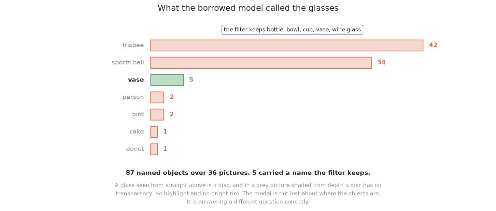

# How it works

This solution has three moving parts and fits none of them. It runs a borrowed
model over the picture, keeps the outlines whose name is on an accepted list, and
sorts what is left by the model's own confidence score. This page takes those
three in turn and says what each one is worth here, which in two cases out of
three is very little.

It follows [the code](02_the-code.md), and explains what each part of that code
is doing.

One thing to settle first, because it explains why this chapter is shorter than
the others. The borrowed model both outlines objects and names them. A model that
only outlines, like the one [solution 5](../09_a-foundation-model-with-a-keeper/01_what-it-is.md)
borrows, has to be followed by something that decides which outlines are glasses,
and that something has to be fitted. Here the naming is already done, so nothing
needs fitting, and that is the whole of why this solution can claim it trains
nothing in this cell.

## Contents

1. [The names, which are a filter and never the kind of glass](#1-the-names-which-are-a-filter-and-never-the-kind-of-glass)
2. [The outline, which is approximate](#2-the-outline-which-is-approximate)
3. [The score, which is not a probability](#3-the-score-which-is-not-a-probability)
4. [The domain gap, which is what broke it](#4-the-domain-gap-which-is-what-broke-it)

---

## 1. The names, which are a filter and never the kind of glass

The model's list of categories was drawn up to describe photographs of the
everyday world. Several entries on it are things a drinking glass could plausibly
be: a stemmed drinking vessel, a plain cup, and a few near neighbours of both.
The cell's four kinds do not line up with those entries, and the model has never
seen these particular shapes.

So the filter accepts the whole group of drinking-vessel categories rather than
one of them, and accepts in exchange that it may admit something that is not a
glass. Being generous was not enough, and the measurement that says so is the
most useful thing this solution produced.
[`what_it_named.py`](../../../code/src/08_seeing-the-glasses/03-yolo-zero-shot/what_it_named.py)
runs the model over 36 held-out pictures with no filter in front of it and prints
every name it offers. **Across those 36 pictures the model returned 87 named
objects, and 5 of them carried a name the filter accepts.**

The model is not blind. It finds things and calls them sports balls and frisbees.
A glass seen from straight above is a disc, and in a grey picture shaded from
depth a disc has no transparency, no highlight and no bright rim, which are the
features that say "glass" in a photograph. What is left is a round silhouette,
and the nearest round silhouettes on the model's list are a ball and a frisbee.
The model is answering a different question correctly.

**The name is thrown away immediately after filtering**, and never written into
the record as the kind of glass. A borrowed category carries an implied size with
it, because the model's idea of a stemmed vessel was formed from photographs of
real ones at the sizes real ones come in. If the name travelled past the filter,
that implied size would travel with it, and a belief about how big a glass is
would enter the cell without anything having measured it. The project's rule is
that no glass's size is written down anywhere, so the name stops at the filter.

One repair is available and is refused. Adding "sports ball" and "frisbee" to the
accepted list would lift the score at once, and it would be choosing the filter
after looking at the answers, which is the single thing this solution exists not
to do.

---

## 2. The outline, which is approximate

A model of this kind does not draw an outline pixel by pixel. It computes a short
list of coarse pattern images once for the whole picture, and then returns a few
weights per object. The outline is the weighted sum of those patterns, cut at a
threshold and enlarged to the size of the picture. It is the same move as
approximating a curve by a short weighted sum of fixed basis functions: a handful
of terms captures the broad shape of almost anything, and no handful captures a
fine detail that none of the basis shapes contains.

**A thin part of a glass is the first thing lost.** A stem is narrow compared with
the bowl above it, so it is exactly the detail a coarse pattern cannot hold. This
solution found 12 glasses of the two kinds with a stem and 20 of the two without.
On the kinds with a stem, the block medians run from 44 to 79 per cent of the
glass covered. On the kinds without one, from 99.8 to 100.0.

Twelve glasses prove little, and the direction is at least consistent across all
five blocks. Whether the coarse outline or the borrowed weights are to blame is
settled in [the same model, fine-tuned](../08_the-same-model-fine-tuned/03_how-it-works.md),
where the same outline machinery is given hundreds of glasses to be measured on.
The answer there is not the one expected here.

**The enlargement shows up in the width.** The shared arithmetic reads a glass's
width from how far its mask reaches from the axis, so an outline a little too
generous reports a glass a little too wide. The error does not cancel over many
glasses, because the enlargement errs the same way every time. On the few glasses
this solution found, 3.3 per cent of the mask was not the glass at the median,
against 0.0 for the rule written by hand.

---

## 3. The score, which is not a probability

Each outline arrives with a number the model offers as its confidence. A number
is a **calibrated** probability when its claims come true about as often as it
says they will. Whatever calibration this model has was obtained on photographs,
and a model's confidence is the first thing to drift when the input changes,
usually becoming too sure rather than too cautious.

What survives the change better than the numbers is their **order**, because
ranking only needs the scores to move in the right direction, not to be honest
about their size. So the design uses the number to sort the outlines and to set a
bar below which an outline is ignored, and treats that bar as a knob set by hand
and checked on the examiner's training half. Calling it a probability would claim
a property nobody has measured.

This is the one place the solution could be improved without abandoning its
promise: fitting a small correction from the model's scores to honest
probabilities needs no outlines drawn by hand, only arrangements where the answer
is known. It is kept out of the baseline because the baseline's whole value is
that it fits nothing, and it would not have saved this solution in any case. The
outlines that were lost were lost to their names and never reached the bar.

---

## 4. The domain gap, which is what broke it

Everything above assumes the borrowed model works at all on this cell's pictures.
It does not, and the reason has a name. A **domain gap** is the difference between
the data a model was fitted on and the data it is used on.

Models usually fail across such a gap by producing confident, plausible, wrong
answers, which is worse than nonsense because nothing downstream looks suspicious.
Here the gap is large enough to produce the blunter failure as well, which is
silence. Each block of 20 held-out arrangements is 60 pictures, and **the model
named no drinking vessel at all in 49 to 58 of the 60 when the glasses were
spaced, and in 56 to 60 of the 60 when they were crowded.**

The gap runs in both directions.

**The picture is not a photograph.** The cell gives a solution a grey picture
shaded from how far away each surface is. A borrowed model's strength on real
photographs comes largely from real light: shading as a surface curves, the
texture of a table, a shadow where an object meets the surface, and colour
differences that separate one object from the one behind it. Very little of that
is here.

**The glasses are not photographed glasses either**, and this direction is the
one that is easy to forget. What tells a model in a photograph that it is looking
at a glass is the transparency, the highlight along one side and the bright line
on the rim. This cell renders its glasses as solid shaded shapes, so the strongest
evidence for the model's own category is absent and only the silhouette is left.

That second direction is why this failed as completely as it did, and it is what
makes [the same model, fine-tuned](../08_the-same-model-fine-tuned/01_what-it-is.md)
the interesting comparison. That solution takes this same model and continues its
training on this cell's pictures, which is the standard repair for exactly this
gap. The difference between the two is a clean measurement of what the gap costs,
and it is the most useful thing this solution contributes to the chapter.

← [The code](02_the-code.md) · [A worked example](04_a-worked-example.md) →
