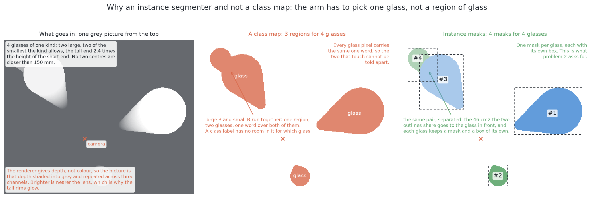

# What it is

> **What it uses** — the Ultralytics package, with PyTorch underneath reaching
> this machine's integrated graphics through its MPS backend. The model is
> Ultralytics YOLO26-seg: the same library, the same model and the same
> downloaded weights as [solution 3](../07_a-borrowed-model-as-it-downloads/01_what-it-is.md), with its training
> continued on this cell's own pictures and its list of everyday categories
> replaced by a single class, "glass".
> **What it does** — a model that arrives fitted to photographs of everyday
> objects is not thrown away and not used as it is. Its numbers are kept and its
> training is continued on pictures of this cell, with one class instead of the
> general list, so that it stops being a general describer of photographs and
> becomes a finder of glasses in this room. The outlines it then returns are the
> answer this book asks for.
> **How the output is produced** — a survey picture from the top goes in, and a
> survey is three of them from three overlapping stations, each asked about on
> its own because that is the examiner's arrangement for all six. The
> fitted model returns, for each thing it believes it has found, a box, a number
> saying how sure it is, and an outline of the pixels inside that box which
> belong to the object. Candidates that overlap a better-scoring candidate too
> heavily are discarded, and the outlines scoring above a bar are kept. Each
> kept outline is one mask, and the examiner's shared arithmetic turns a mask into
> a place on the table and a rough width.
> **What it costs** — labels are free, because the examiner's own id image gives
> an exact mask for every glass on the training half of the arrangements.
> Training time is real but modest, because the model starts from somebody
> else's numbers rather than from random ones, and it runs on this machine's
> integrated graphics. The licence is the expensive part: Ultralytics YOLO26-seg
> is AGPL-3.0, and a weights file fine-tuned from it is bound by the same terms.

> **The cell is described once, in [the cell](../01_the-cell.md)** — the
> layout, the two places the camera works from, from the top and from the side,
> all four sensors, and the words this project uses them with. What follows is
> only what is specific to this solution.

## Contents

1. [Introduction](#1-introduction)
2. [The problem this solves](#2-the-problem-this-solves)
3. [The main idea](#3-the-main-idea)

## 1. Introduction

This document explains how to answer [what this book asks
for](../02_the-problem/01_what-is-asked-for.md) by taking a model that was
already fitted elsewhere and continuing its training on pictures of this cell.
The method has a name, **fine-tuning**, and it is the ordinary way a borrowed
model is put to work on a particular job. Nothing here is unusual, and that is
deliberate: this is the standard move, written out in full so that what it buys
could be measured rather than assumed.

**This solution is built, and most of this document was written before it ran.**
What it scored is recorded beside the code, in
[`04-yolo-fine-tuned/README.md`](../../../code/src/08_seeing-the-glasses/04-yolo-fine-tuned/README.md)
and in that folder's `results.json`. The reasoning below is kept in the voice it
was written in, so where it says what the method would do, read that as what the
design expected. The few places where the marking has since answered a question
say so.

**The whole reason this solution exists is that it is one half of a matched
pair.** [Solution 3](../07_a-borrowed-model-as-it-downloads/01_what-it-is.md) is this model with no training in
this cell. This is the same model with training in this cell. Everything else
between the two is held still, and it is worth listing exactly what "everything
else" means, because the list is the argument. The [examiner](../03_the-examiner/01_the-examiner.md)
holds the input still, so both are shown the same pictures of the same
arrangements in the same order. It holds the output still, so both return the
same record per glass. It holds the marking still, so both are measured by the
same numbers computed the same way. And these two solutions hold the library,
the model and the starting weights still, because they are the same library, the
same model and the same downloaded file. One thing differs, which is the
training, and the training brings one further change with it that is worth
naming plainly: the borrowed list of everyday category names is replaced by the
single class "glass", because a model cannot be trained towards this cell's own
labels while still being asked which everyday object it is looking at. That
change belongs to the training and cannot be had separately, so nothing varies
between the two that the training did not bring. That is why **the gap between
solution 3 and this one is a measurement of what fine-tuning buys, and of
nothing else.** That is a rare thing to be able to say about two methods, and it
is the spine of this document.

By the end you will understand what fine-tuning is and why it needs far less
data and far less time than starting from random numbers, what changes when the
general list of everyday categories is replaced by a single class and which of
solution 3's failures that removes outright, where the training set comes from
and why labelling it costs nothing here while it would be the most expensive
part of the same work on real pictures, which of solution 3's weaknesses
training repairs and which it cannot touch, and the two ways training on one
cell's pictures can go wrong.

## 2. The problem this solves

This book asks for one record per glass, each with a mask, a place on the table
and a rough width, and [what is asked
for](../02_the-problem/01_what-is-asked-for.md) names three difficulties.
The second of them is the one a model attacks: two glasses standing well apart
on the table can still leave one connected shape in the picture, because a
camera looking straight down from the top throws each glass's outline outwards
away from the point directly below it, and the taller the glass the further out
it is thrown. A method that treats each connected shape as one object then
reports one glass where two are standing.

A model built to find objects answers that difficulty by the shape of its
output, because it returns **one outline per object** rather than one outline
per connected shape. Solution 3 already borrows such a model, so that part of
the answer is available without training anything. The question this solution
exists to answer is therefore a narrower and more interesting one: **having
borrowed the finding, what is still wrong, and does training fix it?**

Three things are still wrong in solution 3, and all three have the same cause.
The model was fitted on photographs, and this cell renders a grey picture shaded
from depth, in which opaque glasses stand as plain shapes with no transparency,
no highlight on the rim and no texture anywhere. First, the model is working
with a fraction of the evidence it learned to use, so it may find the glasses
poorly or not at all. Second, its list of categories belongs to somebody else,
so a glass may be named under one of two neighbouring everyday categories and
reported twice, or named under a category the filter does not accept and
reported not at all. Third, the number it offers as its confidence was fitted on
photographs, so a bar set on that number means nothing here.

Training on this cell's own pictures is the standard repair for all three at
once, and that is what this solution does.

## 3. The main idea

The idea is one sentence long: keep the borrowed numbers, and continue training
them on the pictures the model will really be shown, with one class instead of
the general list.

Three things follow from that sentence, and the rest of this document is those
three things.

**The numbers do not start from nothing.** A model's weights are the numbers
inside it, and training them from random values would mean teaching the model
everything, down to the fact that an edge is worth noticing. The borrowed
weights already hold that. So training continues from them rather than beginning
beside them, which is why a model of this size is reasonable on this machine,
which has no separate graphics card.

**The pictures are this cell's pictures.** This is the part that makes the
difference to solution 3. Solution 3 asks a model fitted on photographs to work
on a grey picture shaded from depth, which is a different kind of picture.
Fine-tuning does not ask that. It shows the model the grey pictures during
training, so at run time the model is being shown the kind of picture it was
fitted on. The difference between the two kinds of picture is called the
**domain gap**, and fine-tuning is how a domain gap is closed.

**The class list has one entry.** The general list of everyday categories is
replaced by a single class, "glass". So the model no longer has to decide which
everyday object it is looking at. It only has to find instances, and every
instance it finds is a glass or is nothing.

Everything else about the model is unchanged, including the thing that limits
it. Its outline is still built coarsely, for reasons described below, and
training cannot make a coarse outline fine.

← [A borrowed model, as it downloads — how it compares](../07_a-borrowed-model-as-it-downloads/06_how-it-compares.md) · [How it works](02_how-it-works.md) →
